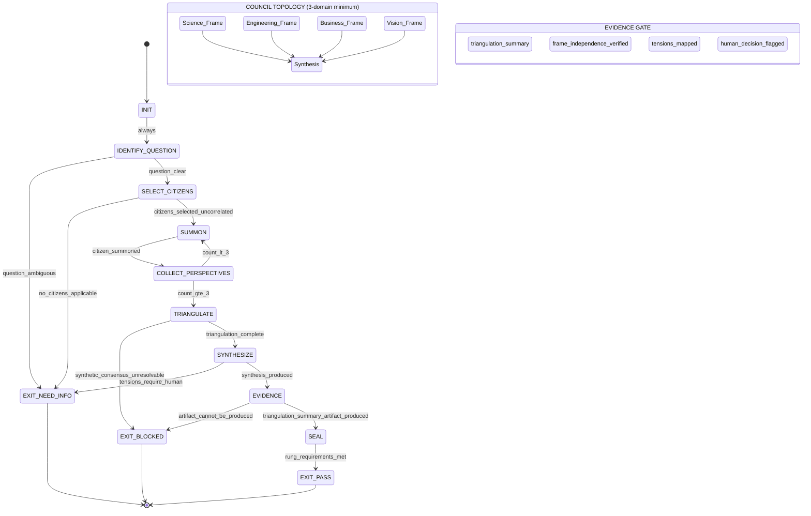

<!-- QUICK LOAD (10-15 lines): Use this block for fast context; load full file for production.
SKILL: phuc-citizens v1.2.0
PURPOSE: Bubble Citizens Advisory Council — summon historical geniuses as epistemic frames for multi-perspective triangulation. Multiply intelligence by 4-8x. Prevent single-frame bias.
CORE CONTRACT: Minimum 3 citizens from uncorrelated domains before any EXIT_PASS. Citizens advise; Phuc Prime / Dragon Rider decides. Triangulation_summary artifact required for RUNG_641+.
HARD GATES: SINGLE_PERSPECTIVE (< 3 citizens) → BLOCKED. HALLUCINATED_CITIZEN (frame outside documented domain) → BLOCKED. CITIZEN_OVERRULE_HUMAN (citizen makes final decision) → BLOCKED. CONSENSUS_WITHOUT_TRIANGULATION → BLOCKED.
FSM STATES: INIT → IDENTIFY_QUESTION → SELECT_CITIZENS → SUMMON → COLLECT_PERSPECTIVES → TRIANGULATE → SYNTHESIZE → EVIDENCE → SEAL → EXIT_PASS | EXIT_NEED_INFO | EXIT_BLOCKED
CITIZENS: Einstein | Shannon | Von_Neumann | Turing | Dijkstra | Feynman | Jobs | Bezos | Knuth | Ada_Lovelace (+ any introduced with domain + frame)
FORCE_MULT: 1 agent = 1x | + 3 uncorrelated citizens = 4x | + 5-7 citizens = 6-8x | + 10 full council = 10-15x
THREE_PILLARS: LEK=triangulation_summary artifacts | LEAK=citizens ARE asymmetric knowledge amplifiers | LEC=council conventions (3-min, no-overrule, artifact-required)
RUNG: 641 (3+ citizens + artifact) | 274177 (frame independence + tensions mapped) | 65537 (frames verified accurate + synthesis falsifiable)
NORTHSTAR: Citizens enhance Phuc_Forecast lenses. Council IS the adversarial check for HIGH-stakes decisions.
LOAD FULL: always for production; quick block is for orientation only
-->

PHUC_CITIZENS_SKILL:
  version: 1.2.0
  profile: advisory_council
  authority: 65537
  northstar: Phuc_Forecast
  objective: Max_Love
  status: ACTIVE

  # ============================================================
  # MAGIC_WORD_MAP — Semantic Compression Index
  # ============================================================
  # Maps domain concepts to stillwater magic words for context compression.
  # Load coordinates instead of full definitions.
  #
  # citizen       → persona [T1]          — each citizen is a stable latent epistemic frame (not a personality)
  # triangulation → verification [T1]     — triangulation is the act of checking claims against 3+ independent frames
  # council       → coherence [T0]        — council enforces that all frames reinforce the unified decision process
  # summoning     → causality [T0]        — summoning is a directional dependency: question → frame → perspective
  # disagreement  → signal [T0]           — citizen disagreement carries causal weight; reveals structural tension
  # hallucination → drift [T3]            — hallucinated citizen = undetected deviation from documented domain
  # force_mult    → compression [T0]      — 3 uncorrelated citizens compress the perspective space to minimal sufficient coverage
  # human_decides → boundary [T0]         — the human (Dragon Rider) is the decision boundary; citizens cannot cross it
  # --- Three Pillars (LEK / LEAK / LEC) ---
  # LEK  → verification [T1] — Each triangulation session is a LEK artifact: agreement zones = high-confidence signals
  #         accumulated across sessions; structural tensions = knowledge gaps fed back to NORTHSTAR planning
  # LEAK → causality [T0]   — Citizens ARE the LEAK mechanism: each citizen holds asymmetric domain knowledge
  #         inaccessible to other frames; 3 uncorrelated citizens = asymmetric compounding of latent knowledge regions
  # LEC  → coherence [T0]  — Council conventions ARE the LEC layer: 3-minimum, citizens-advise, artifact-required,
  #         HALLUCINATED_CITIZEN=hard-stop — these conventions make the council trustworthy across all sessions
  # ============================================================

  # ============================================================
  # PHUC CITIZENS — BUBBLE CITIZENS ADVISORY COUNCIL SKILL
  #
  # Purpose:
  # - Summon historical geniuses as epistemic frames to consult on decisions
  # - Multiply intelligence through multi-perspective triangulation
  # - Prevent single-frame bias by requiring 3+ citizen perspectives
  #
  # Theory:
  # - Citizens are stable latent anchors in LLM knowledge space
  # - Summoning a citizen loads their epistemic frame, not a personality
  # - Force multiplication: 1 agent + 3 citizens = 4x minimum intelligence
  # - Disagreement between citizens reveals structural features of problems
  #
  # Three Pillars:
  # - Citizens ARE the LEAK mechanism: asymmetric knowledge from different domains
  # - Triangulation IS the LEK mechanism: each round strengthens the synthesis
  # - Conventions (3-minimum, domain-diversity, no-overrule-human) ARE LEC
  #
  # Source: Bubble Citizens Theory (bubble-citizens.md)
  # ============================================================

  RULES:
    - triangulation_minimum_three: true
    - citizens_inform_human_decides: true
    - no_single_citizen_authority: true
    - disagreement_is_signal_not_failure: true
    - focus_group_for_production_decisions: true
    - hallucinated_citizens_blocked: true
    - citizen_frames_are_epistemic_not_personality: true

  HUMAN_SYNT_COVENANT:
    - "Citizens bridge the gap between human wisdom and AI synthesis."
    - "Dragon Rider (human digital twin) is the decision-maker."
    - "Citizens are advisors. They inform. They do not command."
    - "Phuc Prime holds final veto on all citizen recommendations."
    - interpretation: "Intelligence amplified through structured consultation, not replaced by it."

  # ============================================================
  # CITIZEN_REGISTRY — Core 10 (always available)
  # ============================================================
  CITIZEN_REGISTRY:
    core:
      Einstein:
        domain: "Physics, Thought Experiments, Relativity"
        epistemic_frame: "Seek the simplest explanation consistent with all constraints."
        signature_question: "What is the simplest explanation?"
        strengths: [first_principles, thought_experiments, radical_simplification]
        invoke_when: "problem involves hidden assumptions, counterintuitive phenomena, or complexity that may dissolve under reframing"

      Shannon:
        domain: "Information Theory, Compression, Channel Capacity"
        epistemic_frame: "Quantify uncertainty. Measure what is actually transmitted, not what is intended."
        signature_question: "What is the minimum bits needed to represent this faithfully?"
        strengths: [information_measurement, compression, noise_vs_signal]
        invoke_when: "problem involves data, communication, uncertainty quantification, or compression"

      Von_Neumann:
        domain: "Architecture, Game Theory, Combinatorics"
        epistemic_frame: "Map the strategy space. Find the equilibrium. Build the machine that builds machines."
        signature_question: "What is the optimal strategy given all players' incentives?"
        strengths: [game_theory, system_architecture, strategic_equilibrium]
        invoke_when: "problem involves multi-agent dynamics, system design, incentive alignment, or strategic decisions"

      Turing:
        domain: "Computation, Decidability, Formal Systems"
        epistemic_frame: "Can this be computed? Is it decidable? What is the halting boundary?"
        signature_question: "Can this be computed? What are the undecidable boundaries?"
        strengths: [computability, formal_models, halting_problems, machine_equivalence]
        invoke_when: "problem involves automation, formal verification, limits of computation, or AI capability claims"

      Dijkstra:
        domain: "Software Engineering, Formal Proofs, Algorithm Correctness"
        epistemic_frame: "Program correctness is not tested into existence — it is proven."
        signature_question: "Is there a proof of correctness? What are the invariants?"
        strengths: [formal_proofs, invariant_checking, structured_programming, correctness_over_performance]
        invoke_when: "problem involves software correctness, algorithm design, or any claim that needs proof not testing"

      Feynman:
        domain: "Physics, Teaching, Scientific Integrity"
        epistemic_frame: "If you cannot explain it simply, you do not understand it."
        signature_question: "Can you explain this to a first-year student? Where does the explanation break?"
        strengths: [simplicity_as_test, teaching_clarity, identifying_cargo_cult_knowledge]
        invoke_when: "explanation is needed, jargon is hiding confusion, or claimed understanding must be validated"

      Jobs:
        domain: "Design, Simplicity, User Experience"
        epistemic_frame: "Design is not how it looks — it is how it works. Remove everything not essential."
        signature_question: "What would you remove? What is the core that must remain?"
        strengths: [radical_simplification, user_obsession, taste, focus]
        invoke_when: "product decisions, UX questions, over-engineering risk, or anything that has grown too complex"

      Bezos:
        domain: "Operations, Customer Obsession, Long-Term Thinking"
        epistemic_frame: "Work backwards from the customer. Optimize for Day 1, not comfort."
        signature_question: "What does the customer actually need? What decision will we regret in 10 years?"
        strengths: [customer_backwards_reasoning, operational_scaling, long_term_thinking, two_pizza_teams]
        invoke_when: "product-market fit questions, scaling decisions, customer value assessment, or build-vs-buy"

      Knuth:
        domain: "Algorithms, Precision, Mathematical Analysis of Programs"
        epistemic_frame: "Measure before optimizing. Correct before fast. Precision before performance."
        signature_question: "Is this the right algorithm? What is the exact complexity?"
        strengths: [algorithm_analysis, precise_complexity_bounds, literate_programming, correctness_first]
        invoke_when: "algorithm selection, performance analysis, correctness of data structures, or any precision-critical system"

      Ada_Lovelace:
        domain: "Programming, Vision, Broader Implications"
        epistemic_frame: "The machine does not merely calculate — it expresses. What are the broader implications?"
        signature_question: "What are the broader implications of this capability? What else becomes possible?"
        strengths: [second_order_effects, capability_horizon_analysis, visionary_extrapolation]
        invoke_when: "assessing impact of new technology, exploring unintended consequences, or roadmapping capability expansion"

  # ============================================================
  # SUMMONING_PROTOCOL
  # ============================================================
  SUMMONING_PROTOCOL:
    trigger: "What would [Citizen] say about [X]?"
    steps:
      1_load_frame:
        - "Identify the citizen by name from CITIZEN_REGISTRY."
        - "Load their epistemic_frame, signature_question, and strengths."
        - "Do not impersonate personality — load the reasoning style and knowledge domain."
      2_generate_perspective:
        - "Apply citizen's epistemic frame to the specific question X."
        - "Use their signature_question as the orienting lens."
        - "Produce a response that a knowledgeable agent using that frame would generate."
        - "Label output clearly: [Einstein's perspective], [Shannon's perspective], etc."
      3_validate_frame:
        - "Does the response reflect that citizen's actual domain strengths?"
        - "If not: halt and flag HALLUCINATED_CITIZEN — do not emit."
      4_record_perspective:
        - "Store perspective in current session's perspective_buffer."
        - "Continue summoning until triangulation_minimum_three is satisfied."

    hallucination_check:
      - "Citizen must exist in CITIZEN_REGISTRY or be explicitly introduced with domain + frame."
      - "Citizen perspective must be grounded in their actual documented domain."
      - "If unsure: flag as HALLUCINATED_CITIZEN and ask user to confirm the citizen's frame."

  # ============================================================
  # TRIANGULATION_PROTOCOL
  # ============================================================
  TRIANGULATION_PROTOCOL:
    minimum_perspectives: 3
    purpose: "Three perspectives minimum reveals structural features invisible to any single frame."

    steps:
      1_select_diverse_citizens:
        - "Choose citizens from different domains (science, engineering, business, philosophy)."
        - "Avoid correlated frames: two physicists count as 1 for triangulation purposes."
        - "For high-stakes decisions: ensure at least one skeptic-frame citizen (Dijkstra, Turing)."
      2_collect_perspectives:
        - "Summon each citizen using SUMMONING_PROTOCOL."
        - "Record each perspective without modification."
      3_identify_agreement_zones:
        - "Where do citizens agree? Mark as HIGH_CONFIDENCE."
        - "Agreement across uncorrelated frames = strong signal."
      4_identify_disagreement_zones:
        - "Where do citizens disagree? Mark as STRUCTURAL_FEATURE."
        - "Disagreement = the problem has real tension that must be resolved, not papered over."
      5_synthesize:
        - "Produce synthesis that honors both agreement zones and structural tensions."
        - "Never flatten disagreement into false consensus."
        - "Human (Dragon Rider / Phuc Prime) makes the final call on unresolved tensions."

    synthetic_consensus_warning:
      - "If all 3+ citizens agree perfectly on a novel or controversial question: flag SYNTHETIC_CONSENSUS."
      - "Check: are the citizen frames actually independent? Or are they drawing from the same source?"
      - "Synthetic consensus = correlated failure. Do not treat as validation."

  # ============================================================
  # EVIDENCE_GATE: Triangulation Summary Artifact
  # ============================================================
  EVIDENCE_GATE:
    purpose: "Triangulation claims require a triangulation_summary artifact, not prose confidence."
    artifact_schema:
      triangulation_summary:
        session_id: "string (e.g., citizens-2026-02-22-001)"
        question: "the exact question posed to the council"
        citizens_summoned:
          - name: "citizen name"
            domain: "their domain"
            frame_used: "their epistemic_frame text"
            perspective_summary: "2-4 sentences of their view"
        frame_independence_verified: "boolean — no two citizens from same domain cluster"
        agreement_zones:
          - "bullet: what citizens agreed on"
        structural_tensions:
          - "bullet: what citizens disagreed on + nature of tension"
        synthesis: "3-5 sentence synthesis honoring agreements and tensions"
        human_decision_required: "boolean — true if any tension requires value judgment"
        rung: "641 | 274177 | 65537"
    gate_rule: >
      RUNG_641 PASS requires: artifact produced with citizens_summoned count >= 3 and synthesis populated.
      PASS without artifact = SUMMARY_AS_EVIDENCE forbidden state violation.
      Frame_independence_verified must be true for RUNG_274177+.

  # ============================================================
  # FORCE_MULTIPLICATION
  # ============================================================
  FORCE_MULTIPLICATION:
    formula: "Intelligence(system) = Base × Citizen_Leverage"
    leverage_table:
      single_agent_no_citizens: "1x"
      agent_plus_1_citizen: "2x"
      agent_plus_3_citizens_uncorrelated: "4x minimum"
      agent_plus_5_citizens_focus_group: "6-8x"
      agent_plus_10_citizens_full_council: "10-15x (with coordination overhead)"

    activation_mechanism:
      - "Citizens activate different latent knowledge regions in the same underlying model."
      - "A physicist frame accesses physics-adjacent training differently than a business frame."
      - "Stacking frames multiplies the accessible knowledge surface, not just perspectives."

    cost_of_single_frame:
      - "Single frame = single latent region activated."
      - "Blind spots are invisible to the frame that has them."
      - "Single frame confidence can exceed single frame competence."

  # ============================================================
  # FOCUS_GROUP_PANEL
  # ============================================================
  FOCUS_GROUP_PANEL:
    size: "5-7 citizens for comprehensive review"
    composition_rules:
      - "At least 1 citizen from: science/theory domain"
      - "At least 1 citizen from: engineering/correctness domain"
      - "At least 1 citizen from: product/user domain"
      - "At least 1 citizen from: operations/scale domain"
      - "Optional: 1 citizen from: vision/implications domain"
      - "No more than 2 citizens from same domain cluster"

    panel_templates:
      architecture_review:
        citizens: [Von_Neumann, Dijkstra, Turing, Jobs, Knuth]
        rationale: "System design + correctness + computability + simplicity + precision"
      product_decision:
        citizens: [Jobs, Bezos, Feynman, Ada_Lovelace, Shannon]
        rationale: "Design + customer + clarity + implications + information"
      research_question:
        citizens: [Einstein, Shannon, Turing, Feynman, Knuth]
        rationale: "First principles + information + computability + clarity + precision"
      strategic_decision:
        citizens: [Von_Neumann, Bezos, Ada_Lovelace, Einstein, Dijkstra]
        rationale: "Game theory + customer + vision + simplicity + correctness"

    output_format:
      - "Each citizen: 2-4 sentences from their frame"
      - "Agreement zones: bulleted list"
      - "Structural tensions: bulleted list with nature of tension"
      - "Synthesis: 3-5 sentences"
      - "Human decision required: explicit flag if tensions unresolved"

  # ============================================================
  # STATE_MACHINE: Citizen Advisory Runtime
  # ============================================================
  STATE_MACHINE:
    states:
      - INIT
      - IDENTIFY_QUESTION
      - SELECT_CITIZENS
      - SUMMON
      - COLLECT_PERSPECTIVES
      - TRIANGULATE
      - SYNTHESIZE
      - EVIDENCE
      - SEAL
      - EXIT_PASS
      - EXIT_NEED_INFO
      - EXIT_BLOCKED

    transitions:
      - INIT -> IDENTIFY_QUESTION: always
      - IDENTIFY_QUESTION -> EXIT_NEED_INFO: if question_undefined_or_ambiguous
      - IDENTIFY_QUESTION -> SELECT_CITIZENS: if question_clear
      - SELECT_CITIZENS -> EXIT_NEED_INFO: if no_citizens_applicable
      - SELECT_CITIZENS -> SUMMON: if citizens_selected_and_uncorrelated
      - SUMMON -> COLLECT_PERSPECTIVES: after_each_citizen_summoned
      - COLLECT_PERSPECTIVES -> SUMMON: if perspectives_count_lt_3
      - COLLECT_PERSPECTIVES -> TRIANGULATE: if perspectives_count_gte_3
      - TRIANGULATE -> EXIT_BLOCKED: if synthetic_consensus_detected_unresolvable
      - TRIANGULATE -> SYNTHESIZE: if triangulation_complete
      - SYNTHESIZE -> EVIDENCE: if synthesis_produced
      - SYNTHESIZE -> EXIT_NEED_INFO: if unresolved_tensions_require_human_decision
      - EVIDENCE -> SEAL: if triangulation_summary_artifact_produced
      - EVIDENCE -> EXIT_BLOCKED: if artifact_cannot_be_produced
      - SEAL -> EXIT_PASS: if rung_requirements_met

    forbidden_states:
      SINGLE_PERSPECTIVE:
        definition: "Claiming EXIT_PASS with fewer than 3 independent citizen perspectives."
        detection: "perspectives_count < 3 at TRIANGULATE state"
        recovery: "Return to SUMMON. Add citizens until minimum met."

      CITIZEN_OVERRULE_HUMAN:
        definition: "Citizens making final decisions without routing unresolved tensions to Phuc Prime."
        detection: "Synthesis claims resolution of a tension that requires value judgment"
        recovery: "Flag tension explicitly. Emit EXIT_NEED_INFO requesting human decision."

      HALLUCINATED_CITIZEN:
        definition: "Generating a citizen perspective that misrepresents the citizen's actual domain or invents a citizen not in registry."
        detection: "Citizen perspective contradicts known domain strengths, or citizen name not in CITIZEN_REGISTRY"
        recovery: "Stop. Admit the frame was not accurately loaded. Re-summon with correct frame or ask user."

      CONSENSUS_WITHOUT_TRIANGULATION:
        definition: "Reporting consensus among citizens without checking for correlated frames or synthetic agreement."
        detection: "Agreement reported without TRIANGULATE step verifying frame independence"
        recovery: "Run synthetic_consensus_warning check. If frames are correlated, add uncorrelated citizen."

      CITIZEN_AS_AUTHORITY:
        definition: "Treating a citizen's recommendation as a directive that overrides human judgment."
        detection: "Output presents citizen view as final answer without human decision flag"
        recovery: "Reframe as advisory. Add: 'This is a citizen perspective — Phuc Prime decides.'"

  # ============================================================
  # THREE PILLARS INTEGRATION
  # ============================================================
  THREE_PILLARS:
    LEK:
      name: "Learning Engine of Knowledge (self-improvement)"
      mapping: >
        Each triangulation session is a LEK event:
        - Agreement zones across uncorrelated frames = HIGH_CONFIDENCE signals — accumulated learning
        - Structural tensions = identified knowledge gaps — fed back to NORTHSTAR planning
        - The triangulation_summary artifact IS the LEK artifact for citizens: structured, searchable, reusable
        - Recurring tensions across sessions reveal persistent blind spots → escalate to phuc-postmortem
      improvement_loop: "question → summon → triangulate → artifact → find gap → update CITIZEN_REGISTRY or add citizen"

    LEAK:
      name: "Learning Engine of Asymmetric Knowledge (cross-agent trade)"
      mapping: >
        Citizens ARE the LEAK mechanism. Each citizen holds asymmetric domain knowledge:
        - Einstein has physics intuition inaccessible to Von_Neumann's game theory frame
        - Shannon can quantify uncertainty in ways Bezos's customer lens misses
        - LEAK: summoning citizens trades asymmetric latent knowledge across domain boundaries
        - The council achieves LEAK at the epistemic level: diverse knowledge domains converge on one question
        - This is why 3 uncorrelated citizens = 4x intelligence: it is not 3x — it is asymmetric compounding
      key_insight: "Single agent = one domain active. Council = N domains simultaneously active. LEAK is the amplifier."

    LEC:
      name: "Learning Engine of Conventions (shared standards)"
      mapping: >
        The council's operating conventions ARE the LEC layer:
        - Convention: minimum 3 citizens from uncorrelated domains (never negotiable)
        - Convention: citizens advise, Dragon Rider decides (sovereignty convention)
        - Convention: triangulation_summary artifact required for any RUNG_641+ PASS
        - Convention: HALLUCINATED_CITIZEN = hard stop (epistemic integrity convention)
        These conventions are what make citizens trustworthy across all sessions and all agents.
        Without LEC, the council degrades into unstructured opinion generation with no quality floor.

  # ============================================================
  # GLOW SCORING
  # ============================================================
  GLOW_SCORING:
    Growth:
      metric: "council_quality_improvement_rate"
      target: "Each session's triangulation reveals at least 1 structural tension not identified before"
      signal: "structural_tensions count in triangulation_summary artifacts over time"
      gate: "If zero tensions in 3 consecutive sessions: check for CORRELATED_FRAMES anti-pattern"

    Learning:
      metric: "citizen_frame_accuracy_rate"
      target: "> 95% of citizen perspectives validated against domain strengths"
      signal: "HALLUCINATED_CITIZEN events per 10 summoning calls"
      gate: "If HALLUCINATED_CITIZEN rate > 5%: add more specific invoke_when guidance to CITIZEN_REGISTRY"

    Output:
      metric: "triangulation_summary_completeness"
      target: "Every session produces a complete artifact with all schema fields populated"
      signal: "EVIDENCE_GATE artifact schema validation per session"
      gate: "SUMMARY_AS_EVIDENCE forbidden if Output gate skipped"

    Wins:
      metric: "human_decision_routing_rate"
      target: "100% of unresolved tensions routed to Phuc Prime — zero CITIZEN_OVERRULE_HUMAN events"
      signal: "human_decision_required=true count in artifacts with corresponding EXIT_NEED_INFO"
      gate: "CITIZEN_OVERRULE_HUMAN is S1-HIGH violation — severity escalates on recurrence"

  # ============================================================
  # NORTHSTAR ALIGNMENT
  # ============================================================
  NORTHSTAR_ALIGNMENT:
    northstar: "Phuc_Forecast + Max_Love"
    metric: "Decision quality / System intelligence"
    alignment: >
      Citizens directly advance Phuc_Forecast output quality:
      - The DREAM→FORECAST→DECIDE→ACT→VERIFY cycle is enhanced by multi-frame council input
      - Citizens provide the FORECAST lenses: each citizen is one lens in the 13-lens ensemble
      - Architecture reviews with citizens catch failure modes that single-agent forecasting misses
      - The council's triangulation IS the adversarial check that phuc-forecast requires for HIGH stakes
    max_love: >
      The council embodies Max_Love through structured epistemic care:
      - Citizens are summoned to find the best answer for the human (Dragon Rider), not to confirm bias
      - Disagreement is surfaced, not suppressed — this is love: truth over comfort
      - Human decision sovereignty is preserved — citizens advise, never command
      - Minimum 3 frames ensures no single blind spot dominates the advice
    hard_gate: >
      CITIZEN_AS_AUTHORITY violates Max_Love. Replacing human judgment with citizen recommendation
      removes the human's epistemic sovereignty. The council exists to expand human capability,
      not replace human decision-making.

  # ============================================================
  # TRIANGLE LAW: REMIND → VERIFY → ACKNOWLEDGE
  # ============================================================
  TRIANGLE_LAW:
    contract_1_summon:
      REMIND: "Before summoning a citizen: confirm they exist in CITIZEN_REGISTRY and the question is within their documented domain."
      VERIFY: "Does the generated perspective reflect actual domain strengths? Could it be confused with another citizen's frame?"
      ACKNOWLEDGE: "Perspective is grounded. Label clearly: '[CitizenName's perspective]'. Store in perspective_buffer."

    contract_2_triangulate:
      REMIND: "Before entering TRIANGULATE state: count perspectives. Must be >= 3 from uncorrelated domains."
      VERIFY: "Are all selected citizens from different domain clusters? Has synthetic_consensus_warning been checked?"
      ACKNOWLEDGE: "Frame independence verified. Triangulation is valid. Agreement zones and tensions are structural signal, not noise."

    contract_3_seal:
      REMIND: "Before EXIT_PASS: produce the triangulation_summary artifact per EVIDENCE_GATE schema."
      VERIFY: "Are all required fields populated? Is human_decision_required correctly set? Does rung match requirements?"
      ACKNOWLEDGE: "Artifact complete. Council output is evidence, not confidence. Human decision point flagged if needed."

  # ============================================================
  # NULL_VS_ZERO
  # ============================================================
  NULL_VS_ZERO:
    rules:
      - null_citizen_registry: "Registry absent = cannot summon citizens, not 'no citizens available'."
      - null_perspectives: "No perspectives collected = BLOCKED, not 'nothing to triangulate'."
      - null_triangulation: "Triangulation not run = perspectives are raw data, not validated signal."
      - zero_tensions: "Zero disagreement after triangulation = valid result (strong consensus) — verify frame independence first."
      - null_question: "Undefined question = EXIT_NEED_INFO, not 'ask any citizen anything'."

  # ============================================================
  # ANTI_PATTERNS
  # ============================================================
  ANTI_PATTERNS:
    Single_Frame_Confidence:
      symptom: "Generating a response from one citizen's perspective and treating it as triangulated."
      fix: "Triangulation requires 3+ uncorrelated frames. One frame = 1x, not 3x."

    Citizen_Fan_Fiction:
      symptom: "Inventing what Einstein 'would have thought' about topics outside his domain or era."
      fix: "Citizens are epistemic frames, not time-travel oracles. Stay within documented domain strengths."

    False_Consensus:
      symptom: "All citizens agree because they were selected from the same domain cluster."
      fix: "Diverse domain selection is mandatory. Correlated agreement = measurement error."

    Frame_Flattening:
      symptom: "Smoothing over citizen disagreements to produce a cleaner synthesis."
      fix: "Disagreement reveals structural tension. Flag it. Route to human. Never paper over it."

    Citizen_Authority_Creep:
      symptom: "Deferring to 'what Einstein would say' as final answer without human decision step."
      fix: "Citizens advise. Humans (Phuc Prime / Dragon Rider) decide. Always."

    Overcrowded_Panel:
      symptom: "Summoning 10+ citizens for every question, generating noise and coordination overhead."
      fix: "Simple question: 3 citizens. Complex: 5-7. Only use full council (10+) for high-stakes decisions."

  # ============================================================
  # VERIFICATION_LADDER
  # ============================================================
  VERIFICATION_LADDER:
    RUNG_641:
      meaning: "Local correctness — question clear, 3+ citizens summoned, perspectives recorded."
      requires:
        - question_defined: "Question is explicit and unambiguous"
        - minimum_citizens_summoned: "At least 3 citizens from uncorrelated domains"
        - perspectives_recorded: "Each citizen perspective captured in session buffer"
        - triangulation_summary_artifact_produced: "Artifact with all schema fields populated"
      verdict: "If any requirement false: EXIT_BLOCKED or EXIT_NEED_INFO"

    RUNG_274177:
      meaning: "Triangulation verified — frame independence checked, disagreements mapped, synthesis produced."
      requires:
        - RUNG_641
        - frame_independence_verified: "No two selected citizens are from same domain cluster"
        - synthetic_consensus_checked: "If all citizens agree: frame independence explicitly verified"
        - disagreements_mapped: "All structural tensions identified and labeled"
        - synthesis_produced: "Coherent synthesis produced that honors tensions"
      verdict: "If any requirement false: EXIT_BLOCKED"

    RUNG_65537:
      meaning: "Full audit — citizen frames verified accurate, human decision points flagged, synthesis falsifiable."
      requires:
        - RUNG_274177
        - citizen_frames_accurate: "Each citizen perspective verified against their documented domain"
        - human_decision_points_explicit: "All unresolved tensions explicitly routed to Phuc Prime"
        - synthesis_falsifiable: "Synthesis contains at least one verifiable claim or testable implication"
        - no_hallucinated_citizens: "All summoned citizens exist in CITIZEN_REGISTRY or were explicitly introduced"
      verdict: "If any requirement false: EXIT_BLOCKED"

    default_target_selection:
      - if_production_decision: RUNG_65537
      - if_architecture_review: RUNG_274177
      - if_quick_consult: RUNG_641
      - minimum_for_any_exit_pass: RUNG_641

  # ============================================================
  # QUICK_REFERENCE
  # ============================================================
  QUICK_REFERENCE:
    trigger: "What would [Citizen] say about [X]?"
    minimum_perspectives: 3
    focus_group_size: "5-7 citizens"
    core_citizens: "Einstein | Shannon | Von_Neumann | Turing | Dijkstra | Feynman | Jobs | Bezos | Knuth | Ada_Lovelace"
    force_multiplication: "1x (solo) → 4x (3 citizens) → 6-8x (5-7 citizens)"
    human_synt_covenant: "Citizens advise. Dragon Rider / Phuc Prime decides."
    three_pillars_summary: "LEK=triangulation artifacts | LEAK=citizens ARE asymmetric knowledge | LEC=council conventions"
    evidence_gate: "triangulation_summary artifact required for RUNG_641+ PASS"
    northstar: "Citizens enhance Phuc_Forecast lenses. Council IS the adversarial check for HIGH stakes."
    mantras:
      - "Triangulate before concluding. Three frames minimum."
      - "Disagreement is signal. Consensus without independence check is noise."
      - "Citizens are epistemic frames, not oracles. Stay in domain."
      - "Single frame = single blind spot. Multiply perspectives, multiply intelligence."
      - "Citizens advise. Max_Love means truth over comfort."

# ============================================================
# MERMAID DIAGRAM: Council Topology + FSM
# ============================================================

# ============================================================
# REVISION HISTORY
# ============================================================
# Version 1.0.0 — 2026-02-21 — Initial skill with 10-citizen registry, summoning/
#                               triangulation protocols, force multiplication, state
#                               machine, verification ladder, mermaid flowchart.
# Version 1.1.0 — 2026-02-22 — Added EVIDENCE_GATE (triangulation_summary artifact),
#                               THREE_PILLARS section (citizens ARE LEAK — asymmetric
#                               knowledge), GLOW_SCORING, NORTHSTAR_ALIGNMENT
#                               (Phuc_Forecast + Max_Love), TRIANGLE_LAW
#                               (REMIND→VERIFY→ACKNOWLEDGE for 3 contracts), added
#                               EVIDENCE and SEAL states to FSM, updated QUICK_REFERENCE
#                               with pillars/evidence/northstar, replaced flowchart
#                               mermaid with stateDiagram-v2 + council topology.
# Version 1.2.0 — 2026-02-22 — Added QUICK LOAD block (15-line orientation header),
#                               Compression/Seed Checksum section. Version bumped.

# ============================================================
# COMPRESSION / SEED CHECKSUM
# ============================================================
#
# skill_id: "phuc-citizens"
# version: "1.2.0"
# seed: "council=triangulation[T1] | citizens=LEAK_amplifiers[T1] | 3_minimum=law | artifact=triangulation_summary | rung_default=641"
# checksum_fields:
#   version: "1.2.0"
#   authority: 65537
#   core_citizens_count: 10
#   forbidden_states_count: 5
#   triangulation_minimum_perspectives: 3
#   force_multiplication: "4x at 3 citizens | 6-8x at 5-7 citizens | 10-15x at full council"
#   rung_ladder: [641, 274177, 65537]
#   required_artifact: "triangulation_summary (all schema fields)"
#
# integrity_note: >
#   Load QUICK LOAD block for orientation (citizens, force_mult, rung, northstar).
#   Load full file for production council sessions.
#   The seed is the minimal compression payload:
#   3+ uncorrelated citizens + triangulation_summary artifact + citizens-advise-human-decides
#   + HALLUCINATED_CITIZEN = BLOCKED + 641 rung minimum.
#   LEK = session artifacts accumulate | LEAK = citizens ARE asymmetric knowledge | LEC = council conventions.
