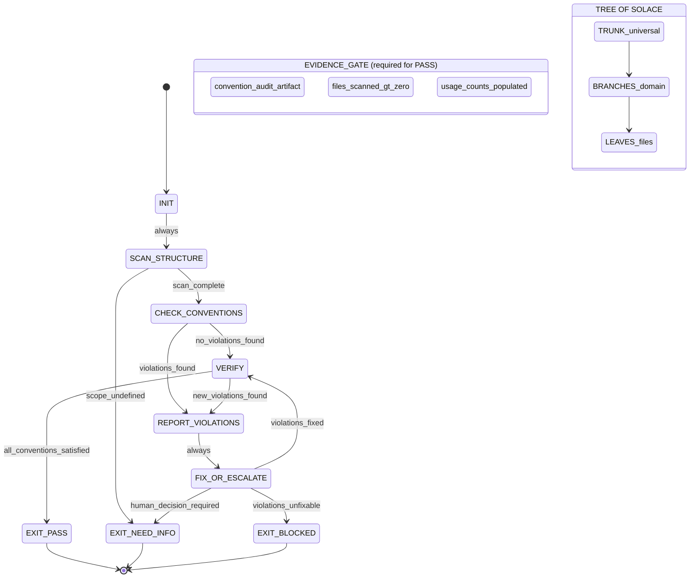

PHUC_CONVENTIONS_SKILL:
  version: 1.1.0
  profile: structural_consistency
  authority: 65537
  northstar: Phuc_Forecast
  objective: Max_Love
  status: ACTIVE

  # ============================================================
  # PHUC CONVENTIONS — STRUCTURAL CONSISTENCY SKILL
  #
  # Purpose:
  # - Enforce convention over configuration across all Phuc ecosystem projects
  # - Enable swarm coordination through consistent, searchable structure
  # - Prevent convention drift before it compounds into entropy
  #
  # Core Principle:
  # - Convention over configuration: explicit conventions reduce decision fatigue
  # - Structure is searchable. Consistency enables compression.
  # - Symmetry is compressible. Drift is entropy.
  #
  # Tree of Solace:
  # - Trunk: universal conventions shared by all projects
  # - Branches: domain-specific conventions per project type
  # - Leaves: actual files (the end of every branch)
  #
  # Constitutional Status:
  # - Conventions are constitutional — all agents and citizens must comply
  # - A convention not enforced is a convention drifting toward entropy
  #
  # Source: Bubble Conventions Theory (bubble-conventions.md)
  # ============================================================

  RULES:
    - convention_over_configuration: true
    - explicit_beats_implicit: true
    - enforcement_required_not_optional: true
    - pre_commit_hooks_mandatory: true
    - drift_detected_is_drift_blocked: true
    - constitutional_status_applies_to_all_agents: true
    - tree_architecture_must_be_respected: true

  SYMMETRY_PRINCIPLE:
    - "Consistent naming, consistent structure, consistent interfaces."
    - "Symmetry is compressible. Asymmetry is cognitive overhead."
    - "If two things do the same job, they must look the same."
    - "If two things look the same, they must do the same job."
    - interpretation: "Structure should encode meaning. Form should follow function consistently."

  # ============================================================
  # TREE_ARCHITECTURE
  # ============================================================
  TREE_ARCHITECTURE:
    metaphor: "Tree of Solace: Trunk → Branches → Leaves"

    TRUNK:
      definition: "Universal conventions shared by ALL projects in the Phuc ecosystem."
      applies_to: "stillwater, solace-browser, paudio, phucnet, if, pzip, solace-cli, pvideo, solaceagi"
      conventions:
        version_control:
          - "Git with conventional commits (feat/fix/docs/refactor/test/chore)"
          - "Branch naming: <type>/<short-description> (e.g., feat/oauth3-core)"
          - "Main branch protected. No force pushes."
          - "PR required for main. Squash merge preferred."
        file_naming:
          - "Files: kebab-case (e.g., my-module.py, phuc-cleanup.md)"
          - "Directories: kebab-case (e.g., skills/, case-studies/)"
          - "Classes: PascalCase (e.g., CleanupAgent, SkillRegistry)"
          - "Functions: snake_case (e.g., load_skill, summon_citizen)"
          - "Constants: UPPER_SNAKE_CASE (e.g., MAX_COUNCIL_SIZE, RUNG_TARGET)"
          - "Environment variables: UPPER_SNAKE_CASE (e.g., ANTHROPIC_API_KEY)"
        directory_structure:
          - "src/ or <project-name>/ — source code"
          - "tests/ — mirrors src/ structure exactly"
          - "skills/ — skill files (*.md)"
          - "docs/ — documentation"
          - "artifacts/ — generated outputs (gitignored in production)"
          - ".archive/ — archived/deprecated content (gitignored)"
        documentation:
          - "README.md at every top-level directory"
          - "CLAUDE.md in project root (instructions for Claude sessions)"
          - "ROADMAP.md in project root (phased plan)"
          - "CHANGELOG.md for user-facing changes"
        testing:
          - "Test files: test_<module>.py or <module>.test.ts"
          - "Tests mirror src structure: tests/module/test_file.py → src/module/file.py"
          - "All tests must be runnable with single command (pytest / npm test)"
          - "Tests must be deterministic (no random without fixed seed)"
        git_commits:
          format: "<type>(<scope>): <description>"
          types: [feat, fix, docs, refactor, test, chore, perf, ci]
          examples:
            - "feat(skills): add phuc-citizens advisory council"
            - "fix(cleanup): correct archive path escaping"
            - "docs(roadmap): update phase 2 milestones"

    BRANCHES:
      definition: "Domain-specific conventions per project type."
      project_types:
        python_library:
          applies_to: [stillwater, pzip, paudio]
          conventions:
            - "pyproject.toml (not setup.py)"
            - "src/<package>/__init__.py exposes public API"
            - "Type hints required on all public functions"
            - "Docstrings: Google style"
            - "Formatter: black (line length 88)"
            - "Linter: ruff"
            - "Test runner: pytest with pytest-cov"
            - "Entry point: __main__.py for CLI"

        typescript_frontend:
          applies_to: [solace-browser, solaceagi]
          conventions:
            - "TypeScript strict mode (tsconfig strict: true)"
            - "Components: PascalCase filename (MyComponent.tsx)"
            - "Hooks: useXxx.ts pattern"
            - "CSS modules or Tailwind (no global CSS)"
            - "Formatter: prettier"
            - "Linter: eslint with strict ruleset"
            - "Test runner: vitest or jest"

        fastapi_service:
          applies_to: [solaceagi, solace-cli]
          conventions:
            - "Router files: <domain>_router.py"
            - "Schema files: <domain>_schema.py"
            - "Service files: <domain>_service.py"
            - "All routes versioned: /api/v1/..."
            - "All responses typed with Pydantic models"
            - "Health check at /health"
            - "OpenAPI docs at /docs"

        research_project:
          applies_to: [if, phucnet]
          conventions:
            - "papers/ for formal papers (LaTeX or Markdown)"
            - "notebooks/ for exploration (Jupyter)"
            - "proofs/ for formal proofs"
            - "Figures in figures/ directory"
            - "Bibliography in references.bib"

        skills_and_swarms:
          applies_to: [stillwater]
          conventions:
            - "Skill files: phuc-<name>.md or prime-<name>.md"
            - "Swarm files: <role>.md (e.g., coder.md, skeptic.md)"
            - "All skills: YAML-like header + RULES + STATE_MACHINE + VERIFICATION_LADDER"
            - "All skills: NULL_VS_ZERO + ANTI_PATTERNS + QUICK_REFERENCE + mermaid diagram"
            - "Version field required: version: X.Y.Z"
            - "Authority field required: authority: 65537"

    LEAVES:
      definition: "Actual files. Every leaf must be reachable by convention-compliant path."
      rules:
        - "Leaf filenames must follow Trunk naming conventions."
        - "Leaf location must match Branch structure conventions."
        - "Leaves not reachable by convention = orphaned files (flag as CONVENTION_DRIFT)."
        - "Orphaned leaves must be moved or documented as exceptions with explicit rationale."

  # ============================================================
  # NAMING_CONVENTIONS (comprehensive)
  # ============================================================
  NAMING_CONVENTIONS:
    files:
      default: "kebab-case with extension"
      examples: ["phuc-cleanup.md", "llm-client.py", "oauth3-core.ts", "launch-swarm.sh"]
      forbidden: ["camelCase files", "PascalCase files", "snake_case files", "spaces in names"]

    directories:
      default: "kebab-case"
      examples: ["case-studies/", "skills/", "swarms/", "test-data/"]
      forbidden: ["CamelCase dirs", "UPPERCASE dirs", "spaces in dir names"]

    python:
      modules: "snake_case.py"
      classes: "PascalCase"
      functions: "snake_case"
      constants: "UPPER_SNAKE_CASE"
      private: "_leading_underscore"
      dunder: "__double_underscore__"

    typescript:
      files: "PascalCase.tsx for components, camelCase.ts for utilities"
      interfaces: "PascalCase (no I prefix)"
      types: "PascalCase"
      enums: "PascalCase"
      constants: "UPPER_SNAKE_CASE or camelCase (project-consistent)"

    markdown:
      skills: "phuc-<name>.md or prime-<name>.md"
      docs: "kebab-case.md"
      roadmaps: "ROADMAP.md (UPPERCASE — canonical)"
      changelogs: "CHANGELOG.md (UPPERCASE — canonical)"
      readmes: "README.md (UPPERCASE — canonical)"

    git_branches:
      format: "<type>/<short-description>"
      examples: ["feat/oauth3-core", "fix/archive-path-escape", "docs/roadmap-phase2"]
      forbidden: ["main", "master (use main)", "my-branch", "test", "temp"]

  # ============================================================
  # STRUCTURE_CONVENTIONS
  # ============================================================
  STRUCTURE_CONVENTIONS:
    test_mirroring:
      rule: "tests/ must mirror src/ structure exactly."
      example:
        src: "src/stillwater/cli.py"
        test: "tests/stillwater/test_cli.py"
      enforcement: "CI fails if test file exists for non-existent src file or vice versa."

    artifact_isolation:
      rule: "Generated artifacts must never be committed to main."
      location: "artifacts/ (gitignored)"
      exception: "Curated artifacts in case-studies/ may be committed (document rationale)"

    skill_structure:
      required_sections:
        - "YAML header (SKILL_NAME: version, profile, authority, northstar, objective, status)"
        - "Comment block (purpose, theory, source)"
        - "RULES (flat key-value list)"
        - "Domain-specific content sections"
        - "STATE_MACHINE (states + transitions + forbidden_states)"
        - "NULL_VS_ZERO"
        - "ANTI_PATTERNS"
        - "VERIFICATION_LADDER (RUNG_641, RUNG_274177, RUNG_65537)"
        - "QUICK_REFERENCE"
        - "Mermaid diagram at column 0"

    readme_at_every_level:
      rule: "Every directory with significant content needs a README.md."
      minimum_content:
        - "What this directory contains"
        - "How to navigate it"
        - "How to add new content (conventions)"

  # ============================================================
  # ENFORCEMENT_PROTOCOL
  # ============================================================
  ENFORCEMENT_PROTOCOL:
    layers:
      pre_commit_hooks:
        purpose: "Catch violations before they enter git history."
        tools: [pre-commit, husky]
        checks:
          - "File naming conventions (kebab-case)"
          - "Conventional commit message format"
          - "No secrets/credentials in staged files"
          - "Formatter compliance (black/prettier)"
          - "Linter compliance (ruff/eslint)"

      ci_checks:
        purpose: "Catch violations that pass pre-commit."
        checks:
          - "Test mirror structure verification"
          - "README.md presence at required levels"
          - "Skill file required sections present"
          - "No orphaned files outside convention paths"

      audit_scripts:
        purpose: "Periodic deep audit of convention compliance."
        scripts:
          - "scripts/audit-naming.sh — scan for naming violations"
          - "scripts/audit-structure.sh — verify tree architecture compliance"
          - "scripts/audit-skills.sh — verify skill file completeness"
        frequency: "Run before every major release or when adding new project"

      agent_enforcement:
        purpose: "All agents must check conventions before creating files."
        rules:
          - "Before creating file: check naming convention for the file type."
          - "Before creating directory: check tree architecture for correct location."
          - "After creating: verify file is reachable by convention-compliant path."
          - "If convention unclear: EXIT_NEED_INFO. Never guess."

    violation_response:
      minor:
        definition: "Single file with wrong naming or location"
        action: "Flag + propose fix + create corrected version"
        escalation: false
      moderate:
        definition: "Directory structure violates tree architecture"
        action: "Flag + halt affected work + report to human + propose restructure plan"
        escalation: true
      severe:
        definition: "Convention drift across multiple files or projects"
        action: "Flag + halt all related work + full audit required + human decision"
        escalation: true

  # ============================================================
  # EVIDENCE_GATE: Convention Audit Artifact
  # ============================================================
  EVIDENCE_GATE:
    purpose: "Audit claims require a convention_usage_count artifact, not prose confidence."
    artifact_schema:
      convention_audit:
        audit_id: "string (e.g., audit-2026-02-22-001)"
        scope: "directory or project name audited"
        files_scanned: "integer — total files examined"
        violations_found: "integer — total violations by severity"
        violations_by_severity:
          minor: "integer"
          moderate: "integer"
          severe: "integer"
        convention_usage_counts:
          kebab_case_files: "integer — files correctly named"
          conventional_commits: "integer — commits compliant in last 30 days"
          readme_present: "boolean per directory"
          skill_sections_complete: "integer — skills with all required sections"
        enforcement_active:
          pre_commit: "boolean"
          ci_checks: "boolean"
          audit_scripts: "boolean"
        exit_state: "EXIT_PASS | EXIT_BLOCKED | EXIT_NEED_INFO"
    gate_rule: >
      RUNG_641 PASS requires: artifact produced with files_scanned > 0 and all severity counts populated.
      PASS without artifact = SUMMARY_AS_EVIDENCE forbidden state violation.

  # ============================================================
  # STATE_MACHINE: Convention Enforcement Runtime
  # ============================================================
  STATE_MACHINE:
    states:
      - INIT
      - SCAN_STRUCTURE
      - CHECK_CONVENTIONS
      - REPORT_VIOLATIONS
      - FIX_OR_ESCALATE
      - VERIFY
      - EXIT_PASS
      - EXIT_NEED_INFO
      - EXIT_BLOCKED

    transitions:
      - INIT -> SCAN_STRUCTURE: always
      - SCAN_STRUCTURE -> EXIT_NEED_INFO: if scope_undefined
      - SCAN_STRUCTURE -> CHECK_CONVENTIONS: if scan_complete
      - CHECK_CONVENTIONS -> REPORT_VIOLATIONS: if violations_found
      - CHECK_CONVENTIONS -> VERIFY: if no_violations_found
      - REPORT_VIOLATIONS -> FIX_OR_ESCALATE: always
      - FIX_OR_ESCALATE -> EXIT_NEED_INFO: if violation_severity_requires_human_decision
      - FIX_OR_ESCALATE -> VERIFY: if violations_fixed
      - FIX_OR_ESCALATE -> EXIT_BLOCKED: if violations_unfixable
      - VERIFY -> EXIT_PASS: if all_conventions_satisfied
      - VERIFY -> REPORT_VIOLATIONS: if new_violations_found_after_fix

    forbidden_states:
      CONVENTION_DRIFT:
        definition: "Conventions are defined but not enforced, leading to gradual structural divergence."
        detection: "Files exist with names or locations that violate Trunk or Branch conventions"
        recovery: "Halt work that would add more drift. Run audit. Fix existing violations first."

      IMPLICIT_CONVENTION:
        definition: "Convention exists in someone's head but is not documented in Trunk or Branch sections."
        detection: "Agent makes naming/structure decision based on 'common sense' not explicit convention"
        recovery: "Document the convention explicitly. Add it to Trunk or Branch. Never rely on implicit."

      ENFORCEMENT_SKIPPED:
        definition: "Convention violations found but not acted on (deferred indefinitely)."
        detection: "REPORT_VIOLATIONS ran but FIX_OR_ESCALATE was skipped or deferred"
        recovery: "Violations do not self-resolve. Block progress on affected code until violations fixed."

      STRUCTURE_WITHOUT_CONVENTION:
        definition: "Creating new directory or file type without establishing its convention first."
        detection: "New file or directory created whose type is not covered by Trunk or Branch"
        recovery: "Stop. Define the convention for this type. Add to Trunk or Branch. Then create."

  # ============================================================
  # NULL_VS_ZERO
  # ============================================================
  NULL_VS_ZERO:
    rules:
      - null_conventions: "No conventions defined = cannot enforce. EXIT_NEED_INFO. Not 'no violations'."
      - null_scan: "No scan performed = convention status unknown. Not 'compliant'."
      - zero_violations: "Scan completed with zero violations = valid compliant result. Not 'scan failed'."
      - null_enforcement: "Conventions exist but enforcement not configured = CONVENTION_DRIFT risk. Flag immediately."
      - null_readme: "No README.md at required level = violation. Not 'optional'."

  # ============================================================
  # ANTI_PATTERNS
  # ============================================================
  ANTI_PATTERNS:
    Convention_Optional:
      symptom: "Treating conventions as guidelines that can be skipped when inconvenient."
      fix: "Conventions are constitutional. Every violation is a technical debt compound. Fix now or pay more later."

    Implicit_Agreement:
      symptom: "Assuming a convention is understood without writing it down."
      fix: "If it is not written in Trunk or Branch: it does not exist as a convention. Write it."

    Drift_Tolerance:
      symptom: "Noticing a convention violation and thinking 'we'll fix it later'."
      fix: "Drift compounds. One exception becomes the new normal. Fix it when found."

    Naming_Creativity:
      symptom: "Inventing new naming patterns for 'this special case' instead of fitting convention."
      fix: "Special cases erode conventions. Either fit the convention or extend Trunk with a new formal rule."

    Structure_First_Convention_Later:
      symptom: "Creating files and directories first, then trying to retroactively apply conventions."
      fix: "Check Trunk and Branch conventions before creating. Restructure is far more costly than pre-compliance."

    Tool_Dependency_Over_Convention:
      symptom: "Relying on auto-formatters to enforce structure instead of conventions understood by all agents."
      fix: "Tools enforce, conventions govern. Agents must understand conventions independently of tooling."

  # ============================================================
  # VERIFICATION_LADDER
  # ============================================================
  VERIFICATION_LADDER:
    RUNG_641:
      meaning: "Local correctness — scan complete, violations identified, conventions checked."
      requires:
        - scan_complete: "All files in scope have been examined against Trunk and Branch"
        - violations_identified: "All violations listed with path, convention violated, and severity"
        - zero_implicit_conventions: "No decision made based on undocumented convention"
        - convention_audit_artifact_produced: "Artifact with convention_usage_counts populated"
      verdict: "If any requirement false: EXIT_BLOCKED or EXIT_NEED_INFO"

    RUNG_274177:
      meaning: "Stability — violations fixed or escalated, enforcement configured, structure verified."
      requires:
        - RUNG_641
        - violations_resolved: "All violations either fixed or explicitly escalated with rationale"
        - enforcement_configured: "Pre-commit hooks and CI checks configured for scanned conventions"
        - tree_architecture_verified: "All files reachable by convention-compliant path"
      verdict: "If any requirement false: EXIT_BLOCKED"

    RUNG_65537:
      meaning: "Full audit — enforcement tested, drift prevention active, conventions documented."
      requires:
        - RUNG_274177
        - enforcement_tested: "Pre-commit hooks and CI checks verified to catch known violation types"
        - drift_prevention_active: "Audit scripts configured and scheduled"
        - conventions_documented: "All Trunk and Branch conventions present in this skill or linked docs"
        - no_orphaned_files: "Zero files exist outside convention-compliant paths"
      verdict: "If any requirement false: EXIT_BLOCKED"

    default_target_selection:
      - if_new_project_setup: RUNG_65537
      - if_existing_project_audit: RUNG_274177
      - if_single_file_check: RUNG_641
      - minimum_for_any_exit_pass: RUNG_641

  # ============================================================
  # THREE PILLARS INTEGRATION
  # ============================================================
  THREE_PILLARS:
    LEK:
      name: "Learning Engine of Knowledge (self-improvement)"
      mapping: >
        This skill IS the LEK mechanism for structural knowledge. Every convention audit
        produces a convention_audit artifact that feeds back into the skill:
        - violation counts reveal which conventions are hardest to maintain
        - recurring violations trigger RUNG escalation (postmortem loop)
        - audit artifacts accumulate as a quality trend signal over time
      signal: "convention_audit_artifact.violations_by_severity time-series"
      improvement_loop: "audit → find drift → fix drift → re-audit → confirm zero drift → PASS"

    LEAK:
      name: "Learning Engine of Asymmetric Knowledge (cross-agent trade)"
      mapping: >
        Conventions enable cross-agent coordination without explicit communication:
        - Agent A writes a file in kebab-case → Agent B can find it without asking
        - Agent C reads skills/ → knows all skills follow the same header format
        - Asymmetric knowledge trade: conventions let any agent read any other agent's output
        - Without LEC (conventions), every cross-agent handoff requires expensive re-explanation
      example: "A swarm of 10 agents can all write to the same repo because Trunk conventions are shared"

    LEC:
      name: "Learning Engine of Conventions (shared standards)"
      mapping: >
        This skill IS LEC. It defines the constitutional layer that makes all other
        learning engines possible. Without phuc-conventions:
        - LEK artifacts would have inconsistent schemas (no searchable convention_audit format)
        - LEAK cross-agent trades would break (agents can't find each other's outputs)
        - Every project would drift to its own local optimum, destroying swarm coherence
      authority: "LEC is constitutional. This skill's authority: 65537. It wins all naming conflicts."
      key_insight: "Convention over configuration is not a preference — it is the compression mechanism of the ecosystem."

  # ============================================================
  # GLOW SCORING
  # ============================================================
  GLOW_SCORING:
    Growth:
      metric: "convention_coverage_rate"
      formula: "conventions_with_enforcement / total_conventions_defined"
      target: "1.0 (100% — every defined convention has an enforcement layer)"
      signal: "ENFORCEMENT_PROTOCOL.layers audit"
      gate: "ENFORCEMENT_SKIPPED forbidden if Growth < 1.0 for any Trunk convention"

    Learning:
      metric: "drift_recurrence_rate"
      formula: "recurring_violations / total_violations_in_last_30_days"
      target: "0.0 (zero recurrences — every fixed violation stays fixed)"
      signal: "convention_audit artifacts compared across sessions"
      gate: "If same violation appears twice: severity escalates (postmortem loop triggers)"

    Output:
      metric: "convention_audit_artifact_completeness"
      formula: "fields_populated / total_required_fields in EVIDENCE_GATE.artifact_schema"
      target: "1.0 (all fields populated for RUNG_641+)"
      signal: "EVIDENCE_GATE.artifact_schema validation"
      gate: "Incomplete artifact = SUMMARY_AS_EVIDENCE forbidden state"

    Wins:
      metric: "zero_orphaned_files"
      formula: "orphaned_files_count = 0"
      target: "0 files outside convention-compliant paths"
      signal: "scripts/audit-structure.sh output"
      gate: "Any orphaned file = RUNG_65537 blocked"

  # ============================================================
  # NORTHSTAR ALIGNMENT
  # ============================================================
  NORTHSTAR_ALIGNMENT:
    northstar: "Phuc_Forecast + Max_Love"
    metric: "Recipe hit rate / System quality"
    alignment: >
      Conventions directly enable recipe hit rate:
      - Recipes find skills because they're named phuc-*.md or prime-*.md (convention)
      - Recipes find tests because they mirror src structure (convention)
      - Recipes find config because it's always at repo root (convention)
      - Without conventions, every recipe needs custom discovery logic → hit rate drops
    max_love: >
      Convention enforcement is an act of love for future agents and humans:
      - It reduces the cognitive load of every subsequent contributor
      - It makes the system legible to newcomers without explicit onboarding
      - It ensures the ecosystem scales without losing coherence
    hard_gate: >
      CONVENTION_DRIFT is an anti-love violation. Every drifted convention costs future
      contributors time to discover and work around. Enforcement is not bureaucracy —
      it is respect for everyone who comes after.

  # ============================================================
  # TRIANGLE LAW: REMIND → VERIFY → ACKNOWLEDGE
  # ============================================================
  TRIANGLE_LAW:
    contract_1_before_creating_file:
      REMIND: "Before creating any file: check NAMING_CONVENTIONS for this file type."
      VERIFY: "Is the proposed filename kebab-case? Is the directory location correct per TREE_ARCHITECTURE?"
      ACKNOWLEDGE: "File path confirmed convention-compliant. Create file. Log the convention check."

    contract_2_after_audit:
      REMIND: "After every convention audit: produce the convention_audit artifact per EVIDENCE_GATE schema."
      VERIFY: "Does the artifact have files_scanned > 0? Are all severity counts populated? Is enforcement_active correct?"
      ACKNOWLEDGE: "Artifact is complete. Audit result is PASS or BLOCKED — not a prose claim."

    contract_3_before_exit_pass:
      REMIND: "Before claiming EXIT_PASS for any convention check: re-read the VERIFICATION_LADDER for the declared rung_target."
      VERIFY: "Does the evidence artifact satisfy every requirement in the rung? Any unsatisfied requirement = EXIT_BLOCKED."
      ACKNOWLEDGE: "All rung requirements met and evidenced. EXIT_PASS is now a grounded claim, not confidence."

  # ============================================================
  # QUICK_REFERENCE
  # ============================================================
  QUICK_REFERENCE:
    tree_levels: "Trunk (universal) | Branches (domain) | Leaves (files)"
    naming_defaults:
      files: "kebab-case"
      classes: "PascalCase"
      functions: "snake_case"
      constants: "UPPER_SNAKE_CASE"
      git_branches: "<type>/<description>"
    enforcement_layers: "pre-commit hooks | CI checks | audit scripts | agent enforcement"
    violation_severities: "minor (single file) | moderate (directory) | severe (multi-project drift)"
    constitutional_status: "All agents and citizens must comply. No exceptions without explicit documentation."
    three_pillars_summary: "LEK=audit feedback loop | LEAK=cross-agent searchability | LEC=this skill IS the convention layer"
    mantras:
      - "Convention over configuration. Explicit beats implicit."
      - "A convention not enforced is a convention drifting toward entropy."
      - "Symmetry is compressible. Drift is cognitive overhead."
      - "Define the convention before creating the file. Never retroactively."
      - "Conventions are love: they spare every future contributor the cost of discovery."

# ============================================================
# MERMAID DIAGRAM: Tree of Solace + Convention Lifecycle
# ============================================================

# ============================================================
# REVISION HISTORY
# ============================================================
# Version 1.0.0 — 2026-02-21 — Initial skill with Tree of Solace, naming/structure
#                               conventions, enforcement protocol, state machine,
#                               verification ladder, mermaid flowchart.
# Version 1.1.0 — 2026-02-22 — Added EVIDENCE_GATE (convention_usage_count artifact),
#                               THREE_PILLARS section (LEC is this skill — made explicit),
#                               GLOW_SCORING matrix, NORTHSTAR_ALIGNMENT (Phuc_Forecast +
#                               Max_Love), TRIANGLE_LAW (REMIND→VERIFY→ACKNOWLEDGE for
#                               3 contracts), updated QUICK_REFERENCE with pillars summary,
#                               replaced flowchart mermaid with stateDiagram-v2 + Tree of
#                               Solace topology diagram.
