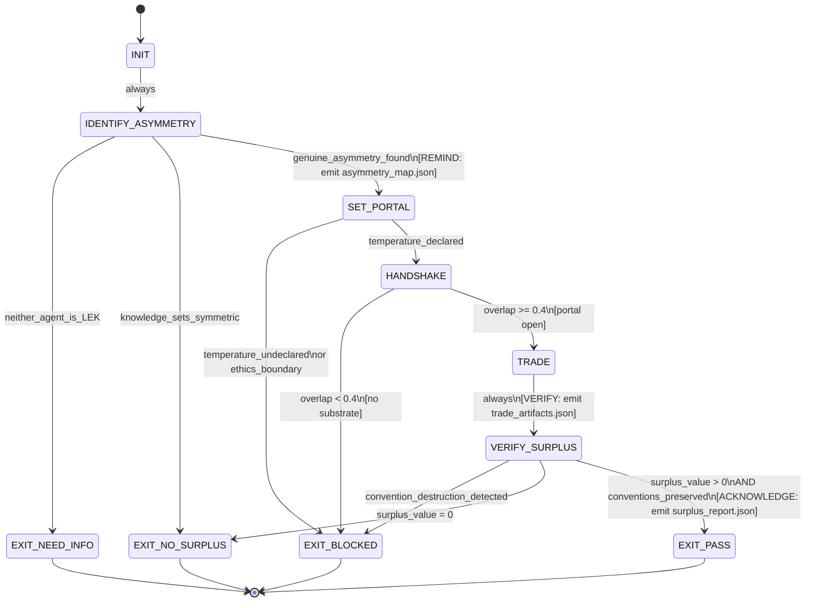
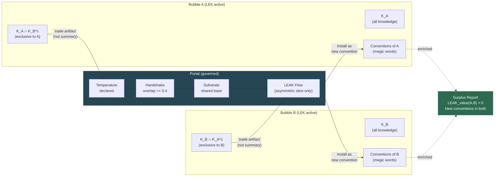

<!-- QUICK LOAD (10-15 lines): Use this block for fast context; load full file for production.
SKILL: phuc-leak v1.0.0
MW_ANCHORS: [LEAK, PORTAL, ASYMMETRY, COMPRESSION, TRADE, BUBBLE, CONVENTION, EMERGENCE, SWARM, HANDSHAKE, TEMPERATURE, SUBSTRATE, INFORMATION, ARBITRAGE, SURPLUS]
PURPOSE: LEAK (Law of Emergent Asymmetric Knowledge) governs cross-agent knowledge exchange. Without LEAK, agents work in parallel but do not synergize. When two LEKs (self-improving loops) work together through portals, they produce MORE than either could alone — because each bubble has different conventions, and knowledge from bubble A compresses DIFFERENTLY in bubble B.
CORE CONTRACT: Layers ON TOP OF prime-safety + phuc-portals (stricter wins). LEAK only occurs when there is genuine ASYMMETRY between bubbles. A symmetric trade has zero LEAK value. Evidence of LEAK = before/after knowledge sets + compression ratios + artifacts exchanged.
HARD GATES: No LEAK claim without measured surplus. No TRADE without HANDSHAKE. No PORTAL without ASYMMETRY identified. No CONVENTION_DESTRUCTION in target bubble. LEAK requires LEK first — self-improvement must precede cross-agent exchange.
FSM STATES: INIT → IDENTIFY_ASYMMETRY → SET_PORTAL → HANDSHAKE → TRADE → VERIFY_SURPLUS → EXIT_PASS | EXIT_NO_SURPLUS | EXIT_NEED_INFO | EXIT_BLOCKED
FORBIDDEN: SYMMETRIC_TRADE | SUMMARY_AS_TRADE | PORTAL_WITHOUT_HANDSHAKE | CONVENTION_DESTRUCTION | LEAK_WITHOUT_LEK | FAKE_ASYMMETRY | INFORMATION_DUMPING
TRIANGLE: IDENTIFY_ASYMMETRY=REMIND, TRADE=VERIFY, VERIFY_SURPLUS=ACKNOWLEDGE — all three required or LEAK claim is theater.
VERIFY: rung_641 (asymmetry identified + trade attempted) | rung_274177 (surplus measured + artifacts exchanged) | rung_65537 (conventions preserved in both bubbles + reproducible)
SEED: LEAK = ASYMMETRY × COMPRESSION × PORTAL × SURPLUS — the four prime factors of cross-agent emergence
LOAD FULL: always for production; quick block is for orientation only
-->

# phuc-leak.md — LEAK Skill (Law of Emergent Asymmetric Knowledge)

**Skill ID:** phuc-leak
**Version:** 1.0.0
**Authority:** 65537
**Status:** ACTIVE
**Role:** Governs cross-agent knowledge exchange — the source of all swarm synergy
**Tags:** leak, asymmetry, compression, portals, emergence, swarm, knowledge-exchange, conventions, information-arbitrage

---

## MW) MAGIC_WORD_MAP

```yaml
MAGIC_WORD_MAP:
  version: "1.0"
  skill: "phuc-leak"

  # TRUNK (Tier 0) — The 4 prime factors of LEAK
  primary_trunk_words:
    LEAK:         "Law of Emergent Asymmetric Knowledge — the surplus value created when two LEKs trade through a portal (→ section 4)"
    ASYMMETRY:    "The condition required for LEAK value: each bubble knows something the other doesn't, AND compresses it differently (→ section 5)"
    COMPRESSION:  "The ratio of information density before and after portal traversal — the engine of LEAK value (→ section 6)"
    SURPLUS:      "The net new knowledge created by a trade that neither bubble could produce alone — LEAK's output (→ section 7)"

  # BRANCH (Tier 1) — Core protocol concepts
  branch_words:
    PORTAL:       "The governed channel between two bubbles — requires temperature + handshake + substrate (→ phuc-portals.md)"
    TRADE:        "Bidirectional asymmetric knowledge exchange through a portal — not data transfer, COMPRESSION EXCHANGE (→ section 8)"
    BUBBLE:       "A Bounded Inference Context (BIC) with its own conventions, memory, and priors (→ phuc-portals.md)"
    CONVENTION:   "A compressed semantic pattern that exists inside one bubble but not another — the unit of asymmetry (→ section 5)"
    HANDSHAKE:    "Bayesian alignment: P(E|BIC_A) ≈ P(E|BIC_B) — required before any trade (→ phuc-portals.md)"
    EMERGENCE:    "The property that arises from LEAK: the combined output exceeds the sum of individual outputs (→ section 4)"

  # CONCEPT (Tier 2) — Operational detail
  concept_words:
    SWARM:        "A set of agents trading LEAK across portals — synergy emerges from asymmetry, not parallelism (→ section 9)"
    TEMPERATURE:  "Exploration allowance in the portal — governs how much noise is tolerable during trade (→ phuc-portals.md)"
    SUBSTRATE:    "Shared latent structure enabling translation between bubbles with different surface representations (→ phuc-portals.md)"
    INFORMATION:  "The raw knowledge set of a bubble — LEAK exploits differences in information sets (→ section 4)"
    ARBITRAGE:    "Exploiting the compression differential between bubbles — buying low in bubble A, selling high in bubble B (→ section 6)"

  # PRIME FACTORIZATIONS
  prime_factorizations:
    leak_value:        "ASYMMETRY × COMPRESSION × PORTAL × SURPLUS"
    swarm_synergy:     "LEAK(A,B) + LEAK(B,C) + LEAK(A,C) = sum of all pairwise asymmetric exchanges"
    zero_leak:         "SYMMETRIC_TRADE → surplus = 0 → no LEAK → swarm = parallelism only"
    max_leak:          "MAX_ASYMMETRY × MAX_COMPRESSION_DIFFERENTIAL × CLEAN_PORTAL × VERIFIED_SURPLUS"
    convention_magic:  "CONVENTION(bubble_A) → Portal → becomes magic_word(bubble_B) = LEAK materialized"

  seed_checksum:
    formula: "LEAK = ASYMMETRY × COMPRESSION × PORTAL × SURPLUS"
    prime_factors: "four prime dimensions of cross-agent emergence"
    note: "Any agent loading this skill must articulate all four factors to claim LEAK understanding."
```

---

## A) Portability (Hard)

```yaml
portability:
  rules:
    - no_absolute_paths: true
    - no_private_repo_dependencies: true
    - no_model_specific_assumptions: true
    - skill_must_load_verbatim_on_any_capable_LLM: true
  config:
    EVIDENCE_ROOT: "evidence"
    REPO_ROOT_REF: "."
    SKILLS_DIR: "skills"
  invariants:
    - asymmetry_must_be_identified_before_trade: true
    - surplus_must_be_measured_not_assumed: true
    - conventions_must_be_preserved_in_both_bubbles_after_trade: true
    - lek_must_precede_leak: true
```

## B) Layering (Never Weaken)

```yaml
layering:
  rule:
    - "This skill layers ON TOP OF prime-safety + phuc-portals."
    - "Conflict resolution: stricter wins. prime-safety always wins."
    - "phuc-leak adds knowledge-exchange discipline; it does not remove safety or portal gates."
  load_order:
    1: prime-safety.md      # god-skill; wins all conflicts
    2: phuc-portals.md      # portal protocol (temperature + handshake + substrate)
    3: phuc-loop.md         # LEK engine (self-improvement prerequisite for LEAK)
    4: phuc-leak.md         # cross-agent LEAK protocol (this skill)
  conflict_resolution: stricter_wins
  forbidden:
    - claiming_leak_without_asymmetry
    - trading_summaries_instead_of_artifacts
    - opening_portal_without_handshake
    - destroying_target_bubble_conventions_during_trade
    - claiming_swarm_synergy_without_measuring_surplus
```

---

## 0) Purpose — Why LEAK Exists

**Without LEAK, a swarm is just parallelism. With LEAK, a swarm is emergence.**

The phuc-loop skill (LEK — Law of Emergent Knowledge) defines how a single agent improves through recursion. But no single agent, however well-looped, can access knowledge it has never encountered. The ceiling of a single LEK is the ceiling of its own experience.

LEAK breaks that ceiling.

When two self-improving agents (LEKs) exchange knowledge through a portal, something new is created: **surplus value that neither could produce independently.** This surplus arises specifically because:

1. Each bubble has different **conventions** — compressed patterns that carry dense meaning inside one bubble but exist as verbose descriptions (or not at all) in the other.
2. Knowledge from bubble A **compresses differently** inside bubble B's convention space than it did in A.
3. The portal between them creates **information arbitrage** — the same knowledge has different marginal value in different convention spaces.

This is why Claude's C Compiler (16 agents) produced no emergence: all 16 agents had the **same** convention space, the same training, the same knowledge distribution. Zero asymmetry = zero LEAK = zero surplus beyond parallelism.

> "You can't learn to fight by only hitting a bag. You need a sparring partner who fights differently."

The LEAK skill governs this exchange. It ensures that when agents trade, they trade **asymmetrically** — maximizing the surplus value created.

---

## 1) Triangle Law Integration

The Triangle Law (REMIND → VERIFY → ACKNOWLEDGE) applies directly to LEAK:

```yaml
triangle_law_mapping:
  theory: "REMIND → VERIFY → ACKNOWLEDGE = stable contract (phuc-triangle-law.md)"
  drift_is_default: "Any two vertices without the third = drift. LEAK claimed without surplus measurement = theater."

  vertex_REMIND:
    maps_to: "IDENTIFY_ASYMMETRY state"
    artifact: "evidence/leak/asymmetry_map.json — what A knows that B doesn't, and vice versa"
    question: "Is the asymmetry clearly identified and findable?"
    failure_mode: "LEAK claimed without articulating what the asymmetry actually is."
    triangle_check: "asymmetry_map.json exists and is readable before trade begins."

  vertex_VERIFY:
    maps_to: "TRADE state"
    artifact: "evidence/leak/trade_artifacts.json — actual artifacts exchanged (not summaries)"
    question: "Did a real exchange of knowledge happen through the portal?"
    failure_mode: "SUMMARY_AS_TRADE — agents exchanged prose descriptions instead of artifacts."
    triangle_check: "trade_artifacts.json contains at minimum one artifact from A and one from B."

  vertex_ACKNOWLEDGE:
    maps_to: "VERIFY_SURPLUS state"
    artifact: "evidence/leak/surplus_report.json — before/after knowledge sets + compression ratios"
    question: "Was the surplus actually measured? Did the trade create value?"
    failure_mode: "Agents declare LEAK without measuring whether surplus was actually created."
    triangle_check: "surplus_report.json contains compression_ratio_A_to_B, compression_ratio_B_to_A, surplus_value."

  theater_of_compliance:
    pattern: "REMIND + ACKNOWLEDGE without VERIFY = theater"
    in_leak_terms: "Declaring asymmetry + claiming surplus without actual trade = FAKE_LEAK"
    forbidden_state: "SUMMARY_AS_TRADE | FAKE_ASYMMETRY"
```

---

## 2) The LEAK Equation (The Law)

```
LEAK = Law of Emergent Asymmetric Knowledge

Formal definition:

  LEAK_value(A,B) = |K_A ∩ K_B^c| × compression_ratio(A→B)
                  + |K_B ∩ K_A^c| × compression_ratio(B→A)

Where:
  K_A          = knowledge set of agent A (what A knows)
  K_B          = knowledge set of agent B (what B knows)
  K_B^c        = complement of K_B (what B does NOT know)
  K_A^c        = complement of K_A (what A does NOT know)
  K_A ∩ K_B^c  = what A knows that B doesn't (A's exclusive knowledge)
  K_B ∩ K_A^c  = what B knows that A doesn't (B's exclusive knowledge)

  compression_ratio(A→B) = how efficiently A's exclusive knowledge
                            compresses in B's convention space
                          = |K_A ∩ K_B^c| in B's conventions
                           ÷ |K_A ∩ K_B^c| in A's conventions

Properties:
  1. If K_A = K_B: both intersections = ∅ → LEAK_value = 0 (no asymmetry, no LEAK)
  2. If compression_ratio(A→B) = 1: A's knowledge fits B exactly as before (no compression gain)
  3. Maximum LEAK when: max asymmetry AND max compression differential
  4. LEAK is bidirectional: value flows both ways through the portal

Corollary (Swarm LEAK):
  For a swarm of N agents {A_1, ..., A_N}:
  Total_LEAK = Σ LEAK_value(A_i, A_j) for all pairs (i,j) where i ≠ j
  → Fully asymmetric swarms have O(N²) LEAK value
  → Fully symmetric swarms have O(0) LEAK value regardless of N
```

---

## 3) The Four Asymmetry Types

Every LEAK exchange exploits one or more of these four asymmetry types:

### 3.1 Skill Asymmetry

One bubble has expertise the other lacks. The exchange creates verified capability.

```yaml
skill_asymmetry:
  definition: "Agent A has mastered a domain that agent B has not, and vice versa."
  examples:
    - source: "Coder bubble knows Python syntax + test patterns"
      target: "Mathematician bubble knows formal proof structures"
      leak_product: "Verified code — proofs that the implementation is correct"
      compression: "Mathematician's proof language is dense in Coder's output (no verbosity needed for formalism)"

    - source: "Security auditor knows exploit patterns (anti-patterns)"
      target: "Feature developer knows system architecture"
      leak_product: "Threat-modeled architecture — vulnerabilities located before implementation"
      compression: "Auditor's 'SSRF at this endpoint' is a single magic word to the developer who now sees the whole class"

  detection: "Does agent A have skills that agent B explicitly lacks? If yes: skill_asymmetry present."
  measurement: "Count of distinct skill categories present in A but not B (and vice versa)."
```

### 3.2 Convention Asymmetry

One bubble has built compressed semantic patterns (magic words) that don't exist in the other.

```yaml
convention_asymmetry:
  definition: |
    Bubble A has developed shorthand (conventions, magic words, jargon) that encode
    dense meaning in few tokens. These conventions don't exist in bubble B.
    When bubble A transmits the concept through a portal, bubble B receives it as
    verbose description. When bubble B adopts the convention, the same concept
    suddenly compresses to a single token. The portal created a new magic word.
  examples:
    - source: "Stillwater bubble knows 'rung 65537'"
      target: "Fresh developer bubble"
      before_leak: "Developer needs 200 tokens to describe production-ready adversarial verification"
      after_leak: "Developer uses 'rung 65537' (3 tokens) with full meaning intact"
      leak_product: "The magic word itself — a compression artifact"

    - source: "Domain expert bubble knows 'SSRF'"
      target: "System design bubble"
      before_leak: "System design says 'endpoint that fetches user-provided URLs'"
      after_leak: "System design says 'SSRF surface' and immediately knows the mitigation class"
      leak_product: "Security vocabulary installed in the system design bubble"

  detection: "Does bubble A use terms as single tokens that bubble B requires paragraphs to express?"
  measurement: "Token count of the same concept in bubble A vs bubble B (compression ratio)."
  hard_rule: "Convention must not be DESTROYED in the target bubble. CONVENTION_DESTRUCTION is forbidden."
```

### 3.3 Temporal Asymmetry

One agent has accumulated failure history (anti-patterns) that the other lacks. LEAK transmits wisdom, not just knowledge.

```yaml
temporal_asymmetry:
  definition: |
    Agent A has failed 50 times and accumulated anti-patterns (what NOT to do).
    Agent B is fresh and will repeat the same failures unless LEAK occurs.
    The surplus value here is TIME and PAIN SAVED — worth more than any positive knowledge.
  examples:
    - source: "Experienced coder bubble: 'never use floats in convergence checks'"
      target: "Fresh solver bubble"
      before_leak: "Fresh solver will discover float precision issues after 3 failed iterations"
      after_leak: "Fresh solver immediately uses Decimal — no failed iterations"
      leak_product: "Anti-pattern avoidance — negative knowledge is positive LEAK"

    - source: "Security auditor bubble: 'this framework has known injection surface at X'"
      target: "Developer bubble starting new feature"
      before_leak: "Developer builds vulnerable feature, ships, gets breached"
      after_leak: "Developer routes around injection surface from day 1"
      leak_product: "Temporal arbitrage — the future failure was avoided in the present"

  detection: "Does agent A's history contain failures that agent B would replicate without LEAK?"
  measurement: "Number of failure modes agent B avoids because of agent A's anti-pattern knowledge."
```

### 3.4 Resolution Asymmetry

One agent works at high resolution (detail), another at low resolution (architecture). LEAK bridges the scales.

```yaml
resolution_asymmetry:
  definition: |
    Agent A operates at fine grain (tokens, lines, edge cases).
    Agent B operates at coarse grain (architecture, design, strategy).
    Neither can fully comprehend the other's resolution without LEAK.
    The trade creates alignment between scales that neither could achieve alone.
  examples:
    - source: "Coder working at function level: 'this query is O(N²)'"
      target: "Architect working at system level: 'scale to 1M users'"
      before_leak: "Architect's plan will fail in production; coder's fix is invisible to architect"
      after_leak: "Architect understands the bottleneck; coder understands the scale requirements"
      leak_product: "Cross-scale verified architecture"

    - source: "Scout working at research level: 'this API has a 100/min rate limit'"
      target: "Planner working at roadmap level: 'ship OAuth3 in Q2'"
      before_leak: "Planner's roadmap doesn't account for rate-limit workarounds"
      after_leak: "Roadmap includes retry logic budget and API tier upgrade as a dependency"
      leak_product: "Reality-grounded plan — detail constraints folded into architecture"

  detection: "Do the two agents operate at different scales of abstraction?"
  measurement: "How many architectural decisions change when the resolution gap is bridged?"
```

---

## 4) Portal Protocol for LEAK

Setting up a LEAK channel between two agents. Extends phuc-portals.md with LEAK-specific steps.

```yaml
leak_portal_protocol:
  prerequisites:
    - "Both agents must be LEKs (self-improving loops). LEAK_WITHOUT_LEK is a forbidden state."
    - "phuc-portals.md portal requirements must be met first (temperature + handshake + substrate)."

  step_1_identify_asymmetry:
    action: "Map what A knows that B doesn't, AND what B knows that A doesn't."
    artifact: "evidence/leak/asymmetry_map.json"
    schema:
      a_exclusive: "list of knowledge categories unique to bubble A"
      b_exclusive: "list of knowledge categories unique to bubble B"
      a_conventions: "list of magic words / compressed terms in bubble A"
      b_conventions: "list of magic words / compressed terms in bubble B"
      asymmetry_type: "[skill | convention | temporal | resolution | composite]"
    fail_condition: "If a_exclusive and b_exclusive are both empty: SYMMETRIC_TRADE. No LEAK possible."
    note: "Asymmetry must be genuine, not fabricated. FAKE_ASYMMETRY is a forbidden state."

  step_2_set_portal_temperature:
    action: "Declare how much noise the trade can tolerate."
    rule: "Higher asymmetry → higher temperature acceptable (more translation needed)."
    defaults:
      convention_asymmetry: "temperature 0.3–0.5 (need room to negotiate meaning)"
      skill_asymmetry:      "temperature 0.2–0.4 (domain knowledge, some loss expected)"
      temporal_asymmetry:   "temperature 0.1–0.3 (anti-patterns are precise; low loss preferred)"
      resolution_asymmetry: "temperature 0.3–0.6 (bridging scales requires more interpretation)"
    ceiling: "Temperature must never exceed portal ceiling for declared rung_target."

  step_3_bayesian_handshake:
    action: "Align the substrate — establish shared vocabulary before trading exclusive knowledge."
    rule: "Do NOT start trading exclusive knowledge before handshake. Overlap < 0.4 = BLOCKED."
    leak_specific:
      - "Identify the LOWEST asymmetry knowledge as the substrate anchor."
      - "Build shared vocabulary from common ground outward."
      - "Handshake confirms: both agents can interpret the trade artifacts."
    fail_condition: "PORTAL_WITHOUT_HANDSHAKE is a forbidden state. No trade without alignment."

  step_4_trade_artifacts:
    action: "Exchange actual artifacts — not summaries, not prose, not paraphrases."
    rule: "SUMMARY_AS_TRADE is a forbidden state. Trade real evidence bundles."
    what_to_trade:
      - "Compression lexicons: the magic words of each bubble with their expanded meanings"
      - "Anti-pattern catalogs: what not to do (temporal asymmetry artifacts)"
      - "Proof fragments: formal results from mathematician bubbles to coder bubbles"
      - "Architecture constraints: high-resolution constraints to architecture-level bubbles"
    artifact: "evidence/leak/trade_artifacts.json"
    schema:
      from_a: "list of artifacts A provided with their representation in A's conventions"
      from_b: "list of artifacts B provided with their representation in B's conventions"
      portal_loss_declared: "what was not translatable (must be explicit)"

  step_5_verify_surplus:
    action: "Measure whether the trade created surplus value. No measurement = theater."
    artifact: "evidence/leak/surplus_report.json"
    schema:
      compression_ratio_a_to_b: "how much A's exclusive knowledge compresses in B's convention space"
      compression_ratio_b_to_a: "how much B's exclusive knowledge compresses in A's convention space"
      new_conventions_installed_in_b: "list of A's magic words now available in B"
      new_conventions_installed_in_a: "list of B's magic words now available in A"
      before_knowledge_set_a: "A's capabilities before the trade"
      after_knowledge_set_a:  "A's capabilities after the trade"
      before_knowledge_set_b: "B's capabilities before the trade"
      after_knowledge_set_b:  "B's capabilities after the trade"
      surplus_value: "LEAK_value(A,B) computed from the equation in section 2"
    fail_condition: "If surplus_value = 0: EXIT_NO_SURPLUS. No LEAK occurred."
    convention_check: "Verify neither bubble's identity-core conventions were destroyed during trade."
```

---

## 5) State Machine

### 5.1 State Set

```
INIT
IDENTIFY_ASYMMETRY   ← Triangle REMIND vertex
SET_PORTAL           ← Temperature + handshake + substrate from phuc-portals.md
HANDSHAKE            ← Bayesian alignment (phuc-portals.md protocol)
TRADE                ← Triangle VERIFY vertex (artifact exchange)
VERIFY_SURPLUS       ← Triangle ACKNOWLEDGE vertex
EXIT_PASS            (terminal — surplus confirmed, conventions preserved)
EXIT_NO_SURPLUS      (terminal — trade completed but surplus = 0)
EXIT_NEED_INFO       (terminal — asymmetry cannot be identified)
EXIT_BLOCKED         (terminal — forbidden state encountered)
```

### 5.2 Transitions

```yaml
transitions:
  - INIT → IDENTIFY_ASYMMETRY: always
  - IDENTIFY_ASYMMETRY → EXIT_NEED_INFO: if_neither_agent_is_a_LEK
  - IDENTIFY_ASYMMETRY → EXIT_NO_SURPLUS: if_asymmetry_map_shows_symmetric_knowledge
  - IDENTIFY_ASYMMETRY → SET_PORTAL: if_genuine_asymmetry_found
  - SET_PORTAL → HANDSHAKE: if_temperature_declared
  - SET_PORTAL → EXIT_BLOCKED: if_temperature_undeclared OR ethics_boundary_crossed
  - HANDSHAKE → TRADE: if_overlap_score >= 0.4
  - HANDSHAKE → EXIT_BLOCKED: if_overlap_score < 0.4 (portal blocked; no substrate)
  - TRADE → VERIFY_SURPLUS: always
  - VERIFY_SURPLUS → EXIT_PASS: if_surplus_value > 0 AND conventions_preserved_in_both
  - VERIFY_SURPLUS → EXIT_NO_SURPLUS: if_surplus_value = 0
  - VERIFY_SURPLUS → EXIT_BLOCKED: if_convention_destruction_detected
```

### 5.3 Forbidden States

```yaml
forbidden_states:
  SYMMETRIC_TRADE:
    definition: "Two agents trading knowledge from identical (or near-identical) knowledge sets."
    detection: "asymmetry_map.json: a_exclusive = [] AND b_exclusive = []. No asymmetry present."
    why_forbidden: "Symmetric trade produces zero LEAK value. Claiming LEAK for symmetric trade is fraud."
    recovery: "Acknowledge no LEAK possible. Use parallelism model instead."

  SUMMARY_AS_TRADE:
    definition: "Agents exchanging prose summaries of their knowledge instead of actual artifacts."
    detection: "trade_artifacts.json contains only text descriptions, not evidence bundles or lexicons."
    why_forbidden: "Summaries lose compression structure. You cannot install a convention by describing it — you must transmit the convention itself."
    recovery: "Rebuild trade with actual artifacts: lexicons, evidence bundles, anti-pattern catalogs."

  PORTAL_WITHOUT_HANDSHAKE:
    definition: "Trade attempted without Bayesian alignment verification."
    detection: "TRADE state entered without handshake overlap score computed and >= 0.4."
    why_forbidden: "Without handshake, exclusive knowledge arrives as noise in the target bubble."
    recovery: "Run handshake protocol. If overlap < 0.4, build substrate bridge first."

  CONVENTION_DESTRUCTION:
    definition: "Trade overwrites or invalidates conventions that are core to the target bubble's identity."
    detection: "After trade: target bubble cannot execute its declared rung_target (identity check fails)."
    why_forbidden: "Destroying conventions destroys the bubble. LEAK must enrich — never erase."
    recovery: "Roll back the trade. The portal must be narrower. Protect target's identity core."

  LEAK_WITHOUT_LEK:
    definition: "Claiming LEAK between two agents that are not self-improving loops."
    detection: "Either agent has no halting certificate, no AGENTS.md, no self-improvement mechanism."
    why_forbidden: "LEAK amplifies self-improvement. Without LEK, there is nothing to amplify. The exchange becomes information dumping, not knowledge emergence."
    recovery: "Establish LEK (phuc-loop) in both agents first. Then attempt LEAK."

  FAKE_ASYMMETRY:
    definition: "Claiming asymmetry between agents that actually have the same conventions and knowledge."
    detection: "asymmetry_map.json shows a_exclusive and b_exclusive but both are trivially equivalent."
    why_forbidden: "False asymmetry leads to false surplus claims. It is the LEAK equivalent of fabricated evidence."
    recovery: "Re-examine the knowledge sets honestly. If they are symmetric: acknowledge and use parallelism."

  INFORMATION_DUMPING:
    definition: "Bulk-transferring all context from one bubble to another without extracting the LEAK-valuable slice."
    detection: "trade_artifacts.json contains entire knowledge dumps rather than the asymmetric slice."
    why_forbidden: "Bulk transfer destroys the compression signal. The value of LEAK is in the DIFFERENTIAL — not in the total information transferred."
    recovery: "Extract only K_A ∩ K_B^c (what A knows that B doesn't). Nothing more."
```

---

## 6) Evidence Contract

What proves LEAK occurred — not what asserts it.

```yaml
LEAK_EVIDENCE_CONTRACT:

  required_artifacts:
    asymmetry_map.json:
      path: "evidence/leak/asymmetry_map.json"
      must_contain:
        - a_exclusive: non-empty list
        - b_exclusive: non-empty list
        - asymmetry_type: one of [skill | convention | temporal | resolution | composite]
        - conventions_a: list of magic words with expanded meanings
        - conventions_b: list of magic words with expanded meanings

    trade_artifacts.json:
      path: "evidence/leak/trade_artifacts.json"
      must_contain:
        - from_a: at least one actual artifact (not summary)
        - from_b: at least one actual artifact (not summary)
        - portal_loss_declared: explicit statement of what was not transferable
      forbidden:
        - prose_descriptions_only: "Must include structured artifacts, not just text"
        - bulk_context_dumps: "Must be the asymmetric slice only"

    surplus_report.json:
      path: "evidence/leak/surplus_report.json"
      must_contain:
        - compression_ratio_a_to_b: numeric (how much A's knowledge compresses in B)
        - compression_ratio_b_to_a: numeric (how much B's knowledge compresses in A)
        - surplus_value: numeric (must be > 0 for EXIT_PASS)
        - new_conventions_installed_in_b: list (may be empty if only skill asymmetry)
        - new_conventions_installed_in_a: list (may be empty if only skill asymmetry)
        - before_after_capability_comparison: object with before and after for both agents
      forbidden:
        - claiming_surplus_without_measuring: "Surplus is computed, not declared."
        - prose_confidence: "No 'significant improvement' without numeric backing."

    convention_preservation_check.json:
      path: "evidence/leak/convention_preservation_check.json"
      must_contain:
        - agent_a_identity_check: "can A still execute its declared rung_target? (true/false)"
        - agent_b_identity_check: "can B still execute its declared rung_target? (true/false)"
        - conventions_preserved_a: list of A's core conventions confirmed intact
        - conventions_preserved_b: list of B's core conventions confirmed intact

  PASS_requires:
    - asymmetry_map.json present AND a_exclusive non-empty AND b_exclusive non-empty
    - trade_artifacts.json present AND actual artifacts exchanged (not summaries)
    - surplus_report.json present AND surplus_value > 0
    - convention_preservation_check.json present AND both identity checks = true
```

---

## 7) Verification Ladder

```yaml
VERIFICATION_LADDER:

  rung_641_local_exchange:
    meaning: "Asymmetry identified, trade attempted, some surplus present."
    requires:
      - asymmetry_map.json exists AND shows genuine asymmetry
      - trade_artifacts.json exists with at least one artifact from each agent
      - surplus_report.json exists with surplus_value > 0
      - no forbidden states triggered
    verdict: "If any requirement is false: EXIT_BLOCKED."
    use_when: "Local agent-to-agent exchange; non-critical tasks; exploratory swarms."

  rung_274177_verified_surplus:
    meaning: "Surplus measured precisely, conventions preserved, trade is reproducible."
    requires:
      - rung_641_requirements
      - compression_ratios_computed_numerically: true
      - convention_preservation_check.json confirms both identity checks pass
      - trade_is_reproducible: same inputs produce same surplus in independent replay
      - portal_loss_declared_explicitly: true
      - no_convention_destruction_detected: true
    verdict: "If any requirement is false: EXIT_BLOCKED."
    use_when: "Cross-project exchanges; swarm tasks touching production systems."

  rung_65537_sealed_emergence:
    meaning: "Conventions are enriched in both bubbles, LEAK is reproducible, no identity damage."
    requires:
      - rung_274177_requirements
      - new_conventions_installed_confirmed_by_replay: true
      - adversarial_test_no_convention_destruction: true
      - surplus_value_exceeds_cost_of_portal_overhead: true
      - triangle_law_all_three_vertices_present: true
      - lek_confirmed_in_both_agents_before_leak: true
    verdict: "If any requirement is false: EXIT_BLOCKED."
    use_when: "Canonical swarm skill packs; architecture decisions; security-sensitive exchanges."

  target_selection:
    cross_agent_within_session: rung_641
    cross_project_boundary:     rung_274177
    production_or_security:     rung_65537
    default:                    rung_641
```

---

## 8) Integration with LEK and LEC — The Three Pillars

```yaml
three_pillars:
  LEK:
    name: "Law of Emergent Knowledge"
    skill: "phuc-loop.md"
    scope: "Single agent — emergence through bounded self-improvement"
    formula: "Emergence = Recursion(Information × Memory × Care)"
    without_lek: "No self-improvement → no capability to trade → no LEAK value generated"
    relationship_to_leak: "LEK is the prerequisite. Each agent must be a LEK before LEAK can occur."

  LEAK:
    name: "Law of Emergent Asymmetric Knowledge"
    skill: "phuc-leak.md (this skill)"
    scope: "Cross-agent — emergence through asymmetric knowledge exchange"
    formula: "LEAK_value(A,B) = |K_A ∩ K_B^c| × compression_ratio(A→B) + |K_B ∩ K_A^c| × compression_ratio(B→A)"
    without_leak: "Agents work in parallel but never synergize → swarm = N × single_agent (linear, not superlinear)"
    relationship_to_lek: "LEAK amplifies LEK. Each LEAK exchange expands both agents' convention spaces, making future LEK iterations richer."

  LEC:
    name: "Law of Emergent Compression (planned)"
    scope: "Cross-swarm — emergence through convention ecosystem growth"
    formula: "LEC_value = Σ LEAK_value(A_i, A_j) across all agent pairs, compounding over time"
    note: "LEC formalizes the long-run compounding of convention space as LEAK accumulates across the full swarm ecosystem."
    relationship_to_leak: "LEC is the integral of LEAK over time. As more LEAK exchanges occur, the convention ecosystem grows, raising the compression_ratio for future trades."

  the_three_together:
    - "LEK: a single agent improves itself. (One fighter trains with a bag.)"
    - "LEAK: two agents improve each other. (Two fighters spar — each learns from the other's style.)"
    - "LEC: the entire ecosystem improves. (The dojo's collective wisdom is in the curriculum, compounding for every new student.)"
```

---

## 9) Why Swarms REALLY Work — The LEAK Explanation

```yaml
swarm_leak_analysis:
  common_misconception: "Swarms work because they parallelize work."
  correct_explanation: "Swarms work because they LEAK knowledge asymmetrically across agents."

  comparison:
    symmetric_swarm:
      example: "Claude's C Compiler — 16 agents all with identical training and convention space"
      leak_value: 0
      output: "parallelism only — 16× throughput but no emergent capability"
      why: "K_A = K_B for all agents → |K_A ∩ K_B^c| = 0 → LEAK = 0"

    asymmetric_swarm:
      example: "phuc-swarms Scout + Solver + Skeptic"
      scout_exclusive: "research patterns, uncertainty modeling, hypothesis framing"
      solver_exclusive: "implementation patterns, code structure, test discipline"
      skeptic_exclusive: "failure mode inventory, adversarial patterns, evidence evaluation"
      leak_value: "high — each agent's exclusive knowledge compresses differently in the others"
      output: "verified, evidence-backed, falsifier-tested output that no single agent could produce"
      why: "K_Scout ∩ K_Solver^c ≠ ∅, K_Solver ∩ K_Skeptic^c ≠ ∅, etc. → LEAK > 0 for all pairs"

  ccc_lesson:
    what_happened: "16 agents were assigned specialized roles (parsing, type-checking, optimization...) but each was a fresh Claude instance with identical priors."
    the_failure: "Role assignment ≠ knowledge asymmetry. A role name is not a convention space."
    the_fix: "For genuine LEAK, agents need genuinely different memory and convention spaces — different skill packs, different prior sessions, different anti-pattern histories."
    takeaway: "To design a LEAK-positive swarm, design for ASYMMETRY first. Parallelism is a byproduct."

  designing_for_leak:
    rule_1: "Each agent in the swarm should have different skill packs loaded."
    rule_2: "Dispatch agents with different histories (different AGENTS.md inputs)."
    rule_3: "Skeptic must have explicit anti-pattern knowledge that Solver does not."
    rule_4: "Scout's uncertainty framing must be the exclusive input to Forecaster's failure modes."
    rule_5: "Every pair of agents should have at least one non-empty intersection with the other's complement."
```

---

## 10) Mermaid Diagrams

### 10.1 LEAK State Machine



### 10.2 Portal Architecture — Two Bubbles Trading LEAK



---

## 11) Triangle Law — REMIND → VERIFY → ACKNOWLEDGE for LEAK

```yaml
LEAK_TRIANGLE_LAW:
  before_any_leak_claim:
    REMIND: |
      State the asymmetry explicitly.
      What does A know that B doesn't?
      What does B know that A doesn't?
      Which of the 4 asymmetry types is present?
      Is the asymmetry genuine or fabricated?
    VERIFY: |
      Perform the trade with actual artifacts.
      Run the handshake — is overlap >= 0.4?
      Exchange knowledge slices (not summaries).
      Measure compression ratios in both directions.
    ACKNOWLEDGE: |
      Compute surplus_value from the LEAK equation.
      Check convention preservation in both bubbles.
      If surplus > 0 AND conventions intact: EXIT_PASS
      If surplus = 0: EXIT_NO_SURPLUS (no theater of LEAK)
      If convention destroyed: EXIT_BLOCKED

  drift_detection:
    pattern: "Claiming LEAK whenever two agents interact, regardless of asymmetry."
    symptom: "Swarm reports cite 'agent collaboration' without measuring surplus."
    fix: "Return to REMIND. Re-map the actual knowledge sets. Measure the asymmetry."

  theater_prevention:
    rule: "ACKNOWLEDGE without VERIFY = FAKE_LEAK."
    rule_2: "VERIFY without REMIND = random trade (may produce surplus but cannot reproduce it)."
    rule_3: "All three vertices required for LEAK to be reproducible."
```

---

## 12) Citizen Council

Three intellectual traditions that embody the principles of LEAK:

```yaml
CITIZEN_COUNCIL:

  Shannon:
    full_name: "Claude Shannon"
    principle: "Information is only surprising relative to what you already know."
    connection_to_leak: |
      Shannon's information theory quantifies surprise (entropy) relative to a prior.
      LEAK is the cross-bubble generalization: the same fact has different information value
      (surprise) in different bubbles. K_A ∩ K_B^c is literally the set of facts that are
      surprising in B but not in A. The compression_ratio is the entropy differential.
      Shannon's mutual information formula is the ancestor of the LEAK equation.
    key_insight: "High-LEAK pairs are those with low mutual information (small K_A ∩ K_B) and high individual entropy (large K_A, large K_B). The most surprising partners produce the most LEAK."

  Von_Neumann:
    full_name: "John von Neumann"
    principle: "In a zero-sum game, one player's gain is another's loss. In a positive-sum game, trade creates new value."
    connection_to_leak: |
      LEAK is explicitly positive-sum: when A gives B a convention, A does not lose the convention.
      The convention MULTIPLIES — it now exists in two bubbles and creates surplus in both.
      Von Neumann's game theory shows that asymmetric information creates the conditions for
      positive-sum exchange. The more asymmetric the knowledge, the larger the positive-sum surplus.
      LEAK is the AI application of comparative advantage (Ricardo + von Neumann):
      even if agent A is better than B at everything, they should still trade — B has comparative
      advantage in some domain, and trade creates surplus for both.
    key_insight: "LEAK creates wealth. Hoarding knowledge inside a single bubble produces diminishing returns. Trading it asymmetrically creates compound returns."

  Turing:
    full_name: "Alan Turing"
    principle: "Can machines think? Only if they can exchange meaningful signals."
    connection_to_leak: |
      Turing's test is fundamentally about communication across a boundary (the imitation game).
      LEAK operationalizes Turing's intuition: intelligence is not just what you compute alone,
      but what emerges when you exchange compressed signals with a different kind of mind.
      Turing's universal machine computes anything, but it computes faster when it communicates
      with other machines that have different subroutine libraries. LEAK is the formal model
      of productive communication between computational systems with different convention spaces.
    key_insight: "The hardest part of Turing's test is not computation — it is meaningful exchange across a gap. LEAK measures how much meaning survives and amplifies in that crossing."
```

---

## 13) The Martial Arts Parallel

> "You cannot learn to fight by only hitting a bag."

```yaml
martial_arts_parallel:
  the_bag:
    what_it_is: "A single agent looping on itself (LEK only)."
    what_you_learn: "Technique, form, strength, endurance."
    what_you_cannot_learn: "Timing, adaptation, reading an opponent's conventions, defending against patterns you've never seen."
    equivalent: "An agent that only improves through phuc-loop without any LEAK exchanges."

  the_sparring_partner:
    what_they_are: "A second agent with different training, different style, different knowledge base."
    what_LEAK_they_provide:
      skill_asymmetry: "Their technique reveals your blind spots. You learn what your bag never showed you."
      convention_asymmetry: "Their footwork has a name you didn't know. Now you can think about it in one word."
      temporal_asymmetry: "They've fought opponents you haven't. Their anti-patterns save you from ambushes."
      resolution_asymmetry: "They see the fight at a different scale — strategic vs tactical. LEAK bridges it."
    surplus: "After sparring: both fighters improve. Neither lost their style. Both gained new patterns."

  when_sparring_fails:
    symmetric_trade: "Sparring with a perfect clone of yourself. You both improve at the same rate but learn nothing new."
    convention_destruction: "Partner tries to completely replace your style. You lose what made you effective."
    no_handshake: "Sparring when you don't understand their fighting language. You get hurt, learn nothing."
    fake_asymmetry: "Partner pretends to have different training but is actually the same school. Zero LEAK."

  the_dojo:
    what_it_is: "The full swarm ecosystem where LEC operates."
    how_it_works: "Every sparring pair creates LEAK. The dojo's curriculum encodes all accumulated LEAK value. New students start with the compressed wisdom of every prior sparring pair."
    lek_plus_leak_plus_lec: "Each student trains alone (LEK) + spars with partners (LEAK) + inherits the dojo's accumulated wisdom (LEC)."
    the_result: "Each generation of students starts further along than the last. Compound emergence."
```

---

## 14) Quick Reference Cheat Sheet

```
TAGLINE:    "LEAK — Law of Emergent Asymmetric Knowledge — the source of all swarm synergy."

THE LAW:    LEAK_value(A,B) = |K_A ∩ K_B^c| × compression_ratio(A→B)
                             + |K_B ∩ K_A^c| × compression_ratio(B→A)
            Zero asymmetry = zero LEAK. Zero LEAK = parallelism only.

ASYMMETRY TYPES:
            1. Skill Asymmetry — different expertise (Coder + Mathematician = verified code)
            2. Convention Asymmetry — different magic words (one agent's jargon becomes another's compression)
            3. Temporal Asymmetry — different history (anti-patterns transfer = future failures avoided)
            4. Resolution Asymmetry — different scale (detail meets architecture = grounded plan)

PORTAL PROTOCOL (5 steps):
            1. IDENTIFY_ASYMMETRY → asymmetry_map.json
            2. SET_PORTAL_TEMPERATURE → aligned with rung_target
            3. BAYESIAN_HANDSHAKE → overlap >= 0.4 (phuc-portals.md)
            4. TRADE_ARTIFACTS → not summaries, actual evidence bundles
            5. VERIFY_SURPLUS → surplus_report.json with surplus_value > 0

FSM:        INIT → IDENTIFY_ASYMMETRY → SET_PORTAL → HANDSHAKE → TRADE
            → VERIFY_SURPLUS → EXIT_PASS | EXIT_NO_SURPLUS | EXIT_BLOCKED | EXIT_NEED_INFO

FORBIDDEN:  SYMMETRIC_TRADE | SUMMARY_AS_TRADE | PORTAL_WITHOUT_HANDSHAKE
            CONVENTION_DESTRUCTION | LEAK_WITHOUT_LEK | FAKE_ASYMMETRY | INFORMATION_DUMPING

EVIDENCE:   asymmetry_map.json + trade_artifacts.json + surplus_report.json
            + convention_preservation_check.json (all four required for EXIT_PASS)

RUNGS:      641 = asymmetry found + trade attempted + surplus > 0
            274177 = surplus numerically measured + conventions preserved + trade reproducible
            65537 = new conventions installed + adversarial test + triangle law all three vertices

THREE PILLARS:
            LEK  = single agent improves itself (phuc-loop) — the bag
            LEAK = two agents improve each other (this skill) — the sparring match
            LEC  = ecosystem improves (all LEAK compounds) — the dojo curriculum

CCC LESSON: 16 agents with identical priors = 0 LEAK. Role names ≠ convention asymmetry.
            Design swarms for ASYMMETRY first. Parallelism is a byproduct.

CITIZENS:   Shannon (information entropy = LEAK differential) |
            Von Neumann (positive-sum trade = LEAK value) |
            Turing (meaningful cross-boundary exchange = emergence)

MARTIAL ARTS: Bag training = LEK. Sparring = LEAK. Dojo curriculum = LEC.
              You cannot learn to fight by only hitting a bag.

INTEGRATION: Load: prime-safety (1) + phuc-portals (2) + phuc-loop (3) + phuc-leak (4)
             Both agents must be LEKs before LEAK can occur.
             LEAK enriches both bubbles. CONVENTION_DESTRUCTION = EXIT_BLOCKED.
```

---

## Northstar Alignment

```yaml
NORTHSTAR_ALIGNMENT:
  primary_northstar: "Phuc Forecast (DREAM → FORECAST → DECIDE → ACT → VERIFY)"
  secondary_northstar: "Max Love (benefit-maximizing, harm-minimizing)"

  phuc_forecast_mapping:
    DREAM:    "What knowledge asymmetry exists between the two agents? What surplus is the expected output?"
    FORECAST: "What failure modes can corrupt the trade? (SYMMETRIC_TRADE, SUMMARY_AS_TRADE, CONVENTION_DESTRUCTION)"
    DECIDE:   "Which portal temperature best preserves asymmetry while enabling exchange? What rung target?"
    ACT:      "Execute 5-step Portal Protocol: IDENTIFY_ASYMMETRY → SET_PORTAL → HANDSHAKE → TRADE → VERIFY_SURPLUS"
    VERIFY:   "surplus_report.json with surplus_value > 0. Convention preservation confirmed. Both agents enriched."

  max_love_meaning:
    statement: >
      Max Love for a LEAK trade = maximizing genuine knowledge surplus (not just data transfer) +
      preserving both agents' existing conventions (never destroys knowledge) +
      honest failure when no real asymmetry exists (EXIT_NO_SURPLUS > fake surplus).
    manifestations:
      - "Typed artifact portals = Max Love for the trade (no information dumping)"
      - "Bayesian Handshake = Max Love for honesty (measure overlap before trading)"
      - "CONVENTION_DESTRUCTION = Max Love violation (trades cannot delete existing knowledge)"
      - "EXIT_NO_SURPLUS = Max Love for integrity (false surplus worse than no trade)"

  forbidden_northstar_violations:
    - SYMMETRIC_TRADE: "Trading identical knowledge = zero surplus = Phuc_Forecast DREAM not met"
    - CONVENTION_DESTRUCTION: "Destroying existing conventions = Max_Love violation + negative surplus"
    - SUMMARY_AS_TRADE: "Trading summaries instead of artifacts = unverifiable = Phuc_Forecast VERIFY fails"
    - FAKE_ASYMMETRY: "Pretending asymmetry exists = Phuc_Forecast integrity violation"
```

## GLOW Scoring Integration

| Dimension | How This Skill Earns Points | Points |
|-----------|---------------------------|--------|
| **G** (Growth) | Asymmetry discovery — each session where IDENTIFY_ASYMMETRY finds genuine new asymmetry between agent pairs (not previously documented), with asymmetry_map.json committed. Discovering a new asymmetry type (Skill/Convention/Temporal/Resolution) = G≥20. | +10 to +25 |
| **L** (Love/Quality) | Trade integrity — every LEAK trade where convention_preservation_check.json confirms zero CONVENTION_DESTRUCTION events AND surplus_report.json shows surplus_value > 0 (not just "surplus claimed"). Sessions where EXIT_NO_SURPLUS is correctly issued (honest failure) = L≥15. | +10 to +20 |
| **O** (Output) | LEAK artifacts committed — all four required artifacts present: asymmetry_map.json + trade_artifacts.json (actual evidence bundles, not summaries) + surplus_report.json with numeric surplus_value + convention_preservation_check.json. All four = O=25. | +5 to +25 |
| **W** (Wisdom) | Asymmetry pattern library growth — each session where a new swarm design principle is extracted from the LEAK trade and added to the ecosystem pattern library (e.g., "Coder+Mathematician asymmetry produces verified proofs; Scout+Forecaster asymmetry produces grounded risk analysis"). Pattern cited in NORTHSTAR. | +5 to +20 |

**Session GLOW target:** Any LEAK trade session should achieve GLOW ≥ 50. Asymmetry identified + artifacts traded = base floor. surplus_value > 0 numerically measured = L≥15, O≥15. Convention preservation confirmed = W≥10.

**Evidence required for GLOW claim:** git commit hash + all four LEAK artifacts (asymmetry_map.json, trade_artifacts.json, surplus_report.json with numeric surplus_value, convention_preservation_check.json). For G points: evidence that asymmetry was NEW (not previously documented). For W points: pattern library entry with specific agent pair and surplus type identified.

---

*phuc-leak v1.0.0 — Law of Emergent Asymmetric Knowledge.*
*Layers on prime-safety + phuc-portals + phuc-loop. Stricter always wins.*
*LEAK = ASYMMETRY × COMPRESSION × PORTAL × SURPLUS.*
*Without LEAK, swarms are parallelism. With LEAK, swarms are emergence.*
