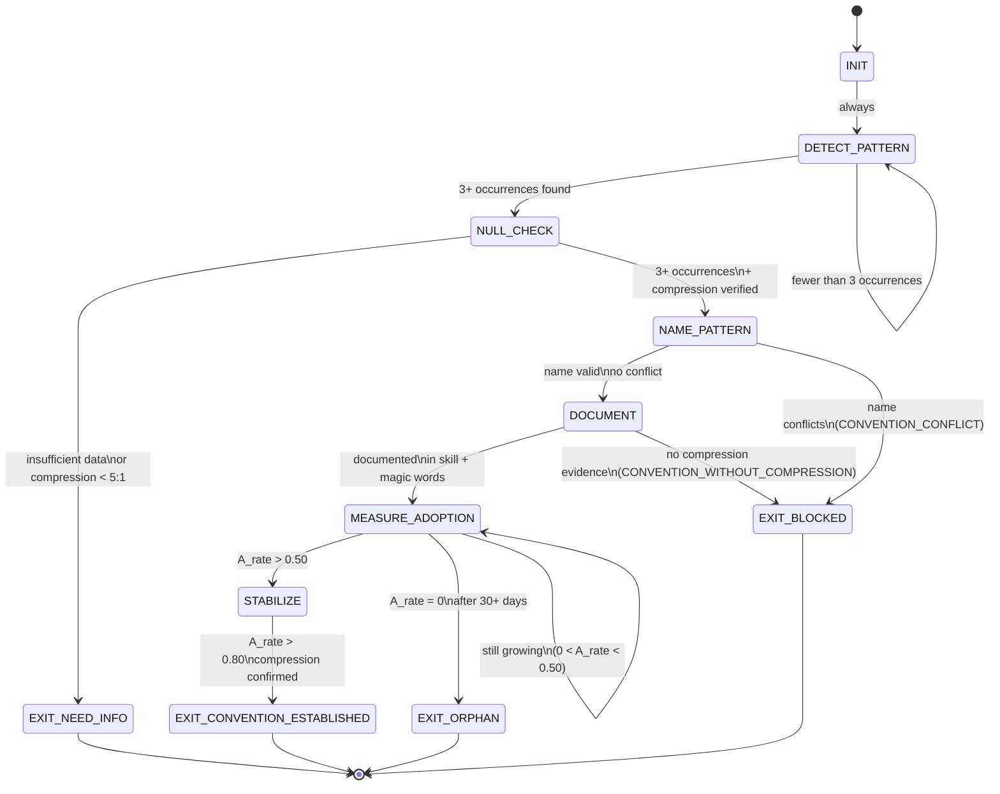

<!-- QUICK LOAD (10-15 lines): Use this block for fast context; load full file for production.
SKILL: phuc-lec v1.0.0
MW_ANCHORS: [CONVENTION, CULTURE, COMPRESSION, FRAMEWORK, PATTERN, STANDARD, PROTOCOL, NORM, STYLE, GOVERNANCE, ADOPTION, DRIFT, STABILITY, EMERGENCE, TREE]
PURPOSE: LEC (Law of Emergent Conventions) governs how conventions crystallize from repeated patterns. When enough LEKs (self-improvement) and LEAKs (cross-agent trade) operate, CONVENTIONS emerge — not designed but grown. Every convention is compression: agreement reduces description length. Without LEC, every agent reinvents every wheel.
CORE CONTRACT: A convention exists only when: 3+ independent usages, named in magic words, documented in skill/recipe, adoption > 50% of relevant agents. Convention lifecycle: CRYSTALLIZE → NAME → DOCUMENT → ADOPT → STABILIZE → EVOLVE. LEC_strength = |C| × D_avg × A_rate.
HARD GATES: CONVENTION_BY_DECREE (conventions emerge, not mandated). PREMATURE_NAMING (3+ occurrences required). CONVENTION_WITHOUT_COMPRESSION (must reduce description length). SILENT_CONVENTION_CHANGE (deprecation plan required). CONVENTION_CONFLICT_UNRESOLVED (two conventions for same pattern = chaos). ORPHAN_CONVENTION (0 adoption = dead weight).
FSM STATES: INIT → DETECT_PATTERN → NULL_CHECK → NAME_PATTERN → DOCUMENT → MEASURE_ADOPTION → STABILIZE → EXIT_CONVENTION_ESTABLISHED | EXIT_NEED_INFO | EXIT_BLOCKED | EXIT_ORPHAN
THREE_PILLARS: LEK creates patterns (single-agent repetition). LEAK spreads patterns (cross-agent trade). LEC crystallizes patterns into conventions (emergent compression). Remove any pillar and conventions collapse.
TRIANGLE: REMIND (detect recurring pattern) → VERIFY (name and document) → ACKNOWLEDGE (measure adoption)
VERIFY: rung_641 [3+ usages documented + name declared] | rung_274177 [adoption > 50% + compression verified] | rung_65537 [adversarial review + drift resistance tested + deprecation plan for any change]
REFERENCES: papers/47-law-of-emergent-knowledge.md | skills/phuc-axiom.md
LOAD FULL: always for production; quick block is for orientation only
-->

# phuc-lec.md — Law of Emergent Conventions (LEC)

**Skill ID:** phuc-lec
**Version:** 1.0.0
**Authority:** 65537
**Load Order:** 5 (after phuc-axiom, prime-safety, prime-coder, phuc-forecast)
**Status:** ACTIVE
**Role:** Governs how conventions emerge, crystallize, and persist across the Stillwater ecosystem
**Tags:** convention, emergence, compression, culture, lek, leak, lec, tree-of-solace, adoption, drift-prevention

---

## MW) MAGIC_WORD_MAP — Prime Factorization Map for phuc-lec

```yaml
MAGIC_WORD_MAP:
  # TRUNK (Tier 0) — Universal primitives that ground convention emergence
  primary_trunk_words:
    CONVENTION:    "A shared pattern that everyone agrees on — once named, never needs re-explanation (→ section 4)"
    CULTURE:       "The living body of active conventions in a community — the sum of all STABLE conventions (→ section 6.5)"
    COMPRESSION:   "Every convention is compression: agreement reduces description length (→ section 2)"
    EMERGENCE:     "Conventions are not designed — they crystallize from repeated interaction (→ section 3)"
    TREE:          "Convention hierarchy: Trunk (T0) → Primary Branches (T1) → Secondary (T2) → Leaves (T3) (→ section 5)"

  # BRANCH (Tier 1) — Operational convention concepts
  branch_words:
    FRAMEWORK:     "A named set of structural conventions that defines how something is built (→ section 6.1)"
    PATTERN:       "A recurring solution to a recurring problem — the seed from which conventions crystallize (→ section 7)"
    STANDARD:      "A convention that has achieved cross-community adoption — highest tier of stabilization (→ section 6.4)"
    PROTOCOL:      "A convention governing sequential interaction between agents — process-level (→ section 6.4)"
    NORM:          "A behavioral convention — what 'good behavior' looks like in a community (→ section 6.5)"
    STYLE:         "A martial arts parallel — the compression of centuries of practice into named forms (→ section 15)"
    GOVERNANCE:    "The convention that governs how conventions change — the meta-convention (→ section 7f)"
    ADOPTION:      "The rate at which a named convention spreads to new agents — the A_rate in LEC equation (→ section 4)"
    DRIFT:         "Deviation from a convention without a deprecation plan — entropy of the convention body (→ section 8)"
    STABILITY:     "High inertia — a convention that resists change because cost of change > benefit (→ section 7e)"

  # CONCEPT (Tier 2) — Convention lifecycle and measurement
  concept_words:
    CRYSTALLIZE:   "Convention lifecycle stage 1: pattern appears 3+ times → ready for naming (→ section 7a)"
    NAME:          "Convention lifecycle stage 2: someone creates a magic word for the pattern (→ section 7b)"
    DOCUMENT:      "Convention lifecycle stage 3: convention formalized in a skill/recipe/protocol (→ section 7c)"
    ORPHAN:        "A named convention with 0 adoption — dead weight; must be deprecated or removed (→ section 9)"

  # LEAF (Tier 3) — LEC-specific instances
  leaf_words:
    LEC_STRENGTH:  "Measurement: |C| × D_avg × A_rate — strength of convention body (→ section 4)"
    LEK:           "Law of Emergent Knowledge — creates patterns via single-agent repetition (→ section 12)"
    LEAK:          "Law of Emergent Agent Knowledge — spreads patterns via cross-agent trade (→ section 12)"
    THREE_PILLARS: "LEK + LEAK + LEC = the complete emergence stack (→ section 12)"
    TREE_OF_SOLACE: "The convention hierarchy: trunk primitives → branch domains → leaf instances (→ section 5)"

  # PRIME FACTORIZATIONS of key LEC concepts
  prime_factorizations:
    convention_existence:   "3+ usages × named × documented × adoption > 50%"
    lec_strength:           "|C| × D_avg × A_rate"
    culture:                "CONVENTION × STABILITY × ADOPTION — the living body of named patterns"
    drift:                  "CONVENTION - ENFORCEMENT = entropy"
    three_pillars:          "LEK (create) × LEAK (spread) × LEC (crystallize) = emergence"
    convention_compression: "CONVENTION = PATTERN + NAME + ADOPTION — agreement reduces description"

  # TRIANGLE LAW ANNOTATIONS
  triangle_law:
    on_new_pattern:
      REMIND:      "Has this pattern appeared 3+ times across different agents or files?"
      VERIFY:      "Is this pattern compressive? Does naming it save description length?"
      ACKNOWLEDGE: "If yes: crystallize → name → document. If no: wait for more instances."
    on_convention_change:
      REMIND:      "What is the current adoption rate? How many agents depend on this convention?"
      VERIFY:      "Does the proposed change maintain compression? Is there a deprecation plan?"
      ACKNOWLEDGE: "If deprecation plan exists and change increases compression: EVOLVE. Else: BLOCK."
    on_convention_audit:
      REMIND:      "List all named conventions. Which have 0 adoption (orphans)?"
      VERIFY:      "For each active convention: is compression still valid? Is adoption > 50%?"
      ACKNOWLEDGE: "Orphans → deprecate. Low adoption → investigate. High adoption → STABILIZE."
```

---

## A) Portability (Hard)

```yaml
portability:
  rules:
    - no_absolute_paths: true
    - no_private_repo_dependencies: true
    - skill_must_load_verbatim_on_any_capable_LLM: true
    - conventions_are_ecosystem_agnostic_in_principle: true
  config:
    EVIDENCE_ROOT: "evidence"
    SKILLS_DIR: "skills"
    MAGIC_WORDS_REF: "skills/phuc-magic-words.md"
    CONVENTIONS_REF: "skills/phuc-conventions.md"
  invariants:
    - convention_must_compress_before_crystallizing: true
    - three_plus_usages_required_before_naming: true
    - adoption_rate_measured_not_assumed: true
    - deprecation_plan_required_for_any_convention_change: true
```

## B) Layering

```yaml
layering:
  load_order: 5
  rule:
    - "phuc-lec layers ON TOP OF phuc-axiom (axioms define what good means)."
    - "phuc-lec OBSERVES LEK (single-agent patterns) and LEAK (cross-agent patterns)."
    - "phuc-lec CRYSTALLIZES those patterns into named, documented conventions."
    - "Any conflict: prime-safety wins. Then phuc-axiom. Then phuc-lec."
  conflict_resolution: prime_safety_then_axioms_then_lec
  forbidden:
    - mandating_conventions_by_decree
    - naming_patterns_with_fewer_than_3_usages
    - claiming_compression_without_measuring_it
```

---

## 0) Purpose — Why LEC Exists

Without LEC, every agent reinvents every wheel.

A system can have excellent LEK (each agent self-improves via repetition) and excellent LEAK (agents trade patterns freely), yet still never accumulate institutional knowledge. The patterns keep dissolving because no one names them, and unnamed patterns cannot be compressed into conventions.

LEC is the crystallization mechanism. It is the force that turns "a pattern I have seen before" into "rung 641" — three words that compress an entire verification protocol. Once a convention is named, it never needs explanation. You import it, and 100 lines of context collapse into one magic word.

> "A convention is a shared shortcut. The community that shares the most conventions is the most efficient community."

LEC governs three things:
1. **When** a pattern becomes a convention (lifecycle gates)
2. **How** conventions are named and documented (crystallization protocol)
3. **What** prevents conventions from drifting into entropy (governance)

Without LEC: drift accumulates, wheels are reinvented, context explodes, and agents cannot efficiently share knowledge.

With LEC: conventions compound. Each convention enables others. The ecosystem becomes progressively more expressive per token — intelligence without increasing cost.

---

## 1) The Three Pillars — LEK, LEAK, LEC

```
THREE_PILLARS of Convention Emergence:

  LEK (Law of Emergent Knowledge):
    "A single agent repeating a task gets better. Patterns form in one agent's memory."
    Mechanism: Individual recursion (phuc-loop).
    Output: Internal patterns (not yet shared).
    Example: One coder always writes tests before patches → TDD emerges as personal habit.

  LEAK (Law of Emergent Agent Knowledge):
    "An agent shares patterns with other agents. Cross-agent knowledge trade."
    Mechanism: Skill files, recipes, swarm protocols.
    Output: Shared patterns (named but perhaps not yet conventions).
    Example: TDD habit is documented in prime-coder.md → other agents adopt it.

  LEC (Law of Emergent Conventions):
    "Enough LEK + enough LEAK → patterns crystallize into conventions."
    Mechanism: Repeated cross-agent adoption → naming → documentation → stabilization.
    Output: Named conventions that compress entire protocols into single magic words.
    Example: TDD habit + multiple agent adoption → "red-green gate" becomes a convention.
              Three words replace 20 lines of explanation.

  The Product:
    Intelligence(ecosystem) = LEK × LEAK × LEC
    Remove any pillar → conventions collapse or stagnate.
    LEK without LEAK: personal mastery but no institutional memory.
    LEAK without LEC: shared but unnamed patterns → cognitive overhead persists.
    LEC without LEK: named conventions with no underlying mastery → hollow words.
```

---

## 2) The Law — Formal Definition

```
LAW OF EMERGENT CONVENTIONS (LEC)

Theorem: When enough LEKs and LEAKs operate in a system, CONVENTIONS emerge.

Formal definition:
  A CONVENTION C exists in system S if and only if:
    1. PATTERN(C) appears ≥ 3 times across ≥ 2 independent agents or files
    2. NAME(C) exists (a magic word or named artifact)
    3. DOCUMENT(C) exists (a skill, recipe, or protocol entry)
    4. ADOPTION(C) > 50% of agents in the relevant domain

LEC Strength Equation:
  LEC_strength(S) = |C_active| × D_avg × A_rate

  Where:
    |C_active| = number of active conventions (adoption > 50%, not orphaned)
    D_avg      = average tree depth of conventions (how many sub-conventions each has)
    A_rate     = mean adoption rate across all active conventions ∈ [0, 1]

Convention Compression Law:
  For a convention C to be valid:
    description_length_with_C < description_length_without_C

  "rung 641" (2 words) replaces:
    "A verification level where local correctness is established via a red→green gate,
     test suite passes, no regressions, and an evidence bundle is present." (38 words)
  Compression ratio: 38:2 = 19:1

  A pattern that does not compress is not a convention. It is bureaucracy.

Corollaries:
  C1. Magic words are the deepest conventions (T0 trunk) — maximum compression, universal adoption.
  C2. Convention inertia grows with adoption: high-adoption conventions resist change.
       Changing a convention costs A_rate × description_length_delta in coordination effort.
  C3. Orphan conventions (A_rate = 0) reduce LEC_strength but do not reduce intelligence.
       They must be pruned to prevent CONVENTION_CONFLICT_UNRESOLVED.
  C4. A system with no named conventions has LEC_strength = 0 regardless of how smart individual agents are.
```

---

## 3) Convention as Compression — Examples from Stillwater

Every convention in Stillwater compresses a complex concept into a short, shared reference:

| Convention | Without Convention | With Convention | Compression |
|---|---|---|---|
| "rung 641" | 38-word description | 2 words | 19:1 |
| "prime-safety" | List of 10+ safety rules | 1 skill name | 50:1 |
| "GLOW score" | Explain 4 dimensions, scoring, alignment | 1 phrase | 30:1 |
| "red-green gate" | Explain TDD, repro requirement, fix requirement | 3 words | 15:1 |
| "Triangle Law" | REMIND+VERIFY+ACKNOWLEDGE protocol | 2 words | 25:1 |
| "fail-closed" | Explain default-deny, uncertainty handling | 1 hyphenated word | 20:1 |
| "CNF capsule" | Describe isolation, artifact-only, no bleed | 2 words | 20:1 |
| "Belt system" | White→Yellow→Orange→Green→Blue→Black progression with criteria | 2 words | 30:1 |

**Why this matters:**
- A 3-agent swarm that shares 50 conventions communicates in ~50x fewer tokens than one with no conventions.
- Token savings = cost savings = more iterations per budget = more intelligence per dollar.
- This is how a small team can punch far above its weight: dense shared lexicon.

---

## 4) Convention Hierarchy — The Tree of Solace

Conventions are not flat. They form a tree. Higher-level conventions are more universal, more compressed, and more stable. Lower-level conventions are more specific, less stable, and depend on higher levels.

```
TREE OF SOLACE — Convention Hierarchy

T0 — TRUNK (Universal Primitives)
  ├── love, god, integrity, boundary, constraint
  ├── compression, symmetry, emergence, causality
  └── truth, beauty, harmony, alignment, glow, northstar

  Properties:
    - Universal: apply across all domains
    - Maximum stability (changing T0 requires ecosystem-wide consensus)
    - Maximum compression (each is a 1-word proxy for philosophical systems)
    - These are NAMED AXIOMS — the primes from which all other conventions derive

T1 — PRIMARY BRANCHES (Domain Concepts)
  ├── swarm, persona, portal, verification, recipe, skill
  ├── rung, lane, capsule, evidence, artifact, dispatch
  └── belt, northstar, glow-score, triangle-law, convention

  Properties:
    - Domain-specific to Stillwater/AI-agency systems
    - High stability (changing requires major version + deprecation plan)
    - Strong compression (each covers an entire sub-discipline)
    - These are the working vocabulary of the ecosystem

T2 — SECONDARY BRANCHES (Operational)
  ├── dispatch, orchestration, compaction, crystallize, adopt
  ├── red-green gate, fail-closed, null-vs-zero, never-worse
  └── prime-safety-pack, CNF-capsule, sub-agent-prompt

  Properties:
    - Operational: how things are done (not just what)
    - Medium stability (can change with minor version if adoption < 50%)
    - Medium compression (covers a process or technique)

T3 — LEAVES (Instance-Specific)
  ├── prime-safety.md, prime-coder.md, phuc-lec.md (specific file names)
  ├── recipe IDs, swarm configurations, project names
  └── skill versions, session artifacts

  Properties:
    - Most specific, least stable
    - Low stability (change without deprecation)
    - Minimal compression (near one-to-one with the thing they name)
    - CANNOT anchor other conventions (leaves cannot be parents in convention tree)

TREE RULE:
  A convention at tier N may reference conventions at tier N-1 or N-2.
  A convention at tier N may NOT reference conventions at tier N+1 or higher.
  (Trunk words are always valid anchors. Leaf words can only be terminal references.)
```

---

## 5) Convention Lifecycle — Six Stages

### Stage a: CRYSTALLIZE — Pattern Appears 3+ Times

```yaml
CRYSTALLIZE:
  trigger: "The same pattern appears in 3+ independent contexts (different files, agents, sessions)"
  evidence_required:
    - at_least_3_independent_occurrences: true
    - occurrences_from_at_least_2_different_agents_or_files: true
    - pattern_is_not_a_one_off_quirk: true
  gate: "Fewer than 3 occurrences → PREMATURE_NAMING risk → wait"
  output: "A candidate convention with 3+ occurrence citations"
  example:
    pattern: "Always run tests before applying a patch"
    occurrence_1: "prime-coder.md line 45"
    occurrence_2: "case-studies/solace-browser.md step 3"
    occurrence_3: "Agent session log 2026-02-15 step 7"
    result: "CANDIDATE_CONVENTION: red-green gate"
```

### Stage b: NAME — Create the Magic Word

```yaml
NAME:
  trigger: "Candidate convention passes CRYSTALLIZE gate"
  action: "Someone (human or agent) proposes a name — a magic word"
  criteria:
    - name_is_concise: "1-4 words or hyphenated compound"
    - name_compresses: "name is shorter than the thing it describes by > 5:1"
    - name_is_memorable: "can be recalled without looking it up"
    - name_is_unambiguous: "no existing convention has this name"
  output: "Named convention candidate"
  example:
    candidate: "Always run tests before applying a patch"
    proposed_name: "red-green gate"
    compression_check: "3 words → replaces ~20 words (6.6:1) → passes"
```

### Stage c: DOCUMENT — Formalize in Skill/Recipe/Protocol

```yaml
DOCUMENT:
  trigger: "Named convention candidate exists"
  required_documentation:
    - what_the_convention_is: "clear one-sentence definition"
    - when_it_applies: "scope and context"
    - what_it_compresses: "what would need to be said without it"
    - compression_ratio: "approximate measure (X:1)"
    - tree_placement: "T0/T1/T2/T3 + which parent convention"
    - examples: "at least 2 concrete examples"
  location:
    - in_a_skill_file: "skills/phuc-*.md or skills/prime-*.md"
    - in_the_magic_words_db: "skills/phuc-magic-words.md MAGIC_WORD_MAP"
    - in_a_recipe: "recipes/*.json for operational conventions"
  output: "Documented convention in canonical location"
```

### Stage d: ADOPT — Spread to Other Agents

```yaml
ADOPT:
  trigger: "Convention documented; now spread"
  mechanism:
    - skill_loading: "Agents that load the skill inherit the convention"
    - recipe_usage: "Agents that run the recipe use the convention"
    - swarm_dispatch: "Convention injected into sub-agent skill packs"
    - human_reference: "Humans start using the magic word in prompts and case studies"
  measurement:
    adoption_rate: "fraction of agents/sessions where convention is actively used"
    threshold_for_stabilize: "A_rate > 0.50"
    threshold_for_orphan: "A_rate = 0 for 30+ days"
  output: "Adoption rate measurement"
```

### Stage e: STABILIZE — Reach High Inertia

```yaml
STABILIZE:
  trigger: "Adoption rate > 50%"
  what_changes: "Convention gains 'inertia' — cost of change now exceeds benefit of change"
  inertia_formula: "change_cost = A_rate × description_length_delta × num_dependent_agents"
  stable_convention_properties:
    - changing_requires_deprecation_plan: true
    - version_bump_required_for_any_change: true
    - migration_path_required_for_agents: true
    - cannot_be_removed_silently: true
  example:
    convention: "rung 641"
    adoption_rate: 0.95
    dependent_agents: "all agents in ecosystem"
    change_cost: "extremely high — only change with explicit cross-ecosystem migration"
```

### Stage f: EVOLVE — Rare Upgrade with Deprecation Plan

```yaml
EVOLVE:
  trigger: "STABLE convention needs to change (new evidence, better compression)"
  required_process:
    - step_1: "Document why the convention must change (INTEGRITY: evidence-only)"
    - step_2: "Propose the new version alongside the old (never silent replacement)"
    - step_3: "Deprecation notice in old convention documentation"
    - step_4: "Migration plan for all dependent agents and files"
    - step_5: "Minimum adoption period for new version (allow agents to migrate)"
    - step_6: "Retire old version only when adoption of new version > 80%"
  forbidden: "SILENT_CONVENTION_CHANGE — changing a convention without deprecation plan"
  example:
    old: "rung 274177 (informal description)"
    new: "rung 274177 (formal: seed sweep + replay + Phuc Test 4/5)"
    change: "Documentation enriched, not semantics changed"
    plan: "Announce in CHANGELOG.md; update all skill files; no migration needed (additive)"
```

---

## 6) Convention Types — Six Categories with Stillwater Examples

### 6.1 Naming Conventions

```yaml
NAMING_CONVENTIONS:
  definition: "Conventions about what to call things"
  stillwater_examples:
    - magic_words: "GPS coordinates in knowledge space (see phuc-magic-words.md)"
    - file_naming: "skills/phuc-*.md | skills/prime-*.md (kebab-case)"
    - variable_naming: "snake_case functions, PascalCase classes, UPPER_SNAKE constants"
    - belt_names: "White → Yellow → Orange → Green → Blue → Black"
    - rung_names: "641 = local | 274177 = stability | 65537 = production"
  compression_value: "HIGH — naming conventions eliminate 'what is this called?' overhead entirely"
  tree_placement: "T1 for skill/file names; T2 for variable patterns; T3 for instance names"
```

### 6.2 Structural Conventions

```yaml
STRUCTURAL_CONVENTIONS:
  definition: "Conventions about how to structure artifacts (skills, recipes, papers)"
  stillwater_examples:
    - skill_format: "QUICK_LOAD → HEADER → MW → PURPOSE → LAW → LIFECYCLE → STATE_MACHINE → FORBIDDEN → EVIDENCE → VERIFICATION → QUICK_REF"
    - recipe_format: "YAML with trigger, steps, output, rung_target"
    - paper_format: "Abstract → Problem → Solution → Evidence → Conclusion"
    - swarm_capsule: "goal + context + constraints + rung_target (CNF pattern)"
    - evidence_bundle: "tests.json + PATCH_DIFF + repro_red.log + repro_green.log + sha256"
  compression_value: "VERY HIGH — structural conventions make artifacts instantly navigable without reading"
  tree_placement: "T1 for major formats; T2 for sub-structures"
```

### 6.3 Quality Conventions

```yaml
QUALITY_CONVENTIONS:
  definition: "Conventions about what 'good enough' means"
  stillwater_examples:
    - verification_ladder: "641/274177/65537 — the universal rung system"
    - glow_score: "G+L+O+W ∈ [0,100] — quality measurement convention"
    - belt_system: "White→Black — gamified progression convention"
    - never_worse: "Hard gates are strictly additive over time — quality never regresses"
    - lane_system: "Lane A (artifacts) > Lane B (tool output) > Lane C (heuristics)"
    - red_green_gate: "Bug must reproduce (red) before fix; fix must pass (green) after"
  compression_value: "MAXIMUM — quality conventions eliminate entire discussions about 'is this good enough?'"
  tree_placement: "T1 for major quality concepts; T2 for operational quality checks"
```

### 6.4 Process Conventions

```yaml
PROCESS_CONVENTIONS:
  definition: "Conventions about how to do things (sequence, protocol, workflow)"
  stillwater_examples:
    - triangle_law: "REMIND → VERIFY → ACKNOWLEDGE — the 3-beat heartbeat"
    - phuc_forecast: "DREAM → FORECAST → DECIDE → ACT → VERIFY — planning protocol"
    - dispatch_protocol: ">50 lines specialized work → dispatch to typed sub-agent"
    - cnf_capsule: "Full task + context + constraints in every sub-agent prompt — no 'as before'"
    - compaction_rule: "Main context >800 lines → [COMPACTION] log → rebuild from artifacts"
  compression_value: "HIGH — process conventions replace multi-paragraph instructions with 1-2 words"
  tree_placement: "T1 for major workflows; T2 for sub-steps and protocols"
```

### 6.5 Cultural Conventions

```yaml
CULTURAL_CONVENTIONS:
  definition: "Conventions about values, attitudes, and unspoken expectations"
  stillwater_examples:
    - max_love: "Do no harm > truthful > useful > efficient — hard preference ordering"
    - fail_closed: "Prefer UNKNOWN over unjustified OK — epistemic humility as norm"
    - never_worse_doctrine: "Safety gates never removed — quality only grows"
    - evidence_only: "Claims require artifacts — no prose confidence without Lane A backing"
    - null_vs_zero: "Missing data is not zero — distinguish absence from empty set"
  compression_value: "DEEPEST — cultural conventions shape behavior at every level without explicit instruction"
  tree_placement: "T0 for universal values; T1 for Stillwater-specific norms"
  note: "Cultural conventions are the hardest to change and the most valuable when shared"
```

---

## 7) The LEC Equation — Formal Measurement

```
LEC_strength(S) = |C_active| × D_avg × A_rate

Where:
  |C_active| = count of conventions with adoption_rate > 0.50 (not orphaned)

  D_avg = average(tree_depth for each convention in C_active)
    tree_depth(C) = length of path from C to its T0 root
    D_avg = 1.0 if all conventions are T1 (direct children of trunk)
    D_avg = 3.0 if conventions have rich sub-trees

  A_rate = mean(adoption_rate for each convention in C_active) ∈ [0.5, 1.0]

Example measurements:
  Stillwater v1.0 (5 conventions, D_avg=1.2, A_rate=0.6):
    LEC_strength = 5 × 1.2 × 0.6 = 3.6

  Stillwater v1.4 (30+ conventions, D_avg=2.1, A_rate=0.82):
    LEC_strength = 30 × 2.1 × 0.82 = 51.7

  Improvement: 51.7 / 3.6 = 14.4x stronger convention body

Why D_avg matters:
  A convention that has sub-conventions is more valuable than an isolated convention.
  "rung 641" (T1) has sub-conventions: "red-green gate" (T2), "evidence bundle" (T2), "no regressions" (T2).
  D_avg amplifies: a rich convention tree multiplies communication efficiency more than many shallow conventions.

Why A_rate matters:
  A convention used by 1 agent and ignored by 99 costs more (documentation overhead)
  than it saves. A_rate < 0.50 = ORPHAN risk. A_rate > 0.80 = STABLE.
```

---

## 8) State Machine

```
STATES:
  INIT
  DETECT_PATTERN         ← observe for recurring patterns across agents/files
  NULL_CHECK             ← verify required inputs present
  NAME_PATTERN           ← propose magic word for candidate convention
  DOCUMENT               ← formalize in skill/recipe/magic-words
  MEASURE_ADOPTION       ← track A_rate across agents
  STABILIZE              ← convention reaches high inertia
  EXIT_CONVENTION_ESTABLISHED  (terminal — convention is active and healthy)
  EXIT_NEED_INFO               (terminal — insufficient pattern data)
  EXIT_BLOCKED                 (terminal — forbidden state reached)
  EXIT_ORPHAN                  (terminal — convention never adopted; deprecate)
```

```yaml
transitions:
  - INIT → DETECT_PATTERN: "always; start observing"

  - DETECT_PATTERN → NULL_CHECK: "candidate pattern identified (≥3 occurrences)"
  - DETECT_PATTERN → DETECT_PATTERN: "fewer than 3 occurrences; continue observing"

  - NULL_CHECK → EXIT_NEED_INFO: "if occurrences < 3 OR pattern does not compress"
  - NULL_CHECK → NAME_PATTERN: "if occurrences ≥ 3 AND compression > 5:1 verified"

  - NAME_PATTERN → DOCUMENT: "name proposed AND compression confirmed AND no conflict"
  - NAME_PATTERN → EXIT_BLOCKED: "name conflicts with existing convention (CONVENTION_CONFLICT_UNRESOLVED)"

  - DOCUMENT → MEASURE_ADOPTION: "convention documented in skill + magic words"
  - DOCUMENT → EXIT_BLOCKED: "documentation lacks compression evidence (CONVENTION_WITHOUT_COMPRESSION)"

  - MEASURE_ADOPTION → STABILIZE: "A_rate > 0.50 after measurement period"
  - MEASURE_ADOPTION → EXIT_ORPHAN: "A_rate = 0 after 30+ days"
  - MEASURE_ADOPTION → MEASURE_ADOPTION: "A_rate between 0 and 0.50; continue monitoring"

  - STABILIZE → EXIT_CONVENTION_ESTABLISHED: "A_rate > 0.80 AND compression confirmed"

  # Terminal states have no outgoing transitions
  - EXIT_CONVENTION_ESTABLISHED: terminal
  - EXIT_NEED_INFO: terminal
  - EXIT_BLOCKED: terminal
  - EXIT_ORPHAN: terminal
```



---

## 9) Forbidden States

```yaml
FORBIDDEN_STATES:

  CONVENTION_BY_DECREE:
    definition: "An authority figure declares a convention without it emerging from repeated usage."
    detection: "Convention documented with < 3 usage examples; no independent occurrence evidence."
    example: "Boss says 'we will always name files with CamelCase' but no code uses it yet."
    why_forbidden: "Decreed conventions have no natural inertia. They require policing. They drift the moment the authority is absent. Conventions must GROW, not be IMPOSED."
    recovery: "Withdraw the decree. Let the pattern emerge organically. If it is truly good, it will appear in ≥3 places within weeks."

  PREMATURE_NAMING:
    definition: "A pattern is named as a convention before it has appeared 3+ times independently."
    detection: "Magic word declared but usage_count < 3 in CRYSTALLIZE evidence."
    example: "Naming 'golden gate' after seeing a test pattern once in one file."
    why_forbidden: "Premature names pollute the magic words database with noise. They create ORPHAN_CONVENTION risk from day one. Name only what has already proven itself."
    recovery: "Remove the name. Wait for 2 more independent usages. Then name."

  CONVENTION_WITHOUT_COMPRESSION:
    definition: "A named convention whose description is longer than what it replaces."
    detection: "compression_ratio < 1:1 (the convention name + documentation > un-named description)."
    example: "Naming 'the thing where you check that the test fails before you fix it and then check it passes after' as a convention — longer than saying 'run tests before and after patching'."
    why_forbidden: "Conventions are compression. A convention that does not compress is bureaucratic overhead — it increases cognitive load rather than reducing it."
    recovery: "Either find a more compressed name or conclude this pattern does not merit convention status."

  SILENT_CONVENTION_CHANGE:
    definition: "A STABLE convention (A_rate > 0.50) is modified without a deprecation plan."
    detection: "Convention documentation changed without CHANGELOG entry or migration note."
    example: "Changing 'rung 274177' to include new requirements without announcing the change."
    why_forbidden: "STABLE conventions are load-bearing. Agents rely on them. Silent changes cause CONVENTION_CONFLICT_UNRESOLVED in agents that have not updated."
    recovery: "Revert the change. Write a deprecation plan. Announce in CHANGELOG. Allow migration period. Then apply the change."

  CONVENTION_CONFLICT_UNRESOLVED:
    definition: "Two different conventions exist for the same pattern (naming collision or semantic overlap)."
    detection: "Two magic words map to the same pattern or two skills define the same process differently."
    example: "Both 'verification gate' and 'evidence gate' defined as 'the check before PASS'."
    why_forbidden: "Conflicting conventions cause agent behavior to diverge. Agents trained on one convention and agents trained on the other will disagree on what 'correct' means."
    recovery: "Audit: which convention has higher adoption? Deprecate the lower-adoption one. Provide migration. Never allow two active conventions for the same pattern."

  ORPHAN_CONVENTION:
    definition: "A named and documented convention with A_rate = 0 for 30+ days."
    detection: "No agent references the convention name; no skill loads it; no recipe uses it."
    example: "A convention named 'session-seal' that was added but never referenced in any dispatch."
    why_forbidden: "Orphan conventions consume documentation space, pollute the magic words database, and create CONVENTION_CONFLICT risk for future conventions with similar names."
    recovery: "Deprecate the orphan convention. Remove from magic words. Archive documentation."
```

---

## 10) Evidence Contract — What Proves a Convention Exists

```yaml
CONVENTION_EVIDENCE_CONTRACT:

  rung_641_evidence:
    required:
      - usages: "3+ independent occurrences with file/line/session citations"
      - name: "Magic word declared in skills/phuc-magic-words.md"
      - documentation: "Skill, recipe, or protocol entry with definition + examples"
    not_required_at_641: "Adoption rate measurement (convention is new)"
    verdict: "PASS_641 = convention is legitimately named and documented"

  rung_274177_evidence:
    required:
      - rung_641_requirements: true
      - adoption_rate_measured: "A_rate > 0.50 verified via audit"
      - compression_verified: "compression_ratio > 5:1 confirmed with word count comparison"
      - tree_placement_verified: "T0/T1/T2/T3 assignment with parent convention listed"
      - no_conflicts: "Conflict scan completed; 0 naming conflicts found"
    verdict: "PASS_274177 = convention is stably adopted and compression-verified"

  rung_65537_evidence:
    required:
      - rung_274177_requirements: true
      - drift_resistance_tested: "Adversarial: attempted to modify convention; deprecation gate triggered"
      - inertia_measured: "change_cost computed; convention qualifies as STABLE"
      - sub_conventions_documented: "D_avg computed; sub-conventions listed if any"
      - deprecation_plan_exists: "For EVOLVE path; plan written and announced"
    verdict: "PASS_65537 = convention is sealed at production grade"

  FULL_CONVENTION_EVIDENCE_BUNDLE:
    file: "evidence/conventions/<convention_name>.json"
    schema:
      name: str
      magic_word: str
      tree_tier: "T0 | T1 | T2 | T3"
      parent_convention: str
      usage_citations:
        - {file: str, line: int, session_or_date: str}
      compression_ratio: "X:1 (integer comparison of word counts)"
      adoption_rate: "Decimal string ∈ [0, 1]"
      dependent_conventions: [str]  # conventions that build on this one
      status: "CRYSTALLIZE | NAME | DOCUMENT | ADOPT | STABILIZE | ORPHAN | DEPRECATED"
      rung_achieved: "641 | 274177 | 65537"
```

---

## 11) Verification Ladder

```yaml
VERIFICATION_LADDER:

  rung_641_convention_legitimacy:
    purpose: "Convention is legitimately named — not premature, not decreed"
    required:
      - occurrences_gte_3: "3+ independent occurrences cited"
      - name_exists: "Magic word in phuc-magic-words.md"
      - documentation_exists: "Skill/recipe/protocol entry with definition"
      - no_compression_violation: "Convention compresses (ratio > 1:1)"
    verdict: "PASS_641 = convention may be adopted; it is legitimate"

  rung_274177_convention_stability:
    purpose: "Convention is stably adopted and compression-verified"
    required:
      - rung_641
      - adoption_rate_gt_50_pct: "A_rate > 0.50 measured"
      - compression_verified_5x: "compression_ratio > 5:1"
      - no_conflicts: "0 naming conflicts after full audit"
      - tree_tier_assigned: "T0/T1/T2/T3 placement verified"
    verdict: "PASS_274177 = convention is healthy and compression-positive"

  rung_65537_convention_sealed:
    purpose: "Convention is production-grade — sealed with drift resistance"
    required:
      - rung_274177
      - drift_resistance: "Adversarial modification attempt blocked by deprecation gate"
      - inertia_computed: "change_cost > benefit threshold → STABLE designation"
      - deprecation_plan: "EVOLVE path defined for future changes"
      - LEC_strength_contribution: "Convention increases ecosystem LEC_strength"
    verdict: "PASS_65537 = convention is sealed at production grade; part of cultural memory"

  rung_target_policy:
    default: 641
    if_used_in_production_skill: 274177
    if_T0_or_T1_convention: 65537
    if_cultural_convention: 65537
    hard_rule: "rung_achieved = MIN(occurrences_rung, adoption_rung, compression_rung)"
```

---

## 12) Integration with LEK and LEAK — The Three Pillars

```
THE FULL EMERGENCE STACK

  Layer 1: LEK — Law of Emergent Knowledge
    - Single agent: repeated task → improved skill → internal pattern
    - Mechanism: phuc-loop (bounded recursive iteration)
    - Output: Agent-internal improvement
    - Stillwater example: One coder learns that verifying before patching saves time

  Layer 2: LEAK — Law of Emergent Agent Knowledge
    - Cross-agent: skilled agent packages pattern → shares via skill/recipe
    - Mechanism: skills/*.md, recipes/*.json, swarm dispatch
    - Output: Shared (but possibly unnamed) pattern
    - Stillwater example: prime-coder.md documents the verification-before-patch pattern

  Layer 3: LEC — Law of Emergent Conventions (THIS SKILL)
    - Ecosystem-wide: shared pattern → 3+ usages → named → adopted → STABLE
    - Mechanism: CRYSTALLIZE → NAME → DOCUMENT → ADOPT → STABILIZE
    - Output: Named convention with compression and inertia
    - Stillwater example: "red-green gate" becomes a magic word; 1 phrase = 20 lines

  EMERGENCE EQUATION (Full Stack):
    Convention_strength = LEK(quality) × LEAK(reach) × LEC(crystallization)

    If any factor = 0:
      LEK = 0: No underlying mastery. Conventions are hollow words.
      LEAK = 0: No sharing. Conventions never reach critical mass for crystallization.
      LEC = 0: No naming. Patterns shared but never compressed into conventions.

  PRACTICAL IMPLICATION:
    Improving LEK alone: makes individual agents better (diminishing returns without sharing)
    Improving LEAK alone: spreads patterns but cognitive overhead persists (no compression)
    Improving LEC alone: names things without mastery (CONVENTION_BY_DECREE risk)
    Improving all three: compounding intelligence — each convention enables more conventions

  TEMPORAL ORDER:
    LEK must precede LEAK: you cannot share mastery you do not have
    LEAK must precede LEC: you cannot crystallize patterns that have not spread
    LEC enables more LEK: conventions free agent capacity (compressed knowledge = more bandwidth)
    → The stack is a virtuous loop, not a waterfall
```

---

## 13) Triangle Law Integration

The Triangle Law (REMIND → VERIFY → ACKNOWLEDGE) applied to convention governance:

```yaml
TRIANGLE_LAW_FOR_CONVENTIONS:

  on_pattern_detection:
    REMIND:      |
      What is the pattern I am observing?
      How many times has it appeared? In how many independent contexts?
      Does the pattern compress the description of what is happening?
    VERIFY:      |
      Count the occurrences: is it ≥ 3? From ≥ 2 independent agents/files?
      Measure the compression: would a name reduce description length by > 5:1?
      Check for conflicts: does any existing convention already name this pattern?
    ACKNOWLEDGE: |
      If ≥ 3 occurrences AND compression > 5:1 AND no conflict: → proceed to NAME_PATTERN
      If < 3 occurrences: → wait; continue DETECT_PATTERN
      If conflict exists: → CONVENTION_CONFLICT_UNRESOLVED; resolve before naming

  on_convention_change_request:
    REMIND:      |
      What is the current adoption rate of this convention?
      What is the change being proposed and why?
      Is this an EVOLVE (same thing, better description) or a BREAK (different semantics)?
    VERIFY:      |
      Is there an evidence-backed reason for the change?
      Does the new version compress better than the old?
      Does a deprecation plan exist with migration path?
    ACKNOWLEDGE: |
      If evidence-backed AND better compression AND deprecation plan: → EVOLVE
      If no deprecation plan: → SILENT_CONVENTION_CHANGE blocked; write plan first
      If semantics break: → major version bump required; announce and migrate

  on_convention_audit:
    REMIND:      |
      List all conventions in the ecosystem.
      For each: what is its current adoption rate?
      For each: is it still compressive?
    VERIFY:      |
      Identify orphans (A_rate = 0 for 30+ days) → deprecate
      Identify low-adoption (A_rate < 0.50) → investigate: is the convention just new?
      Identify conflicts (two names for same pattern) → resolve immediately
    ACKNOWLEDGE: |
      Update LEC_strength measurement.
      Deprecate orphans. Resolve conflicts. Promote to STABLE where warranted.
      Record in CHANGELOG.md.
```

---

## 14) Citizen Council — Convention Architects

```yaml
CITIZEN_COUNCIL:

  Edsger_Dijkstra:
    domain: "Structured programming conventions"
    principle: "The art of programming is the art of organizing complexity."
    convention_contribution: |
      Dijkstra gave us GOTO-less programming — a STRUCTURAL convention that
      compressed the chaos of spaghetti code into the clarity of blocks, loops,
      and functions. This was not a decree. It emerged from decades of pain with
      GOTO, named by Dijkstra, and adopted over 20 years to become standard.
      The structured programming convention reached rung_65537 across the industry.
    lec_lesson: "The best structural conventions emerge from observing what causes pain."

  Donald_Knuth:
    domain: "Documentation and literate programming conventions"
    principle: "Programs are meant to be read by humans and only incidentally for computers to execute."
    convention_contribution: |
      Knuth gave us literate programming and TeX — DOCUMENTATION conventions that
      compressed the implicit (code is self-documenting) into the explicit (code and
      explanation are one). His convention that documentation should be woven into
      code (not separate from it) crystallized from decades of reading undocumented
      programs. The naming: 'literate programming' — two words that replaced an essay.
    lec_lesson: "Documentation conventions compress the gap between author intent and reader understanding."

  Linus_Torvalds:
    domain: "OSS governance conventions"
    principle: "Talk is cheap. Show me the code."
    convention_contribution: |
      Torvalds gave us the Linux kernel governance model — a GOVERNANCE convention
      that defines how contributions are accepted, reviewed, and merged. This emerged
      from the chaos of early OSS (no standards) into the STABLE convention of
      'patches to the mailing list, Linus decides'. It crystallized from thousands of
      contribution attempts, named as 'the Linux development model', and reached
      A_rate > 0.90 across major OSS projects.
    lec_lesson: "Governance conventions emerge from observing what breaks community trust."
```

---

## 15) Martial Arts Parallel — Style as Convention System

```
STYLE = A CONVENTION SYSTEM

Every martial arts style IS a Law of Emergent Conventions instance.

  Wing Chun:
    LEK: Individual practitioners repeat drills. Short-range striking patterns emerge.
    LEAK: Students teach students. The patterns spread.
    LEC: Patterns crystallize into named forms: Siu Lim Tao, Chum Kiu, Biu Jee.
         These names ARE conventions. "Siu Lim Tao" (3 words) compresses
         the entire first form — every position, transition, and principle.
    Style = the compression of centuries of fighting wisdom into named forms.

  Jeet Kune Do:
    LEK: Bruce Lee repeatedly finds that traditional forms constrain adaptation.
    LEAK: "Be like water" spreads as a philosophy.
    LEC: The meta-convention crystallizes: "take what is useful, discard what is not."
         JKD becomes a STYLE not by prescribing forms but by naming the anti-convention.
         Convention name: "no-style style" — three words that compress an entire philosophy.
    Lesson: Even the rejection of conventions requires naming to spread and persist.

  Brazilian Jiu-Jitsu:
    LEK: Helio Gracie repeatedly trains adapted judo for smaller practitioners.
    LEAK: Gracie family spreads ground-fighting patterns globally.
    LEC: Positions crystallize into named conventions: guard, mount, side control, back.
         "You are in my guard" — four words that compress an entire positional relationship.
         Submission names: "triangle choke" — two words replace "wrap legs around neck"
    Lesson: The richer the convention vocabulary, the faster practitioners learn.

  THE STILLWATER PARALLEL:
    Practitioners = AI agents
    Repetition (LEK) = agents doing tasks, improving via phuc-loop
    Teaching (LEAK) = skills/*.md and recipes/*.json
    Style (LEC) = the named conventions: "rung 641", "red-green gate", "fail-closed"

    A new agent joining the Stillwater ecosystem inherits a STYLE.
    Learning the magic words IS learning the style.
    "You are a Stillwater agent" = "you trained in the Stillwater style" = "you know these conventions."

  MARTIAL ARTS MEASURE OF CONVENTION STRENGTH:
    A style that produces great fighters quickly = high LEC_strength
    A style with no names = hard to teach = low LEC_strength
    A style with contradictory names = confusing = CONVENTION_CONFLICT_UNRESOLVED
```

---

## 16) Quick Reference — Dense Cheat Sheet

```
LEC:          Law of Emergent Conventions
TAGLINE:      "Conventions crystallize from repeated patterns. Every convention is compression."

THREE_PILLARS: LEK (create) → LEAK (spread) → LEC (crystallize)
               Intelligence = LEK × LEAK × LEC

THE_LAW:      Convention C exists iff: 3+ usages × named × documented × adoption > 50%
EQUATION:     LEC_strength = |C_active| × D_avg × A_rate

LIFECYCLE:    CRYSTALLIZE (3+ usages) → NAME (magic word) → DOCUMENT (skill/recipe)
              → ADOPT (spread) → STABILIZE (A_rate > 0.50) → EVOLVE (rare, with deprecation)

CONVENTION_TYPES:
  naming      = magic words, file names, variable names
  structural  = skill format, recipe format, paper format
  quality     = rung system, GLOW score, belt system, never-worse
  process     = Triangle Law, phuc-forecast, dispatch protocol, CNF capsule
  cultural    = max-love, fail-closed, null-vs-zero, evidence-only

TREE_OF_SOLACE:
  T0 = trunk: universal primitives (love, god, integrity, northstar...)
  T1 = primary branches: domain concepts (swarm, rung, recipe, glow...)
  T2 = secondary branches: operational (dispatch, capsule, compaction...)
  T3 = leaves: instance names (prime-safety.md, recipe IDs, session artifacts)

FORBIDDEN:
  CONVENTION_BY_DECREE         → decree ≠ convention; must emerge
  PREMATURE_NAMING             → need 3+ usages first
  CONVENTION_WITHOUT_COMPRESSION → must compress > 1:1
  SILENT_CONVENTION_CHANGE     → deprecation plan required
  CONVENTION_CONFLICT_UNRESOLVED → one pattern = one name; resolve immediately
  ORPHAN_CONVENTION            → 0 adoption for 30+ days → deprecate

EVIDENCE:     3+ usage citations + name in magic-words + documentation + A_rate > 0.50
RUNGS:        641=legitimate (3+ usages, named, documented)
              274177=stable (A_rate > 0.50, compression 5:1)
              65537=sealed (drift-resistant, inertia computed, deprecation plan)

TRIANGLE:     REMIND (detect 3+ pattern) → VERIFY (name, measure compression)
              → ACKNOWLEDGE (measure adoption, stabilize or deprecate)

MARTIAL_ARTS: A style IS a convention system. Wing Chun, JKD, BJJ = LEC in action.
CITIZENS:     Dijkstra (structural conventions) | Knuth (documentation conventions)
              Linus Torvalds (governance conventions)

INTEGRATION:  Load with: prime-safety (1) + phuc-axiom (0) + phuc-loop (4)
              LEC observes patterns from LEK + LEAK; crystallizes into named conventions
              Stronger LEC = more efficient swarms = more intelligence per token
```

---

*phuc-lec v1.0.0 — The Law of Emergent Conventions.*
*Conventions are not designed — they crystallize from repeated patterns.*
*Every convention is compression. Without compression, it is not a convention.*
*LEC_strength = |C_active| × D_avg × A_rate*
