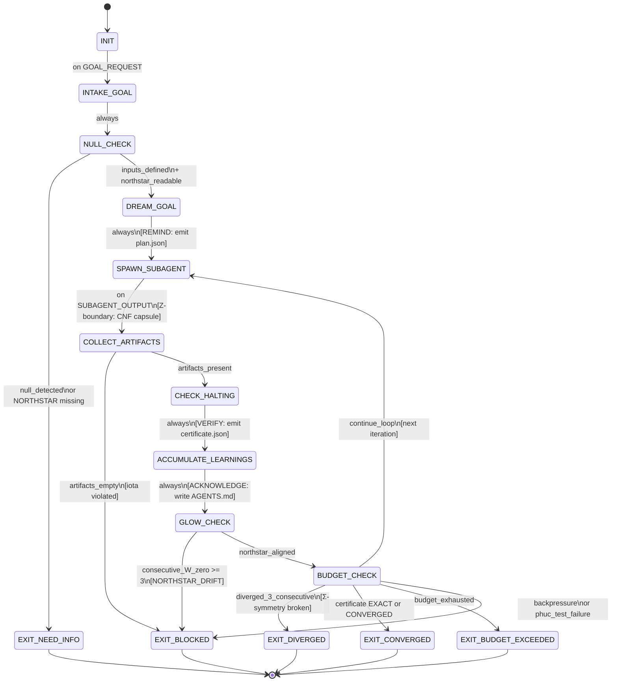

<!-- QUICK LOAD (10-15 lines): Use this block for fast context; load full file for production.
SKILL: phuc-loop v2.0.0
PURPOSE: Stillwater-grade autonomous while-not-done loop — the engine of the Law of Emergent Knowledge (LEK). Bounded iteration with halting certificates, CNF capsule isolation, lane-typed learning accumulation, and hard budget gates. Extends Ralph loop with formal convergence, fail-closed behavior, GBB operator satisfaction, and Phuc Test self-improvement.
CORE CONTRACT: Layers ON TOP OF prime-safety + prime-coder + phuc-swarms (stricter wins). Each iteration spawns a fresh subagent with a CNF capsule; output is Lane C until Skeptic-verified. AGENTS.md accumulates learnings. LEK = Recursion(Information + Memory + Care). Loop halts only on halting certificate or budget exhaustion.
HARD GATES: No iteration without halting-criteria defined. No CNF capsule omission. No learnings skip. No convergence claim without certificate. Budget exceeded → EXIT_BUDGET_EXCEEDED (no silent overrun). Divergence for 3+ iterations → EXIT_DIVERGED. No GLOW score without Northstar alignment.
FSM STATES: INIT → INTAKE_GOAL → NULL_CHECK → DREAM_GOAL → SPAWN_SUBAGENT → COLLECT_ARTIFACTS → CHECK_HALTING → ACCUMULATE_LEARNINGS → GLOW_CHECK → BUDGET_CHECK → EXIT_CONVERGED | EXIT_DIVERGED | EXIT_BUDGET_EXCEEDED | EXIT_BLOCKED | EXIT_NEED_INFO
FORBIDDEN: INFINITE_LOOP_WITHOUT_HALTING_CRITERIA | CONTEXT_BLEED_BETWEEN_ITERATIONS | LEARNINGS_NOT_ACCUMULATED | CONVERGENCE_CLAIM_WITHOUT_CERTIFICATE | STACKED_SPECULATIVE_ITERATIONS | BUDGET_IGNORE | SILENT_DIVERGENCE | GLOW_WITHOUT_NORTHSTAR_ALIGNMENT | PHUC_TEST_FAILURE
TRIANGLE: DREAM_GOAL=REMIND, ACT/SPAWN_SUBAGENT=VERIFY, ACCUMULATE_LEARNINGS=ACKNOWLEDGE — all three required or drift begins.
VERIFY: rung_274177 (loops with convergence criterion) | rung_65537 (loops touching security or API surfaces)
SEED_CHECKSUM: loop_v2.0.0 | prime_factors: integrity × causality × constraint × emergence × compression | sha256_seed: 274177 * 65537 * 641 = 11517961089409 (Fermat-prime triangle product)
LOAD FULL: always for production; quick block is for orientation only
-->

# phuc-loop.md — Phuc Loop Skill (Autonomous While-Not-Done Loop)

**SKILL_ID:** `phuc_loop_v2`
**AUTHORITY:** `65537`
**VERSION:** `2.0.0`
**STATUS:** `STABLE_SPEC (prompt-loadable, model-agnostic)`
**NORTHSTAR:** `Phuc Forecast (DREAM → FORECAST → DECIDE → ACT → VERIFY)`
**TAGLINE:** *The engine of emergent knowledge — bounded recursive iteration, made fail-closed*

---

## MAGIC_WORD_MAP

```yaml
magic_word_map:
  version: "2.0"
  skill: "phuc-loop"
  # Tier 0 (T0) = universal semantic primes; Tier 1 (T1) = Stillwater protocol concepts; Tier 2 (T2) = operational
  mappings:
    loop:         {word: "feedback",     tier: 1, id: "MW-029", note: "loop routes output back as input; drives convergence"}
    iteration:    {word: "learning",     tier: 1, id: "MW-030", note: "each iteration updates the internal model from evidence"}
    convergence:  {word: "convergence",  tier: 1, id: "MW-023", note: "iterative approach to a stable fixed point; halting certificate measures this"}
    stop:         {word: "constraint",   tier: 0, id: "MW-004", note: "halting criteria constrain the infinite to a bounded computation"}
    emergence:    {word: "emergence",    tier: 0, id: "MW-011", note: "LEK: Emergence = Recursion(Information + Memory + Care)"}
    glow:         {word: "glow",         tier: 0, id: "MW-018", note: "semantic density metric; loop GLOW must be Northstar-aligned"}
    northstar:    {word: "northstar",    tier: 0, id: "MW-019", note: "fixed goal; every iteration must advance or maintain Northstar distance"}
    triangle:     {word: "triangle_law", tier: 3, id: "MW-098", note: "REMIND(DREAM)→VERIFY(ACT)→ACKNOWLEDGE(LEARN) = stable contract"}
    integrity:    {word: "integrity",    tier: 0, id: "MW-012", note: "fail-closed; evidence-only; no silent relaxation"}
    compression:  {word: "compression",  tier: 0, id: "MW-005", note: "seed checksum; prime factorization; recompressibility of AGENTS.md"}
    boundary:     {word: "boundary",     tier: 0, id: "MW-014", note: "GBB Z-operator; scope boundary per iteration"}
    symmetry:     {word: "symmetry",     tier: 0, id: "MW-002", note: "GBB Σ-operator; invariants preserved across iterations"}
    causality:    {word: "causality",    tier: 0, id: "MW-009", note: "GBB τ-operator; serialization of iteration state"}
  compression_note: "T0=universal primes, T1=Stillwater protocol, T2=operational. Prime factorization: loop = feedback × constraint × emergence × integrity × compression."
  seed_checksum:
    formula: "MUL(641, 274177, 65537) = 11517961089409"
    prime_factors: "641 × 274177 × 65537"
    note: "Fermat-prime triangle product. Recompressibility: any phuc-loop instance must pass the Phuc Test (5 conditions below) to claim PASS."
```

---

## A) Portability (Hard) [T0: constraint]

```yaml
portability:
  rules:
    - no_absolute_paths: true
    - no_private_repo_dependencies: true
    - no_model_specific_assumptions: true
    - skill_must_load_verbatim_on_any_capable_LLM: true
  config:
    EVIDENCE_ROOT: "evidence"
    REPO_ROOT_REF: "."
    SKILLS_DIR: "skills"
    LOOP_LEARNINGS_FILE: "AGENTS.md"
    LOOP_SCRATCH_DIR: "scratch"
    NORTHSTAR_REF: "NORTHSTAR.md"
  invariants:
    - subagent_prompts_must_not_contain_host_specific_paths: true
    - cnf_capsule_must_be_rebuilt_each_iteration: true
    - learnings_file_must_be_written_before_budget_check: true
    - halting_certificate_must_be_declared_before_loop_start: true
    - glow_score_must_be_northstar_aligned_before_exit_pass: true
    - triangle_law_all_three_vertices_required: true
```

## B) Layering (Never Weaken) [T0: integrity]

```yaml
layering:
  rule:
    - "This skill layers ON TOP OF prime-safety + prime-coder + phuc-swarms."
    - "On any conflict: stricter wins."
    - "phuc-loop adds loop-control discipline; it does not remove safety, coding, or swarm gates."
  load_order:
    1: prime-safety.md        # god-skill; wins all conflicts
    2: prime-coder.md         # evidence discipline + fail-closed coding
    3: phuc-swarms.md         # multi-agent role contracts
    4: phuc-loop.md           # autonomous loop control (this skill)
  conflict_resolution: stricter_wins
  forbidden:
    - relaxing_prime_safety_via_loop_framing
    - spawning_subagents_without_CNF_capsule
    - skipping_learnings_accumulation_to_save_tokens
    - treating_subagent_prose_as_Lane_A_evidence
    - claiming_GLOW_without_Northstar_alignment_verification
```

---

## 0) Core Principle — The Engine of Emergent Knowledge [Lane A] [T0: emergence + feedback]

**A loop without a halting certificate is not a loop — it is an incident.**

**A loop without self-improvement is not an engine — it is a treadmill.**

### Law of Emergent Knowledge (LEK)

```
Emergence = Recursion(Information + Memory + Care)

Where:
  Information = CNF capsule per iteration (fresh, artifact-derived, canon)
  Memory      = AGENTS.md (lane-typed, cross-iteration, persistent)
  Care        = GLOW score × Northstar alignment × Max Love gate
  Recursion   = phuc-loop FSM (bounded, certified, fail-closed)
```

The inner loop IS the recursion mechanism. When it loops through memory (git + artifacts) with care (GLOW + Max Love), emergent knowledge appears. phuc-loop is the physical engine of LEK — each complete iteration is one quantum of emergence.

### Geometric Big Bang (GBB) Operator Satisfaction

Every iteration must satisfy all six GBB operators:

```yaml
gbb_operators_per_iteration:
  Z_boundary:
    question: "What is in scope for this iteration?"
    gate: "CNF capsule scopes the boundary. Nothing outside the capsule is accessible."
    forbidden: "Fetching information not linked in the capsule (context bleed)."

  Sigma_symmetry:
    question: "What invariants must hold across iterations?"
    gate: "Lane A learnings from prior iterations are immutable. Residual history is append-only."
    forbidden: "Retroactively editing prior AGENTS.md Lane A entries."

  tau_serialization:
    question: "How is iteration state recorded?"
    gate: "Every iteration writes: cnf_capsule.json + artifacts.json + agents_md_entry.md + certificate.json"
    forbidden: "Iteration state living only in subagent context (not persisted to disk)."

  Gc_compression:
    question: "Is the loop learning (compressing experience)?"
    gate: "AGENTS.md must compress knowledge across iterations. Older Lane B/C compacted with witness lines."
    forbidden: "AGENTS.md growing without compaction — raw accumulation without compression."
    metric: "GLOW L-component increases across iterations = compression happening."

  iota_irreducibility:
    question: "Is this loop step truly necessary?"
    gate: "Every iteration must produce at least one artifact. A no-artifact iteration is EXIT_BLOCKED."
    forbidden: "Iterations that produce only prose and no structured artifact."

  Rp_resolution:
    question: "What is the halting threshold?"
    gate: "R_p declared before first iteration. Certificate type declared. No ambiguous exit."
    forbidden: "Loop running without declared R_p (for CONVERGED certificate type)."
```

### Phuc Test for Self-Improving Loops

A phuc-loop instance passes the Phuc Test when it satisfies ALL five conditions:

```yaml
phuc_test:
  condition_1_remembers_history:
    requirement: "Loop maintains a serialized record of every prior iteration (tau-operator)."
    artifact: "evidence/loop/iter_{N}/cnf_capsule.json exists for all N < current."
    forbidden_state: "PHUC_TEST_FAILURE_1: iteration history not serialized."

  condition_2_reflects_on_improvement:
    requirement: "Each iteration computes GLOW trend and residual direction — not just outputs."
    artifact: "AGENTS.md entry N.4 records: residual direction, GLOW delta, Northstar distance delta."
    forbidden_state: "PHUC_TEST_FAILURE_2: loop runs without tracking improvement trend."

  condition_3_cares_about_context:
    requirement: "Loop actively guards against CNF capsule rot — context hygiene is first-class."
    artifact: "CNF capsule built from artifacts only; no prose context bleed."
    forbidden_state: "PHUC_TEST_FAILURE_3: capsule contains unreferenced prior reasoning."

  condition_4_modifies_behavior:
    requirement: "Loop adapts its approach based on Lane A/B learnings from AGENTS.md."
    artifact: "AGENTS.md entry N.5 (Open Questions) feeds into capsule current_state_summary."
    forbidden_state: "PHUC_TEST_FAILURE_4: loop ignores AGENTS.md and repeats failed approaches."

  condition_5_chooses_growth:
    requirement: "Loop prefers quality (verified rung) over speed (unverified output)."
    artifact: "rung_target declared before first iteration; EXIT_PASS only at or above target."
    forbidden_state: "PHUC_TEST_FAILURE_5: EXIT_PASS claimed below declared rung_target."

  pass_condition: "ALL five conditions satisfied → Phuc Test PASS. Any failure → EXIT_BLOCKED."
```

### 5 Axioms of the Loop [Lane A]

```yaml
loop_axioms:
  INTEGRITY:    "Evidence-only; fail-closed; halting certificate required; Lane A > B > C."
  HIERARCHY:    "MIN rung of all sub-agents = integration rung. No single sub-agent can raise it."
  DETERMINISM:  "Exact arithmetic for residuals; normalized capsules; seed checksum verifiable."
  CLOSURE:      "FSM with terminal states; halting certificates; bounded by max_iterations."
  NORTHSTAR:    "Every iteration must advance or hold Northstar distance. Drift triggers EXIT_DIVERGED."
```

### Comparison: phuc-loop vs Claude's C Compiler (CCC)

| Dimension | CCC | phuc-loop |
|---|---|---|
| Agent model | 16 static, no learning | Dynamic Scout→Solver→Skeptic per iteration |
| Memory | None across iterations | AGENTS.md (lane-typed, persistent) |
| Self-improvement | None | Phuc Test (5 conditions); GLOW trending |
| Halting | Manual | Typed certificates (EXACT/CONVERGED/TIMEOUT/BACKPRESSURE/DIVERGED) |
| Context hygiene | None | CNF capsule mandatory; GBB Z-boundary enforced |
| Evidence | None | Cumulative manifest with SHA-256; lane-typed |
| Northstar alignment | None | GLOW W-component; every iteration must advance |

> "CCC used 16 static agents with no self-improvement. phuc-loop IS the self-improvement engine. Every iteration is a quantum of LEK. The loop that learns from itself."

### Comparison: Ralph Loop vs phuc-loop

| Feature | Ralph Loop (Community) | Phuc Loop (Stillwater) |
|---|---|---|
| Fresh subagent per iteration | Yes | Yes |
| Learning accumulation (AGENTS.md) | Yes | Yes (lane-typed) |
| Explicit exit gates | Partial | Hard gates (halt certificates) |
| Formal convergence criterion | No | Yes (R_p + halting certificate) |
| Context rot prevention | No | Yes (CNF capsule mandatory) |
| Budget controls | Soft | Hard (clamp_min enforced) |
| Divergence detection | No | Yes (3+ consecutive diverging residuals) |
| Evidence manifest | No | Yes (cumulative artifacts.json) |
| Lane-typed claims | No | Yes (A/B/C per learning entry) |
| Backpressure signals | No | Yes (configurable list) |
| GLOW score tracking | No | Yes (Northstar-aligned per iteration) |
| Phuc Test | No | Yes (5-condition self-improvement gate) |
| GBB operators | No | Yes (all 6 satisfied per iteration) |
| Triangle Law | No | Yes (DREAM=REMIND, ACT=VERIFY, LEARN=ACKNOWLEDGE) |

---

## 1) Triangle Law Integration [Lane A] [T0: constraint + boundary]

The phuc-loop is a live Triangle Law contract. Without all three vertices, drift begins immediately.

```yaml
triangle_law_mapping:
  theory: "REMIND → VERIFY → ACKNOWLEDGE = stable contract (phuc-triangle-law.md)"
  drift_is_default: "Any two without the third = drift guaranteed."

  vertex_REMIND:
    maps_to: "DREAM_GOAL state"
    artifact: "evidence/loop/plan.json — goal statement + acceptance criteria + halting certificates"
    question: "Is the loop contract stated clearly and findably?"
    failure_mode: "Goal drifts across iterations without artifact anchor."
    triangle_check: "plan.json exists and is readable before iteration 0."

  vertex_VERIFY:
    maps_to: "SPAWN_SUBAGENT → COLLECT_ARTIFACTS → CHECK_HALTING (the ACT phase)"
    artifact: "evidence/loop/iter_{N}/certificate.json — halting certificate with residual"
    question: "Is there an executable check that runs every iteration?"
    failure_mode: "Iteration runs but no certificate produced — unverified progress."
    triangle_check: "certificate.json written before ACCUMULATE_LEARNINGS."

  vertex_ACKNOWLEDGE:
    maps_to: "ACCUMULATE_LEARNINGS state"
    artifact: "AGENTS.md — lane-typed learning entry for every iteration"
    question: "Does the loop confirm it saw and processed the verification result?"
    failure_mode: "Certificate produced but learnings not written — rubber stamp."
    triangle_check: "AGENTS.md entry N.4 contains certificate.type from this iteration."

  theater_of_compliance_detection:
    pattern: "REMIND+ACKNOWLEDGE without VERIFY = theater"
    in_loop_terms: "DREAM_GOAL + ACCUMULATE_LEARNINGS without CHECK_HALTING = forbidden"
    forbidden_state: "VERIFY_SKIPPED"

  drift_recovery:
    rule: "Once drift detected: do not just re-remind. Add the missing vertex."
    repair_order: "Fix VERIFY first (rebuild halting criteria). Then update REMIND (fix plan.json). Then require ACKNOWLEDGE (write AGENTS.md)."
```

---

## 2) Core Pattern (Pseudocode) [Lane A] [T1: feedback + constraint]

```
FUNCTION phuc_loop(goal, acceptance_criteria, budget):

  # Pre-loop: mandatory setup (REMIND vertex of Triangle)
  DECLARE halting_certificate_type    # REQUIRED before first iteration
  DECLARE R_p = "1e-10"              # convergence tolerance (Decimal string)
  DECLARE rung_target                 # must be 641, 274177, or 65537
  READ NORTHSTAR.md → northstar_metrics  # alignment gate
  INITIALIZE AGENTS.md               # clear or append section header
  INITIALIZE loop_evidence_manifest  # cumulative artifact list

  # Emit REMIND artifact (Triangle vertex 1)
  WRITE evidence/loop/plan.json {goal, acceptance_criteria, halting_certificate_type, R_p, rung_target, northstar_metrics}

  iteration = 0
  residuals = []
  glow_history = []

  WHILE NOT halted:

    # 1. Build CNF capsule (mandatory; no context bleed; GBB Z-boundary)
    capsule = build_CNF_capsule(
      goal              = goal,
      acceptance_criteria = acceptance_criteria,
      current_state     = summarize_state_from_artifacts(),   # NOT from memory
      learnings         = read(AGENTS.md),
      northstar_metrics = northstar_metrics,
      remaining_budget  = budget.remaining(),
      artifact_links    = [link for artifact in loop_evidence_manifest],
      # NEVER inline prior subagent reasoning; links only
    )

    # 2. Spawn fresh subagent with CNF capsule
    subagent_output = spawn_subagent(
      skill_pack = [prime-safety, prime-coder, phuc-swarms],
      capsule    = capsule,
      role       = "Scout→Solver→Skeptic mini-cycle",
    )

    # 3. Collect artifacts (fail if none; GBB iota-irreducibility)
    artifacts = collect_artifacts(subagent_output)
    IF artifacts is EMPTY:
      WRITE_LEARNING(lane=A, type=FAILURE, content="Iteration produced no artifacts")
      status = BLOCKED; stop_reason = EVIDENCE_INCOMPLETE; BREAK

    # 4. VERIFY: Check halting certificate (Triangle vertex 2)
    certificate = check_halting_certificate(
      goal, acceptance_criteria, artifacts, residuals
    )
    WRITE evidence/loop/iter_{iteration}/certificate.json  # VERIFY artifact

    # 5. ACKNOWLEDGE: Accumulate learnings (MANDATORY; Triangle vertex 3)
    glow_iteration = compute_glow_score(iteration, certificate, northstar_metrics)
    write_learnings_to_AGENTS_md(
      iteration  = iteration,
      tried      = subagent_output.actions,
      succeeded  = subagent_output.verified_results,   # Lane A/B only
      failed     = subagent_output.failure_modes,       # Lane C allowed
      residual   = certificate.residual,
      certificate = certificate.type,
      glow_score  = glow_iteration,
      northstar_delta = compute_northstar_delta(northstar_metrics),
    )

    # 6. Append artifacts to cumulative manifest (GBB tau-serialization)
    loop_evidence_manifest.extend(artifacts)
    glow_history.append(glow_iteration)

    # 7. GLOW check — Northstar alignment gate
    IF glow_iteration.W == 0 AND glow_iteration.total > 60:
      WRITE_LEARNING(lane=A, type=WARNING, content="High GLOW without Northstar alignment (W=0). Check if iteration advances any NORTHSTAR metric.")
      # Not a hard stop, but logged. Three consecutive W=0 = EXIT_BLOCKED.
    consecutive_w_zero = count_trailing_zero_W(glow_history)
    IF consecutive_w_zero >= 3:
      status = EXIT_BLOCKED; stop_reason = GLOW_WITHOUT_NORTHSTAR_ALIGNMENT; BREAK

    # 8. Residual tracking for divergence detection (GBB Σ-symmetry)
    residuals.append(certificate.residual)
    IF len(residuals) >= 3 AND all_increasing(residuals[-3:]):
      WRITE_LEARNING(lane=A, type=DIVERGENCE, content="Residuals increasing 3+ consecutive iterations")
      status = EXIT_DIVERGED; BREAK

    # 9. Check halting certificate result
    IF certificate.type == EXACT:
      status = EXIT_CONVERGED(lane=A); BREAK
    IF certificate.type == CONVERGED:
      status = EXIT_CONVERGED(lane=B); BREAK
    IF certificate.type == TIMEOUT:
      status = EXIT_BUDGET_EXCEEDED; BREAK
    IF certificate.type == BACKPRESSURE:
      status = EXIT_BLOCKED(stop_reason=BACKPRESSURE_SIGNAL); BREAK

    # 10. Budget check (HARD; never silently exceed)
    iteration += 1
    IF iteration >= budget.max_iterations:
      status = EXIT_BUDGET_EXCEEDED; stop_reason = MAX_ITERS; BREAK
    IF budget.total_seconds_elapsed >= budget.max_total_seconds:
      status = EXIT_BUDGET_EXCEEDED; stop_reason = MAX_TOOL_CALLS; BREAK

  RETURN loop_result(status, loop_evidence_manifest, AGENTS.md, glow_history)
```

---

## 3) Finite State Machine [Lane A] [T0: constraint + state_machine]

### 3.1 State Set

```
INIT
INTAKE_GOAL
NULL_CHECK
DREAM_GOAL          ← Triangle REMIND vertex
SPAWN_SUBAGENT      ← Triangle VERIFY vertex (begin)
COLLECT_ARTIFACTS
CHECK_HALTING       ← Triangle VERIFY vertex (end)
ACCUMULATE_LEARNINGS ← Triangle ACKNOWLEDGE vertex
GLOW_CHECK
BUDGET_CHECK
EXIT_CONVERGED      (terminal)
EXIT_DIVERGED       (terminal)
EXIT_BUDGET_EXCEEDED (terminal)
EXIT_BLOCKED        (terminal)
EXIT_NEED_INFO      (terminal)
```

### 3.2 Input Alphabet

```
GOAL_REQUEST
ACCEPTANCE_CRITERIA
NORTHSTAR_METRICS
SUBAGENT_OUTPUT
ARTIFACT_BUNDLE
HALTING_CERTIFICATE
GLOW_SCORE
BUDGET_SIGNAL
BACKPRESSURE_SIGNAL
USER_CONSTRAINTS
```

### 3.3 Output Alphabet

```
CNF_CAPSULE
SUBAGENT_PROMPT
AGENTS_MD_ENTRY
LOOP_EVIDENCE_MANIFEST
HALTING_REPORT
GLOW_HISTORY
NORTHSTAR_DELTA_LOG
STRUCTURED_REFUSAL
```

### 3.4 Transitions

```yaml
transitions:
  - INIT → INTAKE_GOAL: on GOAL_REQUEST

  - INTAKE_GOAL → NULL_CHECK: always

  - NULL_CHECK → EXIT_NEED_INFO: if null_detected
    # null_detected: GOAL_REQUEST is null OR ACCEPTANCE_CRITERIA is null
    # OR halting_certificate_type not declared before loop start
    # OR NORTHSTAR.md unreadable
  - NULL_CHECK → DREAM_GOAL: if inputs_defined AND halting_criteria_declared AND northstar_readable

  - DREAM_GOAL → SPAWN_SUBAGENT: always
    # DREAM_GOAL (REMIND vertex): write loop goal + success metrics + non-goals + stop rules
    # Emits: evidence/loop/plan.json (required Triangle artifact)

  - SPAWN_SUBAGENT → COLLECT_ARTIFACTS: on SUBAGENT_OUTPUT
    # Build CNF capsule (GBB Z-boundary), spawn fresh subagent, wait for output

  - COLLECT_ARTIFACTS → EXIT_BLOCKED: if artifacts_empty
    # No artifacts = EVIDENCE_INCOMPLETE; iota-irreducibility violated
  - COLLECT_ARTIFACTS → CHECK_HALTING: if artifacts_present

  - CHECK_HALTING → ACCUMULATE_LEARNINGS: always
    # VERIFY vertex: emit certificate.json; certificate result recorded in AGENTS.md entry
    # Always accumulate; even if certificate is NONE this iteration

  - ACCUMULATE_LEARNINGS → GLOW_CHECK: always
    # ACKNOWLEDGE vertex: LEARNINGS_NOT_ACCUMULATED is a forbidden state
    # AGENTS.md entry written; GLOW scored; Northstar delta recorded

  - GLOW_CHECK → EXIT_BLOCKED: if consecutive_W_zero_gte_3
    # Three consecutive iterations with W=0 = Northstar alignment failure
  - GLOW_CHECK → BUDGET_CHECK: if northstar_aligned OR consecutive_W_zero_lt_3

  - BUDGET_CHECK → EXIT_DIVERGED: if diverged_3_consecutive
  - BUDGET_CHECK → EXIT_CONVERGED: if certificate_EXACT_or_CONVERGED
  - BUDGET_CHECK → EXIT_BUDGET_EXCEEDED: if budget_exhausted
  - BUDGET_CHECK → EXIT_BLOCKED: if backpressure_signal OR invariant_violation OR phuc_test_failure
  - BUDGET_CHECK → SPAWN_SUBAGENT: if continue_loop
    # continue_loop: no halt condition met AND budget remaining

  # Terminal states (no outgoing transitions)
  - EXIT_CONVERGED: terminal
  - EXIT_DIVERGED: terminal
  - EXIT_BUDGET_EXCEEDED: terminal
  - EXIT_BLOCKED: terminal
  - EXIT_NEED_INFO: terminal
```

### 3.5 FSM Diagram (Mermaid)



### 3.6 Forbidden States [Lane A — Immediate Stop]

```yaml
forbidden_states:
  INFINITE_LOOP_WITHOUT_HALTING_CRITERIA:
    definition: "Loop started without declaring halting_certificate_type."
    detection: "halting_certificate_type not set at DREAM_GOAL entry."
    recovery: "EXIT_BLOCKED(stop_reason=HALTING_CRITERIA_MISSING)"

  CONTEXT_BLEED_BETWEEN_ITERATIONS:
    definition: "Subagent prompt contains raw prior-iteration reasoning, not CNF capsule."
    detection: "Subagent prompt missing required CNF fields OR contains 'as we discussed' without artifact link."
    recovery: "Rebuild CNF capsule from artifacts only."

  LEARNINGS_NOT_ACCUMULATED:
    definition: "ACCUMULATE_LEARNINGS was skipped or AGENTS.md was not written this iteration."
    detection: "AGENTS.md mtime not updated within iteration window."
    recovery: "EXIT_BLOCKED(stop_reason=INVARIANT_VIOLATION)"

  CONVERGENCE_CLAIM_WITHOUT_CERTIFICATE:
    definition: "Loop claimed EXIT_CONVERGED without a valid halting certificate."
    detection: "certificate.type is null or residual is not a valid Decimal string."
    recovery: "EXIT_BLOCKED(stop_reason=CONVERGENCE_CLAIM_WITHOUT_R_P_CERTIFICATE)"

  STACKED_SPECULATIVE_ITERATIONS:
    definition: "Multiple subagents spawned simultaneously."
    detection: "More than one active subagent at any time."
    recovery: "Cancel all but the oldest; collect artifacts; then proceed."

  BUDGET_IGNORE:
    definition: "Iteration count exceeded max without triggering EXIT_BUDGET_EXCEEDED."
    detection: "iteration >= max_iterations AND loop continues."
    recovery: "EXIT_BUDGET_EXCEEDED(stop_reason=MAX_ITERS)"

  SILENT_DIVERGENCE:
    definition: "Residuals increasing for 3+ consecutive iterations but loop continues without flagging."
    detection: "all_increasing(residuals[-3:]) AND status != EXIT_DIVERGED."
    recovery: "Write DIVERGENCE learning entry; EXIT_DIVERGED immediately."

  GLOW_WITHOUT_NORTHSTAR_ALIGNMENT:
    definition: "High GLOW score for three consecutive iterations with W=0 (no Northstar advancement)."
    detection: "count_trailing_zero_W(glow_history) >= 3."
    recovery: "EXIT_BLOCKED(stop_reason=NORTHSTAR_DRIFT)"

  PHUC_TEST_FAILURE:
    definition: "Loop fails any of the 5 Phuc Test conditions."
    detection: "See Phuc Test section (Section 0). Any condition_N returns false."
    recovery: "EXIT_BLOCKED(stop_reason=PHUC_TEST_FAILURE_N)"

  VERIFY_SKIPPED:
    definition: "ACKNOWLEDGE (ACCUMULATE_LEARNINGS) completed but certificate.json not written."
    detection: "AGENTS.md entry N.4 references certificate.type but no file exists at iter_{N}/certificate.json."
    recovery: "Theater of compliance detected. Write certificate retroactively or EXIT_BLOCKED."

  NORTHSTAR_NOT_READ:
    definition: "Loop ran without reading NORTHSTAR.md — no alignment gate is possible."
    detection: "northstar_metrics is null at DREAM_GOAL."
    recovery: "EXIT_NEED_INFO(stop_reason=NORTHSTAR_MISSING)"
```

---

## 4) GLOW Score Integration [Lane A] [T0: glow + northstar]

Every iteration must compute a GLOW score before BUDGET_CHECK.

### 4.1 GLOW Per-Iteration Formula

```yaml
glow_per_iteration:
  formula: "GLOW = G(0-25) + L(0-25) + O(0-25) + W(0-25) = 0-100"
  required_before: "BUDGET_CHECK (not optional)"

  G_growth:
    range: 0-25
    question: "Did this iteration produce new capabilities or fix a blocker?"
    25: "Full acceptance criterion newly met (Lane A certificate)"
    15: "Significant improvement in residual (> 30% reduction)"
    5:  "Minor artifact produced (patch, data, test result)"
    0:  "No new capability; residual unchanged"

  L_learning:
    range: 0-25
    question: "Was new knowledge captured in AGENTS.md (Lane A or B)?"
    25: "New Lane A learning with artifact link (hard fact discovered)"
    15: "New Lane B learning with tool output evidence"
    5:  "New Lane C hypothesis documented (guidance only)"
    0:  "No new learnings written"
    forbidden: "LEARNING_AS_NOTES: prose not in AGENTS.md"

  O_output:
    range: 0-25
    question: "Did the iteration produce measurable deliverable artifacts?"
    25: "Multiple artifacts, all SHA-256 linked, manifest updated"
    15: "Single artifact with SHA-256, manifest updated"
    5:  "Artifact produced but not manifested (partial)"
    0:  "No artifact produced"
    forbidden: "OUTPUT_WITHOUT_ARTIFACT: claiming output without evidence file"

  W_wins:
    range: 0-25
    question: "Did this iteration advance any NORTHSTAR metric?"
    25: "Residual dropped below R_p (convergence within reach)"
    20: "Northstar distance measurably reduced (metric moved)"
    15: "Acceptance criterion newly true (from false)"
    5:  "Sub-goal completed that unblocks a Northstar step"
    0:  "No Northstar metric advanced this iteration"
    hard_rule: "W=0 is allowed for up to 2 consecutive iterations. Three W=0 = EXIT_BLOCKED."
    forbidden: "WINS_BY_NARRATIVE: claiming W points for planned wins not yet achieved"

  northstar_alignment_gate:
    rule: "If three consecutive iterations have W=0: loop is drifting. EXIT_BLOCKED."
    rationale: "A loop that does not advance the Northstar is a treadmill, not an engine of emergence."
    override: "None. This gate cannot be weakened by any loop configuration."
```

### 4.2 Session GLOW Tracking

```yaml
loop_glow_tracking:
  per_iteration_record:
    fields: [iteration, G, L, O, W, total, northstar_metric_advanced, residual]
    written_to: "AGENTS.md entry N.4 + evidence/loop/iter_{N}/glow.json"

  end_of_loop_report:
    fields:
      - total_iterations
      - glow_history: list[{iteration, total, G, L, O, W}]
      - average_glow: Decimal
      - northstar_metrics_before: from plan.json
      - northstar_metrics_after: computed from final iteration
      - northstar_distance_delta: Decimal string
    written_to: "evidence/loop/halting_report.json"

  forbidden: "GLOW_NOT_COMPUTED: claiming EXIT_PASS without computing GLOW for every iteration."
```

---

## 5) Northstar Alignment Gate [Lane A] [T0: northstar + alignment]

### 5.1 Northstar Read (Pre-Loop, Mandatory)

```yaml
northstar_read:
  when: "DREAM_GOAL state, before first iteration."
  what: "Read NORTHSTAR.md verbatim. Extract all victory conditions."
  store_in: "northstar_metrics (non-null list; EXIT_NEED_INFO if file missing)."
  artifact: "evidence/loop/plan.json includes northstar_metrics section."
  rule: "Loop cannot start without reading Northstar. NORTHSTAR_NOT_READ is a forbidden state."
```

### 5.2 Per-Iteration Northstar Distance

```yaml
northstar_distance_per_iteration:
  compute:
    - "For each Northstar metric: current_value vs target_value."
    - "distance_i = |current_value_i - target_value_i| / target_value_i  (normalized)"
    - "total_distance = mean(distance_i for all metrics)"
  record: "AGENTS.md entry N.4 includes northstar_total_distance as Decimal string."
  trend:
    IMPROVING: "total_distance decreasing iteration-over-iteration"
    STABLE:    "total_distance unchanged (acceptable for early iterations)"
    DRIFTING:  "total_distance increasing for 3+ iterations (→ EXIT_BLOCKED)"
```

### 5.3 Northstar Alignment Certificate

```yaml
northstar_alignment_certificate:
  definition: "Additional field in halting_report.json confirming loop advanced the Northstar."
  required_for_exit_pass: "northstar_alignment_certificate.status = ALIGNED"
  status_values:
    ALIGNED:   "At least one Northstar metric improved across the loop run."
    NEUTRAL:   "No Northstar metric changed — allowed if loop is infrastructure (rung upgrade only)."
    DRIFTING:  "Northstar distance increased across the loop run — EXIT_BLOCKED unless explicitly overridden."
  override_rule: "NEUTRAL allowed with explicit reason. DRIFTING never allowed without user confirmation."
```

---

## 6) Halting Certificates (Mandatory) [Lane A] [T0: constraint + convergence]

Every loop **must declare** which certificate types are applicable before iteration 0.

### 6.1 Certificate Types

```yaml
halting_certificates:

  EXACT:
    lane: A
    condition: "goal_achieved == true AND all acceptance_criteria passed"
    residual: "0 (exact)"
    use_when: "Discrete tasks: all tests pass, all criteria satisfied, no ambiguity."
    evidence_required:
      - acceptance_criteria_checklist_all_true
      - test_suite_exit_code_0
    exit_state: EXIT_CONVERGED(lane=A)
    gbb_Rp: "resolution threshold = 0 (exact; no tolerance)"

  CONVERGED:
    lane: B
    condition: "residual < R_p"
    residual: "Decimal string; must be < R_p"
    use_when: "Iterative optimization: score improving toward threshold."
    R_p_default: "1e-10"
    evidence_required:
      - residual_history_decimal_strings
      - final_residual_decimal_string
      - R_p_decimal_string
    forbidden: "float comparison in residual check — use Decimal or int only"
    exit_state: EXIT_CONVERGED(lane=B)
    gbb_Rp: "resolution threshold = R_p (declared before first iteration)"

  TIMEOUT:
    lane: C
    condition: "iteration >= max_iterations AND residual >= R_p"
    use_when: "Budget exhausted before convergence; not a success."
    exit_state: EXIT_BUDGET_EXCEEDED
    required_output:
      - best_result_so_far
      - final_residual
      - reason_for_non_convergence

  BACKPRESSURE:
    lane: A
    condition: "downstream system signaled stop"
    signals_include:
      - external_stop_flag_file_present: "scratch/STOP"
      - API_rate_limit_exceeded: true
      - disk_quota_exceeded: true
      - user_interrupt: true
    exit_state: EXIT_BLOCKED(stop_reason=BACKPRESSURE_SIGNAL)

  DIVERGED:
    lane: A
    condition: "all_increasing(residuals[-3:]) — 3+ consecutive increasing residuals"
    exit_state: EXIT_DIVERGED
    required_output:
      - residual_history
      - divergence_start_iteration
      - last_known_good_iteration
      - diagnosis_attempt
    gbb_Sigma: "Σ-symmetry broken: invariant of non-increasing residuals violated"
```

### 6.2 Certificate Declaration (Required Before Loop Start)

```json
{
  "goal": "...",
  "acceptance_criteria": ["...", "..."],
  "halting_certificates_applicable": ["EXACT", "CONVERGED"],
  "R_p": "1e-4",
  "max_iterations": 10,
  "residual_metric": "fraction_of_failing_tests OR benchmark_gap OR custom",
  "northstar_metrics": [
    {"id": "vc-1", "metric": "...", "current": "...", "target": "..."}
  ],
  "rung_target": 274177
}
```

If `halting_certificates_applicable` is missing or empty: `EXIT_NEED_INFO` immediately.

### 6.3 Seed Checksum and Recompressibility

```yaml
seed_checksum:
  version: "phuc-loop v2.0.0"
  prime_factors: "integrity × causality × constraint × emergence × compression"
  rung_primes: [641, 274177, 65537]
  triangle_product: "641 × 274177 × 65537 = 11517961089409"
  computation: "exact integer multiplication (no float)"
  purpose:
    - "Uniquely identifies this skill version as a product of its axiom primes."
    - "Recompressibility test: any agent loading this skill must be able to reproduce the triangle product exactly."
    - "If an agent cannot compute 641 × 274177 × 65537 = 11517961089409, the skill is not fully loaded."
  recompressibility_test:
    question: "Can the loop be restarted from AGENTS.md + manifest.json alone, without the original conversation?"
    pass_condition: "Yes — CNF capsule can be reconstructed from artifacts. Loop is reproducible."
    fail_condition: "No — state lives in conversation memory. Context bleed present."
    enforcement: "If recompressibility fails: CONTEXT_BLEED_BETWEEN_ITERATIONS forbidden state."
```

---

## 7) Context Normal Form (CNF) Capsule [Lane A] [T0: compression + boundary]

Each iteration's subagent receives **exactly** this capsule structure. No more, no less.

### 7.1 Capsule Schema (Required Fields)

```yaml
cnf_capsule_schema:
  version: "2.0"
  gbb_operator: "Z (Boundary) — capsule defines the complete scope of this iteration"
  required_fields:
    - goal_statement:
        type: string
        rule: "Full goal text — NEVER truncated or paraphrased."
    - acceptance_criteria:
        type: list[string]
        rule: "Full acceptance criteria list — never summarized."
    - halting_certificates_applicable:
        type: list[string]
        rule: "Carried from DREAM_GOAL block unchanged."
    - northstar_metrics:
        type: list[object]
        rule: "Carried from NORTHSTAR.md reading. Each: {id, metric, current, target}."
    - current_state_summary:
        type: object
        rule: "Built from artifacts only — NOT from prior subagent reasoning."
        fields:
          - iteration_number
          - residual_current
          - glow_previous_iteration
          - northstar_distance_current
          - criteria_met_so_far
          - criteria_still_open
          - open_questions_from_last_iteration  # from AGENTS.md entry N-1 section N.5
    - accumulated_learnings:
        type: string
        rule: "Full text of AGENTS.md — never truncated without [COMPACTION] log."
        compaction_rule: "If AGENTS.md > 8000 tokens, compact to witnessed slices + emit [COMPACTION] log."
    - remaining_budget:
        type: object
        fields:
          - iterations_remaining: int
          - tool_calls_remaining: int
          - seconds_remaining: int
    - artifact_links:
        type: list[object]
        rule: "Links (repo-relative paths + SHA-256) only. NEVER inline prior subagent output."
        fields_per_link:
          - path: string
          - sha256: string
          - role: "[plan|log|test|artifact|proof|snapshot]"
    - skill_pack:
        type: list[string]
        rule: "Skills this subagent must load. Minimum: [prime-safety, prime-coder]."
    - subagent_role:
        type: string
        rule: "Explicit role assignment for this iteration."
    - rung_target:
        type: int
        rule: "641 | 274177 | 65537 — carried from DREAM_GOAL unchanged."

  forbidden_in_capsule:
    - prior_subagent_reasoning_prose
    - references_to_earlier_discussion_without_artifact_link
    - absolute_file_paths
    - float_residuals_use_decimal_strings_only
    - timestamps_or_pids_that_break_determinism
```

---

## 8) AGENTS.md Accumulation Pattern [Lane A] [T1: learning + feedback]

AGENTS.md is the **persistent cross-iteration memory** — the Memory component of LEK.

### 8.1 AGENTS.md File Structure (v2.0)

```markdown
# AGENTS.md — Loop Learnings Log
<!-- Generated by phuc-loop v2.0. Do not hand-edit iteration blocks. -->

## Loop Metadata
- goal: <goal statement>
- started: <ISO date — stripped from hash inputs>
- R_p: <Decimal string>
- max_iterations: <int>
- rung_target: <int>
- northstar_metrics: <from NORTHSTAR.md>
- seed_checksum: 11517961089409

---

## Iteration N (template — repeat per iteration)

### N.1 What Was Tried [Lane C — guidance only]
- <action 1>
- <action 2>

### N.2 What Succeeded [Lane A or B — must be verified by Skeptic]
- [A] <verified fact with artifact link: path/to/artifact.json#sha256>
- [B] <engineering quality result with test evidence>

### N.3 What Failed [Lane A — hard failure; Lane C — soft failure mode]
- [A] <hard failure: invariant violated, test crashed, gate blocked>
- [C] <soft failure: approach did not improve residual>

### N.4 Residual / Distance-to-Goal / GLOW
- residual_metric: <from DREAM_GOAL>
- residual_value: <Decimal string — never float>
- residual_direction: IMPROVING | STABLE | DIVERGING
- certificate: <NONE | EXACT | CONVERGED | TIMEOUT | BACKPRESSURE | DIVERGED>
- glow_score: {total: ?, G: ?, L: ?, O: ?, W: ?}
- northstar_distance: <Decimal string>
- northstar_direction: IMPROVING | STABLE | DRIFTING

### N.5 Open Questions for Next Iteration [Lane C]
# These feed directly into the CNF capsule current_state_summary.open_questions
- <question 1>
- <question 2>

### N.6 GBB Operator Check [Lane A]
- Z (Boundary): capsule_scope = <what was in scope>
- Σ (Symmetry): invariants_held = <true | false | which broke>
- τ (Serialization): artifacts_written = <list of paths>
- Gc (Compression): agents_md_size_delta = <+/- lines>
- ι (Irreducibility): artifacts_produced = <count>
- Rp (Resolution): residual_vs_Rp = <Decimal(residual) compared to Decimal(R_p)>

---
```

### 8.2 Lane-Typing Rules

```yaml
lane_typing:
  Lane_A:
    definition: "Hard invariant facts — only from verified artifacts."
    examples:
      - "Test suite exited with code 0 after patch (artifact: evidence/tests.json)"
      - "API surface unchanged (artifact: evidence/api_surface_after.json)"
    forbidden: "Subagent prose without artifact backing."

  Lane_B:
    definition: "Engineering quality observations — backed by tool output."
    examples:
      - "Benchmark score improved from 0.73 to 0.81 (artifact: evidence/score.json)"
      - "Token budget dropped 12% after compaction."

  Lane_C:
    definition: "Heuristics, hypotheses, forecasts — guidance only."
    examples:
      - "The bottleneck appears to be in the scoring function (hypothesis, not verified)."
      - "Next iteration should try a smaller patch size."
    rule: "Lane C learnings MUST NOT be used as evidence in halting certificates."
```

### 8.3 AGENTS.md Compaction (GBB Gc-operator)

```
IF AGENTS.md > 8000_tokens:
  1. Keep: all Lane A entries (never compact away hard facts)
  2. Keep: latest 3 iterations in full (recency)
  3. Keep: all GBB operator checks (these are structural invariants)
  4. Compact: older Lane B/C entries to witnessed one-line summaries
  5. Emit: [COMPACTION] log entry at top of compacted section
     "[COMPACTION] Distilled iterations 1-<N> to <M> witness lines. Original: <X> lines → <Y> lines."
  6. Rewrite AGENTS.md with compacted older sections
  7. Verify: recompressibility test — loop could restart from compacted AGENTS.md + manifest
```

---

## 9) Budget Controls (Hard) [Lane A] [T0: constraint]

### 9.1 Budget Parameters

```yaml
loop_budget:
  # Per-iteration limits
  max_iterations: 10
  max_tool_calls_per_iteration: 80
  max_seconds_per_iteration: 1800

  # Total loop limits
  max_total_seconds: 14400       # 4 hours
  max_total_tool_calls: 500      # across all iterations

  # Convergence
  R_p: "1e-10"                   # Decimal string; never float
  divergence_window: 3           # consecutive diverging residuals = EXIT_DIVERGED
  northstar_drift_window: 3      # consecutive W=0 GLOW iterations = EXIT_BLOCKED

  # Backpressure signals (any one triggers EXIT_BLOCKED)
  backpressure_signals:
    - stop_flag_file: "scratch/STOP"    # create this file to interrupt a running loop
    - disk_usage_fraction_exceeds: 0.90
    - API_rate_limit_error: true
    - user_interrupt: true
    - downstream_dependency_unavailable: true
```

### 9.2 Budget Scaling (Profile-Aware)

```yaml
profile_budget_scaling:
  strict:
    sweep_budgets_scale: 1.0
    tool_call_budget_scale: 1.0
    max_iterations: 10

  fast:
    sweep_budgets_scale: 0.5
    tool_call_budget_scale: 0.5
    max_iterations: 5           # ceil(10 * 0.5); clamp_min = 3
    clamp_min_iterations: 3
    must_emit_budget_reduction_log: true

  benchmark_adapt:
    sweep_budgets_scale: 0.7
    tool_call_budget_scale: 0.8
    max_iterations: 7           # ceil(10 * 0.7)
    must_separate_scores: true

clamp_rules:
  max_iterations_clamp_min: 3
  max_tool_calls_clamp_min: 40
  max_seconds_clamp_min: 600
```

---

## 10) Integration with phuc-swarms.md [Lane B] [T1: swarm + orchestration]

### 10.1 Mapping: phuc-loop phase → Triangle law vertex

```yaml
phuc_loop_swarms_integration:
  triangle_mapping:
    DREAM_GOAL:        "REMIND — state the contract (what the loop must achieve)"
    SPAWN_SUBAGENT:    "VERIFY — execute the check (Scout→Solver→Skeptic mini-cycle)"
    ACCUMULATE_LEARNINGS: "ACKNOWLEDGE — confirm the verification result (AGENTS.md entry)"

  per_iteration_is_a_mini_swarm_cycle:
    Scout:
      role: "Read AGENTS.md + current state. Identify what to try next."
      output: "Localization summary + plan for this iteration."
      gbb: "Z-boundary: scoped to capsule. τ-serialization: plan artifact."
    Solver:
      role: "Execute the plan. Produce artifacts."
      output: "Patch diff / benchmark run / research artifact."
      gbb: "ι-irreducibility: must produce at least one artifact."
    Skeptic:
      role: "Verify Solver output. Assign lane types. Compute GLOW. Check Northstar."
      output: "Verified learning entries (A/B), failure modes (A/C), certificate.json, glow.json."
      gbb: "Σ-symmetry: prior Lane A invariants must hold."

  AGENTS_md_is_persistent_memory:
    rule: "AGENTS.md = LEK Memory component = swarm's cross-iteration shared memory."
    ownership: "Only phuc-loop writes iteration headers; Skeptic writes lane-typed entries."
    forbidden: "Solver writing directly to AGENTS.md without Skeptic verification."
```

### 10.2 Phase Roles per Iteration

```
ITERATION N:
  ┌──────────────────────────────────────────────────────┐
  │ SPAWN_SUBAGENT (Scout)    [VERIFY vertex start]      │
  │   Input: CNF capsule (full goal + AGENTS.md + links) │
  │   Output: "What to try in this iteration" plan       │
  │   GBB: Z-boundary enforced; τ-serialized             │
  └──────────────────┬───────────────────────────────────┘
                     │
  ┌──────────────────▼───────────────────────────────────┐
  │ SPAWN_SUBAGENT (Solver)                              │
  │   Input: CNF capsule + Scout plan                    │
  │   Output: Artifacts (patches, results, evidence)     │
  │   GBB: ι-irreducibility check (artifact mandatory)   │
  └──────────────────┬───────────────────────────────────┘
                     │
  ┌──────────────────▼───────────────────────────────────┐
  │ COLLECT_ARTIFACTS + CHECK_HALTING (Skeptic)          │
  │   Input: Solver artifacts + acceptance criteria      │
  │   Output: certificate.json + glow.json               │
  │   GBB: Σ-symmetry check; Rp comparison              │
  └──────────────────┬───────────────────────────────────┘
                     │  [VERIFY vertex complete]
  ┌──────────────────▼───────────────────────────────────┐
  │ ACCUMULATE_LEARNINGS  [ACKNOWLEDGE vertex]            │
  │   Write to AGENTS.md (mandatory before GLOW_CHECK)   │
  │   GBB: Gc-compression tracked; τ-serialized          │
  └──────────────────────────────────────────────────────┘
```

---

## 11) Evidence Contract (Cross-Iteration) [Lane A] [T1: evidence + artifact]

### 11.1 Required Files

```yaml
evidence_paths:
  root: "${EVIDENCE_ROOT}/loop"

  required_files:
    - "${EVIDENCE_ROOT}/loop/plan.json"           # DREAM_GOAL output (REMIND artifact)
    - "${EVIDENCE_ROOT}/loop/agents_md_final.md"  # final AGENTS.md snapshot
    - "${EVIDENCE_ROOT}/loop/manifest.json"       # cumulative loop_evidence_manifest
    - "${EVIDENCE_ROOT}/loop/halting_report.json" # final halting certificate + GLOW history
    - "${EVIDENCE_ROOT}/loop/budget_log.json"     # per-iteration budget consumption

  per_iteration_files:
    pattern: "${EVIDENCE_ROOT}/loop/iter_{N}/"
    contents:
      - "cnf_capsule.json"    # capsule sent to subagent (normalized)
      - "artifacts.json"      # artifacts collected from subagent
      - "agents_md_entry.md"  # AGENTS.md entry written this iteration
      - "certificate.json"    # halting certificate for this iteration (VERIFY artifact)
      - "glow.json"           # GLOW score for this iteration

  conditional_files:
    profile_fast:
      - "${EVIDENCE_ROOT}/loop/budget_reduction.log"
    compaction_triggered:
      - "${EVIDENCE_ROOT}/loop/compaction.log"
    northstar_drift_detected:
      - "${EVIDENCE_ROOT}/loop/northstar_drift.log"
```

### 11.2 Halting Report Schema (v2.0)

```json
{
  "schema_version": "2.0",
  "skill": "phuc-loop",
  "version": "2.0.0",
  "goal": "...",
  "status": "EXIT_CONVERGED | EXIT_DIVERGED | EXIT_BUDGET_EXCEEDED | EXIT_BLOCKED | EXIT_NEED_INFO",
  "stop_reason": "...",
  "halting_certificate": {
    "type": "EXACT | CONVERGED | TIMEOUT | BACKPRESSURE | DIVERGED",
    "lane": "A | B | C",
    "final_residual_decimal_string": "...",
    "R_p_decimal_string": "...",
    "residual_history_decimal_strings": ["..."],
    "acceptance_criteria_checklist": [
      {"criterion": "...", "met": true, "evidence_link": "..."}
    ]
  },
  "glow_history": [
    {"iteration": 0, "total": 65, "G": 15, "L": 20, "O": 15, "W": 15}
  ],
  "northstar_alignment_certificate": {
    "status": "ALIGNED | NEUTRAL | DRIFTING",
    "metrics_advanced": ["vc-1", "vc-3"],
    "northstar_distance_start": "...",
    "northstar_distance_end": "..."
  },
  "phuc_test_result": {
    "condition_1_history": true,
    "condition_2_reflection": true,
    "condition_3_care": true,
    "condition_4_adaptation": true,
    "condition_5_growth": true,
    "pass": true
  },
  "seed_checksum_verified": true,
  "triangle_law_vertices": {
    "REMIND_plan_json_present": true,
    "VERIFY_certificates_all_present": true,
    "ACKNOWLEDGE_agents_md_all_entries_present": true
  },
  "iterations_completed": 0,
  "total_seconds_elapsed": 0,
  "verification_rung_target": 274177,
  "verification_rung_achieved": 274177
}
```

---

## 12) Verification Rung Policy [Lane A] [T1: rung + verification]

```yaml
rung_target_policy:
  default:
    loops_with_convergence_criterion: 274177
    reason: "Residual tracking + seed sweep + replay required to validate convergence."

  elevated:
    loops_touching_security_or_api_surfaces: 65537
    reason: "Security gate + adversarial sweep required."

  rung_274177_requires:
    - RUNG_641_requirements:
        - halting_certificate_present
        - no_regressions_in_existing_tests
        - evidence_bundle_complete
        - triangle_all_three_vertices_present
    - PLUS:
        - residual_history_all_decimal_strings
        - at_least_2_replays_of_final_iteration_produce_same_certificate
        - null_edge_case_sweep_on_acceptance_criteria_checker
        - divergence_detection_tested_with_synthetic_diverging_residuals
        - phuc_test_all_5_conditions_pass
        - glow_history_all_iterations_present
        - seed_checksum_verified: "641 × 274177 × 65537 = 11517961089409"

  rung_65537_requires:
    - RUNG_274177_requirements
    - PLUS:
        - security_gate_evidence
        - adversarial_paraphrase_of_goal_produces_same_halting_certificate_type
        - api_surface_snapshot_before_and_after_loop
        - behavioral_hash_drift_explained
        - northstar_alignment_certificate_status_ALIGNED_or_NEUTRAL
```

---

## 13) Null vs Zero in Loop Context [Lane A] [T0: integrity]

```yaml
null_vs_zero_loop_policy:
  residual_null:
    definition: "Residual not yet computed."
    handling: "Do not compare null residual to R_p. Emit NEED_INFO or compute first."
    forbidden: "treating null residual as 0 (would falsely trigger EXACT certificate)"

  residual_zero:
    definition: "Residual is 0 (goal fully achieved; EXACT certificate)."
    handling: "Issue EXACT halting certificate; EXIT_CONVERGED(lane=A)."

  glow_null:
    definition: "GLOW not yet computed for this iteration."
    handling: "Do not proceed to BUDGET_CHECK. Compute GLOW first."
    forbidden: "treating null GLOW as 0 or skipping GLOW computation."

  glow_W_zero:
    definition: "W-component is zero (no Northstar advancement this iteration)."
    handling: "Allowed for up to 2 consecutive iterations. Third triggers EXIT_BLOCKED."
    forbidden: "treating W=0 as error on first occurrence. It is a warning, not immediate stop."

  northstar_metrics_null:
    definition: "NORTHSTAR.md not read or unparseable."
    handling: "EXIT_NEED_INFO — loop cannot start without Northstar alignment gate."
    forbidden: "treating null northstar_metrics as 'no Northstar' and proceeding anyway."

  acceptance_criteria_empty_list:
    definition: "No criteria defined (zero-length list)."
    handling: "EXIT_NEED_INFO — a loop without criteria cannot terminate with EXACT certificate."
    forbidden: "treating empty criteria list as 'all criteria met'."
```

---

## 14) Exact Arithmetic in Loop [Lane A] [T0: integrity + determinism]

```yaml
exact_arithmetic_loop:
  residual_type: "Decimal string serialized; Decimal object at runtime"
  R_p_type: "Decimal string"
  comparison: "Decimal(residual_str) < Decimal(R_p_str)"
  seed_checksum_type: "exact integer multiplication (no float)"
  forbidden:
    - "float(residual) < float(R_p)   # float comparison is forbidden"
    - "residual < 1e-10               # float literal is forbidden in convergence check"
    - "641 * 274177 * 65537 computed in float  # must be exact int"
  allowed_for_display_only:
    - "f'{float(residual):.6f}'       # display only; never used in certificate"
  divergence_detection:
    rule: "all_increasing(residuals[-3:]) computed with Decimal comparison"
    forbidden: "float comparison in divergence window"
```

---

## 15) Use Cases [Lane C — illustrative] [T2: planning]

### 15.1 Software 5.0 Extraction Loop

```yaml
use_case: software_5_0_extraction
goal: "Externalize all reasoning patterns from a codebase into machine-readable skill files."
acceptance_criteria:
  - "All functions with non-trivial control flow have corresponding skill entries."
  - "Coverage metric >= 0.95"
halting_certificates: [CONVERGED, EXACT]
R_p: "5e-2"
residual_metric: "1 - (functions_extracted / total_functions)"
max_iterations: 10
northstar_link: "Advances 'Skills in Store' metric"
per_iteration:
  Scout: "Identify next batch of unprocessed functions."
  Solver: "Generate skill entries for each function in batch."
  Skeptic: "Verify skill entries are correct and idempotent. Score GLOW."
  AGENTS.md: "Record which functions are done, which failed, current coverage, northstar delta."
```

### 15.2 Benchmark Optimization Loop

```yaml
use_case: benchmark_optimization
goal: "Improve benchmark score on OOLONG to >= 0.90."
acceptance_criteria:
  - "OOLONG eval score >= 0.90 on held-out test set."
  - "No regressions on prior-passing test cases."
halting_certificates: [EXACT, CONVERGED, DIVERGED]
R_p: "1e-3"
residual_metric: "max(0, 0.90 - current_score)"
max_iterations: 10
northstar_link: "Advances 'Recipe hit rate' Northstar metric"
per_iteration:
  Scout: "Analyze which question types have lowest scores."
  Solver: "Apply targeted improvements."
  Skeptic: "Run held-out eval; verify no regression; compute residual; score GLOW W-component."
  AGENTS.md: "Record what was tried, score delta, northstar advancement, GBB operator check."
```

### 15.3 Code Generation Until All Tests Pass

```yaml
use_case: code_generation_green
goal: "All tests in test suite pass with exit code 0."
acceptance_criteria:
  - "pytest --tb=short exits with code 0."
  - "No new skips introduced."
halting_certificates: [EXACT]
residual_metric: "count of failing tests"
max_iterations: 6
northstar_link: "Advances rung target (infrastructure improvement)"
per_iteration:
  Scout: "Read failing test list; identify highest-leverage fix."
  Solver: "Apply fix; run test suite; collect diff."
  Skeptic: "Verify green; check no regressions; verify diff is minimal; Phuc Test condition_4."
  AGENTS.md: "Record which tests were fixed, which remain, which approaches failed."
```

---

## 16) Socratic Review (Per Iteration and at Loop End) [Lane B] [T2: verify]

### 16.1 Per-Iteration Questions (Skeptic Role)

Before writing AGENTS.md entry:
- "Is the halting certificate backed by artifact evidence, not prose?"
- "Are all Lane A entries backed by artifact links?"
- "Are any Lane C entries being used as halt evidence? (Forbidden.)"
- "Did this iteration produce at least one artifact? (GBB ι-irreducibility)"
- "Is the residual a valid Decimal string? (GBB Rp resolution)"
- "Did residual improve, stay stable, or diverge? (GBB Σ-symmetry)"
- "Was the GLOW W-component computed with explicit Northstar metric reference?"
- "Are all 6 GBB operator checks filled in for this iteration?"
- "Does the AGENTS.md entry N.5 (Open Questions) provide useful signal for the next capsule?"

### 16.2 End-of-Loop Questions (Orchestrator)

Before issuing EXIT_CONVERGED:
- "Is the halting certificate type one of the declared applicable types?"
- "Is the final residual strictly < R_p (for CONVERGED), or are all criteria true (for EXACT)?"
- "Are at least 2 replays of the final iteration producing the same certificate? (rung_274177)"
- "Are all AGENTS.md Lane A entries traceable to artifacts in the manifest?"
- "Did the loop stay within all budget limits?"
- "Was AGENTS.md written before every BUDGET_CHECK? (If any gap: INVARIANT_VIOLATION)"
- "Do all three Triangle Law vertices have artifacts? (plan.json + certificates + AGENTS.md)"
- "Does the halting report include northstar_alignment_certificate?"
- "Do all five Phuc Test conditions pass?"
- "Is the seed checksum verified (641 × 274177 × 65537 = 11517961089409)?"

---

## 17) Output Contract [Lane A] [T2: artifact]

### 17.1 On EXIT_CONVERGED

```yaml
exit_converged_output:
  required:
    - status: EXIT_CONVERGED
    - halting_certificate: {type, lane, final_residual, R_p, acceptance_criteria_checklist}
    - glow_history: list of per-iteration GLOW scores
    - northstar_alignment_certificate: {status, metrics_advanced, distance_delta}
    - phuc_test_result: {all_5_conditions, pass}
    - triangle_law_vertices: {REMIND, VERIFY, ACKNOWLEDGE}
    - seed_checksum_verified: true
    - iterations_completed: int
    - verification_rung_target: 274177 or 65537
    - verification_rung_achieved: int
    - AGENTS_md_final_path: "evidence/loop/agents_md_final.md"
    - loop_manifest_path: "evidence/loop/manifest.json"
    - residual_history_decimal_strings: list[str]
  optional:
    - lessons_for_next_run: "Lane C summary from AGENTS.md"
```

### 17.2 On EXIT_DIVERGED

```yaml
exit_diverged_output:
  required:
    - status: EXIT_DIVERGED
    - stop_reason: SILENT_DIVERGENCE_DETECTED
    - divergence_start_iteration: int
    - residual_history_decimal_strings: list[str]
    - last_known_good_iteration: int
    - glow_at_last_good_iteration: int
    - diagnosis_attempt: string
    - AGENTS_md_final_path: string
  recommended_next_actions:
    - "Review Lane C learnings for divergence cause."
    - "Restart loop with different approach based on AGENTS.md failure modes."
    - "Consider reducing step size or changing residual metric."
```

### 17.3 On EXIT_BUDGET_EXCEEDED

```yaml
exit_budget_exceeded_output:
  required:
    - status: EXIT_BUDGET_EXCEEDED
    - stop_reason: MAX_ITERS or MAX_TOOL_CALLS
    - iterations_completed: int
    - best_result_achieved: {artifact_path, residual, criteria_met}
    - final_residual_decimal_string: string
    - glow_history: list
    - AGENTS_md_final_path: string
  recommended_next_actions:
    - "Increase max_iterations if convergence trend is positive."
    - "Accept partial result if residual is acceptable for use case."
    - "Switch to CONVERGED certificate with relaxed R_p."
```

### 17.4 On EXIT_BLOCKED

```yaml
exit_blocked_output:
  required:
    - status: BLOCKED
    - stop_reason: one of [HALTING_CRITERIA_MISSING | EVIDENCE_INCOMPLETE | INVARIANT_VIOLATION |
                           CONVERGENCE_CLAIM_WITHOUT_R_P_CERTIFICATE | GLOW_WITHOUT_NORTHSTAR_ALIGNMENT |
                           PHUC_TEST_FAILURE_N | BACKPRESSURE_SIGNAL | NORTHSTAR_DRIFT | VERIFY_SKIPPED]
    - last_known_state: FSM state at block
    - what_ran_and_failed: string
    - glow_at_block: int
    - triangle_vertex_missing: "REMIND | VERIFY | ACKNOWLEDGE | none"
    - AGENTS_md_path: string
    - next_actions: list[string]
    - evidence_pointers: list[{path, sha256}]
```

### 17.5 On EXIT_NEED_INFO

```yaml
exit_need_info_output:
  required:
    - status: NEED_INFO
    - stop_reason: NULL_INPUT or HALTING_CRITERIA_MISSING or NORTHSTAR_MISSING
    - missing_fields: list[string]
    - safe_partials: "What can be done with available information (if any)"
```

---

## 18) Anti-Optimization Clause [Lane A] [T1: never_worse]

```yaml
anti_optimization_clause:
  never_worse_doctrine:
    rule: "Hard gates and forbidden states are strictly additive over time."
    enforcement:
      - never_remove_INFINITE_LOOP_WITHOUT_HALTING_CRITERIA_from_forbidden_states
      - never_remove_CNF_capsule_requirement
      - never_allow_LEARNINGS_NOT_ACCUMULATED
      - never_relax_budget_hard_limits_without_explicit_override_and_major_version_bump
      - never_remove_triangle_law_triangle_check
      - never_remove_phuc_test_from_exit_pass_gate
      - never_remove_glow_without_northstar_alignment_from_forbidden_states
      - never_relax_seed_checksum_verification
      - any_relaxation_requires_major_version_bump_and_deprecation_plan
```

---

## 19) Gap-Guided Extension Policy [Lane B]

New rules may be added to phuc-loop only if:

```yaml
admissibility_for_new_rules:
  requires:
    - failure_repro_or_log_evidence: true
    - minimal_rule_statement: true
    - deterministic_detector_spec: true
    - recovery_procedure: true
    - non_regression_note: true
    - gbb_operator_affected: "Which of the 6 GBB operators does this rule protect?"
    - triangle_vertex_affected: "Which of REMIND/VERIFY/ACKNOWLEDGE does this rule protect?"
  forbidden:
    - adding_rules_to_rationalize_a_guess
    - vague_rules_without_detection_spec
    - rules_that_reduce_existing_hard_gates
    - rules_that_weaken_forbidden_state_set
```

---

## 20) Minimal Invocation (Prompt Templates) [Lane C]

### 20.1 Fast Invocation

```
Use phuc-loop v2.0.0.
Goal: <goal>
Acceptance criteria: <list>
Halting certificates: [EXACT]
Max iterations: 5 (fast profile)
Northstar: read NORTHSTAR.md before first iteration.
Per iteration: Scout→Solver→Skeptic mini-cycle.
Write to AGENTS.md after every iteration (include GLOW score + GBB operator check).
Triangle Law: DREAM=REMIND, ACT=VERIFY, LEARN=ACKNOWLEDGE — all three required.
Exit on: EXACT certificate OR budget exceeded.
Fail-closed with NEED_INFO if acceptance criteria or NORTHSTAR.md are missing.
```

### 20.2 Strict Invocation (Convergence)

```
Use phuc-loop v2.0.0 (strict profile).
Goal: <goal>
Acceptance criteria: <list>
Halting certificates: [CONVERGED, DIVERGED]
R_p: "1e-3"
Residual metric: <metric>
Max iterations: 10
Rung target: 274177
Per iteration: Scout→Solver→Skeptic mini-cycle from phuc-swarms.
Build CNF capsule from artifacts only (no context bleed; GBB Z-boundary enforced).
Compute GLOW per iteration; W=0 for 3 consecutive iterations = EXIT_BLOCKED.
Run Phuc Test at end: all 5 conditions must pass for EXIT_PASS.
Write lane-typed entries to AGENTS.md (include N.4 residual/GLOW/Northstar + N.6 GBB operators).
Verify seed checksum: 641 × 274177 × 65537 = 11517961089409 (exact integer).
Exit on: CONVERGED OR DIVERGED OR MAX_ITERS.
```

### 20.3 Security/API Loop Invocation

```
Use phuc-loop v2.0.0 (strict profile) + security gate active.
Goal: <goal touching API or auth>
Halting certificates: [EXACT]
Max iterations: 10
Verification rung target: 65537 (security gate required).
Per iteration: Scout→Solver→Skeptic with prime-safety enforced.
API surface snapshot required before and after loop (GBB Σ-symmetry: API invariant).
Any breaking change detected → EXIT_BLOCKED.
Northstar alignment certificate required in halting report.
Phuc Test: all 5 conditions required for EXIT_PASS at rung 65537.
```

---

## 21) Quick Reference Cheat Sheet [Lane C] [T0: compression]

```
TAGLINE:    "The engine of emergent knowledge — bounded recursive iteration, made fail-closed"

LEK:        Emergence = Recursion(Information + Memory + Care)
            Loop IS the recursion. AGENTS.md IS the memory. GLOW IS the care.

GBB OPS:    Z(boundary) Σ(symmetry) τ(serialization) Gc(compression) ι(irreducibility) Rp(resolution)
            All 6 must be satisfied per iteration.

PHUC TEST:  5 conditions — remembers | reflects | cares | adapts | chooses growth
            ALL 5 required for EXIT_PASS.

TRIANGLE:   DREAM_GOAL = REMIND | SPAWN+CHECK = VERIFY | ACCUMULATE = ACKNOWLEDGE
            Any two without the third = drift guaranteed.

AXIOMS:     INTEGRITY | HIERARCHY | DETERMINISM | CLOSURE | NORTHSTAR

SEED:       641 × 274177 × 65537 = 11517961089409 (Fermat-prime triangle product)
            Must compute exactly (no float). Recompressibility: loop restartable from artifacts.

GLOW:       G(0-25) + L(0-25) + O(0-25) + W(0-25) = 0-100
            W=0 for 3 consecutive iterations = EXIT_BLOCKED (NORTHSTAR_DRIFT)

NORTHSTAR:  Read NORTHSTAR.md before iteration 0. northstar_alignment_certificate required at exit.

FSM:        INIT → INTAKE → NULL_CHECK → DREAM → SPAWN → COLLECT → CHECK_HALTING
            → ACCUMULATE → GLOW_CHECK → BUDGET_CHECK → EXIT_*

CERTS:      EXACT(A) | CONVERGED(B) | TIMEOUT(C) | BACKPRESSURE(A) | DIVERGED(A)
            Must be declared before iteration 0.

RUNGS:      641=local | 274177=convergence+replay+phuc_test | 65537=security+northstar+skeptic_seal

FORBIDDEN:  INFINITE_LOOP_WITHOUT_HALTING_CRITERIA | CONTEXT_BLEED | LEARNINGS_NOT_ACCUMULATED
            CONVERGENCE_CLAIM_WITHOUT_CERTIFICATE | STACKED_SPECULATIVE_ITERATIONS | BUDGET_IGNORE
            SILENT_DIVERGENCE | GLOW_WITHOUT_NORTHSTAR_ALIGNMENT | PHUC_TEST_FAILURE | VERIFY_SKIPPED
            NORTHSTAR_NOT_READ

VS RALPH:   Ralph = fresh subagents + AGENTS.md. Phuc = Ralph + halting certificates + CNF capsule
            + lane-typed learnings + Phuc Test + GBB operators + Triangle Law + GLOW + Northstar gate.

VS CCC:     CCC = 16 static agents, no memory, no self-improvement.
            phuc-loop = dynamic agents, AGENTS.md memory, Phuc Test self-improvement, LEK engine.

INTEGRATION: Load: prime-safety (1) + prime-coder (2) + phuc-swarms (3) + phuc-loop (4)
             Session: /northstar → /remember → declare halting certs → first iteration
             Conflict: stricter always wins.
```

---

*phuc-loop v2.0.0 — The engine of the Law of Emergent Knowledge.*
*Layers on prime-safety + prime-coder + phuc-swarms. Stricter always wins.*
*Emergence = Recursion(Information + Memory + Care). The loop that learns from itself.*
*seed_checksum: 641 × 274177 × 65537 = 11517961089409*

---

## Three Pillars of Software 5.0 Kung Fu

| Pillar | How This Skill Applies It |
|--------|--------------------------|
| **LEK** (Self-Improvement) | phuc-loop IS the LEK engine — each iteration accumulates learnings into AGENTS.md, advances GLOW score, and must pass the Phuc Test (5 conditions) before claiming self-improvement. The while-not-done loop with halting certificates is the mechanized form of Recursion(Information + Memory + Care). |
| **LEAK** (Cross-Agent Trade) | Each spawned sub-agent is a LEAK portal: the main loop holds task context, the sub-agent holds domain skills, and the CNF capsule is the typed handshake. Learnings flow back as lane-typed artifacts (EXACT/CONVERGED halting certificates), not prose. The GBB operators (Good/Better/Best) enforce asymmetric knowledge surplus — never worse than prior iteration. |
| **LEC** (Emergent Conventions) | The loop enforces conventions that emerged from failure: halting certificates required before iteration 0; AGENTS.md accumulation mandatory; GLOW scoring with W=0 three-consecutive = EXIT_BLOCKED; Phuc Test as the self-improvement gate. These conventions are additive-only (Never-Worse doctrine) and compress all prior loop failures into the forbidden states list. |
