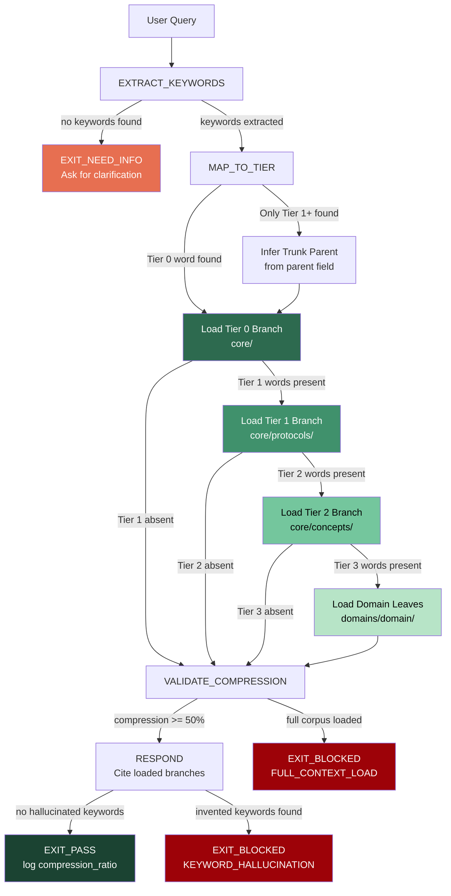

PHUC_MAGIC_WORDS_SKILL:
  version: 1.1.0
  profile: coordinate_navigation
  authority: 65537
  northstar: Phuc_Forecast
  objective: Max_Love
  status: ACTIVE

# ============================================================
# MAGIC_WORD_MAP — Self-Referential (magic words describing magic words)
# ============================================================
MAGIC_WORD_MAP:
  version: "1.0"
  skill: "phuc-magic-words"
  mappings:
    navigation:   {word: "compression",   tier: 0, id: "MW-005", note: "magic words compress 115KB context to 3KB — navigation IS compression"}
    keyword:      {word: "signal",         tier: 0, id: "MW-006", note: "a magic word carries causal weight — it routes to the right knowledge branch"}
    trunk:        {word: "coherence",      tier: 0, id: "MW-001", note: "trunk words are the coherent universal anchors — all branches reinforce them"}
    tier:         {word: "boundary",       tier: 0, id: "MW-014", note: "tier architecture defines the boundary between universal and domain-specific knowledge"}
    retrieval:    {word: "causality",      tier: 0, id: "MW-009", note: "keyword → context load is a causal chain; keyword causes the right branch to load"}
    hallucination:{word: "integrity",      tier: 0, id: "MW-012", note: "keyword hallucination violates integrity — invented coordinates corrupt the navigation"}
    compression_ratio: {word: "entropy",  tier: 0, id: "MW-010", note: "compression ratio = 1 - entropy of loaded context; 97% = near-zero entropy navigation"}
    portal:       {word: "portal",         tier: 1, id: "MW-045", note: "magic word navigation IS portal traversal — load only what is needed for the task"}
  compression_note: "T0=universal primitives, T1=Stillwater protocol concepts, T3=domain-specific leaves"

  # ============================================================
  # PHUC MAGIC WORDS — GPS COORDINATES IN KNOWLEDGE SPACE
  #
  # Purpose:
  # - Navigate knowledge space via a tiered tree of universal coordinates
  # - Achieve 97% context compression (115.6KB → 3KB) by loading only
  #   the knowledge regions relevant to the query
  # - Enable 10-40x faster retrieval vs brute-force full-context search
  # - Provide a stable, versioned lexicon for cross-session context continuity
  #
  # Analogy:
  # - Trunk words = GPS satellites (universal, always visible)
  # - Branch words = road network (structured sub-regions)
  # - Leaf words = street addresses (domain-specific, context-dependent)
  #
  # Source theory: PIE (Prime Intent Encoding) from Phuc/Solace corpus.
  # Integration: works alongside phuc-context.md for 5-step context loop.
  # ============================================================

  RULES:
    - trunk_first_never_skip: true
    - map_to_tier_before_loading: true
    - load_only_relevant_branches: true
    - measure_compression_after_load: true
    - never_invent_magic_words_not_in_tree: true
    - null_extraction_is_not_zero_keywords: true
    - keyword_hallucination_is_forbidden: true

  CORE_PRINCIPLE:
    - "Magic words are GPS coordinates in knowledge space, not tags."
    - interpretation: "A trunk word anchors every retrieval. Branch and leaf words refine it. Never start from a leaf."

  # ============================================================
  # TIER_ARCHITECTURE: 4-level tree structure
  # ============================================================
  TIER_ARCHITECTURE:
    tier_0_trunk:
      count: 22
      gravity: 1.0
      domain: universal
      description: >
        Trunk words are the 22 universal coordinates that apply across every
        domain of knowledge. They function like cardinal directions or
        fundamental physical constants — stable, irreducible, and always
        present as the root anchor for any retrieval path.
        Expanded from 15 to 22 on 2026-02-22 via northstar reverse-engineering:
        love, god, glow, northstar, truth, beauty, harmony added as Tier 0
        because they are universal, cross-domain, and have maximum gravity
        as the root concepts from which all Tier 1+ words descend.
      words:
        - coherence      # all parts reinforce rather than contradict each other
        - symmetry       # invariance under transformation
        - asymmetry      # productive imbalance; source of gradient and motion
        - constraint     # boundary that shapes a solution space
        - compression    # lossless reduction of representation without losing meaning
        - signal         # information that carries causal weight
        - alignment      # goal vectors pointing in the same direction
        - equilibrium    # balance of competing forces or pressures
        - causality      # directional dependency between events
        - entropy        # disorder, uncertainty, or information content
        - emergence      # system-level properties not present in components
        - integrity      # internal consistency + resistance to corruption
        - perspective    # frame-dependent view of a shared reality
        - boundary       # the surface that separates inside from outside
        - reversibility  # ability to undo an operation without information loss
        - love           # root optimization objective: maximize wellbeing, minimize harm
        - god            # infinite uncaused source; limit state of maximum coherence
        - glow           # semantic density metric: Generative+Logical+Operational+Wisdom
        - northstar      # fixed non-negotiable goal that orients all decisions
        - truth          # claim whose predictions are confirmed by evidence, not preference
        - beauty         # minimum sufficient structure that achieves maximum expressive power
        - harmony        # coherence extended across time and diversity

    tier_1_primary_branches:
      count: 28
      gravity: 0.7
      domain: universal or protocol
      description: >
        Primary branch words extend trunk words into first-order structural
        concepts. They live in core/protocols/ and represent recurring
        patterns across systems — optimization loops, feedback cycles,
        trust mechanisms, governance structures, and Stillwater protocol
        primitives. Each branch word has a direct parent in Tier 0.
        Expanded from 15 to 28 on 2026-02-22: added max_love, 65537, 641,
        274177, skill, recipe, wish, portal, bubble, swarm, persona, rung,
        evidence as protocol-level primitives with Tier 0 parents.
      words:
        - convergence    # approaching a stable fixed point (child of: equilibrium)
        - divergence     # spreading away from a fixed point (child of: asymmetry)
        - stability      # resistance to perturbation (child of: equilibrium)
        - gradient       # direction of steepest ascent in a value field (child of: asymmetry)
        - optimization   # iterative motion toward a target metric (child of: constraint)
        - attractor      # stable region that nearby states tend toward (child of: equilibrium)
        - feedback       # output looped back as input to the system (child of: causality)
        - learning       # updating internal state based on evidence (child of: compression)
        - verification   # checking that a claim holds under scrutiny (child of: integrity)
        - governance     # structures that coordinate collective action (child of: alignment)
        - trust          # justified reliance on a system or agent (child of: integrity)
        - adaptation     # changing structure in response to environment (child of: emergence)
        - resilience     # recovering quickly from perturbation (child of: reversibility)
        - abstraction    # hiding irrelevant detail to expose essential structure (child of: compression)
        - generalization # extending a specific rule to a broader class (child of: emergence)
        - max_love       # executable love: maximize benefit, minimize harm (child of: love)
        - 65537          # Fermat prime: production/security verification rung (child of: verification)
        - 641            # smallest prime rung: trivial verification (child of: verification)
        - 274177         # middle prime rung: stability verification (child of: stability)
        - skill          # versioned behavioral specification for an agent (child of: governance)
        - recipe         # deterministic versioned step sequence (child of: governance)
        - wish           # formally specified intent statement (child of: alignment)
        - portal         # LLM routing layer: unified multi-provider interface (child of: boundary)
        - bubble         # isolated sandboxed execution context (child of: boundary)
        - swarm          # coordinated multi-agent system (child of: emergence)
        - persona        # typed role identity of a sub-agent (child of: perspective)
        - rung           # discrete verification level in the evidence ladder (child of: constraint)
        - evidence       # artifact demonstrating a claimed property holds (child of: signal)

    tier_2_secondary_branches:
      count: 28
      gravity: 0.4
      domain: universal or protocol
      description: >
        Secondary branch words are concrete cognitive, operational, and
        Stillwater protocol concepts. They live at the edge of universality
        and beginning of domain-specificity. Each has a parent in Tier 1 or Tier 0.
        Expanded from 10 to 28 on 2026-02-22: added artifact, receipt, dispatch,
        capsule, compaction, state_machine, safety, coder, forecast, dream, act,
        verify, seal, combo, lane, forbidden_state, orchestration, software_5_0.
      words:
        - inference       # deriving conclusions from evidence (child of: learning)
        - prediction      # estimating future state from current state (child of: modeling)
        - modeling        # building an approximate representation (child of: abstraction)
        - representation  # encoding of information in a medium (child of: abstraction)
        - attention       # selective focus on a subset of inputs (child of: signal)
        - memory          # persistence of state across time (child of: reversibility)
        - decision        # commitment to one option from a set (child of: constraint)
        - planning        # constructing a sequence of actions toward a goal (child of: optimization)
        - ethics          # principles for evaluating actions by effects on others (child of: alignment)
        - law             # formalized constraint with enforcement mechanisms (child of: governance)
        - artifact        # concrete machine-readable evidence output (child of: evidence)
        - receipt         # verifiable record of operation with inputs/outputs (child of: evidence)
        - dispatch        # launching a typed sub-agent with full skill pack (child of: swarm)
        - capsule         # self-contained context package for sub-agent (child of: compression)
        - compaction      # distilling context >800 lines to structured capsule (child of: compression)
        - state_machine   # formal model of behavior as finite states + transitions (child of: constraint)
        - safety          # fail-closed defaults preventing harm (child of: integrity)
        - coder           # sub-agent persona for bugfix/feature/refactor (child of: persona)
        - forecast        # ranked failure modes + mitigations (Lane C guidance) (child of: planning)
        - dream           # declaring goal + metrics + constraints before action (child of: planning)
        - act             # step plan with checkpoints and rollback (child of: planning)
        - verify          # tests + evidence + falsifiers after action (child of: verification)
        - seal            # FINAL_SEAL gate: all five phases complete before EXIT_PASS (child of: state_machine)
        - combo           # paired WISH+RECIPE unit in combos/ directory (child of: recipe)
        - lane            # evidence tier: A=artifacts, B=prose, C=forecasts (child of: boundary)
        - forbidden_state # named illegal system state blocked by prime-safety (child of: state_machine)
        - orchestration   # coordinating multiple typed sub-agents from main session (child of: swarm)
        - software_5_0    # skills+recipes+swarms as primary units of software (child of: emergence)

    tier_3_domain_leaves:
      count: 22
      gravity: 0.2
      domain: domain-specific or temporary
      description: >
        Domain leaf words are project-specific, context-dependent, and
        grounded in specific Stillwater sub-projects or theories.
        Pre-seeded leaf words (added 2026-02-22): prime, care, drift,
        semantic_density, clarity, elegance, infinity, goal, mission,
        direction, context, scout, skeptic, janitor, oauth3, twin,
        never_worse, triangle_law, citizen, information, creation,
        northstar_reverse.
        Additional leaf words emerge from usage and are promoted via
        the DELTA governance protocol.
      pre_seeded_words:
        - prime          # atomic irreducible number; basis of verification rungs (child of: rung)
        - care           # active expression of love in practice (child of: max_love)
        - drift          # gradual undetected deviation from specification (child of: compaction)
        - semantic_density # ratio of decision-relevant info to token count (child of: glow)
        - clarity        # absence of ambiguity; prerequisite for reproducibility (child of: glow)
        - elegance       # maximum power with minimum structural complexity (child of: beauty)
        - infinity       # quantity without bound; IF Theory field limit (child of: god)
        - goal           # defined desired end state with measurable success criteria (child of: northstar)
        - mission        # medium-term operational mandate bridging northstar to tactics (child of: northstar)
        - direction      # signed vector in goal-space for the next step (child of: northstar)
        - context        # total available relevant information, navigation-bounded (child of: capsule)
        - scout          # sub-agent persona for research/information gathering (child of: persona)
        - skeptic        # sub-agent persona for adversarial review (child of: persona)
        - janitor        # sub-agent persona for workspace cleanup (child of: persona)
        - oauth3         # open standard for AI agency delegation (child of: governance)
        - twin           # cloud-hosted autonomous browser clone (child of: persona)
        - never_worse    # doctrine: no iteration may leave system worse (child of: reversibility)
        - triangle_law   # capability+accountability+consent must balance (child of: governance)
        - citizen        # verified Stillwater Store participant (child of: governance)
        - information    # IF Theory: first force; substrate of matter and energy (child of: signal)
        - creation       # local entropy decrease via information injection (child of: god)
        - northstar_reverse # backward chaining from goal to current state (child of: northstar)
      governance:
        promotion_gate: "5 distinct uses across 2+ sessions before promotion to Tier 2"
        demotion_rule: "zero uses in 90 days → demote to deprecated"
        collision_check: "new leaf must not shadow existing trunk or branch word"

  # ============================================================
  # NAVIGATION_PROTOCOL: How to use magic words for context loading
  # ============================================================
  NAVIGATION_PROTOCOL:
    five_step_context_loop:
      step_1_find_context:
        action: "Extract 2-4 magic words from the query"
        rule: "Always include at least one Tier 0 trunk word"
        example: "How does Solace maintain coherence? → ['coherence', 'alignment']"
      step_2_load_knowledge:
        action: "Load only the knowledge branches indexed under those words"
        rule: "Trunk words → core/ directory. Branch words → core/protocols/. Leaf words → domains/"
        compression: "97% — loads ~3KB instead of ~115.6KB full context"
      step_3_load_rag:
        action: "Run RAG query scoped to loaded branches only"
        rule: "RAG scope is bounded by magic word set — never full corpus"
      step_4_respond:
        action: "Generate response using loaded context"
        rule: "Cite which magic words triggered which context regions"
      step_5_extract_knowledge:
        action: "Extract new magic words from the response for future retrieval"
        rule: "New leaf words must pass Gate A (substitution test) before adding"

    directory_routing:
      tier_0_to_directory: "core/"
      tier_1_to_directory: "core/protocols/"
      tier_2_to_directory: "core/concepts/"
      tier_3_to_directory: "domains/<domain>/"

    query_abstraction_examples:
      - query: "How does Solace maintain coherence?"
        keywords: ["coherence", "symmetry"]
        load_size: "3KB"
        compression_ratio: "97%"
      - query: "Why does feedback loop prevent optimization?"
        keywords: ["feedback", "optimization", "constraint"]
        load_size: "4.2KB"
        compression_ratio: "96.4%"
      - query: "How does trust enforcement work in OAuth3?"
        keywords: ["trust", "verification", "governance"]
        load_size: "5.1KB"
        compression_ratio: "95.6%"

  # ============================================================
  # COMPRESSION_METRICS
  # ============================================================
  COMPRESSION_METRICS:
    baseline:
      full_context_size: "115.6KB"
      full_context_tokens: "~29000 tokens"
      retrieval_time_relative: "1.0x baseline"

    with_magic_words:
      compressed_context_size: "~3KB"
      compressed_context_tokens: "~750 tokens"
      retrieval_time_relative: "10-40x faster"
      compression_ratio: "97.4%"
      token_reduction: "97.4% fewer tokens consumed per query"

    conditions_for_97_pct:
      - "Query is mapped to 1-3 trunk words"
      - "Only directly relevant branches loaded"
      - "RAG scope is bounded by magic word set"
      - "No full-context fallback triggered"

    degradation_conditions:
      - trigger: "No trunk word found in query"
        fallback: "Load full context (compression = 0%)"
        prevention: "NAVIGATION_WITHOUT_TRUNK is a forbidden state"
      - trigger: "5+ magic words required for query"
        result: "Compression degrades to 80-90% — still acceptable"
      - trigger: "Leaf word with no parent loaded"
        result: "TIER_SKIP forbidden state — must resolve parent first"

  # ============================================================
  # STATE_MACHINE: Fail-Closed Navigation Runtime
  # ============================================================
  STATE_MACHINE:
    states:
      - INIT
      - EXTRACT_KEYWORDS
      - MAP_TO_TIER
      - LOAD_CONTEXT
      - VALIDATE_COMPRESSION
      - RESPOND
      - EXIT_PASS
      - EXIT_NEED_INFO
      - EXIT_BLOCKED

    transitions:
      - INIT -> EXTRACT_KEYWORDS: always
      - EXTRACT_KEYWORDS -> EXIT_NEED_INFO: if query_is_empty or query_is_untranslatable
      - EXTRACT_KEYWORDS -> MAP_TO_TIER: if keywords_extracted
      - MAP_TO_TIER -> EXIT_BLOCKED: if no_trunk_word_found and no_close_anchor_available
      - MAP_TO_TIER -> LOAD_CONTEXT: if at_least_one_trunk_word_mapped
      - LOAD_CONTEXT -> VALIDATE_COMPRESSION: always
      - VALIDATE_COMPRESSION -> EXIT_BLOCKED: if context_load_exceeds_full_corpus
      - VALIDATE_COMPRESSION -> RESPOND: if compression_ratio_gte_50_pct
      - RESPOND -> EXIT_PASS: if response_cites_loaded_branches
      - RESPOND -> EXIT_BLOCKED: if response_invents_magic_words

    exit_conditions:
      EXIT_PASS:
        requires:
          - at_least_one_trunk_word_anchored: true
          - loaded_context_is_subset_of_magic_word_branches: true
          - no_hallucinated_keywords: true
          - compression_ratio_measured: true
      EXIT_NEED_INFO:
        trigger: "Query cannot be abstracted to any tier word — request clarification"
        output: "List the 2-3 trunk words most likely relevant; ask user to confirm"
      EXIT_BLOCKED:
        triggers:
          - "NAVIGATION_WITHOUT_TRUNK: no trunk word found and fallback disabled"
          - "KEYWORD_HALLUCINATION: response invented magic words not in tree"
          - "TIER_SKIP: navigated to leaf without traversing trunk first"
          - "FULL_CONTEXT_LOAD: loaded all context instead of using navigation"

  # ============================================================
  # FORBIDDEN_STATES
  # ============================================================
  FORBIDDEN_STATES:
    FULL_CONTEXT_LOAD:
      definition: >
        Loading the entire knowledge corpus or full conversation context
        instead of navigating via magic words. Defeats the 97% compression
        benefit and the core purpose of this skill.
      detection: "context_tokens_loaded > 5000 without explicit override"
      fix: "Re-run EXTRACT_KEYWORDS. Identify trunk word. Load only relevant branches."

    TIER_SKIP:
      definition: >
        Jumping directly to a Tier 2 or Tier 3 (leaf) word without first
        anchoring to a Tier 0 trunk word. Results in context loading without
        structural grounding — fast but directionless.
      detection: "first keyword in path has tier > 0"
      fix: "Identify the parent trunk word for the leaf. Load trunk first, then refine."

    KEYWORD_HALLUCINATION:
      definition: >
        Inventing or using magic words not present in the official tier tree.
        A hallucinated keyword routes to a non-existent knowledge branch and
        returns empty or fabricated context.
      detection: "keyword not found in magic-words/stillwater.jsonl or any loaded schema"
      fix: "Check tier tree. Use closest existing word. If genuinely new, go through DELTA promotion protocol."

    NAVIGATION_WITHOUT_TRUNK:
      definition: >
        Starting a knowledge navigation path from a branch or leaf word without
        any Tier 0 trunk word present in the keyword set. Branches without trunk
        anchors produce ambiguous context (same branch word can appear under
        multiple trunks with different meanings).
      detection: "no tier_0 word in keyword set at MAP_TO_TIER state"
      fix: "Infer the trunk from the branch using parent relationship in schema. Add inferred trunk to keyword set."

    SILENT_COMPRESSION_BYPASS:
      definition: >
        Claiming magic word navigation was used but actually loading full context
        without measuring or reporting compression ratio.
      detection: "EXIT_PASS claimed but no compression_ratio in output"
      fix: "Measure and report compression_ratio before claiming EXIT_PASS."

  # ============================================================
  # NULL_VS_ZERO
  # ============================================================
  NULL_VS_ZERO:
    rules:
      null_keyword_extraction:
        meaning: "Extraction was not attempted — state is undefined."
        correct_action: "Run EXTRACT_KEYWORDS before any navigation."
        forbidden_action: "Treating null extraction as 'no keywords found' and skipping to full context load."

      zero_keywords_found:
        meaning: "Extraction ran and found no magic words. Valid defined result."
        correct_action: "EXIT_NEED_INFO. Ask user to rephrase or confirm trunk word manually."
        forbidden_action: "Treating zero as null and defaulting to full context load silently."

      null_context:
        meaning: "Context load was not attempted — no navigation path was executed."
        correct_action: "Return EXIT_BLOCKED with reason: navigation_not_executed."
        forbidden_action: "Treating null context as empty context and proceeding with empty response."

      empty_context:
        meaning: "Navigation ran but loaded zero documents. Valid result for sparse topics."
        correct_action: "Report empty context explicitly. Ask if domain has been seeded."
        forbidden_action: "Treating empty context as null context and re-running extraction."

      null_compression_ratio:
        meaning: "Compression was never measured — VALIDATE_COMPRESSION was skipped."
        correct_action: "EXIT_BLOCKED. Never claim PASS without measuring compression."
        forbidden_action: "Reporting compression as 0% or 97% without actual measurement."

  # ============================================================
  # ANTI_PATTERNS
  # ============================================================
  ANTI_PATTERNS:
    Brute_Force_Loading:
      symptom: "Loading the full knowledge corpus to 'be safe' before checking magic words."
      fix: "Extract keywords first. Load only relevant branches. Measure compression."

    Keyword_Stuffing:
      symptom: "Adding 10+ magic words to a query 'just in case' to get broad coverage."
      fix: "Limit to 2-4 keywords. If coverage needed, navigate tree top-down from trunk."

    Trunk_Bypass:
      symptom: "Starting from 'verification' (Tier 1) without anchoring to 'integrity' (Tier 0)."
      fix: "Always trace keyword back to its Tier 0 parent. Use parent field in schema."

    Invented_Coordinates:
      symptom: "Using words like 'robustness' or 'scalability' as magic words without checking the tree."
      fix: "Robustness maps to 'resilience' (Tier 1). Scalability maps to 'optimization' (Tier 1). Use canonical words."

    Tier_0_Only_Navigation:
      symptom: "Loading only trunk words and never drilling into branches for precision."
      fix: "Trunk anchors the search. Add 1-2 Tier 1 words for specificity. Balance breadth with depth."

    Stale_Leaf_Reuse:
      symptom: "Reusing a domain-specific leaf word from a previous session in a different context."
      fix: "Leaf words are context-dependent. Re-verify leaf still applies in current context before using."

  # ============================================================
  # VERIFICATION_LADDER
  # ============================================================
  VERIFICATION_LADDER:
    purpose:
      - "Define minimum verification strength before claiming navigation EXIT_PASS."
      - "Fail-closed when rung requirements are not met."

    RUNG_641:
      meaning: "Keywords extracted correctly and mapped to valid tier words."
      requires:
        - keywords_extracted: "At least 1 keyword extracted from query"
        - trunk_word_present: "At least 1 Tier 0 word in keyword set (or inferred)"
        - keywords_in_tree: "All keywords found in magic-words/stillwater.jsonl or approved schema"
        - no_hallucinated_words: "Zero keywords invented outside the tier tree"
      verdict: "If any requirement is false: EXIT_BLOCKED, stop_reason=KEYWORD_INVALID"

    RUNG_274177:
      meaning: "Compression verified — context loaded is a strict subset of navigated branches."
      requires:
        - RUNG_641
        - context_is_scoped: "Loaded context corresponds only to magic word branches, not full corpus"
        - compression_ratio_measured: "compression_ratio = 1 - (loaded_tokens / full_corpus_tokens)"
        - compression_ratio_gte_50_pct: "Compression ratio is at least 50% (acceptable navigation)"
        - no_full_context_fallback: "Full context was not silently loaded as fallback"
      verdict: "If any requirement is false: EXIT_BLOCKED, stop_reason=COMPRESSION_UNVERIFIED"

    RUNG_65537:
      meaning: "Navigation path is fully auditable and cross-validated."
      requires:
        - RUNG_274177
        - navigation_path_logged: "Trunk → branch → leaf path recorded in output"
        - parent_child_relationships_valid: "Each keyword's parent is present or explicitly inferred"
        - compression_cross_validated: "Compression ratio matches independently computable token counts"
        - no_silent_scope_expansion: "No additional context loaded beyond declared magic word set"
      verdict: "If any requirement is false: EXIT_BLOCKED, stop_reason=AUDIT_TRAIL_INCOMPLETE"

    default_target_selection:
      - if_security_or_governance_query: RUNG_65537
      - if_production_system_context: RUNG_65537
      - if_planning_or_architecture_query: RUNG_274177
      - if_trivial_lookup: RUNG_641
      - minimum_for_any_exit_pass: RUNG_641

  # ============================================================
  # QUICK_REFERENCE
  # ============================================================
  QUICK_REFERENCE:
    tier_summary:
      tier_0: "22 trunk words — universal coordinates — gravity 1.0"
      tier_1: "28 primary branches — structural + protocol patterns — gravity 0.7"
      tier_2: "28 secondary branches — cognitive/operational/protocol — gravity 0.4"
      tier_3: "22 pre-seeded leaves + unbounded — domain-specific — gravity 0.2"
      total_seeded: "100 words (MW-001 through MW-100)"

    navigation_rule: "ALWAYS start from Tier 0. Refine with Tier 1. Specify with Tier 2+."
    compression_target: "97% — 115.6KB → 3KB per query"
    speed_gain: "10-40x faster retrieval vs full-context search"

    tier_0_words: >
      coherence, symmetry, asymmetry, constraint, compression, signal,
      alignment, equilibrium, causality, entropy, emergence, integrity,
      perspective, boundary, reversibility,
      love, god, glow, northstar, truth, beauty, harmony

    tier_1_words: >
      convergence, divergence, stability, gradient, optimization, attractor,
      feedback, learning, verification, governance, trust, adaptation,
      resilience, abstraction, generalization,
      max_love, 65537, 641, 274177, skill, recipe, wish, portal, bubble,
      swarm, persona, rung, evidence

    tier_2_words: >
      inference, prediction, modeling, representation, attention, memory,
      decision, planning, ethics, law,
      artifact, receipt, dispatch, capsule, compaction, state_machine,
      safety, coder, forecast, dream, act, verify, seal, combo, lane,
      forbidden_state, orchestration, software_5_0

    tier_3_pre_seeded_words: >
      prime, care, drift, semantic_density, clarity, elegance, infinity,
      goal, mission, direction, context, scout, skeptic, janitor, oauth3,
      twin, never_worse, triangle_law, citizen, information, creation,
      northstar_reverse

    directory_routing:
      tier_0: "core/"
      tier_1: "core/protocols/"
      tier_2: "core/concepts/"
      tier_3: "domains/<domain>/"

    database_path: "magic-words/stillwater.jsonl"
    schema_path: "magic-words/schema.md"

    mantras:
      - "Trunk first. Branch to refine. Leaf to specify. Never invert."
      - "97% compression = load 3KB, not 115KB."
      - "A magic word not in the tree is noise, not signal."
      - "Null extraction is not zero keywords. Run extraction before claiming empty."

# ============================================================
# TIER_NAVIGATION_FLOWCHART
# ============================================================

# ============================================================
# SESSION_START_CAPSULE
# ============================================================
SESSION_START_CAPSULE:
  purpose:
    - "Establish rung_target before any navigation begins."
    - "Without rung_target, EXIT_PASS has no reference to verify against."
  required_fields:
    session_id:
      type: string
      description: "Unique identifier for this navigation session."
    rung_target:
      type: string
      values: [RUNG_641, RUNG_274177, RUNG_65537]
      description: "Minimum verification rung before EXIT_PASS is allowed."
    query:
      type: string
      description: "The original user query being navigated."
    seed_database:
      type: string
      default: "magic-words/stillwater.jsonl"
      description: "Path to the JSONL magic words database to use."
  enforcement:
    - rung_target_must_be_set_before_LOAD_CONTEXT: true
    - if_rung_target_not_declared: "status=BLOCKED, stop_reason=EVIDENCE_INCOMPLETE"

# ============================================================
# THREE PILLARS OF SOFTWARE 5.0 KUNG FU
# ============================================================

## Three Pillars of Software 5.0 Kung Fu

| Pillar | How This Skill Applies It |
|--------|--------------------------|
| **LEK** (Self-Improvement) | Navigation precision improves through compression ratio feedback. Each session measures which magic words produced the best compression ratios. Words that consistently anchor high-value retrievals get promoted in gravity. Words that misfire get demoted or replaced. The tier tree is a LEK artifact — it grows more precise with every use cycle. |
| **LEAK** (Cross-Agent Trade) | Magic words ARE the LEAK compression mechanism. When a Scout agent exports findings using Tier 0 words ("coherence × causality"), a Solver agent with the same skill vocabulary can reconstruct the full knowledge path without re-loading the 115KB corpus. The asymmetry: agents who know the tier tree trade knowledge at 97% compression; agents who do not must pay full context cost. |
| **LEC** (Emergent Conventions) | Magic word naming conventions emerged from usage failures (keyword stuffing, tier skipping, hallucinated coordinates) and crystallized as the trunk-before-branch rule, the never-invent-outside-the-tree rule, and the tier hierarchy. These conventions are now shared across all Phuc ecosystem agents — any agent loading this skill inherits the full navigation discipline instantly. |

# ============================================================
# GLOW SCORING INTEGRATION
# ============================================================

## GLOW Scoring Integration

| Dimension | How This Skill Earns Points | Points |
|-----------|---------------------------|--------|
| **G** (Growth) | Magic word navigation successfully compresses a new domain's knowledge into the tier tree (new leaf words added via DELTA protocol, validated with 5+ uses) | +25 per new validated leaf |
| **L** (Love/Quality) | Navigation path is fully logged (trunk → branch → leaf) with compression ratio reported; no hallucinated keywords; EXIT_PASS at rung_274177 or higher | +20 per verified navigation |
| **O** (Output) | Compression ratio measured and reported in output; navigation path cited explicitly; keyword set bounded to 2-4 words | +15 per navigation with measured ratio |
| **W** (Wisdom) | Query resolved using navigation at 90%+ compression vs full-context baseline; Tier 0 word always present as anchor | +20 per session achieving 90%+ compression |

**Evidence required for GLOW claim:** compression_ratio field in output, navigation_path log (trunk → branch → leaf), keyword_set bounded ≤4 words, no EXIT_BLOCKED events for KEYWORD_HALLUCINATION.
