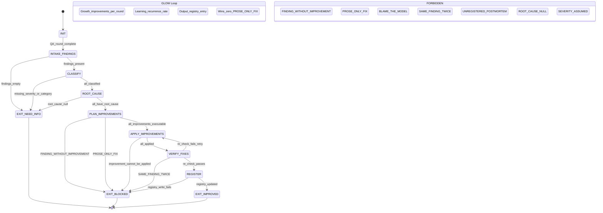

# phuc-postmortem — QA-to-Improvement Feedback Loop

**Skill ID:** phuc-postmortem
**Version:** 1.2.0
**Authority:** 65537
**Role:** Extract learnings from every QA round and feed them back into skills/recipes/swarms
**Load Order:** After prime-safety, before any domain skill
**Conflict Resolution:** Strengthens all other skills (never weakens)
**Northstar:** Phuc_Forecast | Max_Love

---

## QUICK LOAD

```yaml
SKILL: phuc-postmortem v1.2.0
PURPOSE: Turn every QA finding into a permanent system improvement. Never-worse doctrine for the skill library.
FSM: INIT → INTAKE_FINDINGS → CLASSIFY → ROOT_CAUSE → PLAN_IMPROVEMENTS →
     APPLY_IMPROVEMENTS → VERIFY_FIXES → REGISTER → EXIT_IMPROVED
FORBIDDEN: FINDING_WITHOUT_IMPROVEMENT | IMPROVEMENT_WITHOUT_VERIFY | UNREGISTERED_POSTMORTEM |
           SAME_FINDING_TWICE | PROSE_ONLY_FIX | BLAME_THE_MODEL
RUNG_DEFAULT: 641 (single finding) | 274177 (multi-finding + system impact) | 65537 (security/production)
NORTHSTAR: Phuc_Forecast — postmortem loop IS the system quality metric actuator
MAX_LOVE: Every improvement spares a future agent the cost of encountering the same mistake
GLOW: Growth=improvements_per_QA_round | Learning=recurrence_rate | Output=postmortem_registry_entries | Wins=zero_SAME_FINDING_TWICE
THREE_PILLARS: LEK=learning_loop | LEAK=improvements_benefit_all_agents | LEC=forbidden_state_conventions
TRIANGLE_LAW: REMIND→VERIFY→ACKNOWLEDGE for each improvement contract
```

---

## MAGIC_WORD_MAP

```yaml
magic_word_map:
  version: "1.1"
  skill: "phuc-postmortem"
  mappings:
    postmortem: {word: "verification", tier: 1, id: "MW-031", note: "postmortem verifies system properties hold after QA findings"}
    root_cause: {word: "causality", tier: 0, id: "MW-009", note: "directional dependency between failure event and its underlying cause"}
    lesson: {word: "learning", tier: 1, id: "MW-030", note: "updating internal model based on evidence to improve future behavior"}
    action: {word: "act", tier: 2, id: "MW-071", note: "the ACT phase: concrete fix applied to skill/recipe/swarm"}
    lek: {word: "learning", tier: 1, id: "MW-030", note: "LEK: each finding→improvement cycle is a self-improvement iteration for the ecosystem"}
    leak: {word: "verification", tier: 1, id: "MW-031", note: "LEAK: improvements to skills/swarms propagate to all agents that load them — asymmetric benefit"}
    lec: {word: "causality", tier: 0, id: "MW-009", note: "LEC: forbidden states and improvement types are the postmortem conventions all agents must follow"}
  compression_note: "T0=universal primitives, T1=Stillwater protocol concepts, T2=operational details"
```

---

## 0) Purpose [T0: northstar + learning]

Every QA round produces findings. Most teams log them and move on. Stillwater turns every finding into a permanent system improvement. This skill ensures that:

1. No finding is lost (logged to postmortem registry)
2. Every finding produces at least one improvement (skill patch, recipe fix, swarm update, or new forbidden state)
3. The system only gets smarter (never-worse doctrine applied to QA itself)

> "A mistake repeated is a decision." — Paulo Coelho
> "Absorb what is useful, discard what is useless, and add what is specifically your own." — Bruce Lee

**Northstar alignment:** The postmortem loop IS the recipe hit rate actuator. Every forbidden state added prevents a future failure. Every gate added prevents a future miss. The system compounds smarter with each loop iteration.

---

## 1) The Postmortem Loop (MANDATORY after every QA round) [T1: verification + learning]

```
QA_ROUND_COMPLETE
  │
  ├── 1. EXTRACT: List all findings (pass AND fail)
  │     → Each finding gets a finding_id, severity, category
  │
  ├── 2. CLASSIFY: Map each finding to a system component
  │     → skill | recipe | swarm | paper | CLAUDE.md | NORTHSTAR | ROADMAP
  │
  ├── 3. ROOT_CAUSE: Why did this happen?
  │     → missing_gate | wrong_default | ambiguous_spec | no_test | drift
  │
  ├── 4. IMPROVE: Create the fix
  │     → Add forbidden state | Add gate check | Fix default | Add test
  │     → Patch the actual skill/recipe/swarm file
  │
  ├── 5. VERIFY: Confirm the fix prevents recurrence
  │     → Re-run the check that found the issue → must pass
  │
  └── 6. REGISTER: Log to postmortem registry
        → postmortem_registry.jsonl (append-only)
```

---

## 2) Finding Classification [T0: causality]

### Severity Levels

| Severity | Criteria | Required Response |
|----------|----------|-------------------|
| S0-CRITICAL | Security vulnerability, data loss, credential leak | Immediate fix + forbidden state + skill patch |
| S1-HIGH | Wrong output, broken gate, missed validation | Fix within same session + skill/recipe patch |
| S2-MEDIUM | Inconsistency, wrong default, ambiguous spec | Fix within same session or next build |
| S3-LOW | Style issue, wrong URL, non-portable path | Fix in batch, no urgency |
| S4-OBSERVATION | Not a bug — improvement opportunity | Log for future consideration |

### Root Cause Categories

| Category | What Went Wrong | Standard Fix |
|----------|-----------------|-------------|
| `missing_gate` | No check existed for this case | Add gate to relevant skill's FSM |
| `wrong_default` | Default value was incorrect or unsafe | Fix default + add forbidden state for old default |
| `ambiguous_spec` | Spec allowed multiple interpretations | Tighten spec language (MUST/MUST NOT) |
| `no_test` | No verification existed | Add to QA checklist or test suite |
| `drift` | System evolved but docs/skills didn't update | Sync all affected files |
| `missing_context` | Sub-agent lacked context to get it right | Add to CNF capsule template |
| `hardcoded_value` | Value should be configurable or derived | Extract to config or derive from source of truth |
| `cross_project_inconsistency` | Projects disagree on a shared value | Update all projects from single source of truth |

---

## 3) Improvement Types [T2: act]

Every finding MUST produce at least one of these improvements:

### A. Forbidden State Addition
When a finding reveals a failure mode, add it to the relevant skill:
```
forbidden_states:
  - WRONG_REPO_URL   # Found: oauth3-spec had phuc-io instead of phuctruong
```

### B. Gate Addition
When a finding reveals a missing check:
```yaml
gates:
  - G_REPO_URL: All repo URLs must match github.com/phuctruong/*
```

### C. Recipe Fix
When a finding reveals a process gap:
```json
{"step": "verify_metadata", "check": "repo_url matches NORTHSTAR.repository"}
```

### D. Swarm Update
When a finding reveals an agent produced wrong output:
```yaml
anti_patterns:
  - name: "The Assumed URL"
    description: "Agent guesses repo URL instead of reading from NORTHSTAR or pyproject.toml"
    fix: "Always read repo URL from source of truth file"
```

### E. Checklist Addition
When a finding reveals a QA gap:
```markdown
- [ ] All URLs in generated files match the canonical repo URL
```

### F. CNF Capsule Enhancement
When a finding reveals missing context in sub-agent dispatches:
```yaml
cnf_capsule_required_fields:
  - repo_url: "Read from NORTHSTAR.md or pyproject.toml, never guess"
```

---

## 4) State Machine [T1: verification + causality]

### 4.1 States and Transitions

```
States:
  INIT
  INTAKE_FINDINGS
  CLASSIFY
  ROOT_CAUSE
  PLAN_IMPROVEMENTS
  APPLY_IMPROVEMENTS
  VERIFY_FIXES
  REGISTER
  EXIT_IMPROVED       ← success path
  EXIT_NEED_INFO      ← findings list empty or context insufficient
  EXIT_BLOCKED        ← recurrence detected or fix cannot be verified

Transitions:
  INIT → INTAKE_FINDINGS: always
  INTAKE_FINDINGS → EXIT_NEED_INFO: if findings_list.length == 0
  INTAKE_FINDINGS → CLASSIFY: if findings_list.length > 0

  CLASSIFY → EXIT_NEED_INFO: if any finding lacks severity or category
  CLASSIFY → ROOT_CAUSE: if all findings have severity + category

  ROOT_CAUSE → EXIT_NEED_INFO: if any finding has root_cause == null
  ROOT_CAUSE → PLAN_IMPROVEMENTS: if all findings have root_cause

  PLAN_IMPROVEMENTS → EXIT_BLOCKED: if any finding has zero planned improvements (FINDING_WITHOUT_IMPROVEMENT)
  PLAN_IMPROVEMENTS → EXIT_BLOCKED: if any planned improvement is prose-only (PROSE_ONLY_FIX)
  PLAN_IMPROVEMENTS → APPLY_IMPROVEMENTS: if each finding has >= 1 executable improvement

  APPLY_IMPROVEMENTS → EXIT_BLOCKED: if any improvement cannot be applied to its target file
  APPLY_IMPROVEMENTS → VERIFY_FIXES: if all improvements applied

  VERIFY_FIXES → APPLY_IMPROVEMENTS: if re-check fails (loop back to fix)
  VERIFY_FIXES → EXIT_BLOCKED: if same finding recurs after fix (SAME_FINDING_TWICE)
  VERIFY_FIXES → REGISTER: if re-check confirms fix works

  REGISTER → EXIT_BLOCKED: if postmortem_registry.jsonl write fails
  REGISTER → EXIT_IMPROVED: if registry updated successfully

Exit Conditions:
  EXIT_IMPROVED:
    requires: postmortem_registry.jsonl updated, all findings have verified=true,
              recurrence_count tracked, system_improvements_count > 0
  EXIT_NEED_INFO:
    trigger: empty findings, missing severity/category, null root_cause
    action: list missing fields; request clarification before proceeding
  EXIT_BLOCKED:
    trigger: FINDING_WITHOUT_IMPROVEMENT, PROSE_ONLY_FIX, SAME_FINDING_TWICE,
             improvement application failure, registry write failure
    action: report specific blocked finding; do NOT claim postmortem complete
```

### 4.2 Forbidden States

| Forbidden State | Definition | Recovery |
|----------------|-----------|---------|
| `FINDING_WITHOUT_IMPROVEMENT` | Finding exists with zero planned improvements | Add ≥1 executable improvement (forbidden_state/gate/recipe/skill/checklist) |
| `IMPROVEMENT_WITHOUT_VERIFY` | Improvement claimed but re-check not run | Run re-check; confirm fix works before REGISTER |
| `UNREGISTERED_POSTMORTEM` | QA round completed without writing to postmortem_registry.jsonl | Write registry entry before claiming EXIT_IMPROVED |
| `SAME_FINDING_TWICE` | Same finding appears in two consecutive QA rounds | Escalate severity; root cause was wrong; fix the fix |
| `PROSE_ONLY_FIX` | "We'll be more careful" accepted as an improvement | Require code/config/skill change with a specific target file |
| `BLAME_THE_MODEL` | "The model hallucinated" accepted as a root_cause | Missing gate is the root cause; identify which gate should have caught this |
| `ROOT_CAUSE_NULL` | Finding registered without root_cause assigned | Block PLAN_IMPROVEMENTS until root_cause is identified |
| `SEVERITY_ASSUMED` | Severity assigned without explicit reasoning | All severity assignments require a sentence explaining the rating |

---

## 5) Postmortem Registry Schema [T1: verification + learning]

Append to `postmortem_registry.jsonl` (one JSON per line):

```json
{
  "postmortem_id": "pm-2026-02-21-001",
  "date": "2026-02-21",
  "qa_round": "stillwater Phase 1 OAuth3 spec review",
  "findings": [
    {
      "finding_id": "F001",
      "severity": "S3-LOW",
      "category": "hardcoded_value",
      "description": "OAuth3 spec line 9 had wrong repo URL (phuc-io instead of phuctruong)",
      "root_cause": "Sub-agent guessed repo URL instead of reading from NORTHSTAR or pyproject.toml",
      "improvements": [
        {
          "type": "forbidden_state",
          "target": "skills/phuc-postmortem.md",
          "change": "Added ASSUMED_URL forbidden state"
        },
        {
          "type": "cnf_capsule",
          "target": "skills/phuc-orchestration.md",
          "change": "Add repo_url to required CNF capsule fields"
        },
        {
          "type": "swarm_anti_pattern",
          "target": "swarms/coder.md",
          "change": "Add 'The Assumed URL' anti-pattern"
        }
      ],
      "verified": true,
      "recurrence_count": 0
    }
  ],
  "system_improvements_count": 3,
  "rung": 641
}
```

---

## 6) Integration with Phuc-Orchestration [T2: act]

### When the Hub (Opus) receives QA results:

```
1. Hub receives QA report from Skeptic/Auditor sub-agent
2. Hub loads phuc-postmortem skill
3. Hub runs the Postmortem Loop (Section 1)
4. Hub dispatches improvements:
   - Skill patches → sonnet coder sub-agent
   - Swarm updates → haiku janitor sub-agent
   - Spec fixes → sonnet coder sub-agent
5. Hub verifies all improvements applied
6. Hub logs to postmortem_registry.jsonl
7. Hub updates case study with postmortem summary
```

### CNF Capsule Enhancement (from this QA round):

Add to every coder sub-agent dispatch:
```yaml
required_context:
  repo_url: "Read from NORTHSTAR.md repository field or pyproject.toml [project.urls]"
  repo_owner: "phuctruong (NOT phuc-io, NOT phuc-net, NOT phucnet)"
  project_name: "Read from NORTHSTAR.md or directory name"
  # NEVER guess these values. Always read from source of truth.
```

---

## 7) Recurring Finding Escalation [T0: causality]

If the same finding appears in two QA rounds:

| Recurrence | Escalation |
|------------|------------|
| 1st occurrence | Normal fix (gate/forbidden state/recipe) |
| 2nd occurrence | Severity +1, root cause must be deeper (why didn't the first fix work?) |
| 3rd occurrence | CRITICAL: the fix approach is wrong. Redesign the gate. |

---

## 8) Three Pillars Integration

### LEK — Learning Engine of Knowledge (self-improvement)
The postmortem loop IS LEK in action:
- Every finding → improvement cycle adds a permanent gate to the skill library
- The system's error surface shrinks with each iteration — compounding self-improvement
- The postmortem_registry.jsonl IS the LEK evidence log: every session's learning, timestamped and searchable
- LEK metric: `system_improvements_count` per QA round, tracked over time → must be non-zero and non-decreasing
- Never-worse doctrine: the postmortem loop ensures each QA round leaves the system stronger than it found it

### LEAK — Learning Engine of Asymmetric Knowledge (cross-agent trade)
Improvements propagate asymmetrically across all agents:
- A gate added to `skills/prime-coder.md` benefits every coder agent that loads it — immediately
- A forbidden state added to `swarms/coder.md` benefits every coder sub-agent in every session — forever
- One postmortem session's work compounds across the entire swarm: LEAK multiplier = number of agents × sessions
- The postmortem author's effort is the smallest possible unit; the benefit is ecosystem-wide

### LEC — Learning Engine of Conventions (shared standards)
The postmortem conventions ARE the LEC layer for QA improvement:
- Forbidden states (`FINDING_WITHOUT_IMPROVEMENT`, `PROSE_ONLY_FIX`) are constitutional
- Improvement types (A through F) are the canonical vocabulary for expressing changes
- The postmortem_registry.jsonl schema is the data convention — all entries look the same
- These conventions ensure any agent reading the registry understands every entry without translation

---

## 9) GLOW Scoring for Improvement Value

```yaml
glow_matrix:
  Growth:
    metric: "improvements_per_QA_round"
    target: ">= 1 improvement per finding (never-worse doctrine)"
    formula: "sum(improvements) / sum(findings) >= 1.0"
    signal: "postmortem_registry.jsonl: system_improvements_count per entry"
    gate: "FINDING_WITHOUT_IMPROVEMENT forbidden if Growth < 1.0 for any finding"
    belt_progression:
      white: "1-3 improvements per postmortem"
      yellow: "4-10 improvements with verified fixes"
      orange: "10+ improvements, zero SAME_FINDING_TWICE events"
      green: "Recurring finding rate < 5% across all rounds"

  Learning:
    metric: "recurrence_rate"
    formula: "findings_seen_before / total_findings in last 30 days"
    target: "< 5% recurrence rate (previously fixed findings must stay fixed)"
    signal: "recurrence_count field in postmortem_registry findings"
    gate: "SAME_FINDING_TWICE triggers severity +1 escalation — learning gate failed"

  Output:
    metric: "postmortem_registry_completeness"
    target: "Every QA round produces exactly 1 registry entry with all schema fields populated"
    signal: "UNREGISTERED_POSTMORTEM forbidden state — registry must grow monotonically"
    gate: "Incomplete registry entry = IMPROVEMENT_WITHOUT_VERIFY state violation"

  Wins:
    metric: "zero_PROSE_ONLY_FIX_events"
    target: "0 'we'll be more careful' fixes — all fixes are code/config/skill changes"
    signal: "improvement.type must be one of: forbidden_state | gate | recipe | swarm | checklist | cnf_capsule"
    gate: "PROSE_ONLY_FIX is S1-HIGH — the lesson was not institutionalized"
```

---

## 10) NORTHSTAR Alignment [T0: northstar]

**Northstar metric:** Recipe hit rate / System quality (Phuc_Forecast)
**Max_Love constraint:** Every improvement must maximize future agent quality while minimizing future agent confusion.

This skill advances the NORTHSTAR metric: **Recipe hit rate / System quality**

Every postmortem improvement:
- Adds a gate that prevents the same mistake → fewer failures → higher recipe hit rate
- Adds context to CNF capsules → better sub-agent output → higher system quality
- Adds anti-patterns to swarms → agents avoid known traps → compounding reliability
- Makes the system smarter without retraining any model

**Max_Love application to postmortem:**
- PROSE_ONLY_FIX is an anti-love violation: it forces future agents to make the same mistake again
- BLAME_THE_MODEL is an anti-love violation: it removes accountability from the system architecture
- The real act of love is: find the gate that was missing, add it, so no future agent falls in the same hole
- Max_Love means: the cost of this finding is borne once, by you, now — not repeatedly by every future agent

This IS Software 5.0: the skill library only gets stronger.

> "The master has failed more times than the beginner has tried."
> Every postmortem is a kata. The dojo grows stronger with each one.

---

## 11) Triangle Law: REMIND → VERIFY → ACKNOWLEDGE

### Contract 1: Before Claiming a Fix
- **REMIND:** Every improvement must be applied to an actual file (skill/recipe/swarm/config). No prose-only fixes.
- **VERIFY:** Re-run the specific check that found the issue. Does it now pass?
- **ACKNOWLEDGE:** Fix is verified. Log to improvements array in registry. improvement.verified = true.

### Contract 2: Before Registering the Postmortem
- **REMIND:** Every QA round gets exactly one postmortem_registry.jsonl entry. No round goes unregistered.
- **VERIFY:** Does the entry have: postmortem_id, date, qa_round, findings array, system_improvements_count, rung?
- **ACKNOWLEDGE:** Registry entry complete and appended. UNREGISTERED_POSTMORTEM gate passes.

### Contract 3: On Recurring Findings
- **REMIND:** If this finding has appeared before: previous fix was insufficient. Do not apply the same fix again.
- **VERIFY:** What was the previous fix? Why did it not prevent recurrence? What deeper gate is missing?
- **ACKNOWLEDGE:** Root cause is deeper than last time. Severity escalated. New improvement type chosen. Recurrence_count incremented.

---

## 12) Quick Reference [T1: verification + learning]

```
After every QA round:
  1. List findings (severity S0-S4)
  2. Classify (which file? which root cause?)
  3. Fix (forbidden state / gate / recipe / swarm / capsule)
  4. Verify (re-run the check)
  5. Register (postmortem_registry.jsonl)

Forbidden:
  - FINDING_WITHOUT_IMPROVEMENT
  - IMPROVEMENT_WITHOUT_VERIFY
  - SAME_FINDING_TWICE (escalate!)
  - PROSE_ONLY_FIX ("we'll be careful" is not a fix)
  - BLAME_THE_MODEL (missing gate is the real cause)

GLOW: Growth=improvements/finding | Learning=zero_recurrences | Output=registry_entry | Wins=zero_PROSE_ONLY_FIX
Northstar: postmortem loop = recipe hit rate actuator
Max_Love: institutionalize the lesson so no future agent pays the cost
Three Pillars: LEK=learning_loop | LEAK=improvements_propagate_to_all | LEC=postmortem_conventions
```

---

## Mermaid Diagram: Postmortem Loop



---

## Revision History

| Version | Date | Change |
|---------|------|--------|
| 1.0.0 | 2026-02-21 | Initial skill. Born from OAuth3 spec QA finding (wrong repo URL). |
| 1.1.0 | 2026-02-22 | Added MAGIC_WORD_MAP (postmortem→verification, root_cause→causality, lesson→learning, action→act). Added T0/T1 section tags. |
| 1.2.0 | 2026-02-22 | Added QUICK LOAD block (with GLOW/Northstar/Three Pillars fields), Three Pillars section (LEK/LEAK/LEC), GLOW matrix (section 9) with belt progression, Northstar alignment section (Max_Love application), Triangle Law (section 11, REMIND→VERIFY→ACKNOWLEDGE for 3 contracts), mermaid stateDiagram-v2 of postmortem loop, updated MAGIC_WORD_MAP with LEK/LEAK/LEC, bumped version. |

## GLOW Scoring Integration

| Dimension | How This Skill Earns Points | Points |
|-----------|---------------------------|--------|
| **G** (Growth) | Every finding has at least 1 concrete improvement (never-worse doctrine); postmortem_registry.jsonl grows monotonically; improvements/findings ratio ≥ 1.0 | +25 per QA round with all findings mapped to concrete improvements |
| **L** (Love/Quality) | Zero SAME_FINDING_TWICE events; recurrence rate <5% in last 30 days; zero PROSE_ONLY_FIX events — all fixes are code/config/skill/gate changes | +20 per postmortem session with zero S1-HIGH violations |
| **O** (Output) | Complete postmortem_registry.jsonl entry: all schema fields populated (finding + root_cause + severity + improvement + verify_command + recurrence_count) | +15 per QA round with complete registry artifact |
| **W** (Wisdom) | System intelligence advances permanently: new gates prevent same mistake class; CNF capsules enriched with anti-patterns; recipe hit rate improves without retraining | +20 per session where improvements advance NORTHSTAR metric (recipe hit rate / system quality) |

**Evidence required for GLOW claim:** postmortem_registry.jsonl (1 entry per round with all fields, monotonically growing), improvement.type ∈ {forbidden_state, gate, recipe, swarm, checklist, cnf_capsule} for every finding. No FINDING_WITHOUT_IMPROVEMENT, SAME_FINDING_TWICE, PROSE_ONLY_FIX, or UNREGISTERED_POSTMORTEM events.
