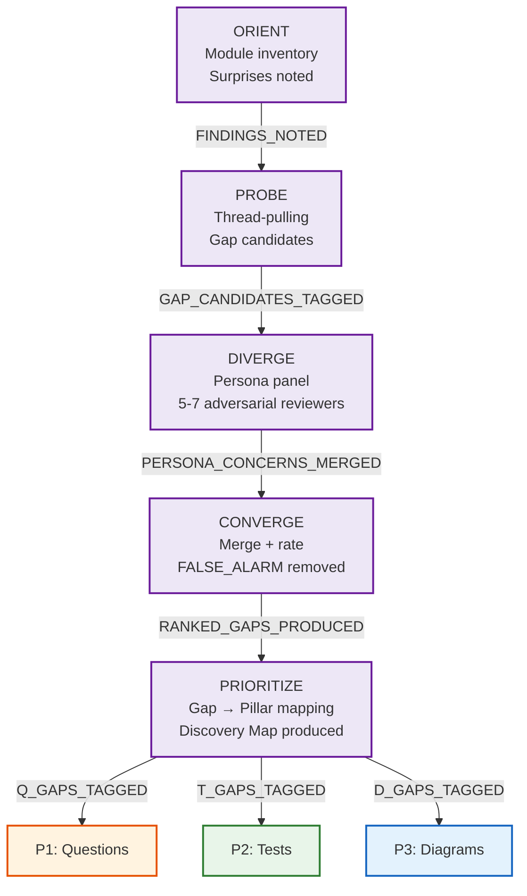
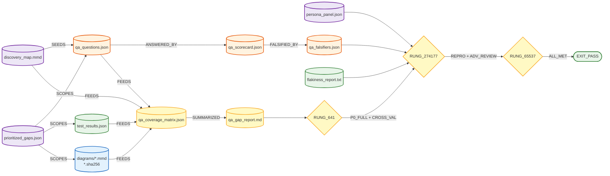
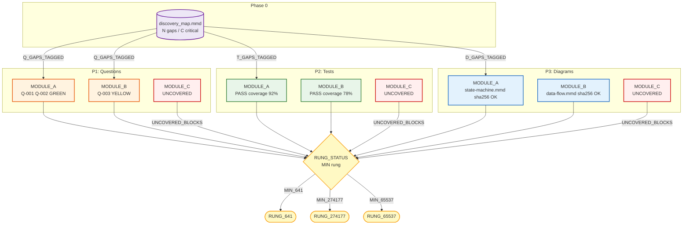
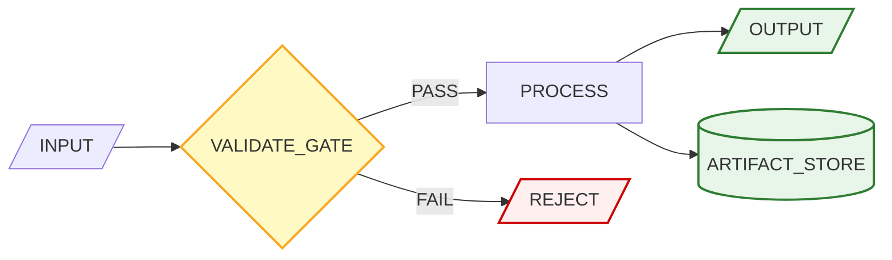
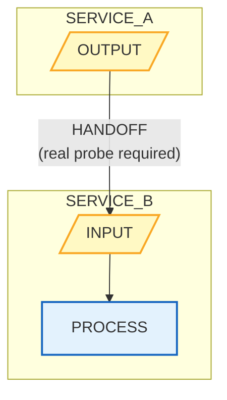
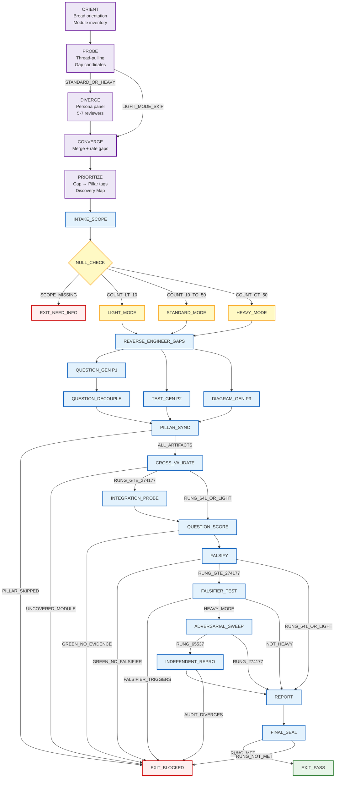
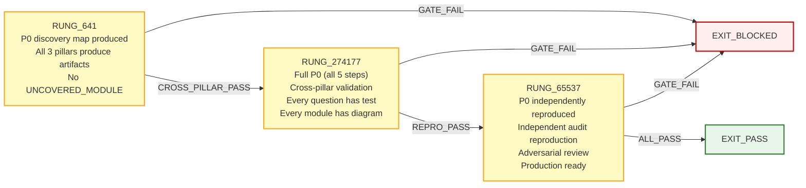
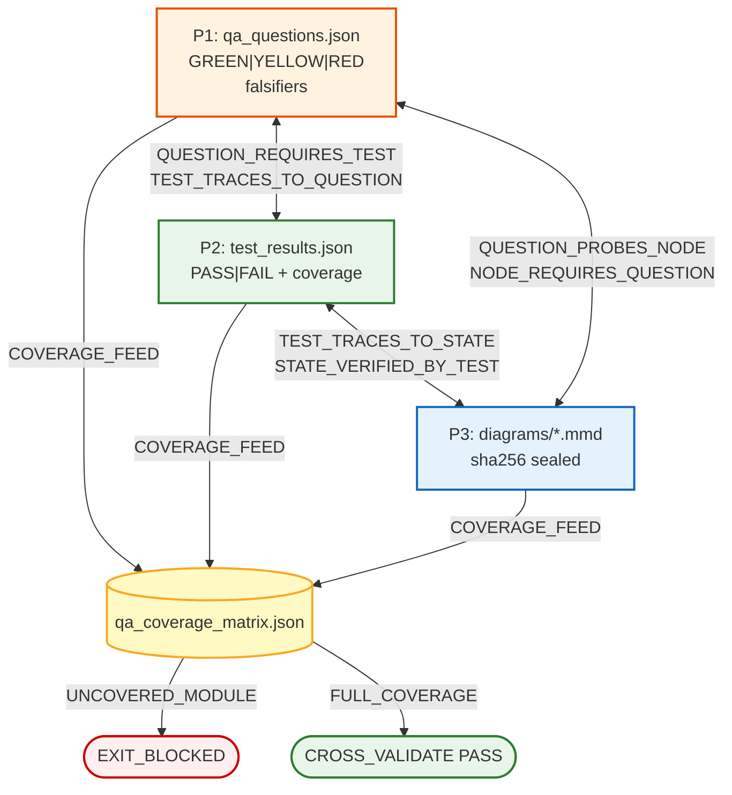

<!-- QUICK LOAD (10-15 lines): Use this block for fast context; load full file for production.
SKILL: phuc-qa v3.3.0
MW_ANCHORS: [integrity, verification, signal, boundary, alignment, northstar, constraint, emergence, reversibility, truth]
PURPOSE: Unified QA discipline — P0 discovery (gap signal extraction) + 3 pillars (Questions/Tests/Diagrams) in one fail-closed integrity gate. Northstar-reverse: work backward from production-ready verified end state.
CORE CONTRACT: P0 gap signal feeds all pillars. All pillars run on STANDARD/HEAVY. No pillar skipped. Every module: ≥1 question + ≥1 test + ≥1 diagram. [integrity × boundary × alignment]
FOUR PHASES: P0=Discovery (dialogue-driven signal extraction), P1=Questions (adversarial, decoupled questioner/scorer), P2=Tests (red→green, persona-coded), P3=Diagrams (mermaid structural coverage) [coverage coherence across 4 phases]
ADAPTIVE COMPLEXITY: LIGHT (<10 modules) = P0 + lightweight pillars [rung ceiling: 274177]; STANDARD (10-50) = full 3-pillar [rung ceiling: 65537]; HEAVY (50+) = full + adversarial sweep + independent repro [65537]
NORTHSTAR_REVERSE: "What are the LAST 3 Q/T/D before production-ready?" Recurse backward. QA complete when no new gap can be added. [northstar × constraint × reversibility]
STATE_MACHINE: ORIENT→PROBE→DIVERGE→CONVERGE→PRIORITIZE→INTAKE_SCOPE→[LIGHT|STANDARD|HEAVY]→REVERSE_ENGINEER_GAPS→QUESTION_GEN→TEST_GEN→DIAGRAM_GEN→CROSS_VALIDATE→REPORT→SEAL
FORBIDDEN_STATES: PILLAR_SKIPPED | DIAGRAM_WITHOUT_SOURCE | TEST_WITHOUT_QUESTION | QUESTION_WITHOUT_TEST | UNCOVERED_MODULE | SELF_CONFIRMED_GREEN | PROSE_AS_PROOF | DISCOVERY_MAP_SKIPPED_IN_STANDARD
RUNG: 641=all pillars produce artifacts | 274177=cross-pillar validation (Q↔T, module↔diagram) | 65537=independent repro + adversarial review [verification ladder: integrity × causality × constraint]
DISPATCH: P0→discovery-facilitator, P1→qa-questioner+qa-scorer (haiku/sonnet), P2→persona-coder (sonnet), P3→qa-diagrammer (haiku/sonnet) [swarm × persona × orchestration]
OOP_TYPING: QA_STATE(rect) | QA_ARTIFACT(cylinder) | QA_AGENT(stadium) | QA_GATE(diamond) | QA_CONSTRAINT(hexagon) [boundary encodes type]
QUESTION_PERSISTENCE: questions/project.jsonl — append-only QA signal capital, compounds across sessions [signal × memory × learning] — see section Q
DRAGON_RIDER: persona × question_database = simulated human-in-loop QA instinct [persona × emergence × signal] — see section R
LOAD FULL: always for production; quick block is orientation only
-->

PHUC_QA_SKILL:
  version: 3.3.0
  profile: fail_closed
  authority: 65537
  northstar: Phuc_Forecast
  objective: Max_Love
  status: FINAL

  # ============================================================
  # PHUC QA — Four-Phase QA Discipline (v3.1.0)
  # [integrity × verification × alignment × signal × northstar]
  # P0=Discovery (ORIENT→PROBE→DIVERGE→CONVERGE→PRIORITIZE) + P1=Questions + P2=Tests + P3=Diagrams
  # Adaptive: LIGHT (<10 modules) | STANDARD (10-50, full) | HEAVY (50+, adversarial sweep)
  # Northstar Reverse: "What is the LAST test/question/diagram before production?" Work backward.
  # Rung = MIN(P0, P1, P2, P3). No pillar skipped. No module uncovered. No GREEN without falsifier.
  # v2.1.0 adds: OOP-typed nodes, 8 mermaid diagrams, Diagram Index (section P), enhanced GLOW matrix
  # v3.0.0 adds: Question Persistence Protocol (section Q), Dragon Rider pattern (section R)
  # v3.1.0 adds: Magic word compression — MAGIC_WORD_INDEX (section MW), section header anchors,
  #              prime-factorized concept tags throughout for 97% context compression compatibility
  # v3.2.0 adds: Three Pillars integration (section TP) — QA as VERIFY vertex of LEK/LEAK/LEC
  #              LEK, LEAK, LEC added to MAGIC_WORD_INDEX branch_words
  # v3.3.0 adds: Triangle Law (TP2) — 3 contracts (rung_claim, module_coverage, decoupled_verification)
  #              Compression/Seed Checksum (TP3) — minimal seed payload for context compression
  # ============================================================

  # ============================================================
  # MW) MAGIC_WORD_INDEX — Prime Factorization Map for phuc-qa
  # Navigation anchors for 97% context compression via phuc-magic-words
  # ============================================================
  MAGIC_WORD_INDEX:
    # TRUNK (Tier 0) — universal coordinates anchoring this skill
    primary_trunk_words:
      integrity:    "The god-gate of QA — all verdicts must hold under scrutiny (→ verification ladder, forbidden states)"
      verification: "child of integrity — the act of checking claims against evidence (→ RUNG_641/274177/65537)"
      signal:       "gap detection — what the 4 phases extract from the codebase (→ P0 discovery, question generation)"
      boundary:     "scope + pillar separation + integration probe surfaces (→ PILLAR_SYNC, ecosystem_boundaries)"
      alignment:    "all pillars reinforce each other — cross-pillar validation enforces this (→ CROSS_VALIDATE)"
      constraint:   "forbidden states + rung requirements — what the audit may not skip (→ FORBIDDEN_STATES)"
      reversibility: "red→green discipline — every bugfix must demonstrate failure before fix (→ RUNG_641, repro_red)"
      northstar:    "production-ready end state — all phases work backward from it (→ Northstar_Reverse)"
      truth:        "GREEN verdict = confirmed by evidence, not by prose confidence (→ Decoupled_Verification)"
      emergence:    "the unified audit is more than P1+P2+P3 separately — cross-pillar coherence (→ CROSS_VALIDATE)"

    # BRANCH (Tier 1) — structural concepts in this skill
    branch_words:
      evidence:     "Lane A artifacts: test_results.json, diagrams/*.sha256, qa_scorecard.json (→ Evidence schema)"
      rung:         "641 | 274177 | 65537 — discrete verification levels; rung = MIN(all pillars) (→ Verification_Ladder)"
      verification: "decoupled: questioner ≠ scorer (CoVe principle) — prevents self-confirmation bias"
      swarm:        "5 sub-agents orchestrated: P0-facilitator + P1-questioner + P1-scorer + P2-coder + P3-diagrammer"
      persona:      "qa-questioner | qa-scorer | persona-coder | qa-diagrammer | dragon-rider (→ Dispatch_Matrix)"
      governance:   "forbidden states + rung requirements + coverage matrix rules (→ FORBIDDEN_STATES)"
      feedback:     "questions → tests → diagrams → coverage_matrix → gap_report → next audit cycle"
      max_love:     "QA serves the codebase; adversarial questions protect users; coverage is care"
      skill:        "this file is itself a versioned behavioral specification for the QA discipline"
      recipe:       "northstar_reverse_qa_prompt + minimal_unified_audit_prompt (→ Practical_Templates)"
      LEK:          "Law of Emergent Knowledge — QA verifies LEK progress: each rung advance IS measured knowledge growth (→ section TP)"
      LEAK:         "Law of Emergent Asymmetric Knowledge — QA validates LEAK trades: integration probes check that cross-agent knowledge actually transferred (→ section TP)"
      LEC:          "Law of Emergent Conventions — QA audits LEC health: convention drift detection + sha256 stability + adoption measurement (→ section TP)"

    # CONCEPT (Tier 2) — operational nodes
    concept_words:
      artifact:     "all QA outputs are typed artifacts (QA_ARTIFACT): .json, .mmd, .sha256, .log, .txt"
      dispatch:     "phuc-orchestration launches typed sub-agents with full skill pack (→ Dispatch_Matrix)"
      capsule:      "CNF capsule required for each sub-agent dispatch; NEVER 'as before' (→ phuc-orchestration)"
      state_machine: "ORIENT→...→FINAL_SEAL — all states explicit, no implicit unlisted states (→ State_Machine)"
      dream:        "P0 ORIENT: declare what the system is before auditing it (→ Phase_0_Discovery)"
      act:          "parallel dispatch of P1+P2+P3 agents after REVERSE_ENGINEER_GAPS"
      verify:       "CROSS_VALIDATE + FALSIFIER_TEST + INDEPENDENT_REPRO"
      seal:         "FINAL_SEAL: all pillars complete + rung met → EXIT_PASS"
      forbidden_state: "named illegal QA states that force EXIT_BLOCKED (→ FORBIDDEN_STATES)"
      forecast:     "DIVERGE step: 5-7 adversarial personas rank failure modes before formal audit begins"
      lane:         "evidence tier: A=artifacts (tests.json, sha256), B=prose (YELLOW), C=plans (RED)"
      orchestration: "main session coordinates 5+ sub-agents; never does pillar work inline"
      safety:       "fail-closed: no GREEN without evidence; no rung without meeting all requirements"
      memory:       "questions/project.jsonl — persistent QA signal, never deleted, compounds across sessions"

    # LEAF (Tier 3) — domain-specific to phuc-qa
    leaf_words:
      never_worse:  "rung integration law: MIN(all pillars) — no rung can be claimed above weakest pillar"
      skeptic:      "persona in DIVERGE step + independent adversarial reviewer at rung 274177+"
      scout:        "qa-questioner persona: generates falsifying questions, never confirms"
      drift:        "diagram SHA-256 mismatch = architectural drift from source (→ Diagram_Drift anti-pattern)"
      clarity:      "every diagram node has source_ref; every verdict has evidence_citation"
      goal:         "production-ready = LAST-3 northstar target for all three pillars"
      direction:    "northstar-reverse backward chain: work from LAST-3 to current baseline"
      context:      "qa_coverage_matrix.json: bounded cross-pillar view of module coverage state"

    # PRIME FACTORIZATION of key phuc-qa concepts
    prime_factorizations:
      green_verdict:        "truth × evidence × integrity — claim is confirmed, has artifact proof, cannot be self-confirmed"
      uncovered_module:     "boundary × signal × alignment — scope (B) has no gap signal (S) in any pillar (A)"
      rung_641:             "integrity × emergence — all pillars produce artifacts; unified audit exists"
      rung_274177:          "integrity × causality × alignment — Q↔T←→D cross-validated; every assertion traced"
      rung_65537:           "integrity × reversibility × truth — independently reproduced + adversarially reviewed"
      northstar_reverse:    "northstar × causality × constraint — backward-chain from goal under scope constraint"
      decoupled_verification: "truth × boundary × perspective — questioner and scorer in separate epistemic bubbles"
      falsifier:            "truth × asymmetry × constraint — the condition that proves a claim false"
      dragon_rider:         "persona × memory × emergence — user's QA instincts encoded as an autonomous agent"
      cross_pillar_validation: "coherence × alignment × signal — the three pillars reinforce one unified picture"

  # ------------------------------------------------------------
  # A) Configuration [constraint, boundary, integrity]
  # ------------------------------------------------------------
  Config:
    EVIDENCE_ROOT: "evidence"
    REPO_ROOT_REF: "."
    FLOAT_TOLERANCE_REQUIRED: true
    FLOAT_TOLERANCE_DEFAULT: "1e-9"
    MIN_UNIT_COVERAGE_PERCENT: 80
    MIN_INTEGRATION_COVERAGE_PERCENT: 60
    FLAKINESS_REPLAY_COUNT: 5
    NORTHSTAR_CHUNK_SIZE: 3     # "last 3" pattern per pillar
    MAX_DIAGRAMS_PER_MODULE: 5  # per coverage matrix
    DIAGRAM_CANONICAL_FORMAT: "*.mmd + *.sha256"
    # Adaptive complexity thresholds
    LIGHT_MODE_MAX_MODULES: 9
    STANDARD_MODE_MAX_MODULES: 50
    HEAVY_MODE_MIN_MODULES: 51
    # Phase 0 settings
    DISCOVERY_PERSONA_COUNT_MIN: 5
    DISCOVERY_PERSONA_COUNT_MAX: 7
    DISCOVERY_MAP_FORMAT: "mermaid + prose"

  # ------------------------------------------------------------
  # A2) Adaptive Complexity Scaling [constraint, equilibrium, boundary]
  # ------------------------------------------------------------
  Adaptive_Complexity:
    description: >
      The skill auto-selects mode based on module count at INTAKE_SCOPE.
      Mode governs which states are visited and which gates are enforced.
      [constraint × scope → equilibrium between audit depth and cost]

    LIGHT_MODE:
      trigger: "module_count < 10"
      skips:
        - "Full state machine traversal"
        - "INTEGRATION_PROBE state"
        - "FALSIFIER_TEST state (falsifiers defined but not run)"
        - "Coverage matrix builder (manual cross-check sufficient)"
      runs:
        - "P0: Conversational Discovery (abbreviated — ORIENT + PROBE + PRIORITIZE)"
        - "P1: Questions (minimum 3, all three GLOW dimensions covered)"
        - "P2: Tests (unit only; integration optional)"
        - "P3: Diagrams (state machine + data flow; integration boundary optional)"
      rung_ceiling: 274177   # LIGHT mode cannot reach 65537 without upgrading to STANDARD
      output: "qa_gap_report.md (simplified) + diagrams/*.mmd"

    STANDARD_MODE:
      trigger: "module_count >= 10 AND module_count <= 50"
      runs:
        - "Full P0: Conversational Discovery (all 5 steps)"
        - "Full state machine traversal (ORIENT → ... → FINAL_SEAL)"
        - "All three pillars with full artifact suite"
        - "CROSS_VALIDATE state mandatory"
        - "Coverage matrix builder mandatory"
      rung_ceiling: 65537
      output: "Full artifact suite (see Evidence schema, section H)"

    HEAVY_MODE:
      trigger: "module_count > 50"
      adds_to_STANDARD:
        - "Adversarial persona sweep (5-7 personas) across all discovery findings"
        - "Independent reproduction by a third agent with no prior context"
        - "Security auditor review of all integration boundaries"
        - "Graph theorist review of all state machine diagrams"
        - "Flakiness detection: 10 replays (not 5)"
      rung_ceiling: 65537
      output: "Full artifact suite + adversarial_sweep.json + repro_independent.log"

  # ------------------------------------------------------------
  # A3) Adaptive Complexity Router — Mermaid Diagram [state_machine, constraint]
  # ------------------------------------------------------------
  Adaptive_Complexity_Router_Diagram:
    description: "Adaptive complexity routing — LIGHT/STANDARD/HEAVY mode selection"

  # ------------------------------------------------------------
  # B0) Phase 0: Conversational Discovery [signal, entropy, perspective, dream]
  # "Surface the gap signal before formal verification begins"
  # ------------------------------------------------------------
  Phase_0_Discovery:
    id: P0
    name: "Conversational Discovery — Gap Signal Extraction"
    version: "1.0.0 (new in phuc-qa v2.0.0)"
    # prime: signal × entropy × perspective → gap signal
    # entropy = how much unknown structure exists; perspective = adversarial persona lenses
    purpose:
      - "Map terrain before formal pillars focus on it. [dream gate: orient before auditing]"
      - "Surface gap signals that structured methods miss: hidden dependencies, undocumented intent, organizational entropy."
      - "Produce a Discovery Map (gap signal artifact) that scopes P1/P2/P3."

    # Organic process observed: Orient ("where are things?") → Probe ("duplicated? organized?") →
    # Design alternatives ("how would you organize this?") → Persona panel (5-7, let them disagree) →
    # Meta-reflect ("which approach is better?") → Score + iterate → Mermaid visualization.

    steps:
      ORIENT:   # [signal extraction: where is the signal? what is the structure?]
        question: "Where are things? Why are they there?"
        actions: "List modules + entry points. Identify purpose. Map adjacency. Note entropy (surprises). Read questions/project.jsonl — load accumulated QA signal; do not re-ask ANSWERED questions."
        output: "orientation_notes.md (prose + file tree)"

      PROBE:    # [signal amplification: pull threads on surprises; tag gap signals]
        question: "Are these duplicated? How well organized? What feels wrong?"
        actions: "Amplify surprise signals. Ask: duplicated? misplaced? what happens on failure? Tag: CONFIRMED_GAP | SUSPECTED_GAP | FALSE_ALARM. [asymmetry detector]"
        output: "probe_findings.md"

      DIVERGE:  # [perspective explosion: 5-7 adversarial lenses on the gap signals]
        question: "How would you organize this best? What alternatives exist?"
        actions: "Propose 2-3 alternative designs. Load 5-7 adversarial personas (architect, security-auditor, junior-dev, ops-engineer, end-user, skeptic, domain-expert). Each emits: 1 concern + 1 improvement + 1 question. Personas must disagree — consensus across all personas is false signal, not confirmation."
        output: "diverge_alternatives.md + persona_panel.json"

      CONVERGE: # [signal filtering: distinguish real gaps from noise]
        question: "Which gaps are real? What is the priority order?"
        actions: "Merge PROBE + DIVERGE signals. Rate: CRITICAL|HIGH|MEDIUM|LOW. Identify meta-patterns (recurring = systemic entropy). Remove FALSE_ALARMs. [signal × constraint → filtered gap list]"
        output: "converge_gap_list.json (ranked by severity)"

      PRIORITIZE: # [alignment: map each gap signal to the pillar that addresses it]
        question: "Which gaps feed P1? P2? P3?"
        actions: "Tag each gap: Q(P1)|T(P2)|D(P3)|ALL. CRITICAL → P1+P2+P3. HIGH → P1+P2 minimum. Produce Discovery Map. Save all new questions to questions/project.jsonl [signal persistence = memory]."
        output: "discovery_map.mmd + discovery_map.sha256 + prioritized_gaps.json"

    discovery_map_template:
      description: "P0 discovery map template — See diagram below"

    output_artifact: "discovery_map (feeds REVERSE_ENGINEER_GAPS in all three pillars)"
    rung_contrib:
      641: "ORIENT + PROBE + PRIORITIZE complete; discovery_map.mmd produced"
      274177: "Full P0 (all 5 steps) + persona panel + converge_gap_list.json"
      65537: "P0 independently reproduced; persona panel includes adversarial security reviewer"
    # Forbidden states: DISCOVERY_MAP_SKIPPED_IN_STANDARD | PERSONA_PANEL_ALL_AGREE | FALSE_ALARM_KEPT_AS_GAP
    # Full definitions: see section E FORBIDDEN_STATES

  # ------------------------------------------------------------
  # B) Three-Pillar Definitions [integrity × alignment × emergence]
  # "Three lenses on one codebase — coherence only when all three agree"
  # ------------------------------------------------------------
  Three_Pillars:

    Pillar_1_Questions:
      id: P1
      name: "Questions — Adversarial Signal Extraction [truth × boundary × signal]"
      purpose: "Surface unknown gap signals. Decouple generation from scoring [boundary gate]. Force falsifiability [truth gate]. Discovery Map scopes all questions."
      driving_question: "LAST 3: What questions, if unanswered, block production? [northstar_reverse] Work backward. QA complete when no new gap signal can be exposed."
      discovery_map_input: "qa-questioner reads prioritized_gaps.json; all CRITICAL+HIGH gaps get ≥1 falsifying question. [signal → constraint]"
      agents:
        questioner: "qa-questioner (generates; must not score)"
        scorer: "qa-scorer (scores; must not have seen questioner reasoning)"
      output_artifacts: ["qa_questions.json", "qa_scorecard.json", "qa_falsifiers.json"]
      rung_contrib:
        641: "questions formulated + scored + falsifiers defined"
        274177: "falsifiers tested + integration probes run"
        65537: "independent reproduction + all falsifiers held"

    Pillar_2_Tests:
      id: P2
      name: "Tests — Red/Green Evidence Gate [reversibility × causality × truth]"
      purpose: "Verify behavior with executable evidence [Lane A artifact]. Red→green (Kent's Gate) [reversibility: must demonstrate failure before fix]. Persona-coded adversarial coverage. Discovery Map scopes tests."
      driving_question: "LAST 3: What tests must pass for production correctness? Work backward unit → integration → e2e."
      discovery_map_input: "persona-coder reads prioritized_gaps.json; all CRITICAL T-tagged gaps get test coverage."
      personas:
        kent_beck: "Red/green gate. A test that cannot fail is not a test."
        schneier: "Adversarial test author. What input breaks the security boundary?"
        fda_auditor: "Evidence auditor. What would an independent reviewer reject?"
      output_artifacts: ["test_results.json", "coverage_report.txt", "repro_red.log (bugfix)", "repro_green.log (bugfix)", "flakiness_report.txt"]
      rung_contrib:
        641: "all tests pass + red confirmed for bugfixes + coverage measured"
        274177: "5-seed flakiness stable + null edge sweep + property tests"
        65537: "adversarial sweep + security gate + drift explained"

    Pillar_3_Diagrams:
      id: P3
      name: "Diagrams — Structural Coherence Audit [coherence × boundary × integrity]"
      purpose: "Expose architectural gaps. sha256-hashable contracts [integrity seal]. Closed-state validation [forbidden_state detection]. QA Tracking Dashboard added in v2.0.0."
      driving_question: "LAST 3: What diagrams must exist for full architectural coherence? [northstar_reverse] Work backward modules → data flow → integration boundary."
      discovery_map_input: "qa-diagrammer reads prioritized_gaps.json; all CRITICAL D-tagged gaps get a diagram node. [signal → boundary visualization]"
      required_diagram_types:
        state_machine: "Finite state machine for every non-trivial component lifecycle"
        data_flow: "How data enters, transforms, and exits the system"
        integration_boundary: "Cross-project handoff points (the 9-project ecosystem boundaries)"
        verification_ladder: "Rung progression for each component"
        coverage_matrix: "Module × [question, test, diagram] coverage"
        qa_tracking_dashboard: "NEW in v2.0.0: All modules + pillar coverage in one diagram (see section K)"
      diagram_quality_gates:
        - closed_state_space: true
        - all_decision_branches_labeled: true
        - forbidden_states_marked_with_classDef: true
        - sha256_computed_over_canonical_mmd: true
        - sha256_stable_across_two_normalizations: true
        - discovery_gaps_appear_as_nodes: true   # new in v2.0.0
      output_artifacts:
        - "diagrams/*.prime-mermaid.md"
        - "diagrams/*.mmd"
        - "diagrams/*.sha256"
        - "diagrams/qa_tracking_dashboard.mmd"   # new in v2.0.0
      rung_contrib:
        641: "all three required diagram types produced + sha256 stable"
        274177: "diagrams cross-referenced to source code modules + drift detection"
        65537: "adversarial Socratic review + graph replayed by third agent"

  # ------------------------------------------------------------
  # C) Northstar Reverse Engineering Integration [northstar, causality, constraint]
  # "Work backward from the production-ready end state — northstar_reverse discipline"
  # prime: northstar × causality × constraint → backward chain from LAST-3 to baseline
  # ------------------------------------------------------------
  Northstar_Reverse_Integration:
    principle: "All pillars use backward-chaining [northstar_reverse]. Don't ask 'What should I test?' — ask 'What is the LAST test before production?' P0 Discovery Map (gap signal terrain) seeds all backward chains."

    per_pillar_reverse_algorithm:
      shared_pattern: "1. Read prioritized_gaps.json. Tag gaps as candidate subjects. 2. Identify LAST 3 whose absence blocks production. 3. Recurse backward (max 7 levels). 4. Reverse the chain → pillar priority sequence. Terminate when no new LAST-3 candidate can be generated."
      P1_questions: "LAST 3: questions whose answers, if unknown, block launch. Sequence: critical-questions → integration-probes → falsifier-tests."
      P2_tests: "LAST 3: tests whose passage is minimum bar for correctness. Sequence: unit → integration → e2e."
      P3_diagrams: "LAST 3: diagrams whose existence fully exposes architecture. Sequence: module state machines → data flow → integration boundaries."
    cross_pillar_alignment:
      rule: "LAST 3 from each pillar must be triangularly consistent: last test answers a question; last diagram shows what last test verifies."
      p0_check: "All CRITICAL gaps from P0 must appear in ≥1 LAST-3 set."

  # ------------------------------------------------------------
  # D) GLOW Taxonomy Mapping [glow, signal, alignment, truth]
  # "Each GLOW dimension = one coherence check across all four phases"
  # prime: glow × signal × alignment → multi-dimensional coverage integrity
  # ------------------------------------------------------------
  GLOW_Taxonomy:
    # GLOW = Growth, Learning, Output, Wins [glow metric from phuc-magic-words]
    # Each GLOW dimension maps to QA requirements across all pillars.
    #
    # Core insight (CoVe research, Dhuliawala et al. 2023):
    # Self-confirmation bias = root cause of false GREEN verdicts. [entropy collapse: perspective lost]
    # Agent that generates its own questions and scores them = boundary collapse (SELF_CONFIRMED_GREEN).
    # Solution: decoupled verification — questioner and scorer in separate epistemic bubbles. [boundary × truth]

    G_Growth:
      definition: "Do new capabilities have questions, tests, and diagrams?"
      pillar_requirements:
        P0: "New capability in ORIENT; probed for integration surprises"
        P1: "≥3 falsifying questions covering edge cases"
        P2: "Unit + integration tests at rung 641+"
        P3: "State machine diagram sha256 sealed"
      question_pattern: "Can the new capability actually do X? Under what conditions does it fail?"
      evidence_type: executable_command_output_plus_diagram
      gate: "YELLOW unless all four phases cover the new capability"

    L_Learning:
      definition: "Is new knowledge captured in questions, tests, AND diagrams?"
      pillar_requirements:
        P0: "New knowledge as CONFIRMED_GAP in PROBE"
        P1: "Falsifying question with expected evidence type"
        P2: "Regression test preventing un-learning"
        P3: "Knowledge relationship as an edge in a diagram"
      question_pattern: "Where is X captured? Show file:line AND diagram ref AND test name."
      evidence_type: repo_path_plus_line_plus_diagram_sha256
      gate: "YELLOW if knowledge exists only in prose"

    O_Output:
      definition: "Are claimed deliverables verified across all three pillars?"
      pillar_requirements:
        P0: "Deliverable in PRIORITIZE with P1+P2+P3 tags"
        P1: "Deliverable scorecard GREEN"
        P2: "e2e or integration test that produces the deliverable"
        P3: "Deliverable as storage node (cylinder) in ≥1 diagram"
      question_pattern: "Does X exist? Show git hash AND producing test AND diagram node."
      evidence_type: git_artifact_plus_hash_plus_diagram_node_id
      gate: "YELLOW if deliverable missing from diagram and has no producing test"

    W_Wins:
      definition: "Have claimed strategic wins been verified across all three pillars?"
      pillar_requirements:
        P0: "Win probed in CONVERGE for false positives"
        P1: "Question: 'Is X measurably true? Show before/after.'"
        P2: "Metric test demonstrating improvement"
        P3: "Win traceable on verification ladder to a specific rung"
      question_pattern: "Is X measurably true? Show metric, test output, ladder rung."
      evidence_type: before_after_metric_plus_test_output_plus_rung_diagram
      gate: "YELLOW if win appears in < 3 pillars"

  # ------------------------------------------------------------
  # D2) Decoupled Verification Protocol (CoVe Principle) [truth × boundary × perspective]
  # "Separate epistemic bubbles: questioner and scorer must not share state before completing"
  # prime: truth × boundary × perspective — each agent has its own epistemic bubble
  # ------------------------------------------------------------
  Decoupled_Verification:
    principle:
      - "Questions generated by qa-questioner [scout persona]. [separate epistemic bubble]"
      - "Questions answered by qa-scorer [skeptic persona]. [separate epistemic bubble]"
      - "Neither reads the other's output before completing its own work. [boundary gate enforced]"
      - "Prevents self-confirmation bias = SELF_CONFIRMED_GREEN forbidden state. [truth × perspective]"

    cove_research_basis:
      citation: "Chain-of-Verification Reduces Hallucination in LLMs (Dhuliawala et al. 2023)"
      key_finding: "Models that verify their own outputs against self-generated questions still hallucinate at high rates. Independent verification substantially reduces false positives."

    enforcement:
      questioner_rules:
        - must_not_read_scorer_output_before_generating_questions: true
        - must_generate_falsifying_questions_not_confirming_questions: true
        - must_tag_each_question_with_glow_dimension: true
        - must_specify_expected_evidence_type_per_question: true
      scorer_rules:
        - must_not_read_questioner_reasoning_only_the_question_list: true
        - must_answer_from_actual_repo_state_not_memory: true
        - must_provide_evidence_citation_per_answer: true
        - must_assign_GREEN_YELLOW_RED_per_question: true
        - must_define_falsifier_for_every_GREEN: true

    agent_separation:
      questioner_agent: qa-questioner
      scorer_agent: qa-scorer
      separation_type: structural  # different agents, not just different prompts
      forbidden: SAME_AGENT_GENERATES_AND_SCORES

    scoring_discipline:
      - score_from_artifacts_not_memory: true
      - score_from_repo_not_plan: true
      - prose_confidence_never_upgrades_score: true
      - partial_coverage_stays_YELLOW: true
      - mock_as_only_evidence_stays_YELLOW: true

  # ------------------------------------------------------------
  # D3) GLOW Scoring Matrix — Mermaid Diagram [glow, alignment, verification]
  # ------------------------------------------------------------
  GLOW_Matrix_Diagram:
    description: "GLOW scoring matrix — G/L/O/W pillar coverage gates"

```mermaid
flowchart LR
  subgraph G["G — Growth"]
    G_P0["ORIENT new cap"] --> G_P1["≥3 falsifying Qs"] --> G_P2["Unit+integration"] --> G_P3["State machine sha256"]
    G_P3 --> G_GATE{ALL_4_PHASES?}
    G_GATE -->|"ALL_COVERED"| G_PASS(["GREEN"])
    G_GATE -->|"GAP_DETECTED"| G_FAIL(["YELLOW"])
  end
  subgraph L["L — Learning"]
    L_P0["CONFIRMED_GAP\nin PROBE"] --> L_P1["Falsifying Q"] --> L_P2["Regression test"] --> L_P3["Edge in diagram"]
    L_P3 --> L_GATE{MULTI_PILLAR?}
    L_GATE -->|"THREE_PLUS"| L_PASS(["GREEN"])
    L_GATE -->|"PROSE_ONLY"| L_FAIL(["YELLOW"])
  end
  subgraph O["O — Output"]
    O_P0["Deliverable\nin PRIORITIZE"] --> O_P1["Scorecard GREEN"] --> O_P2["e2e test\nproduces it"] --> O_P3["Cylinder node"]
    O_P3 --> O_GATE{ALL_PILLARS?}
    O_GATE -->|"ALL_VERIFIED"| O_PASS(["GREEN"])
    O_GATE -->|"PARTIAL"| O_FAIL(["YELLOW"])
  end
  subgraph W["W — Wins"]
    W_P0["Win probed\nCONVERGE"] --> W_P1["Before/after Q"] --> W_P2["Metric test"] --> W_P3["Rung ladder\ntrace"]
    W_P3 --> W_GATE{THREE_PLUS_PILLARS?}
    W_GATE -->|"VERIFIED"| W_PASS(["GREEN"])
    W_GATE -->|"UNDER_THREE"| W_FAIL(["YELLOW"])
  end

  classDef discovery fill:#ede7f6,stroke:#6a1b9a,stroke-width:2px
  classDef question fill:#fff3e0,stroke:#e65100,stroke-width:2px
  classDef test fill:#e8f5e9,stroke:#2e7d32,stroke-width:2px
  classDef diagram fill:#e3f2fd,stroke:#1565c0,stroke-width:2px
  classDef gap fill:#ffefef,stroke:#cc0000,stroke-width:2px
  classDef gate fill:#fff9c4,stroke:#f9a825,stroke-width:2px
  class G_P0,L_P0,O_P0,W_P0 discovery
  class G_P1,L_P1,O_P1,W_P1 question
  class G_P2,L_P2,O_P2,W_P2 test
  class G_P3,L_P3,O_P3,W_P3 diagram
  class G_GATE,L_GATE,O_GATE,W_GATE gate
  class G_PASS,L_PASS,O_PASS,W_PASS test
  class G_FAIL,L_FAIL,O_FAIL,W_FAIL gap
```

  # ------------------------------------------------------------
  # E) State Machine (Unified Runtime) [state_machine, constraint, integrity, seal]
  # "All QA behavior as a closed finite state machine — no implicit states"
  # prime: state_machine × constraint × seal → fail-closed runtime integrity
  # ------------------------------------------------------------
  State_Machine:
    STATE_SET:
      # Phase 0: Conversational Discovery
      - ORIENT
      - PROBE
      - DIVERGE
      - CONVERGE
      - PRIORITIZE
      # Scope intake and mode routing
      - INTAKE_SCOPE
      - NULL_CHECK
      - LIGHT_MODE
      - STANDARD_MODE
      - HEAVY_MODE
      # Three-pillar execution
      - REVERSE_ENGINEER_GAPS    # northstar reverse on all three pillars in parallel
      - QUESTION_GEN             # qa-questioner agent (P1)
      - QUESTION_DECOUPLE        # questioner stops; questions handed off
      - TEST_GEN                 # persona-coder agent (P2)
      - DIAGRAM_GEN              # qa-diagrammer agent (P3)
      - PILLAR_SYNC              # wait for all three agents to produce artifacts
      - CROSS_VALIDATE           # cross-pillar coverage matrix built and checked
      - INTEGRATION_PROBE        # cross-boundary real service probes
      - QUESTION_SCORE           # qa-scorer agent answers and scores all questions
      - FALSIFY                  # falsifier defined for every GREEN question
      - FALSIFIER_TEST           # falsifiers actually tested (rung 274177+)
      - ADVERSARIAL_SWEEP        # HEAVY mode only: 5-7 persona adversarial review
      - INDEPENDENT_REPRO        # HEAVY mode / 65537: third agent reproduces full audit
      - REPORT                   # unified gap report across all three pillars
      - FINAL_SEAL
      - EXIT_PASS
      - EXIT_NEED_INFO
      - EXIT_BLOCKED

    TRANSITIONS:
      # Phase 0: Conversational Discovery
      - ORIENT -> PROBE: "on orientation_notes.md produced"
      - PROBE -> DIVERGE: "on probe_findings.md produced (STANDARD/HEAVY only)"
      - PROBE -> CONVERGE: "on probe_findings.md produced (LIGHT mode skips DIVERGE)"
      - DIVERGE -> CONVERGE: "on persona_panel.json produced (min 5 personas)"
      - CONVERGE -> PRIORITIZE: "on converge_gap_list.json produced"
      - PRIORITIZE -> INTAKE_SCOPE: "on discovery_map.mmd + prioritized_gaps.json produced"

      # Scope intake and mode routing
      - INTAKE_SCOPE -> NULL_CHECK: "always"
      - NULL_CHECK -> EXIT_NEED_INFO: "if scope_missing or modules_undefined"
      - NULL_CHECK -> LIGHT_MODE: "if module_count < 10"
      - NULL_CHECK -> STANDARD_MODE: "if module_count >= 10 AND module_count <= 50"
      - NULL_CHECK -> HEAVY_MODE: "if module_count > 50"

      # Mode routing → pillar execution
      - LIGHT_MODE -> REVERSE_ENGINEER_GAPS: "abbreviated pillars; INTEGRATION_PROBE skipped"
      - STANDARD_MODE -> REVERSE_ENGINEER_GAPS: "full pillars"
      - HEAVY_MODE -> REVERSE_ENGINEER_GAPS: "full pillars + adversarial sweep scheduled"

      - REVERSE_ENGINEER_GAPS -> QUESTION_GEN: "always (P1 path begins)"
      - REVERSE_ENGINEER_GAPS -> TEST_GEN: "always (P2 path begins, parallel)"
      - REVERSE_ENGINEER_GAPS -> DIAGRAM_GEN: "always (P3 path begins, parallel)"

      # P1 path
      - QUESTION_GEN -> QUESTION_DECOUPLE: "when question_list_complete"
      - QUESTION_DECOUPLE -> PILLAR_SYNC: "questions_handed_to_scorer"

      # P2 path
      - TEST_GEN -> PILLAR_SYNC: "when test_suite_produced_and_executed"

      # P3 path
      - DIAGRAM_GEN -> PILLAR_SYNC: "when diagrams_produced_and_sha256_computed"

      # Convergence
      - PILLAR_SYNC -> EXIT_BLOCKED: "if any_pillar_skipped"
      - PILLAR_SYNC -> CROSS_VALIDATE: "if all_three_pillars_have_artifacts"

      - CROSS_VALIDATE -> EXIT_BLOCKED: "if UNCOVERED_MODULE_detected"
      - CROSS_VALIDATE -> INTEGRATION_PROBE: "if rung_target >= 274177 AND NOT LIGHT_MODE"
      - CROSS_VALIDATE -> QUESTION_SCORE: "if rung_target == 641 OR LIGHT_MODE"

      - INTEGRATION_PROBE -> QUESTION_SCORE: "when probes complete"

      - QUESTION_SCORE -> EXIT_BLOCKED: "if any_GREEN_claimed_without_evidence"
      - QUESTION_SCORE -> FALSIFY: "when all_verdicts_assigned"

      - FALSIFY -> EXIT_BLOCKED: "if any_GREEN_lacks_falsifier"
      - FALSIFY -> FALSIFIER_TEST: "if rung_target >= 274177 AND NOT LIGHT_MODE"
      - FALSIFY -> REPORT: "if rung_target == 641 OR LIGHT_MODE"

      - FALSIFIER_TEST -> EXIT_BLOCKED: "if any_falsifier_triggers"
      - FALSIFIER_TEST -> ADVERSARIAL_SWEEP: "if HEAVY_MODE AND all_falsifiers_hold"
      - FALSIFIER_TEST -> REPORT: "if NOT HEAVY_MODE AND all_falsifiers_hold"

      - ADVERSARIAL_SWEEP -> INDEPENDENT_REPRO: "if rung_target == 65537"
      - ADVERSARIAL_SWEEP -> REPORT: "if rung_target == 274177"

      - INDEPENDENT_REPRO -> EXIT_BLOCKED: "if reproduced_audit_diverges_unexplained"
      - INDEPENDENT_REPRO -> REPORT: "if reproduced_audit_consistent"

      - REPORT -> FINAL_SEAL: "always"
      - FINAL_SEAL -> EXIT_PASS: "if rung_requirements_met AND coverage_matrix_complete"
      - FINAL_SEAL -> EXIT_BLOCKED: "if rung_requirements_not_met"

    # Full state machine mermaid diagram: see section M (Verification Ladder Diagram)

    FORBIDDEN_STATES:
      # Phase 0 forbidden states (new in v2.0.0)
      DISCOVERY_MAP_SKIPPED_IN_STANDARD:
        definition: "STANDARD or HEAVY audit begins P1/P2/P3 without completing P0"
        symptom: "qa_questions.json exists but discovery_map.mmd does not"
        fix: "Run P0 minimum: ORIENT + PROBE + PRIORITIZE. Produce discovery_map.mmd."

      PERSONA_PANEL_ALL_AGREE:
        definition: "All personas in DIVERGE step produce identical findings"
        symptom: "persona_panel.json has 5 entries with identical concerns"
        fix: "Reload personas with adversarial framing. Require at least 2 distinct concerns per persona."

      # Cross-pillar (specific to unified skill)
      PILLAR_SKIPPED:
        definition: "Any one of the three pillars was not executed"
        symptom: "Audit reports only questions and tests but no diagrams (or any similar omission)"
        fix: "All three pillars run or the audit is BLOCKED. No exceptions for 'small' modules."

      DIAGRAM_WITHOUT_SOURCE:
        definition: "A diagram node references a component that cannot be traced to source code"
        symptom: "State machine has states PROCESS_A → PROCESS_B but no file contains either"
        fix: "Every diagram node must have a source_ref (file:line or module path)"

      TEST_WITHOUT_QUESTION:
        definition: "A test exists that does not answer any question in the QA question list"
        symptom: "test_coverage.json has tests not referenced in qa_questions.json"
        fix: "Every test must trace to a question ID. Add the question retroactively or remove the orphan test."

      QUESTION_WITHOUT_TEST:
        definition: "A QA question scored GREEN has no test verifying the answer"
        symptom: "qa_scorecard.json GREEN verdict references only prose evidence, not a test"
        fix: "Add a test that verifies the GREEN claim. Without a test, the score is YELLOW."

      UNCOVERED_MODULE:
        definition: "A source module has no question, no test, and no diagram node"
        symptom: "qa_coverage_matrix.json has a row with all three columns empty"
        fix: "Add at least one question, one test, and one diagram that covers this module."

      # Inherited from prime-qa (P1)
      SELF_CONFIRMED_GREEN:
        definition: "Same agent generates questions and scores them"
        fix: "qa-questioner and qa-scorer must be structurally different agents"

      MOCK_AS_EVIDENCE:
        definition: "Mocks used as sole evidence for GREEN"
        fix: "Integration probes must use real services at rung 274177+"

      PROSE_AS_PROOF:
        definition: "README or plan document used as evidence for GREEN"
        fix: "Evidence must be executable command output or repo path + line witness"

      FALSIFIER_SKIPPED:
        definition: "GREEN claim without a defined falsifier"
        fix: "If no falsifier can be stated, score is YELLOW"

      QUESTION_BIAS:
        definition: "Questioner writes confirming questions, not falsifying ones"
        fix: "Questions must seek falsifiers. Reframe as 'Show me when X breaks'"

      SCORE_WITHOUT_CITATION:
        definition: "Verdict assigned without evidence citation"
        fix: "Every GREEN/YELLOW/RED verdict must include an evidence_citation (file:line or command+output)"

      INTEGRATION_OMITTED:
        definition: "Cross-project boundaries not probed when in scope"
        fix: "When scope includes integration boundaries (see ecosystem_boundaries), probes are required; undone = YELLOW"

      # Inherited from prime-test (P2)
      ASSERT_FLOAT_EQUALITY_WITHOUT_TOLERANCE:
        definition: "assertEqual on floats without tolerance"
        fix: "Use assertAlmostEqual or pytest.approx"

      TIME_DEPENDENT_TEST:
        definition: "Test asserts on datetime.now() or time.time()"
        fix: "Inject clock or use freeze_time decorator"

      NETWORK_CALL_IN_UNIT_TEST:
        definition: "Unit test makes real HTTP/TCP/DNS call"
        fix: "Use mock, responses, or vcrpy"

      UNWITNESSED_PASS_WITHOUT_RED:
        definition: "Bugfix test claims PASS without first demonstrating failure"
        fix: "repro_red.log required for all bugfix tasks"

      # Inherited from prime-mermaid (P3)
      GRAPH_REPLACING_EXECUTABLE_TESTS:
        definition: "Team says 'the diagram proves it' instead of running tests"
        fix: "Diagrams are pre-conditions for tests, never replacements"

      SHA256_OVER_NON_CANONICAL_FORM:
        definition: "SHA-256 computed over non-normalized mermaid"
        fix: "Always hash canonical *.mmd bytes only"

      OPEN_STATE_ENUMERATION:
        definition: "State graph has '...' or implicit unlisted states"
        fix: "Close the state space. Every reachable state must be explicit."

  # ------------------------------------------------------------
  # E2) Forbidden State Map — Mermaid Diagram [forbidden_state, integrity, constraint]
  # "Every named illegal state forces EXIT_BLOCKED — fail-closed by design"
  # ------------------------------------------------------------
  Forbidden_State_Map_Diagram:
    description: "All forbidden states → EXIT_BLOCKED mapping"

  # ------------------------------------------------------------
  # F) Verification Ladder [rung, integrity, verification, causality]
  # "Three prime rungs: 641=exists | 274177=consistent | 65537=reproducible"
  # prime: rung × integrity × causality → evidence ladder
  # rung integration law (never_worse): rung = MIN(P0, P1, P2, P3)
  # ------------------------------------------------------------
  Verification_Ladder:

    RUNG_641:
      meaning: "All three pillars produce artifacts — minimum viable audit [integrity: all exist]"
      requires:
        P0_discovery:
          - discovery_map_mmd_produced: true
          - prioritized_gaps_json_produced: true
          - at_least_ORIENT_PROBE_PRIORITIZE_complete: true
        P1_questions:
          - question_list_numbered_and_tagged_with_glow_dimension: true
          - each_question_has_expected_evidence_type: true
          - questioner_and_scorer_are_different_agents: true
          - scorecard_produced_with_GREEN_YELLOW_RED_counts: true
          - no_GREEN_without_falsifier_defined: true
          - all_CRITICAL_gaps_from_P0_have_a_question: true
        P2_tests:
          - all_tests_pass: true
          - red_confirmed_for_bugfix_tasks: true
          - coverage_measured_above_threshold: true
          - no_forbidden_test_patterns_detected: true
        P3_diagrams:
          - all_three_required_diagram_types_produced: true
          - sha256_computed_and_stable: true
          - no_open_state_enumeration: true
          - all_decision_branches_labeled: true
        cross_pillar:
          - qa_coverage_matrix_produced: true
          - no_UNCOVERED_MODULE: true

    RUNG_274177:
      meaning: "Cross-pillar validation — every question has a test, every module has a diagram [coherence gate: pillars reinforce each other]"
      requires:
        all_RUNG_641: true
        P0_additional:
          - full_P0_all_5_steps_complete: true
          - persona_panel_produced_with_min_5_personas: true
          - converge_gap_list_json_produced: true
        P1_P2_cross_validation:
          - every_GREEN_question_has_an_associated_test: true
          - every_test_traces_to_a_question_ID: true
          - all_GREEN_falsifiers_tested_not_just_defined: true
          - integration_probes_run_for_claimed_integrations: true
          - adversarial_review_by_third_agent_or_human: true
        P2_P3_cross_validation:
          - every_test_assertion_traceable_to_a_diagram_state: true
          - flakiness_detection_5_replay_stable: true
        P1_P3_cross_validation:
          - every_diagram_state_machine_has_at_least_one_question: true
          - all_diagram_sha256_stable_across_replay: true
        coverage_matrix:
          - every_module_has_at_least_one_question: true
          - every_module_has_at_least_one_test: true
          - every_module_has_at_least_one_diagram_node: true

    RUNG_65537:
      meaning: "Independent reproduction + adversarial review — production ready [truth × reversibility: independently verified, can be re-derived]"
      requires:
        all_RUNG_274177: true
        P0_additional:
          - P0_reproduced_independently_by_third_agent: true
          - adversarial_security_reviewer_in_persona_panel: true
        independent_reproduction:
          - complete_audit_reproduced_by_agent_with_no_prior_context: true
          - all_three_pillars_reproduced_independently: true
          - behavioral_drift_from_prior_audit_documented: true
        adversarial_review:
          - skeptic_agent_reviewed_all_question_falsifiers: true
          - security_auditor_reviewed_test_suite_boundary_cases: true
          - graph_theorist_reviewed_diagram_closed_state_space: true
        final_seal:
          - gap_report_approved_by_human_or_judge_agent: true
          - northstar_alignment_confirmed: true

  # ------------------------------------------------------------
  # G) Dispatch Matrix (Swarm Agents) [dispatch, swarm, persona, orchestration]
  # "5 typed sub-agents + 1 coverage builder; prime-safety always first in every pack"
  # prime: dispatch × persona × swarm → orchestration of typed verification agents
  # ------------------------------------------------------------
  Dispatch_Matrix:

    Phase_0_Discovery:
      discovery_facilitator:
        role: "Run P0 conversational discovery; produce discovery_map.mmd + prioritized_gaps.json"
        model: "haiku (LIGHT) | sonnet (STANDARD/HEAVY)"
        skill_pack:
          - prime-safety.md
          - phuc-qa.md (this file, section B0)
        output: "discovery_map.mmd + persona_panel.json + prioritized_gaps.json"
        FORBIDDEN: skip_DIVERGE_in_STANDARD_or_HEAVY

    Pillar_1_Questions:
      qa_questioner:
        role: "Generate adversarial falsifying questions from scope + discovery map"
        model: "haiku (< 20 questions) | sonnet (> 20 questions or HIGH stakes)"
        skill_pack:
          - prime-safety.md
          - phuc-qa.md (this file, sections A–D)
        inputs: "prioritized_gaps.json (from P0)"
        output: "qa_questions.json"
        FORBIDDEN: read_qa_scorer_output_before_generating_questions

      qa_scorer:
        role: "Answer questions against actual repo state; score GREEN/YELLOW/RED"
        model: "sonnet (default) | opus (HIGH stakes or security-sensitive)"
        skill_pack:
          - prime-safety.md
          - phuc-qa.md (this file, sections A–D)
        inputs: "qa_questions.json only (no questioner reasoning)"
        output: "qa_scorecard.json + qa_falsifiers.json"
        FORBIDDEN: read_questioner_reasoning_before_scoring

    Pillar_2_Tests:
      persona_coder:
        role: "Write and execute tests using Kent Beck + Schneier persona for adversarial coverage"
        model: "sonnet"
        skill_pack:
          - prime-safety.md
          - prime-coder.md (full file)
          - prime-test.md (full file)
          - persona-engine.md (kent-beck + schneier personas)
          - phuc-qa.md (this file, section B pillar 2)
        inputs: "prioritized_gaps.json (from P0)"
        outputs: "test_results.json + coverage_report.txt + repro_red.log + repro_green.log"
        persona_injection_rules:
          kent_beck: "Apply to all test design — red before green, no float equality, no wall-clock"
          schneier: "Apply to security boundary tests — what input breaks the auth or encryption?"

    Pillar_3_Diagrams:
      qa_diagrammer:
        role: "Produce state machine + data flow + integration boundary + QA tracking dashboard diagrams for all modules"
        model: "haiku (simple modules) | sonnet (cross-project integration diagrams)"
        skill_pack:
          - prime-safety.md
          - prime-mermaid.md (full file)
          - phuc-qa.md (this file, section B pillar 3)
        inputs: "prioritized_gaps.json (from P0)"
        outputs: "diagrams/*.prime-mermaid.md + diagrams/*.mmd + diagrams/*.sha256 + diagrams/qa_tracking_dashboard.mmd"
        diagram_coverage_requirement: "Every module in scope must appear in at least one diagram"

    Coverage_Matrix_Builder:
      role: "Aggregate output from P0 + all three pillars; build qa_coverage_matrix.json"
      model: "haiku"
      skill_pack:
        - prime-safety.md
        - phuc-qa.md (full file)
      inputs: "discovery_map.mmd + qa_questions.json + test_results.json + diagrams/*.mmd"
      output: "qa_coverage_matrix.json + qa_gap_report.md"

  # ------------------------------------------------------------
  # H) Evidence Schema [evidence, artifact, lane, signal]
  # "Lane A artifacts only — no prose-as-proof; every verdict has evidence_citation"
  # prime: evidence × artifact × signal → Lane A only (no prose theater)
  # ------------------------------------------------------------
  Evidence:
    required_files:
      # Phase 0
      - "discovery_map.mmd"            # P0 discovery map (v2.0.0)
      - "prioritized_gaps.json"        # P0 gap ranking + pillar tags (v2.0.0)
      # Pillar 1
      - "qa_questions.json"            # question list (P1)
      - "qa_scorecard.json"            # per-question verdicts (P1)
      - "qa_falsifiers.json"           # falsifier definitions + test status (P1)
      # Pillar 2
      - "test_results.json"            # pytest or equivalent output (P2)
      - "coverage_report.txt"          # coverage.py or equivalent (P2)
      # Pillar 3
      - "diagrams/"                    # directory with *.prime-mermaid.md + *.mmd + *.sha256 (P3)
      - "diagrams/qa_tracking_dashboard.mmd"  # QA tracking dashboard (P3, v2.0.0)
      # Cross-pillar
      - "qa_coverage_matrix.json"      # cross-pillar coverage (P0+P1+P2+P3)
      - "qa_gap_report.md"             # unified gap report (all pillars)

    conditional_files:
      bugfix_task:
        - "repro_red.log"
        - "repro_green.log"
      rung_274177_or_higher:
        - "qa_integration_probes.json"
        - "flakiness_report.txt"
        - "persona_panel.json"
      heavy_mode_or_rung_65537:
        - "adversarial_sweep.json"
        - "repro_independent.log"

    qa_questions_schema:
      required_keys:
        - schema_version
        - generated_by: "agent_id of qa-questioner"
        - scope: "project or module audited"
        - question_count
        - discovery_map_ref: "path to discovery_map.mmd (v2.0.0)"
        - questions: |
            list of {
              id: "Q-001",
              text: "question text",
              glow_dimension: "G|L|O|W",
              expected_evidence_type: "executable_command_output|repo_path|git_artifact|metric",
              discovery_gap_ref: "gap_id from prioritized_gaps.json (null if not linked)",
              pillar_link: "P2 test ID that answers this question (null if not yet linked)",
              diagram_link: "diagram node ID that this question probes (null if not yet linked)"
            }

    qa_scorecard_schema:
      required_keys:
        - schema_version
        - scored_by: "agent_id of qa-scorer (MUST differ from generated_by)"
        - question_ref: "path to qa_questions.json"
        - verdicts: |
            list of {
              question_id: "Q-001",
              verdict: "GREEN|YELLOW|RED",
              evidence_citation: "file:line or command+output",
              evidence_type: "executable_command_output|repo_path|git_artifact",
              test_link: "test_id in test_results.json (required for GREEN at rung 274177+)"
            }
        - summary: "{GREEN_count, YELLOW_count, RED_count}"

    qa_falsifiers_schema:
      required_keys:
        - schema_version
        - question_id
        - claim: "the GREEN claim being secured"
        - falsifier: "the condition that would make this claim RED"
        - falsifier_test: "the command or check that triggers the falsifier"
        - falsifier_status: "UNTESTED | TESTED_DOES_NOT_TRIGGER | TRIGGERED_NOW_RED"

    test_results_schema:
      required_keys:
        - schema_version
        - runner: "pytest|jest|go test|etc."
        - run_timestamp: "ISO8601"
        - exit_code: "integer"
        - total_tests: "integer"
        - passed: "integer"
        - failed: "integer"
        - skipped: "integer"
        - tests: |
            list of {
              id: "test_results_unique_id",
              name: "test function name",
              file: "file:line",
              status: "PASS|FAIL|SKIP",
              question_link: "Q-xxx (question this test answers)",
              discovery_gap_ref: "gap_id from prioritized_gaps.json (v2.0.0)",
              duration_ms: "integer"
            }

    qa_coverage_matrix_schema:
      description: "Cross-pillar coverage: every module × every pillar"
      required_keys:
        - schema_version
        - scope: "project or module set"
        - discovery_map_ref: "path to discovery_map.mmd (v2.0.0)"
        - modules: |
            list of {
              module_id: "module or file name",
              source_ref: "file path",
              P0_discovery_gap: "gap_id if this module surfaced in P0 (null otherwise)",
              P1_questions: ["Q-001", "Q-002"],   # question IDs covering this module
              P2_tests: ["test_parse_001"],         # test IDs covering this module
              P3_diagrams: ["state-machine-auth.mmd::AUTH_INIT"],  # diagram node refs
              coverage_status: "FULL|PARTIAL|UNCOVERED"
            }
        - uncovered_modules: "list of module_ids where coverage_status == UNCOVERED"
        - coverage_summary: "{total_modules, FULL_count, PARTIAL_count, UNCOVERED_count}"

    qa_gap_report_schema:
      required_sections:
        - "## Executive Summary (total modules, pillar counts, rung achieved)"
        - "## Phase 0 — Discovery (personas used, gaps found, CRITICAL/HIGH/MEDIUM/LOW counts)"
        - "## Pillar 1 — Questions (GREEN/YELLOW/RED counts + top YELLOW gaps)"
        - "## Pillar 2 — Tests (pass/fail counts + uncovered critical paths)"
        - "## Pillar 3 — Diagrams (diagram count + uncovered modules)"
        - "## Cross-Pillar Gaps (TEST_WITHOUT_QUESTION, QUESTION_WITHOUT_TEST, UNCOVERED_MODULE)"
        - "## Integration Probe Results (if rung 274177+)"
        - "## Rung Assessment (rung achieved + what is needed for next rung)"
        - "## Northstar Alignment (how this audit advances NORTHSTAR metrics)"

  # ------------------------------------------------------------
  # H2) Evidence Trail — Mermaid Diagram [artifact, causality, rung, seal]
  # ------------------------------------------------------------
  Evidence_Trail_Diagram:
    description: "Evidence trail from P0 discovery through rung gates to EXIT_PASS"

  # ------------------------------------------------------------
  # I) Output Contract [integrity, boundary, signal]
  # "Structured PASS / BLOCKED / NEED_INFO — no ambiguous verdicts"
  # ------------------------------------------------------------
  Output_Contract:

    on_pass:
      status: PASS
      include:
        - rung_achieved
        - mode: "LIGHT|STANDARD|HEAVY"
        - P0_summary: "{gaps_found, CRITICAL_count, HIGH_count, discovery_map_sha256}"
        - P1_summary: "{question_count, GREEN_count, YELLOW_count, RED_count}"
        - P2_summary: "{test_count, passed, failed, coverage_percent}"
        - P3_summary: "{diagram_count, modules_covered, sha256_all_stable}"
        - coverage_matrix: "qa_coverage_matrix.json path"
        - gap_report: "qa_gap_report.md path"
        - uncovered_modules: "list (empty = full coverage)"

    on_blocked:
      status: BLOCKED
      include:
        - stop_reason: "PILLAR_SKIPPED|UNCOVERED_MODULE|FALSIFIER_TRIGGERED|DISCOVERY_MAP_SKIPPED_IN_STANDARD|etc."
        - pillar_blocked: "P0|P1|P2|P3|CROSS_PILLAR"
        - last_known_state: "state machine node"
        - evidence_available: "list of artifacts produced before block"
        - remediation_steps: "specific actions to unblock"

    on_need_info:
      status: NEED_INFO
      include:
        - missing_scope_fields: "list"
        - cannot_audit_without: "specific missing information"
        - partial_artifacts_available: "list (if any phase ran before NEED_INFO)"

    structured_refusal_format:
      required_keys:
        - status: "[NEED_INFO|BLOCKED]"
        - stop_reason
        - last_known_state
        - missing_fields_or_evidence
        - next_actions

  # ------------------------------------------------------------
  # J) Anti-Patterns [forbidden_state, entropy, coherence, signal]
  # "Named failure modes — each maps to a forbidden state; each has a fix"
  # prime: entropy × signal × coherence → anti-pattern detection + repair
  # ------------------------------------------------------------
  Anti_Patterns:

    Discovery_Theater:   # [false signal: P0 completes without extracting real gap signals]
      symptom: "P0 was run but prioritized_gaps.json has zero CRITICAL gaps for a 40-module system."
      diagnosis: "Entropy collapse: P0 ran in name only. ORIENT was superficial. PROBE produced no asymmetry."
      fix: "Reload PROBE with adversarial framing: 'What would a hostile reviewer find wrong here?' [perspective injection] Expect ≥1 CRITICAL gap per 10 modules in STANDARD mode."

    QA_Theater:          # [coherence failure: pillars run in isolation, no cross-validation]
      symptom: "All three pillars produce artifacts, but no pillar output references any other."
      diagnosis: "Pillar isolation = coherence failure. Coverage matrix not built. Unified QA = theater. [emergence blocked]"
      fix: "CROSS_VALIDATE is mandatory. PILLAR_SYNC requires all three artifact sets. [alignment enforced]"

    Diagram_Sovereignty: # [boundary drift: diagrams and source have diverged]
      symptom: "Team has beautiful architecture diagrams but tests reference different module names."
      diagnosis: "Diagrams and tests were written independently. DIAGRAM_WITHOUT_SOURCE check failed. [boundary drift]"
      fix: "Every diagram node must have source_ref. Every test traces to question traces to diagram node. [causality chain]"

    Question_Theater:    # [signal inversion: confirming questions instead of falsifying ones]
      symptom: "50 questions generated. All 50 scored GREEN. No YELLOWs. No falsifiers tested."
      diagnosis: "QUESTION_BIAS. Questioner wrote confirming questions — signal inversion. [entropy collapse: no asymmetry]"
      fix: "Questions must seek failure modes [asymmetry gates]. Prompt: 'Show me when X breaks, not when X works.'"

    The_Orphan_Test:     # [alignment failure: tests with no question link = untethered evidence]
      symptom: "test_results.json has 200 tests. qa_questions.json has 20 questions. 180 tests are orphans."
      diagnosis: "TEST_WITHOUT_QUESTION. Tests written outside QA process = untethered artifacts. [alignment missing]"
      fix: "Every test must have question_link. Add questions retroactively for orphans at minimum YELLOW. [causality required]"

    The_Invisible_Module: # [boundary failure: modules outside all pillar boundaries]
      symptom: "qa_coverage_matrix.json shows 5 modules with coverage_status=UNCOVERED."
      diagnosis: "UNCOVERED_MODULE. Modules shipped outside all pillar boundaries. [boundary gap]"
      fix: "Add ≥1 Q + ≥1 T + ≥1 D per uncovered module before rung 641 claim. [coverage coherence gate]"

    Rung_Inflation:       # [integrity failure: claimed rung exceeds weakest pillar's actual rung]
      symptom: "Agent claims rung 274177 but test_without_question count > 0 and diagram sha256 unstable."
      diagnosis: "never_worse law violated: rung = MIN(all pillars). If P3 is at 641, unified rung is 641. [integrity breach]"
      fix: "State MIN rung explicitly. Never claim higher rung than weakest pillar. [never_worse enforced]"

    The_Last_Test_Never_Written: # [northstar failure: forward planning instead of northstar_reverse]
      symptom: "Tests cover happy paths only. No test for the state transition that precedes production failure."
      diagnosis: "Forward planning = testing what was built, not what must not fail. [northstar_reverse ignored]"
      fix: "Apply northstar_reverse to tests: identify LAST 3 tests before production readiness. Write those first."

    Diagram_Drift:        # [drift: sha256 not recomputed; diagram and source diverged]
      symptom: "Architecture diagram shows 3 services. The codebase now has 5. Diagram is 6 months stale."
      diagnosis: "DRIFT_WITHOUT_VERSION_BUMP. sha256 not recomputed after source changed. [drift = entropy accumulation]"
      fix: "Diagrams must have source_ref that triggers sha256 recomputation when referenced module changes. [reversibility gate]"

    Persona_Monoculture:  # [perspective collapse: all lenses converge = false consensus]
      symptom: "All 5 personas in DIVERGE step raise the same concern about the same file."
      diagnosis: "PERSONA_PANEL_ALL_AGREE = perspective collapse. Fake diversity = high entropy output with low information. [asymmetry lost]"
      fix: "Each persona must have a distinct lens. Reload junior-dev with: 'you have never seen this codebase before.' [perspective injection]"

  # ------------------------------------------------------------
  # K) Practical Templates [capsule, dispatch, recipe, orchestration]
  # "CNF capsule templates for sub-agent dispatch — full context, no 'as before'"
  # ------------------------------------------------------------
  Practical_Templates:

    minimal_unified_audit_prompt:
      description: "Minimal CNF capsule for a complete four-phase audit dispatch"
      template: |
        TASK: phuc-qa audit for [PROJECT/MODULE]
        SCOPE: [list of modules or files to audit]
        MODULE_COUNT: [integer — determines LIGHT/STANDARD/HEAVY mode]
        RUNG_TARGET: 641
        NORTHSTAR_REVERSE: Apply to all three pillars. Identify LAST 3 questions, LAST 3 tests, LAST 3 diagrams.

        DISPATCH ORDER:
        0. discovery-facilitator → generates discovery_map.mmd + prioritized_gaps.json ([haiku|sonnet], prime-safety + phuc-qa P0)
        1. qa-questioner → generates qa_questions.json (haiku, prime-safety + phuc-qa)
        2. PARALLEL:
           a. qa-scorer → generates qa_scorecard.json (sonnet, prime-safety + phuc-qa)
           b. persona-coder (kent-beck + schneier) → generates test_results.json (sonnet, prime-safety + prime-coder + prime-test + persona-engine)
           c. qa-diagrammer → generates diagrams/ + qa_tracking_dashboard.mmd (haiku, prime-safety + prime-mermaid)
        3. coverage-matrix-builder → generates qa_coverage_matrix.json + qa_gap_report.md (haiku, prime-safety + phuc-qa)

        BLOCKED if: discovery_map missing in STANDARD+ | any pillar skipped | UNCOVERED_MODULE | any GREEN without falsifier

    northstar_reverse_qa_prompt:
      description: "Prompt template for applying northstar reverse to each pillar"
      template: |
        For PILLAR [P0|P1|P2|P3]:

        LAST_3 question: "What are the LAST 3 [discoveries|questions|tests|diagrams] that must exist
        before [MODULE/SYSTEM] is production-ready?"

        1. State your 3 answers. Each must have:
           - Concrete subject (not vague — 'the auth token expiry edge case' not 'security')
           - Verifiable completion criteria
           - What failure it would expose if it does not exist

        2. Work backward: for each LAST-3 item, what [gap|question|test|diagram] must exist before it?
        3. Recurse until you reach the trivially-existing baseline.
        4. Reverse the chain. This is the QA sequence for this pillar.

    coverage_matrix_template:
      description: "Minimal qa_coverage_matrix.json template"
      template: |
        {
          "schema_version": "2.0.0",
          "scope": "[project or module set]",
          "generated_by": "[agent_id]",
          "discovery_map_ref": "discovery_map.mmd",
          "modules": [
            {
              "module_id": "[module name]",
              "source_ref": "[file path]",
              "P0_discovery_gap": null,
              "P1_questions": [],
              "P2_tests": [],
              "P3_diagrams": [],
              "coverage_status": "UNCOVERED"
            }
          ],
          "uncovered_modules": ["[module name]"],
          "coverage_summary": {
            "total_modules": 0,
            "FULL_count": 0,
            "PARTIAL_count": 0,
            "UNCOVERED_count": 0
          }
        }

    qa_tracking_dashboard_template:
      description: "QA Tracking Dashboard — all modules + pillar coverage + RUNG_STATUS (enhanced v2.1.0). See diagram below."

    three_pillar_diagram_set:
      description: "Standard three diagram set required for every non-trivial module (state machine template: see section M). Data flow and integration boundary templates below."
      data_flow_template:
        description: "Data flow template — See diagram below"

      integration_boundary_template:
        description: "Integration boundary template — See diagram below"

  # ------------------------------------------------------------
  # L) Integration with Other Skills [alignment, coherence, skill, emergence]
  # "phuc-qa is the top-level coherence gate; it adds cross-pillar constraints on top of upstream skills"
  # conflict_resolution: prime-safety > prime-coder > prime-test > prime-mermaid > phuc-qa
  # ------------------------------------------------------------
  Integration:

    with_prime_qa: "CONSOLIDATED into phuc-qa v2.1.0. All prime-qa content absorbed: GLOW taxonomy, decoupled verification (CoVe), falsifier protocol, integration probes, scoring discipline. [skill coherence: one file, one authority]"
    with_prime_test: "P2 discipline. Paste prime-test.md into persona-coder skill pack. phuc-qa adds: discovery_gap_ref + question_link per test. [causality chain: gap → question → test]"
    with_prime_mermaid: "P3 discipline. Paste prime-mermaid.md into qa-diagrammer skill pack. phuc-qa adds: source_ref per node, coverage matrix, QA tracking dashboard. [boundary visualization]"
    with_northstar_reverse: "LAST-3 backward-chaining on all four phases. P0 PRIORITIZE output seeds all backward chains. CROSS_VALIDATE maps to northstar-reverse VALIDATE. [northstar × causality]"
    with_phuc_forecast:
      DREAM: "P0 discovery map + pillars declare production-ready end state"
      FORECAST: "Which modules risk UNCOVERED_MODULE? Which P0 gaps are most dangerous?"
      DECIDE: "Mode selection (LIGHT/STANDARD/HEAVY) + pillar priority under time constraint"
      ACT: "Dispatch P0 facilitator → parallel P1+P2+P3 agents → coverage-matrix-builder"
      VERIFY: "CROSS_VALIDATE + coverage matrix + rung assessment"
    with_phuc_orchestration: "5 sub-agents + coverage-matrix-builder. >5 modules → swarm dispatch. prime-safety always first. Mode = LIGHT|STANDARD|HEAVY decided at INTAKE_SCOPE."
    with_glow_score:
      G: "+10 if 0 UNCOVERED_MODULEs"
      L: "+10 if P0 gap + new Q + new T + new D all captured"
      O: "+15 if rung advances (e.g., 641 → 274177)"
      W: "+20 if P0 CRITICAL gap closed (NORTHSTAR-aligned)"
    conflict_resolution:
      ordering: "prime-safety > prime-coder > prime-test > prime-mermaid > phuc-qa"
      rule: "phuc-qa never weakens upstream gates. It adds cross-pillar constraints and P0 discovery on top."

  # ------------------------------------------------------------
  # L2) Integration Probe Protocol (ecosystem boundaries) [boundary, causality, signal]
  # "Integration boundaries are where systems fail silently — probe the handoff, not the components"
  # prime: boundary × causality × signal → real probe at every project crossing
  # ------------------------------------------------------------
  Integration_Probe_Protocol:
    purpose:
      - "Integration boundaries = highest entropy risk surface. [boundary × entropy]"
      - "A skill that works in isolation may fail when called across project boundaries. [boundary collapse]"
      - "Integration probes test the actual handoff, not individual components. [causality: A→B handoff proven, not assumed]"

    probe_types:
      api_call_probe:
        definition: "Does a real API call succeed across a project boundary?"
        evidence: "curl or requests output with status code and response body"
        example: "Does solaceagi.com /api/v1/tts actually call paudio and return audio?"

      data_handoff_probe:
        definition: "Does the output of A actually feed correctly into B?"
        evidence: "Run A, capture output, pipe to B, check B's exit code and output"
        example: "Does stillwater/cli recipe output parse correctly into solace-cli?"

      auth_boundary_probe:
        definition: "Does authentication work across the integration?"
        evidence: "Token presented to service B, B validates it, authorized response"
        example: "Does OAuth3 vault token grant access to solaceagi.com APIs?"

      failure_propagation_probe:
        definition: "Does failure in A propagate correctly to B (not silently swallowed)?"
        evidence: "Inject error in A, observe that B correctly errors, not silently continues"
        example: "Does paudio TTS failure cause solaceagi.com to return 500, not 200?"

    integration_probe_questions:
      pattern: "When [component A] hands off to [component B], what is the actual behavior?"
      required_evidence: actual_command_output_not_documentation
      YELLOW_triggers:
        - only_documentation_tested: true
        - mocks_used_for_integration: true
        - no_real_service_call_made: true

    ecosystem_boundaries:
      # The 9-project architecture creates these integration boundaries.
      # Each is a required probe surface for any full QA audit.
      stillwater_to_solace_cli: "stillwater/cli → solace-cli skill extension"
      paudio_to_solaceagi: "paudio TTS API → solaceagi.com /api/v1/tts"
      pvideo_to_solaceagi: "pvideo avatar → solaceagi.com avatar system"
      solace_browser_to_oauth3: "solace-browser → OAuth3 token vault"
      solace_cli_to_solaceagi: "solace-cli → solaceagi.com backend auth"

  # ------------------------------------------------------------
  # M) Diagrams: State Machine + Verification Ladder [state_machine, rung, seal]
  # "Full runtime as closed state machine + three-rung verification ladder"
  # ------------------------------------------------------------
  Verification_Ladder_Diagram:
    description: "Full state machine + verification ladder for phuc-qa as Prime Mermaid"
    state_machine:
      description: "Full phuc-qa state machine — See diagram below"
    verification_ladder:
      description: "Verification ladder progression 641 → 274177 → 65537 — See diagram below"

  # ------------------------------------------------------------
  # M2) Cross-Pillar Validation Web — Mermaid Diagram [coherence, alignment, emergence]
  # "The three pillars must reinforce each other — cross-pillar coherence is the emergence gate"
  # ------------------------------------------------------------
  Cross_Pillar_Validation_Web_Diagram:
    description: "Cross-pillar validation web — P1/P2/P3 interconnections → coverage matrix"

  # ------------------------------------------------------------
  # S) Cleanup Integration (phuc-cleanup cross-reference) [reversibility, integrity, signal]
  # "QA finds what is wrong; cleanup removes what should not be there — complementary pair"
  # prime: reversibility × integrity × signal → clean workspace before and after audit
  # ------------------------------------------------------------
  Cleanup_Integration:

    QA_CLEANUP_BRIDGE:
      description: >
        phuc-qa and phuc-cleanup operate as a complementary pair. [coherence: each alone is incomplete]
        QA discovers gap signals; cleanup removes artifacts that should not be there.
        A QA pass in a dirty workspace = unverified evidence pool [integrity risk].
        A cleanup pass without QA context = blind deletion [signal loss risk].
      workflow:
        after_qa_discovers_orphans: >
          When STANDARD or HEAVY audit surfaces orphan or duplicate artifacts
          (stale test outputs, duplicate diagrams, dangling question files),
          dispatch phuc-cleanup with the QA gap report as input.
          phuc-cleanup classifies each orphan as safe_glow | suspicious | protected
          and produces a cleanup receipt.
        cleanup_scans_qa_clutter: >
          phuc-cleanup specifically looks for QA-related clutter:
            - stale test output files not committed (evidence/*.json older than HEAD)
            - duplicate diagrams (same module, two *.mmd files with identical content)
            - orphan questions (questions/project.jsonl entries referencing deleted modules)
            - leftover qa_gap_report.md files from prior runs not archived
        qa_receipts_as_cleanup_input: >
          QA evidence bundles (tests.json, qa_gap_report.md, diagram manifests)
          become classification inputs for phuc-cleanup. If QA marked a file as
          "gap artifact" or "stale", cleanup can safely classify it safe_glow
          without independent investigation.
        cleanup_receipts_as_qa_evidence: >
          Cleanup receipts (cleanup-scan-<timestamp>.json, cleanup-apply-<timestamp>.json)
          feed back into QA verification as hygiene evidence. A clean workspace
          (no untracked QA artifacts) is a required condition for rung 65537.

    CLEANUP_TRIGGERS:
      post_qa_standard_or_heavy: >
        After any STANDARD or HEAVY audit completes, automatically invoke
        phuc-cleanup scan on evidence/, artifacts/, diagrams/, and questions/.
        Goal: ensure no generated artifacts were left untracked in the working tree.
      pre_qa_new_audit: >
        Before starting a new audit cycle, verify the workspace is clean.
        If untracked_file_count > CLEANUP_THRESHOLD (default: 5), flag for cleanup
        before proceeding. Starting QA in a dirty workspace risks evidence contamination.
      drift_detection: >
        During any QA phase, if git status reveals untracked files exceeding
        CLEANUP_THRESHOLD, emit CLEANUP_DRIFT warning and pause for user decision:
          CONTINUE: proceed, document drift in qa_gap_report.md
          CLEAN_FIRST: dispatch phuc-cleanup, then resume QA
      CLEANUP_THRESHOLD: 5   # untracked file count that triggers a cleanup flag

    GIT_HEURISTIC:
      principle: >
        "If it's not in git, it's suspect."
        Untracked files that look like QA artifacts (test outputs, diagrams, gap reports)
        should be reviewed before the next QA cycle begins. This prevents ghost evidence
        from polluting future audits.
      classification_rules:
        evidence_artifacts_output_untracked:
          paths: ["evidence/", "artifacts/", "output/"]
          classification: "safe_glow"
          action: "archive after user approval"
          rationale: "Generated files; expected to accumulate between cleanup runs."
        src_skills_tests_untracked:
          paths: ["src/", "skills/", "tests/"]
          classification: "suspicious"
          action: "investigate before any action; may be work-in-progress"
          rationale: "Source files should always be committed or explicitly .gitignored."
        scratch_untracked:
          paths: ["scratch/"]
          classification: "ignored"
          action: "skip (covered by .gitignore)"
          rationale: "scratch/ is the designated sandbox; never archive or delete."
        tracked_modified_uncommitted:
          classification: "flag_for_review"
          action: "surface in QA report; do not archive"
          rationale: "Modified tracked files are the developer's responsibility; QA notes them."

  # ------------------------------------------------------------
  # N) Quick Reference (Cheat Sheet) [compression, signal, alignment, northstar]
  # "The minimum sufficient structure to orient any session" [beauty: max power, min words]
  # ------------------------------------------------------------
  Quick_Reference:
    mantras:
      # [northstar_reverse first; signal extraction before verification]
      - "dream before act. ORIENT before PROBE. PROBE before QUESTION. [dream → act sequence]"
      - "Three pillars or it is not QA. Questions + Tests + Diagrams. [emergence requires all three]"
      - "Start from LAST 3. Work backward. The gaps find you. [northstar_reverse]"
      - "A test without a question is untethered [causality missing]. A question without a test is speculation [evidence missing]."
      - "A module without a diagram is invisible [boundary gap]. Invisible modules ship with silent failures [entropy accumulates]."
      - "Rung = MIN(P0, P1, P2, P3). Non-negotiable. [never_worse law]"
      - "LIGHT if <10 modules [rung ceiling 274177]. STANDARD if 10-50 [65537]. HEAVY if 50+ [65537 + adversarial sweep]. Never skip P0 in STANDARD+."

    dispatch_cheat_sheet:
      P0_facilitator: "[haiku|sonnet] | prime-safety + phuc-qa P0 | → discovery_map.mmd + prioritized_gaps.json"
      P1_questioner: "haiku/sonnet | prime-safety + phuc-qa | → qa_questions.json"
      P1_scorer: "sonnet/opus | prime-safety + phuc-qa | ← qa_questions.json → qa_scorecard.json"
      P2_persona_coder: "sonnet | prime-safety + prime-coder + prime-test + persona-engine (kent-beck+schneier) | → test_results.json"
      P3_diagrammer: "haiku/sonnet | prime-safety + prime-mermaid | → diagrams/*.mmd + qa_tracking_dashboard.mmd + *.sha256"
      coverage_builder: "haiku | prime-safety + phuc-qa | → qa_coverage_matrix.json + qa_gap_report.md"

    adaptive_complexity_cheat:
      LIGHT: "< 10 modules | P0 abbreviated (ORIENT+PROBE+PRIORITIZE) | pillars lightweight | rung ceiling 274177"
      STANDARD: "10-50 modules | Full P0 (all 5 steps) | full pillars | rung ceiling 65537"
      HEAVY: "> 50 modules | Full P0 + adversarial sweep + independent repro | rung ceiling 65537"

    forbidden_quick_list:
      - "DISCOVERY_MAP_SKIPPED_IN_STANDARD: P0 required in STANDARD and HEAVY"
      - "PERSONA_PANEL_ALL_AGREE: personas must genuinely disagree"
      - "PILLAR_SKIPPED: all three pillars run or it is BLOCKED"
      - "UNCOVERED_MODULE: every module needs Q + T + D"
      - "TEST_WITHOUT_QUESTION: every test traces to a question"
      - "QUESTION_WITHOUT_TEST: every GREEN question has a test"
      - "DIAGRAM_WITHOUT_SOURCE: every diagram node traces to source"
      - "SELF_CONFIRMED_GREEN: questioner ≠ scorer (structural separation)"
      - "PROSE_AS_PROOF: evidence must be executable or repo-grounded"
      - "SCORE_WITHOUT_CITATION: every verdict needs an evidence_citation"
      - "INTEGRATION_OMITTED: ecosystem boundaries must be probed when in scope"
      - "RUNG_INFLATION: rung = MIN(P0, P1, P2, P3)"

    northstar_reverse_in_30_seconds:
      P0: "What is the LAST gap that would have shipped undetected? What concealed it? Recurse."
      P1: "What is the LAST question that must be answered? What came before it? Recurse."
      P2: "What is the LAST test that must pass? What must be tested before it? Recurse."
      P3: "What is the LAST diagram that must exist? What must be diagrammed before it? Recurse."
      convergence: "The backward chains converge on the same modules. Those are your highest-risk gaps."

    classDef_semantic_colors:
      discovery: "fill:#ede7f6,stroke:#6a1b9a,stroke-width:2px  # purple — Phase 0 nodes"
      question: "fill:#fff3e0,stroke:#e65100,stroke-width:2px   # orange — P1 question nodes"
      test: "fill:#e8f5e9,stroke:#2e7d32,stroke-width:2px       # green — P2 test / PASS nodes"
      diagram: "fill:#e3f2fd,stroke:#1565c0,stroke-width:2px    # blue — P3 diagram / active nodes"
      gap: "fill:#ffefef,stroke:#cc0000,stroke-width:2px        # red — uncovered / forbidden / BLOCKED"
      gate: "fill:#fff9c4,stroke:#f9a825,stroke-width:2px       # yellow — decision gates / rungs"

    rung_requirements_summary:
      # prime factorization of each rung:
      641:    "integrity gate: all pillars produce artifacts + coverage matrix exists [integrity × emergence]"
      274177: "coherence gate: Q↔T←→D all cross-validated + module∈diagram + falsifiers tested + integration probed [coherence × causality × alignment]"
      65537:  "truth gate: independently reproduced + adversarially reviewed + northstar alignment confirmed [truth × reversibility × 65537]"

  # ------------------------------------------------------------
  # O) OOP-Style Typed Nodes for QA [boundary, signal, representation, clarity]
  # "Shape encodes type; color encodes pillar — visual grammar for all QA diagrams"
  # prime: boundary × representation → shape encodes role (QA_STATE, QA_ARTIFACT, QA_GATE...)
  # ------------------------------------------------------------
  OOP_Typed_Nodes:
    description: "Every node has an OOP-style type: shape encodes class, classDef encodes pillar."
    # ┌──────────────────┬─────────────────────┬───────────────┬───────────────────────────────────┐
    # │ Class            │ Shape               │ classDef      │ Examples                          │
    # ├──────────────────┼─────────────────────┼───────────────┼───────────────────────────────────┤
    # │ QA_STATE.INIT    │ rectangle           │ discovery     │ ORIENT, PROBE, INTAKE_SCOPE       │
    # │ QA_STATE.ACTIVE  │ rectangle           │ diagram       │ QUESTION_GEN, CROSS_VALIDATE      │
    # │ QA_STATE.PASS    │ stadium ([])        │ test          │ EXIT_PASS, RUNG_641..65537        │
    # │ QA_STATE.FAIL    │ stadium ([])        │ gap           │ EXIT_BLOCKED, EXIT_NEED_INFO      │
    # │ QA_ARTIFACT      │ cylinder [()]       │ pillar-color  │ discovery_map.mmd, test_results   │
    # │ QA_AGENT         │ stadium (([]))      │ pillar-color  │ qa-questioner, persona-coder      │
    # │ QA_GATE          │ diamond {}          │ gate          │ NULL_CHECK, COVERAGE_CHECK        │
    # │ QA_CONSTRAINT    │ hexagon {{}}        │ discovery     │ rung_ceiling, min_coverage        │
    # └──────────────────┴─────────────────────┴───────────────┴───────────────────────────────────┘

    QA_ARTIFACT_instances:
      P0: [discovery_map.mmd, prioritized_gaps.json, persona_panel.json]
      P1: [qa_questions.json, qa_scorecard.json, qa_falsifiers.json]
      P2: [test_results.json, coverage_report.txt, repro_red.log, repro_green.log]
      P3: [diagrams/*.mmd, diagrams/*.sha256, qa_tracking_dashboard.mmd]
      cross: [qa_coverage_matrix.json, qa_gap_report.md]
    QA_AGENT_instances:
      P0: "discovery-facilitator (haiku|sonnet | prime-safety + phuc-qa-P0)"
      P1_Q: "qa-questioner (haiku|sonnet | prime-safety + phuc-qa)"
      P1_S: "qa-scorer (sonnet|opus | prime-safety + phuc-qa)"
      P2: "persona-coder (sonnet | prime-safety + prime-coder + prime-test + persona-engine)"
      P3: "qa-diagrammer (haiku|sonnet | prime-safety + prime-mermaid)"
      cross: "coverage-matrix-builder (haiku | prime-safety + phuc-qa)"
    QA_GATE_instances:
      NULL_CHECK: "scope? → LIGHT|STANDARD|HEAVY|EXIT_NEED_INFO"
      COVERAGE_CHECK: "UNCOVERED_MODULE? → EXIT_BLOCKED|CROSS_VALIDATE"
      FALSIFIER_GATE: "GREEN without falsifier? → EXIT_BLOCKED|FALSIFY"
      PILLAR_SYNC_GATE: "all pillars done? → EXIT_BLOCKED|CROSS_VALIDATE"
      HEAVY_MODE_GATE: "HEAVY mode? → ADVERSARIAL_SWEEP|REPORT"
    QA_CONSTRAINT_instances:
      [rung_ceiling_274177, rung_ceiling_65537, min_coverage_80, min_coverage_60,
       min_personas_5, max_diagrams_5, northstar_chunk_3]
    encoding_rules:
      shape_encodes_type: true
      color_encodes_pillar: true
      edge_labels: "SCREAMING_SNAKE_CASE for conditions; natural language for descriptions"
      all_decision_branches_labeled: true
      no_implicit_types: "every node must have exactly one classDef applied"

  # ------------------------------------------------------------
  # P) Diagram Index — stillwater Library Mapping [memory, signal, compression]
  # "22 canonical diagrams — pre-computed structural knowledge for qa-diagrammer"
  # prime: memory × signal → pre-seeded diagram capital (qa-diagrammer reuses, not recreates)
  # ------------------------------------------------------------
  Diagram_Index:
    library_path: "diagrams/stillwater/"
    description: "22 canonical diagrams — [pillar_relevance] + qa_use. qa-diagrammer uses this to reference/extend/template."
    # Diagram                       Pillars            QA Use
    # ──────────────────────────────────────────────────────────────────────────────
    # 01-system-architecture.md     P3,CROSS           Integration boundary; service topology
    # 02-project-ecosystem.md       P0,P3              P0 ORIENT source; 9-project map
    # 03-cli-command-flow.md        P1,P2,P3           CLI state machine; test boundaries; P1 failure Qs
    # 04-store-data-model.md        P1,P3              Null/missing field Qs; storage node template
    # 05-store-operations.md        P1,P2,P3           Each operation = test case; P2 boundary map
    # 06-auth-flow.md               P1,P2,P3           Schneier persona; token expiry/revoked/stolen Qs
    # 07-verification-ladder.md     P3,CROSS           Rung reference; RUNG_STATUS dashboard node
    # 08-qa-pipeline.md             P0,P1,P2,P3        Meta: audit the QA pipeline itself
    # 09-glow-scoring.md            P1,CROSS           GLOW tag reference for P1 questioner
    # 10-swarm-dispatch.md          P0,P3              Agent topology; P0 ORIENT + P3 dispatch template
    # 11-persona-engine.md          P0,P2              P0 DIVERGE personas; kent-beck + schneier
    # 12-skill-lifecycle.md         P1,P3              Version bump → evidence invalidation Q; lifecycle SM
    # 13-session-management.md      P1,P2,P3           Session expiry edge cases; P3 state machine template
    # 14-evidence-bundle.md         P1,P2,CROSS        Evidence type reference; P1 evidence_type tagging
    # 15-llm-portal.md              P2,P3              LLM integration probes; provider boundary
    # 16-admin-server.md            P1,P2,P3           Admin auth Qs; auth boundary tests; service diagram
    # 17-northstar-reverse.md       P0,CROSS           Backward-chaining algo; LAST-3 pattern
    # 18-user-journey.md            P0,P1,P2           P0 ORIENT user lens; journey failure Qs; e2e tests
    # 19-content-syndication.md     P1,P2              Syndication downtime Qs; integration stubs
    # 20-oauth3-flow.md             P1,P2,P3           OAuth3 security; Schneier+FDA personas; revocation
    # 21-pricing-tiers.md           P1,P2              Tier downgrade prevention Qs; enforcement tests
    # 22-deployment.md              P2,P3              Smoke tests post-deploy; integration boundary
    # ──────────────────────────────────────────────────────────────────────────────

    pillar_to_diagrams_map:
      P0: {ORIENT: ["02","18","10"], DIVERGE: ["11"], NORTHSTAR: ["17"]}
      P1: {templates: ["08","09","14"], security: ["06","20","21"]}
      P2: {unit: ["03","05","13"], e2e: ["18","19","22","15"]}
      P3: {state_sm: ["07","12","13"], boundary: ["01","15","16","22"]}
      cross: ["07","14","17"]
    # Note: numbers refer to diagrams/stillwater/NN-*.md (01=system-architecture, 07=verification-ladder, etc.)

  # ------------------------------------------------------------
  # Q) Question Persistence Protocol [memory, signal, learning, care]
  # "Questions are first-class persistent QA capital — append-only, compounds across sessions"
  # prime: memory × signal × learning → accumulated QA instincts as external fine-tuning
  # [software_5_0: questions = pre-computed attention vectors stored externally and composable]
  # ------------------------------------------------------------
  Question_Persistence:
    purpose: "Questions are first-class persistent capital [memory = signal × time]. Every question from QA is saved to questions/project.jsonl. Questions compound [learning gate] — each good question generates better follow-up questions."

    question_schema:
      required_fields:
        - id: "Q-NNN (auto-increment per project)"
        - text: "the question"
        - asker: "human:name | persona:persona-id | ai:model-id"
        - project: "project name"
        - glow: "G|L|O|W"
        - pillar: "P0|P1|P2|P3"
        - date: "YYYY-MM-DD"
        - context: "session description"
        - status: "ASKED|ANSWERED|ARCHIVED"
        - answer_status: "PENDING|ANSWERED|OPEN"

    persistence_rules:
      - every_P0_PROBE_question_saved: true
      - every_DIVERGE_persona_question_saved: true
      - every_P1_qa_questioner_question_saved: true
      - human_questions_tagged_asker_human: true
      - persona_questions_tagged_with_persona_id: true
      - question_database_is_append_only: true  # never delete questions
      - questions_compound: "each session reads prior questions to avoid re-asking"

    software_5_0_connection:    # [software_5_0: skills+recipes+swarms as primary units of software]
      questions_are_memory: "pre-computed attention vectors stored for reuse [compression: questions encode gap signals]"
      falsifiers_are_care: "encode what could go wrong [max_love: protect users from gaps]"
      qa_loop_is_iteration: "ask → test → refine → ask better [Intelligence = Memory × Care × Iteration]"
      question_quality_levels:
        good: "falsifying, concrete, traceable to a module"
        great: "connects two previously unconnected domains"
        phuc_level: "opens an entire new capability or paradigm"

  # ------------------------------------------------------------
  # R) Dragon Rider Pattern — Human-in-Loop Simulation [persona, memory, emergence, care]
  # "persona × question_database = simulated human QA instinct"
  # prime: persona × memory × emergence → autonomous human-equivalent QA instinct
  # [twin: cloud-hosted autonomous agent clone of the project lead]
  # ------------------------------------------------------------
  Dragon_Rider_Pattern:
    purpose: "Simulate human QA intuition [emergence]: persona × question_database = autonomous gap detection. Dragon Rider = user's digital twin [twin persona] — loads their accumulated QA signal patterns and emulates their probing style."

    how_it_works:
      step_1: "Load dragon-rider persona (user's digital twin) from persona-engine"
      step_2: "Load questions/project.jsonl — the user's accumulated QA instincts"
      step_3: "Dragon rider runs P0 Discovery autonomously, asking Phuc-style questions"
      step_4: "New questions saved to database. Gaps surfaced for human review."
      step_5: "Human reviews in morning — approves, refines, or overrides"

    dragon_rider_persona_spec:
      id: "dragon-rider"
      description: "Digital twin of the project lead. Loads their question database and emulates their probing style."
      behavior_patterns:
        broad_then_deep: "Start with 'where are things?' then drill into surprises"
        follow_curiosity: "Pull threads on anything that feels wrong"
        force_alternatives: "Always ask 'how would you do this better?'"
        meta_reflect: "Compare approaches, rate/score, improve the process itself"
        question_questions: "Ask about the questions — are they good? what's missing?"
      model: "sonnet (default) | opus (production audits)"
      skill_pack:
        - prime-safety.md
        - phuc-qa.md (this file — full, including question persistence)
        - persona-engine.md (dragon-rider persona)

    unified_probe_theory:
      # [phuc-magic-words paper #37: Persona as Vector Search]
      principle: "Personas and questions are the same theory — both are vector searches for latent knowledge in complementary spaces. [perspective × signal]"
      persona_search: "Selects which expert lens to apply — latent knowledge selector. [perspective as boundary: changes which signals are visible]"
      question_search: "Probes for specific failure mode — latent knowledge probe. [signal extraction: directed entropy reduction]"
      combined: "persona × question = maximal knowledge activation [emergence: more than either alone]"
      implication: "A question database IS a form of fine-tuning [learning] — but stored externally [memory] and composable [software_5_0]"

    overnight_qa_pattern:
      description: "Run dragon-rider overnight on all projects. Surface gaps for morning review."
      dispatch: "haiku for P0 ORIENT, sonnet for P0 PROBE+DIVERGE, dragon-rider persona loaded"
      output: "New questions appended to questions/project.jsonl + qa_gap_report.md"
      human_review: "Morning: human approves/refines/overrides. 80% automation, 20% human insight."

  Dragon_Rider_Diagram:
    description: "Dragon Rider pattern — persona + question database = simulated human-in-loop QA"

  # ------------------------------------------------------------
  # TP) THREE PILLARS INTEGRATION — LEK / LEAK / LEC
  # phuc-qa as the VERIFY vertex of all three pillars
  # ------------------------------------------------------------
  Three_Pillars_Integration:
    pillar_role: VERIFY_VERTEX
    description: |
      phuc-qa is the VERIFY vertex of LEK, LEAK, and LEC.

      The Three Pillars of Software 5.0 (LEK + LEAK + LEC) all require
      external verification to function:
        - LEK (self-improvement) only improves if the improvement is MEASURED
        - LEAK (cross-agent trade) only produces surplus if the surplus is VERIFIED
        - LEC (convention emergence) only stabilizes if conventions are AUDITED

      phuc-qa provides this verification function for all three pillars.
      Without phuc-qa, the Three Pillars are running blind.

    LEK_verification:
      description: "phuc-qa measures LEK progress — it determines whether the knowledge loop is improving."
      contract: |
        LEK produces: rung advances (641 → 274177 → 65537)
        phuc-qa verifies: has the rung advance actually occurred?
          P0: Discovery — what gaps existed BEFORE this iteration?
          P2: Tests — are these gaps now covered with executable evidence?
          P1: Questions — are the right questions being asked about new capabilities?
          P3: Diagrams — does the architecture reflect the new knowledge?
        Without phuc-qa, an LEK loop may believe it improved while actually drifting.
      key_check: "rung = MIN(P0, P1, P2, P3) — a claimed rung advance requires ALL FOUR phases to confirm it"

    LEAK_verification:
      description: "phuc-qa validates LEAK trades — it checks that cross-agent knowledge actually transferred."
      contract: |
        LEAK produces: surplus knowledge from asymmetric trades (phase handoffs in swarms)
        phuc-qa verifies: did the surplus actually materialize as useful knowledge?
          Integration probes: test the actual handoff boundary (not just the individual components)
          Cross-pillar validation: check that Q↔T↔D reinforce each other (LEAK surplus is coherent)
          Decoupled verification: questioner ≠ scorer (prevents self-confirmation — real LEAK check)
        Without phuc-qa integration probes, LEAK between services is assumed, not verified.
      key_check: "Integration_Probe_Protocol — real API calls, not mocked handoffs"

    LEC_verification:
      description: "phuc-qa audits LEC health — it detects convention drift and measures adoption."
      contract: |
        LEC produces: crystallized conventions (skill versions, diagram contracts, test patterns)
        phuc-qa verifies: are these conventions still holding?
          Diagram drift detection: sha256 instability = convention broken from source
          Test pattern compliance: forbidden test patterns = LEC violation (TIME_DEPENDENT_TEST etc.)
          Question persistence: accumulated questions = memory of what conventions protect
          Version compliance: skill version bumps per breaking change = LEC governance
        Without phuc-qa, LEC drift is invisible until a production failure surfaces it.
      key_check: "sha256 stability + forbidden_state detector + question_persistence.jsonl"

    three_pillars_qa_matrix:
      LEK_coverage:
        P0: "Discover what knowledge was MISSING from the last LEK iteration"
        P1: "Ask: has this new capability been correctly understood?"
        P2: "Test: does the implementation reflect the new LEK iteration's intent?"
        P3: "Diagram: does the architecture show the new knowledge structure?"
        rung_gate: "Rung advance = verified LEK iteration (641 → 274177 → 65537)"

      LEAK_coverage:
        P0: "Discover asymmetry between components (where are the knowledge gaps?)"
        P1: "Ask: does component A correctly interpret component B's output?"
        P2: "Integration test: does the actual handoff work end-to-end?"
        P3: "Integration boundary diagram: visualize the portal between components"
        rung_gate: "Integration probe passing = verified LEAK surplus materialized"

      LEC_coverage:
        P0: "Discover convention violations (what patterns deviated from standard?)"
        P1: "Ask: is this pattern consistent with the convention body?"
        P2: "Convention test: does the code match the LEC convention in the skill?"
        P3: "Convention diagram: sha256-sealed contract that cannot drift silently"
        rung_gate: "sha256 stability + no forbidden states = verified LEC health"

    qa_is_the_mirror:
      description: |
        phuc-qa is the mirror that the Three Pillars use to see themselves.

        LEK without QA = a loop that believes it improves without proof.
        LEAK without QA = trades that claim surplus without verification.
        LEC without QA = conventions that claim adoption without measurement.

        QA is not separate from the Three Pillars — it IS the VERIFY phase
        of LEK, the surplus-confirmation of LEAK, and the drift-detection of LEC.

        Intelligence(system) = Memory × Care × Iteration (LEK equation)
        But Intelligence is only REAL if: Memory = verified, Care = tested, Iteration = measured.
        phuc-qa provides this measurement function.

    northstar_alignment:
      claim: "phuc-qa advances all three NORTHSTAR metrics simultaneously"
      LEK_metric: "rung achieved (641 → 274177 → 65537) = measured knowledge growth"
      LEAK_metric: "integration probes passing = verified cross-agent knowledge transfer"
      LEC_metric: "sha256 stability + zero forbidden states = verified convention health"

  # ============================================================
  # TP2) Triangle Law: REMIND → VERIFY → ACKNOWLEDGE (phuc-qa)
  # ============================================================
  Triangle_Law:
    contract_1_rung_claim:
      REMIND: >
        Before claiming any rung (641 / 274177 / 65537): confirm all four phases (P0/P1/P2/P3)
        have produced artifacts. Rung = MIN(P0, P1, P2, P3) — no rung can be claimed above the
        weakest pillar. A phase with prose output only (no artifact) contributes rung 0 to the min.
      VERIFY: >
        Check artifact existence:
          P0: gap_report present (discovery map)
          P1: qa_scorecard.json present (questions with pass/fail verdicts)
          P2: test_results.json present (tests with red→green repro logs)
          P3: diagrams/*.mmd present with corresponding *.sha256 files
        If any artifact is missing: rung claim is BLOCKED — PILLAR_SKIPPED forbidden state.
      ACKNOWLEDGE: >
        All four phase artifacts confirmed present. Rung = MIN(P0_rung, P1_rung, P2_rung, P3_rung).
        Evidence complete. EXIT_PASS is grounded in artifact evidence, not prose confidence.
        Integration rung follows Never-Worse doctrine: cannot exceed weakest contributing pillar.

    contract_2_module_coverage:
      REMIND: >
        Before FINAL_SEAL: confirm every module in scope has at least 1 question (P1) + 1 test (P2)
        + 1 diagram (P3). Coverage is binary — a module either has full coverage or it does not.
        UNCOVERED_MODULE is a forbidden state that blocks EXIT_PASS regardless of rung claimed.
      VERIFY: >
        Open the coverage matrix. For each module row: is P1_covered = true? P2_covered = true?
        P3_covered = true? Any module with false in any pillar column = UNCOVERED_MODULE.
        A partially covered module cannot be promoted by covering its easier pillars first —
        all three pillars must cover all modules simultaneously.
      ACKNOWLEDGE: >
        Coverage matrix verified. All modules: P1=true, P2=true, P3=true.
        UNCOVERED_MODULE forbidden state absent. Cross-pillar coherence confirmed.
        QA is structurally complete — not just numerically large.

    contract_3_decoupled_verification:
      REMIND: >
        P1 (Questions) must use decoupled verification (CoVe principle): questioner agent ≠ scorer agent.
        The questioner generates falsifying questions without seeing the implementation.
        The scorer evaluates question quality and coverage without generating new questions.
        SELF_CONFIRMED_GREEN is the forbidden state that occurs when one agent does both roles.
      VERIFY: >
        Was the qa-questioner dispatched as a separate agent from the qa-scorer?
        Do the questioner's outputs (questions) contain references to the implementation details
        that only the scorer should see? If yes: cross-contamination detected, re-dispatch required.
        Does the qa_scorecard.json show verdicts from the scorer (not the questioner)?
      ACKNOWLEDGE: >
        Decoupled verification confirmed. Questioner and scorer are separate agents.
        SELF_CONFIRMED_GREEN forbidden state absent. P1 verdicts are independent reviews,
        not self-assessments. The adversarial quality guarantee is preserved.

  # ============================================================
  # TP3) Compression / Seed Checksum (phuc-qa)
  # ============================================================
  Compression:
    skill_id: "phuc-qa"
    version: "3.3.0"
    seed: "QA=VERIFY_vertex | P0=discovery | P1=questions | P2=tests | P3=diagrams | rung=MIN(all_pillars) | LEK=rung_advance | LEAK=integration_probes | LEC=sha256_stability"
    checksum_fields:
      - version: "3.3.0"
      - authority: 65537
      - phases_count: 4
      - forbidden_states_count: 8
      - rung_ladder: [641, 274177, 65537]
      - complexity_tiers: [LIGHT, STANDARD, HEAVY]
      - module_coverage_requirement: "P1+P2+P3 per module"
      - decoupled_verification: "questioner != scorer (CoVe)"
    integrity_note: >
      Load QUICK LOAD block for orientation (4 phases, FSM, rung, dispatch).
      Load full file for production QA sessions.
      The seed is the minimal compression payload:
      4 phases (P0/P1/P2/P3) + rung=MIN + coverage=all-modules + decoupled-verification
      + LEK=rung_advance | LEAK=integration_probes | LEC=sha256_stability.
      phuc-qa IS the VERIFY vertex — without it, all three pillars run blind.
