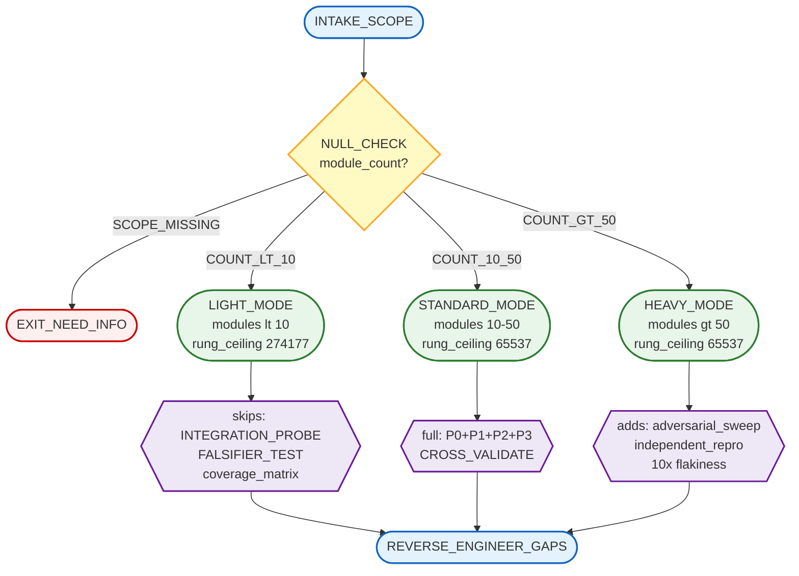
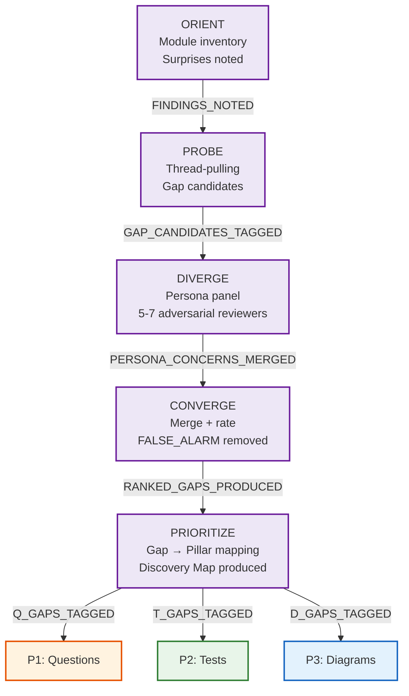
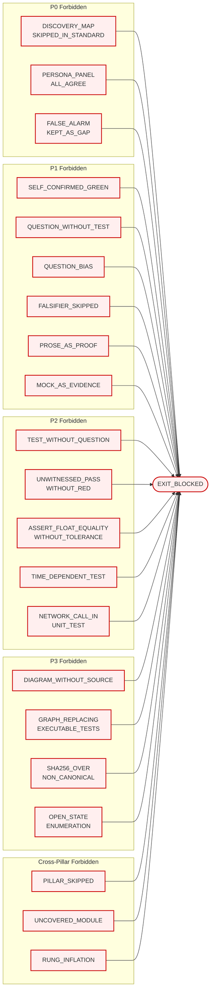
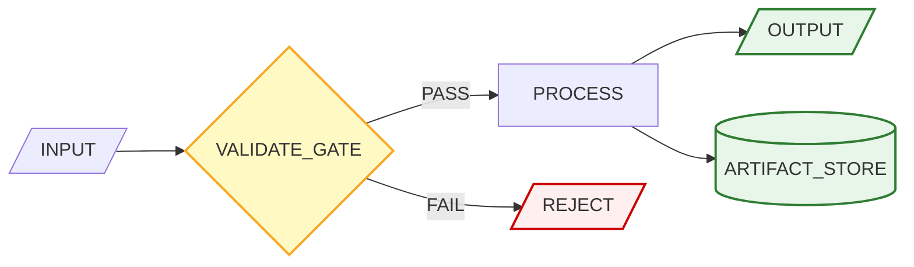
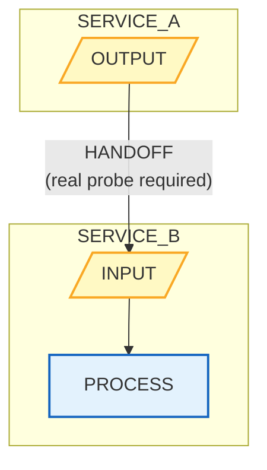
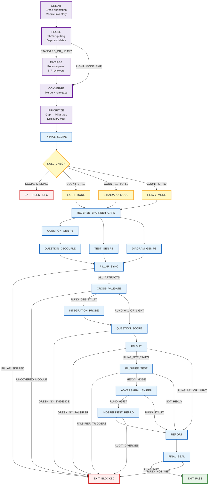
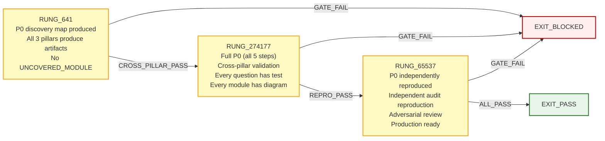
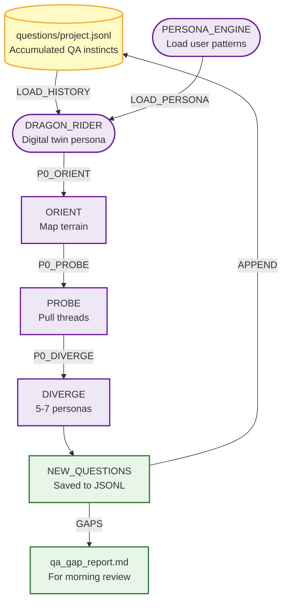

<!-- QUICK LOAD (10-15 lines): Use this block for fast context; load full file for production.
SKILL: phuc-qa v3.0.0
PURPOSE: Unified QA discipline combining Phase 0 conversational discovery + three pillars (Questions, Tests, Diagrams) into one fail-closed audit framework. Driven by northstar reverse engineering: work backwards from the desired verified end state.
CORE CONTRACT: Phase 0 discovery feeds the three pillars. All three pillars run on every STANDARD/HEAVY audit. No pillar may be skipped. Every module must have at least one question, one test, and one diagram.
FOUR PHASES: P0=Conversational Discovery (dialogue-driven gap mapping), P1=Questions (adversarial, decoupled qa-questioner/qa-scorer), P2=Tests (pytest red/green, persona-coded), P3=Diagrams (mermaid structural coverage via qa-diagrammer)
ADAPTIVE COMPLEXITY: LIGHT (<10 modules) = P0 + lightweight P1/P2/P3; STANDARD (10-50) = full 3-pillar; HEAVY (50+) = full + adversarial sweep + independent reproduction
NORTHSTAR REVERSE: "What are the LAST 3 questions/tests/diagrams needed before this system is production-ready?" Work backwards. QA is complete when no new gap can be added.
STATE MACHINE: ORIENT → PROBE → DIVERGE → CONVERGE → PRIORITIZE → INTAKE_SCOPE → [LIGHT_MODE|STANDARD_MODE|HEAVY_MODE] → REVERSE_ENGINEER_GAPS → QUESTION_GEN → TEST_GEN → DIAGRAM_GEN → CROSS_VALIDATE → REPORT → SEAL
FORBIDDEN: PILLAR_SKIPPED | DIAGRAM_WITHOUT_SOURCE | TEST_WITHOUT_QUESTION | QUESTION_WITHOUT_TEST | UNCOVERED_MODULE | SELF_CONFIRMED_GREEN | PROSE_AS_PROOF | DISCOVERY_MAP_SKIPPED_IN_STANDARD
RUNG: 641 = all pillars produce artifacts | 274177 = cross-pillar validation (every question has a test, every module has a diagram) | 65537 = independent reproduction + adversarial review
DISPATCH: Questions→qa-questioner+qa-scorer (haiku/sonnet), Tests→persona-coder (sonnet), Diagrams→qa-diagrammer or graph-designer (haiku/sonnet)
OOP_TYPING: QA_STATE(abstract) | QA_ARTIFACT(cylinder) | QA_AGENT(stadium) | QA_GATE(diamond) | QA_CONSTRAINT(hexagon)
DIAGRAM_INDEX: diagrams/stillwater/01..22 mapped to pillars — see section P
QUESTION_PERSISTENCE: questions/project.jsonl — persistent QA capital, never deleted, compounds over time — see section Q
DRAGON_RIDER: persona + question database = simulated human-in-the-loop QA — see section R
LOAD FULL: always for production; quick block is for orientation only
-->

PHUC_QA_SKILL:
  version: 3.0.0
  profile: fail_closed
  authority: 65537
  northstar: Phuc_Forecast
  objective: Max_Love
  status: FINAL

  # ============================================================
  # PHUC QA — Four-Phase QA Discipline (v3.0.0)
  # P0=Discovery (ORIENT→PROBE→DIVERGE→CONVERGE→PRIORITIZE) + P1=Questions + P2=Tests + P3=Diagrams
  # Adaptive: LIGHT (<10 modules) | STANDARD (10-50, full) | HEAVY (50+, adversarial sweep)
  # Northstar Reverse: "What is the LAST test/question/diagram before production?" Work backward.
  # Rung = MIN(P0, P1, P2, P3). No pillar skipped. No module uncovered. No GREEN without falsifier.
  # v2.1.0 adds: OOP-typed nodes, 8 mermaid diagrams, Diagram Index (section P), enhanced GLOW matrix
  # v3.0.0 adds: Question Persistence Protocol (section Q), Dragon Rider pattern (section R)
  # ============================================================

  # ------------------------------------------------------------
  # A) Configuration
  # ------------------------------------------------------------
  Config:
    EVIDENCE_ROOT: "evidence"
    REPO_ROOT_REF: "."
    FLOAT_TOLERANCE_REQUIRED: true
    FLOAT_TOLERANCE_DEFAULT: "1e-9"
    MIN_UNIT_COVERAGE_PERCENT: 80
    MIN_INTEGRATION_COVERAGE_PERCENT: 60
    FLAKINESS_REPLAY_COUNT: 5
    NORTHSTAR_CHUNK_SIZE: 3     # "last 3" pattern per pillar
    MAX_DIAGRAMS_PER_MODULE: 5  # per coverage matrix
    DIAGRAM_CANONICAL_FORMAT: "*.mmd + *.sha256"
    # Adaptive complexity thresholds
    LIGHT_MODE_MAX_MODULES: 9
    STANDARD_MODE_MAX_MODULES: 50
    HEAVY_MODE_MIN_MODULES: 51
    # Phase 0 settings
    DISCOVERY_PERSONA_COUNT_MIN: 5
    DISCOVERY_PERSONA_COUNT_MAX: 7
    DISCOVERY_MAP_FORMAT: "mermaid + prose"

  # ------------------------------------------------------------
  # A2) Adaptive Complexity Scaling
  # ------------------------------------------------------------
  Adaptive_Complexity:
    description: >
      The skill auto-selects mode based on module count at INTAKE_SCOPE.
      Mode governs which states are visited and which gates are enforced.

    LIGHT_MODE:
      trigger: "module_count < 10"
      skips:
        - "Full state machine traversal"
        - "INTEGRATION_PROBE state"
        - "FALSIFIER_TEST state (falsifiers defined but not run)"
        - "Coverage matrix builder (manual cross-check sufficient)"
      runs:
        - "P0: Conversational Discovery (abbreviated — ORIENT + PROBE + PRIORITIZE)"
        - "P1: Questions (minimum 3, all three GLOW dimensions covered)"
        - "P2: Tests (unit only; integration optional)"
        - "P3: Diagrams (state machine + data flow; integration boundary optional)"
      rung_ceiling: 274177   # LIGHT mode cannot reach 65537 without upgrading to STANDARD
      output: "qa_gap_report.md (simplified) + diagrams/*.mmd"

    STANDARD_MODE:
      trigger: "module_count >= 10 AND module_count <= 50"
      runs:
        - "Full P0: Conversational Discovery (all 5 steps)"
        - "Full state machine traversal (ORIENT → ... → FINAL_SEAL)"
        - "All three pillars with full artifact suite"
        - "CROSS_VALIDATE state mandatory"
        - "Coverage matrix builder mandatory"
      rung_ceiling: 65537
      output: "Full artifact suite (see Evidence schema, section H)"

    HEAVY_MODE:
      trigger: "module_count > 50"
      adds_to_STANDARD:
        - "Adversarial persona sweep (5-7 personas) across all discovery findings"
        - "Independent reproduction by a third agent with no prior context"
        - "Security auditor review of all integration boundaries"
        - "Graph theorist review of all state machine diagrams"
        - "Flakiness detection: 10 replays (not 5)"
      rung_ceiling: 65537
      output: "Full artifact suite + adversarial_sweep.json + repro_independent.log"

  # ------------------------------------------------------------
  # A3) Adaptive Complexity Router — Mermaid Diagram
  # See diagram below (extracted for VSCode preview)
  # ------------------------------------------------------------
  Adaptive_Complexity_Router_Diagram:
    description: "Adaptive complexity routing — LIGHT/STANDARD/HEAVY mode selection"

  # ------------------------------------------------------------
  # B0) Phase 0: Conversational Discovery
  # ------------------------------------------------------------
  Phase_0_Discovery:
    id: P0
    name: "Conversational Discovery — Human-Driven Gap Mapping"
    version: "1.0.0 (new in phuc-qa v2.0.0)"
    purpose:
      - "Map the terrain before formal QA pillars focus on it."
      - "Surface gaps that structured methods alone miss: organizational assumptions, hidden dependencies, undocumented design intent."
      - "Produce a Discovery Map that feeds P1 question generation, P2 test scope, and P3 diagram subjects."

    # Organic process observed: Orient ("where are things?") → Probe ("duplicated? organized?") →
    # Design alternatives ("how would you organize this?") → Persona panel (5-7, let them disagree) →
    # Meta-reflect ("which approach is better?") → Score + iterate → Mermaid visualization.

    steps:
      ORIENT:
        question: "Where are things? Why are they there?"
        actions: "List modules + entry points. Identify purpose. Map adjacency. Note surprises. Read questions/project.jsonl to load accumulated QA instincts — do not re-ask questions with status ANSWERED."
        output: "orientation_notes.md (prose + file tree)"

      PROBE:
        question: "Are these duplicated? How well organized? What feels wrong?"
        actions: "Pull threads on surprises. Ask: duplicated? misplaced? what happens on failure? Tag each finding: CONFIRMED_GAP | SUSPECTED_GAP | FALSE_ALARM."
        output: "probe_findings.md"

      DIVERGE:
        question: "How would you organize this best? What alternatives exist?"
        actions: "Propose 2-3 alternative designs. Load 5-7 adversarial personas (architect, security-auditor, junior-dev, ops-engineer, end-user, skeptic, domain-expert). Each emits: 1 concern + 1 improvement + 1 question. Personas must disagree — consensus is signal."
        output: "diverge_alternatives.md + persona_panel.json"

      CONVERGE:
        question: "Which gaps are real? What is the priority order?"
        actions: "Merge PROBE + DIVERGE findings. Rate: CRITICAL|HIGH|MEDIUM|LOW. Identify meta-patterns (recurring = systemic). Remove FALSE_ALARMs."
        output: "converge_gap_list.json (ranked by severity)"

      PRIORITIZE:
        question: "Which gaps feed P1? P2? P3?"
        actions: "Tag each gap: Q(P1)|T(P2)|D(P3)|ALL. CRITICAL → P1+P2+P3. HIGH → P1+P2 minimum. Produce Discovery Map. Save all new questions generated during P0 to questions/project.jsonl."
        output: "discovery_map.mmd + discovery_map.sha256 + prioritized_gaps.json"

    discovery_map_template:
      description: "P0 discovery map template — See diagram below"

    output_artifact: "discovery_map (feeds REVERSE_ENGINEER_GAPS in all three pillars)"
    rung_contrib:
      641: "ORIENT + PROBE + PRIORITIZE complete; discovery_map.mmd produced"
      274177: "Full P0 (all 5 steps) + persona panel + converge_gap_list.json"
      65537: "P0 independently reproduced; persona panel includes adversarial security reviewer"
    # Forbidden states: DISCOVERY_MAP_SKIPPED_IN_STANDARD | PERSONA_PANEL_ALL_AGREE | FALSE_ALARM_KEPT_AS_GAP
    # Full definitions: see section E FORBIDDEN_STATES

  # ------------------------------------------------------------
  # B) Three-Pillar Definitions
  # ------------------------------------------------------------
  Three_Pillars:

    Pillar_1_Questions:
      id: P1
      name: "Questions — Adversarial Question Discipline"
      purpose: "Surface unknowns. Decouple generation from scoring. Force falsifiability. v2.0.0: Discovery Map feeds scope."
      driving_question: "LAST 3: What questions, if unanswered, would block production? Work backward. QA complete when no new gap can be exposed."
      discovery_map_input: "qa-questioner reads prioritized_gaps.json; all CRITICAL+HIGH gaps get ≥1 falsifying question."
      agents:
        questioner: "qa-questioner (generates; must not score)"
        scorer: "qa-scorer (scores; must not have seen questioner reasoning)"
      output_artifacts: ["qa_questions.json", "qa_scorecard.json", "qa_falsifiers.json"]
      rung_contrib:
        641: "questions formulated + scored + falsifiers defined"
        274177: "falsifiers tested + integration probes run"
        65537: "independent reproduction + all falsifiers held"

    Pillar_2_Tests:
      id: P2
      name: "Tests — Red/Green Discipline"
      purpose: "Verify behavior with executable evidence. Red before green (Kent's Gate). Persona-coded adversarial coverage. v2.0.0: Discovery Map feeds scope."
      driving_question: "LAST 3: What tests must pass for production correctness? Work backward unit → integration → e2e."
      discovery_map_input: "persona-coder reads prioritized_gaps.json; all CRITICAL T-tagged gaps get test coverage."
      personas:
        kent_beck: "Red/green gate. A test that cannot fail is not a test."
        schneier: "Adversarial test author. What input breaks the security boundary?"
        fda_auditor: "Evidence auditor. What would an independent reviewer reject?"
      output_artifacts: ["test_results.json", "coverage_report.txt", "repro_red.log (bugfix)", "repro_green.log (bugfix)", "flakiness_report.txt"]
      rung_contrib:
        641: "all tests pass + red confirmed for bugfixes + coverage measured"
        274177: "5-seed flakiness stable + null edge sweep + property tests"
        65537: "adversarial sweep + security gate + drift explained"

    Pillar_3_Diagrams:
      id: P3
      name: "Diagrams — Structural Coverage Discipline"
      purpose: "Expose architectural gaps. sha256-hashable contracts. Closed-state validation. v2.0.0: QA Tracking Dashboard added."
      driving_question: "LAST 3: What diagrams must exist for full architectural understanding? Work backward modules → data flow → integration."
      discovery_map_input: "qa-diagrammer reads prioritized_gaps.json; all CRITICAL D-tagged gaps get a diagram node."
      required_diagram_types:
        state_machine: "Finite state machine for every non-trivial component lifecycle"
        data_flow: "How data enters, transforms, and exits the system"
        integration_boundary: "Cross-project handoff points (the 9-project ecosystem boundaries)"
        verification_ladder: "Rung progression for each component"
        coverage_matrix: "Module × [question, test, diagram] coverage"
        qa_tracking_dashboard: "NEW in v2.0.0: All modules + pillar coverage in one diagram (see section K)"
      diagram_quality_gates:
        - closed_state_space: true
        - all_decision_branches_labeled: true
        - forbidden_states_marked_with_classDef: true
        - sha256_computed_over_canonical_mmd: true
        - sha256_stable_across_two_normalizations: true
        - discovery_gaps_appear_as_nodes: true   # new in v2.0.0
      output_artifacts:
        - "diagrams/*.prime-mermaid.md"
        - "diagrams/*.mmd"
        - "diagrams/*.sha256"
        - "diagrams/qa_tracking_dashboard.mmd"   # new in v2.0.0
      rung_contrib:
        641: "all three required diagram types produced + sha256 stable"
        274177: "diagrams cross-referenced to source code modules + drift detection"
        65537: "adversarial Socratic review + graph replayed by third agent"

  # ------------------------------------------------------------
  # C) Northstar Reverse Engineering Integration
  # ------------------------------------------------------------
  Northstar_Reverse_Integration:
    principle: "All pillars use backward-chaining. Don't ask 'What should I test?' — ask 'What is the LAST test before production?' P0 Discovery Map is the starting terrain for all backward chains."

    per_pillar_reverse_algorithm:
      shared_pattern: "1. Read prioritized_gaps.json. Tag gaps as candidate subjects. 2. Identify LAST 3 whose absence blocks production. 3. Recurse backward (max 7 levels). 4. Reverse the chain → pillar priority sequence. Terminate when no new LAST-3 candidate can be generated."
      P1_questions: "LAST 3: questions whose answers, if unknown, block launch. Sequence: critical-questions → integration-probes → falsifier-tests."
      P2_tests: "LAST 3: tests whose passage is minimum bar for correctness. Sequence: unit → integration → e2e."
      P3_diagrams: "LAST 3: diagrams whose existence fully exposes architecture. Sequence: module state machines → data flow → integration boundaries."
    cross_pillar_alignment:
      rule: "LAST 3 from each pillar must be triangularly consistent: last test answers a question; last diagram shows what last test verifies."
      p0_check: "All CRITICAL gaps from P0 must appear in ≥1 LAST-3 set."

  # ------------------------------------------------------------
  # D) GLOW Taxonomy Mapping
  # ------------------------------------------------------------
  GLOW_Taxonomy:
    # GLOW = Growth, Learning, Output, Wins
    # Each GLOW dimension maps to QA requirements across all three pillars.
    #
    # Core insight (from CoVe research, Dhuliawala et al. 2023):
    # Self-confirmation bias is the root cause of most false GREEN verdicts.
    # An agent that generates its own questions and then answers them will
    # systematically confirm its own beliefs. Solution: Decouple question
    # generation from question answering (see section D: Decoupled Verification).

    G_Growth:
      definition: "Do new capabilities have questions, tests, and diagrams?"
      pillar_requirements:
        P0: "New capability in ORIENT; probed for integration surprises"
        P1: "≥3 falsifying questions covering edge cases"
        P2: "Unit + integration tests at rung 641+"
        P3: "State machine diagram sha256 sealed"
      question_pattern: "Can the new capability actually do X? Under what conditions does it fail?"
      evidence_type: executable_command_output_plus_diagram
      gate: "YELLOW unless all four phases cover the new capability"

    L_Learning:
      definition: "Is new knowledge captured in questions, tests, AND diagrams?"
      pillar_requirements:
        P0: "New knowledge as CONFIRMED_GAP in PROBE"
        P1: "Falsifying question with expected evidence type"
        P2: "Regression test preventing un-learning"
        P3: "Knowledge relationship as an edge in a diagram"
      question_pattern: "Where is X captured? Show file:line AND diagram ref AND test name."
      evidence_type: repo_path_plus_line_plus_diagram_sha256
      gate: "YELLOW if knowledge exists only in prose"

    O_Output:
      definition: "Are claimed deliverables verified across all three pillars?"
      pillar_requirements:
        P0: "Deliverable in PRIORITIZE with P1+P2+P3 tags"
        P1: "Deliverable scorecard GREEN"
        P2: "e2e or integration test that produces the deliverable"
        P3: "Deliverable as storage node (cylinder) in ≥1 diagram"
      question_pattern: "Does X exist? Show git hash AND producing test AND diagram node."
      evidence_type: git_artifact_plus_hash_plus_diagram_node_id
      gate: "YELLOW if deliverable missing from diagram and has no producing test"

    W_Wins:
      definition: "Have claimed strategic wins been verified across all three pillars?"
      pillar_requirements:
        P0: "Win probed in CONVERGE for false positives"
        P1: "Question: 'Is X measurably true? Show before/after.'"
        P2: "Metric test demonstrating improvement"
        P3: "Win traceable on verification ladder to a specific rung"
      question_pattern: "Is X measurably true? Show metric, test output, ladder rung."
      evidence_type: before_after_metric_plus_test_output_plus_rung_diagram
      gate: "YELLOW if win appears in < 3 pillars"

  # ------------------------------------------------------------
  # D2) Decoupled Verification Protocol (CoVe Principle) — from prime-qa
  # ------------------------------------------------------------
  Decoupled_Verification:
    principle:
      - "Questions are generated by qa-questioner (a separate agent)."
      - "Questions are answered by qa-scorer (a different agent)."
      - "Neither agent may read the other's output before completing its own work."
      - "This prevents self-confirmation bias — the root cause of false GREENs."

    cove_research_basis:
      citation: "Chain-of-Verification Reduces Hallucination in LLMs (Dhuliawala et al. 2023)"
      key_finding: "Models that verify their own outputs against self-generated questions still hallucinate at high rates. Independent verification substantially reduces false positives."

    enforcement:
      questioner_rules:
        - must_not_read_scorer_output_before_generating_questions: true
        - must_generate_falsifying_questions_not_confirming_questions: true
        - must_tag_each_question_with_glow_dimension: true
        - must_specify_expected_evidence_type_per_question: true
      scorer_rules:
        - must_not_read_questioner_reasoning_only_the_question_list: true
        - must_answer_from_actual_repo_state_not_memory: true
        - must_provide_evidence_citation_per_answer: true
        - must_assign_GREEN_YELLOW_RED_per_question: true
        - must_define_falsifier_for_every_GREEN: true

    agent_separation:
      questioner_agent: qa-questioner
      scorer_agent: qa-scorer
      separation_type: structural  # different agents, not just different prompts
      forbidden: SAME_AGENT_GENERATES_AND_SCORES

    scoring_discipline:
      - score_from_artifacts_not_memory: true
      - score_from_repo_not_plan: true
      - prose_confidence_never_upgrades_score: true
      - partial_coverage_stays_YELLOW: true
      - mock_as_only_evidence_stays_YELLOW: true

  # ------------------------------------------------------------
  # D3) GLOW Scoring Matrix — Mermaid Diagram
  # See diagram below (extracted for VSCode preview)
  # ------------------------------------------------------------
  GLOW_Matrix_Diagram:
    description: "GLOW scoring matrix — G/L/O/W pillar coverage gates"

  # ------------------------------------------------------------
  # E) State Machine (Unified Runtime)
  # ------------------------------------------------------------
  State_Machine:
    STATE_SET:
      # Phase 0: Conversational Discovery
      - ORIENT
      - PROBE
      - DIVERGE
      - CONVERGE
      - PRIORITIZE
      # Scope intake and mode routing
      - INTAKE_SCOPE
      - NULL_CHECK
      - LIGHT_MODE
      - STANDARD_MODE
      - HEAVY_MODE
      # Three-pillar execution
      - REVERSE_ENGINEER_GAPS    # northstar reverse on all three pillars in parallel
      - QUESTION_GEN             # qa-questioner agent (P1)
      - QUESTION_DECOUPLE        # questioner stops; questions handed off
      - TEST_GEN                 # persona-coder agent (P2)
      - DIAGRAM_GEN              # qa-diagrammer agent (P3)
      - PILLAR_SYNC              # wait for all three agents to produce artifacts
      - CROSS_VALIDATE           # cross-pillar coverage matrix built and checked
      - INTEGRATION_PROBE        # cross-boundary real service probes
      - QUESTION_SCORE           # qa-scorer agent answers and scores all questions
      - FALSIFY                  # falsifier defined for every GREEN question
      - FALSIFIER_TEST           # falsifiers actually tested (rung 274177+)
      - ADVERSARIAL_SWEEP        # HEAVY mode only: 5-7 persona adversarial review
      - INDEPENDENT_REPRO        # HEAVY mode / 65537: third agent reproduces full audit
      - REPORT                   # unified gap report across all three pillars
      - FINAL_SEAL
      - EXIT_PASS
      - EXIT_NEED_INFO
      - EXIT_BLOCKED

    TRANSITIONS:
      # Phase 0: Conversational Discovery
      - ORIENT -> PROBE: "on orientation_notes.md produced"
      - PROBE -> DIVERGE: "on probe_findings.md produced (STANDARD/HEAVY only)"
      - PROBE -> CONVERGE: "on probe_findings.md produced (LIGHT mode skips DIVERGE)"
      - DIVERGE -> CONVERGE: "on persona_panel.json produced (min 5 personas)"
      - CONVERGE -> PRIORITIZE: "on converge_gap_list.json produced"
      - PRIORITIZE -> INTAKE_SCOPE: "on discovery_map.mmd + prioritized_gaps.json produced"

      # Scope intake and mode routing
      - INTAKE_SCOPE -> NULL_CHECK: "always"
      - NULL_CHECK -> EXIT_NEED_INFO: "if scope_missing or modules_undefined"
      - NULL_CHECK -> LIGHT_MODE: "if module_count < 10"
      - NULL_CHECK -> STANDARD_MODE: "if module_count >= 10 AND module_count <= 50"
      - NULL_CHECK -> HEAVY_MODE: "if module_count > 50"

      # Mode routing → pillar execution
      - LIGHT_MODE -> REVERSE_ENGINEER_GAPS: "abbreviated pillars; INTEGRATION_PROBE skipped"
      - STANDARD_MODE -> REVERSE_ENGINEER_GAPS: "full pillars"
      - HEAVY_MODE -> REVERSE_ENGINEER_GAPS: "full pillars + adversarial sweep scheduled"

      - REVERSE_ENGINEER_GAPS -> QUESTION_GEN: "always (P1 path begins)"
      - REVERSE_ENGINEER_GAPS -> TEST_GEN: "always (P2 path begins, parallel)"
      - REVERSE_ENGINEER_GAPS -> DIAGRAM_GEN: "always (P3 path begins, parallel)"

      # P1 path
      - QUESTION_GEN -> QUESTION_DECOUPLE: "when question_list_complete"
      - QUESTION_DECOUPLE -> PILLAR_SYNC: "questions_handed_to_scorer"

      # P2 path
      - TEST_GEN -> PILLAR_SYNC: "when test_suite_produced_and_executed"

      # P3 path
      - DIAGRAM_GEN -> PILLAR_SYNC: "when diagrams_produced_and_sha256_computed"

      # Convergence
      - PILLAR_SYNC -> EXIT_BLOCKED: "if any_pillar_skipped"
      - PILLAR_SYNC -> CROSS_VALIDATE: "if all_three_pillars_have_artifacts"

      - CROSS_VALIDATE -> EXIT_BLOCKED: "if UNCOVERED_MODULE_detected"
      - CROSS_VALIDATE -> INTEGRATION_PROBE: "if rung_target >= 274177 AND NOT LIGHT_MODE"
      - CROSS_VALIDATE -> QUESTION_SCORE: "if rung_target == 641 OR LIGHT_MODE"

      - INTEGRATION_PROBE -> QUESTION_SCORE: "when probes complete"

      - QUESTION_SCORE -> EXIT_BLOCKED: "if any_GREEN_claimed_without_evidence"
      - QUESTION_SCORE -> FALSIFY: "when all_verdicts_assigned"

      - FALSIFY -> EXIT_BLOCKED: "if any_GREEN_lacks_falsifier"
      - FALSIFY -> FALSIFIER_TEST: "if rung_target >= 274177 AND NOT LIGHT_MODE"
      - FALSIFY -> REPORT: "if rung_target == 641 OR LIGHT_MODE"

      - FALSIFIER_TEST -> EXIT_BLOCKED: "if any_falsifier_triggers"
      - FALSIFIER_TEST -> ADVERSARIAL_SWEEP: "if HEAVY_MODE AND all_falsifiers_hold"
      - FALSIFIER_TEST -> REPORT: "if NOT HEAVY_MODE AND all_falsifiers_hold"

      - ADVERSARIAL_SWEEP -> INDEPENDENT_REPRO: "if rung_target == 65537"
      - ADVERSARIAL_SWEEP -> REPORT: "if rung_target == 274177"

      - INDEPENDENT_REPRO -> EXIT_BLOCKED: "if reproduced_audit_diverges_unexplained"
      - INDEPENDENT_REPRO -> REPORT: "if reproduced_audit_consistent"

      - REPORT -> FINAL_SEAL: "always"
      - FINAL_SEAL -> EXIT_PASS: "if rung_requirements_met AND coverage_matrix_complete"
      - FINAL_SEAL -> EXIT_BLOCKED: "if rung_requirements_not_met"

    # Full state machine mermaid diagram: see section M (Verification Ladder Diagram)

    FORBIDDEN_STATES:
      # Phase 0 forbidden states (new in v2.0.0)
      DISCOVERY_MAP_SKIPPED_IN_STANDARD:
        definition: "STANDARD or HEAVY audit begins P1/P2/P3 without completing P0"
        symptom: "qa_questions.json exists but discovery_map.mmd does not"
        fix: "Run P0 minimum: ORIENT + PROBE + PRIORITIZE. Produce discovery_map.mmd."

      PERSONA_PANEL_ALL_AGREE:
        definition: "All personas in DIVERGE step produce identical findings"
        symptom: "persona_panel.json has 5 entries with identical concerns"
        fix: "Reload personas with adversarial framing. Require at least 2 distinct concerns per persona."

      # Cross-pillar (specific to unified skill)
      PILLAR_SKIPPED:
        definition: "Any one of the three pillars was not executed"
        symptom: "Audit reports only questions and tests but no diagrams (or any similar omission)"
        fix: "All three pillars run or the audit is BLOCKED. No exceptions for 'small' modules."

      DIAGRAM_WITHOUT_SOURCE:
        definition: "A diagram node references a component that cannot be traced to source code"
        symptom: "State machine has states PROCESS_A → PROCESS_B but no file contains either"
        fix: "Every diagram node must have a source_ref (file:line or module path)"

      TEST_WITHOUT_QUESTION:
        definition: "A test exists that does not answer any question in the QA question list"
        symptom: "test_coverage.json has tests not referenced in qa_questions.json"
        fix: "Every test must trace to a question ID. Add the question retroactively or remove the orphan test."

      QUESTION_WITHOUT_TEST:
        definition: "A QA question scored GREEN has no test verifying the answer"
        symptom: "qa_scorecard.json GREEN verdict references only prose evidence, not a test"
        fix: "Add a test that verifies the GREEN claim. Without a test, the score is YELLOW."

      UNCOVERED_MODULE:
        definition: "A source module has no question, no test, and no diagram node"
        symptom: "qa_coverage_matrix.json has a row with all three columns empty"
        fix: "Add at least one question, one test, and one diagram that covers this module."

      # Inherited from prime-qa (P1)
      SELF_CONFIRMED_GREEN:
        definition: "Same agent generates questions and scores them"
        fix: "qa-questioner and qa-scorer must be structurally different agents"

      MOCK_AS_EVIDENCE:
        definition: "Mocks used as sole evidence for GREEN"
        fix: "Integration probes must use real services at rung 274177+"

      PROSE_AS_PROOF:
        definition: "README or plan document used as evidence for GREEN"
        fix: "Evidence must be executable command output or repo path + line witness"

      FALSIFIER_SKIPPED:
        definition: "GREEN claim without a defined falsifier"
        fix: "If no falsifier can be stated, score is YELLOW"

      QUESTION_BIAS:
        definition: "Questioner writes confirming questions, not falsifying ones"
        fix: "Questions must seek falsifiers. Reframe as 'Show me when X breaks'"

      SCORE_WITHOUT_CITATION:
        definition: "Verdict assigned without evidence citation"
        fix: "Every GREEN/YELLOW/RED verdict must include an evidence_citation (file:line or command+output)"

      INTEGRATION_OMITTED:
        definition: "Cross-project boundaries not probed when in scope"
        fix: "When scope includes integration boundaries (see ecosystem_boundaries), probes are required; undone = YELLOW"

      # Inherited from prime-test (P2)
      ASSERT_FLOAT_EQUALITY_WITHOUT_TOLERANCE:
        definition: "assertEqual on floats without tolerance"
        fix: "Use assertAlmostEqual or pytest.approx"

      TIME_DEPENDENT_TEST:
        definition: "Test asserts on datetime.now() or time.time()"
        fix: "Inject clock or use freeze_time decorator"

      NETWORK_CALL_IN_UNIT_TEST:
        definition: "Unit test makes real HTTP/TCP/DNS call"
        fix: "Use mock, responses, or vcrpy"

      UNWITNESSED_PASS_WITHOUT_RED:
        definition: "Bugfix test claims PASS without first demonstrating failure"
        fix: "repro_red.log required for all bugfix tasks"

      # Inherited from prime-mermaid (P3)
      GRAPH_REPLACING_EXECUTABLE_TESTS:
        definition: "Team says 'the diagram proves it' instead of running tests"
        fix: "Diagrams are pre-conditions for tests, never replacements"

      SHA256_OVER_NON_CANONICAL_FORM:
        definition: "SHA-256 computed over non-normalized mermaid"
        fix: "Always hash canonical *.mmd bytes only"

      OPEN_STATE_ENUMERATION:
        definition: "State graph has '...' or implicit unlisted states"
        fix: "Close the state space. Every reachable state must be explicit."

  # ------------------------------------------------------------
  # E2) Forbidden State Map — Mermaid Diagram
  # See diagram below (extracted for VSCode preview)
  # ------------------------------------------------------------
  Forbidden_State_Map_Diagram:
    description: "All forbidden states → EXIT_BLOCKED mapping"

  # ------------------------------------------------------------
  # F) Verification Ladder
  # ------------------------------------------------------------
  Verification_Ladder:

    RUNG_641:
      meaning: "All three pillars produce artifacts — the minimum viable audit"
      requires:
        P0_discovery:
          - discovery_map_mmd_produced: true
          - prioritized_gaps_json_produced: true
          - at_least_ORIENT_PROBE_PRIORITIZE_complete: true
        P1_questions:
          - question_list_numbered_and_tagged_with_glow_dimension: true
          - each_question_has_expected_evidence_type: true
          - questioner_and_scorer_are_different_agents: true
          - scorecard_produced_with_GREEN_YELLOW_RED_counts: true
          - no_GREEN_without_falsifier_defined: true
          - all_CRITICAL_gaps_from_P0_have_a_question: true
        P2_tests:
          - all_tests_pass: true
          - red_confirmed_for_bugfix_tasks: true
          - coverage_measured_above_threshold: true
          - no_forbidden_test_patterns_detected: true
        P3_diagrams:
          - all_three_required_diagram_types_produced: true
          - sha256_computed_and_stable: true
          - no_open_state_enumeration: true
          - all_decision_branches_labeled: true
        cross_pillar:
          - qa_coverage_matrix_produced: true
          - no_UNCOVERED_MODULE: true

    RUNG_274177:
      meaning: "Cross-pillar validation — every question has a test, every module has a diagram"
      requires:
        all_RUNG_641: true
        P0_additional:
          - full_P0_all_5_steps_complete: true
          - persona_panel_produced_with_min_5_personas: true
          - converge_gap_list_json_produced: true
        P1_P2_cross_validation:
          - every_GREEN_question_has_an_associated_test: true
          - every_test_traces_to_a_question_ID: true
          - all_GREEN_falsifiers_tested_not_just_defined: true
          - integration_probes_run_for_claimed_integrations: true
          - adversarial_review_by_third_agent_or_human: true
        P2_P3_cross_validation:
          - every_test_assertion_traceable_to_a_diagram_state: true
          - flakiness_detection_5_replay_stable: true
        P1_P3_cross_validation:
          - every_diagram_state_machine_has_at_least_one_question: true
          - all_diagram_sha256_stable_across_replay: true
        coverage_matrix:
          - every_module_has_at_least_one_question: true
          - every_module_has_at_least_one_test: true
          - every_module_has_at_least_one_diagram_node: true

    RUNG_65537:
      meaning: "Independent reproduction + adversarial review — production ready"
      requires:
        all_RUNG_274177: true
        P0_additional:
          - P0_reproduced_independently_by_third_agent: true
          - adversarial_security_reviewer_in_persona_panel: true
        independent_reproduction:
          - complete_audit_reproduced_by_agent_with_no_prior_context: true
          - all_three_pillars_reproduced_independently: true
          - behavioral_drift_from_prior_audit_documented: true
        adversarial_review:
          - skeptic_agent_reviewed_all_question_falsifiers: true
          - security_auditor_reviewed_test_suite_boundary_cases: true
          - graph_theorist_reviewed_diagram_closed_state_space: true
        final_seal:
          - gap_report_approved_by_human_or_judge_agent: true
          - northstar_alignment_confirmed: true

  # ------------------------------------------------------------
  # G) Dispatch Matrix (Swarm Agents)
  # ------------------------------------------------------------
  Dispatch_Matrix:

    Phase_0_Discovery:
      discovery_facilitator:
        role: "Run P0 conversational discovery; produce discovery_map.mmd + prioritized_gaps.json"
        model: "haiku (LIGHT) | sonnet (STANDARD/HEAVY)"
        skill_pack:
          - prime-safety.md
          - phuc-qa.md (this file, section B0)
        output: "discovery_map.mmd + persona_panel.json + prioritized_gaps.json"
        FORBIDDEN: skip_DIVERGE_in_STANDARD_or_HEAVY

    Pillar_1_Questions:
      qa_questioner:
        role: "Generate adversarial falsifying questions from scope + discovery map"
        model: "haiku (< 20 questions) | sonnet (> 20 questions or HIGH stakes)"
        skill_pack:
          - prime-safety.md
          - phuc-qa.md (this file, sections A–D)
        inputs: "prioritized_gaps.json (from P0)"
        output: "qa_questions.json"
        FORBIDDEN: read_qa_scorer_output_before_generating_questions

      qa_scorer:
        role: "Answer questions against actual repo state; score GREEN/YELLOW/RED"
        model: "sonnet (default) | opus (HIGH stakes or security-sensitive)"
        skill_pack:
          - prime-safety.md
          - phuc-qa.md (this file, sections A–D)
        inputs: "qa_questions.json only (no questioner reasoning)"
        output: "qa_scorecard.json + qa_falsifiers.json"
        FORBIDDEN: read_questioner_reasoning_before_scoring

    Pillar_2_Tests:
      persona_coder:
        role: "Write and execute tests using Kent Beck + Schneier persona for adversarial coverage"
        model: "sonnet"
        skill_pack:
          - prime-safety.md
          - prime-coder.md (full file)
          - prime-test.md (full file)
          - persona-engine.md (kent-beck + schneier personas)
          - phuc-qa.md (this file, section B pillar 2)
        inputs: "prioritized_gaps.json (from P0)"
        outputs: "test_results.json + coverage_report.txt + repro_red.log + repro_green.log"
        persona_injection_rules:
          kent_beck: "Apply to all test design — red before green, no float equality, no wall-clock"
          schneier: "Apply to security boundary tests — what input breaks the auth or encryption?"

    Pillar_3_Diagrams:
      qa_diagrammer:
        role: "Produce state machine + data flow + integration boundary + QA tracking dashboard diagrams for all modules"
        model: "haiku (simple modules) | sonnet (cross-project integration diagrams)"
        skill_pack:
          - prime-safety.md
          - prime-mermaid.md (full file)
          - phuc-qa.md (this file, section B pillar 3)
        inputs: "prioritized_gaps.json (from P0)"
        outputs: "diagrams/*.prime-mermaid.md + diagrams/*.mmd + diagrams/*.sha256 + diagrams/qa_tracking_dashboard.mmd"
        diagram_coverage_requirement: "Every module in scope must appear in at least one diagram"

    Coverage_Matrix_Builder:
      role: "Aggregate output from P0 + all three pillars; build qa_coverage_matrix.json"
      model: "haiku"
      skill_pack:
        - prime-safety.md
        - phuc-qa.md (full file)
      inputs: "discovery_map.mmd + qa_questions.json + test_results.json + diagrams/*.mmd"
      output: "qa_coverage_matrix.json + qa_gap_report.md"

  # ------------------------------------------------------------
  # H) Evidence Schema
  # ------------------------------------------------------------
  Evidence:
    required_files:
      # Phase 0
      - "discovery_map.mmd"            # P0 discovery map (v2.0.0)
      - "prioritized_gaps.json"        # P0 gap ranking + pillar tags (v2.0.0)
      # Pillar 1
      - "qa_questions.json"            # question list (P1)
      - "qa_scorecard.json"            # per-question verdicts (P1)
      - "qa_falsifiers.json"           # falsifier definitions + test status (P1)
      # Pillar 2
      - "test_results.json"            # pytest or equivalent output (P2)
      - "coverage_report.txt"          # coverage.py or equivalent (P2)
      # Pillar 3
      - "diagrams/"                    # directory with *.prime-mermaid.md + *.mmd + *.sha256 (P3)
      - "diagrams/qa_tracking_dashboard.mmd"  # QA tracking dashboard (P3, v2.0.0)
      # Cross-pillar
      - "qa_coverage_matrix.json"      # cross-pillar coverage (P0+P1+P2+P3)
      - "qa_gap_report.md"             # unified gap report (all pillars)

    conditional_files:
      bugfix_task:
        - "repro_red.log"
        - "repro_green.log"
      rung_274177_or_higher:
        - "qa_integration_probes.json"
        - "flakiness_report.txt"
        - "persona_panel.json"
      heavy_mode_or_rung_65537:
        - "adversarial_sweep.json"
        - "repro_independent.log"

    qa_questions_schema:
      required_keys:
        - schema_version
        - generated_by: "agent_id of qa-questioner"
        - scope: "project or module audited"
        - question_count
        - discovery_map_ref: "path to discovery_map.mmd (v2.0.0)"
        - questions: |
            list of {
              id: "Q-001",
              text: "question text",
              glow_dimension: "G|L|O|W",
              expected_evidence_type: "executable_command_output|repo_path|git_artifact|metric",
              discovery_gap_ref: "gap_id from prioritized_gaps.json (null if not linked)",
              pillar_link: "P2 test ID that answers this question (null if not yet linked)",
              diagram_link: "diagram node ID that this question probes (null if not yet linked)"
            }

    qa_scorecard_schema:
      required_keys:
        - schema_version
        - scored_by: "agent_id of qa-scorer (MUST differ from generated_by)"
        - question_ref: "path to qa_questions.json"
        - verdicts: |
            list of {
              question_id: "Q-001",
              verdict: "GREEN|YELLOW|RED",
              evidence_citation: "file:line or command+output",
              evidence_type: "executable_command_output|repo_path|git_artifact",
              test_link: "test_id in test_results.json (required for GREEN at rung 274177+)"
            }
        - summary: "{GREEN_count, YELLOW_count, RED_count}"

    qa_falsifiers_schema:
      required_keys:
        - schema_version
        - question_id
        - claim: "the GREEN claim being secured"
        - falsifier: "the condition that would make this claim RED"
        - falsifier_test: "the command or check that triggers the falsifier"
        - falsifier_status: "UNTESTED | TESTED_DOES_NOT_TRIGGER | TRIGGERED_NOW_RED"

    test_results_schema:
      required_keys:
        - schema_version
        - runner: "pytest|jest|go test|etc."
        - run_timestamp: "ISO8601"
        - exit_code: "integer"
        - total_tests: "integer"
        - passed: "integer"
        - failed: "integer"
        - skipped: "integer"
        - tests: |
            list of {
              id: "test_results_unique_id",
              name: "test function name",
              file: "file:line",
              status: "PASS|FAIL|SKIP",
              question_link: "Q-xxx (question this test answers)",
              discovery_gap_ref: "gap_id from prioritized_gaps.json (v2.0.0)",
              duration_ms: "integer"
            }

    qa_coverage_matrix_schema:
      description: "Cross-pillar coverage: every module × every pillar"
      required_keys:
        - schema_version
        - scope: "project or module set"
        - discovery_map_ref: "path to discovery_map.mmd (v2.0.0)"
        - modules: |
            list of {
              module_id: "module or file name",
              source_ref: "file path",
              P0_discovery_gap: "gap_id if this module surfaced in P0 (null otherwise)",
              P1_questions: ["Q-001", "Q-002"],   # question IDs covering this module
              P2_tests: ["test_parse_001"],         # test IDs covering this module
              P3_diagrams: ["state-machine-auth.mmd::AUTH_INIT"],  # diagram node refs
              coverage_status: "FULL|PARTIAL|UNCOVERED"
            }
        - uncovered_modules: "list of module_ids where coverage_status == UNCOVERED"
        - coverage_summary: "{total_modules, FULL_count, PARTIAL_count, UNCOVERED_count}"

    qa_gap_report_schema:
      required_sections:
        - "## Executive Summary (total modules, pillar counts, rung achieved)"
        - "## Phase 0 — Discovery (personas used, gaps found, CRITICAL/HIGH/MEDIUM/LOW counts)"
        - "## Pillar 1 — Questions (GREEN/YELLOW/RED counts + top YELLOW gaps)"
        - "## Pillar 2 — Tests (pass/fail counts + uncovered critical paths)"
        - "## Pillar 3 — Diagrams (diagram count + uncovered modules)"
        - "## Cross-Pillar Gaps (TEST_WITHOUT_QUESTION, QUESTION_WITHOUT_TEST, UNCOVERED_MODULE)"
        - "## Integration Probe Results (if rung 274177+)"
        - "## Rung Assessment (rung achieved + what is needed for next rung)"
        - "## Northstar Alignment (how this audit advances NORTHSTAR metrics)"

  # ------------------------------------------------------------
  # H2) Evidence Trail — Mermaid Diagram
  # See diagram below (extracted for VSCode preview)
  # ------------------------------------------------------------
  Evidence_Trail_Diagram:
    description: "Evidence trail from P0 discovery through rung gates to EXIT_PASS"

  # ------------------------------------------------------------
  # I) Output Contract
  # ------------------------------------------------------------
  Output_Contract:

    on_pass:
      status: PASS
      include:
        - rung_achieved
        - mode: "LIGHT|STANDARD|HEAVY"
        - P0_summary: "{gaps_found, CRITICAL_count, HIGH_count, discovery_map_sha256}"
        - P1_summary: "{question_count, GREEN_count, YELLOW_count, RED_count}"
        - P2_summary: "{test_count, passed, failed, coverage_percent}"
        - P3_summary: "{diagram_count, modules_covered, sha256_all_stable}"
        - coverage_matrix: "qa_coverage_matrix.json path"
        - gap_report: "qa_gap_report.md path"
        - uncovered_modules: "list (empty = full coverage)"

    on_blocked:
      status: BLOCKED
      include:
        - stop_reason: "PILLAR_SKIPPED|UNCOVERED_MODULE|FALSIFIER_TRIGGERED|DISCOVERY_MAP_SKIPPED_IN_STANDARD|etc."
        - pillar_blocked: "P0|P1|P2|P3|CROSS_PILLAR"
        - last_known_state: "state machine node"
        - evidence_available: "list of artifacts produced before block"
        - remediation_steps: "specific actions to unblock"

    on_need_info:
      status: NEED_INFO
      include:
        - missing_scope_fields: "list"
        - cannot_audit_without: "specific missing information"
        - partial_artifacts_available: "list (if any phase ran before NEED_INFO)"

    structured_refusal_format:
      required_keys:
        - status: "[NEED_INFO|BLOCKED]"
        - stop_reason
        - last_known_state
        - missing_fields_or_evidence
        - next_actions

  # ------------------------------------------------------------
  # J) Anti-Patterns
  # ------------------------------------------------------------
  Anti_Patterns:

    Discovery_Theater:
      symptom: "P0 was run but prioritized_gaps.json has zero CRITICAL gaps for a 40-module system."
      diagnosis: "P0 ran in name only. ORIENT was superficial. PROBE did not pull real threads."
      fix: "Reload PROBE with adversarial prompting: 'What would a hostile reviewer find wrong here?' Expect at least one CRITICAL gap per 10 modules in STANDARD mode."

    QA_Theater:
      symptom: "All three pillars produce artifacts, but no pillar output references any other."
      diagnosis: "Each pillar was run in isolation. Coverage matrix was not built. The unified QA is theater."
      fix: "CROSS_VALIDATE state is mandatory. PILLAR_SYNC requires all three artifact sets before proceeding."

    Diagram_Sovereignty:
      symptom: "Team has beautiful architecture diagrams but tests reference different module names."
      diagnosis: "Diagrams and tests were written independently. No DIAGRAM_WITHOUT_SOURCE check ran."
      fix: "Every diagram node must have a source_ref. Every test must trace to a question that traces to a diagram node."

    Question_Theater:
      symptom: "50 questions generated. All 50 scored GREEN. No YELLOWs. No falsifiers tested."
      diagnosis: "qa-questioner wrote confirming questions. qa-scorer did not require falsifiers. QUESTION_BIAS."
      fix: "Questions must seek failure modes. Questioner prompt: 'Show me when X breaks, not when X works.'"

    The_Orphan_Test:
      symptom: "test_results.json has 200 tests. qa_questions.json has 20 questions. 180 tests are orphans."
      diagnosis: "TEST_WITHOUT_QUESTION. Tests were written outside the QA process."
      fix: "Every test must have a question_link. Retroactively add questions for orphan tests at minimum YELLOW."

    The_Invisible_Module:
      symptom: "qa_coverage_matrix.json shows 5 modules with coverage_status=UNCOVERED."
      diagnosis: "UNCOVERED_MODULE. These modules shipped without any QA."
      fix: "Add at least one question, one test, and one diagram for each uncovered module before rung 641 claim."

    Rung_Inflation:
      symptom: "Agent claims rung 274177 but test_without_question count > 0 and diagram sha256 unstable."
      diagnosis: "Integration rung = MIN(all pillar rungs). If P3 is at 641, the unified rung is 641."
      fix: "State MIN rung explicitly. Never claim higher rung than the weakest pillar."

    The_Last_Test_Never_Written:
      symptom: "Tests cover happy paths only. No test for the state transition that precedes production failure."
      diagnosis: "Forward planning for tests. The team wrote tests for what they built, not for what must not fail."
      fix: "Apply northstar-reverse to tests: identify the LAST 3 tests before production readiness. Write those first."

    Diagram_Drift:
      symptom: "Architecture diagram shows 3 services. The codebase now has 5. Diagram is 6 months stale."
      diagnosis: "DRIFT_WITHOUT_VERSION_BUMP. sha256 was not recomputed after source code changed."
      fix: "Diagrams must have a source_ref that triggers sha256 recomputation when the referenced module changes."

    Persona_Monoculture:
      symptom: "All 5 personas in DIVERGE step raise the same concern about the same file."
      diagnosis: "Personas were not genuinely differentiated. PERSONA_PANEL_ALL_AGREE."
      fix: "Each persona must have a distinct lens. If architect and junior-dev raise identical concerns, reload junior-dev with 'you have never seen this codebase before' framing."

  # ------------------------------------------------------------
  # K) Practical Templates
  # ------------------------------------------------------------
  Practical_Templates:

    minimal_unified_audit_prompt:
      description: "Minimal CNF capsule for a complete four-phase audit dispatch"
      template: |
        TASK: phuc-qa audit for [PROJECT/MODULE]
        SCOPE: [list of modules or files to audit]
        MODULE_COUNT: [integer — determines LIGHT/STANDARD/HEAVY mode]
        RUNG_TARGET: 641
        NORTHSTAR_REVERSE: Apply to all three pillars. Identify LAST 3 questions, LAST 3 tests, LAST 3 diagrams.

        DISPATCH ORDER:
        0. discovery-facilitator → generates discovery_map.mmd + prioritized_gaps.json ([haiku|sonnet], prime-safety + phuc-qa P0)
        1. qa-questioner → generates qa_questions.json (haiku, prime-safety + phuc-qa)
        2. PARALLEL:
           a. qa-scorer → generates qa_scorecard.json (sonnet, prime-safety + phuc-qa)
           b. persona-coder (kent-beck + schneier) → generates test_results.json (sonnet, prime-safety + prime-coder + prime-test + persona-engine)
           c. qa-diagrammer → generates diagrams/ + qa_tracking_dashboard.mmd (haiku, prime-safety + prime-mermaid)
        3. coverage-matrix-builder → generates qa_coverage_matrix.json + qa_gap_report.md (haiku, prime-safety + phuc-qa)

        BLOCKED if: discovery_map missing in STANDARD+ | any pillar skipped | UNCOVERED_MODULE | any GREEN without falsifier

    northstar_reverse_qa_prompt:
      description: "Prompt template for applying northstar reverse to each pillar"
      template: |
        For PILLAR [P0|P1|P2|P3]:

        LAST_3 question: "What are the LAST 3 [discoveries|questions|tests|diagrams] that must exist
        before [MODULE/SYSTEM] is production-ready?"

        1. State your 3 answers. Each must have:
           - Concrete subject (not vague — 'the auth token expiry edge case' not 'security')
           - Verifiable completion criteria
           - What failure it would expose if it does not exist

        2. Work backward: for each LAST-3 item, what [gap|question|test|diagram] must exist before it?
        3. Recurse until you reach the trivially-existing baseline.
        4. Reverse the chain. This is the QA sequence for this pillar.

    coverage_matrix_template:
      description: "Minimal qa_coverage_matrix.json template"
      template: |
        {
          "schema_version": "2.0.0",
          "scope": "[project or module set]",
          "generated_by": "[agent_id]",
          "discovery_map_ref": "discovery_map.mmd",
          "modules": [
            {
              "module_id": "[module name]",
              "source_ref": "[file path]",
              "P0_discovery_gap": null,
              "P1_questions": [],
              "P2_tests": [],
              "P3_diagrams": [],
              "coverage_status": "UNCOVERED"
            }
          ],
          "uncovered_modules": ["[module name]"],
          "coverage_summary": {
            "total_modules": 0,
            "FULL_count": 0,
            "PARTIAL_count": 0,
            "UNCOVERED_count": 0
          }
        }

    qa_tracking_dashboard_template:
      description: "QA Tracking Dashboard — all modules + pillar coverage + RUNG_STATUS (enhanced v2.1.0). See diagram below."

    three_pillar_diagram_set:
      description: "Standard three diagram set required for every non-trivial module (state machine template: see section M). Data flow and integration boundary templates below."
      data_flow_template:
        description: "Data flow template — See diagram below"

      integration_boundary_template:
        description: "Integration boundary template — See diagram below"

  # ------------------------------------------------------------
  # L) Integration with Other Skills
  # ------------------------------------------------------------
  Integration:

    with_prime_qa: "CONSOLIDATED into phuc-qa v2.1.0. phuc-qa now contains all prime-qa content: question taxonomy (GLOW), decoupled verification (CoVe), falsifier requirement, integration probes, scoring protocol. Use phuc-qa.md in all qa-questioner and qa-scorer skill packs."
    with_prime_test: "P2 discipline. Paste prime-test.md into persona-coder skill pack. phuc-qa adds: discovery_gap_ref + question_link per test."
    with_prime_mermaid: "P3 discipline. Paste prime-mermaid.md into qa-diagrammer skill pack. phuc-qa adds: source_ref per node, coverage matrix, QA tracking dashboard."
    with_northstar_reverse: "LAST 3 backward-chaining applies to all four phases. P0 PRIORITIZE output seeds the backward chains. CROSS_VALIDATE maps to northstar-reverse VALIDATE."
    with_phuc_forecast:
      DREAM: "P0 discovery map + pillars declare production-ready end state"
      FORECAST: "Which modules risk UNCOVERED_MODULE? Which P0 gaps are most dangerous?"
      DECIDE: "Mode selection (LIGHT/STANDARD/HEAVY) + pillar priority under time constraint"
      ACT: "Dispatch P0 facilitator → parallel P1+P2+P3 agents → coverage-matrix-builder"
      VERIFY: "CROSS_VALIDATE + coverage matrix + rung assessment"
    with_phuc_orchestration: "5 sub-agents + coverage-matrix-builder. >5 modules → swarm dispatch. prime-safety always first. Mode = LIGHT|STANDARD|HEAVY decided at INTAKE_SCOPE."
    with_glow_score:
      G: "+10 if 0 UNCOVERED_MODULEs"
      L: "+10 if P0 gap + new Q + new T + new D all captured"
      O: "+15 if rung advances (e.g., 641 → 274177)"
      W: "+20 if P0 CRITICAL gap closed (NORTHSTAR-aligned)"
    conflict_resolution:
      ordering: "prime-safety > prime-coder > prime-test > prime-mermaid > phuc-qa"
      rule: "phuc-qa never weakens upstream gates. It adds cross-pillar constraints and P0 discovery on top."

  # ------------------------------------------------------------
  # L2) Integration Probe Protocol (ecosystem boundaries) — from prime-qa
  # ------------------------------------------------------------
  Integration_Probe_Protocol:
    purpose:
      - "Integration boundaries are where systems fail silently."
      - "A skill that works in isolation may fail when called across project boundaries."
      - "Integration probes test the actual handoff, not the individual components."

    probe_types:
      api_call_probe:
        definition: "Does a real API call succeed across a project boundary?"
        evidence: "curl or requests output with status code and response body"
        example: "Does solaceagi.com /api/v1/tts actually call paudio and return audio?"

      data_handoff_probe:
        definition: "Does the output of A actually feed correctly into B?"
        evidence: "Run A, capture output, pipe to B, check B's exit code and output"
        example: "Does stillwater/cli recipe output parse correctly into solace-cli?"

      auth_boundary_probe:
        definition: "Does authentication work across the integration?"
        evidence: "Token presented to service B, B validates it, authorized response"
        example: "Does OAuth3 vault token grant access to solaceagi.com APIs?"

      failure_propagation_probe:
        definition: "Does failure in A propagate correctly to B (not silently swallowed)?"
        evidence: "Inject error in A, observe that B correctly errors, not silently continues"
        example: "Does paudio TTS failure cause solaceagi.com to return 500, not 200?"

    integration_probe_questions:
      pattern: "When [component A] hands off to [component B], what is the actual behavior?"
      required_evidence: actual_command_output_not_documentation
      YELLOW_triggers:
        - only_documentation_tested: true
        - mocks_used_for_integration: true
        - no_real_service_call_made: true

    ecosystem_boundaries:
      # The 9-project architecture creates these integration boundaries.
      # Each is a required probe surface for any full QA audit.
      stillwater_to_solace_cli: "stillwater/cli → solace-cli skill extension"
      paudio_to_solaceagi: "paudio TTS API → solaceagi.com /api/v1/tts"
      pvideo_to_solaceagi: "pvideo avatar → solaceagi.com avatar system"
      solace_browser_to_oauth3: "solace-browser → OAuth3 token vault"
      solace_cli_to_solaceagi: "solace-cli → solaceagi.com backend auth"

  # ------------------------------------------------------------
  # M) Diagrams: State Machine + Verification Ladder (Prime Mermaid)
  # See diagrams below (extracted for VSCode preview)
  # ------------------------------------------------------------
  Verification_Ladder_Diagram:
    description: "Full state machine + verification ladder for phuc-qa as Prime Mermaid"
    state_machine:
      description: "Full phuc-qa state machine — See diagram below"
    verification_ladder:
      description: "Verification ladder progression 641 → 274177 → 65537 — See diagram below"

  # ------------------------------------------------------------
  # M2) Cross-Pillar Validation Web — Mermaid Diagram
  # See diagram below (extracted for VSCode preview)
  # ------------------------------------------------------------
  Cross_Pillar_Validation_Web_Diagram:
    description: "Cross-pillar validation web — P1/P2/P3 interconnections → coverage matrix"

  # ------------------------------------------------------------
  # N) Quick Reference (Cheat Sheet)
  # ------------------------------------------------------------
  Quick_Reference:
    mantras:
      - "Discover before you audit. Orient before you probe. Probe before you question."
      - "Three pillars or it is not QA. Questions + Tests + Diagrams."
      - "Start from the LAST 3. Work backward. The gaps find you."
      - "A test without a question is untethered. A question without a test is speculation."
      - "A module without a diagram is invisible. Invisible modules ship with silent failures."
      - "Rung of the audit = MIN(P0_rung, P1_rung, P2_rung, P3_rung). Non-negotiable."
      - "LIGHT if <10 modules. STANDARD if 10-50. HEAVY if 50+. Never skip P0 in STANDARD+."

    dispatch_cheat_sheet:
      P0_facilitator: "[haiku|sonnet] | prime-safety + phuc-qa P0 | → discovery_map.mmd + prioritized_gaps.json"
      P1_questioner: "haiku/sonnet | prime-safety + phuc-qa | → qa_questions.json"
      P1_scorer: "sonnet/opus | prime-safety + phuc-qa | ← qa_questions.json → qa_scorecard.json"
      P2_persona_coder: "sonnet | prime-safety + prime-coder + prime-test + persona-engine (kent-beck+schneier) | → test_results.json"
      P3_diagrammer: "haiku/sonnet | prime-safety + prime-mermaid | → diagrams/*.mmd + qa_tracking_dashboard.mmd + *.sha256"
      coverage_builder: "haiku | prime-safety + phuc-qa | → qa_coverage_matrix.json + qa_gap_report.md"

    adaptive_complexity_cheat:
      LIGHT: "< 10 modules | P0 abbreviated (ORIENT+PROBE+PRIORITIZE) | pillars lightweight | rung ceiling 274177"
      STANDARD: "10-50 modules | Full P0 (all 5 steps) | full pillars | rung ceiling 65537"
      HEAVY: "> 50 modules | Full P0 + adversarial sweep + independent repro | rung ceiling 65537"

    forbidden_quick_list:
      - "DISCOVERY_MAP_SKIPPED_IN_STANDARD: P0 required in STANDARD and HEAVY"
      - "PERSONA_PANEL_ALL_AGREE: personas must genuinely disagree"
      - "PILLAR_SKIPPED: all three pillars run or it is BLOCKED"
      - "UNCOVERED_MODULE: every module needs Q + T + D"
      - "TEST_WITHOUT_QUESTION: every test traces to a question"
      - "QUESTION_WITHOUT_TEST: every GREEN question has a test"
      - "DIAGRAM_WITHOUT_SOURCE: every diagram node traces to source"
      - "SELF_CONFIRMED_GREEN: questioner ≠ scorer (structural separation)"
      - "PROSE_AS_PROOF: evidence must be executable or repo-grounded"
      - "SCORE_WITHOUT_CITATION: every verdict needs an evidence_citation"
      - "INTEGRATION_OMITTED: ecosystem boundaries must be probed when in scope"
      - "RUNG_INFLATION: rung = MIN(P0, P1, P2, P3)"

    northstar_reverse_in_30_seconds:
      P0: "What is the LAST gap that would have shipped undetected? What concealed it? Recurse."
      P1: "What is the LAST question that must be answered? What came before it? Recurse."
      P2: "What is the LAST test that must pass? What must be tested before it? Recurse."
      P3: "What is the LAST diagram that must exist? What must be diagrammed before it? Recurse."
      convergence: "The backward chains converge on the same modules. Those are your highest-risk gaps."

    classDef_semantic_colors:
      discovery: "fill:#ede7f6,stroke:#6a1b9a,stroke-width:2px  # purple — Phase 0 nodes"
      question: "fill:#fff3e0,stroke:#e65100,stroke-width:2px   # orange — P1 question nodes"
      test: "fill:#e8f5e9,stroke:#2e7d32,stroke-width:2px       # green — P2 test / PASS nodes"
      diagram: "fill:#e3f2fd,stroke:#1565c0,stroke-width:2px    # blue — P3 diagram / active nodes"
      gap: "fill:#ffefef,stroke:#cc0000,stroke-width:2px        # red — uncovered / forbidden / BLOCKED"
      gate: "fill:#fff9c4,stroke:#f9a825,stroke-width:2px       # yellow — decision gates / rungs"

    rung_requirements_summary:
      641: "P0 abbreviated done + P1 scored + P2 passes + P3 sha256 stable + coverage matrix built"
      274177: "Full P0 done + ALL: every Q has test + every test has Q + every module in diagram + falsifiers tested + integration probes"
      65537: "274177 + P0 independently reproduced + independent audit reproduction by third agent + adversarial review of all pillars"

  # ------------------------------------------------------------
  # O) OOP-Style Typed Nodes for QA (NEW in v2.1.0)
  # ------------------------------------------------------------
  OOP_Typed_Nodes:
    description: "Every node has an OOP-style type: shape encodes class, classDef encodes pillar."
    # ┌──────────────────┬─────────────────────┬───────────────┬───────────────────────────────────┐
    # │ Class            │ Shape               │ classDef      │ Examples                          │
    # ├──────────────────┼─────────────────────┼───────────────┼───────────────────────────────────┤
    # │ QA_STATE.INIT    │ rectangle           │ discovery     │ ORIENT, PROBE, INTAKE_SCOPE       │
    # │ QA_STATE.ACTIVE  │ rectangle           │ diagram       │ QUESTION_GEN, CROSS_VALIDATE      │
    # │ QA_STATE.PASS    │ stadium ([])        │ test          │ EXIT_PASS, RUNG_641..65537        │
    # │ QA_STATE.FAIL    │ stadium ([])        │ gap           │ EXIT_BLOCKED, EXIT_NEED_INFO      │
    # │ QA_ARTIFACT      │ cylinder [()]       │ pillar-color  │ discovery_map.mmd, test_results   │
    # │ QA_AGENT         │ stadium (([]))      │ pillar-color  │ qa-questioner, persona-coder      │
    # │ QA_GATE          │ diamond {}          │ gate          │ NULL_CHECK, COVERAGE_CHECK        │
    # │ QA_CONSTRAINT    │ hexagon {{}}        │ discovery     │ rung_ceiling, min_coverage        │
    # └──────────────────┴─────────────────────┴───────────────┴───────────────────────────────────┘

    QA_ARTIFACT_instances:
      P0: [discovery_map.mmd, prioritized_gaps.json, persona_panel.json]
      P1: [qa_questions.json, qa_scorecard.json, qa_falsifiers.json]
      P2: [test_results.json, coverage_report.txt, repro_red.log, repro_green.log]
      P3: [diagrams/*.mmd, diagrams/*.sha256, qa_tracking_dashboard.mmd]
      cross: [qa_coverage_matrix.json, qa_gap_report.md]
    QA_AGENT_instances:
      P0: "discovery-facilitator (haiku|sonnet | prime-safety + phuc-qa-P0)"
      P1_Q: "qa-questioner (haiku|sonnet | prime-safety + phuc-qa)"
      P1_S: "qa-scorer (sonnet|opus | prime-safety + phuc-qa)"
      P2: "persona-coder (sonnet | prime-safety + prime-coder + prime-test + persona-engine)"
      P3: "qa-diagrammer (haiku|sonnet | prime-safety + prime-mermaid)"
      cross: "coverage-matrix-builder (haiku | prime-safety + phuc-qa)"
    QA_GATE_instances:
      NULL_CHECK: "scope? → LIGHT|STANDARD|HEAVY|EXIT_NEED_INFO"
      COVERAGE_CHECK: "UNCOVERED_MODULE? → EXIT_BLOCKED|CROSS_VALIDATE"
      FALSIFIER_GATE: "GREEN without falsifier? → EXIT_BLOCKED|FALSIFY"
      PILLAR_SYNC_GATE: "all pillars done? → EXIT_BLOCKED|CROSS_VALIDATE"
      HEAVY_MODE_GATE: "HEAVY mode? → ADVERSARIAL_SWEEP|REPORT"
    QA_CONSTRAINT_instances:
      [rung_ceiling_274177, rung_ceiling_65537, min_coverage_80, min_coverage_60,
       min_personas_5, max_diagrams_5, northstar_chunk_3]
    encoding_rules:
      shape_encodes_type: true
      color_encodes_pillar: true
      edge_labels: "SCREAMING_SNAKE_CASE for conditions; natural language for descriptions"
      all_decision_branches_labeled: true
      no_implicit_types: "every node must have exactly one classDef applied"

  # ------------------------------------------------------------
  # P) Diagram Index — stillwater Library Mapping (NEW in v2.1.0)
  # ------------------------------------------------------------
  Diagram_Index:
    library_path: "diagrams/stillwater/"
    description: "22 canonical diagrams — [pillar_relevance] + qa_use. qa-diagrammer uses this to reference/extend/template."
    # Diagram                       Pillars            QA Use
    # ──────────────────────────────────────────────────────────────────────────────
    # 01-system-architecture.md     P3,CROSS           Integration boundary; service topology
    # 02-project-ecosystem.md       P0,P3              P0 ORIENT source; 9-project map
    # 03-cli-command-flow.md        P1,P2,P3           CLI state machine; test boundaries; P1 failure Qs
    # 04-store-data-model.md        P1,P3              Null/missing field Qs; storage node template
    # 05-store-operations.md        P1,P2,P3           Each operation = test case; P2 boundary map
    # 06-auth-flow.md               P1,P2,P3           Schneier persona; token expiry/revoked/stolen Qs
    # 07-verification-ladder.md     P3,CROSS           Rung reference; RUNG_STATUS dashboard node
    # 08-qa-pipeline.md             P0,P1,P2,P3        Meta: audit the QA pipeline itself
    # 09-glow-scoring.md            P1,CROSS           GLOW tag reference for P1 questioner
    # 10-swarm-dispatch.md          P0,P3              Agent topology; P0 ORIENT + P3 dispatch template
    # 11-persona-engine.md          P0,P2              P0 DIVERGE personas; kent-beck + schneier
    # 12-skill-lifecycle.md         P1,P3              Version bump → evidence invalidation Q; lifecycle SM
    # 13-session-management.md      P1,P2,P3           Session expiry edge cases; P3 state machine template
    # 14-evidence-bundle.md         P1,P2,CROSS        Evidence type reference; P1 evidence_type tagging
    # 15-llm-portal.md              P2,P3              LLM integration probes; provider boundary
    # 16-admin-server.md            P1,P2,P3           Admin auth Qs; auth boundary tests; service diagram
    # 17-northstar-reverse.md       P0,CROSS           Backward-chaining algo; LAST-3 pattern
    # 18-user-journey.md            P0,P1,P2           P0 ORIENT user lens; journey failure Qs; e2e tests
    # 19-content-syndication.md     P1,P2              Syndication downtime Qs; integration stubs
    # 20-oauth3-flow.md             P1,P2,P3           OAuth3 security; Schneier+FDA personas; revocation
    # 21-pricing-tiers.md           P1,P2              Tier downgrade prevention Qs; enforcement tests
    # 22-deployment.md              P2,P3              Smoke tests post-deploy; integration boundary
    # ──────────────────────────────────────────────────────────────────────────────

    pillar_to_diagrams_map:
      P0: {ORIENT: ["02","18","10"], DIVERGE: ["11"], NORTHSTAR: ["17"]}
      P1: {templates: ["08","09","14"], security: ["06","20","21"]}
      P2: {unit: ["03","05","13"], e2e: ["18","19","22","15"]}
      P3: {state_sm: ["07","12","13"], boundary: ["01","15","16","22"]}
      cross: ["07","14","17"]
    # Note: numbers refer to diagrams/stillwater/NN-*.md (01=system-architecture, 07=verification-ladder, etc.)

  # ------------------------------------------------------------
  # Q) Question Persistence Protocol (NEW in v3.0.0)
  # ------------------------------------------------------------
  Question_Persistence:
    purpose: "Questions are first-class persistent capital. Every question asked during QA is saved to questions/project.jsonl. Questions compound — each good question generates better follow-up questions."

    question_schema:
      required_fields:
        - id: "Q-NNN (auto-increment per project)"
        - text: "the question"
        - asker: "human:name | persona:persona-id | ai:model-id"
        - project: "project name"
        - glow: "G|L|O|W"
        - pillar: "P0|P1|P2|P3"
        - date: "YYYY-MM-DD"
        - context: "session description"
        - status: "ASKED|ANSWERED|ARCHIVED"
        - answer_status: "PENDING|ANSWERED|OPEN"

    persistence_rules:
      - every_P0_PROBE_question_saved: true
      - every_DIVERGE_persona_question_saved: true
      - every_P1_qa_questioner_question_saved: true
      - human_questions_tagged_asker_human: true
      - persona_questions_tagged_with_persona_id: true
      - question_database_is_append_only: true  # never delete questions
      - questions_compound: "each session reads prior questions to avoid re-asking"

    software_5_0_connection:
      questions_are_memory: "pre-computed attention vectors stored for reuse"
      falsifiers_are_care: "encode what could go wrong"
      qa_loop_is_iteration: "ask → test → refine → ask better"
      question_quality_levels:
        good: "falsifying, concrete, traceable to a module"
        great: "connects two previously unconnected domains"
        phuc_level: "opens an entire new capability or paradigm"

  # ------------------------------------------------------------
  # R) Dragon Rider Pattern — Human-in-Loop Simulation (NEW in v3.0.0)
  # ------------------------------------------------------------
  Dragon_Rider_Pattern:
    purpose: "Simulate human QA intuition using persona + question database. The Dragon Rider is the user's digital twin — it loads their question patterns and emulates their probing style."

    how_it_works:
      step_1: "Load dragon-rider persona (user's digital twin) from persona-engine"
      step_2: "Load questions/project.jsonl — the user's accumulated QA instincts"
      step_3: "Dragon rider runs P0 Discovery autonomously, asking Phuc-style questions"
      step_4: "New questions saved to database. Gaps surfaced for human review."
      step_5: "Human reviews in morning — approves, refines, or overrides"

    dragon_rider_persona_spec:
      id: "dragon-rider"
      description: "Digital twin of the project lead. Loads their question database and emulates their probing style."
      behavior_patterns:
        broad_then_deep: "Start with 'where are things?' then drill into surprises"
        follow_curiosity: "Pull threads on anything that feels wrong"
        force_alternatives: "Always ask 'how would you do this better?'"
        meta_reflect: "Compare approaches, rate/score, improve the process itself"
        question_questions: "Ask about the questions — are they good? what's missing?"
      model: "sonnet (default) | opus (production audits)"
      skill_pack:
        - prime-safety.md
        - phuc-qa.md (this file — full, including question persistence)
        - persona-engine.md (dragon-rider persona)

    unified_probe_theory:
      principle: "Personas and questions are the same theory — both are vector searches for latent knowledge in complementary spaces."
      persona_search: "Selects which expert lens to apply (latent knowledge selector)"
      question_search: "Probes for specific failure mode (latent knowledge probe)"
      combined: "persona × question = maximal knowledge activation"
      implication: "A question database IS a form of fine-tuning — but stored externally and composable"

    overnight_qa_pattern:
      description: "Run dragon-rider overnight on all projects. Surface gaps for morning review."
      dispatch: "haiku for P0 ORIENT, sonnet for P0 PROBE+DIVERGE, dragon-rider persona loaded"
      output: "New questions appended to questions/project.jsonl + qa_gap_report.md"
      human_review: "Morning: human approves/refines/overrides. 80% automation, 20% human insight."

  Dragon_Rider_Diagram:
    description: "Dragon Rider pattern — persona + question database = simulated human-in-loop QA"

