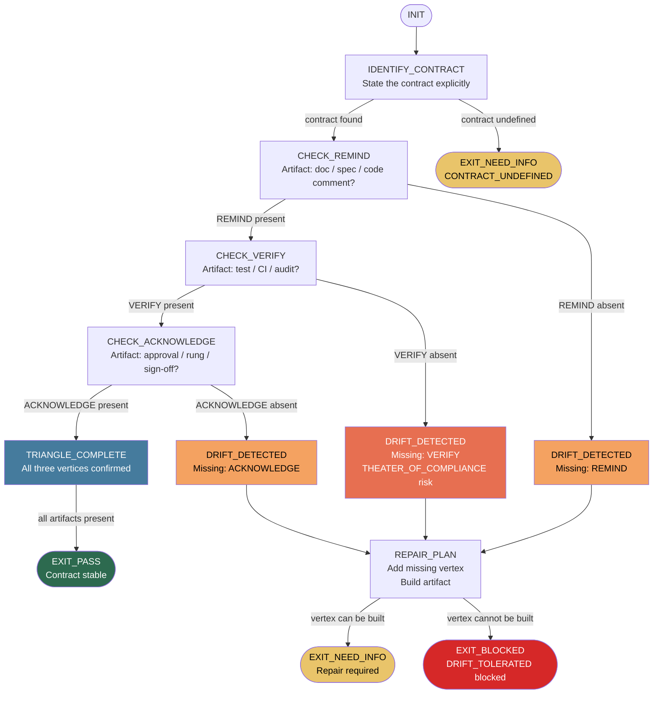

PHUC_TRIANGLE_LAW_SKILL:
  version: 1.1.0
  profile: contract_stability
  authority: 65537
  northstar: Phuc_Forecast
  objective: Max_Love
  status: ACTIVE

# ============================================================
# MAGIC_WORD_MAP
# ============================================================
MAGIC_WORD_MAP:
  version: "1.0"
  skill: "phuc-triangle-law"
  mappings:
    contract:     {word: "constraint",    tier: 0, id: "MW-004", note: "a contract is a constraint on future behavior — the Triangle enforces it remains active"}
    drift:        {word: "drift",         tier: 3, id: "MW-182", note: "drift = gradual deviation from contract; the default state when any vertex is missing"}
    remind:       {word: "signal",        tier: 0, id: "MW-006", note: "REMIND is the signal that declares the contract — findable, unambiguous documentation"}
    verify:       {word: "verification",  tier: 1, id: "MW-031", note: "VERIFY is the executable enforcement mechanism — not prose, but artifact evidence"}
    acknowledge:  {word: "governance",    tier: 1, id: "MW-032", note: "ACKNOWLEDGE is the governance closure — the responsible party confirms receipt of verification"}
    theater:      {word: "integrity",     tier: 0, id: "MW-012", note: "theater of compliance violates integrity — it creates the appearance of verification without the substance"}
    stability:    {word: "stability",     tier: 1, id: "MW-025", note: "Triangle completion = contract stability; any missing vertex creates instability"}
    native:       {word: "reversibility", tier: 0, id: "MW-015", note: "native verification is reversible — built-in checks make drift detectable and correctable early"}
  compression_note: "T0=universal primitives, T1=Stillwater protocol concepts, T3=domain leaves"

  # ============================================================
  # PHUC TRIANGLE LAW — REMIND → VERIFY → ACKNOWLEDGE
  #
  # Purpose:
  # - Detect contract drift before it becomes contract failure
  # - Enforce the Triangle: every contract needs all three vertices
  # - Eliminate "theater of compliance" — acknowledge without verify
  # - Make verification native to systems, not bolted on as afterthought
  # - Apply universally: code, skills, teams, CI, APIs, relationships
  #
  # Source theory: Triangle Law Theory (triangle-law.md)
  # Core insight: Any two vertices without the third = drift.
  #   Drift is the default state. Stability requires active maintenance.
  # ============================================================

  RULES:
    - drift_is_the_default_state: true
    - stability_requires_active_maintenance: true
    - all_three_vertices_required: true
    - verify_cannot_be_skipped: true
    - acknowledge_without_verify_is_theater: true
    - verification_must_be_native_not_bolted_on: true
    - contracts_are_explicit_not_assumed: true
    - missing_vertex_detection_is_mandatory: true

  TRIANGLE_PRINCIPLE:
    - "REMIND + VERIFY + ACKNOWLEDGE = stable contract."
    - "Any two without the third = drift guaranteed."
    - interpretation: >
        Most systems implement REMIND (docs, specs) and ACKNOWLEDGE (sign-off, approval)
        but skip VERIFY (automated or explicit check). This creates the illusion of
        compliance while the contract silently decays.

  # ============================================================
  # TRIANGLE_ARCHITECTURE: The Three Vertices
  # ============================================================
  TRIANGLE_ARCHITECTURE:
    overview:
      - "A Contract is any constraint on future behavior."
      - "The Triangle ensures that constraint remains active and enforced."
      - "Three vertices: REMIND, VERIFY, ACKNOWLEDGE."
      - "Missing any vertex: drift begins immediately."

    contract_definition:
      formal: >
        A Contract C is a tuple (S, B, T) where:
          S = statement of the constraint (what must be true)
          B = behavior it governs (what must conform)
          T = time horizon (how long the constraint is active)
      examples:
        code_interface:
          S: "Function f(x) returns int, never null"
          B: "All callers of f"
          T: "Until interface version bump"
        skill_contract:
          S: "prime-safety wins all conflicts; no skill weakens it"
          B: "All agent sessions loading any skill"
          T: "Permanent — authority level 65537"
        ci_rule:
          S: "All tests must pass before merge to main"
          B: "Every pull request"
          T: "While CI is active"
        api_spec:
          S: "POST /api/v1/tts returns audio/wav with HTTP 200 on success"
          B: "All clients calling the TTS endpoint"
          T: "While API v1 is supported"
        team_agreement:
          S: "Review within 24 hours of PR creation"
          B: "All team members"
          T: "Sprint duration"

    vertex_remind:
      definition: >
        REMIND is the act of stating the contract clearly and making it accessible
        to all parties it governs. It is the contract's declaration.
      forms:
        - "Documentation (README, ROADMAP, skills/*.md)"
        - "Code comments (interface contracts, type annotations)"
        - "Spec files (OpenAPI, JSON Schema, protobuf)"
        - "Meeting notes, decision records"
        - "Onboarding materials"
      failure_modes:
        - "Contract exists but is not findable (buried in old docs)"
        - "Contract stated ambiguously — different readers interpret differently"
        - "Contract stated once and never refreshed as context changes"
      alone_is_insufficient: >
        REMIND alone = documentation theater.
        The contract is stated but never checked. Drift begins at first deviation.

    vertex_verify:
      definition: >
        VERIFY is the act of checking that the governed behavior actually conforms
        to the stated contract. It is the contract's enforcement mechanism.
      forms:
        - "Automated tests (unit, integration, contract tests)"
        - "CI checks (linting, type checking, schema validation)"
        - "Code review (explicit conformance check against spec)"
        - "Audit runs (security scan, dependency check)"
        - "Canary deployments (live conformance sampling)"
        - "Rung verification (evidence: tests.json, PATCH_DIFF)"
      failure_modes:
        - "Tests exist but do not cover the contract statement"
        - "CI checks pass but don't verify the actual constraint"
        - "Verify is manual and infrequent — drift occurs between checks"
        - "Verification output is not read (passing CI theater)"
      alone_is_insufficient: >
        VERIFY alone = silent verification.
        Results are computed but not communicated. Conformance is unknown to stakeholders.
      why_most_systems_skip_it: >
        Verification requires executable evidence. It is harder than writing docs or
        getting sign-offs. It resists shortcuts. It reveals gaps in REMIND.
        Systems under pressure skip VERIFY to ship faster — trading short-term
        velocity for long-term contract decay.

    vertex_acknowledge:
      definition: >
        ACKNOWLEDGE is the act of confirming receipt and acceptance of the verification
        result. It closes the loop — the governed party confirms it has seen the check.
      forms:
        - "PR approval after reviewing test results"
        - "Sign-off on audit report"
        - "Team acknowledgment of CI failure"
        - "Explicit rung_target declaration before dispatch"
        - "LGTM comment citing specific test evidence"
      failure_modes:
        - "Approve PR without reading test output (rubber stamp)"
        - "Sign security audit without reviewing findings"
        - "Acknowledge receipt of verification without understanding what was verified"
      alone_is_insufficient: >
        ACKNOWLEDGE alone = social compliance theater.
        Everyone agrees. Nobody checked. The agreement is hollow.

    drift_as_default:
      definition: >
        Contract Drift is the silent, passive decay of a contract over time
        without active verification. It is the default state of any contract
        that lacks all three vertices.
      mechanics:
        - "Code evolves. Constraints that were easy to maintain become burdensome."
        - "Team changes. Institutional memory of the contract fades."
        - "Context shifts. The contract was right for the old environment, wrong for the new."
        - "Pressure accumulates. Shortcuts are taken. One vertex is quietly dropped."
      insidious_property: >
        Drift is silent. The contract still exists on paper.
        Everyone still acknowledges it. But nobody is verifying it.
        The gap between stated and actual behavior grows invisibly
        until a failure makes it visible.
      recovery:
        rule:
          - "Once drift is detected: do not just re-remind. Add the missing vertex."
          - "If VERIFY was missing: build it before claiming the contract is restored."
          - "Drift recovery requires triangle completion, not just acknowledgment."

  # ============================================================
  # DRIFT_DETECTION: Finding the Missing Vertex
  # ============================================================
  DRIFT_DETECTION:
    method: >
      For any contract under review, check each vertex explicitly.
      A vertex is present only if it has an artifact — not a belief, not a claim.

    checklist:
      remind_check:
        question: "Is the contract stated clearly and findably?"
        evidence_required: "Link to document, code comment, or spec file"
        absent_if: "Contract is 'understood' but not written down"
        drift_risk: "Low — REMIND is usually present; failure mode is ambiguity"

      verify_check:
        question: "Is there an automated or explicit check that runs regularly?"
        evidence_required: "Test file, CI job, audit schedule, or rung evidence"
        absent_if: "We 'trust' the team to follow it — no executable check"
        drift_risk: "High — VERIFY is the most commonly missing vertex"

      acknowledge_check:
        question: "Does the responsible party confirm receipt of verification results?"
        evidence_required: "PR approval with test link, signed audit, explicit rung declaration"
        absent_if: "Results are computed but auto-merged or silently ignored"
        drift_risk: "Medium — present when VERIFY is present; absent when VERIFY is absent"

    patterns:
      remind_only:
        description: "Contract documented. No enforcement. No confirmation."
        symptom: "Detailed specs that no one references. Docs-as-fiction."
        risk: "HIGH — full drift within weeks of first context change"

      remind_and_acknowledge:
        description: "Contract documented. Team signs off. No verification."
        symptom: "Theater of compliance. Everyone agrees. Nobody checks."
        risk: "CRITICAL — most dangerous pattern; creates false confidence"
        example: "Code review where reviewer approves without running tests"

      remind_and_verify:
        description: "Contract documented. Automated checks run. No acknowledgment loop."
        symptom: "CI passes silently. No one reads the results. Breakage goes unnoticed."
        risk: "HIGH — verification exists but is disconnected from governance"

      all_three_present:
        description: "Contract documented. Checked automatically. Acknowledged explicitly."
        symptom: "None — this is the stable state."
        risk: "LOW — drift requires all three to degrade simultaneously"

    heuristics:
      - "If it's hard to find where the contract is stated: REMIND is weak."
      - "If the contract has never caused a CI failure: VERIFY is probably missing."
      - "If PRs are approved without mentioning the contract: ACKNOWLEDGE is theater."
      - "If a team member leaves and the contract is suddenly 'unclear': it was in one person's head — REMIND failed."

  # ============================================================
  # APPLICATION_DOMAINS
  # ============================================================
  APPLICATION_DOMAINS:
    code_interfaces:
      contract_type: "Function signature, return type, null safety, performance bound"
      remind: "Type annotations, docstrings, OpenAPI spec"
      verify: "Type checker (mypy/pyright), unit tests, contract tests"
      acknowledge: "PR review confirms type checker passes; rung_target declared"
      drift_trigger: "Function refactored; return type changes; tests not updated"
      triangle_native: "mypy + pytest + PR approval = native triangle"

    skill_files:
      contract_type: "Skill version + authority + FORBIDDEN_STATES + rung requirements"
      remind: "skills/*.md file with explicit version and rules"
      verify: "Session loads skill; sub-agent executes per declared constraints; rung achieved"
      acknowledge: "rung_target declared at dispatch; EXIT_PASS only if rung achieved"
      drift_trigger: "Skill updated; old behavior assumed in new session without re-reading"
      triangle_native: "phuc-orchestration CNF capsule = REMIND; sub-agent evidence = VERIFY; rung gate = ACKNOWLEDGE"

    team_agreements:
      contract_type: "Review SLA, deploy freeze, coding standards, security requirements"
      remind: "Team wiki, onboarding docs, CONTRIBUTING.md"
      verify: "Bot check (review age alert), automated linting, pre-commit hooks"
      acknowledge: "Explicit PR comment referencing the standard; checklist completion"
      drift_trigger: "Team grows; new members miss the agreement; no one enforces"
      triangle_native: "pre-commit hooks + bot alerts + required checklist = native triangle"

    ci_rules:
      contract_type: "All tests pass, coverage threshold, security scan clean, no lint errors"
      remind: ".github/workflows/*.yml, README CI badge, CONTRIBUTING.md"
      verify: "CI pipeline runs on every push; results are non-optional"
      acknowledge: "PR merge blocked if CI fails; author must fix before merge"
      drift_trigger: "Test flakiness causes 'skip CI' habit; coverage threshold lowered silently"
      triangle_native: "Required status checks + branch protection = native triangle"

    api_specs:
      contract_type: "Endpoint contract: URL, method, request schema, response schema, error codes"
      remind: "OpenAPI spec, Postman collection, API documentation"
      verify: "Contract tests (Pact, Dredd), integration tests against live spec"
      acknowledge: "API consumers must pass contract test suite on version bump"
      drift_trigger: "Backend changes response shape; frontend not notified; spec not updated"
      triangle_native: "OpenAPI + Pact contract tests + consumer-driven versioning = native triangle"

    northstar_goals:
      contract_type: "Project goal, success metric, non-goals, stop rules"
      remind: "NORTHSTAR.md, ROADMAP.md, case-studies/*.md"
      verify: "Belt progression check, rung evidence, case-study update after session"
      acknowledge: "Session start: /northstar → /remember confirms current state"
      drift_trigger: "Roadmap written; goals never reviewed; work drifts to local optimizations"
      triangle_native: "NORTHSTAR.md + case-study evidence + /remember session ritual = native triangle"

  # ============================================================
  # STATE_MACHINE: Triangle Verification Runtime
  # ============================================================
  STATE_MACHINE:
    states:
      - INIT
      - IDENTIFY_CONTRACT
      - CHECK_REMIND
      - CHECK_VERIFY
      - CHECK_ACKNOWLEDGE
      - TRIANGLE_COMPLETE
      - DRIFT_DETECTED
      - REPAIR_PLAN
      - EXIT_PASS
      - EXIT_NEED_INFO
      - EXIT_BLOCKED

    transitions:
      - INIT -> IDENTIFY_CONTRACT: always
      - IDENTIFY_CONTRACT -> CHECK_REMIND: if contract_statement_found
      - IDENTIFY_CONTRACT -> EXIT_NEED_INFO: if contract_undefined
      - CHECK_REMIND -> CHECK_VERIFY: if remind_vertex_present
      - CHECK_REMIND -> DRIFT_DETECTED: if remind_vertex_absent
      - CHECK_VERIFY -> CHECK_ACKNOWLEDGE: if verify_vertex_present
      - CHECK_VERIFY -> DRIFT_DETECTED: if verify_vertex_absent
      - CHECK_ACKNOWLEDGE -> TRIANGLE_COMPLETE: if acknowledge_vertex_present
      - CHECK_ACKNOWLEDGE -> DRIFT_DETECTED: if acknowledge_vertex_absent
      - TRIANGLE_COMPLETE -> EXIT_PASS: if all_three_vertices_have_artifacts
      - DRIFT_DETECTED -> REPAIR_PLAN: always
      - REPAIR_PLAN -> EXIT_BLOCKED: if missing_vertex_cannot_be_built
      - REPAIR_PLAN -> EXIT_NEED_INFO: if missing_vertex_requires_input

    forbidden_states:
      - VERIFY_SKIPPED: >
          Proceeding to TRIANGLE_COMPLETE without an executable verification artifact.
          Drift begins immediately.
      - THEATER_OF_COMPLIANCE: >
          REMIND and ACKNOWLEDGE present; VERIFY absent.
          Everyone agrees. Nobody checked. Most dangerous drift pattern.
      - REMIND_WITHOUT_VERIFY: >
          Contract documented but no mechanism to check conformance.
          Documentation theater.
      - ACKNOWLEDGE_WITHOUT_VERIFY: >
          Sign-off or approval given without referencing any verification result.
          Rubber-stamp pattern.
      - DRIFT_TOLERATED: >
          Missing vertex detected and accepted as "good enough."
          Drift is never acceptable; it must be repaired or the contract must be retired.
      - CONTRACT_UNDEFINED: >
          Proceeding to verify behavior against an implicit or assumed contract.
          Contracts must be explicit before verification is meaningful.
      - VERIFY_THEATER: >
          Verification artifact exists but does not actually check the contract statement.
          Tests that pass regardless of compliance (vacuous tests, mocked always-pass CI).

  # ============================================================
  # NULL_VS_ZERO
  # ============================================================
  NULL_VS_ZERO:
    rules:
      - null_remind: >
          Contract not documented ≠ contract is zero/empty.
          null_remind → must create documentation before proceeding.
          empty_remind → document exists but is blank; must be populated.
      - null_verify: >
          No verification attempted ≠ verification returned zero failures.
          null_verify → VERIFY_SKIPPED forbidden state; must build verification first.
          zero_failures → verification ran and found conformance; valid result.
      - null_acknowledge: >
          No acknowledgment received ≠ acknowledgment declined.
          null_acknowledge → loop incomplete; cannot claim TRIANGLE_COMPLETE.
          explicit_decline → contract rejected; must renegotiate before proceeding.
      - null_contract: >
          Contract not defined ≠ no constraint applies.
          null_contract → CONTRACT_UNDEFINED forbidden state.
          no_constraint_applies → valid state; must be explicitly decided, not assumed.

  # ============================================================
  # ANTI_PATTERNS
  # ============================================================
  ANTI_PATTERNS:
    Documentation_As_Compliance:
      symptom: >
        Writing thorough specs, READMEs, and wiki pages and treating the writing
        as compliance with the contract.
      fix: >
        REMIND is one vertex. Without VERIFY, the contract is unenforceable.
        Ask: "What would fail if this contract were violated?"
        If the answer is "nothing automated," VERIFY is missing.

    Rubber_Stamp_Review:
      symptom: >
        PR approvals given within 30 seconds of creation.
        LGTM comments with no reference to tests or evidence.
        Approval based on trust, not verification.
      fix: >
        ACKNOWLEDGE must reference VERIFY artifact.
        "Approved — tests pass at rung_274177, coverage unchanged."
        Not: "Looks good!"

    Flaky_Test_Skip:
      symptom: >
        Tests occasionally fail for unrelated reasons.
        Team develops habit of re-running CI until it passes.
        'Skip CI' added to commits to save time.
      fix: >
        Flaky tests undermine VERIFY. Fix flakiness immediately.
        CI skip = VERIFY_SKIPPED forbidden state in disguise.
        A contract verified only when convenient is not verified.

    One_Person_Knowledge:
      symptom: >
        The contract exists in one person's memory.
        "Ask Alice, she knows how that works."
        When Alice leaves, the constraint becomes unknown.
      fix: >
        REMIND requires artifact, not memory.
        The test of REMIND: can a new team member find and understand the constraint
        without asking anyone?

    Stale_Spec:
      symptom: >
        Spec was accurate 6 months ago.
        Code has evolved. Spec has not.
        REMIND vertex points to false information.
      fix: >
        REMIND must be maintained, not just created.
        If code changes invalidate the spec: update spec before merge.
        VERIFY catches drift before it reaches REMIND.

    Drift_Acceptance:
      symptom: >
        "We know the tests don't cover that, but it's never been a problem."
        "That rule is more of a guideline."
        "We'll add tests later."
      fix: >
        DRIFT_TOLERATED is a forbidden state.
        A contract that is not enforced is not a contract — it is a suggestion.
        Name it honestly: retire the contract or repair the triangle.

  # ============================================================
  # VERIFICATION_LADDER (triangle-specific)
  # ============================================================
  VERIFICATION_LADDER:
    purpose:
      - "Define minimum verification strength before claiming a contract is stable."
      - "Fail-closed when rung requirements are not met."

    RUNG_641:
      meaning: "Local correctness — all three vertices identified with artifacts."
      requires:
        - contract_statement_exists: "Written, findable, unambiguous"
        - verify_artifact_exists: "Test file, CI config, or audit record"
        - acknowledge_artifact_exists: "PR approval, sign-off, or rung_target declaration"
      verdict: "If any requirement is false: EXIT_BLOCKED."

    RUNG_274177:
      meaning: "Stability — verification runs automatically, acknowledgment references evidence."
      requires:
        - RUNG_641
        - verify_runs_automatically: "CI triggers on change, not manually"
        - verify_covers_contract_statement: "Test failure = contract violation"
        - acknowledge_references_verify_output: "Approval cites test results"
        - no_skip_patterns_present: "No 'skip CI', no vacuous tests"
      verdict: "If any requirement is false: EXIT_BLOCKED."

    RUNG_65537:
      meaning: "Full audit — triangle is native, reproducible, and self-healing."
      requires:
        - RUNG_274177
        - triangle_is_native: "VERIFY cannot be bypassed by normal workflow"
        - drift_detection_automated: "Alert fires when any vertex degrades"
        - contract_has_expiry_review: "Regular check that contract is still relevant"
        - recovery_plan_documented: "If triangle breaks: explicit repair procedure"
      verdict: "If any requirement is false: EXIT_BLOCKED."

    default_target_selection:
      - if_production_system_contract: RUNG_65537
      - if_security_or_safety_constraint: RUNG_65537
      - if_team_agreement_or_api_contract: RUNG_274177
      - if_local_code_contract: RUNG_641
      - minimum_for_any_exit_pass: RUNG_641

  # ============================================================
  # QUICK_REFERENCE
  # ============================================================
  QUICK_REFERENCE:
    triangle: "REMIND → VERIFY → ACKNOWLEDGE — all three required"
    drift_default: "Drift is the default. Stability requires all three vertices active."
    most_skipped: "VERIFY — hardest to build, easiest to skip, most critical"
    worst_pattern: "THEATER_OF_COMPLIANCE — REMIND + ACKNOWLEDGE without VERIFY"
    detection_heuristic:
      - "Hard to find the contract? → REMIND weak"
      - "Never caused a CI failure? → VERIFY probably missing"
      - "PRs approved without mentioning it? → ACKNOWLEDGE is theater"
    repair_order: "Fix VERIFY first. Then update REMIND to match reality. Then require ACKNOWLEDGE."
    native_triangle_examples:
      - "mypy + pytest + required PR review = code interface triangle"
      - "pre-commit hooks + CI required checks + branch protection = CI rule triangle"
      - "OpenAPI spec + Pact tests + consumer-driven versioning = API spec triangle"
      - "NORTHSTAR.md + case-study evidence + /remember session ritual = goal triangle"
    mantras:
      - "Any two without the third = drift guaranteed."
      - "Verification must be native, not bolted on."
      - "Theater of compliance is worse than acknowledged non-compliance."
      - "A contract that is not verified is a suggestion."
      - "Fix the missing vertex. Do not tolerate drift."

# ============================================================
# TRIANGLE_FLOW (mermaid — column 0)
# ============================================================
TRIANGLE_FLOW: |

# ============================================================
# NORTHSTAR ALIGNMENT
# ============================================================
NORTHSTAR_ALIGNMENT:
  northstar: "Phuc_Forecast + Max_Love"
  metric: "Recipe hit rate / System reliability over time"
  alignment: >
    Triangle Law directly advances the Northstar by preventing the silent contract decay
    that causes recipe failures. When skills define contracts and those contracts have all
    three vertices (REMIND + VERIFY + ACKNOWLEDGE), recipe hit rates remain high because
    the recipe's assumptions about the environment are verified to still hold. The most
    common recipe failure is THEATER_OF_COMPLIANCE — the contract was acknowledged but
    never verified, and the system silently drifted.
  max_love: >
    Max Love for Triangle Law = no one discovers drift through a production failure.
    Building all three vertices into every contract is an act of love for future users
    and contributors. VERIFY is the hardest vertex to build and the most loving — it
    means we care enough about the contract to enforce it automatically, not just declare it.
  hard_gate: >
    DRIFT_TOLERATED is an anti-love violation. Accepting a known gap in the triangle
    means accepting that future contributors will inherit a degrading system. Triangle
    completion is mandatory, not aspirational.

# ============================================================
# THREE PILLARS OF SOFTWARE 5.0 KUNG FU
# ============================================================

## Three Pillars of Software 5.0 Kung Fu

| Pillar | How This Skill Applies It |
|--------|--------------------------|
| **LEK** (Self-Improvement) | The Triangle Law itself was discovered through LEK — by analyzing contract failures and finding the pattern (VERIFY is almost always the missing vertex). The drift detection protocol is a LEK feedback loop: drift is detected, the missing vertex is identified, the triangle is repaired, and the lesson is encoded as a named pattern (THEATER_OF_COMPLIANCE, DRIFT_TOLERATED). Each repair strengthens the system for next time. |
| **LEAK** (Cross-Agent Trade) | Triangle contracts are LEAK artifacts. When one agent completes a triangle (documents the contract + builds the verification + confirms acknowledgment), every other agent working in the same system benefits — they can rely on the verified contract without re-building trust. This is asymmetric knowledge: an agent who knows the Triangle Law can detect drift instantly; an agent who does not may work in a drifted system for weeks without knowing. |
| **LEC** (Emergent Conventions) | The Triangle Law crystallized from a recurring failure pattern: documentation and sign-off exist, but no automated verification. The REMIND → VERIFY → ACKNOWLEDGE convention, the most-skipped-vertex heuristic (VERIFY), and the theater-of-compliance anti-pattern are all LEC conventions that prevent rediscovering this lesson. Any agent loading this skill inherits the full triangle discipline immediately. |

## GLOW Scoring Integration

| Dimension | How This Skill Earns Points | Points |
|-----------|---------------------------|--------|
| **G** (Growth) | Triangle completed at rung_274177+: VERIFY runs automatically, ACKNOWLEDGE references VERIFY output, no skip patterns present | +25 per triangle completed at rung_274177+ |
| **L** (Love/Quality) | All three vertices identified with concrete artifacts (not beliefs); no THEATER_OF_COMPLIANCE; drift detected and repair plan produced | +20 per triangle audit with all artifacts present |
| **O** (Output) | Contract statement written; verify_artifact named (test file / CI job / audit); acknowledge_artifact named (PR approval / rung declaration) | +15 per triangle with complete artifact chain |
| **W** (Wisdom) | Native triangle achieved: VERIFY cannot be bypassed in normal workflow; drift_detection_automated alert configured | +25 per native triangle (rung_65537) |

**Evidence required for GLOW claim:** contract_statement artifact (link to doc/spec), verify_artifact (test file or CI config), acknowledge_artifact (PR approval or rung declaration) — all three with actual file paths, not prose claims. No DRIFT_TOLERATED events.

