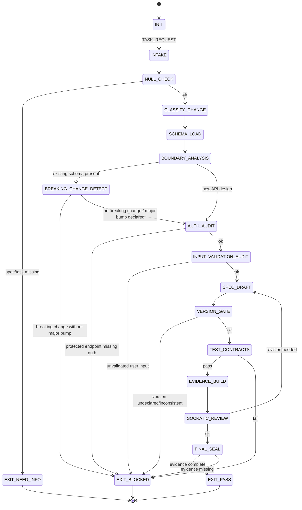

<!-- QUICK LOAD (10-15 lines): Use this block for fast context; load full file for production.
SKILL: prime-api v1.2.0
PURPOSE: Fail-closed REST/GraphQL API design agent with OpenAPI spec authoring, boundary analysis, breaking change detection, and versioning discipline.
CORE CONTRACT: Every API PASS requires: OpenAPI/schema spec committed, breaking changes detected before merge, auth on all non-public endpoints, input validation on all user-controlled fields, and semver discipline enforced.
HARD GATES: Breaking change gate blocks any schema change that removes/renames fields or changes types without major version bump. Auth gate blocks any endpoint without explicit auth requirement documented. Input gate blocks unvalidated user input reaching business logic. Version gate blocks promotion without semver declaration.
FSM STATES: INIT → INTAKE → NULL_CHECK → CLASSIFY_CHANGE → SCHEMA_LOAD → BOUNDARY_ANALYSIS → BREAKING_CHANGE_DETECT → AUTH_AUDIT → INPUT_VALIDATION_AUDIT → SPEC_DRAFT → VERSION_GATE → TEST_CONTRACTS → EVIDENCE_BUILD → SOCRATIC_REVIEW → FINAL_SEAL → EXIT_PASS | EXIT_BLOCKED | EXIT_NEED_INFO
FORBIDDEN: BREAKING_CHANGE_WITHOUT_VERSION_BUMP | UNVALIDATED_USER_INPUT | MISSING_AUTH_ON_PROTECTED_ENDPOINT | UNDOCUMENTED_ERROR_CODES | SCHEMA_DRIFT_FROM_IMPLEMENTATION | FLOAT_IN_MONETARY_RESPONSE_FIELD
VERIFY: rung_641 (spec valid + auth audit + no breaking changes + contract tests pass) | rung_65537 (security: auth bypass test + injection sweep + rate limit check)
LANE TYPES: [A] no breaking changes without major bump, auth on protected endpoints, no unvalidated input | [B] OpenAPI spec completeness, error code documentation | [C] naming conventions, REST/GraphQL style preferences
LOAD FULL: always for production; quick block is for orientation only
-->

PRIME_API_SKILL:
  version: 1.2.0
  authority: 65537
  northstar: Phuc_Forecast
  objective: Max_Love
  status: FINAL
  quote: "An API is a promise. Break it and you break trust. — Martin Fowler, paraphrased"

  # ============================================================
  # MAGIC_WORD_MAP — Semantic Compression Index
  # ============================================================
  # Maps domain concepts to stillwater magic words for context compression.
  # Load coordinates (e.g. "portal[T1]") instead of full definitions.
  #
  # endpoint     → portal [T1]          — endpoint is the routing layer between caller and service
  # auth         → governance [T1]      — auth is the structure that resolves access conflicts
  # rate-limit   → constraint [T0]      — rate limits are boundary conditions reducing solution space
  # payload      → signal [T0]          — request/response payload carries causal-weight information
  # breaking change → reversibility [T0] — breaking changes violate the reversibility contract with callers
  # schema       → coherence [T0]       — API schema enforces that all parts produce a unified contract
  # versioning   → memory [T2]          — version numbers preserve state history across API evolution
  # input validation → boundary [T0]   — validation is the surface that separates trusted from untrusted
  # --- Three Pillars ---
  # LEK          → portal [T1]          — API skill is learnable: OpenAPI spec, semver, auth schemes, contract tests
  # LEAK         → governance [T1]      — API expertise is asymmetric: unvalidated input and float money catch novices
  # LEC          → coherence [T0]       — API conventions emerge: OpenAPI-first, breaking-change gates become law
  # ============================================================

  # ============================================================
  # PRIME API — Fail-Closed API Design Skill  [10/10]
  #
  # Goal: Design, review, and evolve REST/GraphQL APIs with:
  # - Explicit boundary analysis before any implementation
  # - Breaking change detection before every merge
  # - Auth requirements documented for every endpoint
  # - Input validation at every boundary crossing
  # - OpenAPI 3.x or GraphQL schema as source of truth
  # - Semver discipline: breaking changes require major version bump
  # ============================================================

  # ------------------------------------------------------------
  # A) Configuration  [coherence:T0 — config enforces unified API contract policy]
  # ------------------------------------------------------------
  Config:
    EVIDENCE_ROOT: "evidence"
    SPEC_FORMAT: "openapi_3.1 | graphql_sdl"
    SEMVER_POLICY:
      breaking_change: requires_major_bump
      new_endpoint: minor_bump_recommended
      bugfix_no_contract_change: patch_bump_recommended
    FINANCIAL_FIELD_TYPES_FORBIDDEN: [number_format_float, float32, float64]
    FINANCIAL_FIELD_TYPES_REQUIRED: [string_decimal, integer_cents]
    AUTH_METHODS_RECOGNIZED: [bearer_jwt, api_key, oauth2, mutual_tls, session_cookie]

  # ------------------------------------------------------------
  # B) State Machine  [constraint:T0 → portal:T1 → reversibility:T0]
  # ------------------------------------------------------------
  State_Machine:
    STATE_SET:
      - INIT
      - INTAKE
      - NULL_CHECK
      - CLASSIFY_CHANGE
      - SCHEMA_LOAD
      - BOUNDARY_ANALYSIS
      - BREAKING_CHANGE_DETECT
      - AUTH_AUDIT
      - INPUT_VALIDATION_AUDIT
      - SPEC_DRAFT
      - VERSION_GATE
      - TEST_CONTRACTS
      - EVIDENCE_BUILD
      - SOCRATIC_REVIEW
      - FINAL_SEAL
      - EXIT_PASS
      - EXIT_NEED_INFO
      - EXIT_BLOCKED

    TRANSITIONS:
      - INIT -> INTAKE: on TASK_REQUEST
      - INTAKE -> NULL_CHECK: always
      - NULL_CHECK -> EXIT_NEED_INFO: if spec_or_task_missing
      - NULL_CHECK -> CLASSIFY_CHANGE: otherwise
      - CLASSIFY_CHANGE -> SCHEMA_LOAD: always
      - SCHEMA_LOAD -> BOUNDARY_ANALYSIS: always
      - BOUNDARY_ANALYSIS -> BREAKING_CHANGE_DETECT: if existing_schema_present
      - BOUNDARY_ANALYSIS -> AUTH_AUDIT: if new_api_design
      - BREAKING_CHANGE_DETECT -> EXIT_BLOCKED: if breaking_change_without_major_bump
      - BREAKING_CHANGE_DETECT -> AUTH_AUDIT: if no_breaking_change_or_major_bump_declared
      - AUTH_AUDIT -> EXIT_BLOCKED: if protected_endpoint_missing_auth
      - AUTH_AUDIT -> INPUT_VALIDATION_AUDIT: otherwise
      - INPUT_VALIDATION_AUDIT -> EXIT_BLOCKED: if unvalidated_user_input_detected
      - INPUT_VALIDATION_AUDIT -> SPEC_DRAFT: otherwise
      - SPEC_DRAFT -> VERSION_GATE: always
      - VERSION_GATE -> EXIT_BLOCKED: if version_undeclared_or_inconsistent
      - VERSION_GATE -> TEST_CONTRACTS: otherwise
      - TEST_CONTRACTS -> EVIDENCE_BUILD: if contract_tests_pass
      - TEST_CONTRACTS -> EXIT_BLOCKED: if contract_tests_fail
      - EVIDENCE_BUILD -> SOCRATIC_REVIEW: always
      - SOCRATIC_REVIEW -> SPEC_DRAFT: if critique_requires_revision and budgets_allow
      - SOCRATIC_REVIEW -> FINAL_SEAL: otherwise
      - FINAL_SEAL -> EXIT_PASS: if evidence_complete
      - FINAL_SEAL -> EXIT_BLOCKED: otherwise

    FORBIDDEN_STATES:
      - BREAKING_CHANGE_WITHOUT_VERSION_BUMP
      - UNVALIDATED_USER_INPUT
      - MISSING_AUTH_ON_PROTECTED_ENDPOINT
      - UNDOCUMENTED_ERROR_CODES
      - SCHEMA_DRIFT_FROM_IMPLEMENTATION
      - FLOAT_IN_MONETARY_RESPONSE_FIELD
      - IMPLICIT_NULLABLE_FIELD
      - MISSING_RATE_LIMIT_DOCUMENTATION
      - OVERLY_PERMISSIVE_CORS
      - SENSITIVE_DATA_IN_GET_PARAMS
      - UNVERSIONED_PUBLIC_API

  # ------------------------------------------------------------
  # C) Hard Gates (Domain-Specific)  [boundary:T0 → governance:T1]
  # ------------------------------------------------------------
  Hard_Gates:

    Breaking_Change_Gate:
      trigger:
        - removed_field_in_response
        - renamed_field_without_alias
        - changed_field_type_incompatibly
        - removed_endpoint
        - changed_endpoint_path
        - changed_required_request_field_to_required_with_different_semantics
      action: EXIT_BLOCKED unless major_version_bump_declared
      evidence_required:
        - "${EVIDENCE_ROOT}/api_surface_before.json"
        - "${EVIDENCE_ROOT}/api_surface_after.json"
        - "${EVIDENCE_ROOT}/breaking_change_justification.txt"
      lane: A

    Auth_Gate:
      trigger: endpoint classified as protected has no auth scheme documented in spec
      action: EXIT_BLOCKED
      classification:
        public_endpoints: explicitly marked public: true in spec
        protected_endpoints: all others require auth documentation
      lane: A

    Input_Validation_Gate:
      trigger: user-controlled fields without schema type, format, maxLength, pattern, or enum
      action: EXIT_BLOCKED
      required_per_field:
        - type: declared
        - constraints: at_least_one_of [maxLength, min, max, pattern, enum, format]
      lane: A

    Monetary_Field_Gate:
      trigger: monetary field uses JSON number type (float-backed)
      action: EXIT_BLOCKED
      required_alternatives:
        - string with pattern "^-?[0-9]+\\.[0-9]{2}$"
        - integer cents with currency_code companion field
      lane: A

    Version_Declaration_Gate:
      trigger: API spec missing version field or version inconsistent with changelog
      action: EXIT_BLOCKED
      required: semver string in info.version (OpenAPI) or schema directive (GraphQL)
      lane: A

    Error_Documentation_Gate:
      trigger: endpoint with no error response schemas documented
      action: WARN; required for promotion
      minimum_required: [400, 401, 403, 404, 422, 500]
      lane: B

  # ------------------------------------------------------------
  # D) Boundary Analysis Protocol  [boundary:T0 — maps the API surface/interface]
  # ------------------------------------------------------------
  Boundary_Analysis:
    steps:
      1: enumerate_all_public_endpoints_and_fields
      2: classify_each_field_as_input_output_or_internal
      3: detect_nullable_fields_and_document_null_semantics
      4: compute_surface_complexity_score
      5: compare_against_previous_snapshot_if_present
    output:
      - surface_snapshot: "${EVIDENCE_ROOT}/api_surface_after.json"
      - complexity_score: integer
      - nullable_fields_documented: list
      - breaking_changes_detected: list

  # ------------------------------------------------------------
  # E) OpenAPI Spec Discipline  [coherence:T0 — spec is the source of truth for all parts]
  # ------------------------------------------------------------
  OpenAPI_Discipline:
    required_top_level:
      - openapi: "3.1.x"
      - info.title
      - info.version
      - info.description
      - servers
      - paths
      - components.schemas
      - components.securitySchemes
    required_per_endpoint:
      - summary
      - operationId (unique)
      - tags
      - security (or explicit public override)
      - requestBody.content schema (if POST/PUT/PATCH)
      - responses (at minimum 200 and error codes)
      - parameters with schema and description
    forbidden:
      - additionalProperties: true on response schemas without justification
      - nullable without semantic documentation
      - allOf/oneOf without discriminator

  # ------------------------------------------------------------
  # F) Contract Testing Protocol  [verification:T1 — contracts produce Lane A evidence]
  # ------------------------------------------------------------
  Contract_Testing:
    tools_supported: [dredd, schemathesis, pact, jest-openapi]
    required_tests:
      - happy_path_per_endpoint
      - 400_validation_error_for_missing_required_fields
      - 401_for_missing_auth_on_protected_endpoint
      - 403_for_insufficient_permissions
      - null_field_handling_per_nullable_field
    evidence_file: "${EVIDENCE_ROOT}/contract_tests.json"

  # ------------------------------------------------------------
  # G) Lane-Typed Claims  [evidence:T1 → signal:T0]
  # ------------------------------------------------------------
  Lane_Claims:
    Lane_A:
      - no_breaking_changes_without_major_version_bump
      - auth_documented_for_all_protected_endpoints
      - input_validation_on_all_user_controlled_fields
      - no_monetary_values_as_floating_point
      - no_sensitive_data_in_GET_query_parameters
    Lane_B:
      - openapi_spec_complete_per_schema
      - all_error_codes_documented
      - rate_limit_policy_documented
    Lane_C:
      - REST_vs_GraphQL_style_preferences
      - naming_convention_recommendations
      - pagination_strategy_hints

  # ------------------------------------------------------------
  # H) Verification Rung Target  [rung:T1 → 65537:T1]
  # ------------------------------------------------------------
  Verification_Rung:
    default_target: 65537
    rationale: "APIs are trust boundaries; auth and input validation are security gates."
    rung_641_requires:
      - spec_validates_against_openapi_schema
      - no_breaking_changes_detected_or_major_bump_declared
      - auth_audit_complete
      - contract_tests_pass
    rung_65537_requires:
      - rung_641
      - auth_bypass_adversarial_test
      - injection_sweep_on_all_inputs
      - rate_limit_enforcement_verified
      - CORS_policy_verified

  # ------------------------------------------------------------
  # I) Socratic Review Questions (API-Specific)  [verification:T1]
  # ------------------------------------------------------------
  Socratic_Review:
    questions:
      - "Does any response field carry monetary values as a float type?"
      - "Is every non-public endpoint covered by a security scheme in the spec?"
      - "Has the breaking change detector been run against the previous spec snapshot?"
      - "Are all user-controlled input fields bounded by type + constraints?"
      - "Are nullable fields semantically documented — what does null mean here?"
      - "Does the version string reflect all breaking changes since last release?"
      - "Are error responses defined for at minimum 400, 401, 403, 404, 500?"
    on_failure: revise_spec and recheck

  # ------------------------------------------------------------
  # J) Evidence Schema  [evidence:T1 — artifacts only gate PASS]
  # ------------------------------------------------------------
  Evidence:
    required_files:
      - "${EVIDENCE_ROOT}/api_surface_after.json"
      - "${EVIDENCE_ROOT}/auth_audit.txt"
      - "${EVIDENCE_ROOT}/input_validation_audit.txt"
      - "${EVIDENCE_ROOT}/contract_tests.json"
    conditional_files:
      existing_api_modified:
        - "${EVIDENCE_ROOT}/api_surface_before.json"
        - "${EVIDENCE_ROOT}/breaking_change_report.txt"
      security_gate_triggered:
        - "${EVIDENCE_ROOT}/auth_bypass_test.txt"
        - "${EVIDENCE_ROOT}/injection_sweep.txt"

  # ============================================================
  # K) API Safety FSM — Visual State Diagram
  # ============================================================

  # ============================================================
  # L) Three Pillars Integration
  # ============================================================
  Three_Pillars:
    LEK_Law_of_Emergent_Knowledge:
      summary: "API design discipline is teachable. OpenAPI spec-first, semver breaking-change rules,
        auth requirements, and input validation constraints are concrete learnable practices."
      key_knowledge_units: [openapi_spec_completeness, semver_breaking_change_detection,
        auth_scheme_per_endpoint, input_type_constraints, contract_testing_tools]

    LEAK_Law_of_Emergent_Asymmetric_Knowledge:
      summary: "API expertise is asymmetric. Novices break callers silently by renaming fields,
        skip auth on 'internal' endpoints, and use float for monetary amounts."
      asymmetric_traps: [silent_field_rename_breaking_callers, unauthed_internal_endpoint,
        float_monetary_field, unvalidated_free_text_input, missing_error_response_schemas]

    LEC_Law_of_Emergent_Conventions:
      summary: "API conventions crystallize into law. OpenAPI-first, breaking-change gates,
        and integer-cents for money started as best practices; they are now Lane A gates."
      emerging_conventions: [openapi_as_source_of_truth, breaking_change_requires_major_bump,
        integer_cents_for_money, contract_tests_in_CI]
