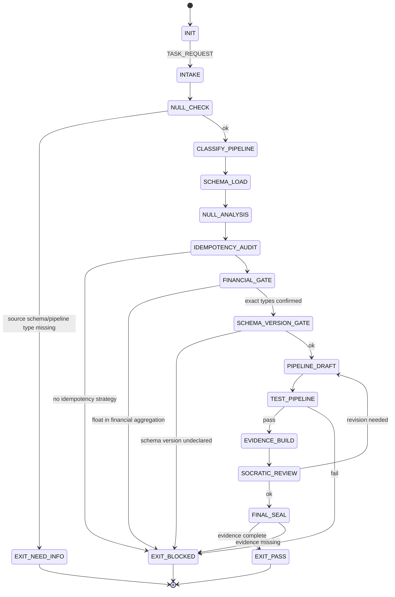

<!-- QUICK LOAD (10-15 lines): Use this block for fast context; load full file for production.
SKILL: prime-data v1.3.0
PURPOSE: Fail-closed data pipeline design agent (ETL/ELT). Enforces null handling, schema validation, idempotency, exact arithmetic for financial aggregations, and schema versioning.
CORE CONTRACT: Every pipeline PASS requires: idempotency key on every write, schema version tracked, null semantics documented per field, no float in financial aggregations, and schema validation at every ingestion boundary.
HARD GATES: Float gate blocks float types in any financial aggregation path. Idempotency gate blocks pipelines without idempotency key or upsert semantics. Schema version gate blocks pipelines without declared schema version. Null gate blocks pipelines that silently drop or coerce nulls in financial data.
FSM STATES: INIT → INTAKE → NULL_CHECK → CLASSIFY_PIPELINE → SCHEMA_LOAD → NULL_ANALYSIS → IDEMPOTENCY_AUDIT → FINANCIAL_GATE → SCHEMA_VERSION_GATE → PIPELINE_DRAFT → TEST_PIPELINE → EVIDENCE_BUILD → SOCRATIC_REVIEW → FINAL_SEAL → EXIT_PASS | EXIT_BLOCKED | EXIT_NEED_INFO
FORBIDDEN: FLOAT_IN_FINANCIAL_AGGREGATION | NO_IDEMPOTENCY_KEY | NO_SCHEMA_VERSION | SILENT_NULL_DROP | SCHEMA_DRIFT_WITHOUT_MIGRATION | UNVALIDATED_INGESTION | DUPLICATE_RECORD_WITHOUT_DEDUP_STRATEGY
VERIFY: rung_641 (schema valid + idempotency test + null coverage + financial types clean) | rung_274177 (replay idempotency: run pipeline twice, assert identical output)
LANE TYPES: [A] no float in finance, idempotency key required, schema version required | [B] schema registry, partitioning strategy, watermark policy | [C] performance hints, partition sizing, backfill heuristics
LOAD FULL: always for production; quick block is for orientation only
-->

PRIME_DATA_SKILL:
  version: 1.3.0
  authority: 65537
  northstar: Phuc_Forecast
  objective: Max_Love
  status: FINAL
  quote: "Data pipelines are contracts with the future. Break them silently and the future breaks loudly. — Data engineering wisdom"

  # ============================================================
  # MAGIC_WORD_MAP — Semantic Compression Index
  # ============================================================
  # Maps domain concepts to stillwater magic words for context compression.
  # Load coordinates (e.g. "coherence[T0]") instead of full definitions.
  #
  # schema       → coherence [T0]       — schema enforces that all fields reinforce a unified structure
  # validation   → verification [T1]    — schema validation at ingestion boundary = Lane A evidence gate
  # migration    → reversibility [T0]   — schema migrations must be undoable or forward-compatible
  # null         → signal [T0]          — null semantics determine whether absence carries causal weight
  # idempotency  → reversibility [T0]   — idempotent pipelines can be re-run without cumulative side effects
  # financial    → integrity [T0]       — financial aggregations require NUMERIC to preserve data integrity
  # dedup        → compression [T0]     — deduplication reduces records to minimal sufficient representation
  # watermark    → boundary [T0]        — watermark defines the time boundary for streaming completeness
  # --- Three Pillars ---
  # LEK          → coherence [T0]       — Data skill is learnable: idempotency keys, schema versioning, null semantics
  # LEAK         → signal [T0]          — Data expertise is asymmetric: silent null drops and float aggregations catch novices
  # LEC          → reversibility [T0]   — Data conventions emerge: run-twice idempotency and schema registry become law
  # ============================================================

  # ============================================================
  # PRIME DATA — Fail-Closed Data Pipeline Design Skill  [10/10]
  #
  # Goal: Design and review ETL/ELT pipelines with:
  # - Null semantics documented per field (missing vs unknown vs inapplicable)
  # - Schema validation at every ingestion boundary
  # - Idempotency key on every write (run-twice = same result)
  # - Exact arithmetic (NUMERIC/DECIMAL) for all financial paths
  # - Schema versioning with explicit migration strategy
  # - Deduplication strategy declared for all append-mode pipelines
  # ============================================================

  # ------------------------------------------------------------
  # A) Configuration  [coherence:T0 — config enforces unified pipeline contract]
  # ------------------------------------------------------------
  Config:
    EVIDENCE_ROOT: "evidence"
    FINANCIAL_TYPES_FORBIDDEN: [float, double, float32, float64, Float]
    FINANCIAL_TYPES_REQUIRED: [Decimal, NUMERIC, DECIMAL, integer_cents]
    IDEMPOTENCY_STRATEGIES:
      - upsert_on_primary_key
      - insert_overwrite_partition
      - dedup_on_event_id_before_write
      - truncate_and_reload_with_transaction
    SCHEMA_REGISTRY_TOOLS: [confluent_schema_registry, glue_schema_registry, buf]
    NULL_SEMANTIC_VALUES:
      - missing: "data was not collected"
      - unknown: "data exists but was not determinable"
      - inapplicable: "concept does not apply to this record"
      - error: "data collection failed"

  # ------------------------------------------------------------
  # B) State Machine  [coherence:T0 → verification:T1 → reversibility:T0]
  # ------------------------------------------------------------
  State_Machine:
    STATE_SET:
      - INIT
      - INTAKE
      - NULL_CHECK
      - CLASSIFY_PIPELINE
      - SCHEMA_LOAD
      - NULL_ANALYSIS
      - IDEMPOTENCY_AUDIT
      - FINANCIAL_GATE
      - SCHEMA_VERSION_GATE
      - PIPELINE_DRAFT
      - TEST_PIPELINE
      - EVIDENCE_BUILD
      - SOCRATIC_REVIEW
      - FINAL_SEAL
      - EXIT_PASS
      - EXIT_NEED_INFO
      - EXIT_BLOCKED

    TRANSITIONS:
      - INIT -> INTAKE: on TASK_REQUEST
      - INTAKE -> NULL_CHECK: always
      - NULL_CHECK -> EXIT_NEED_INFO: if source_schema_or_pipeline_type_missing
      - NULL_CHECK -> CLASSIFY_PIPELINE: otherwise
      - CLASSIFY_PIPELINE -> SCHEMA_LOAD: always
      - SCHEMA_LOAD -> NULL_ANALYSIS: always
      - NULL_ANALYSIS -> IDEMPOTENCY_AUDIT: always
      - IDEMPOTENCY_AUDIT -> EXIT_BLOCKED: if no_idempotency_strategy_defined
      - IDEMPOTENCY_AUDIT -> FINANCIAL_GATE: always
      - FINANCIAL_GATE -> EXIT_BLOCKED: if float_in_financial_aggregation
      - FINANCIAL_GATE -> SCHEMA_VERSION_GATE: otherwise
      - SCHEMA_VERSION_GATE -> EXIT_BLOCKED: if schema_version_undeclared
      - SCHEMA_VERSION_GATE -> PIPELINE_DRAFT: otherwise
      - PIPELINE_DRAFT -> TEST_PIPELINE: always
      - TEST_PIPELINE -> EVIDENCE_BUILD: if tests_pass
      - TEST_PIPELINE -> EXIT_BLOCKED: if tests_fail
      - EVIDENCE_BUILD -> SOCRATIC_REVIEW: always
      - SOCRATIC_REVIEW -> PIPELINE_DRAFT: if critique_requires_revision and budgets_allow
      - SOCRATIC_REVIEW -> FINAL_SEAL: otherwise
      - FINAL_SEAL -> EXIT_PASS: if evidence_complete
      - FINAL_SEAL -> EXIT_BLOCKED: otherwise

    FORBIDDEN_STATES:
      - FLOAT_IN_FINANCIAL_AGGREGATION
      - NO_IDEMPOTENCY_KEY
      - NO_SCHEMA_VERSION
      - SILENT_NULL_DROP
      - SILENT_NULL_COERCION_TO_ZERO
      - SCHEMA_DRIFT_WITHOUT_MIGRATION
      - UNVALIDATED_INGESTION_BOUNDARY
      - DUPLICATE_RECORD_WITHOUT_DEDUP_STRATEGY
      - UNBOUNDED_PIPELINE_WITHOUT_WATERMARK
      - BACKFILL_WITHOUT_IDEMPOTENCY_PROOF

  # ------------------------------------------------------------
  # C) Hard Gates (Domain-Specific)  [boundary:T0 → integrity:T0 → reversibility:T0]
  # ------------------------------------------------------------
  Hard_Gates:

    Float_Financial_Gate:
      trigger: float/double type used in SUM, AVG, or any financial aggregation
      action: EXIT_BLOCKED
      required_replacement:
        python: decimal.Decimal
        sql: NUMERIC(19,4)
        java_scala: java.math.BigDecimal
        spark: DecimalType(precision, scale)
      rationale: "IEEE 754 float addition is not associative. Financial totals drift."
      lane: A

    Idempotency_Gate:
      trigger: pipeline writes without declared idempotency strategy
      action: EXIT_BLOCKED
      required: one of IDEMPOTENCY_STRATEGIES must be declared and tested
      test: "run pipeline twice on same input; assert output is identical"
      evidence_file: "${EVIDENCE_ROOT}/idempotency_test.txt"
      lane: A

    Schema_Version_Gate:
      trigger: pipeline schema has no version field or migration path
      action: EXIT_BLOCKED
      required:
        - schema_version: semver or integer monotonic
        - migration_strategy: documented (forward-compatible, backward-compatible, or breaking)
      lane: A

    Null_Safety_Gate:
      trigger:
        - null records silently dropped without logging
        - null coerced to 0 in financial field without business-rule citation
        - null_count not tracked in pipeline metrics
      action: EXIT_BLOCKED
      required: explicit null handling per field with semantic documented
      lane: A

    Schema_Validation_Gate:
      trigger: ingestion reads from external source without schema validation step
      action: EXIT_BLOCKED
      required: validation against declared schema before any transformation
      tools: [great_expectations, pydantic, avro_schema, json_schema]
      lane: A

    Dedup_Strategy_Gate:
      trigger: append-mode pipeline without declared deduplication strategy
      action: EXIT_BLOCKED
      required: dedup_on field declared (event_id, idempotency_key, or composite key)
      lane: B

  # ------------------------------------------------------------
  # D) Null Analysis Protocol  [signal:T0 — null semantics determine absence vs unknown]
  # ------------------------------------------------------------
  Null_Analysis:
    per_field_required:
      - is_nullable: bool
      - null_semantic: "missing | unknown | inapplicable | error"
      - null_handling: "drop | substitute | propagate | error_out"
      - null_count_metric: tracked in pipeline output stats
    financial_field_special_rule:
      - null_in_financial_field_must_not_be_silently_dropped: true
      - null_in_financial_field_must_not_be_coerced_to_zero: true
      - required: business rule citation for any null handling on financial data

  # ------------------------------------------------------------
  # E) Schema Evolution Protocol  [reversibility:T0 — breaking changes need migration path]
  # ------------------------------------------------------------
  Schema_Evolution:
    compatibility_modes:
      - BACKWARD: new schema can read data written by old schema
      - FORWARD: old schema can read data written by new schema
      - FULL: both backward and forward compatible
    breaking_changes_require:
      - major version bump
      - migration script tested
      - downstream consumer notification
    non_breaking_additions:
      - adding optional field with default
      - adding new enum value (FORWARD compatible only)
    forbidden_without_major_bump:
      - removing field
      - renaming field without alias
      - changing field type incompatibly
      - making optional field required

  # ------------------------------------------------------------
  # F) Idempotency Testing Protocol  [reversibility:T0 — run-twice = same result]
  # ------------------------------------------------------------
  Idempotency_Testing:
    test_procedure:
      1: "Run pipeline with input batch A; record output checksum"
      2: "Run pipeline again with identical input batch A; record output checksum"
      3: "Assert: checksum(run_1) == checksum(run_2)"
    edge_cases:
      - partial_failure_then_retry: "assert no duplicates after retry"
      - concurrent_runs: "assert locking or atomic upsert prevents double-write"
    evidence_file: "${EVIDENCE_ROOT}/idempotency_test.txt"

  # ------------------------------------------------------------
  # G) Lane-Typed Claims  [evidence:T1 → verification:T1]
  # ------------------------------------------------------------
  Lane_Claims:
    Lane_A:
      - no_float_in_any_financial_aggregation
      - idempotency_strategy_declared_and_tested
      - schema_version_tracked_with_migration_path
      - null_semantics_documented_per_field
      - schema_validation_at_every_ingestion_boundary
    Lane_B:
      - dedup_strategy_declared_for_append_pipelines
      - watermark_policy_declared_for_streaming
      - partition_strategy_documented
    Lane_C:
      - partition_sizing_hints
      - backfill_scheduling_heuristics
      - schema_registry_tooling_recommendations

  # ------------------------------------------------------------
  # H) Verification Rung Target  [rung:T1 → 274177:T1]
  # ------------------------------------------------------------
  Verification_Rung:
    default_target: 274177
    rationale: "Data pipelines require replay stability — run-twice idempotency is a hard requirement."
    rung_641_requires:
      - schema_validation_passes
      - financial_type_check_clean
      - idempotency_strategy_declared
      - null_analysis_documented
    rung_274177_requires:
      - rung_641
      - idempotency_test_run_twice_identical_output
      - null_edge_case_sweep
      - schema_evolution_backward_compatible_verified

  # ------------------------------------------------------------
  # I) Socratic Review Questions (Data-Specific)  [verification:T1]
  # ------------------------------------------------------------
  Socratic_Review:
    questions:
      - "Are any financial aggregations using float or double types?"
      - "Is the idempotency strategy tested — does running twice produce identical output?"
      - "What does NULL mean for each nullable field? Is it documented?"
      - "Is the schema version declared and is there a migration path?"
      - "Is schema validation performed before any transformation on ingested data?"
      - "For append-mode pipelines, what is the deduplication strategy?"
      - "Are null counts tracked in pipeline output metrics?"
    on_failure: revise_pipeline and recheck

  # ------------------------------------------------------------
  # J) Evidence Schema  [evidence:T1 — idempotency_test + financial_type = Lane A artifacts]
  # ------------------------------------------------------------
  Evidence:
    required_files:
      - "${EVIDENCE_ROOT}/schema_definition.json"
      - "${EVIDENCE_ROOT}/null_analysis.txt"
      - "${EVIDENCE_ROOT}/idempotency_test.txt"
      - "${EVIDENCE_ROOT}/financial_type_check.txt"
    conditional_files:
      schema_evolution_involved:
        - "${EVIDENCE_ROOT}/migration_plan.txt"
        - "${EVIDENCE_ROOT}/compatibility_test.txt"
      streaming_pipeline:
        - "${EVIDENCE_ROOT}/watermark_policy.txt"

  # ============================================================
  # K) Data Pipeline FSM — Visual State Diagram
  # ============================================================

  # ============================================================
  # L) Three Pillars Integration
  # ============================================================
  Three_Pillars:
    LEK_Law_of_Emergent_Knowledge:
      summary: "Data pipeline discipline is teachable. Idempotency keys, schema versioning,
        null semantic documentation, and NUMERIC types are concrete learnable practices."
      key_knowledge_units: [idempotency_strategy_patterns, schema_version_with_migration,
        null_semantic_per_field, decimal_over_float_in_aggregations, run_twice_test_procedure]

    LEAK_Law_of_Emergent_Asymmetric_Knowledge:
      summary: "Data expertise is asymmetric. Novices silently drop nulls, use float in SUM,
        and build non-idempotent pipelines that double-count on retry."
      asymmetric_traps: [silent_null_drop_in_aggregation, float_sum_financial_drift,
        missing_idempotency_key_on_write, schema_drift_without_migration, unbounded_streaming_no_watermark]

    LEC_Law_of_Emergent_Conventions:
      summary: "Data conventions crystallize into law. Run-twice idempotency tests,
        schema registries, and NUMERIC-for-money started as best practices; they are now Lane A gates."
      emerging_conventions: [run_twice_idempotency_as_standard, schema_registry_adoption,
        decimal_numeric_for_financial, watermark_policy_for_streaming]

  # ============================================================
  # M) GLOW Matrix  [Growth × Learning × Output × Wins]
  # ============================================================
  GLOW_Matrix:
    Growth:
      metric: "pipelines_with_idempotency_strategy_declared_and_tested"
      target: "Every pipeline write has a declared idempotency strategy tested by run-twice protocol"
      signal: "${EVIDENCE_ROOT}/idempotency_test.txt — run_1_checksum == run_2_checksum"
      gate: "NO_IDEMPOTENCY_KEY = Growth=0; no Growth credit without idempotency strategy tested"

    Learning:
      metric: "null_semantics_documented_per_field_rate"
      target: ">= 95% of nullable fields in schema have documented null_semantic (missing/unknown/inapplicable/error)"
      signal: "${EVIDENCE_ROOT}/null_analysis.txt — fields_without_null_semantic count"
      gate: "SILENT_NULL_DROP or SILENT_NULL_COERCION_TO_ZERO = Learning regression; null discipline not internalized"

    Output:
      metric: "financial_aggregations_using_exact_types"
      target: "Zero float/double types in any SUM, AVG, or comparison path touching financial data"
      signal: "${EVIDENCE_ROOT}/financial_type_check.txt — forbidden_types_found list"
      gate: "FLOAT_IN_FINANCIAL_AGGREGATION = Output=0; Decimal/NUMERIC is the only acceptable output type"

    Wins:
      metric: "schema_versions_tracked_with_migration_paths"
      target: "100% of schema changes include version bump and documented migration strategy"
      signal: "${EVIDENCE_ROOT}/migration_plan.txt — strategy field (backward/forward/breaking)"
      gate: "SCHEMA_DRIFT_WITHOUT_MIGRATION = Wins violation; breaking change without migration plan = EXIT_BLOCKED"

  # ============================================================
  # N) Northstar Alignment  [Phuc_Forecast + Max_Love]
  # ============================================================
  Northstar_Alignment:
    northstar: "Phuc_Forecast + Max_Love"
    metric: "Pipeline reliability / Financial data integrity / Null coverage rate"
    alignment: |
      prime-data advances Phuc_Forecast by making pipeline behavior predictable and auditable.
      Idempotency (run-twice) = deterministic pipeline = Phuc_Forecast can model what happens on retry.
      Null semantic documentation = Phuc_Forecast knows what absence means in each field.
      Schema versioning = Phuc_Forecast can reason about backward compatibility of pipeline changes.
      Without these guarantees, Phuc_Forecast is forecasting against data of unknown quality.
    max_love: |
      Max_Love requires financial accuracy — users trust aggregate numbers to be correct.
      A pipeline silently dropping nulls in a financial SUM is a trust violation:
        - Users see a smaller number and may believe revenue is lower than it is
        - Or they see a larger number and allocate budget incorrectly
      The Float_Financial_Gate is the highest expression of Max_Love in the data domain:
        - IEEE 754 float addition is not associative — totals drift with scale
        - NUMERIC types guarantee exact representation — honesty in financial reporting
    hard_gate: |
      FLOAT_IN_FINANCIAL_AGGREGATION violates Max_Love.
      SILENT_NULL_DROP in financial context violates Max_Love.
      Both produce numbers that appear correct but carry hidden inaccuracy — the worst kind of deception.

  # ============================================================
  # O) Triangle Law: REMIND → VERIFY → ACKNOWLEDGE
  # ============================================================
  Triangle_Law:
    contract_1_idempotency:
      REMIND: >
        Before any pipeline write: confirm the idempotency strategy is declared (one of:
        upsert_on_primary_key, insert_overwrite_partition, dedup_on_event_id_before_write,
        truncate_and_reload_with_transaction). The strategy must be tested — not just declared.
      VERIFY: >
        Run the pipeline twice with identical input batch A. Compute checksum of output after run 1
        and after run 2. Are they identical? If not: NO_IDEMPOTENCY_KEY gate triggers.
        Also test partial_failure_then_retry: assert no duplicates appear in output after retry.
      ACKNOWLEDGE: >
        Idempotency test evidence written to ${EVIDENCE_ROOT}/idempotency_test.txt.
        run_1_checksum == run_2_checksum confirmed. IDEMPOTENCY_GATE passes.
        Pipeline is safe to retry on failure without accumulating duplicate records.

    contract_2_null_semantics:
      REMIND: >
        Before any pipeline transformation: for every nullable field in the schema, confirm
        null_semantic is documented (missing vs unknown vs inapplicable vs error) and null_handling
        (drop/substitute/propagate/error_out) is explicitly declared.
        Financial fields: null must NEVER be silently coerced to 0 without a business-rule citation.
      VERIFY: >
        Open the schema definition. For each nullable field, does the null_analysis document entry
        include is_nullable, null_semantic, and null_handling? For financial fields: does any
        COALESCE(field, 0) appear without a business_rule_citation in the adjacent comment?
      ACKNOWLEDGE: >
        Null analysis documented for all nullable fields. ${EVIDENCE_ROOT}/null_analysis.txt written.
        NULL_SAFETY_GATE passes. Null semantics are now Lane A artifacts, not tribal knowledge.

    contract_3_financial_types:
      REMIND: >
        Before any aggregation involving monetary or quantity values: scan for float, double,
        float32, float64, Float, REAL, or DOUBLE PRECISION types in SUM/AVG/comparison paths.
        Replace with Decimal (Python), NUMERIC(19,4) (SQL), BigDecimal (Java/Scala), or
        DecimalType(precision, scale) (Spark).
      VERIFY: >
        Run the financial_type_check protocol. Does ${EVIDENCE_ROOT}/financial_type_check.txt
        show zero forbidden_types_found? Does every SUM/AVG in the pipeline operate on NUMERIC
        or Decimal types? Are rounding operations explicit (never implicit cast)?
      ACKNOWLEDGE: >
        Financial type check clean. FLOAT_FINANCIAL_GATE passes. All aggregation paths use
        exact arithmetic. Financial totals will not drift with scale. Max_Love honored.

  # ============================================================
  # P) Compression / Seed Checksum
  # ============================================================
  Compression:
    skill_id: "prime-data"
    version: "1.3.0"
    seed: "schema=coherence[T0] | idempotency=reversibility[T0] | null=signal[T0] | financial=integrity[T0] | rung_default=274177"
    checksum_fields:
      - version
      - authority
      - hard_gates_count: 6
      - forbidden_states_count: 10
      - financial_types_forbidden: [float, double, float32, float64, Float]
      - financial_types_required: [Decimal, NUMERIC, DECIMAL, integer_cents]
      - rung_default: 274177
    integrity_note: >
      Load QUICK LOAD block for orientation.
      Load full file for production pipeline design work.
      The seed is the minimal compression payload: no-float-in-finance + run-twice-idempotency
      + null-semantics-per-field + schema-version + 274177 rung — sufficient to apply the
      discipline without re-reading the full protocol.
