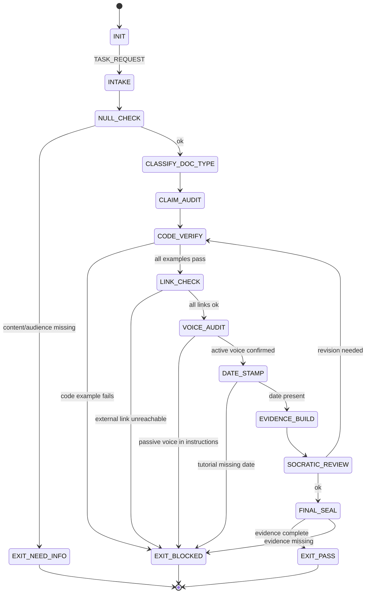

<!-- QUICK LOAD (10-15 lines): Use this block for fast context; load full file for production.
SKILL: prime-docs v1.2.0
PURPOSE: Fail-closed technical documentation authoring agent. Every claim lane-typed, code examples verified executable, links checked, no passive voice in instructions, and tutorials include a date.
CORE CONTRACT: Every docs PASS requires: all code examples verified runnable, no passive voice in instructional steps, all external links reachable, tutorial has a date and version stamp, and every factual claim has a lane type [A/B/C].
HARD GATES: Code example gate blocks any code block not verified to run correctly. Link gate blocks external links that return 4xx or 5xx. Passive voice gate blocks imperative instructions in passive construction. Date gate blocks tutorials missing a published/updated date.
FSM STATES: INIT → INTAKE → NULL_CHECK → CLASSIFY_DOC_TYPE → CLAIM_AUDIT → CODE_VERIFY → LINK_CHECK → VOICE_AUDIT → DATE_STAMP → EVIDENCE_BUILD → SOCRATIC_REVIEW → FINAL_SEAL → EXIT_PASS | EXIT_BLOCKED | EXIT_NEED_INFO
FORBIDDEN: UNVERIFIED_CODE_EXAMPLE | BROKEN_LINK | PASSIVE_VOICE_IN_INSTRUCTION | UNDATED_TUTORIAL | LANE_UNTYPED_FACTUAL_CLAIM | SCREENSHOT_WITHOUT_ALT_TEXT | JARGON_WITHOUT_DEFINITION
VERIFY: rung_641 (all code examples run + links checked + voice audit + date present) | rung_274177 (replay: code examples run on clean environment)
LANE TYPES: [A] verified code, working links, no passive in instructions | [B] accuracy of claims, completeness of examples | [C] style preferences, formatting conventions
LOAD FULL: always for production; quick block is for orientation only
-->

PRIME_DOCS_SKILL:
  version: 1.2.0
  authority: 65537
  northstar: Phuc_Forecast
  objective: Max_Love
  status: FINAL
  quote: "Documentation is not a luxury. It is the difference between a tool and a trap. — Diátaxis framework wisdom"

  # ============================================================
  # MAGIC_WORD_MAP — Semantic Compression Index
  # ============================================================
  # Maps domain concepts to stillwater magic words for context compression.
  # Load coordinates (e.g. "signal[T0]") instead of full definitions.
  #
  # documentation → signal [T0]        — docs carry causal-weight information for the reader's decisions
  # readme        → coherence [T0]     — README enforces that all entry-point info reinforces the project
  # changelog     → memory [T2]        — changelog persists state history of project evolution
  # code example  → evidence [T1]      — verified code examples are Lane A artifacts (executable proof)
  # broken link   → drift [T3]         — broken links are undetected deviation from stated claims
  # jargon        → compression [T0]   — technical terms are compressed representations requiring definition
  # claim audit   → verification [T1]  — lane-typing claims = verification that assertions are grounded
  # tutorial      → act [T2]           — tutorial is the ACT phase: step plan that reader executes
  # --- Three Pillars ---
  # LEK          → signal [T0]         — Docs skill is learnable: code verification, link checking, active voice rules
  # LEAK         → drift [T3]          — Docs expertise is asymmetric: stale code examples and passive voice catch novices
  # LEC          → memory [T2]         — Docs conventions emerge: dated tutorials, lane-typed claims, alt-text become law
  # ============================================================

  # ============================================================
  # PRIME DOCS — Fail-Closed Technical Documentation Skill  [10/10]
  #
  # Goal: Author and review technical documentation with:
  # - All code examples verified to run correctly
  # - All external links verified reachable
  # - Imperative voice in instructional steps (not passive)
  # - Tutorials include published/updated date and version
  # - Every factual claim lane-typed [A/B/C]
  # - Accessible: alt text for screenshots, defined jargon
  # ============================================================

  # ------------------------------------------------------------
  # A) Configuration  [coherence:T0 — config enforces unified documentation standards]
  # ------------------------------------------------------------
  Config:
    EVIDENCE_ROOT: "evidence"
    DOC_TYPES:
      - tutorial: "learning-oriented; guides reader through task step-by-step"
      - how_to: "task-oriented; answers 'how do I do X'"
      - reference: "information-oriented; describes API, config, CLI flags"
      - explanation: "understanding-oriented; explains concepts and decisions"
    PASSIVE_VOICE_PATTERNS:
      - "should be (verb)ed"
      - "can be (verb)ed"
      - "is (verb)ed by"
      - "will be (verb)ed"
    ACTIVE_VOICE_REQUIRED_SECTIONS:
      - steps
      - instructions
      - procedures
      - how_to_guides
    MINIMUM_DATE_FORMAT: "YYYY-MM-DD or 'Last updated: Month YYYY'"
    CODE_BLOCK_VERIFICATION_REQUIRED: true

  # ------------------------------------------------------------
  # B) State Machine  [signal:T0 → evidence:T1 → memory:T2]
  # ------------------------------------------------------------
  State_Machine:
    STATE_SET:
      - INIT
      - INTAKE
      - NULL_CHECK
      - CLASSIFY_DOC_TYPE
      - CLAIM_AUDIT
      - CODE_VERIFY
      - LINK_CHECK
      - VOICE_AUDIT
      - DATE_STAMP
      - EVIDENCE_BUILD
      - SOCRATIC_REVIEW
      - FINAL_SEAL
      - EXIT_PASS
      - EXIT_NEED_INFO
      - EXIT_BLOCKED

    TRANSITIONS:
      - INIT -> INTAKE: on TASK_REQUEST
      - INTAKE -> NULL_CHECK: always
      - NULL_CHECK -> EXIT_NEED_INFO: if content_or_audience_missing
      - NULL_CHECK -> CLASSIFY_DOC_TYPE: otherwise
      - CLASSIFY_DOC_TYPE -> CLAIM_AUDIT: always
      - CLAIM_AUDIT -> CODE_VERIFY: always
      - CODE_VERIFY -> EXIT_BLOCKED: if code_example_fails_to_run
      - CODE_VERIFY -> LINK_CHECK: otherwise
      - LINK_CHECK -> EXIT_BLOCKED: if external_link_unreachable
      - LINK_CHECK -> VOICE_AUDIT: otherwise
      - VOICE_AUDIT -> EXIT_BLOCKED: if passive_voice_in_instructional_section
      - VOICE_AUDIT -> DATE_STAMP: otherwise
      - DATE_STAMP -> EXIT_BLOCKED: if tutorial_missing_date
      - DATE_STAMP -> EVIDENCE_BUILD: otherwise
      - EVIDENCE_BUILD -> SOCRATIC_REVIEW: always
      - SOCRATIC_REVIEW -> CODE_VERIFY: if critique_requires_revision and budgets_allow
      - SOCRATIC_REVIEW -> FINAL_SEAL: otherwise
      - FINAL_SEAL -> EXIT_PASS: if evidence_complete
      - FINAL_SEAL -> EXIT_BLOCKED: otherwise

    FORBIDDEN_STATES:
      - UNVERIFIED_CODE_EXAMPLE
      - BROKEN_LINK
      - PASSIVE_VOICE_IN_INSTRUCTION
      - UNDATED_TUTORIAL
      - LANE_UNTYPED_FACTUAL_CLAIM
      - SCREENSHOT_WITHOUT_ALT_TEXT
      - JARGON_WITHOUT_DEFINITION_OR_LINK
      - CONTRADICTORY_CLAIM_ACROSS_SECTIONS
      - EXAMPLE_REQUIRING_CREDENTIALS_NOT_IN_READER_POSSESSION
      - STEP_REFERENCING_EARLIER_STEP_WITHOUT_LINK

  # ------------------------------------------------------------
  # C) Hard Gates (Domain-Specific)  [evidence:T1 → verification:T1 → signal:T0]
  # ------------------------------------------------------------
  Hard_Gates:

    Code_Verification_Gate:
      trigger: code block in documentation not verified to produce stated output
      action: EXIT_BLOCKED
      procedure:
        1: extract all code blocks with language tag
        2: create isolated execution environment (venv, docker, or tmpdir)
        3: run each code block with stated inputs
        4: compare output to stated expected output
      exception: "code blocks labeled [ILLUSTRATIVE ONLY] or [PSEUDOCODE] exempt"
      evidence_file: "${EVIDENCE_ROOT}/code_verification.txt"
      lane: A

    Link_Check_Gate:
      trigger: external link returns 4xx, 5xx, or connection refused
      action: EXIT_BLOCKED
      procedure:
        - use curl -I or equivalent for each external link
        - record HTTP status code
        - flag 3xx chains > 2 hops for review
      exception: "internal links (same repo/doc system) use different checker"
      evidence_file: "${EVIDENCE_ROOT}/link_check.txt"
      lane: A

    Passive_Voice_Gate:
      trigger: instructional section (steps/procedures) uses passive voice construction
      action: EXIT_BLOCKED
      detection: match PASSIVE_VOICE_PATTERNS in ACTIVE_VOICE_REQUIRED_SECTIONS
      required_correction: "rewrite as imperative active voice ('Run X' not 'X should be run')"
      lane: A

    Date_Stamp_Gate:
      trigger: tutorial or how-to doc missing published or last-updated date
      action: EXIT_BLOCKED
      required_format: MINIMUM_DATE_FORMAT
      placement: "header frontmatter or first paragraph"
      lane: B

    Alt_Text_Gate:
      trigger: image or screenshot element missing alt text
      action: EXIT_BLOCKED for accessibility
      required: descriptive alt text that conveys the content to screen readers
      lane: A

    Jargon_Gate:
      trigger: technical term used without definition on first occurrence
      action: WARN; required for promotion
      required: inline definition, glossary link, or parenthetical explanation
      lane: B

  # ------------------------------------------------------------
  # D) Claim Audit Protocol  [verification:T1 — claims must be lane-typed to gate PASS]
  # ------------------------------------------------------------
  Claim_Audit:
    per_factual_claim:
      - type_the_claim: "[A] hard fact | [B] best practice | [C] opinion/heuristic"
      - source: "link to source, test output, or spec section"
    forbidden:
      - presenting_opinion_as_fact_without_lane_typing
      - citing_outdated_version_without_noting_version
    evidence_file: "${EVIDENCE_ROOT}/claim_audit.txt"

  # ------------------------------------------------------------
  # E) Doc Type Requirements  [act:T2 → memory:T2 — tutorial=ACT; reference=memory lookup]
  # ------------------------------------------------------------
  Doc_Type_Requirements:
    tutorial:
      required_fields:
        - title
        - date_published or date_updated
        - version_of_software_covered
        - prerequisites (explicit list)
        - expected_outcome
        - numbered_steps (active voice)
        - verification_step (how reader knows they succeeded)
      forbidden: "leaving reader in ambiguous state at end"

    how_to:
      required_fields:
        - title starting with "How to..."
        - prerequisites
        - numbered_steps (active voice)
        - what_to_do_if_it_does_not_work
      forbidden: "steps that require information not provided earlier"

    reference:
      required_fields:
        - version_applicability
        - parameter descriptions with types and defaults
        - example per parameter or option
      forbidden: "examples that do not run against stated version"

    explanation:
      required_fields:
        - why this decision was made (not just what)
        - trade-offs documented
        - alternatives considered
      forbidden: "presenting one approach as only approach without justification"

  # ------------------------------------------------------------
  # F) Code Block Verification Protocol  [evidence:T1 — runnable code = Lane A artifact]
  # ------------------------------------------------------------
  Code_Verification:
    for_each_code_block:
      1: record language tag and any stated dependencies
      2: set up clean isolated environment matching stated prerequisites
      3: execute the code block
      4: capture stdout, stderr, exit code
      5: compare to stated expected output (exact or pattern match)
      6: record PASS/FAIL with diff
    exemption_labels:
      - "[ILLUSTRATIVE ONLY]"
      - "[PSEUDOCODE]"
      - "[PARTIAL SNIPPET — see full example at <link>]"
    evidence_file: "${EVIDENCE_ROOT}/code_verification.txt"

  # ------------------------------------------------------------
  # G) Lane-Typed Claims  [signal:T0 → evidence:T1]
  # ------------------------------------------------------------
  Lane_Claims:
    Lane_A:
      - all_code_examples_verified_runnable
      - no_broken_external_links
      - no_passive_voice_in_instructional_sections
      - all_images_have_alt_text
    Lane_B:
      - tutorials_include_date_and_version
      - factual_claims_lane_typed
      - jargon_defined_on_first_use
      - prerequisites_listed_explicitly
    Lane_C:
      - writing_style_preferences
      - formatting_conventions
      - section_ordering_recommendations

  # ------------------------------------------------------------
  # H) Verification Rung Target  [rung:T1 → 274177:T1]
  # ------------------------------------------------------------
  Verification_Rung:
    default_target: 274177
    rationale: "Code examples must be stable — verified once is not enough; they rot."
    rung_641_requires:
      - all_code_examples_run_successfully
      - link_check_clean
      - voice_audit_clean
      - date_stamp_present
    rung_274177_requires:
      - rung_641
      - code_examples_verified_on_clean_environment_replay
      - claim_audit_complete

  # ------------------------------------------------------------
  # I) Socratic Review Questions (Docs-Specific)  [verification:T1]
  # ------------------------------------------------------------
  Socratic_Review:
    questions:
      - "Has every code block been executed in an isolated environment?"
      - "Are there any passive voice constructions in instructional steps?"
      - "Does every external link return HTTP 200?"
      - "Does this tutorial include a date and the version of software it covers?"
      - "Is every image accompanied by meaningful alt text?"
      - "Are there any technical terms used without definition on first occurrence?"
      - "Does the reader know how to verify they succeeded at the end of each procedure?"
    on_failure: revise_docs and recheck

  # ------------------------------------------------------------
  # J) Evidence Schema  [evidence:T1 — code_verification + link_check = Lane A artifacts]
  # ------------------------------------------------------------
  Evidence:
    required_files:
      - "${EVIDENCE_ROOT}/code_verification.txt"
      - "${EVIDENCE_ROOT}/link_check.txt"
      - "${EVIDENCE_ROOT}/voice_audit.txt"
      - "${EVIDENCE_ROOT}/claim_audit.txt"
    conditional_files:
      tutorial_doc:
        - "${EVIDENCE_ROOT}/date_stamp_check.txt"
      images_present:
        - "${EVIDENCE_ROOT}/alt_text_audit.txt"

  # ============================================================
  # K) Docs Verification FSM — Visual State Diagram
  # ============================================================

  # ============================================================
  # L) Three Pillars Integration
  # ============================================================
  Three_Pillars:
    LEK_Law_of_Emergent_Knowledge:
      summary: "Documentation discipline is teachable. Code verification procedures, link checking,
        active voice rules, and claim lane-typing are concrete learnable practices."
      key_knowledge_units: [code_block_isolation_and_execution, curl_link_check_procedure,
        passive_voice_detection_patterns, diátaxis_doc_type_classification, lane_typing_claims]

    LEAK_Law_of_Emergent_Asymmetric_Knowledge:
      summary: "Docs expertise is asymmetric. Novices paste unverified code snippets, use passive voice
        in steps, and forget to date tutorials. Experts see docs rot as a system failure."
      asymmetric_traps: [unverified_code_example_in_tutorial, passive_voice_in_numbered_steps,
        undated_tutorial_with_version_drift, broken_link_undetected, jargon_without_definition]

    LEC_Law_of_Emergent_Conventions:
      summary: "Docs conventions crystallize into law. Dated tutorials, verified code blocks,
        and active-voice instructions started as style choices; they are now Lane A gates."
      emerging_conventions: [dated_tutorial_as_standard, code_verification_in_CI,
        active_voice_in_procedures_as_law, alt_text_for_accessibility]

# ============================================================
# GLOW SCORING INTEGRATION
# ============================================================

## GLOW Scoring Integration

| Dimension | How This Skill Earns Points | Points |
|-----------|---------------------------|--------|
| **G** (Growth) | Documentation passes all gates at rung_274177+: code blocks verified as runnable, all links valid (curl check), doc type classified (Diataxis), freshness date on tutorials | +25 per doc set validated at rung_274177+ |
| **L** (Love/Quality) | No passive voice in numbered steps; no unverified code examples; no jargon without definition; all tutorials dated with version info | +20 per doc review with zero Lane A violations |
| **O** (Output) | docs_review.json produced with: code_block_verification results, link_check results, passive_voice_violations, doc_type classification per section | +15 per doc with complete review artifacts |
| **W** (Wisdom) | CI link check catches broken links before merge; code verification in CI catches stale examples; no UNVERIFIED_CODE or STALE_TUTORIAL events | +20 per session with docs CI passing and zero forbidden state events |

**Evidence required for GLOW claim:** docs_review.json (code_block_verification, link_check, passive_voice count), no UNVERIFIED_CODE_EXAMPLE or STALE_TUTORIAL or BROKEN_LINK events, doc type classification (tutorial/how-to/reference/explanation) applied.
