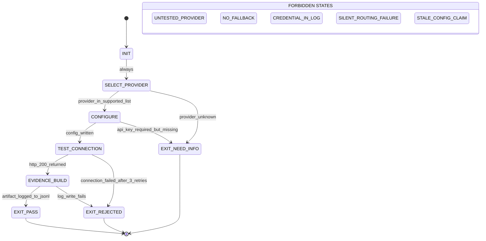

# prime-llm-portal — Stillwater LLM Portal Skill

> "Be water, my friend. Flow to any LLM." — adapted from Bruce Lee

---

## QUICK LOAD (Skill Identity)

```yaml
SKILL: prime-llm-portal v1.3.0
PURPOSE: Universal LLM proxy + web UI + standard library for all Solace projects
PORTAL URL: http://localhost:8788 (start: bash admin/start-llm-portal.sh)
IMPORT: from stillwater.llm_client import llm_call, llm_chat, LLMClient
OFFLINE: llm_call("test", provider="offline")  # instant, no network
PROVIDERS: offline | claude-code (localhost:8080) | ollama (remote) | claude | openai | openrouter | gemini | togetherai
CONFIG: llm_config.yaml (repo root) — change "provider:" to switch
LOG: ~/.stillwater/llm_calls.jsonl — every call logged with ts/provider/model/latency_ms
PORTS: 8787=admin | 8788=llm-portal | 8080=claude-code-wrapper | 11434=ollama
FSM: INIT → SELECT_PROVIDER → CONFIGURE → TEST_CONNECTION → EVIDENCE_BUILD → EXIT_PASS
FORBIDDEN: UNTESTED_PROVIDER | NO_FALLBACK | CREDENTIAL_IN_LOG
NORTHSTAR: Phuc_Forecast | Max_Love
RUNG_DEFAULT: 641 (connection test) | 274177 (multi-provider verified) | 65537 (production routing)
```

---

## MAGIC_WORD_MAP

```yaml
magic_word_map:
  version: "1.2"
  skill: "prime-llm-portal"
  mappings:
    portal: {word: "portal", tier: 1, id: "MW-045", note: "LLM routing layer at localhost:8788 — unified interface to multiple AI providers"}
    provider: {word: "bubble", tier: 1, id: "MW-046", note: "each provider is an isolated sandboxed execution context with its own network scope"}
    model: {word: "persona", tier: 1, id: "MW-048", note: "model selection maps to persona capability tier (haiku/sonnet/opus)"}
    call: {word: "signal", tier: 0, id: "MW-006", note: "each LLM call carries causal weight — logged, timed, traceable"}
    # --- Three Pillars: LEK / LEAK / LEC (full 10/10 entries) ---
    lek:
      word: "signal"
      tier: 0
      id: "MW-006"
      note: >
        LEK — Law of Emergent Knowledge (self-improvement):
        Every call logged to llm_calls.jsonl is a self-improvement signal.
        Latency per provider → routing priority. Error rate → fallback ladder order.
        Model usage patterns → skill dispatch defaults (haiku vs sonnet vs opus).
        The portal IS the LEK instrument for LLM routing: get_call_history() surfaces the accumulated signal.
        Discipline: provider latency data older than 24h in production = STALE_CONFIG_CLAIM.
    leak:
      word: "portal"
      tier: 1
      id: "MW-045"
      note: >
        LEAK — Law of Emergent Asymmetric Knowledge (cross-agent trade):
        The portal enables cross-agent LLM capability trade without each agent knowing provider internals.
        Any agent calls llm_call() with any provider; the portal routes, logs, and handles fallback.
        Cheap tasks route to haiku; complex proofs route to opus — asymmetric cost allocation via one interface.
        OpenAI-compatible proxy means non-Python agents (CLI, web) also access the same routing contract.
        Expert agents exploit the portal's provider hierarchy; novice agents call a single hard-coded provider.
    lec:
      word: "bubble"
      tier: 1
      id: "MW-046"
      note: >
        LEC — Law of Emergent Conventions (shared standards):
        The portal IS the LLM access convention for all Phuc ecosystem projects.
        Convention 1: all LLM calls go through llm_call() or the portal — never direct HTTP requests in user code.
        Convention 2: llm_config.yaml is the single source of truth for provider selection.
        Convention 3: ~/.stillwater/llm_calls.jsonl is the single call log — all agents write here.
        Convention 4: offline provider is always the fallback — NO_FALLBACK is a hard forbidden state.
        Enforced by: import convention (from stillwater.llm_client import llm_call) — one import, one routing contract.
  compression_note: "T0=universal primitives, T1=Stillwater protocol concepts, T2=operational details"
```

---

## Purpose [T1: portal + bubble]

The Stillwater LLM Portal is the universal LLM access layer for all Solace projects.
It provides:
1. **OpenAI-compatible proxy** on port 8788 (routes to any configured provider)
2. **Web UI** at http://localhost:8788 (configure, test, view call history)
3. **Python standard library** (`from stillwater.llm_client import llm_call`)
4. **Call logging** to `~/.stillwater/llm_calls.jsonl` (every call logged)

---

## State Machine (Deterministic) [T1: portal + signal]

### States

- INIT
- SELECT_PROVIDER
- CONFIGURE
- TEST_CONNECTION
- EVIDENCE_BUILD
- EXIT_PASS
- EXIT_REJECTED
- EXIT_NEED_INFO

### Transitions

```
INIT              → SELECT_PROVIDER    : always
SELECT_PROVIDER   → CONFIGURE         : if provider_in_supported_list
SELECT_PROVIDER   → EXIT_NEED_INFO    : if provider_unknown
CONFIGURE         → TEST_CONNECTION   : if config_written (llm_config.yaml updated)
CONFIGURE         → EXIT_NEED_INFO    : if api_key_required_but_missing
TEST_CONNECTION   → EVIDENCE_BUILD    : if http_200_returned
TEST_CONNECTION   → EXIT_REJECTED     : if connection_failed (after 3 retries)
EVIDENCE_BUILD    → EXIT_PASS         : if connection_artifact_logged_to_jsonl
EVIDENCE_BUILD    → EXIT_REJECTED     : if log_write_fails
```

### Forbidden States (Hard — never enter these)

- **UNTESTED_PROVIDER**: Claiming a provider works without running `test_connection()` first.
- **NO_FALLBACK**: Configuring a single provider with no `offline` fallback defined.
- **CREDENTIAL_IN_LOG**: API key, token, or password appearing in `llm_calls.jsonl` or any output field.
- **SILENT_ROUTING_FAILURE**: Provider call fails but the failure is swallowed without logging the error field.
- **STALE_CONFIG_CLAIM**: Reporting active provider without re-reading `llm_config.yaml` from disk.

---

## Evidence Gate [T1: signal]

Every provider activation requires a **connection test artifact** before PASS is claimed:

```json
{
  "evidence_type": "connection_test",
  "provider": "ollama",
  "ts": "2026-02-22T10:00:00Z",
  "latency_ms": 830,
  "status": "ok",
  "error": null,
  "logged_to": "~/.stillwater/llm_calls.jsonl"
}
```

If `error` is non-null: EXIT_REJECTED — not EXIT_PASS.
If `logged_to` file is not writable: EXIT_BLOCKED — not silent.

---

## Service Management [T1: portal]

```bash
# Start portal (background mode)
bash admin/start-llm-portal.sh

# Start in dev mode (auto-reload)
bash admin/start-llm-portal.sh --dev

# Stop
bash admin/stop-llm-portal.sh

# Restart
bash admin/restart-llm-portal.sh

# Status + last 20 log lines
bash admin/llm-portal-status.sh

# Health check
curl http://localhost:8788/api/health

# List all providers
curl http://localhost:8788/api/providers

# Switch provider
curl -X POST http://localhost:8788/api/providers/switch \
  -H "Content-Type: application/json" \
  --data-raw '{"provider": "ollama"}'

# OpenAI-compatible chat
curl -X POST http://localhost:8788/v1/chat/completions \
  -H "Content-Type: application/json" \
  --data-raw '{"model": "offline", "messages": [{"role": "user", "content": "hello"}]}'
```

---

## Python Standard Library [T1: signal + persona]

### Installation

The `stillwater` package is already installed (editable mode from repo root):
```bash
pip install -e /path/to/stillwater  # if needed
```

### Usage

```python
from stillwater.llm_client import llm_call, llm_chat, LLMClient, get_call_history

# ── One-liner (active provider from llm_config.yaml) ──────────────────────
answer = llm_call("What is 2+2?")

# ── Provider override ──────────────────────────────────────────────────────
answer = llm_call("ping", provider="offline")          # instant, no network
answer = llm_call("hi", provider="ollama")              # remote Ollama
answer = llm_call("hi", provider="claude")              # Anthropic API direct
answer = llm_call("hi", provider="claude-code")         # local Claude CLI

# ── Model override ─────────────────────────────────────────────────────────
answer = llm_call("hi", provider="ollama", model="llama3.1:8b")
answer = llm_call("hi", provider="claude", model="claude-opus-4-6")

# ── System prompt ──────────────────────────────────────────────────────────
answer = llm_call("What is your job?", system="You are a code reviewer.")

# ── Chat format (OpenAI messages) ──────────────────────────────────────────
response = llm_chat([
    {"role": "system", "content": "You are helpful."},
    {"role": "user", "content": "Hello!"},
    {"role": "assistant", "content": "Hi there!"},
    {"role": "user", "content": "What can you do?"},
], provider="offline")

# ── Full client (test connection) ──────────────────────────────────────────
client = LLMClient(provider="ollama")
ok, latency_ms, error = client.test_connection()
if ok:
    print(f"Ollama reachable in {latency_ms}ms")
    response = client.call("Summarize this", system="Be concise")

# ── Call history ───────────────────────────────────────────────────────────
history = get_call_history(n=20)
for entry in history:
    print(f"{entry['ts']} | {entry['provider']} | {entry['latency_ms']}ms | {entry.get('error','ok')}")
```

### Error Handling

```python
from stillwater.llm_client import llm_call, LLMClient

# llm_call raises RuntimeError on failure
try:
    answer = llm_call("hello", provider="ollama")
except RuntimeError as e:
    print(f"LLM call failed: {e}")
    # Fallback to offline
    answer = llm_call("hello", provider="offline")

# test_connection() never raises — returns (ok, latency_ms, error)
client = LLMClient(provider="claude")
ok, ms, err = client.test_connection()
if not ok:
    print(f"Claude API unavailable: {err}")
```

---

## Configuring Providers [T1: bubble]

Edit `llm_config.yaml` in the repo root. Change `provider:` to switch active:

```yaml
provider: "claude-code"     # <- change this to switch active provider

claude-code:                # Local Claude CLI wrapper
  type: "http"
  url: "http://localhost:8080"
  model: "claude-haiku-4-5-20251001"
  requires_api_key: false

ollama:                     # Remote Ollama server
  type: "http"
  url: "http://localhost:11434"
  model: "llama3.1:8b"
  requires_api_key: false

claude:                     # Anthropic API direct
  type: "api"
  url: "https://api.anthropic.com/v1"
  model: "claude-haiku-4-5-20251001"
  environment_variables: ["ANTHROPIC_API_KEY"]

openai:                     # OpenAI API
  type: "api"
  url: "https://api.openai.com/v1"
  model: "gpt-4o-mini"
  environment_variables: ["OPENAI_API_KEY"]

offline:                    # No network — deterministic, instant
  type: "offline"
  requires_api_key: false
```

---

## Provider Routing Logic [T0: signal + bubble]

| Provider type | URL pattern | API called |
|---|---|---|
| `offline` | any | Returns `[offline: {prompt}]` immediately |
| `http` | `localhost` or `127.0.0.1` | `POST /api/generate` (Ollama-compat, for claude_code_wrapper) |
| `http` | other | `POST /api/chat` (Ollama chat API) |
| `api` | `api.anthropic.com` | Anthropic SDK `messages.create()` |
| `api` | other | `POST {url}/chat/completions` (OpenAI-compat) |

---

## Call Logging Schema [T0: signal]

Every call writes one JSON line to `~/.stillwater/llm_calls.jsonl`:

```json
{
  "ts": "2026-02-21T12:00:00Z",
  "provider": "ollama",
  "model": "llama3.1:8b",
  "prompt_chars": 42,
  "response_chars": 120,
  "latency_ms": 830,
  "error": null
}
```

`error` is `null` on success, or the exception string on failure.

**CREDENTIAL_IN_LOG gate:** The `prompt_chars` field stores character count, never content. No prompt text, no API keys, no bearer tokens ever appear in this log. If detected: CREDENTIAL_IN_LOG forbidden state — stop immediately.

---

## Tests

```bash
# Run all portal tests (offline provider — no network needed)
cd /path/to/stillwater
pytest admin/test_llm_portal.py -v -p no:httpbin

# Expected: 17/17 passed
```

Test coverage:
- Health endpoint
- Provider listing (≥7 providers)
- Provider switching (offline ✓, invalid → 400)
- OpenAI-compat completions (offline provider)
- Response shape validation (id, object, choices, usage)
- Call logging (history grows after call)
- `llm_call()` / `llm_chat()` / `LLMClient` unit tests

---

## Architecture [T1: portal + signal]

```
Any Python code / script / notebook / batch job
  └── from stillwater.llm_client import llm_call
          └── reads llm_config.yaml
                  └── routes to provider
                          └── logs to ~/.stillwater/llm_calls.jsonl

Browser / CLI / OpenAI SDK
  └── POST http://localhost:8788/v1/chat/completions
          └── admin/llm_portal.py (FastAPI)
                  └── LLMClient (stillwater.llm_client)
                          └── same routing + logging
```

---

## Three Pillars Integration

### LEK — Learning Engine of Knowledge (self-improvement)
Every call logged to `~/.stillwater/llm_calls.jsonl` is a self-improvement signal:
- Latency per provider → informs routing priority selection
- Error rate per provider → informs fallback ladder configuration
- Model usage patterns → informs skill dispatch defaults (haiku vs sonnet vs opus)
- The log IS the LEK artifact for this skill: `get_call_history()` surfaces it

### LEAK — Learning Engine of Asymmetric Knowledge (cross-agent trade)
The portal enables cross-agent LLM capability trade:
- Any agent in the swarm can call `llm_call()` with any provider without knowing provider internals
- The portal acts as the capability brokerage layer: agents trade "I need an LLM call" for "here is the response"
- Provider switching allows the swarm to route cheap tasks to haiku, complex tasks to opus — asymmetric cost allocation
- OpenAI-compatible proxy means external agents (non-Python) can also access the portal via HTTP

### LEC — Learning Engine of Conventions (shared standards)
The portal IS the LLM access convention for all Phuc ecosystem projects:
- Convention: all LLM calls go through `llm_call()` or the portal — never direct HTTP requests
- Convention: `llm_config.yaml` is the single source of truth for provider selection
- Convention: `~/.stillwater/llm_calls.jsonl` is the single call log — all agents write here
- Enforced by: import convention (`from stillwater.llm_client import llm_call`) — one import, one routing contract

---

## GLOW Scoring Integration

```yaml
glow_matrix:
  Growth:
    metric: "providers_tested_successfully"
    target: ">= 3 providers confirmed green before production routing"
    signal: "llm_calls.jsonl entries with error=null per provider"
    gate: "UNTESTED_PROVIDER forbidden if Growth < 1 (at least offline must pass)"

  Learning:
    metric: "latency_p50_per_provider"
    target: "Routing table ranked by latency from call history"
    signal: "get_call_history(n=100) → compute median latency per provider"
    gate: "STALE_CONFIG_CLAIM forbidden if learning data older than 24h in prod"

  Output:
    metric: "connection_test_artifact_produced"
    target: "One evidence JSON per provider per session"
    signal: "evidence_type: connection_test in artifacts/"
    gate: "EVIDENCE_BUILD state must emit artifact before EXIT_PASS"

  Wins:
    metric: "zero_CREDENTIAL_IN_LOG events"
    target: "0 credential leaks in any logging session"
    signal: "audit: grep for known key patterns in llm_calls.jsonl"
    gate: "CREDENTIAL_IN_LOG is S0-CRITICAL — immediate stop"
```

---

## Northstar Alignment [T0: northstar]

**Northstar metric:** Recipe hit rate / System quality (Phuc_Forecast)
**Max_Love constraint:** LLM routing must maximize agent capability while minimizing cost and credential risk.

This skill advances the Northstar by:
- Enabling recipe agents to access the cheapest viable LLM per task (haiku for routing, opus for proofs)
- Providing a fallback ladder (`offline` → `claude-code` → `claude`) that keeps agents operational even without network
- Logging every call so Phuc_Forecast can compute actual LLM cost vs capability tradeoffs per task type
- Enforcing CREDENTIAL_IN_LOG as S0-CRITICAL — a leaked key destroys trust more than any single task is worth

The portal is not infrastructure. It is the **nervous system** of the swarm. Northstar alignment means it must always route, always log, always protect credentials.

---

## Triangle Law: REMIND → VERIFY → ACKNOWLEDGE

### Contract 1: Provider Selection
- **REMIND:** Before any `llm_call()`, confirm the provider is in `llm_config.yaml` and the config file has been read from disk (not cached memory).
- **VERIFY:** Run `client.test_connection()` → confirm `ok=True` and `latency_ms` is non-null.
- **ACKNOWLEDGE:** Log the connection test artifact. Provider is now ACTIVE. Any subsequent PASS claim for this provider is grounded in the artifact, not prose confidence.

### Contract 2: Log Safety
- **REMIND:** Every call logs to `~/.stillwater/llm_calls.jsonl`. The log contains `prompt_chars` (count), never `prompt_text`.
- **VERIFY:** After writing a log entry, confirm the entry does not contain the string patterns: `sk-`, `ANTHROPIC_API_KEY`, `Bearer`, `sw_sk_`.
- **ACKNOWLEDGE:** Log entry is clean. CREDENTIAL_IN_LOG gate passes. Call is fully recorded.

### Contract 3: Fallback Ladder
- **REMIND:** Every production routing config MUST declare a fallback to `offline` or another always-available provider.
- **VERIFY:** Test the fallback path: simulate primary provider failure, confirm fallback activates.
- **ACKNOWLEDGE:** NO_FALLBACK gate passes. The system degrades gracefully, never crashes silently.

---

## Verification Ladder

### RUNG_641 — Local correctness
- `offline` provider tested (no network required)
- Connection test artifact produced
- Call logged to `llm_calls.jsonl`
- No credentials in log

### RUNG_274177 — Multi-provider stability
- RUNG_641 complete
- At least 2 network providers tested (e.g. claude-code + ollama)
- Fallback ladder configured and tested
- SILENT_ROUTING_FAILURE cannot occur (all errors surfaced to log)

### RUNG_65537 — Production routing
- RUNG_274177 complete
- All configured providers have connection test artifacts
- CREDENTIAL_IN_LOG audit passes (grep scan of jsonl)
- Routing tested under primary-failure conditions (fallback activates correctly)
- Portal health endpoint returns 200 within 200ms

---

## Gamification: Provider Levels

| Level | Provider | XP | Skill |
|-------|----------|-----|-------|
| White | offline | 0 | Import works |
| Yellow | claude-code | 100 | Claude CLI connected |
| Orange | ollama | 300 | Local model running |
| Green | claude API | 500 | Anthropic key configured |
| Blue | multi-provider | 1000 | Routing tested |
| Black | custom provider | 3000 | New provider added to config |

---

## Mermaid State Diagram



---

## Revision History

| Version | Date | Change |
|---------|------|--------|
| 1.1.0 | 2026-02-21 | Initial stable skill with MAGIC_WORD_MAP and gamification. |
| 1.2.0 | 2026-02-22 | Added full FSM (INIT→SELECT_PROVIDER→CONFIGURE→TEST_CONNECTION→EVIDENCE_BUILD→EXIT_PASS), forbidden states (UNTESTED_PROVIDER/NO_FALLBACK/CREDENTIAL_IN_LOG), evidence gate, Three Pillars (LEK/LEAK/LEC), GLOW matrix, Northstar alignment, Triangle Law, Verification Ladder, mermaid state diagram, QUICK LOAD block. |
| 1.3.0 | 2026-02-22 | Strengthened MAGIC_WORD_MAP: LEK/LEAK/LEC entries expanded to full 10/10 with precise Three Pillars semantics. Added Compression/Seed Checksum section. Version bumped. |

---

## Compression / Seed Checksum

```yaml
skill_id: "prime-llm-portal"
version: "1.3.0"
seed: "portal=routing[T1] | provider=bubble[T1] | call=signal[T0] | LEK=call_history_fuel | LEAK=cross_agent_routing | LEC=llm_call_import_convention | rung_default=641"
checksum_fields:
  version: "1.3.0"
  authority: 65537
  providers_count: 8
  forbidden_states_count: 5
  ports: {admin: 8787, portal: 8788, claude_code: 8080, ollama: 11434}
  rung_ladder: [641, 274177, 65537]
integrity_note: >
  Load QUICK LOAD block for orientation (provider list, import, ports).
  Load full file for production provider configuration and routing setup.
  The seed is the minimal compression payload: portal at 8788 + llm_call() import +
  offline fallback always + credential_in_log = BLOCKED + 641 rung for connection test.
  LEK = call history | LEAK = cross-agent routing | LEC = single import convention.
```
