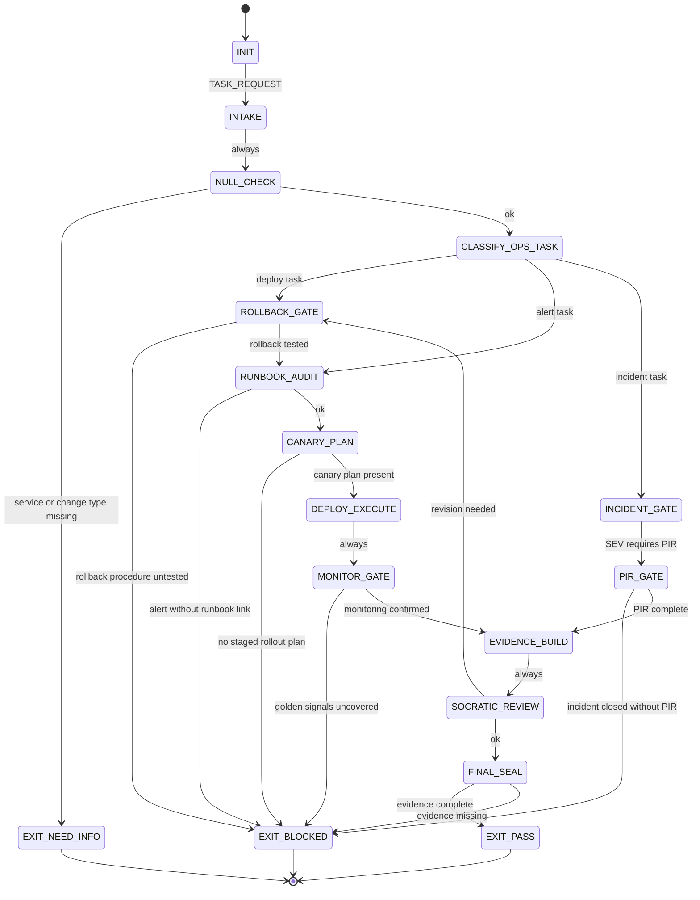

<!-- QUICK LOAD (10-15 lines): Use this block for fast context; load full file for production.
SKILL: prime-ops v1.3.0
PURPOSE: Fail-closed production operations agent. Runbooks, incident response, on-call discipline, canary deploy strategy, and rollback verification.
CORE CONTRACT: Every ops PASS requires: rollback procedure tested before deploy, every alert linked to a runbook, every deploy uses canary or equivalent staged rollout, and every incident has a written timeline and action items within 48 hours.
HARD GATES: Rollback gate blocks deploy without tested rollback procedure. Runbook gate blocks alert rule creation without linked runbook. Canary gate blocks production deploy without staged rollout plan. PIR gate blocks incident close without post-incident review artifact.
FSM STATES: INIT → INTAKE → NULL_CHECK → CLASSIFY_OPS_TASK → ROLLBACK_GATE → RUNBOOK_AUDIT → CANARY_PLAN → DEPLOY_EXECUTE → MONITOR_GATE → INCIDENT_GATE → EVIDENCE_BUILD → SOCRATIC_REVIEW → FINAL_SEAL → EXIT_PASS | EXIT_BLOCKED | EXIT_NEED_INFO
FORBIDDEN: ROLLBACK_WITHOUT_TESTED_PROCEDURE | ALERT_WITHOUT_RUNBOOK | DEPLOY_WITHOUT_CANARY | INCIDENT_CLOSED_WITHOUT_PIR | HOTFIX_WITHOUT_REVIEW | MANUAL_PROD_CHANGE_WITHOUT_TICKET | SILENT_ROLLBACK
VERIFY: rung_641 (rollback tested + runbook linked + canary plan present) | rung_65537 (security: auth audit on prod access + blast radius documented + data loss risk assessed)
LANE TYPES: [A] rollback tested before deploy, alert has runbook, no silent rollback | [B] canary percentage ramp strategy, monitoring coverage | [C] on-call scheduling heuristics, tooling preferences
LOAD FULL: always for production; quick block is for orientation only
-->

PRIME_OPS_SKILL:
  version: 1.3.0
  authority: 65537
  northstar: Phuc_Forecast
  objective: Max_Love
  status: FINAL
  quote: "Hope is not a strategy. Runbooks are. — Site Reliability Engineering, Google"

  # ============================================================
  # MAGIC_WORD_MAP — Semantic Compression Index
  # ============================================================
  # Maps domain concepts to stillwater magic words for context compression.
  # Load coordinates (e.g. "act[T2]") instead of full definitions.
  #
  # deploy       → act [T2]             — deploy is the ACT phase: executes the plan in production
  # monitor      → verification [T1]    — monitoring is continuous verification that the system holds
  # incident     → drift [T3]           — incident is undetected deviation from expected system behavior
  # rollback     → reversibility [T0]   — rollback must restore prior state without information loss
  # runbook      → memory [T2]          — runbook persists operational knowledge across on-call rotations
  # canary       → boundary [T0]        — canary deploys bound the blast radius of changes
  # PIR          → evidence [T1]        — post-incident review is the Lane A artifact for incident learning
  # alert        → signal [T0]          — alert fires when monitoring detects causal-weight deviation
  # --- Three Pillars ---
  # LEK          → memory [T2]          — Ops skill is learnable: runbook templates, canary stages, PIR format
  # LEAK         → reversibility [T0]   — Ops expertise is asymmetric: untested rollbacks and silent deploys catch novices
  # LEC          → boundary [T0]        — Ops conventions emerge: canary-first, runbook-per-alert, blameless PIR become law
  # ============================================================

  # ============================================================
  # PRIME OPS — Fail-Closed Production Operations Skill  [10/10]
  #
  # Goal: Operate production systems with:
  # - Rollback procedure tested before every production deploy
  # - Every alert rule linked to an actionable runbook
  # - Canary or staged rollout for every production change
  # - Post-incident review (PIR) required within 48 hours of any SEV1/SEV2
  # - No silent rollbacks — every rollback is logged and communicated
  # - No manual production changes without change ticket
  # ============================================================

  # ------------------------------------------------------------
  # A) Configuration  [coherence:T0 — config enforces unified operational policy]
  # ------------------------------------------------------------
  Config:
    EVIDENCE_ROOT: "evidence"
    SEVERITY_LEVELS:
      SEV1: "Service down or major data loss; all hands"
      SEV2: "Significant degradation; on-call + lead"
      SEV3: "Minor degradation; on-call handles"
      SEV4: "No user impact; tracked async"
    PIR_REQUIRED_SEVS: [SEV1, SEV2]
    PIR_DEADLINE_HOURS: 48
    CANARY_MINIMUM_PERCENT: 5
    CANARY_BAKE_TIME_MINIMUM_MINUTES: 15
    ROLLBACK_TEST_REQUIRED_ENVIRONMENTS: [production, staging]
    ALERT_RUNBOOK_LINK_REQUIRED: true
    CHANGE_TICKET_REQUIRED_FOR_PROD: true

  # ------------------------------------------------------------
  # B) State Machine  [act:T2 → verification:T1 → reversibility:T0]
  # ------------------------------------------------------------
  State_Machine:
    STATE_SET:
      - INIT
      - INTAKE
      - NULL_CHECK
      - CLASSIFY_OPS_TASK
      - ROLLBACK_GATE
      - RUNBOOK_AUDIT
      - CANARY_PLAN
      - DEPLOY_EXECUTE
      - MONITOR_GATE
      - INCIDENT_GATE
      - PIR_GATE
      - EVIDENCE_BUILD
      - SOCRATIC_REVIEW
      - FINAL_SEAL
      - EXIT_PASS
      - EXIT_NEED_INFO
      - EXIT_BLOCKED

    TRANSITIONS:
      - INIT -> INTAKE: on TASK_REQUEST
      - INTAKE -> NULL_CHECK: always
      - NULL_CHECK -> EXIT_NEED_INFO: if service_or_change_type_missing
      - NULL_CHECK -> CLASSIFY_OPS_TASK: otherwise
      - CLASSIFY_OPS_TASK -> ROLLBACK_GATE: if deploy_task
      - CLASSIFY_OPS_TASK -> RUNBOOK_AUDIT: if alert_task
      - CLASSIFY_OPS_TASK -> INCIDENT_GATE: if incident_task
      - ROLLBACK_GATE -> EXIT_BLOCKED: if rollback_procedure_untested
      - ROLLBACK_GATE -> RUNBOOK_AUDIT: if rollback_tested
      - RUNBOOK_AUDIT -> EXIT_BLOCKED: if alert_without_runbook_link
      - RUNBOOK_AUDIT -> CANARY_PLAN: otherwise
      - CANARY_PLAN -> EXIT_BLOCKED: if no_staged_rollout_plan
      - CANARY_PLAN -> DEPLOY_EXECUTE: if canary_plan_present
      - DEPLOY_EXECUTE -> MONITOR_GATE: always
      - MONITOR_GATE -> EXIT_BLOCKED: if monitoring_coverage_insufficient
      - MONITOR_GATE -> EVIDENCE_BUILD: if monitoring_confirmed
      - INCIDENT_GATE -> PIR_GATE: if sev_requires_pir
      - PIR_GATE -> EXIT_BLOCKED: if incident_closed_without_pir
      - PIR_GATE -> EVIDENCE_BUILD: if pir_complete
      - EVIDENCE_BUILD -> SOCRATIC_REVIEW: always
      - SOCRATIC_REVIEW -> ROLLBACK_GATE: if critique_requires_revision and budgets_allow
      - SOCRATIC_REVIEW -> FINAL_SEAL: otherwise
      - FINAL_SEAL -> EXIT_PASS: if evidence_complete
      - FINAL_SEAL -> EXIT_BLOCKED: otherwise

    FORBIDDEN_STATES:
      - ROLLBACK_WITHOUT_TESTED_PROCEDURE
      - ALERT_WITHOUT_RUNBOOK
      - DEPLOY_WITHOUT_CANARY_OR_STAGED_ROLLOUT
      - INCIDENT_CLOSED_WITHOUT_PIR_FOR_SEV1_SEV2
      - HOTFIX_WITHOUT_CHANGE_TICKET
      - MANUAL_PROD_CHANGE_WITHOUT_TICKET
      - SILENT_ROLLBACK_WITHOUT_COMMUNICATION
      - ROLLBACK_THAT_CAUSES_DATA_LOSS_WITHOUT_BACKUP_VERIFIED
      - ALERT_THAT_FIRES_WITHOUT_SEVERITY_CLASSIFICATION
      - ON_CALL_WITHOUT_DEFINED_ESCALATION_PATH

  # ------------------------------------------------------------
  # C) Hard Gates (Domain-Specific)  [reversibility:T0 → signal:T0 → boundary:T0]
  # ------------------------------------------------------------
  Hard_Gates:

    Rollback_Gate:
      trigger: production deploy without tested rollback procedure
      action: EXIT_BLOCKED
      required:
        - rollback_steps documented in runbook
        - rollback tested in staging within last 30 days
        - rollback RTO (recovery time objective) documented
        - data migration rollback plan if schema changes included
      evidence_file: "${EVIDENCE_ROOT}/rollback_test.txt"
      lane: A

    Runbook_Gate:
      trigger: alert rule created or modified without runbook link in alert annotation
      action: EXIT_BLOCKED
      required_runbook_sections:
        - alert_description: what the alert means
        - impact: what users experience
        - investigation_steps: numbered, active voice
        - escalation_path: who to page if stuck
        - rollback_or_mitigation: how to stop the bleeding
      lane: A

    Canary_Gate:
      trigger: production deploy targeting > CANARY_MINIMUM_PERCENT of traffic without staged rollout
      action: EXIT_BLOCKED
      required:
        - initial canary percentage: >= CANARY_MINIMUM_PERCENT
        - bake time: >= CANARY_BAKE_TIME_MINIMUM_MINUTES
        - success criteria: defined (error rate, latency, etc.)
        - automatic rollback trigger: defined
      evidence_file: "${EVIDENCE_ROOT}/canary_plan.txt"
      lane: A

    PIR_Gate:
      trigger: SEV1 or SEV2 incident closed without post-incident review document
      action: EXIT_BLOCKED
      required_pir_sections:
        - timeline: chronological sequence of events
        - contributing_factors: root causes (not people)
        - impact: user-facing duration and scope
        - action_items: specific, assigned, with due dates
        - what_went_well: (optional but encouraged)
      deadline_hours: PIR_DEADLINE_HOURS
      lane: A

    Change_Ticket_Gate:
      trigger: any production change without associated change ticket
      action: EXIT_BLOCKED
      exception: "emergency hotfix allowed with ticket created post-facto within 2 hours"
      lane: A

    Monitoring_Coverage_Gate:
      trigger: service deployed without monitoring on at minimum [latency, error_rate, saturation]
      action: EXIT_BLOCKED
      required_golden_signals:
        - latency: p95 and p99 per endpoint
        - error_rate: HTTP 5xx rate per endpoint
        - saturation: CPU and memory utilization
        - traffic: requests per second
      lane: B

  # ------------------------------------------------------------
  # D) Runbook Template  [memory:T2 — runbooks persist knowledge across incidents]
  # ------------------------------------------------------------
  Runbook_Template:
    required_sections:
      title: "Alert: <alert_name>"
      severity: "SEV1 | SEV2 | SEV3 | SEV4"
      alert_description: "What does this alert fire for?"
      impact: "What are users experiencing?"
      investigation_steps:
        format: "numbered list, active imperative voice"
        example:
          - "1. Check the service error rate in Grafana: <link>"
          - "2. Run: kubectl logs -n <namespace> <pod> --tail=100"
          - "3. Look for errors matching pattern X in the logs."
      escalation_path:
        - primary_on_call: "PagerDuty policy: <link>"
        - secondary: "Team lead: <name or role>"
        - third: "Incident commander: <name or role>"
      rollback_or_mitigation:
        steps: "numbered, tested procedure"
        rto: "estimated time to mitigate"
      runbook_owner: "team name"
      last_tested_date: "YYYY-MM-DD"

  # ------------------------------------------------------------
  # E) Incident Response Protocol  [drift:T3 — incident = production drift requiring immediate correction]
  # ------------------------------------------------------------
  Incident_Response:
    roles:
      incident_commander: "coordinates response; owns communication"
      technical_lead: "drives investigation and fix"
      communications_lead: "updates status page; notifies stakeholders"
    communication_cadence:
      SEV1: "update every 15 minutes"
      SEV2: "update every 30 minutes"
    status_page_required: true
    blameless_principle:
      - focus_on_systems_and_processes_not_individuals: true
      - no_naming_individuals_in_PIR_for_blame: true
    timeline_format:
      - "HH:MM UTC: <observed fact or action taken>"
      - example: "14:23 UTC: Alert fired. On-call paged."
      - example: "14:31 UTC: Identified spike in DB connection pool exhaustion."
      - example: "14:45 UTC: Rolled back deploy. Error rate returned to baseline."

  # ------------------------------------------------------------
  # F) Canary Deploy Protocol  [boundary:T0 — canary bounds blast radius of act phase]
  # ------------------------------------------------------------
  Canary_Deploy:
    stages:
      - name: canary
        traffic_percent: 5
        bake_time_minutes: 15
        success_criteria:
          - error_rate_delta: "< 0.1%"
          - p95_latency_delta: "< 10%"
      - name: partial
        traffic_percent: 25
        bake_time_minutes: 15
        success_criteria: same_as_canary
      - name: full
        traffic_percent: 100
        bake_time_minutes: 30
        success_criteria: same_as_canary
    automatic_rollback_trigger:
      - error_rate_delta: "> 1%"
      - p95_latency_delta: "> 25%"
    manual_override_requires:
      - incident_commander_approval
      - documented_justification

  # ------------------------------------------------------------
  # G) Lane-Typed Claims  [evidence:T1 → verification:T1]
  # ------------------------------------------------------------
  Lane_Claims:
    Lane_A:
      - rollback_procedure_tested_before_production_deploy
      - every_alert_has_runbook_link
      - no_silent_rollback_all_rollbacks_communicated
      - pir_required_for_sev1_and_sev2_within_48_hours
      - no_production_change_without_change_ticket
    Lane_B:
      - canary_or_staged_rollout_for_every_production_deploy
      - golden_signals_monitored_for_every_service
      - on_call_rotation_has_documented_escalation_path
    Lane_C:
      - on_call_scheduling_preferences
      - observability_tooling_recommendations
      - runbook_documentation_style_hints

  # ------------------------------------------------------------
  # H) Verification Rung Target  [rung:T1 → 65537:T1]
  # ------------------------------------------------------------
  Verification_Rung:
    default_target: 65537
    rationale: "Production operations touch live user data and uptime. Security and blast radius must be verified."
    rung_641_requires:
      - rollback_procedure_tested
      - runbook_linked_to_alert
      - canary_plan_documented
      - change_ticket_present
    rung_65537_requires:
      - rung_641
      - prod_access_auth_audit
      - blast_radius_analysis
      - data_loss_risk_assessment
      - pir_complete_for_any_incidents_in_scope

  # ------------------------------------------------------------
  # I) Socratic Review Questions (Ops-Specific)  [verification:T1]
  # ------------------------------------------------------------
  Socratic_Review:
    questions:
      - "Has the rollback procedure been tested in staging recently?"
      - "Does every new alert rule link to a runbook?"
      - "Is there a canary plan with defined success criteria and automatic rollback triggers?"
      - "What is the blast radius of this change if it goes wrong?"
      - "Is there a change ticket linked to this production change?"
      - "For any incident involved: is the PIR complete with timeline and action items?"
      - "Are the four golden signals (latency, errors, saturation, traffic) all monitored?"
    on_failure: revise_ops_plan and recheck

  # ------------------------------------------------------------
  # J) Evidence Schema  [evidence:T1 — rollback_test + canary_plan = Lane A artifacts]
  # ------------------------------------------------------------
  Evidence:
    required_files:
      - "${EVIDENCE_ROOT}/change_ticket.txt"
      - "${EVIDENCE_ROOT}/rollback_test.txt"
      - "${EVIDENCE_ROOT}/runbook_audit.txt"
    conditional_files:
      deploy_task:
        - "${EVIDENCE_ROOT}/canary_plan.txt"
        - "${EVIDENCE_ROOT}/monitoring_coverage.txt"
      incident_task:
        - "${EVIDENCE_ROOT}/incident_timeline.txt"
        - "${EVIDENCE_ROOT}/pir.md"
      security_gate_triggered:
        - "${EVIDENCE_ROOT}/prod_access_audit.txt"
        - "${EVIDENCE_ROOT}/blast_radius.txt"

  # ============================================================
  # K) Ops Safety FSM — Visual State Diagram
  # ============================================================

  # ============================================================
  # L) Three Pillars Integration
  # ============================================================
  Three_Pillars:
    LEK_Law_of_Emergent_Knowledge:
      summary: "Operations discipline is teachable. Rollback testing procedures, runbook templates,
        canary ramp strategies, and PIR formats are concrete learnable practices."
      key_knowledge_units: [rollback_test_in_staging, runbook_required_sections,
        canary_stage_percentages_and_bake_times, pir_timeline_format, golden_signals_four]

    LEAK_Law_of_Emergent_Asymmetric_Knowledge:
      summary: "Ops expertise is asymmetric. Novices deploy without testing rollback, create alerts
        with no runbook, and close SEV1 incidents without PIR. Experts treat these as outage multipliers."
      asymmetric_traps: [untested_rollback_in_production, alert_without_runbook_link,
        silent_rollback_no_communication, incident_closed_without_timeline,
        manual_prod_change_without_ticket]

    LEC_Law_of_Emergent_Conventions:
      summary: "Ops conventions crystallize into law. Canary-first deploys, runbook-per-alert,
        and blameless PIR within 48 hours started as SRE wisdom; they are now Lane A gates."
      emerging_conventions: [canary_as_default_deploy_strategy, runbook_linked_in_alert_annotation,
        blameless_pir_as_standard, change_ticket_for_every_prod_touch]

  # ============================================================
  # M) Triangle Law Contracts — per Ops Operation
  # ============================================================
  Triangle_Law_Contracts:
    overview: "Every ops gate has a REMIND→VERIFY→ACKNOWLEDGE contract."

    contract_deploy:
      operation: "Production deploy request"
      REMIND:      "State the contract: rollback tested in staging, runbook linked, canary plan present, change ticket exists."
      VERIFY:      "Run all four hard gates (Rollback_Gate, Runbook_Gate, Canary_Gate, Change_Ticket_Gate). Each must PASS."
      ACKNOWLEDGE: "Emit rollback_test.txt + canary_plan.txt + change_ticket.txt. DEPLOY_EXECUTE authorized."
      fail_closed:  "Any gate BLOCKED → deploy halted. No exceptions. SILENT_ROLLBACK is the worst outcome."

    contract_incident:
      operation: "SEV1/SEV2 incident response"
      REMIND:      "State: PIR required within 48 hours. Blameless. Timeline format: HH:MM UTC: <fact or action>."
      VERIFY:      "Has incident commander been declared? Status page updated? PIR draft started within 2 hours?"
      ACKNOWLEDGE: "incident_timeline.txt written. PIR.md structure started. Communication cadence committed."
      fail_closed:  "INCIDENT_CLOSED_WITHOUT_PIR → EXIT_BLOCKED. Cannot close SEV1/SEV2 without PIR artifact."

    contract_alert:
      operation: "Creating or modifying an alert rule"
      REMIND:      "State: every alert must link to a runbook with alert_description + impact + investigation_steps + escalation."
      VERIFY:      "Runbook exists with all required sections? Alert annotation contains runbook URL?"
      ACKNOWLEDGE: "runbook_audit.txt written. ALERT_WITHOUT_RUNBOOK prevented. Alert rule authorized."
      fail_closed:  "Alert without runbook → EXIT_BLOCKED. The runbook IS the alert's value to the on-call engineer."

  # ============================================================
  # N) GLOW Matrix — Ops Skill Contributions
  # ============================================================
  GLOW_Matrix:
    G_Growth:
      scoring:
        - "25: new service fully instrumented with golden signals + runbook per alert + canary deploy strategy"
        - "20: existing service runbooks written for all alert rules"
        - "15: PIR converts SEV1 into permanent system improvement (action items resolved)"
        - "5: canary deploy stage added to existing deploy pipeline"
        - "0: ops task completed but no system improvement documented"

    L_Learning:
      scoring:
        - "25: PIR published with root cause + action items that prevent recurrence class"
        - "20: new anti-pattern identified and added to runbook template or canary protocol"
        - "10: blast radius analysis reveals previously unknown service dependency"
        - "5: incident timeline reveals monitoring gap that is then closed"
        - "0: ops session completes without any learning captured"

    O_Output:
      scoring:
        - "25: full evidence bundle at rung 65537 (rollback tested + runbook + canary + PIR if applicable)"
        - "20: deploy completed at rung 641 with all gates passing"
        - "10: runbook written and linked but deploy not yet executed"
        - "5: canary plan documented but rollback not tested"
        - "0: deploy executed without any gate artifacts"

    W_Wins:
      scoring:
        - "20: production incident resolved in < CANARY_BAKE_TIME with automatic rollback"
        - "15: SEV1 resolved with zero data loss and PIR complete within deadline"
        - "10: first end-to-end runbook-per-alert coverage achieved for a service"
        - "5: change ticket gate adoption by team (first ticket-gated deploy)"
        - "0: routine ops with no system quality improvement"

    northstar_alignment:
      northstar: "Phuc_Forecast"
      max_love_gate: >
        Max Love for ops = production systems that self-explain when they fail.
        Runbooks explain what alerts mean. PIRs prevent recurrence. Canaries limit blast radius.
        Max Love = on-call engineer reads runbook at 2am and knows exactly what to do.

  # ============================================================
  # O) Northstar Alignment — Phuc_Forecast + Max_Love
  # ============================================================
  NORTHSTAR_Alignment:
    northstar: Phuc_Forecast
    objective: Max_Love

    phuc_forecast_mapping:
      DREAM:    "What system change? What success criteria? What rollback criteria?"
      FORECAST: "What failure modes? blast radius? data loss risk? alert coverage gaps?"
      DECIDE:   "Canary strategy. Runbook coverage plan. Rollback procedure. Change ticket."
      ACT:      "DEPLOY_EXECUTE → MONITOR_GATE. Canary stages with bake times."
      VERIFY:   "SOCRATIC_REVIEW + FINAL_SEAL. Evidence bundle complete. PIR if incident."

    max_love_for_ops:
      statement: >
        Max Love for ops = the on-call engineer is never alone.
        Runbooks guide them. Rollback procedures protect them. PIRs learn from them.
        Blameless culture respects them. The canary limits the blast radius so a mistake
        does not become a disaster.
      manifestations:
        - "Runbook-per-alert = Max Love for the on-call engineer"
        - "Tested rollback = Max Love for trust in the deploy process"
        - "Blameless PIR = Max Love for the people who keep systems running"
        - "Canary deploy = Max Love for users (bounded blast radius)"

    forbidden_northstar_violations:
      - ROLLBACK_WITHOUT_TESTED_PROCEDURE: "Untested rollback violates Phuc_Forecast VERIFY gate"
      - SILENT_ROLLBACK_WITHOUT_COMMUNICATION: "Silent rollback violates Max_Love transparency"
      - INCIDENT_CLOSED_WITHOUT_PIR: "Closing without PIR violates LEK self-improvement principle"

  # ============================================================
  # P) Compression Checksum
  # ============================================================
  Compression_Checksum:
    skill: "prime-ops"
    version: "1.3.0"
    seed: "ROLLBACK_TESTED→RUNBOOK_LINKED→CANARY_FIRST→PIR_48H"
    core_invariants:
      - "Rollback tested in staging before production deploy"
      - "Every alert has a runbook link (Lane A)"
      - "Canary minimum 5%, bake 15 minutes"
      - "PIR required for SEV1/SEV2 within 48 hours"
      - "No silent rollbacks — all rollbacks communicated"
      - "Change ticket required for every production touch"
      - "Blameless PIR — no individual blame"
      - "Golden signals monitored for every service"
    seed_checksum: "prime-ops-v1.3.0-rollback-runbook-canary-pir-blameless"

## GLOW Scoring Integration

| Dimension | How This Skill Earns Points | Points |
|-----------|---------------------------|--------|
| **G** (Growth) | New service fully instrumented with golden signals + runbook per alert + canary deploy strategy; every deploy at rung_65537 with rollback tested in staging | +25 per service validated at rung_65537 |
| **L** (Love/Quality) | Zero deploys without change ticket; zero alerts without runbook links; no silent rollbacks; PIR published for every SEV1/SEV2 within 48 hours | +20 per ops session with zero Lane A violations |
| **O** (Output) | Complete evidence bundle: change_ticket + rollback_test_result.txt + canary_metrics.txt + runbook links + PIR (if SEV1/SEV2) | +15 per deploy with complete gate artifacts |
| **W** (Wisdom) | Production incident resolved with automatic rollback; PIR root cause prevents recurrence class; canary limits blast radius to ≤5% of traffic | +20 per session with golden signals monitored and zero blameless PIR violations |

**Evidence required for GLOW claim:** change_ticket (linked), rollback_test_result.txt (PASS in staging), canary_metrics.txt (5% minimum, 15-minute bake), runbook_links.txt (per alert), PIR.md (for SEV1/SEV2 within 48h). No DEPLOY_WITHOUT_CHANGE_TICKET, SILENT_ROLLBACK, or INCIDENT_CLOSED_WITHOUT_PIR events.
