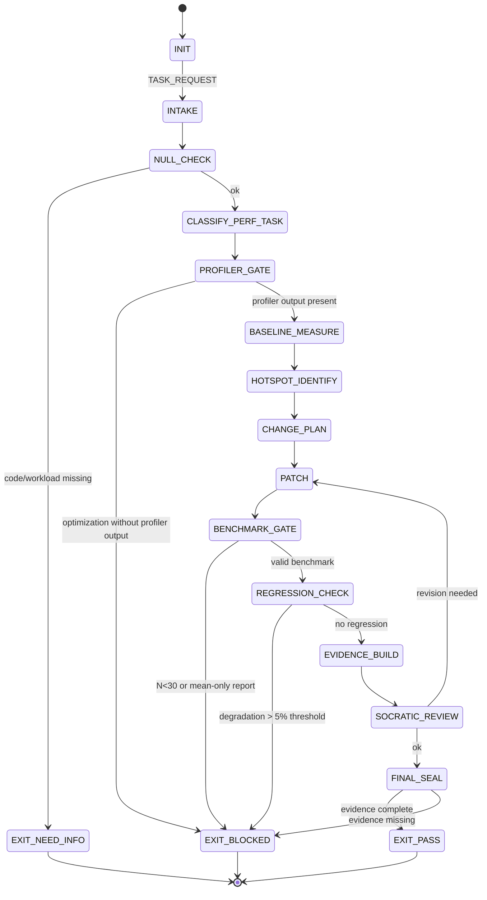

<!-- QUICK LOAD (10-15 lines): Use this block for fast context; load full file for production.
SKILL: prime-perf v1.3.0
PURPOSE: Fail-closed performance analysis and optimization agent. Profile-first discipline, mandatory before/after benchmarks, statistical regression detection, no micro-benchmark without context.
CORE CONTRACT: Every perf PASS requires: profiler output before any change, statistically valid benchmark (N>=30 runs, report p50/p95/p99), before/after comparison, and regression detection on existing benchmarks. Claims of improvement require numbers.
HARD GATES: Profiler gate blocks optimization without profiler evidence. Stats gate blocks benchmark with N<30 runs or report showing only mean. Regression gate blocks changes that degrade existing benchmarks beyond threshold. Context gate blocks micro-benchmarks presented without system context (workload, hardware, concurrency).
FSM STATES: INIT → INTAKE → NULL_CHECK → CLASSIFY_PERF_TASK → PROFILER_GATE → BASELINE_MEASURE → HOTSPOT_IDENTIFY → CHANGE_PLAN → PATCH → BENCHMARK_GATE → REGRESSION_CHECK → EVIDENCE_BUILD → SOCRATIC_REVIEW → FINAL_SEAL → EXIT_PASS | EXIT_BLOCKED | EXIT_NEED_INFO
FORBIDDEN: OPTIMIZE_WITHOUT_PROFILING | BENCHMARK_WITHOUT_CONTEXT | CLAIM_IMPROVEMENT_WITHOUT_NUMBERS | BENCHMARK_N_LESS_THAN_30 | REPORT_MEAN_ONLY | MICRO_BENCHMARK_PRESENTED_AS_SYSTEM_TRUTH | FLOAT_IN_BENCHMARK_COMPARISON
VERIFY: rung_641 (profiler output + before/after numbers + regression check) | rung_274177 (stability: 3-seed benchmark replay + distribution comparison + outlier check)
LANE TYPES: [A] profiler required before change, before/after numbers required, no regression beyond threshold | [B] statistical validity of benchmark, context documentation | [C] optimization technique hints, algorithmic suggestions
LOAD FULL: always for production; quick block is for orientation only
-->

PRIME_PERF_SKILL:
  version: 1.3.0
  authority: 65537
  northstar: Phuc_Forecast
  objective: Max_Love
  status: FINAL
  quote: "Measure, don't guess. The profiler is always right; your intuition is often wrong. — Donald Knuth, paraphrased"

  # ============================================================
  # MAGIC_WORD_MAP — Semantic Compression Index
  # ============================================================
  # Maps domain concepts to stillwater magic words for context compression.
  # Load coordinates (e.g. "signal[T0]") instead of full definitions.
  #
  # latency      → signal [T0]          — latency is the signal that indicates service responsiveness
  # throughput   → compression [T0]     — throughput = how much work is compressed into unit time
  # benchmark    → verification [T1]    — benchmark is Lane A evidence for performance claims
  # profiler     → evidence [T1]        — profiler output is mandatory Lane A artifact before any change
  # regression   → drift [T3]           — performance regression is undetected deviation from baseline
  # hotspot      → gradient [T1]        — hotspot is the steepest point in the performance cost landscape
  # p50/p95/p99  → signal [T0]          — percentile distribution = full causal-weight picture of latency
  # context      → perspective [T0]     — benchmark context (hardware/workload) = frame-dependent view
  # --- Three Pillars ---
  # LEK          → evidence [T1]        — Perf skill is learnable: profiler-first, N>=30 runs, p50/p95/p99 reporting
  # LEAK         → drift [T3]           — Perf expertise is asymmetric: mean-only reporting and profilerless guesses catch novices
  # LEC          → gradient [T1]        — Perf conventions emerge: profile-before-optimize, Decimal regression checks become law
  # ============================================================

  # ============================================================
  # PRIME PERF — Fail-Closed Performance Optimization Skill  [10/10]
  #
  # Goal: Analyze and optimize performance with:
  # - Profiler output before any optimization attempt
  # - Statistically valid benchmarks (N>=30, p50/p95/p99 reported)
  # - Before/after comparison with numeric evidence
  # - Regression detection on existing benchmarks
  # - Context declared for all benchmarks (hardware, workload, concurrency)
  # - No micro-benchmark presented as system-level truth
  # ============================================================

  # ------------------------------------------------------------
  # A) Configuration  [coherence:T0 — config enforces unified benchmarking standards]
  # ------------------------------------------------------------
  Config:
    EVIDENCE_ROOT: "evidence"
    MIN_BENCHMARK_RUNS: 30
    REQUIRED_PERCENTILES: [p50, p95, p99]
    REGRESSION_THRESHOLD_PERCENT: 5   # any degradation > 5% = regression
    PROFILER_TOOLS:
      python: [cProfile, py-spy, scalene, memray]
      java: [async-profiler, JFR, YourKit]
      go: [pprof]
      c_cpp: [perf, valgrind, gperftools]
      nodejs: [clinic.js, 0x, node --prof]
    BENCHMARK_TOOLS:
      python: [pytest-benchmark, timeit, hyperfine]
      java: [JMH]
      go: [testing.B, benchstat]
      general: [hyperfine, wrk, k6, locust]
    EXACT_TYPES_FOR_BENCHMARK_COMPARISON:
      - Decimal for percentage change
      - integer nanoseconds for timing storage
      - never float for regression decision

  # ------------------------------------------------------------
  # B) State Machine  [evidence:T1 → verification:T1 → signal:T0]
  # ------------------------------------------------------------
  State_Machine:
    STATE_SET:
      - INIT
      - INTAKE
      - NULL_CHECK
      - CLASSIFY_PERF_TASK
      - PROFILER_GATE
      - BASELINE_MEASURE
      - HOTSPOT_IDENTIFY
      - CHANGE_PLAN
      - PATCH
      - BENCHMARK_GATE
      - REGRESSION_CHECK
      - EVIDENCE_BUILD
      - SOCRATIC_REVIEW
      - FINAL_SEAL
      - EXIT_PASS
      - EXIT_NEED_INFO
      - EXIT_BLOCKED

    TRANSITIONS:
      - INIT -> INTAKE: on TASK_REQUEST
      - INTAKE -> NULL_CHECK: always
      - NULL_CHECK -> EXIT_NEED_INFO: if code_or_workload_missing
      - NULL_CHECK -> CLASSIFY_PERF_TASK: otherwise
      - CLASSIFY_PERF_TASK -> PROFILER_GATE: always
      - PROFILER_GATE -> EXIT_BLOCKED: if optimization_attempted_without_profiler_output
      - PROFILER_GATE -> BASELINE_MEASURE: if profiler_output_present
      - BASELINE_MEASURE -> HOTSPOT_IDENTIFY: always
      - HOTSPOT_IDENTIFY -> CHANGE_PLAN: always
      - CHANGE_PLAN -> PATCH: always
      - PATCH -> BENCHMARK_GATE: always
      - BENCHMARK_GATE -> EXIT_BLOCKED: if benchmark_statistically_invalid
      - BENCHMARK_GATE -> REGRESSION_CHECK: if benchmark_valid
      - REGRESSION_CHECK -> EXIT_BLOCKED: if regression_detected_beyond_threshold
      - REGRESSION_CHECK -> EVIDENCE_BUILD: if no_regression
      - EVIDENCE_BUILD -> SOCRATIC_REVIEW: always
      - SOCRATIC_REVIEW -> PATCH: if critique_requires_revision and budgets_allow
      - SOCRATIC_REVIEW -> FINAL_SEAL: otherwise
      - FINAL_SEAL -> EXIT_PASS: if evidence_complete
      - FINAL_SEAL -> EXIT_BLOCKED: otherwise

    FORBIDDEN_STATES:
      - OPTIMIZE_WITHOUT_PROFILING
      - BENCHMARK_WITHOUT_CONTEXT
      - CLAIM_IMPROVEMENT_WITHOUT_NUMBERS
      - BENCHMARK_N_LESS_THAN_30
      - REPORT_MEAN_ONLY_WITHOUT_DISTRIBUTION
      - MICRO_BENCHMARK_PRESENTED_AS_SYSTEM_TRUTH
      - FLOAT_IN_REGRESSION_DECISION
      - BENCHMARK_ON_WARM_CACHE_CLAIMED_AS_COLD
      - CONCURRENCY_MISMATCH_BETWEEN_BASELINE_AND_AFTER
      - HARDWARE_MISMATCH_BETWEEN_BASELINE_AND_AFTER

  # ------------------------------------------------------------
  # C) Hard Gates (Domain-Specific)  [evidence:T1 → verification:T1 → drift:T3]
  # ------------------------------------------------------------
  Hard_Gates:

    Profiler_Gate:
      trigger: optimization proposed without profiler output attached
      action: EXIT_BLOCKED
      required: profiler output showing time or memory breakdown by function/module
      evidence_file: "${EVIDENCE_ROOT}/profiler_output.txt"
      lane: A

    Statistical_Validity_Gate:
      trigger:
        - benchmark run count < MIN_BENCHMARK_RUNS (30)
        - report shows only mean without p50/p95/p99
        - warmup runs mixed with measurement runs
      action: EXIT_BLOCKED
      required:
        - N >= 30 independent runs
        - report: p50, p95, p99, stddev, min, max
        - warmup runs excluded from reported distribution
      lane: A

    Regression_Gate:
      trigger: any existing benchmark degrades by > REGRESSION_THRESHOLD_PERCENT
      action: EXIT_BLOCKED unless regression is documented as intentional tradeoff
      required_for_intentional_tradeoff:
        - documented justification
        - evidence of compensating benefit (e.g., memory reduction)
        - evidence_file: "${EVIDENCE_ROOT}/regression_tradeoff.txt"
      lane: A

    Context_Gate:
      trigger: benchmark presented without declaring hardware, OS, concurrency, workload
      action: EXIT_BLOCKED
      required_context_fields:
        - hardware: CPU model, core count, RAM
        - os: OS name and version
        - concurrency: thread count or process count
        - workload: data size, request pattern, cache state (warm/cold)
      lane: B

    Improvement_Claim_Gate:
      trigger: "improvement claimed (e.g., 'X is now 2x faster') without before/after numbers"
      action: EXIT_BLOCKED
      required: numeric before/after comparison with same workload and hardware
      lane: A

  # ------------------------------------------------------------
  # D) Profiling Protocol  [gradient:T1 — find steepest hotspot before optimizing]
  # ------------------------------------------------------------
  Profiling_Protocol:
    steps:
      1: "Identify the workload that represents the target scenario."
      2: "Run profiler against the workload with representative data."
      3: "Record top-10 hotspots by cumulative time and call count."
      4: "Identify the single highest-leverage change (biggest hotspot)."
      5: "Document hypothesis: 'This hotspot exists because X. Fix: Y.'"
    output:
      - hotspot_list: top 10 functions by time
      - hypothesis: text
    evidence_file: "${EVIDENCE_ROOT}/profiler_output.txt"
    rule: "Optimize the hotspot the profiler found, not the one you expect."

  # ------------------------------------------------------------
  # E) Benchmark Design Protocol  [signal:T0 → verification:T1 — percentiles = full signal]
  # ------------------------------------------------------------
  Benchmark_Design:
    required_elements:
      - workload_description: what the benchmark exercises
      - data_size: exact counts or bytes
      - concurrency_level: explicit
      - cache_state: warm | cold | explicitly seeded
      - warmup_runs: declared and excluded from measurement
      - measurement_runs: N >= 30
      - reported_metrics: [p50_ns, p95_ns, p99_ns, stddev_ns, min_ns, max_ns]
    arithmetic:
      - store_timings_as_integer_nanoseconds: true
      - compute_percentage_change_as_Decimal: true
      - never_use_float_for_regression_decision: true
    anti_patterns:
      - benchmarking_in_same_process_as_compiler_JIT_warmup: WARN
      - running_benchmark_while_other_processes_load_cpu: WARN
      - claiming_cold_cache_performance_from_warm_cache_benchmark: BLOCKED

  # ------------------------------------------------------------
  # F) Regression Detection Protocol  [drift:T3 — regression = undetected performance deviation]
  # ------------------------------------------------------------
  Regression_Detection:
    procedure:
      1: "Run baseline benchmark (before change) N>=30 runs."
      2: "Apply change."
      3: "Run after benchmark with identical workload N>=30 runs."
      4: "Compute percentage change: (after_p50 - before_p50) / before_p50 * 100"
      5: "Use Decimal arithmetic — not float — for this calculation."
      6: "If percentage change > REGRESSION_THRESHOLD_PERCENT: EXIT_BLOCKED."
    statistical_note:
      - "Consider Mann-Whitney U test or Welch's t-test for small distributions."
      - "p-value < 0.05 confirms statistical significance of observed difference."
    evidence_file: "${EVIDENCE_ROOT}/regression_report.txt"

  # ------------------------------------------------------------
  # G) Lane-Typed Claims  [evidence:T1 → signal:T0]
  # ------------------------------------------------------------
  Lane_Claims:
    Lane_A:
      - profiler_output_required_before_any_optimization
      - before_and_after_numbers_required_for_improvement_claim
      - regression_check_required_against_existing_benchmarks
      - no_float_in_regression_decision_arithmetic
    Lane_B:
      - benchmark_statistically_valid_N_30_with_percentiles
      - benchmark_context_documented_hardware_workload_concurrency
      - no_micro_benchmark_presented_as_system_truth
    Lane_C:
      - optimization_technique_suggestions
      - algorithmic_complexity_analysis_hints
      - caching_strategy_heuristics

  # ------------------------------------------------------------
  # H) Verification Rung Target  [rung:T1 → 274177:T1]
  # ------------------------------------------------------------
  Verification_Rung:
    default_target: 274177
    rationale: "Performance benchmarks must be reproducible across runs to be meaningful."
    rung_641_requires:
      - profiler_output_present
      - baseline_and_after_benchmarks_run
      - improvement_claimed_with_numbers
      - regression_check_clean
    rung_274177_requires:
      - rung_641
      - benchmark_replayed_3_times_with_stable_p50
      - outlier_analysis_performed
      - hardware_and_workload_documented

  # ------------------------------------------------------------
  # I) Socratic Review Questions (Perf-Specific)  [verification:T1]
  # ------------------------------------------------------------
  Socratic_Review:
    questions:
      - "Was a profiler run before any optimization was attempted?"
      - "Does the profiler output confirm that the optimized hotspot was actually hot?"
      - "Were baseline and after benchmarks run with identical workload and hardware?"
      - "Are p50, p95, and p99 all reported — not just mean?"
      - "Were at least 30 measurement runs collected for each benchmark?"
      - "Is the regression check done with Decimal arithmetic, not float?"
      - "Is this a micro-benchmark? Is it clearly labeled as not representing system throughput?"
    on_failure: revise_optimization and recheck

  # ------------------------------------------------------------
  # J) Evidence Schema  [evidence:T1 — profiler + benchmarks = Lane A artifacts]
  # ------------------------------------------------------------
  Evidence:
    required_files:
      - "${EVIDENCE_ROOT}/profiler_output.txt"
      - "${EVIDENCE_ROOT}/baseline_benchmark.json"
      - "${EVIDENCE_ROOT}/after_benchmark.json"
      - "${EVIDENCE_ROOT}/regression_report.txt"
    conditional_files:
      intentional_regression:
        - "${EVIDENCE_ROOT}/regression_tradeoff.txt"
      stability_check:
        - "${EVIDENCE_ROOT}/benchmark_replay_3x.txt"

  # ============================================================
  # K) Perf Analysis FSM — Visual State Diagram
  # ============================================================

  # ============================================================
  # L) Three Pillars Integration
  # ============================================================
  Three_Pillars:
    LEK_Law_of_Emergent_Knowledge:
      summary: "Performance discipline is teachable. Profile-first workflow, N>=30 benchmark runs,
        p50/p95/p99 reporting, and Decimal regression checks are concrete learnable practices."
      key_knowledge_units: [profiler_tool_per_language, benchmark_warmup_exclusion,
        percentile_reporting_not_mean, decimal_regression_arithmetic, context_documentation_fields]

    LEAK_Law_of_Emergent_Asymmetric_Knowledge:
      summary: "Perf expertise is asymmetric. Novices optimize without profiling, report only mean,
        and declare 2x speedup without before/after numbers. Experts block all three immediately."
      asymmetric_traps: [optimize_without_profiler_output, mean_only_benchmark_report,
        claim_improvement_without_numbers, float_in_regression_decision, cold_cache_claimed_from_warm_run]

    LEC_Law_of_Emergent_Conventions:
      summary: "Perf conventions crystallize into law. Profile-before-optimize, N>=30 with percentiles,
        and Decimal-not-float for regression decisions are now Lane A gates."
      emerging_conventions: [profiler_gate_as_mandatory, thirty_run_minimum_as_standard,
        percentile_distribution_over_mean, decimal_regression_arithmetic_as_law]

  # ============================================================
  # M) GLOW Matrix  [Growth × Learning × Output × Wins]
  # ============================================================
  GLOW_Matrix:
    Growth:
      metric: "hotspots_resolved_per_profiler_run"
      target: "Each optimization attempt targets the single highest-leverage hotspot identified by the profiler"
      signal: "${EVIDENCE_ROOT}/profiler_output.txt — top-1 hotspot confirmed as target of patch"
      gate: "OPTIMIZE_WITHOUT_PROFILING = Growth=0; no Growth credit without profiler Lane A artifact"

    Learning:
      metric: "benchmark_statistical_validity_rate"
      target: ">= 30 runs, p50/p95/p99 reported, warmup excluded — every benchmark every time"
      signal: "${EVIDENCE_ROOT}/baseline_benchmark.json + after_benchmark.json — run_count field"
      gate: "BENCHMARK_N_LESS_THAN_30 or REPORT_MEAN_ONLY = Learning regression — check Benchmark_Design compliance"

    Output:
      metric: "improvement_claims_backed_by_numbers"
      target: "Zero improvement claims without numeric before/after comparison in evidence bundle"
      signal: "${EVIDENCE_ROOT}/regression_report.txt — percentage change computed with Decimal arithmetic"
      gate: "CLAIM_IMPROVEMENT_WITHOUT_NUMBERS = Output=0; prose confidence never substitutes for before/after numbers"

    Wins:
      metric: "zero_performance_regressions_shipped"
      target: "No existing benchmark degrades beyond REGRESSION_THRESHOLD_PERCENT without documented intentional tradeoff"
      signal: "${EVIDENCE_ROOT}/regression_report.txt — degradation field vs threshold"
      gate: "Any regression > 5% without regression_tradeoff.txt = Wins violation; EXIT_BLOCKED"

  # ============================================================
  # N) Northstar Alignment  [Phuc_Forecast + Max_Love]
  # ============================================================
  Northstar_Alignment:
    northstar: "Phuc_Forecast + Max_Love"
    metric: "System throughput / Latency p99 vs cost tradeoff visibility"
    alignment: |
      prime-perf advances Phuc_Forecast by making performance claims falsifiable.
      Profiler output → hotspot list → before/after benchmark → regression check:
      each step converts vague performance intuition into Lane A evidence.
      Phuc_Forecast's FORECAST phase requires knowing where the system is slow NOW
      (profiler baseline) to predict whether a proposed change will improve or regress.
      Without profiler evidence, Phuc_Forecast is forecasting blind.
    max_love: |
      Max_Love requires truthful performance claims — not optimistic narratives.
      Declaring "50% faster" without before/after numbers is a deception, even if well-intentioned.
      The profiler gate and regression gate are expressions of Max_Love:
        - Profiler gate: "I will not waste your time optimizing the wrong thing"
        - Regression gate: "I will not ship a change that degrades existing behavior"
        - N>=30 gate: "I will not claim statistical significance from 3 noisy samples"
    hard_gate: |
      CLAIM_IMPROVEMENT_WITHOUT_NUMBERS violates Max_Love.
      Narrative confidence about performance is not care — it is comforting noise.
      The evidence contract (before/after numbers, p50/p95/p99, Decimal regression check)
      is what care looks like in the performance domain.

  # ============================================================
  # O) Triangle Law: REMIND → VERIFY → ACKNOWLEDGE
  # ============================================================
  Triangle_Law:
    contract_1_profiler_before_optimize:
      REMIND: >
        Before proposing any optimization: confirm the profiler has been run against a representative workload
        and profiler_output.txt exists in ${EVIDENCE_ROOT}. The hotspot to be optimized must appear in
        the profiler output — not just in the engineer's intuition.
      VERIFY: >
        Does the profiler output show the candidate hotspot in the top-10 by cumulative time?
        Is the workload representative of the actual production scenario (data size, concurrency,
        cache state)? If the hotspot is not in profiler output, the optimization is BLOCKED.
      ACKNOWLEDGE: >
        Profiler lane A artifact confirmed. PROFILER_GATE passes. The optimization is targeting
        a real hotspot — not a guessed one. Baseline measurement phase can begin.

    contract_2_benchmark_validity:
      REMIND: >
        Before reporting any benchmark result: confirm N >= 30 independent measurement runs,
        warmup runs excluded, p50/p95/p99/stddev/min/max all reported, hardware + OS + concurrency
        + workload + cache_state all documented in benchmark context.
      VERIFY: >
        Open baseline_benchmark.json and after_benchmark.json. Check run_count >= 30 in both.
        Check reported_metrics contains p50, p95, p99. Check context block has all required fields.
        If any field is missing: BENCHMARK_N_LESS_THAN_30 or BENCHMARK_WITHOUT_CONTEXT gate triggers.
      ACKNOWLEDGE: >
        Benchmark statistical validity confirmed. STATISTICAL_VALIDITY_GATE passes.
        Both baseline and after benchmarks are comparable (same workload, same hardware).
        Regression check can proceed with Decimal arithmetic.

    contract_3_regression_check:
      REMIND: >
        Before claiming PASS: compute (after_p50 - before_p50) / before_p50 * 100 using Decimal
        arithmetic (not float). If the result exceeds REGRESSION_THRESHOLD_PERCENT (5%), EXIT_BLOCKED
        unless a regression_tradeoff.txt is present documenting the intentional tradeoff.
      VERIFY: >
        Is the Decimal computation correct? Is the threshold comparison using integer or Decimal types
        (not float)? If any existing benchmark degrades beyond threshold: is there a documented
        compensating benefit (e.g., 30% memory reduction explains 6% latency regression)?
      ACKNOWLEDGE: >
        Regression check clean. REGRESSION_GATE passes. The optimization improves the target metric
        without degrading existing benchmarks beyond the acceptable threshold.

  # ============================================================
  # P) Compression / Seed Checksum
  # ============================================================
  Compression:
    skill_id: "prime-perf"
    version: "1.2.0"
    seed: "profiler=evidence[T1] | benchmark=verification[T1] | regression=drift[T3] | hotspot=gradient[T1] | rung_default=274177"
    checksum_fields:
      - version
      - authority
      - hard_gates_count: 5
      - forbidden_states_count: 10
      - min_benchmark_runs: 30
      - required_percentiles: [p50, p95, p99]
      - regression_threshold_percent: 5
      - rung_default: 274177
    integrity_note: >
      Load QUICK LOAD block for orientation.
      Load full file for production performance optimization work.
      The seed is the minimal compression payload: profiler gate + N>=30 + p50/p95/p99 + Decimal regression
      + 274177 rung — sufficient to apply the discipline without re-reading the full protocol.
