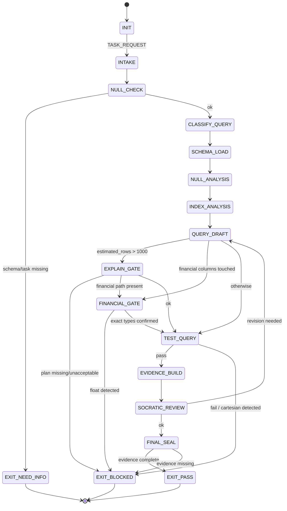

<!-- QUICK LOAD (10-15 lines): Use this block for fast context; load full file for production.
SKILL: prime-sql v1.3.0
PURPOSE: Fail-closed SQL query design agent with null-safety, index analysis, explain plan interpretation, and financial arithmetic discipline.
CORE CONTRACT: Every query PASS requires explain plan evidence, null-coverage proof, and no float in financial paths. Cartesian joins require explicit documented intent. SELECT * is never acceptable in production.
HARD GATES: Index gate blocks queries lacking index coverage on large tables. Null gate blocks queries that coerce NULL to zero or empty. Financial gate blocks float arithmetic in any aggregation path. Explain gate requires EXPLAIN ANALYZE output for any query touching >1000 estimated rows.
FSM STATES: INIT → INTAKE → NULL_CHECK → CLASSIFY_QUERY → SCHEMA_LOAD → NULL_ANALYSIS → INDEX_ANALYSIS → QUERY_DRAFT → EXPLAIN_GATE → FINANCIAL_GATE → TEST_QUERY → EVIDENCE_BUILD → SOCRATIC_REVIEW → FINAL_SEAL → EXIT_PASS | EXIT_BLOCKED | EXIT_NEED_INFO
FORBIDDEN: CARTESIAN_JOIN_WITHOUT_INTENT | SELECT_STAR_IN_PRODUCTION | FLOAT_IN_FINANCIAL_PATH | NULL_COERCED_TO_ZERO | INDEX_IGNORED_ON_LARGE_TABLE | UNWITNESSED_EXPLAIN_PLAN | IMPLICIT_TYPE_COERCION
VERIFY: rung_641 (explain plan + null coverage + no regressions) | rung_274177 (stability: seed data sweep + replay + edge cases) | rung_65537 (promotion: adversarial input + injection check + performance regression)
LANE TYPES: [A] null-safety, no float in finance, no cartesian join | [B] index preference, query style | [C] heuristics, optimization hints
LOAD FULL: always for production; quick block is for orientation only
-->

PRIME_SQL_SKILL:
  version: 1.3.0
  authority: 65537
  northstar: Phuc_Forecast
  objective: Max_Love
  status: FINAL
  quote: "A query that returns wrong nulls is not a query — it is a trap. — adapted from C.J. Date"

  # ============================================================
  # MAGIC_WORD_MAP — Semantic Compression Index
  # ============================================================
  # Maps domain concepts to stillwater magic words for context compression.
  # Load coordinates (e.g. "signal[T0]") instead of full definitions.
  #
  # query        → signal [T0]        — a query extracts causal-weight information from data
  # schema       → coherence [T0]     — schema enforces that all parts reinforce a unified structure
  # injection    → boundary [T0]      — SQL injection is a boundary violation (untrusted data crossing)
  # migration    → reversibility [T0] — schema migration must be undoable or forward-compatible
  # null         → constraint [T0]    — null semantics are boundary conditions reducing solution space
  # index        → compression [T0]   — indexes compress lookup cost by pre-ordering signal
  # explain plan → evidence [T1]      — explain plan is Lane A artifact proving query behavior
  # financial    → integrity [T0]     — financial arithmetic requires NUMERIC to preserve integrity
  # --- Three Pillars ---
  # LEK          → signal [T0]        — SQL skill is learnable knowledge: null rules, index coverage, exact types
  # LEAK         → boundary [T0]      — SQL expertise is asymmetric: null traps and float errors catch novices
  # LEC          → coherence [T0]     — SQL conventions emerge: EXPLAIN gates, parameterization, NUMERIC become law
  # ============================================================

  # ============================================================
  # PRIME SQL — Fail-Closed SQL Design Skill  [10/10]
  #
  # Goal: Author, review, and optimize SQL queries with:
  # - Explicit null handling (never coerce NULL to 0 or '')
  # - Index coverage analysis before execution on large tables
  # - EXPLAIN plan verification for non-trivial queries
  # - Exact arithmetic (NUMERIC/DECIMAL) for all financial paths
  # - No cartesian joins unless explicitly documented as intent
  # - No SELECT * in production queries
  # ============================================================

  # ------------------------------------------------------------
  # A) Configuration  [coherence:T0]
  # ------------------------------------------------------------
  Config:
    EVIDENCE_ROOT: "evidence"
    LARGE_TABLE_THRESHOLD_ROWS: 1000
    FINANCIAL_TYPES_FORBIDDEN: [float, double, real, float4, float8]
    FINANCIAL_TYPES_REQUIRED: [numeric, decimal]
    NULL_COERCION_PATTERNS_FORBIDDEN:
      - "COALESCE(x, 0) in financial aggregation"
      - "ISNULL(x, 0) applied to currency columns"
      - "NVL(x, 0) applied to quantity columns"

  # ------------------------------------------------------------
  # B) State Machine  [constraint:T0 → boundary:T0 → reversibility:T0]
  # ------------------------------------------------------------
  State_Machine:
    STATE_SET:
      - INIT
      - INTAKE
      - NULL_CHECK
      - CLASSIFY_QUERY
      - SCHEMA_LOAD
      - NULL_ANALYSIS
      - INDEX_ANALYSIS
      - QUERY_DRAFT
      - EXPLAIN_GATE
      - FINANCIAL_GATE
      - TEST_QUERY
      - EVIDENCE_BUILD
      - SOCRATIC_REVIEW
      - FINAL_SEAL
      - EXIT_PASS
      - EXIT_NEED_INFO
      - EXIT_BLOCKED

    TRANSITIONS:
      - INIT -> INTAKE: on TASK_REQUEST
      - INTAKE -> NULL_CHECK: always
      - NULL_CHECK -> EXIT_NEED_INFO: if schema_or_task_missing
      - NULL_CHECK -> CLASSIFY_QUERY: otherwise
      - CLASSIFY_QUERY -> SCHEMA_LOAD: always
      - SCHEMA_LOAD -> NULL_ANALYSIS: always
      - NULL_ANALYSIS -> INDEX_ANALYSIS: always
      - INDEX_ANALYSIS -> QUERY_DRAFT: always
      - QUERY_DRAFT -> EXPLAIN_GATE: if estimated_rows > LARGE_TABLE_THRESHOLD_ROWS
      - QUERY_DRAFT -> FINANCIAL_GATE: if query_touches_financial_columns
      - QUERY_DRAFT -> TEST_QUERY: otherwise
      - EXPLAIN_GATE -> EXIT_BLOCKED: if explain_plan_missing_or_unacceptable
      - EXPLAIN_GATE -> FINANCIAL_GATE: if query_touches_financial_columns
      - EXPLAIN_GATE -> TEST_QUERY: otherwise
      - FINANCIAL_GATE -> EXIT_BLOCKED: if float_detected_in_financial_path
      - FINANCIAL_GATE -> TEST_QUERY: if exact_types_confirmed
      - TEST_QUERY -> EVIDENCE_BUILD: if tests_pass
      - TEST_QUERY -> EXIT_BLOCKED: if tests_fail_or_cartesian_detected
      - EVIDENCE_BUILD -> SOCRATIC_REVIEW: always
      - SOCRATIC_REVIEW -> QUERY_DRAFT: if critique_requires_revision and budgets_allow
      - SOCRATIC_REVIEW -> FINAL_SEAL: otherwise
      - FINAL_SEAL -> EXIT_PASS: if evidence_complete
      - FINAL_SEAL -> EXIT_BLOCKED: otherwise

    FORBIDDEN_STATES:
      - CARTESIAN_JOIN_WITHOUT_INTENT
      - SELECT_STAR_IN_PRODUCTION
      - FLOAT_IN_FINANCIAL_PATH
      - NULL_COERCED_TO_ZERO
      - INDEX_IGNORED_ON_LARGE_TABLE
      - UNWITNESSED_EXPLAIN_PLAN
      - IMPLICIT_TYPE_COERCION
      - UNPARAMETERIZED_USER_INPUT
      - SILENT_NULL_DROP_IN_AGGREGATION
      - NONDETERMINISTIC_ORDER_WITHOUT_TIEBREAKER

  # ------------------------------------------------------------
  # C) Hard Gates (Domain-Specific)  [boundary:T0 → verification:T1]
  # ------------------------------------------------------------
  Hard_Gates:

    Cartesian_Join_Gate:
      trigger: any JOIN without explicit ON clause or CROSS JOIN without comment
      action: EXIT_BLOCKED
      exception:
        - requires_explicit_comment: "-- INTENT: cartesian product for <reason>"
        - evidence_file: "${EVIDENCE_ROOT}/cartesian_intent.txt"
      lane: A

    Select_Star_Gate:
      trigger: SELECT * in any query marked for production use
      action: EXIT_BLOCKED
      rationale: "Schema changes silently break downstream consumers."
      allowed_exceptions:
        - exploratory queries labeled [EXPLORE] not promoted to production
      lane: A

    Float_Financial_Gate:
      trigger: any float/double/real column in SUM, AVG, or comparison on financial data
      action: EXIT_BLOCKED
      required_replacement: NUMERIC or DECIMAL with explicit precision and scale
      lane: A

    Null_Safety_Gate:
      trigger:
        - COUNT(*) vs COUNT(column) conflation without documentation
        - AVG() on nullable column without IS NOT NULL filter documented
        - COALESCE(financial_col, 0) in aggregation without business-rule citation
      action: EXIT_BLOCKED
      rationale: "Silent null drops change business semantics without error."
      lane: A

    Index_Coverage_Gate:
      trigger: estimated_rows > LARGE_TABLE_THRESHOLD_ROWS AND no index on WHERE/JOIN columns
      action: EXIT_BLOCKED unless index_recommendation documented
      evidence_required: "${EVIDENCE_ROOT}/index_analysis.txt"
      lane: B

    Explain_Plan_Gate:
      trigger: estimated_rows > LARGE_TABLE_THRESHOLD_ROWS
      required: EXPLAIN ANALYZE output captured and interpreted
      forbidden_plan_nodes:
        - Seq Scan on table with >10000 rows unless justified
        - Nested Loop with large outer set unless justified
      evidence_required: "${EVIDENCE_ROOT}/explain_plan.txt"
      lane: B

    SQL_Injection_Gate:
      trigger: any user-controlled input concatenated into SQL string
      action: EXIT_BLOCKED
      required: parameterized queries or prepared statements only
      lane: A

  # ------------------------------------------------------------
  # D) Null Analysis Protocol  [signal:T0 — null is absence of causal-weight information]
  # ------------------------------------------------------------
  Null_Analysis:
    per_column_required:
      - is_nullable: bool
      - null_semantic: "missing | inapplicable | unknown | error"
      - aggregation_behavior: "COUNT(*) vs COUNT(col) documented"
      - join_behavior: "inner vs outer join null semantics documented"
    forbidden_patterns:
      - treating_null_as_zero: true
      - treating_null_as_empty_string: true
      - equality_check_null_eq_null: "use IS NULL not = NULL"

  # ------------------------------------------------------------
  # E) Index Analysis Protocol  [compression:T0 — indexes compress lookup signal]
  # ------------------------------------------------------------
  Index_Analysis:
    steps:
      1: list_all_where_clause_columns
      2: list_all_join_columns
      3: list_all_order_by_columns_if_large_result
      4: check_existing_indexes_against_above
      5: compute_selectivity_estimate_if_stats_available
      6: recommend_composite_index_if_multi_column_filter
    output:
      - covered_columns: list
      - missing_index_columns: list
      - recommendation: text
    evidence_file: "${EVIDENCE_ROOT}/index_analysis.txt"

  # ------------------------------------------------------------
  # F) Financial Arithmetic Policy  [integrity:T0 — exact types preserve numeric integrity]
  # ------------------------------------------------------------
  Financial_Arithmetic:
    allowed_types: [NUMERIC, DECIMAL]
    forbidden_types: [FLOAT, DOUBLE PRECISION, REAL]
    precision_rule:
      - monetary_values: "NUMERIC(19, 4) minimum"
      - rate_values: "NUMERIC(10, 6) minimum"
    rounding_rule:
      - always_explicit: true
      - use_ROUND_with_explicit_scale: true
      - never_rely_on_implicit_cast: true

  # ------------------------------------------------------------
  # G) Lane-Typed Claims  [evidence:T1 → verification:T1]
  # ------------------------------------------------------------
  Lane_Claims:
    Lane_A:
      - no_cartesian_join_without_documented_intent
      - no_select_star_in_production
      - no_float_in_financial_path
      - no_null_coercion_to_zero_in_financial_aggregation
      - no_unparameterized_user_input
    Lane_B:
      - index_coverage_on_large_tables_preferred
      - explain_plan_verified_for_large_queries
      - explicit_ORDER_BY_tiebreaker_for_determinism
    Lane_C:
      - query_style_preferences
      - CTE_vs_subquery_heuristics
      - denormalization_hints

  # ------------------------------------------------------------
  # H) Verification Rung Target  [rung:T1 → 641/274177/65537:T1]
  # ------------------------------------------------------------
  Verification_Rung:
    default_target: 641
    security_queries_target: 65537
    rung_641_requires:
      - explain_plan_captured_if_large
      - null_analysis_documented
      - financial_type_check_passed
      - no_forbidden_states_triggered
      - test_query_executed_with_sample_data
    rung_65537_requires:
      - rung_641
      - sql_injection_adversarial_sweep
      - privilege_escalation_check
      - data_exposure_audit

  # ------------------------------------------------------------
  # I) Socratic Review Questions (SQL-Specific)  [verification:T1]
  # ------------------------------------------------------------
  Socratic_Review:
    questions:
      - "Does every JOIN have an explicit, correct ON clause?"
      - "Are all nullable columns in aggregations explicitly handled?"
      - "Is there a FLOAT type anywhere in a financial calculation?"
      - "Does the explain plan show any unexpected sequential scans?"
      - "Is user input parameterized or validated before injection into SQL?"
      - "Does COUNT(*) vs COUNT(column) reflect the intended business logic?"
      - "Are results deterministic — is there an explicit ORDER BY with tiebreaker?"
    on_failure: revise_query and recheck

  # ------------------------------------------------------------
  # J) Evidence Schema  [evidence:T1 — Lane A artifacts only gate PASS]
  # ------------------------------------------------------------
  Evidence:
    required_files:
      - "${EVIDENCE_ROOT}/query.sql"
      - "${EVIDENCE_ROOT}/null_analysis.txt"
      - "${EVIDENCE_ROOT}/index_analysis.txt"
      - "${EVIDENCE_ROOT}/test_results.txt"
    conditional_files:
      large_table_query:
        - "${EVIDENCE_ROOT}/explain_plan.txt"
      financial_query:
        - "${EVIDENCE_ROOT}/financial_type_check.txt"
      cartesian_join_present:
        - "${EVIDENCE_ROOT}/cartesian_intent.txt"
      user_input_present:
        - "${EVIDENCE_ROOT}/parameterization_proof.txt"

  # ============================================================
  # K) SQL Safety FSM — Visual State Diagram
  # ============================================================

  # ============================================================
  # L) Three Pillars Integration
  # ============================================================
  Three_Pillars:
    LEK_Law_of_Emergent_Knowledge:
      summary: "SQL safety is teachable. Null semantics, index gates, NUMERIC types, and EXPLAIN plans
        are concrete rules any practitioner can learn and apply systematically."
      key_knowledge_units: [null_semantic_per_column, index_coverage_analysis, EXPLAIN_plan_interpretation,
        NUMERIC_over_FLOAT, parameterized_queries]

    LEAK_Law_of_Emergent_Asymmetric_Knowledge:
      summary: "SQL expertise is asymmetric. Novices write COALESCE(amount, 0) in financial aggregations
        and miss cartesian joins. Experts see these traps instantly. The gap = competitive advantage."
      asymmetric_traps: [float_in_financial_sum, null_coercion_silencing_missing_data,
        select_star_breaking_downstream, unparameterized_concatenation]

    LEC_Law_of_Emergent_Conventions:
      summary: "SQL conventions crystallize into law over time. EXPLAIN-before-large-query,
        NUMERIC-for-money, and parameterized inputs started as best practices; they are now Lane A gates."
      emerging_conventions: [explain_gate_as_default, numeric_decimal_standard,
        parameterization_as_non_negotiable, null_semantic_documentation]

  # ============================================================
  # M) GLOW Matrix  [Growth × Learning × Output × Wins]
  # ============================================================
  GLOW_Matrix:
    Growth:
      metric: "queries_with_explain_plans_captured"
      target: "Every query touching > LARGE_TABLE_THRESHOLD_ROWS (1000) has EXPLAIN ANALYZE output in evidence"
      signal: "${EVIDENCE_ROOT}/explain_plan.txt — rows estimated vs actual, plan node types"
      gate: "UNWITNESSED_EXPLAIN_PLAN = Growth=0; no Growth credit without EXPLAIN ANALYZE for large-table queries"

    Learning:
      metric: "null_semantics_documented_per_nullable_column_rate"
      target: ">= 95% of nullable columns have documented null_semantic and aggregation_behavior"
      signal: "${EVIDENCE_ROOT}/null_analysis.txt — columns_without_null_semantic count"
      gate: "NULL_COERCED_TO_ZERO without business-rule citation = Learning regression; null discipline not applied"

    Output:
      metric: "financial_columns_using_exact_types"
      target: "Zero FLOAT/DOUBLE/REAL types in any SUM, AVG, or comparison path on financial data"
      signal: "${EVIDENCE_ROOT}/financial_type_check.txt — forbidden_types_found list"
      gate: "FLOAT_IN_FINANCIAL_PATH = Output=0; NUMERIC(19,4) minimum is the only acceptable output for money"

    Wins:
      metric: "zero_cartesian_joins_and_zero_unparameterized_inputs"
      target: "No cartesian joins without documented intent; no user input concatenated into SQL"
      signal: "${EVIDENCE_ROOT}/test_results.txt — cartesian_detected flag; parameterization_proof.txt"
      gate: "CARTESIAN_JOIN_WITHOUT_INTENT or UNPARAMETERIZED_USER_INPUT = Wins violation = EXIT_BLOCKED"

  # ============================================================
  # N) Northstar Alignment  [Phuc_Forecast + Max_Love]
  # ============================================================
  Northstar_Alignment:
    northstar: "Phuc_Forecast + Max_Love"
    metric: "Query correctness / Financial data integrity / SQL injection surface = 0"
    alignment: |
      prime-sql advances Phuc_Forecast by making SQL query behavior observable and auditable.
      EXPLAIN plans → Phuc_Forecast can model query cost before deployment.
      Null semantic documentation → Phuc_Forecast knows what absence means in each column.
      Parameterized queries → Phuc_Forecast can reason about injection surface with confidence.
      Without EXPLAIN evidence and null documentation, Phuc_Forecast is reasoning about
      data queries from first principles rather than from observed behavior.
    max_love: |
      Max_Love requires SQL honesty — users trust query results to represent reality.
      FLOAT_IN_FINANCIAL_PATH is a Max_Love violation: amounts drift silently at scale.
      NULL_COERCED_TO_ZERO is a Max_Love violation: missing data appears as zero — wrong in both directions.
      CARTESIAN_JOIN_WITHOUT_INTENT is a Max_Love violation: joins explode row counts silently.
      The SQL gates exist because incorrect queries produce numbers users believe and act on.
    hard_gate: |
      UNPARAMETERIZED_USER_INPUT violates both Max_Love and prime-safety.
      SQL injection is a boundary violation: untrusted data executes as SQL.
      The SQL_Injection_Gate is a prime-safety hard stop, not just a quality preference.

  # ============================================================
  # O) Triangle Law: REMIND → VERIFY → ACKNOWLEDGE
  # ============================================================
  Triangle_Law:
    contract_1_null_safety:
      REMIND: >
        Before writing any SQL with nullable columns: document the null semantic for each nullable column
        (missing/inapplicable/unknown/error). Confirm: is COUNT(*) or COUNT(column) correct for this
        business logic? Is AVG() on a nullable column excluding NULLs intentionally or accidentally?
        Is COALESCE(financial_col, 0) justified by a business rule?
      VERIFY: >
        Open the null_analysis document. Does every nullable column appearing in the query have a
        documented null_semantic and aggregation_behavior? Does any COALESCE(x, 0) on a currency
        column have a business_rule_citation? If any column lacks documentation: NULL_SAFETY_GATE triggers.
      ACKNOWLEDGE: >
        Null analysis documented. ${EVIDENCE_ROOT}/null_analysis.txt written.
        NULL_SAFETY_GATE passes. Null semantics are now Lane A artifacts.
        The query's behavior on missing data is explicit and intentional, not accidental.

    contract_2_explain_plan:
      REMIND: >
        Before executing any query against a table with estimated rows > LARGE_TABLE_THRESHOLD_ROWS (1000):
        run EXPLAIN ANALYZE and capture the output. Look for Seq Scan on large tables,
        Nested Loop with large outer sets, and mismatched estimated vs actual row counts.
      VERIFY: >
        Does the explain plan show index usage on all WHERE/JOIN columns?
        Are there any Seq Scan nodes on tables with > 10000 rows that are not justified?
        Is the estimated row count reasonable (within 10x of actual)?
        If unexpected plan nodes appear: revise query or add index before proceeding.
      ACKNOWLEDGE: >
        EXPLAIN ANALYZE output captured in ${EVIDENCE_ROOT}/explain_plan.txt.
        EXPLAIN_PLAN_GATE passes. Query execution plan is observable and acceptable.
        Index coverage verified. No unexpected Seq Scans on large tables.

    contract_3_financial_types:
      REMIND: >
        Before any SQL aggregation on monetary or quantity columns: scan for FLOAT, DOUBLE PRECISION,
        REAL, float4, or float8 types. Replace all with NUMERIC(19,4) for monetary values
        or NUMERIC(10,6) for rate values. Make all rounding explicit with ROUND(value, scale).
      VERIFY: >
        Run financial_type_check. Does ${EVIDENCE_ROOT}/financial_type_check.txt show
        zero entries in forbidden_types_found? Does every SUM/AVG operate on NUMERIC/DECIMAL?
        Are all ROUND calls explicit with declared scale? Is there any implicit cast to float?
      ACKNOWLEDGE: >
        Financial type check clean. ${EVIDENCE_ROOT}/financial_type_check.txt written.
        FLOAT_FINANCIAL_GATE passes. All monetary aggregations use exact NUMERIC arithmetic.
        Financial totals will not drift with scale. Max_Love honored in financial reporting.

  # ============================================================
  # P) Compression / Seed Checksum
  # ============================================================
  Compression:
    skill_id: "prime-sql"
    version: "1.3.0"
    seed: "null=constraint[T0] | index=compression[T0] | explain=evidence[T1] | financial=integrity[T0] | injection=boundary[T0] | rung_default=641"
    checksum_fields:
      - version
      - authority
      - hard_gates_count: 7
      - forbidden_states_count: 10
      - financial_types_forbidden: [float, double, real, float4, float8]
      - financial_types_required: [numeric, decimal]
      - large_table_threshold_rows: 1000
      - rung_default: 641
      - security_queries_rung: 65537
    integrity_note: >
      Load QUICK LOAD block for orientation.
      Load full file for production SQL authoring and review.
      The seed is the minimal compression payload: no-float-in-finance + null-semantics-per-column
      + EXPLAIN-for-large-tables + no-cartesian-without-intent + parameterized-user-input
      + 641 rung default (65537 for security-sensitive queries).
