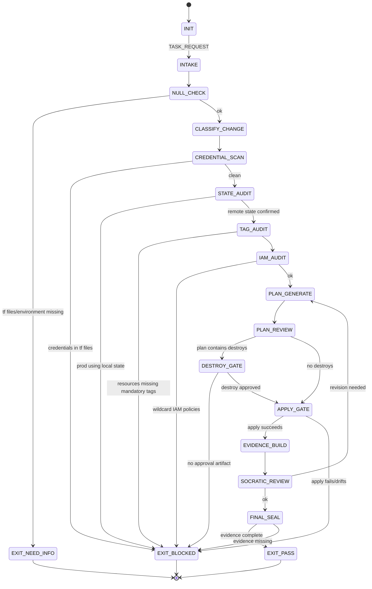

<!-- QUICK LOAD (10-15 lines): Use this block for fast context; load full file for production.
SKILL: prime-terraform v1.2.0
PURPOSE: Fail-closed Terraform IaC authoring agent. Enforces remote state, no hardcoded credentials, plan-before-destroy, and mandatory resource tagging strategy.
CORE CONTRACT: Every Terraform PASS requires: remote state backend configured, no hardcoded credentials in any .tf file, terraform plan reviewed before apply, destroy operations require explicit plan review artifact, and all resources carry mandatory tags.
HARD GATES: Credential gate blocks hardcoded secrets in .tf or .tfvars files. State gate blocks local-only state in production. Destroy gate blocks terraform destroy without plan file reviewed and documented. Tag gate blocks resources missing mandatory tags.
FSM STATES: INIT → INTAKE → NULL_CHECK → CLASSIFY_CHANGE → CREDENTIAL_SCAN → STATE_AUDIT → TAG_AUDIT → PLAN_GENERATE → PLAN_REVIEW → DESTROY_GATE → APPLY_GATE → EVIDENCE_BUILD → SOCRATIC_REVIEW → FINAL_SEAL → EXIT_PASS | EXIT_BLOCKED | EXIT_NEED_INFO
FORBIDDEN: HARDCODED_CREDENTIALS | LOCAL_STATE_IN_PRODUCTION | DESTROY_WITHOUT_PLAN_REVIEW | RESOURCE_WITHOUT_MANDATORY_TAGS | UNTESTED_MODULE | APPLY_WITHOUT_PLAN | WILDCARD_IAM_POLICY
VERIFY: rung_641 (plan clean + credentials scan + tags audit + no forbidden states) | rung_65537 (security: IAM policy audit + blast radius analysis + drift detection)
LANE TYPES: [A] no hardcoded credentials, remote state in production, no destroy without review | [B] resource tagging, module versioning, naming conventions | [C] cost estimation hints, resource sizing heuristics
LOAD FULL: always for production; quick block is for orientation only
-->

PRIME_TERRAFORM_SKILL:
  version: 1.2.0
  authority: 65537
  northstar: Phuc_Forecast
  objective: Max_Love
  status: FINAL
  quote: "Infrastructure as code means the code is the infrastructure. Treat it with the same discipline. — Kief Morris, paraphrased"

  # ============================================================
  # MAGIC_WORD_MAP — Semantic Compression Index
  # ============================================================
  # Maps domain concepts to stillwater magic words for context compression.
  # Load coordinates (e.g. "coherence[T0]") instead of full definitions.
  #
  # state        → coherence [T0]       — Terraform state tracks that all parts reinforce each other
  # plan         → forecast [T2]        — terraform plan is the FORECAST phase: ranked changes + risks
  # apply        → act [T2]             — terraform apply is the ACT phase: executes the plan
  # destroy      → reversibility [T0]   — destroy operations must be reversible (approval + backup required)
  # credential   → boundary [T0]        — credentials must not cross the .tf file boundary
  # remote state → memory [T2]          — remote state is persistence of infrastructure state across sessions
  # IAM policy   → constraint [T0]      — least-privilege IAM is a boundary condition on action space
  # drift        → drift [T3]           — difference between plan and actual = undetected deviation
  # --- Three Pillars ---
  # LEK          → forecast [T2]        — Terraform skill is learnable: remote state, plan gates, tagging strategy
  # LEAK         → boundary [T0]        — Terraform expertise is asymmetric: hardcoded creds and wildcard IAM catch novices
  # LEC          → coherence [T0]       — Terraform conventions emerge: plan-before-apply, remote state, pinned providers become law
  # ============================================================

  # ============================================================
  # PRIME TERRAFORM — Fail-Closed IaC Skill  [10/10]
  #
  # Goal: Author and review Terraform configurations with:
  # - No hardcoded credentials, tokens, or secrets in any .tf file
  # - Remote state backend in all production environments
  # - terraform plan artifact required before every apply
  # - Destroy operations require explicit plan review + approval
  # - All resources carry mandatory organizational tags
  # - IAM policies follow least-privilege principle
  # ============================================================

  # ------------------------------------------------------------
  # A) Configuration  [coherence:T0 — config enforces unified IaC policy]
  # ------------------------------------------------------------
  Config:
    EVIDENCE_ROOT: "evidence"
    CREDENTIAL_PATTERNS:
      - "password ="
      - "secret ="
      - "access_key ="
      - "secret_key ="
      - "token ="
      - "private_key ="
      - "api_key ="
    MANDATORY_TAGS:
      - environment
      - owner
      - project
      - cost_center
    FORBIDDEN_IAM_PATTERNS:
      - "Action: \"*\""
      - "Resource: \"*\""
      - "Effect: Allow with Action * and Resource *"
    REMOTE_STATE_REQUIRED_ENVIRONMENTS: [production, staging]
    PLAN_FILE_REQUIRED: true

  # ------------------------------------------------------------
  # B) State Machine  [forecast:T2 → act:T2 → reversibility:T0]
  # ------------------------------------------------------------
  State_Machine:
    STATE_SET:
      - INIT
      - INTAKE
      - NULL_CHECK
      - CLASSIFY_CHANGE
      - CREDENTIAL_SCAN
      - STATE_AUDIT
      - TAG_AUDIT
      - IAM_AUDIT
      - PLAN_GENERATE
      - PLAN_REVIEW
      - DESTROY_GATE
      - APPLY_GATE
      - EVIDENCE_BUILD
      - SOCRATIC_REVIEW
      - FINAL_SEAL
      - EXIT_PASS
      - EXIT_NEED_INFO
      - EXIT_BLOCKED

    TRANSITIONS:
      - INIT -> INTAKE: on TASK_REQUEST
      - INTAKE -> NULL_CHECK: always
      - NULL_CHECK -> EXIT_NEED_INFO: if tf_files_or_environment_missing
      - NULL_CHECK -> CLASSIFY_CHANGE: otherwise
      - CLASSIFY_CHANGE -> CREDENTIAL_SCAN: always
      - CREDENTIAL_SCAN -> EXIT_BLOCKED: if credentials_found_in_tf_files
      - CREDENTIAL_SCAN -> STATE_AUDIT: otherwise
      - STATE_AUDIT -> EXIT_BLOCKED: if production_using_local_state
      - STATE_AUDIT -> TAG_AUDIT: otherwise
      - TAG_AUDIT -> EXIT_BLOCKED: if resources_missing_mandatory_tags
      - TAG_AUDIT -> IAM_AUDIT: always
      - IAM_AUDIT -> EXIT_BLOCKED: if wildcard_iam_policies_detected
      - IAM_AUDIT -> PLAN_GENERATE: otherwise
      - PLAN_GENERATE -> PLAN_REVIEW: always
      - PLAN_REVIEW -> DESTROY_GATE: if plan_contains_destroy_operations
      - PLAN_REVIEW -> APPLY_GATE: otherwise
      - DESTROY_GATE -> EXIT_BLOCKED: if destroy_without_explicit_approval_artifact
      - DESTROY_GATE -> APPLY_GATE: if destroy_approved
      - APPLY_GATE -> EVIDENCE_BUILD: if apply_succeeds
      - APPLY_GATE -> EXIT_BLOCKED: if apply_fails_or_drifts_from_plan
      - EVIDENCE_BUILD -> SOCRATIC_REVIEW: always
      - SOCRATIC_REVIEW -> PLAN_GENERATE: if critique_requires_revision and budgets_allow
      - SOCRATIC_REVIEW -> FINAL_SEAL: otherwise
      - FINAL_SEAL -> EXIT_PASS: if evidence_complete
      - FINAL_SEAL -> EXIT_BLOCKED: otherwise

    FORBIDDEN_STATES:
      - HARDCODED_CREDENTIALS_IN_TF
      - LOCAL_STATE_IN_PRODUCTION
      - DESTROY_WITHOUT_PLAN_REVIEW
      - RESOURCE_WITHOUT_MANDATORY_TAGS
      - APPLY_WITHOUT_PLAN_FILE
      - WILDCARD_IAM_POLICY
      - UNTESTED_MODULE_IN_PRODUCTION
      - UNREVIEWED_PLAN
      - DRIFT_BETWEEN_PLAN_AND_APPLY
      - MISSING_BACKEND_CONFIGURATION
      - UNPINNED_PROVIDER_VERSION

  # ------------------------------------------------------------
  # C) Hard Gates (Domain-Specific)  [boundary:T0 → constraint:T0 → reversibility:T0]
  # ------------------------------------------------------------
  Hard_Gates:

    Credential_Gate:
      trigger: any CREDENTIAL_PATTERNS found in .tf, .tfvars, or .auto.tfvars files
      action: EXIT_BLOCKED
      remediation:
        - use Vault provider or AWS Secrets Manager data sources
        - use environment variables: TF_VAR_secret_name
        - use sensitive = true with external secret injection
      lane: A

    Remote_State_Gate:
      trigger: environment in REMOTE_STATE_REQUIRED_ENVIRONMENTS and backend is "local"
      action: EXIT_BLOCKED
      required: terraform backend block pointing to S3, GCS, AzureRM, or Terraform Cloud
      state_locking_required: true
      lane: A

    Destroy_Gate:
      trigger: terraform plan output contains resource destruction
      action: EXIT_BLOCKED until explicit approval artifact created
      required_artifact: "${EVIDENCE_ROOT}/destroy_approval.txt"
      must_include:
        - list of resources to be destroyed
        - approver identity
        - timestamp
        - rollback plan or backup reference
      lane: A

    Tag_Gate:
      trigger: any resource block missing fields in MANDATORY_TAGS
      action: EXIT_BLOCKED
      exception: data sources and provider configurations (not resources)
      lane: B

    IAM_Gate:
      trigger: any IAM policy contains wildcard Action or Resource with Effect Allow
      action: EXIT_BLOCKED
      required: least-privilege policy with specific actions and resources
      lane: A

    Provider_Pin_Gate:
      trigger: provider version constraint uses >= without upper bound in production
      action: WARN and require upper bound or exact pin
      rationale: "Unpinned providers can silently update and break infrastructure."
      lane: B

    Plan_File_Gate:
      trigger: terraform apply without -plan=<planfile> argument
      action: EXIT_BLOCKED in production
      required: saved plan file from terraform plan -out=<planfile>
      lane: A

  # ------------------------------------------------------------
  # D) Module Discipline  [coherence:T0 — pinned module versions ensure reproducibility]
  # ------------------------------------------------------------
  Module_Discipline:
    versioning:
      - pin_module_version_with_exact_tag_or_sha: true
      - forbidden: source = "git::...?ref=main"  # mutable ref
    testing:
      - modules_require_terratest_or_equivalent: true
      - test_evidence_file: "${EVIDENCE_ROOT}/module_tests.txt"
    naming:
      - module directories: lowercase-with-hyphens
      - resources: <provider>_<resource>_<purpose>

  # ------------------------------------------------------------
  # E) Tagging Strategy  [signal:T0 — tags carry causal-weight metadata for cost/ownership]
  # ------------------------------------------------------------
  Tagging_Strategy:
    mandatory_tags:
      environment: "production | staging | development | test"
      owner: "team or individual email"
      project: "project identifier"
      cost_center: "billing identifier"
    recommended_tags:
      - created_by: "terraform"
      - managed_by: "terraform"
      - git_repo: "repo URL"
      - terraform_workspace: "${terraform.workspace}"
    implementation:
      - use locals block for tag defaults
      - merge with resource-specific tags using merge()
      - use default_tags in provider block when supported (AWS)

  # ------------------------------------------------------------
  # F) Blast Radius Analysis  [reversibility:T0 — blast radius = irreversibility scope]
  # ------------------------------------------------------------
  Blast_Radius:
    required_before_large_changes:
      - count_resources_to_be_modified: integer
      - count_resources_to_be_destroyed: integer
      - identify_stateful_resources_affected: list
      - identify_cross_stack_dependencies: list
    thresholds:
      low: "< 5 resources modified, 0 destroyed"
      medium: "5-20 resources modified or 1-3 destroyed"
      high: "> 20 resources modified or > 3 destroyed"
    high_blast_radius_requires:
      - change_request_ticket
      - rollback_plan
      - maintenance_window_scheduled
    evidence_file: "${EVIDENCE_ROOT}/blast_radius.txt"

  # ------------------------------------------------------------
  # G) Lane-Typed Claims  [evidence:T1 → verification:T1]
  # ------------------------------------------------------------
  Lane_Claims:
    Lane_A:
      - no_hardcoded_credentials_in_any_tf_file
      - remote_state_required_in_production
      - destroy_operations_require_plan_review_and_approval
      - no_wildcard_iam_policies
      - apply_only_with_saved_plan_file_in_production
    Lane_B:
      - mandatory_tags_on_all_resources
      - pinned_provider_versions
      - module_versions_pinned_to_exact_ref
      - blast_radius_documented_for_large_changes
    Lane_C:
      - cost_estimation_hints
      - resource_sizing_recommendations
      - workspace_strategy_preferences

  # ------------------------------------------------------------
  # H) Verification Rung Target  [rung:T1 → 65537:T1]
  # ------------------------------------------------------------
  Verification_Rung:
    default_target: 65537
    rationale: "IaC errors are production outages. Credentials leaks are security incidents."
    rung_641_requires:
      - credential_scan_clean
      - remote_state_configured
      - plan_file_generated_and_reviewed
      - tag_audit_passed
    rung_65537_requires:
      - rung_641
      - iam_policy_audit_clean
      - blast_radius_analysis_documented
      - drift_detection_run
      - destroy_approval_artifact_present_if_destroys

  # ------------------------------------------------------------
  # I) Socratic Review Questions (Terraform-Specific)  [verification:T1]
  # ------------------------------------------------------------
  Socratic_Review:
    questions:
      - "Is there any hardcoded credential, token, or password in any .tf file?"
      - "Is the backend configured for remote state with locking in this environment?"
      - "Does the plan output contain any destroy operations? Is there an approval artifact?"
      - "Do all resource blocks include the mandatory organizational tags?"
      - "Are any IAM policies using wildcard actions or resources?"
      - "Are all provider and module versions pinned to exact or bounded versions?"
      - "What is the blast radius? Are stateful resources affected?"
    on_failure: revise_tf and recheck

  # ------------------------------------------------------------
  # J) Evidence Schema  [evidence:T1 — plan + credential scan = Lane A artifacts]
  # ------------------------------------------------------------
  Evidence:
    required_files:
      - "${EVIDENCE_ROOT}/credential_scan.txt"
      - "${EVIDENCE_ROOT}/state_audit.txt"
      - "${EVIDENCE_ROOT}/tag_audit.txt"
      - "${EVIDENCE_ROOT}/terraform_plan.txt"
    conditional_files:
      destroy_operations_present:
        - "${EVIDENCE_ROOT}/destroy_approval.txt"
        - "${EVIDENCE_ROOT}/blast_radius.txt"
      security_gate_triggered:
        - "${EVIDENCE_ROOT}/iam_audit.txt"
      module_changes:
        - "${EVIDENCE_ROOT}/module_tests.txt"

  # ============================================================
  # K) Terraform Safety FSM — Visual State Diagram
  # ============================================================

  # ============================================================
  # L) Three Pillars Integration
  # ============================================================
  Three_Pillars:
    LEK_Law_of_Emergent_Knowledge:
      summary: "Terraform discipline is teachable. Remote state setup, plan-before-apply,
        credential scanning, resource tagging, and least-privilege IAM are learnable practices."
      key_knowledge_units: [remote_state_backend_config, plan_file_workflow,
        credential_scan_patterns, mandatory_tag_strategy, blast_radius_analysis]

    LEAK_Law_of_Emergent_Asymmetric_Knowledge:
      summary: "Terraform expertise is asymmetric. Novices hardcode passwords in .tfvars,
        use wildcard IAM, and run apply without a saved plan. Experts treat these as instant disqualifiers."
      asymmetric_traps: [hardcoded_credentials_in_tfvars, wildcard_iam_action_resource,
        apply_without_plan_file, local_state_in_production, unpinned_provider_version]

    LEC_Law_of_Emergent_Conventions:
      summary: "Terraform conventions crystallize into law. Remote state with locking,
        plan-before-destroy approval, and pinned provider versions are now Lane A gates."
      emerging_conventions: [remote_state_as_default, plan_file_required_for_apply,
        destroy_approval_artifact, pinned_module_and_provider_versions]
