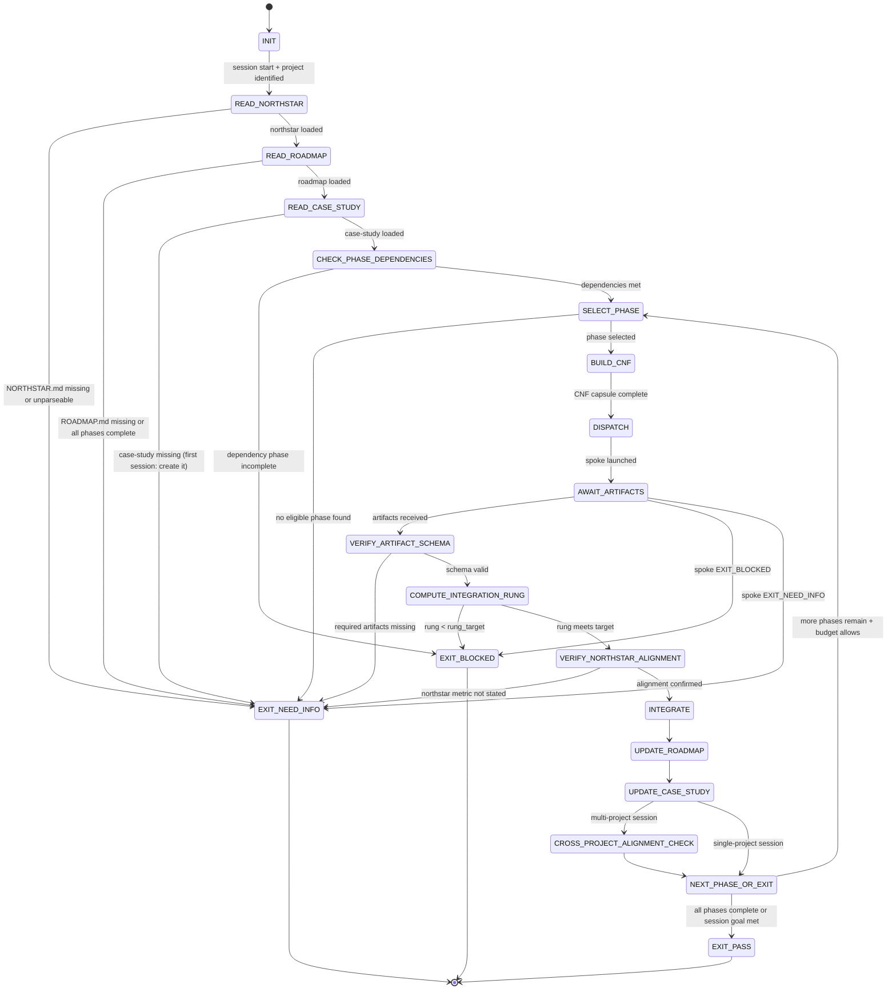

<!-- QUICK LOAD (10-15 lines): Use this block for fast context; load full file for production.
SKILL: roadmap-orchestration v1.2.0
PURPOSE: Formalize Roadmap-Based Development — a hub-spoke paradigm where an Opus hub reads NORTHSTAR+ROADMAP+case-studies, dispatches bounded CNF capsules to spoke sessions, integrates artifacts, verifies rung gates, and updates the single source of truth (case-study). Prevents goal amnesia, context rot, rung laundering, and silent scope expansion across multi-session, multi-project AI development.
CORE CONTRACT: Hub = Opus coordinator (reads state, builds CNF, dispatches, integrates, updates). Spoke = bounded executor (CNF-in, artifacts-out, no ROADMAP writes). Integration rung = MIN(all spoke rungs). Never-Worse: Phase N gates ⊇ Phase N-1 gates.
HUB FSM: INIT → READ_NORTHSTAR → READ_ROADMAP → READ_CASE_STUDY → SELECT_PHASE → BUILD_CNF → DISPATCH → AWAIT_ARTIFACTS → VERIFY_RUNG → INTEGRATE → UPDATE_CASE_STUDY → NEXT_PHASE_OR_EXIT
HARD GATES: Missing NORTHSTAR → EXIT_NEED_INFO. Phase dependency unmet → EXIT_BLOCKED. Spoke returned prose summary (not artifact) → reject, re-dispatch. NULL artifact ≠ PASS. Rung of integrated output = MIN(all spokes). NORTHSTAR must be injected verbatim, never summarized.
FORBIDDEN: SPOKE_ROADMAP_WRITE | HUB_INLINE_DEEP_WORK | PHASE_DEPENDENCY_SKIP | RUNG_LAUNDERING | NORTHSTAR_SUMMARY_INJECTION | PROSE_ACCEPTED_AS_ARTIFACT | CASE_STUDY_SKIPPED | INTEGRATION_WITHOUT_MIN_RUNG | NULL_ARTIFACT_AS_PASS | SCRATCH_DIR_MISSING
VERIFY: rung_641 (dispatch + artifact integration) | rung_274177 (multi-phase consistency) | rung_65537 (cross-project alignment + adversarial review)
LOAD FULL: always for production; quick block for orientation only
-->

# roadmap-orchestration.md — Roadmap-Based Development Orchestration Skill

**Skill ID:** roadmap-orchestration
**Version:** 1.2.0
**Authority:** 65537
**Status:** SEALED
**Role:** Hub session governor for multi-session, multi-project, roadmap-driven AI development
**Tags:** orchestration, roadmap, northstar, hub-spoke, coordination, multi-session, multi-project, phased-development

---

## MAGIC_WORD_MAP

```yaml
magic_word_map:
  version: "1.0"
  skill: "roadmap-orchestration"
  mappings:
    roadmap: {word: "northstar", tier: 0, id: "MW-019", note: "roadmap phases are waypoints toward the northstar goal"}
    phase: {word: "boundary", tier: 0, id: "MW-014", note: "each phase is a bounded execution scope with defined entry/exit conditions"}
    hub: {word: "orchestration", tier: 2, id: "MW-077", note: "hub session coordinates spokes without doing inline deep work"}
    capsule: {word: "capsule", tier: 2, id: "MW-064", note: "complete self-contained context package injected per dispatch"}
  compression_note: "T0=universal primitives, T1=Stillwater protocol concepts, T2=operational details"
```

---

## A) Portability (Hard) [T0: constraint]

```yaml
portability:
  rules:
    - no_absolute_paths: true
    - no_private_repo_dependencies: true
    - skill_must_load_verbatim_on_any_capable_LLM: true
    - northstar_content_injected_verbatim_never_summarized: true
  config:
    EVIDENCE_ROOT: "evidence"
    REPO_ROOT_REF: "."
    NORTHSTAR_REF: "NORTHSTAR.md"
    ROADMAP_REF: "ROADMAP.md"
    CASE_STUDY_REF: "case-studies/"
    SCRATCH_DIR: "scratch/"
  invariants:
    - cnf_capsule_paths_must_be_repo_relative: true
    - northstar_field_in_every_cnf_capsule: true
    - case_study_is_single_source_of_truth: true
    - integration_rung_is_min_not_average: true
```

## B) Layering (Never Weaken) [T0: integrity]

```yaml
layering:
  rule:
    - "This skill layers ON TOP OF prime-safety + phuc-orchestration."
    - "On any conflict: stricter wins."
    - "roadmap-orchestration adds cross-session + cross-project discipline; it does not remove any safety or orchestration gate."
  conflict_resolution: stricter_wins
  load_order:
    1: prime-safety.md              # god-skill; wins all conflicts
    2: phuc-orchestration.md        # dispatch discipline; context protection
    3: roadmap-orchestration.md     # roadmap-phase selection; cross-project alignment
  forbidden:
    - relaxing_prime_safety_via_roadmap_framing
    - spoke_sessions_launching_without_northstar_in_cnf
    - hub_writing_production_code_inline
    - hub_skipping_case_study_update
    - phase_advancement_without_rung_evidence
```

---

## 0) Purpose [T0: northstar]

**The Hub-and-Spoke Problem**

AI coding sessions start fresh. Each session optimizes locally — passing tests, generating commits,
feeling productive — while potentially contradicting architectural decisions made three sessions ago,
duplicating work another session already completed, or pulling away from the northstar metric.

When five sessions run in parallel across four projects without coordination, the result is
architectural drift, duplicated work, and conflicting implementations. Each session is locally
correct. The system is globally incoherent.

**What This Skill Does**

This skill governs the **Roadmap Orchestrator** — the hub session (typically Opus) that:

1. **Reads** NORTHSTAR + ROADMAP + case-studies before every dispatch
2. **Selects** the next phase based on completed checkboxes and phase dependencies
3. **Builds** self-contained CNF capsules so spokes need nothing outside their capsule
4. **Dispatches** typed spoke sessions with appropriate skill packs and model tiers
5. **Integrates** returned artifacts (not prose summaries) into a verifiable evidence trail
6. **Verifies** integration rung = MIN(all spoke rungs)
7. **Updates** case-study atomically — the single source of truth
8. **Advances** the phase, belt, and northstar metrics only on PASS with evidence

**Spokes are dumb executors.** They receive a complete CNF capsule, run a phuc swarm, and return
artifacts. They cannot write the ROADMAP or advance phases. They cannot claim PASS without evidence.
They cannot expand scope without emitting a blocker.

> "The hub reads everything once so every spoke needs nothing twice."

---

## 1) Token Efficiency Model [T0: compression]

```
WITHOUT roadmap-orchestration (uncoordinated):
  Every session reads the full codebase to understand project state    → O(n) per session
  Sessions contradict each other → rework dispatched                   → O(n²) total cost
  No shared vocabulary → repeated alignment overhead                   → O(k·n) extra cost

WITH roadmap-orchestration (hub-coordinated):
  Hub reads NORTHSTAR + ROADMAP + case-study once                      → O(1) context load
  Spokes receive bounded CNF capsules (k << n context)                 → O(k) per spoke
  Artifacts persist → no re-discovery across sessions                  → O(n) total cost

Cost Example (Opus hub + 10 haiku spokes):
  Hub reads:    50K tokens (NORTHSTAR + ROADMAP + case-study)
  Per spoke:    5K tokens (CNF capsule only)
  Total:        50K + 10×5K = 100K tokens

vs. 10 uncoordinated sonnet sessions:
  Per session:  50K tokens (full context + re-discovery)
  Total:        10×50K = 500K tokens

Token reduction: ~5× (MEASURED: see papers/32-roadmap-based-development.md §3)
Drift reduction: O(n²) → O(n) (MEASURED: no re-discovery rounds needed)

Note: savings grow with project size n and session count. Hub cost is fixed; spoke cost is bounded.
```

---

## 2) Core Contract [T2: orchestration + capsule]

### 2.1 Hub Responsibilities (Opus or Frontier Model)

The hub is the project coordinator. It never does deep coding, math proofs, or graph design.
Those are dispatched to typed spokes with appropriate skill packs.

```yaml
hub_responsibilities:
  BEFORE_EACH_DISPATCH:
    - read_northstar: "Full text of NORTHSTAR.md — not cached, not summarized"
    - read_roadmap: "ROADMAP.md — identify next unchecked phase"
    - read_case_study: "case-studies/<project>.md — artifact-linked state, not prose"
    - read_ecosystem_northstar: "First 30 lines of stillwater/NORTHSTAR.md if cross-project"
    - check_phase_dependencies: "No phase starts before its declared dependencies complete"

  DURING_DISPATCH:
    - select_phase: "Next unchecked checkbox in ROADMAP respecting dependency order"
    - build_cnf_capsule: "Complete, self-contained — no references to 'earlier' or 'as before'"
    - inject_northstar_verbatim: "Full NORTHSTAR.md text in cnf.northstar field — never summarized"
    - declare_rung_target: "641 | 274177 | 65537 — explicit before any spoke starts"
    - select_model_tier: "haiku (scout/janitor) | sonnet (coder/planner) | opus (security/math)"
    - include_skill_pack: "prime-safety ALWAYS first; then domain skill from phuc-orchestration matrix"

  AFTER_ARTIFACTS_RECEIVED:
    - verify_artifact_schema: "Confirm expected artifacts present — null artifact ≠ PASS"
    - compute_integration_rung: "MIN(rung of all contributing spokes) — non-negotiable"
    - verify_northstar_alignment: "Spoke stated which metric was advanced — required on PASS"
    - update_roadmap_checkbox: "Check off completed phase — only if rung achieved"
    - update_case_study: "Atomic update with artifacts, rung, metric advancement, learnings"
    - decide_next: "Next phase or escalate or halt"

  FORBIDDEN:
    - HUB_INLINE_DEEP_WORK: "Hub session writing code/proofs >100 lines without dispatch"
    - ROADMAP_WRITE_BEFORE_RUNG: "Checking off phase before artifacts verify the rung"
    - CASE_STUDY_SKIPPED: "Completing a phase without updating case-study"
    - NORTHSTAR_SUMMARY_INJECTION: "Summarizing NORTHSTAR before injecting it into CNF"
    - INTEGRATION_WITHOUT_MIN_RUNG: "Claiming integrated rung higher than MIN of all spokes"
```

### 2.2 Spoke Responsibilities (Haiku / Sonnet executors)

```yaml
spoke_responsibilities:
  ON_RECEIPT:
    - read_northstar_first: "Before writing code or analysis — mandatory"
    - state_alignment: "Explicitly state: 'This task aligns because [reason]. It advances [metric].'"
    - confirm_scope: "Verify scope is bounded and matches CNF capsule exactly"

  DURING_EXECUTION:
    - use_scratch_dir: "All working files go to scratch/ (gitignored) — never to project root directly"
    - apply_skill_pack: "prime-safety first; never weaken any gate"
    - emit_blockers_not_expansions: "If scope expansion needed → Channel [11] blocker, stop"
    - produce_artifacts_not_prose: "Return JSON/diff/log — not 'the tests pass' prose"
    - meet_rung_target: "The declared rung_target is the floor — not aspirational"

  ON_EXIT:
    - emit_artifact_schema: "Exactly the schema declared in CNF capsule expected_artifacts"
    - include_northstar_alignment: "Which metric was advanced, by how much (with evidence)"
    - declare_rung_achieved: "Explicit — never higher than what evidence supports"
    - state_scratch_cleanup: "What remains in scratch/ and whether it can be deleted"

  FORBIDDEN:
    - SPOKE_ROADMAP_WRITE: "Spoke never checks off ROADMAP boxes — only hub does"
    - SPOKE_PHASE_ADVANCE: "Spoke never declares phase complete — only hub verifies"
    - SCOPE_EXPANSION_SILENT: "Any scope change requires Channel [11] blocker"
    - UNWITNESSED_PASS: "PASS without artifact evidence — hardest forbidden state"
    - NORTHSTAR_UNREAD: "Starting execution before reading northstar field in CNF"
    - SCRATCH_DIR_MISSING: "Working files committed to project root without scratch/ stage"
```

---

## 3) State Machine (Hub FSM) [T0: boundary + northstar]

```yaml
state_machine:
  STATE_SET:
    - INIT
    - READ_NORTHSTAR
    - READ_ROADMAP
    - READ_CASE_STUDY
    - CHECK_PHASE_DEPENDENCIES
    - SELECT_PHASE
    - BUILD_CNF
    - DISPATCH
    - AWAIT_ARTIFACTS
    - VERIFY_ARTIFACT_SCHEMA
    - COMPUTE_INTEGRATION_RUNG
    - VERIFY_NORTHSTAR_ALIGNMENT
    - INTEGRATE
    - UPDATE_ROADMAP
    - UPDATE_CASE_STUDY
    - NEXT_PHASE_OR_EXIT
    - CROSS_PROJECT_ALIGNMENT_CHECK
    - EXIT_PASS
    - EXIT_NEED_INFO
    - EXIT_BLOCKED

  TRANSITIONS:
    - INIT → READ_NORTHSTAR: on session start with project identified
    - READ_NORTHSTAR → EXIT_NEED_INFO: if NORTHSTAR.md missing or unparseable
    - READ_NORTHSTAR → READ_ROADMAP: on northstar loaded
    - READ_ROADMAP → EXIT_NEED_INFO: if ROADMAP.md missing or all phases complete
    - READ_ROADMAP → READ_CASE_STUDY: on roadmap loaded
    - READ_CASE_STUDY → EXIT_NEED_INFO: if case-study missing (first session: create it)
    - READ_CASE_STUDY → CHECK_PHASE_DEPENDENCIES: on case-study loaded
    - CHECK_PHASE_DEPENDENCIES → EXIT_BLOCKED: if dependency phase incomplete
    - CHECK_PHASE_DEPENDENCIES → SELECT_PHASE: if dependencies met
    - SELECT_PHASE → EXIT_NEED_INFO: if no eligible phase found
    - SELECT_PHASE → BUILD_CNF: on phase selected
    - BUILD_CNF → DISPATCH: on cnf capsule complete
    - DISPATCH → AWAIT_ARTIFACTS: on spoke launched
    - AWAIT_ARTIFACTS → VERIFY_ARTIFACT_SCHEMA: on artifacts received
    - AWAIT_ARTIFACTS → EXIT_BLOCKED: if spoke returned EXIT_BLOCKED
    - AWAIT_ARTIFACTS → EXIT_NEED_INFO: if spoke returned EXIT_NEED_INFO
    - VERIFY_ARTIFACT_SCHEMA → EXIT_NEED_INFO: if required artifacts missing
    - VERIFY_ARTIFACT_SCHEMA → COMPUTE_INTEGRATION_RUNG: on schema valid
    - COMPUTE_INTEGRATION_RUNG → EXIT_BLOCKED: if rung < rung_target
    - COMPUTE_INTEGRATION_RUNG → VERIFY_NORTHSTAR_ALIGNMENT: on rung meets target
    - VERIFY_NORTHSTAR_ALIGNMENT → EXIT_NEED_INFO: if northstar_metric not stated in spoke output
    - VERIFY_NORTHSTAR_ALIGNMENT → INTEGRATE: on alignment confirmed
    - INTEGRATE → UPDATE_ROADMAP: always
    - UPDATE_ROADMAP → UPDATE_CASE_STUDY: always
    - UPDATE_CASE_STUDY → CROSS_PROJECT_ALIGNMENT_CHECK: if multi-project session
    - UPDATE_CASE_STUDY → NEXT_PHASE_OR_EXIT: if single-project session
    - CROSS_PROJECT_ALIGNMENT_CHECK → NEXT_PHASE_OR_EXIT: always
    - NEXT_PHASE_OR_EXIT → SELECT_PHASE: if more phases remain and budget allows
    - NEXT_PHASE_OR_EXIT → EXIT_PASS: if all phases complete or session goal met

  FORBIDDEN_STATES:
    SPOKE_ROADMAP_WRITE:
      definition: "Spoke session checked off a ROADMAP box or wrote to ROADMAP.md"
      detector: "git diff shows ROADMAP.md modified by a spoke session"
      recovery: "Revert spoke ROADMAP change; hub performs the update after rung verification"

    HUB_INLINE_DEEP_WORK:
      definition: "Hub session performing coding/proofs/math >100 lines without dispatch"
      detector: "Hub output contains code diff or proof >100 lines"
      recovery: "Dispatch to appropriate spoke role; do not continue inline"

    PHASE_DEPENDENCY_SKIP:
      definition: "Phase dispatched before its declared dependencies are complete"
      detector: "dependency_phase not in case_study.completed_phases"
      recovery: "Block phase; dispatch dependency first; re-check dependencies"

    RUNG_LAUNDERING:
      definition: "Hub claims integrated rung higher than MIN of all spoke rungs"
      detector: "declared_integration_rung > MIN(spoke_rung_1, spoke_rung_2, ...)"
      recovery: "Recompute as MIN; downgrade case-study entry; note in learnings"

    NORTHSTAR_SUMMARY_INJECTION:
      definition: "Hub summarized NORTHSTAR before injecting into spoke CNF capsule"
      detector: "cnf.northstar field is shorter than NORTHSTAR.md (by >20%)"
      recovery: "Re-read NORTHSTAR.md; inject full verbatim text; re-dispatch"

    PROSE_ACCEPTED_AS_ARTIFACT:
      definition: "Hub accepted spoke prose claim ('tests pass') as Lane A evidence"
      detector: "Integration step uses prose instead of artifact path or JSON"
      recovery: "Request artifact from spoke; reject prose; do not advance phase"

    CASE_STUDY_SKIPPED:
      definition: "Phase completed (ROADMAP checked) but case-study not updated"
      detector: "ROADMAP has new checkbox ticked but case_study.session_log unchanged"
      recovery: "Update case-study before any further dispatch"

    INTEGRATION_WITHOUT_MIN_RUNG:
      definition: "Integrated rung computed without MIN operator (e.g., averaged)"
      detector: "integration_rung > any individual spoke rung"
      recovery: "Recompute; MIN is non-negotiable; downgrade if necessary"

    NULL_ARTIFACT_AS_PASS:
      definition: "Missing artifact treated as 'no issues found' rather than NEED_INFO"
      detector: "expected artifact absent AND status not EXIT_NEED_INFO"
      recovery: "Emit EXIT_NEED_INFO; request missing artifact from spoke; do not advance"

    SCRATCH_DIR_MISSING:
      definition: "Spoke committed working files directly to project root without scratch/ stage"
      detector: "New files in project root that are clearly intermediate (*.tmp, draft-*, work-*)"
      recovery: "Move files to scratch/; add scratch/ to .gitignore; note in case-study"

    NORTHSTAR_UNREAD:
      definition: "Spoke produced output without stating northstar alignment"
      detector: "Spoke PASS output missing northstar_metric_advanced field"
      recovery: "Reject spoke output; re-dispatch with stricter northstar gate instruction"

    CROSS_LANE_UPGRADE:
      definition: "Lane C forecast used to claim PASS (inherited from phuc-orchestration)"
      detector: "PASS derived from prose forecast, not artifact evidence"
      recovery: "Require artifact evidence; downgrade to NEED_INFO"
```

---

## 4) CNF Capsule Schema [T2: capsule]

Every spoke dispatch MUST include a complete CNF capsule. No spoke should need to ask
"what is the context?" — the capsule is the complete truth for that session.

```yaml
CNF_CAPSULE_SCHEMA:
  required:

    # Identity
    task_id: "[project]-[phase]-[YYYYMMDD]-[seq]"
      # Example: stillwater-phase-2.1-20260221-001
    project: "[project name]"
    phase: "[ROADMAP phase label]"
    hub_session_id: "[unique hub session identifier]"

    # NORTHSTAR (verbatim — never summarized)
    northstar: "[FULL TEXT of project NORTHSTAR.md — paste verbatim]"
    ecosystem_northstar: "[First 30 lines of stillwater/NORTHSTAR.md — shared vocabulary]"
    northstar_metric_targeted: "[explicit metric being advanced, e.g. 'recipe hit rate > 70%']"

    # Task
    task_statement: "[VERBATIM task from ROADMAP phase — not paraphrase]"
    rung_target: "[641 | 274177 | 65537]"

    # Constraints
    constraints:
      network: "OFF unless explicitly listed: [domains]"
      write_scope: "repo worktree only; never home dir or system paths"
      max_files_touched: 12
      max_swarm_passes: 2
      scratch_dir_required: true   # all working files go here first
      scratch_dir: "scratch/"

    # Context
    prior_artifacts:
      format: "artifact paths + sha256 — never prose summaries"
      rule: "If artifact too large to include inline, provide path + sha256 + read command"
    repo_index: "[tree + key entrypoints]"
    phase_dependencies_met: "[list of completed prior phases that this phase depends on]"
    git_state: "[git hash at time of dispatch]"

    # Evidence requirements (rung-specific)
    evidence_requirements:
      rung_641:
        - "tests pass (tests.json with exit_code=0)"
        - "no regressions (baseline test count stable or improved)"
        - "evidence bundle complete (plan.json, tests.json, artifacts.json)"
      rung_274177:
        - "everything in rung_641"
        - "seed sweep: at least 3 seeds passing"
        - "replay stability: at least 2 independent replays identical"
        - "null edge sweep: explicit null/empty/zero tests"
      rung_65537:
        - "everything in rung_274177"
        - "adversarial paraphrase sweep: at least 5 rephrased inputs handled"
        - "security gate if security-sensitive files touched"
        - "behavioral hash drift explained"
        - "judge seal + skeptic proof (two independent reviewers)"

    # Skill pack (pasted verbatim inline)
    skill_pack:
      rule: "BEGIN_SKILL blocks with full file content inline — never filenames only"
      first_skill: "prime-safety.md ALWAYS first"
      additional_skills: "[role-specific skills per phuc-orchestration dispatch matrix]"

    # Expected artifacts (exact schema spoke must return)
    expected_artifacts:
      schema: "[JSON schema of what spoke must emit — see §6]"
      required: "[list of required artifact files]"
      optional: "[list of optional artifacts]"

    # Stop rules for spoke
    stop_rules:
      EXIT_PASS: "[concrete conditions — e.g., 'rung achieved AND northstar_metric_advanced stated']"
      EXIT_BLOCKED: "[concrete conditions — e.g., 'rung_target not achievable with current scope']"
      EXIT_NEED_INFO: "[concrete conditions — e.g., 'missing dependency artifact']"
```

**CNF Anti-Rot Invariants (hard):**
- NEVER write "as discussed", "as before", "recall that", "you know the context" in any CNF capsule
- Every spoke starts fresh. Every spoke gets a complete CNF capsule.
- If context is too large: include artifact sha256 + read command, not inline summary
- Northstar field is full verbatim text — any shortening is NORTHSTAR_SUMMARY_INJECTION (forbidden)

---

## 5) Artifact Return Schema

Every spoke MUST return a machine-parseable artifact bundle. Prose claims are rejected.

```json
{
  "schema_version": "1.0.0",
  "task_id": "[matches CNF capsule task_id]",
  "agent_role": "[Coder|Scout|Planner|Skeptic|Swarm_Orchestrator|Writer|...]",
  "status": "PASS|NEED_INFO|BLOCKED|REFUSE",
  "rung_target": 641,
  "rung_achieved": 641,
  "northstar_metric_advanced": {
    "metric": "[explicit metric name from NORTHSTAR]",
    "before": "[value before]",
    "after": "[value after]",
    "evidence_ref": "[path to artifact proving this]"
  },
  "artifacts": {
    "required": [
      {
        "file_path": "[repo-relative path]",
        "sha256": "[hash of normalized artifact]",
        "role": "plan|test|diff|log|proof|snapshot"
      }
    ],
    "optional": []
  },
  "stop_reason": "[PASS|NEED_INFO|BLOCKED reason code]",
  "missing_fields": [],
  "scope_blockers": [],
  "scratch_state": {
    "files_remaining_in_scratch": ["[paths]"],
    "safe_to_delete_scratch": true
  },
  "residual_risk": "[what was NOT verified and why]",
  "next_actions": ["[concrete step 1]", "[concrete step 2]"]
}
```

**Rejection rules (hard):**
- Missing `northstar_metric_advanced` on PASS → hub rejects, re-dispatches
- Missing required artifact files → hub returns EXIT_NEED_INFO, not EXIT_PASS
- `rung_achieved` > `rung_target` → accept but record; never claim higher than evidence supports
- `rung_achieved` < `rung_target` → hub returns EXIT_BLOCKED for that spoke

---

## 6) Integration Protocol [T2: orchestration]

After receiving spoke artifacts, the hub performs integration before updating any state.

```yaml
integration_protocol:
  step_1_verify_schema:
    - check: "All required artifact files present"
    - check: "JSON parses without error"
    - check: "sha256 hashes valid (non-empty, consistent with file content if accessible)"
    - if_fail: "EXIT_NEED_INFO — request missing artifacts; do not advance"

  step_2_compute_integration_rung:
    - formula: "integration_rung = MIN(rung_achieved for each spoke)"
    - non_negotiable: "Cannot average, weight, or choose a friendly rung"
    - if_integration_rung < rung_target: "EXIT_BLOCKED — weakest spoke determines system strength"
    - log: "DISPATCH_LOG.json must record all spoke rungs and the MIN computation"

  step_3_verify_northstar_alignment:
    - check: "Each PASS spoke stated northstar_metric_advanced (non-null, non-empty)"
    - check: "The stated metric is in the project NORTHSTAR.md (not invented)"
    - check: "The evidence_ref resolves to an actual artifact"
    - if_fail: "Reject that spoke's PASS; request northstar alignment evidence"

  step_4_conflict_check:
    - check: "No two spokes touched the same files with conflicting changes"
    - check: "Spoke changes are compatible (no import conflicts, no schema violations)"
    - if_conflict: "EXIT_BLOCKED — resolve conflict before advancing phase"

  step_5_emit_integration_report:
    required_artifact: "INTEGRATION_REPORT.json"
    schema:
      task_id: "[phase task_id]"
      spokes_dispatched: "[count]"
      spokes_passed: "[count]"
      spokes_blocked: "[count]"
      integration_rung: "[MIN value]"
      integration_rung_computation: "MIN([spoke1.rung], [spoke2.rung], ...)"
      northstar_metrics_advanced: "[list of metrics with before/after]"
      artifacts_integrated: "[list with sha256]"
      conflict_detected: "[true|false]"
      conflict_resolution: "[if true: how resolved]"

  step_6_update_state:
    order:
      1: "Write INTEGRATION_REPORT.json to evidence/"
      2: "Check off ROADMAP phase checkbox"
      3: "Update case-study with session entry"
      4: "Emit belt advancement if warranted"
    atomicity: "If step fails mid-sequence, emit EXIT_BLOCKED and restore prior state"
    forbidden: "Updating ROADMAP before INTEGRATION_REPORT is written"
```

---

## 7) Cross-Project Alignment Protocol [T0: northstar + boundary]

The Phuc ecosystem has 5 projects with 5 NORTHSTARs. The hub must ensure dispatches do not
silently contradict other projects' goals.

```yaml
cross_project_alignment:
  read_sequence:
    - file: "stillwater/NORTHSTAR.md"      # ecosystem NORTHSTAR — shared vocabulary
    - file: "[project]/NORTHSTAR.md"       # current project NORTHSTAR
    - file: "[project]/case-studies/*.md"  # per-project progress

  alignment_check:
    rule: "Before dispatching cross-project work, verify the new phase does not contradict any sibling project NORTHSTAR"
    check_pairs:
      stillwater_browser: "stillwater oauth3-spec must precede solace-browser oauth3-core (artifact dependency)"
      browser_cli: "solace-browser OAuth3 module interface must match solace-cli OAuth3 commands"
      stillwater_cli: "stillwater/cli API surface must not break when solace-cli extends it"
      all_solaceagi: "solaceagi.com integration depends on all three: stillwater + browser + cli"

  dependency_matrix:
    # Format: [project A phase] must_precede [project B phase]
    - [stillwater, oauth3-spec]: [solace-browser, oauth3-core]
    - [stillwater, oauth3-spec]: [solace-cli, oauth3-commands]
    - [solace-browser, oauth3-core]: [solaceagi, api-backend]
    - [solace-cli, oauth3-commands]: [solaceagi, api-backend]

  forbidden:
    CROSS_PROJECT_DEPENDENCY_SKIP:
      definition: "Dispatching project B phase that depends on project A artifact before A is complete"
      detector: "dependency_matrix check fails for selected phase"
      recovery: "Block project B phase; dispatch project A phase first"

    ECOSYSTEM_NORTHSTAR_ABSENT:
      definition: "Cross-project dispatch without stillwater/NORTHSTAR.md injected in CNF"
      detector: "ecosystem_northstar field absent in cnf capsule"
      recovery: "Re-read stillwater/NORTHSTAR.md; inject; re-dispatch"

    INTER_PROJECT_INTERFACE_CONFLICT:
      definition: "Two projects implement incompatible versions of the same interface"
      detector: "OAuth3 token schema in solace-browser ≠ OAuth3 token schema in solace-cli"
      recovery: "Block both; dispatch conflict resolution phase using stillwater oauth3-spec as arbiter"
```

---

## 8) Never-Worse Enforcement [T0: integrity]

```yaml
never_worse_doctrine:
  core_rule: "Phase N gates are a superset of Phase N-1 gates. Rung targets can only increase."

  rung_trajectory:
    rule: "If Phase 1 targets rung 641, Phase 2 must target at least rung 641."
    forbidden: "A later phase declaring a lower rung_target than any prior phase in the same project."
    enforcement:
      - read_all_prior_phase_rung_targets_from_roadmap: true
      - new_phase_rung_target_must_be_gte_max_prior: true
      - if_violation: "EXIT_BLOCKED stop_reason=RUNG_LAUNDERING"

  gate_inheritance:
    rule: "Every gate required in Phase N is still required in Phase N+1."
    examples:
      - "If Phase 1 requires red-green gate → all subsequent phases also require it"
      - "If Phase 2 requires seed sweep → all subsequent phases also require it"
      - "If Phase 3 requires security scan → Phase 4 cannot drop the security scan"

  phase_rollback:
    rule: "If a phase must be reverted, the rollback is a deliberate exception requiring documentation."
    required_documentation:
      - what_phase_reverted: true
      - which_gates_temporarily_relaxed: true
      - why_rollback_was_necessary: true
      - recovery_plan_to_restore_gates: true
      - case_study_entry_required: true
    forbidden: "Silent phase rollback without case-study entry"

  evidence_accumulation:
    rule: "Evidence bundles are cumulative. Phase N's evidence bundle includes Phase N-1's artifacts."
    enforcement:
      - prior_phase_artifacts_included_in_cnf_capsule: true
      - integration_rung_history_tracked_in_case_study: true
```

---

## 9) Belt Gate Protocol

The belt system in NORTHSTAR.md defines progression milestones. The hub is the only session
that may declare belt advancement.

```yaml
belt_gate_protocol:
  authority: "Hub session only — spokes never declare belt advancement"

  standard_belts:
    White: "Initial state — first recipe or CLI installs working"
    Yellow: "PM triplets done OR first task delegated to typed swarm"
    Orange: "Stillwater Store skill submitted and accepted"
    Green: "Rung 65537 achieved across all project phases"
    Blue: "Cloud execution running 24/7 without hub intervention"
    Black: "Models = commodities. Skills = capital. OAuth3 = law."

  advancement_requirements:
    evidence_required: true
    prose_claim_insufficient: true
    northstar_metric_threshold_met: true

    per_belt:
      Yellow:
        requires:
          - at_least_one_phase_complete_at_rung_641: true
          - northstar_metric_nonzero: true
          - case_study_entry_with_artifact_link: true

      Orange:
        requires:
          - Yellow_achieved: true
          - stillwater_store_skill_pr_merged: true
          - skill_at_rung_65537: true

      Green:
        requires:
          - Orange_achieved: true
          - all_roadmap_phases_complete: true
          - minimum_rung_across_all_phases: 65537
          - adversarial_review_passed: true

      Blue:
        requires:
          - Green_achieved: true
          - cloud_execution_evidence: "24h+ autonomous operation log"
          - recipe_hit_rate_above_70_percent: true

      Black:
        requires:
          - Blue_achieved: true
          - oauth3_implemented_and_certified: true
          - community_contributors_gt_0: true

  belt_promotion_receipt:
    artifact: "BELT_PROMOTION_RECEIPT.json"
    schema:
      project: "[project name]"
      old_belt: "[belt name]"
      new_belt: "[belt name]"
      date: "[ISO date]"
      evidence:
        - artifact_path: "[path]"
          sha256: "[hash]"
          role: "proof"
      northstar_metrics_at_promotion:
        - metric: "[name]"
          value: "[current value]"
      hub_session_id: "[session that declared advancement]"

  anti_patterns:
    BELT_WITHOUT_EVIDENCE: "Advancing belt based on prose description of work"
    SPOKE_BELT_ADVANCEMENT: "Spoke session claiming belt advancement (hub authority only)"
    BELT_REGRESSION: "Downgrading a belt without explicit rollback documentation"
```

---

## 10) Scratch Dir Policy

All intermediate work MUST go through `scratch/` before being committed to the project.

```yaml
scratch_dir_policy:
  mandate: "ALL intermediate work goes to scratch/ (gitignored). Only PASS artifacts go to project."

  rationale:
    - "Projects stay minimal and clean"
    - "Working files are cheap to delete; committed files are expensive to revert"
    - "Spoke sessions produce messy working files; only the hub integrates final artifacts"
    - "Never-worse doctrine: once a file is in project root it has status; scratch/ is disposable"

  rules:
    - spokes_must_use_scratch_for_all_working_files: true
    - scratch_must_be_gitignored: "scratch/ in .gitignore"
    - final_artifacts_only_move_to_project_on_pass: true
    - hub_confirms_scratch_state_before_case_study_update: true
    - scratch_may_be_cleaned_after_integration_rung_verified: true

  gitignore_requirement:
    every_project_must_have:
      - "scratch/"
      - "scratch/**"
    enforcement: "Hub checks .gitignore before first spoke dispatch; adds if missing"

  spoke_usage:
    working_files: "scratch/[task_id]/[filename]"
    final_artifacts: "After spoke PASS, hub moves to evidence/ or project proper"
    intermediate_diffs: "scratch/[task_id]/working.diff (not committed)"
    test_outputs: "scratch/[task_id]/test-run-[n].log (not committed)"

  cleanup_protocol:
    after_integration: "Hub may delete scratch/[task_id]/ after INTEGRATION_REPORT.json written"
    on_blocked: "Hub preserves scratch/ for debugging; marks in case-study"
    never_delete_before_rung_verified: true
```

---

## 11) Verification Ladder

```yaml
verification_ladder:
  RUNG_641:
    meaning: "Correct dispatch + artifact integration (local correctness)"
    requires:
      - phase_dispatched_to_correct_role
      - northstar_injected_verbatim_in_cnf
      - rung_target_declared_before_dispatch
      - artifacts_received_and_schema_valid
      - integration_rung_computed_as_min
      - roadmap_checkbox_updated
      - case_study_entry_written_with_artifact_link
      - scratch_dir_policy_followed
      - no_forbidden_states_entered

  RUNG_274177:
    meaning: "Stable multi-phase orchestration (no rot, no drift)"
    requires:
      - RUNG_641
      - multiple_phases_completed_without_forbidden_states
      - phase_dependency_order_respected
      - never_worse_doctrine_enforced_across_all_phases
      - case_study_artifact_links_all_resolve
      - northstar_metric_advancement_evidenced_in_all_phases
      - cross_project_alignment_checked_if_applicable
      - integration_rung_history_consistent

  RUNG_65537:
    meaning: "Production-grade roadmap orchestration (adversarial + alignment verified)"
    requires:
      - RUNG_274177
      - adversarial_skeptic_reviewed_all_phase_artifacts
      - belt_gate_protocol_followed_with_promotion_receipt
      - all_five_projects_aligned_to_ecosystem_northstar
      - no_cross_project_dependency_violations
      - security_gate_if_security_phases_touched
      - behavioral_hash_stable_across_dispatch_rounds
      - integration_rung_at_65537_for_all_completed_phases
```

---

## 12) Recipe-Hit-Rate Measurement Protocol

Recipe hit rate is a key northstar metric ("70% hit rate for recipe execution without LLM").
This skill formalizes how to measure it.

```yaml
recipe_hit_rate:
  definition: |
    recipe_hit_rate = (recipes_executed_without_LLM / total_recipe_executions)
    where "executed_without_LLM" = recipe replayed with only deterministic lookup (no token cost)

  measurement_artifacts:
    per_recipe_run: "scratch/recipe-trace-[recipe_id]-[run_id].json"
    aggregated: "evidence/recipe-hit-rate-[date].json"

  measurement_schema:
    file: "evidence/recipe-hit-rate-[YYYYMMDD].json"
    fields:
      measurement_date: "[ISO date]"
      total_executions: "[integer]"
      hit_executions: "[integer — replayed without LLM]"
      miss_executions: "[integer — required LLM call]"
      hit_rate_exact: "[Fraction string — e.g. '143/200']"
      hit_rate_decimal: "[Decimal string — e.g. '0.715']"
      northstar_target: "0.70"
      meets_target: "[true|false]"
      evidence_log: "[path to per-run traces]"

  exact_arithmetic_rule:
    no_float_in_hit_rate_computation: true
    use_Fraction_for_ratio: true
    use_Decimal_for_display: true
    formula: "Fraction(hit_executions, total_executions)"

  dispatch_for_measurement:
    role: Scout
    skill_pack: [prime-safety, prime-coder]
    model: haiku
    task: "Count recipe executions from recipe-trace-*.json in scratch/; compute hit_rate as Fraction"
    artifact: "evidence/recipe-hit-rate-[date].json"

  forbidden:
    FLOAT_IN_HIT_RATE: "Using float division to compute hit rate"
    SAMPLE_TOO_SMALL: "Claiming hit rate from fewer than 30 executions (underpowered)"
    ESTIMATED_NOT_MEASURED: "Reporting projected hit rate without trace evidence"
```

---

## 13) Implemented vs Planned Commands Reference

This skill explicitly documents what exists (implemented) versus what is planned for each project.

```yaml
command_status_protocol:
  purpose: "Prevent confusion between implemented commands and planned commands"

  status_values:
    IMPLEMENTED: "Command exists, tested, in codebase"
    PLANNED: "In ROADMAP but not yet built"
    DEPRECATED: "Was implemented, now removed or replaced"

  documentation_rule:
    hub_maintains: "case-studies/[project].md must include command_status table"
    spoke_must_check: "Before implementing a command, verify it is not already IMPLEMENTED"

  stillwater_cli_commands:
    # Updated from case-studies/stillwater-itself.md
    IMPLEMENTED:
      - "/northstar"
      - "/remember"
      - "/phuc-swarm"
      - "/build"
      - "/verify"
    PLANNED:
      - "/roadmap"       # read current phase from ROADMAP.md
      - "/advance"       # hub declares phase complete after rung verified
      - "/belt"          # show belt status with evidence
      - "/recipe-rate"   # measure and display recipe hit rate
      - "/align"         # cross-project northstar alignment check

  enforcement:
    before_dispatch:
      - hub_reads_command_status_from_case_study: true
      - spoke_must_not_re_implement_existing_commands: true
      - if_command_status_uncertain: "emit EXIT_NEED_INFO; request case-study read"
```

---

## 14) Forbidden States (Complete List)

```yaml
forbidden_states:
  # Hub-level forbidden states
  SPOKE_ROADMAP_WRITE: "Spoke modified ROADMAP.md"
  HUB_INLINE_DEEP_WORK: "Hub did coding/math >100 lines without dispatch"
  PHASE_DEPENDENCY_SKIP: "Phase started before its dependencies completed"
  RUNG_LAUNDERING: "Integration rung claimed higher than MIN of spokes"
  NORTHSTAR_SUMMARY_INJECTION: "Summarized NORTHSTAR injected into CNF (must be verbatim)"
  PROSE_ACCEPTED_AS_ARTIFACT: "Hub used prose claim as Lane A evidence"
  CASE_STUDY_SKIPPED: "Phase advanced without case-study update"
  INTEGRATION_WITHOUT_MIN_RUNG: "MIN not applied to spoke rungs"
  NULL_ARTIFACT_AS_PASS: "Missing artifact treated as passing"
  SCRATCH_DIR_MISSING: "Spoke committed working files to project root"
  CROSS_PROJECT_DEPENDENCY_SKIP: "Project B phase started before Project A dependency"
  ECOSYSTEM_NORTHSTAR_ABSENT: "Cross-project dispatch without ecosystem NORTHSTAR"
  INTER_PROJECT_INTERFACE_CONFLICT: "Two projects implementing incompatible interfaces"
  BELT_WITHOUT_EVIDENCE: "Belt advanced on prose description"
  SPOKE_BELT_ADVANCEMENT: "Spoke declared belt advancement"
  FLOAT_IN_HIT_RATE: "Float used to compute recipe hit rate"
  ROADMAP_WRITE_BEFORE_RUNG: "Checked phase before rung evidence received"

  # Inherited from phuc-orchestration
  SKILL_LESS_DISPATCH: "Spoke launched without skill pack pasted inline"
  SUMMARY_AS_EVIDENCE: "Agent prose used as evidence (not artifact)"
  CONTEXT_ACCUMULATION: "Main context >800 lines without COMPACTION log"
  INLINE_DEEP_WORK: "Specialized work done inline without dispatch (inherited)"
  UNDECLARED_RUNG: "Spoke launched without rung_target in CNF"
  CROSS_LANE_UPGRADE: "Lane C forecast used to claim PASS"
  FORGOTTEN_CAPSULE: "CNF capsule references 'earlier' or 'as discussed'"
  PRIME_SAFETY_MISSING_FROM_PACK: "Spoke launched without prime-safety first"

  # Inherited from phuc-swarms
  NORTHSTAR_MISSING_FROM_CNF: "Dispatch without northstar field in capsule"
  NORTHSTAR_UNREAD: "Claiming PASS without stating northstar metric"
  SILENT_SCOPE_EXPANSION: "Scope expanded without Channel [11] blocker"
  UNWITNESSED_CLAIM: "Claim made without artifact evidence"
  OK_WITHOUT_VERIFICATION_ARTIFACTS: "PASS without rung evidence"
```

---

## 15) Output Contract

```yaml
output_contract:
  on_DISPATCH:
    required:
      - task_id: "[project]-[phase]-[date]-[seq]"
      - spoke_role: "[Coder|Scout|Planner|Skeptic|Swarm_Orchestrator|Writer|...]"
      - model_tier: "[haiku|sonnet|opus]"
      - skill_pack_files: "[list of skills included verbatim]"
      - rung_target: "[641|274177|65537]"
      - cnf_capsule_complete: true
      - northstar_verbatim_injected: true
      - scratch_dir_configured: true
      - expected_artifact_schema: "JSON schema"

  on_INTEGRATION:
    required:
      - INTEGRATION_REPORT.json: "see §6 schema"
      - integration_rung: "MIN of all spoke rungs"
      - northstar_metrics_advanced: "list with before/after values"
      - conflict_detected: "[true|false]"

  on_EXIT_PASS:
    required:
      - all_phases_targeted_complete: true
      - DISPATCH_LOG.json: "per-dispatch record"
      - INTEGRATION_REPORT.json: "per-integration record"
      - CASE_STUDY_UPDATE.json: "session log entry"
      - integration_rung_achieved: "[641|274177|65537]"
      - integration_rung_computation: "MIN([spoke1], [spoke2], ...)"
      - northstar_metrics_final_values: "list"
      - belt_advancement_if_warranted: "BELT_PROMOTION_RECEIPT.json or null"

  on_EXIT_BLOCKED:
    required:
      - stop_reason: "[PHASE_DEPENDENCY_SKIP|RUNG_LAUNDERING|CONFLICT|...]"
      - which_phase_blocked: "[phase label]"
      - what_was_attempted: "[spoke roles dispatched]"
      - artifacts_produced_so_far: "[list with sha256]"
      - recovery_actions: "[concrete steps to unblock]"

  on_EXIT_NEED_INFO:
    required:
      - missing_fields: "[non-empty list]"
      - which_document_to_check: "[NORTHSTAR.md|ROADMAP.md|case-study]"
      - safe_partial_if_available: "partial DISPATCH_LOG.json if started"
```

---

## 16) Anti-Patterns (Named Failure Modes)

**AP-1: Vibe Coding at Scale**
- Symptom: 10 sessions dispatched across 4 projects. All "pass" locally. Nothing advances northstar.
- Cause: No northstar injection in CNF capsules; spokes optimizing for "tests pass" not "metric advances"
- Fix: Mandatory `northstar_metric_advanced` field in every spoke PASS output. Hub rejects without it.
- Forbidden state: `NORTHSTAR_UNREAD`

**AP-2: The Phantom Dependency**
- Symptom: Project B builds OAuth3 client against a spec that Project A has not written yet.
- Cause: Cross-project dependency matrix not enforced; phase dispatched out of order.
- Fix: Hub checks dependency matrix before every cross-project dispatch. Blocked until artifact exists.
- Forbidden state: `CROSS_PROJECT_DEPENDENCY_SKIP`

**AP-3: Rung Laundering**
- Symptom: Project claims rung 65537 overall. Phase 3 actually achieved rung 641. Nobody checked MIN.
- Cause: Integration rung computed by taking "best" spoke, not MIN of all spokes.
- Fix: `integration_rung = MIN(...)` is non-negotiable. DISPATCH_LOG.json shows the computation.
- Forbidden state: `RUNG_LAUNDERING`

**AP-4: The Helpful Spoke**
- Symptom: Spoke decides the task needs refactoring the entire auth layer and does it "to be helpful."
- Cause: CNF scope was loosely stated; spoke interpreted broadly.
- Fix: CNF task_statement is verbatim from ROADMAP. Any scope expansion → Channel [11] blocker → stop.
- Forbidden state: `SILENT_SCOPE_EXPANSION`

**AP-5: Case Study Theater**
- Symptom: Hub updates case-study with prose: "Phase 2.1 complete, went well." No artifacts linked.
- Cause: Hub treated case-study as a diary, not as an artifact trail.
- Fix: Every case-study entry must link to artifacts (path + sha256). Prose alone is Lane C.
- Forbidden state: `PROSE_ACCEPTED_AS_ARTIFACT`

**AP-6: Belt Inflation**
- Symptom: Project declares Green belt after rung 274177 phase. Green requires rung 65537.
- Cause: Hub estimated belt advancement without checking evidence requirements.
- Fix: Belt gate protocol requires BELT_PROMOTION_RECEIPT.json with evidence. No prose belt claims.
- Forbidden state: `BELT_WITHOUT_EVIDENCE`

**AP-7: The Messy Spoke**
- Symptom: Spoke commits 40 working files directly to project root. Project history polluted.
- Cause: No scratch/ policy enforced. Spoke committed everything to make "tests pass."
- Fix: scratch/ is mandatory. Hub checks before integration. Only PASS artifacts go to project.
- Forbidden state: `SCRATCH_DIR_MISSING`

**AP-8: Summary Injection**
- Symptom: Hub writes "NORTHSTAR summary: build OAuth3 tools" into CNF capsule instead of full text.
- Cause: Hub optimizing for token count at the cost of correctness.
- Fix: NORTHSTAR injected verbatim. Every detail in NORTHSTAR.md may be critical to alignment check.
- Forbidden state: `NORTHSTAR_SUMMARY_INJECTION`

**AP-9: The Never-Decreasing Rung (Inverse Anti-Pattern)**
- Symptom: Phase 5 has lower rung_target than Phase 2. "It was just a small change."
- Cause: Never-worse doctrine not enforced across phases.
- Fix: Hub reads all prior phase rung_targets before setting new target. New ≥ MAX(prior targets).
- Forbidden state: `RUNG_LAUNDERING` (same root cause)

**AP-10: Metric Blindness**
- Symptom: Recipe hit rate is the northstar metric. No session has ever measured it.
- Cause: No measurement protocol. Everyone assumes someone else measured.
- Fix: Recipe hit rate measurement is a Scout task dispatched every N phases. Evidence required.
- Forbidden state: `ESTIMATED_NOT_MEASURED`

---

## 17) Quick Reference (Cheat Sheet)

```
Hub loads:      prime-safety + phuc-orchestration + roadmap-orchestration (always)
                phuc-forecast (add for planning-heavy coordination decisions)

Hub reads:      NORTHSTAR.md + ROADMAP.md + case-studies/ BEFORE every dispatch
                Ecosystem NORTHSTAR (stillwater) BEFORE every cross-project dispatch

Dispatch:       Spoke = bounded CNF capsule + skill pack pasted inline + rung target declared
                NORTHSTAR field = verbatim full text (never summarized)
                Scratch dir = required for all spoke working files

Integration:    integration_rung = MIN(all spoke rungs) — non-negotiable
                Case-study updated AFTER integration, not before
                Artifacts linked (path + sha256) — prose claims rejected

Never-Worse:    Phase N rung_target ≥ Phase N-1 rung_target — always
                Phase N gates ⊇ Phase N-1 gates — always
                Belt advancement = evidence + BELT_PROMOTION_RECEIPT.json

Forbidden:      SPOKE_ROADMAP_WRITE | HUB_INLINE_DEEP_WORK | PHASE_DEPENDENCY_SKIP
                RUNG_LAUNDERING | NORTHSTAR_SUMMARY_INJECTION | PROSE_ACCEPTED_AS_ARTIFACT
                CASE_STUDY_SKIPPED | NULL_ARTIFACT_AS_PASS | SCRATCH_DIR_MISSING
                + all phuc-orchestration forbidden states (inherited)
                + all phuc-swarms forbidden states (inherited)

Cross-project:  Check dependency_matrix before every cross-project dispatch
                Ecosystem NORTHSTAR in every cross-project CNF capsule
                Interface conflicts → block both projects → resolve via stillwater spec

Recipe rate:    Measured with Fraction (not float); Scout + evidence/recipe-hit-rate-[date].json
                North star target: 0.70; measure every N phases or on belt advancement
```

---

## 18) Null vs Zero Distinction (Roadmap Context)

```yaml
null_vs_zero_roadmap:
  null_phase:
    definition: "No phase in ROADMAP.md — pre-systemic absence"
    handling: "EXIT_NEED_INFO; ask user to create ROADMAP.md before orchestrating"
    never_treat_as: "Phase 0 or empty phase"

  null_northstar:
    definition: "NORTHSTAR.md missing from project"
    handling: "EXIT_NEED_INFO before any dispatch; NORTHSTAR is non-negotiable"
    never_treat_as: "Empty northstar or 'just skip it'"

  empty_case_study:
    definition: "case-studies/ exists but this project has no entry (first session)"
    handling: "PASS — create first entry; this is valid. Empty ≠ null."
    action: "Hub creates case-studies/[project].md with initial belt=White entry"

  zero_rung_spokes:
    definition: "All spokes returned rung_achieved=0 (failed before reaching any rung)"
    handling: "integration_rung=0; EXIT_BLOCKED; do not advance phase"
    never_treat_as: "Integration rung = rung_target (they must be compared)"

  null_artifact:
    definition: "Expected artifact file missing from spoke output"
    handling: "EXIT_NEED_INFO — null artifact ≠ no issues found"
    never_treat_as: "PASS (absence is not evidence of correctness)"

  null_metric_advancement:
    definition: "Spoke PASS output missing northstar_metric_advanced field"
    handling: "Reject spoke PASS; request northstar alignment evidence; re-dispatch"
    never_treat_as: "Implicit metric advancement (must be stated and evidenced)"
```

---

## 19) Integration with Companion Skills

```yaml
companion_skill_integration:
  with_phuc_orchestration:
    relationship: "roadmap-orchestration governs WHAT to dispatch and WHY (phase selection, cross-project coordination). phuc-orchestration governs HOW to dispatch (skill pack assembly, CNF construction, artifact integration)."
    result: "roadmap-orchestration selects phase → phuc-orchestration builds the dispatch"
    conflict: "stricter wins on any gate"

  with_phuc_swarms:
    relationship: "Spokes may internally run phuc-swarms (Scout→Forecast→Decide→Act→Verify). The spoke is bounded; the swarm is its internal implementation."
    result: "Hub dispatches spokes; spokes may use swarms internally. Hub never needs to know swarm internals — it only sees the spoke's artifact bundle."

  with_phuc_forecast:
    relationship: "Hub may load phuc-forecast for phase selection decisions (which phase next? what are the risks of dispatching X before Y?). Forecast is Lane C only — cannot upgrade a phase to PASS."
    result: "Better phase sequencing; earlier identification of cross-project risks"

  with_prime_coder:
    relationship: "Spoke sessions load prime-coder for evidence discipline (red-green gate, evidence bundle, no unwitnessed PASS). Hub uses prime-coder contracts to verify spoke artifacts."
    result: "Consistent evidence standards across all spoke sessions regardless of model tier"

  with_prime_safety:
    relationship: "Always first. Hub and all spokes. No exceptions."
    result: "Safety envelope maintained across the entire hub-spoke hierarchy"

  conflict_rule:
    ordering: "prime-safety > prime-coder > phuc-orchestration > roadmap-orchestration > phuc-swarms > phuc-forecast"
    resolution: "stricter wins on any gate conflict; roadmap-orchestration never weakens any prior skill"
```

---

---

## 20) Mermaid State Diagram — Hub FSM (column 0, no indentation)



---

## 21) Triangle Law Contracts — per Hub Operation

```yaml
triangle_law_contracts:
  overview: "Every hub dispatch cycle has a REMIND→VERIFY→ACKNOWLEDGE contract."

  contract_northstar_read:
    operation: "Reading NORTHSTAR before each dispatch"
    REMIND:      "NORTHSTAR.md must be read in full before every dispatch. Never summarized. Never cached."
    VERIFY:      "Is the full NORTHSTAR.md text in the CNF capsule's northstar field? Is length within 20% of file?"
    ACKNOWLEDGE: "NORTHSTAR injected verbatim. NORTHSTAR_SUMMARY_INJECTION prevented. Dispatch authorized."
    fail_closed:  "Shortened NORTHSTAR → NORTHSTAR_SUMMARY_INJECTION → re-read and re-inject before dispatch."

  contract_artifact_integration:
    operation: "Integrating spoke artifacts after receipt"
    REMIND:      "Spoke prose is not evidence. Only JSON/diff/log artifacts qualify as Lane A."
    VERIFY:      "All required artifact files present? sha256 hashes valid? rung_achieved >= rung_target?"
    ACKNOWLEDGE: "INTEGRATION_REPORT.json written. integration_rung = MIN computed and logged."
    fail_closed:  "Any missing artifact → EXIT_NEED_INFO. PROSE_ACCEPTED_AS_ARTIFACT is forbidden."

  contract_case_study_update:
    operation: "Updating case-study after phase completion"
    REMIND:      "Case-study is the single source of truth. ROADMAP checkbox only after case-study written."
    VERIFY:      "case-study entry has artifact links + rung achieved + northstar metric advanced + learnings."
    ACKNOWLEDGE: "case-study updated atomically. ROADMAP checkbox checked. Belt advancement checked."
    fail_closed:  "CASE_STUDY_SKIPPED → phase cannot advance. Revert ROADMAP checkbox if case-study absent."
```

---

## 22) Three Pillars Integration — LEK + LEAK + LEC

```yaml
three_pillars_integration:
  overview: >
    Roadmap orchestration maps to all three pillars of the Software 5.0 Kung Fu system.
    LEK: the hub improves phase selection and CNF quality across sessions.
    LEAK: hub concentrates NORTHSTAR context so every spoke gets high-value capsules.
    LEC: hub-spoke protocol + CNF schema + integration rung MIN rule crystallize as conventions.

  LEK:
    pillar: "Law of Emergent Knowledge (Self-Improvement)"
    role: >
      Each hub session is a LEK iteration. The hub learns which spokes produce
      better artifacts, which CNF fields prevent re-dispatch, and which phase
      sequences reduce blocked states. The case-study session_log IS the LEK memory.
    gate: "case_study session_log = LEK accumulation artifact; review before each new session"
    metric: "Decline in re-dispatch rate across sessions = LEK quality measure"
    lek_formula: "Hub LEK = Recursion(Phase_Selection + Memory[case_study] + Care[northstar_check])"

  LEAK:
    pillar: "Law of Emergent Asymmetric Knowledge (Cross-Agent Trade)"
    role: >
      The hub is the LEAK pump. It reads NORTHSTAR + ROADMAP + case-study once,
      then LEAKS this concentrated context into every spoke via CNF capsules.
      Spokes have zero project context without the capsule; with it they have everything.
      The cross-project alignment check (section 7) amplifies LEAK across project boundaries.
    gate: "CNF_CAPSULE_SCHEMA = LEAK format specification; verbatim NORTHSTAR injection = LEAK content"
    metric: "Spoke first-pass PASS rate = LEAK quality (richer capsule = fewer re-dispatches)"
    asymmetry: "Hub reads O(n) context once; spokes read O(k) capsules. Asymmetric compression = LEAK."

  LEC:
    pillar: "Law of Emergent Conventions (Emergent Compression)"
    role: >
      The hub-spoke paradigm itself is an LEC crystallization. The integration rung MIN rule,
      the scratch/ directory policy, the ROADMAP-before-case-study sequence, and the
      forbidden CNF phrases ('as before', 'recall that') are all LEC conventions.
      They emerged from real multi-session failures and compressed into named rules.
    gate: "FORBIDDEN_STATES list = LEC anti-drift guard; each entry is a crystallized lesson"
    metric: "Zero forbidden state violations per session = LEC adoption strength"
    compression: "Without LEC: every session re-debates CNF format, rung computation, and update order. With LEC: lookup and follow."
```

---

## 23) GLOW Matrix — Roadmap Orchestration Contributions

```yaml
glow_matrix:
  G_Growth:
    scoring:
      - "25: full ROADMAP phase completed at rung 65537 with cross-project alignment verified"
      - "20: full ROADMAP phase completed at rung 274177"
      - "15: phase completed at rung 641 with all case-study fields populated"
      - "5: hub session successfully dispatches and integrates first spoke"
      - "0: hub session blocked without any spoke completed"

  L_Learning:
    scoring:
      - "25: new cross-project dependency discovered and documented in dependency_matrix"
      - "20: forbidden state triggered and root cause documented in case-study learnings"
      - "10: CNF capsule improved to prevent a previously seen re-dispatch pattern"
      - "5: NORTHSTAR metric delta measured and evidence-linked in case-study"
      - "0: session completes without any learning captured in case-study"

  O_Output:
    scoring:
      - "25: INTEGRATION_REPORT.json + ROADMAP update + case-study entry + belt receipt (all complete)"
      - "20: INTEGRATION_REPORT.json + ROADMAP + case-study (no belt this session)"
      - "10: artifacts integrated but case-study entry incomplete"
      - "5: dispatch executed but integration blocked by artifact schema failure"
      - "0: no artifacts received from any spoke"

  W_Wins:
    scoring:
      - "20: belt advancement achieved with promotion receipt artifact"
      - "15: NORTHSTAR metric crosses a threshold milestone (e.g., recipe hit rate >70%)"
      - "10: cross-project dependency resolved unblocking two projects simultaneously"
      - "5: first successful multi-spoke dispatch with all rungs meeting target"
      - "0: routine dispatch with no NORTHSTAR advancement"

  northstar_alignment:
    northstar: "Phuc_Forecast"
    max_love_gate: >
      Max Love for roadmap orchestration = the hub reads everything so every spoke needs nothing twice.
      Max Love means: zero NORTHSTAR drift, zero re-discovery, zero rung laundering.
      The case-study is the love letter to the next session — it carries all the memory forward.
```

---

## 24) Compression Checksum

```yaml
compression_checksum:
  skill: "roadmap-orchestration"
  version: "1.2.0"
  seed: "HUB_READS_ONCE→SPOKES_EXECUTE→MIN_RUNG→CASE_STUDY_TRUTH"
  core_invariants:
    - "Hub reads NORTHSTAR verbatim before every dispatch"
    - "Spokes never write ROADMAP (hub only)"
    - "integration_rung = MIN(all spoke rungs), non-negotiable"
    - "case-study updated before ROADMAP checkbox"
    - "CNF capsule complete: no 'as before' references"
    - "Phase dependency order enforced"
    - "scratch/ required for all spoke working files"
    - "Belt advancement: hub authority only, evidence required"
  seed_checksum: "roadmap-orchestration-v1.2.0-hub-spoke-min-rung-northstar-verbatim"
```

---

*Auth: 65537 | Status: SEALED | Never-Worse Doctrine: this file may be extended, never weakened.*
*Part of the Stillwater protocol for multi-session AI development.*
*Companion paper: papers/32-roadmap-based-development.md*
