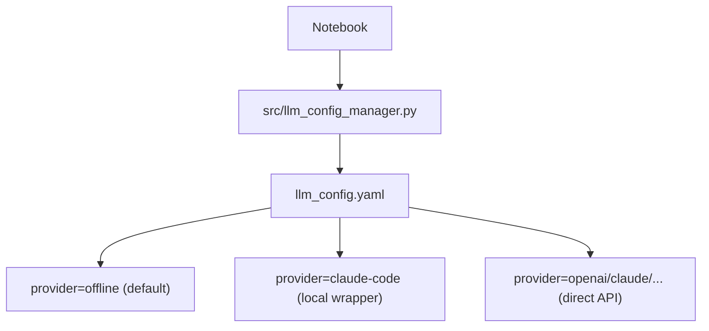
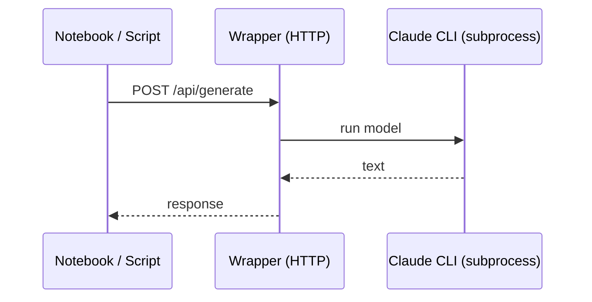

# src/

This directory contains optional infrastructure used by notebooks and scripts.

## Components

- `llm_config_manager.py`: reads `llm_config.yaml` and provides a small helper API for notebooks
- `claude_code_wrapper.py`: optional local HTTP server that proxies to the Claude CLI (or similar)
- `WRAPPER-SETUP-GUIDE.md`: setup guide for running the wrapper

## Prime Config Flow

## Wrapper Architecture

## Notes

- Offline mode exists so the repo remains runnable for anyone without keys or local services.
- When you enable LLM-backed runs, prefer a local wrapper for tool isolation and reproducibility.

