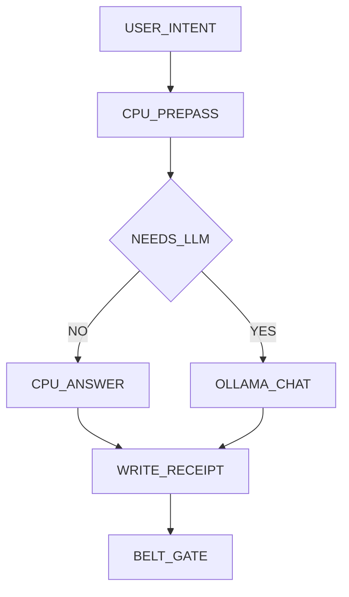

# Recipe: dojo_checkin

```mermaid
flowchart TD
  START[USER_INTENT] --> CPU[CPU_PREPASS]
  CPU --> GATE{NEEDS_LLM}
  GATE -->|NO| ANSWER[CPU_ANSWER]
  GATE -->|YES| LLM[OLLAMA_CHAT]
  ANSWER --> RECEIPT[WRITE_RECEIPT]
  LLM --> RECEIPT
  RECEIPT --> BELT[BELT_GATE]
```

## Notes
- Use for daily twin-orchestration checks.
- Require receipts before claiming improvement.

