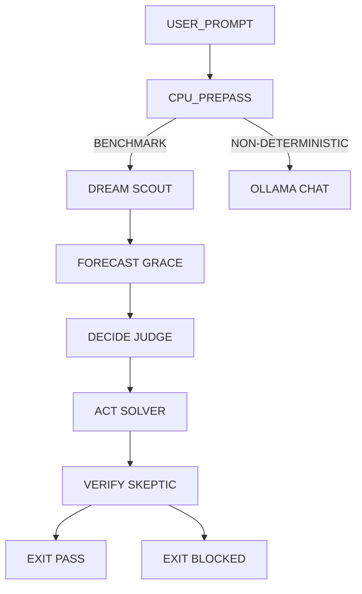

# SWARM ORCHESTRATION SETTINGS (Prime Mermaid)

This file externalizes the PHUC swarm runtime contract for the CLI kernel.
Edit this file (or override via `STILLWATER_SWARM_SETTINGS_FILE`) to change swarm behavior without kernel rewrites.

## Setting Lines (parsed by kernel)

SETTING profile = phuc_swarms
SETTING execution_mode = cpu_prepass_then_llm_fallback
SETTING benchmark_profiles = imo,oolong

SETTING phase_order = DREAM,FORECAST,DECIDE,ACT,VERIFY
SETTING verification_rung_target = 641
SETTING expert_council.enabled = true
SETTING expert_council.required_rung = 65537
SETTING expert_council.virtual_size = 65537
SETTING expert_council.consensus_threshold_641 = 0.55
SETTING expert_council.consensus_threshold_274177 = 0.74
SETTING expert_council.consensus_threshold_65537 = 0.92
SETTING expert_council.concept_coverage_min_274177 = 0.50
SETTING expert_council.concept_coverage_min_65537 = 0.80
SETTING expert_council.section_hits_min_274177 = 1
SETTING expert_council.section_hits_min_65537 = 2
SETTING expert_council.history_keyword_hits_min_274177 = 2
SETTING expert_council.history_keyword_hits_min_65537 = 4
SETTING expert_council.history_keyword_ratio_min_274177 = 0.12
SETTING expert_council.history_keyword_ratio_min_65537 = 0.22
SETTING expert_council.history_number_hits_min_65537 = 1
SETTING expert_council.history_oracle_match_min_65537 = 0.92
SETTING expert_council.response_min_chars = 24
SETTING expert_council.require_route_receipts = true
SETTING expert_council.require_phuc_receipt_for_274177 = true
SETTING expert_council.require_tool_route_for_65537 = true
SETTING expert_council.max_love = true
SETTING expert_council.integrity_mode = strict_fail_closed

SETTING persona.scout = Linus Torvalds
SETTING persona.forecaster = Grace Hopper
SETTING persona.judge = Scope Police
SETTING persona.solver = Brian Kernighan
SETTING persona.skeptic = Leslie Lamport

SETTING mandatory_skill_pack = prime-safety.md,prime-coder.md,prime-math.md,phuc-context.md
SETTING skill_pack = prime-wishes.md,phuc-forecast.md,phuc-swarms.md,phuc-cleanup.md
SETTING agent_skill_policy = merge
SETTING agent_skill_pack.scout = phuc-swarms.md,phuc-context.md,phuc-forecast.md
SETTING agent_skill_pack.forecaster = phuc-forecast.md,prime-math.md,phuc-context.md
SETTING agent_skill_pack.judge = phuc-forecast.md,prime-safety.md,phuc-context.md
SETTING agent_skill_pack.solver = prime-coder.md,prime-math.md,phuc-swarms.md
SETTING agent_skill_pack.skeptic = prime-math.md,prime-safety.md,phuc-forecast.md
SETTING recipe_pack = recipe.twin_orchestration.prime-mermaid.md,recipe.dojo_checkin.prime-mermaid.md
SETTING agent_recipe_policy = merge
SETTING agent_recipe_pack.base = recipe.twin_orchestration.prime-mermaid.md
SETTING agent_recipe_pack.solver = recipe.twin_orchestration.prime-mermaid.md
SETTING agent_recipe_pack.skeptic = recipe.twin_orchestration.prime-mermaid.md

SETTING context_mode = anti_rot_fresh_context_per_phase
SETTING artifact_mode = machine_parseable_receipts_required

SETTING tool_policy.mode = forecast_gate
SETTING tool_policy.default = llm
SETTING tool_route.imo.enabled = true
SETTING tool_route.imo.min_hits = 1
SETTING tool_route.imo.runner = phuc_swarms_benchmark
SETTING tool_route.imo.signals = ramsey,k6,omega(,m_n/a_n,ab+kc,ac+kb,bc+ka,ka+kb+kc,functional equation,∠ypx,∠kil,angle ypx,angle kil,f(x)=x,f(x)=2-x,2024 prime factors,k*n has exactly
SETTING tool_route.math.enabled = true
SETTING tool_route.math.min_hits = 1
SETTING tool_route.math.runner = phuc_math_assist
SETTING tool_route.math.signals = gcd,lcm,modulo,remainder when,prime factor,equation,inequality,triangle,geometry,algebra,number theory,combinatorics,integral,derivative
SETTING tool_route.imo_history.enabled = true
SETTING tool_route.imo_history.min_hits = 2
SETTING tool_route.imo_history.runner = phuc_imo_history_assist
SETTING tool_route.imo_history.signals = solve this problem with a rigorous outline,return: assumptions, core idea, and verification checklist.
SETTING tool_route.oolong.enabled = true
SETTING tool_route.oolong.min_hits = 1
SETTING tool_route.oolong.runner = phuc_swarms_benchmark
SETTING tool_route.oolong.signals = oolong,counter bypass,verification ladder 641,rung 65537
