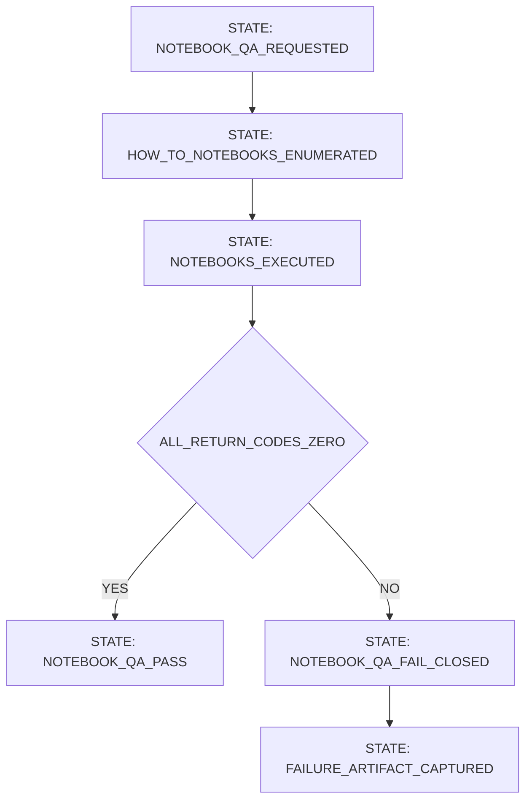

# Prime Mermaid: `wish.cli.notebook.qa.v1`

```mermaid
flowchart TD
  START[STATE: NOTEBOOK_QA_REQUESTED] --> ENUM[STATE: HOW_TO_NOTEBOOKS_ENUMERATED]
  ENUM --> EXEC[STATE: NOTEBOOKS_EXECUTED]
  EXEC --> RC{ALL_RETURN_CODES_ZERO}
  RC -->|YES| PASS[STATE: NOTEBOOK_QA_PASS]
  RC -->|NO| FAIL[STATE: NOTEBOOK_QA_FAIL_CLOSED]
  FAIL --> ART[STATE: FAILURE_ARTIFACT_CAPTURED]
```
