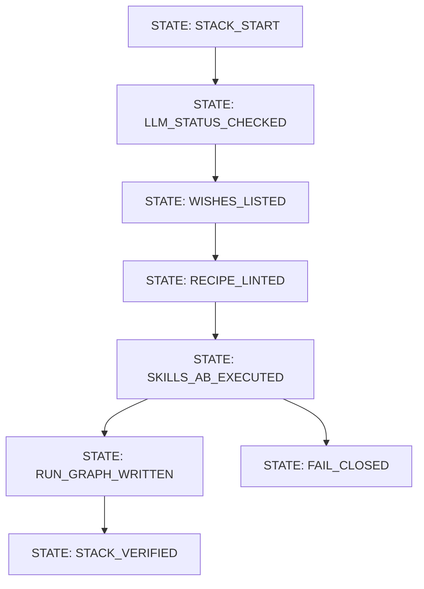

# Prime Mermaid: `wish.cli.stack.run.v1`

```mermaid
flowchart TD
  START[STATE: STACK_START] --> LLM[STATE: LLM_STATUS_CHECKED]
  LLM --> WL[STATE: WISHES_LISTED]
  WL --> RL[STATE: RECIPE_LINTED]
  RL --> SAB[STATE: SKILLS_AB_EXECUTED]
  SAB --> GRAPH[STATE: RUN_GRAPH_WRITTEN]
  GRAPH --> VERIFIED[STATE: STACK_VERIFIED]
  SAB --> FAIL_CLOSED[STATE: FAIL_CLOSED]
```
