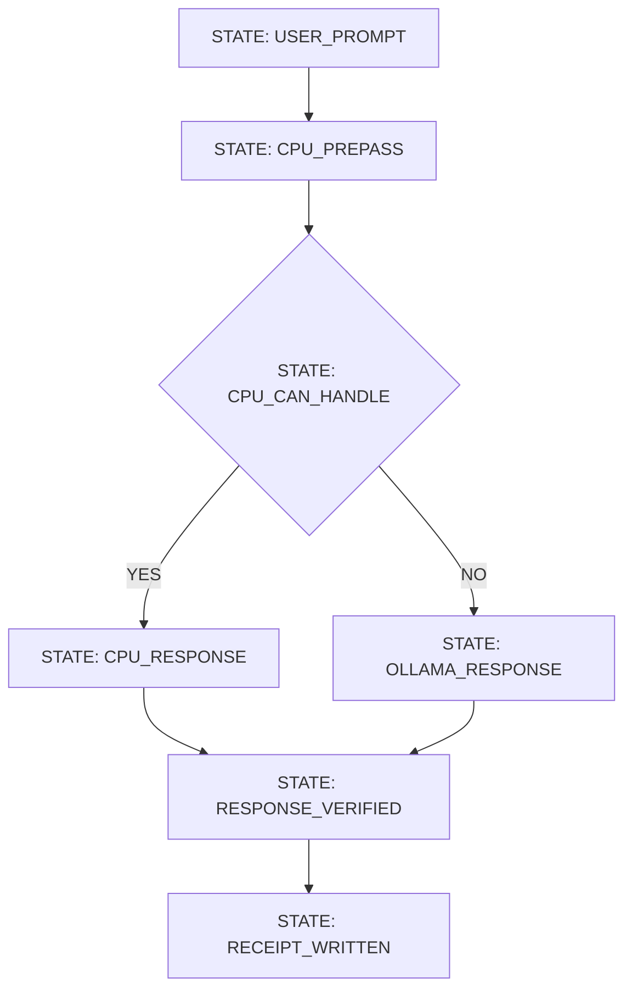

# Prime Mermaid: `wish.cli.twin.orchestration.v1`

```mermaid
flowchart TD
  INPUT[STATE: USER_PROMPT] --> CPU[STATE: CPU_PREPASS]
  CPU --> ROUTE{STATE: CPU_CAN_HANDLE}
  ROUTE -->|YES| C[STATE: CPU_RESPONSE]
  ROUTE -->|NO| LLM[STATE: OLLAMA_RESPONSE]
  C --> VERIFY[STATE: RESPONSE_VERIFIED]
  LLM --> VERIFY
  VERIFY --> RECEIPT[STATE: RECEIPT_WRITTEN]
```
