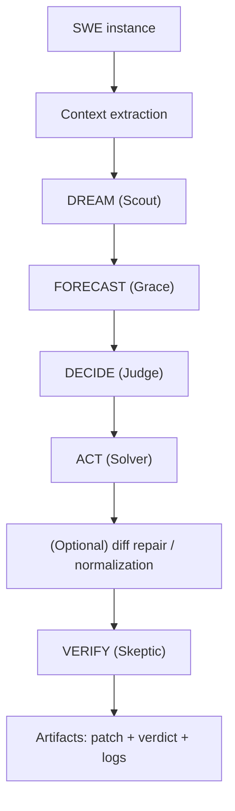
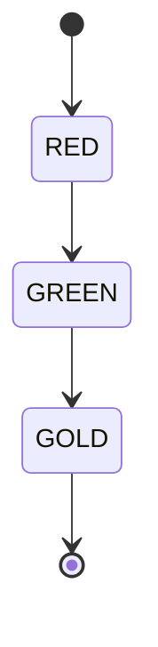

# src/swe/

> "Boards don't hit back." -- Bruce Lee. Tests do.

This folder contains SWE-bench related code and scripts.

Primary runnable artifact:
- `HOW-TO-SWE-BENCHMARK.ipynb` (500 real SWE-bench Verified instances, 100% RED/GREEN)

Code:
- `src/swe/src/solve-swe.py` (runner: demo by default, optional real path)
- `src/swe/src/swe_solver.py` (educational scaffold)
- `src/swe/src/swe_solver_real.py` (optional scaffold that requires external data/tooling; **disabled by default** — requires `STILLWATER_ENABLE_LEGACY_SOLVERS=1`)
- `src/swe/src/swe_solver_unified.py` (optional alternative scaffold; **disabled by default** — requires `STILLWATER_ENABLE_LEGACY_SOLVERS=1`)
- `src/swe/src/batch_processor_phuc_forecast.py` (experimental batch processor; **disabled by default** — requires `STILLWATER_ENABLE_LEGACY_SOLVERS=1`)

Safety note:
- `src/swe/src/haiku_local_server.py` binds to `127.0.0.1` by default and is disabled unless `STILLWATER_ENABLE_LEGACY_SOLVERS=1`.

## SWE Pipeline (Prime Diagram)

## Red / Green / Gold Gate

