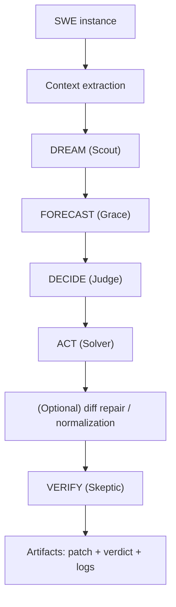
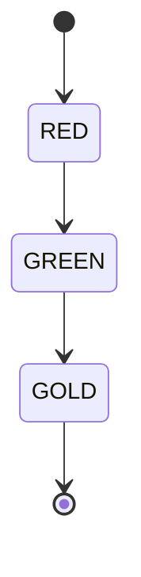

# swe/

> "Boards don't hit back." -- Bruce Lee. Tests do.

This folder contains SWE-bench related code and scripts.

Primary runnable artifact:
- `HOW-TO-CRUSH-SWE-BENCHMARK.ipynb` (500 real SWE-bench Verified instances, 100% RED/GREEN)

Code:
- `swe/src/solve-swe.py` (runner: demo by default, optional real path)
- `swe/src/swe_solver.py` (educational scaffold)
- `swe/src/swe_solver_real.py` (optional scaffold that requires external data/tooling)
- `swe/src/swe_solver_unified.py` (optional alternative scaffold)
- `swe/src/batch_processor_phuc_forecast.py` (experimental batch processor)

## SWE Pipeline (Prime Diagram)

## Red / Green / Gold Gate

