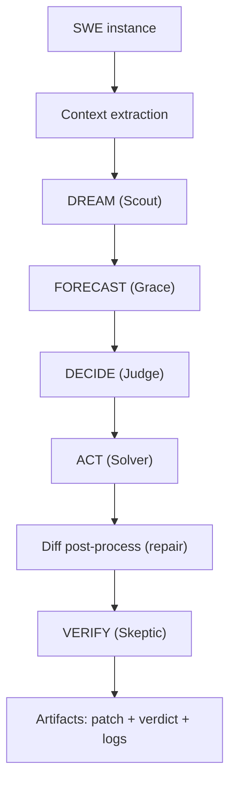
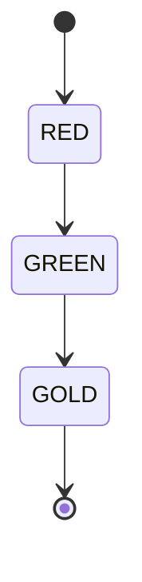

# swe/

This folder contains SWE-bench related code and scripts.

Primary documentation artifact:
- `HOW-TO-CRUSH-SWE-BENCHMARK.md`

Code:
- `swe/src/swe_solver_real.py` (wrapper-backed solver implementation)
- `swe/src/swe_solver_unified.py` (alternative unified runner)
- `batch_1_phuc_orchestration.py` (batch orchestration driver)
- `diff_postprocessor.py` (diff repair helper)

## SWE Pipeline (Prime Diagram)

## Red / Green / Gold Gate

