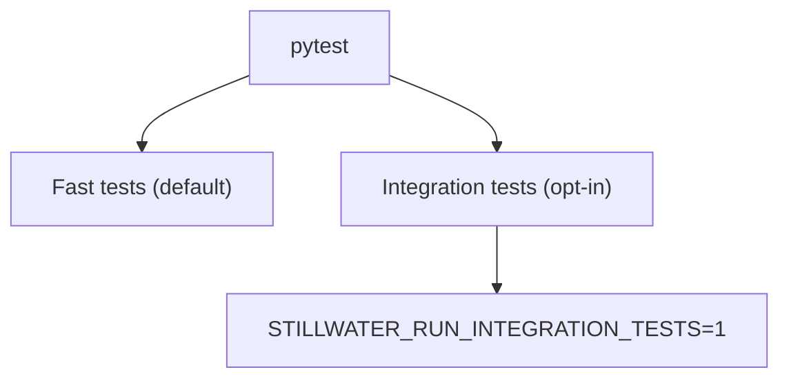

# tests/

This repo includes a small test suite for orchestration behavior.

## Test Layout

- `tests/phuc_orchestration/`: opt-in integration tests (require data + local services)



## Run

Disable auto-loading external pytest plugins (portable + avoids host env issues):

```bash
PYTEST_DISABLE_PLUGIN_AUTOLOAD=1 pytest -q
```

Run integration tests:

```bash
STILLWATER_RUN_INTEGRATION_TESTS=1 PYTEST_DISABLE_PLUGIN_AUTOLOAD=1 pytest -q
```

