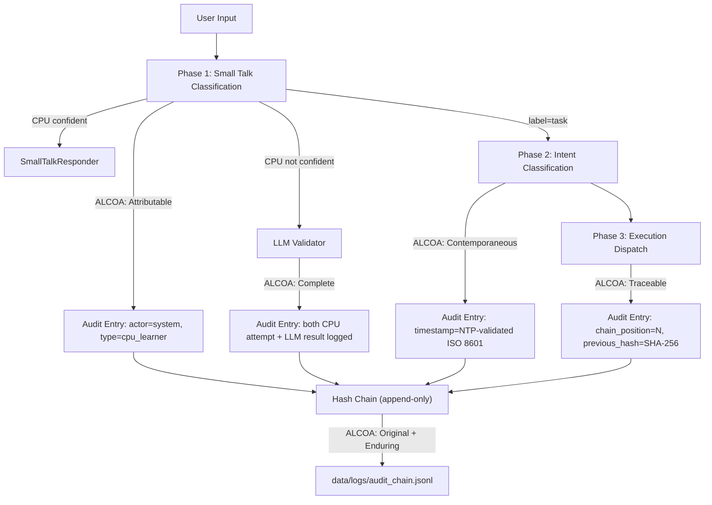
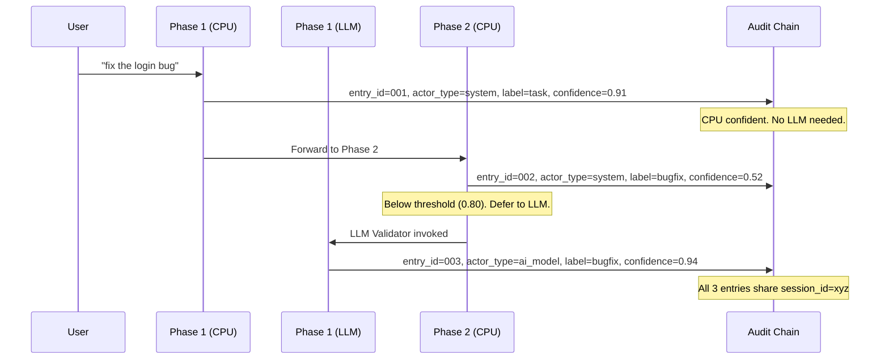
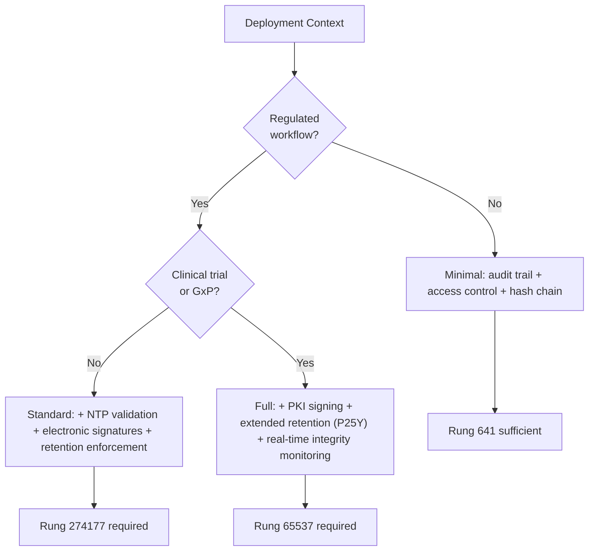
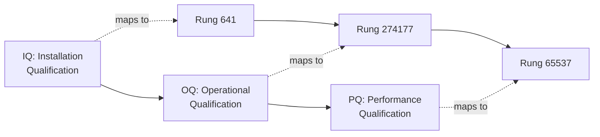
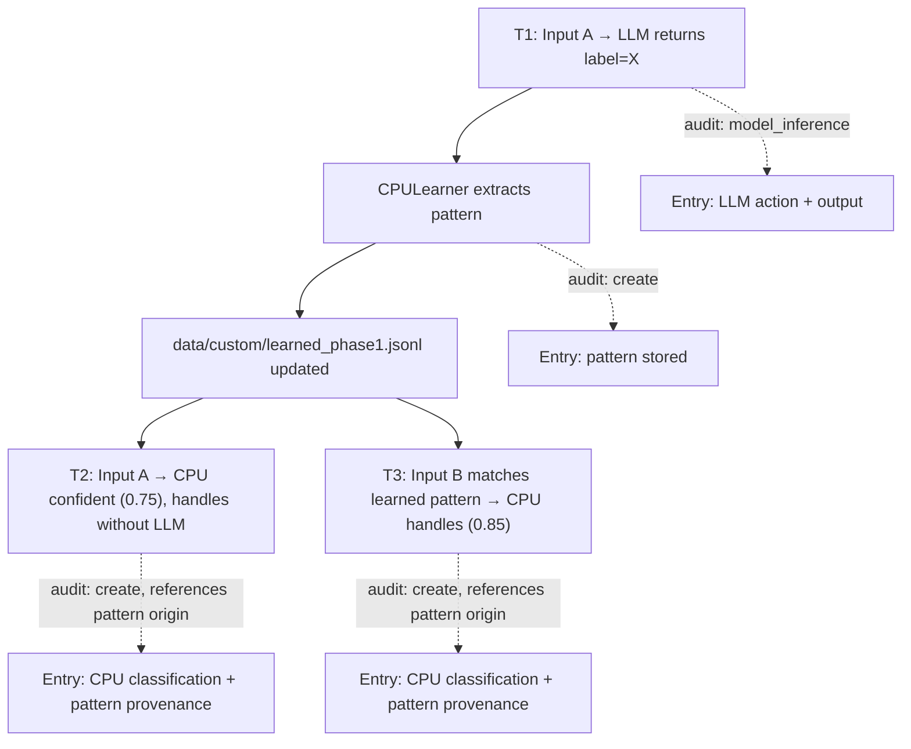
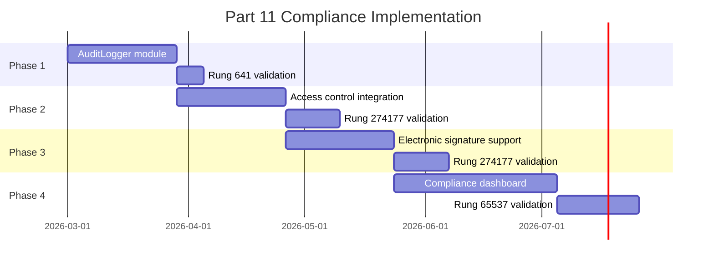

# FDA 21 CFR Part 11 Compliance for the Stillwater AI Orchestration Engine
## A Technical Implementation Guide for Regulated AI Systems

**Paper ID:** STW-ORC-PAPER-004
**Version:** 1.0.0
**Date:** 2026-02-24
**Domain:** Stillwater Orchestration Engine — Regulatory Compliance Architecture
**Rung Target:** 65537
**Status:** Strategic Implementation Paper
**Author:** Phuc Vinh Truong, Stillwater Project

---

## Abstract

FDA 21 CFR Part 11 establishes the criteria under which electronic records and electronic signatures are considered trustworthy, reliable, and equivalent to paper records. Originally enacted in 1997, Part 11 was written for databases and document management systems. It was not written for AI orchestration engines that classify user input through CPU-first pipelines, delegate work to sub-agents, and learn from LLM feedback loops.

This paper maps every Part 11 requirement to concrete Stillwater components — TripleTwinEngine, CPULearner, SmallTalkResponder, DataRegistry — and defines the audit trail schema, ALCOA+ data integrity framework, GAMP 5 validation strategy, and implementation roadmap required to make Stillwater the first AI orchestration engine that is Part 11 Architected rather than Part 11 bolted-on.

The distinction is structural: Part 11 capable means an audit log can be generated if requested. Part 11 Architected means the audit trail is the load-bearing wall. Every action, every classification, every CPU-to-LLM fallback, every learned pattern is recorded with attribution, timestamp, hash chain, and evidence sufficient to survive adversarial regulatory review.

---

## Part 1: Executive Summary

### 1.1 What Is FDA 21 CFR Part 11

Title 21 of the Code of Federal Regulations, Part 11 (21 CFR Part 11), is the FDA regulation that defines the requirements for electronic records and electronic signatures to be considered legally equivalent to paper records and handwritten signatures. It applies to any organization that creates, modifies, maintains, archives, retrieves, or transmits electronic records that are required by FDA regulations.

Part 11 has three core sections:

- **Subpart B (Electronic Records):** Requirements for system controls including validation, audit trails, access controls, operational checks, authority checks, and record retention.
- **Subpart C (Electronic Signatures):** Requirements for signature manifestations, signature/record linking, and controls for identification codes and passwords.
- **General Provisions:** Scope, applicability, and definitions.

The regulation was published in 1997 and has been interpreted through subsequent FDA guidance documents, most notably the 2003 "Scope and Application" guidance that introduced risk-based approaches, the 2018 "Data Integrity and Compliance with Drug CGMP" guidance, and the January 2025 guidance on AI/ML in regulatory decision-making.

### 1.2 Why It Matters for AI Orchestration Systems

AI orchestration engines are entering regulated workflows. Clinical trial data management, pharmaceutical manufacturing, medical device quality systems, and laboratory information management systems increasingly incorporate AI-driven classification, decision support, and automated action. When an AI system creates, modifies, or contributes to electronic records in these contexts, Part 11 applies.

Stillwater is particularly relevant because its architecture — CPU-first classification with LLM fallback, learned pattern persistence, deterministic data overlays — creates electronic records at every stage of the pipeline:

- **Phase 1 classification** creates a record: "this input was classified as small_talk with confidence 0.85 by the CPU path."
- **LLM fallback** creates a record: "the CPU learner was not confident enough; the LLM validator was invoked and returned label=task with confidence 0.92."
- **Pattern learning** creates a record: "the CPULearner stored a new pattern extracted from the LLM response for future CPU handling."
- **DataRegistry writes** create records: "data/custom/learned_phase1.jsonl was updated with 3 new patterns."

Each of these records must satisfy Part 11 requirements if Stillwater operates in a regulated context. The question is not whether Part 11 applies — it is whether the architecture was designed to satisfy it.

### 1.3 Stillwater's Compliance Strategy

Stillwater's compliance strategy rests on three principles:

1. **Determinism first.** The CPU path (CPULearner, SmallTalkResponder) is fully deterministic with seeded random. Deterministic systems produce reproducible audit trails. Every classification can be replayed from the same input and seed to produce the same output. This is the strongest possible compliance posture.

2. **LLM as audited exception.** The LLM path is non-deterministic by nature. Rather than pretending LLM outputs are reproducible, Stillwater treats every LLM invocation as an auditable event with extended metadata: model version, input hash, output hash, token count, temperature, and the specific reason the CPU learner deferred.

3. **Evidence over claims.** The rung verification ladder (641, 274177, 65537) enforces evidence-gated promotion. No component advances to production status without executable evidence. This maps directly to Part 11's validation requirements (Section 11.10(a)) and to GAMP 5's risk-based validation lifecycle.

---

## Part 2: Part 11 Requirements Mapped to Stillwater

The following table maps each major Part 11 section to concrete Stillwater features and implementation evidence.

### 2.1 Subpart B: Electronic Records (Section 11.10)

| Part 11 Section | Requirement | Stillwater Component | Implementation |
|---|---|---|---|
| 11.10(a) | System validation | Rung verification ladder | IQ/OQ/PQ mapped to rungs 641/274177/65537; test suites in `tests/orchestration/` |
| 11.10(b) | Generate accurate and complete copies | DataRegistry + JSONL format | All records in JSONL (human-readable, line-delimited); `DataRegistry.load_data_file()` produces byte-identical copies |
| 11.10(c) | Record protection throughout retention period | DataRegistry overlay (default/ read-only, custom/ write-only) | `data/default/` is git-tracked, immutable at runtime; `data/custom/` is append-friendly JSONL |
| 11.10(d) | Limit system access to authorized individuals | OAuth3 scope enforcement | `validate_scopes()` called before every action; token-based delegation with revocation |
| 11.10(e) | Secure, computer-generated, time-stamped audit trails | Part11AuditEntry (see Part 4) | Hash-chained append-only audit log; SHA-256 linked entries; NTP-validated timestamps |
| 11.10(f) | Operational system checks to enforce permitted sequencing | TripleTwinEngine FSM | Phase 1 must complete before Phase 2; Phase 2 before Phase 3; forbidden state transitions enumerated in state machine |
| 11.10(g) | Authority checks | OAuth3 + rung gates | Authority verified at each phase boundary; rung level determines permitted actions |
| 11.10(h) | Device checks (source data entry) | Input validation in `TripleTwinEngine.process()` | Null checks, length bounds, encoding validation before pipeline entry |
| 11.10(i) | Personnel training documentation | Skills system (`skills/*.md`) | Each skill file documents required competencies; operator must load skill before production work |
| 11.10(j) | Written policies for accountability | `CLAUDE.md` + skill FORBIDDEN lists | Explicit forbidden actions enumerated in every skill; violation = BLOCKED state |
| 11.10(k) | System documentation controls | Git versioning + DataRegistry overlay | `data/default/` is version-controlled; changes require commit with evidence |

### 2.2 Subpart B: Open Systems (Section 11.30)

| Part 11 Section | Requirement | Stillwater Component | Implementation |
|---|---|---|---|
| 11.30(a) | Document encryption for open systems | AES-256-GCM (OAuth3 vault) | Token store encrypted at rest; TLS 1.3 in transit |
| 11.30(b) | Digital signatures for open systems | SHA-256 content addressing | Every audit entry includes content hash; chain integrity verifiable |

### 2.3 Subpart B: Signature Manifestations and Linking (Sections 11.50, 11.70)

| Part 11 Section | Requirement | Stillwater Component | Implementation |
|---|---|---|---|
| 11.50(a) | Signed records display signer info | AgencyToken metadata | `issuer`, `subject`, `scopes`, `meaning` fields in token schema |
| 11.50(b) | Signed records display signature meaning | `action.signature_meaning` field | "approved", "rejected", "reviewed", "authored" — captured in audit entry |
| 11.70 | Signatures linked to records | SHA-256 binding | Token ID bound to action record via `integrity.entry_hash`; content-addressed |

### 2.4 Subpart C: Electronic Signatures (Sections 11.100-11.300)

| Part 11 Section | Requirement | Stillwater Component | Implementation |
|---|---|---|---|
| 11.100 | Signatures unique to one individual | OAuth3 `subject` field | One principal per token; no shared credentials |
| 11.200(a) | Two distinct identification components | OAuth3 token + user authentication | Token ID (what you have) + passphrase/biometric (what you know/are) |
| 11.200(b) | Initial use requires all components | Consent flow requires explicit approval | `POST /oauth3/consent/approve` requires authenticated session |
| 11.300 | Controls for identification codes/passwords | OAuth3 token lifecycle | Expiry (`ttl_seconds`), revocation (`DELETE /oauth3/tokens/{id}`), scope limitation |

---

## Part 3: ALCOA+ Data Integrity Principles

ALCOA is the FDA's foundational data integrity standard. ALCOA+ extends it with five additional principles. Together, they define what makes an electronic record trustworthy.

### 3.1 The ALCOA Core

| Principle | Definition | Stillwater Implementation |
|---|---|---|
| **Attributable** | Every record traceable to a specific person or system | `actor` block in Part11AuditEntry: `user_id`, `actor_type` (human, system, ai_model), `session_id`, `ip_address` |
| **Legible** | Records readable throughout retention period | JSONL format (plain text, UTF-8); human-readable without proprietary software; Mermaid diagrams for visual audit |
| **Contemporaneous** | Recorded at time of activity, not retrospectively | ISO 8601 UTC timestamps; NTP-validated; `timestamp_source` field declares clock trust level |
| **Original** | First-capture data, or a verified true copy | DataRegistry ensures `data/default/` is the original; `data/custom/` overlays are append-only; hash chain prevents retroactive alteration |
| **Accurate** | Free from errors, complete, truthful | Rung verification gates: no PASS without executable evidence; CPULearner confidence thresholds enforce minimum accuracy |

### 3.2 The "+" Extension

| Principle | Definition | Stillwater Implementation |
|---|---|---|
| **Complete** | All data including repeated or reanalyzed results | Every LLM fallback recorded alongside CPU attempt; both paths logged even when CPU succeeds |
| **Consistent** | Data follows expected patterns and sequences | `action.sequence_number` enforces monotonic ordering; hash chain detects gaps or reordering |
| **Enduring** | Durable for the required retention period | JSONL on filesystem (no database dependency); `metadata.retention_period` field governs lifecycle |
| **Available** | Accessible for review throughout retention period | DataRegistry provides `load_data_file()` API; no proprietary format lock-in; plain text survives any platform |
| **Traceable** | Full lifecycle from creation through archival | Hash chain links every entry to its predecessor; `integrity.chain_position` provides absolute ordering |

### 3.3 ALCOA+ Applied to the TripleTwinEngine Pipeline



Each phase of the TripleTwinEngine produces at least one audit entry. When the CPU learner defers to the LLM validator, both the CPU attempt and the LLM result are recorded (ALCOA: Complete). The hash chain links all entries in monotonic sequence (ALCOA: Traceable). The JSONL file is the original record, stored in plain text for the defined retention period (ALCOA: Original, Enduring).

---

## Part 4: Audit Trail Schema (Part11AuditEntry)

The following JSON schema defines the audit entry format for Part 11 compliance. Every action in the Stillwater pipeline produces one Part11AuditEntry appended to the hash-chained audit log.

### 4.1 Full Schema

```json
{
  "$schema": "https://json-schema.org/draft/2020-12/schema",
  "title": "Part11AuditEntry",
  "description": "FDA 21 CFR Part 11 compliant audit trail entry for Stillwater orchestration engine",
  "type": "object",
  "required": [
    "entry_id",
    "timestamp",
    "timestamp_source",
    "actor",
    "action",
    "resource",
    "outcome",
    "integrity",
    "metadata"
  ],
  "properties": {
    "entry_id": {
      "type": "string",
      "format": "uuid",
      "description": "UUID v7 (time-ordered) — guarantees monotonic ordering without relying solely on wall clock. Encodes millisecond-precision timestamp in the UUID itself, making the entry self-describing for temporal ordering."
    },
    "timestamp": {
      "type": "string",
      "format": "date-time",
      "description": "ISO 8601 UTC with microsecond precision. Example: 2026-02-24T14:30:00.123456Z. Must be recorded at time of action, never retrospectively."
    },
    "timestamp_source": {
      "type": "string",
      "enum": ["ntp_validated", "system_clock", "external_trusted"],
      "description": "Declares how the timestamp was obtained. ntp_validated: system clock synchronized with NTP within last 60 seconds. system_clock: local clock without NTP validation (acceptable for rung 641, flagged at rung 65537). external_trusted: timestamp from a trusted external system (e.g., HSM, blockchain anchor)."
    },
    "actor": {
      "type": "object",
      "required": ["user_id", "actor_type"],
      "properties": {
        "user_id": {
          "type": "string",
          "description": "Unique identifier for the actor. For human users: OAuth3 subject. For system actions: 'system:<component_name>'. For AI models: 'model:<provider>:<model_id>'."
        },
        "display_name": {
          "type": "string",
          "description": "Human-readable name for audit trail legibility."
        },
        "actor_type": {
          "type": "string",
          "enum": ["human", "system", "ai_model"],
          "description": "Distinguishes human operators from automated system components from AI model invocations. Critical for Part 11 attribution — AI actions must be distinguishable from human actions."
        },
        "model_version": {
          "type": "string",
          "description": "Required when actor_type=ai_model. Full model identifier including version. Example: 'anthropic:claude-3-haiku:20250301'. Null for human and system actors."
        },
        "session_id": {
          "type": "string",
          "format": "uuid",
          "description": "Links multiple audit entries from the same user session. Enables session-level audit reconstruction."
        },
        "ip_address": {
          "type": "string",
          "description": "Source IP address at time of action. IPv4 or IPv6. Required for human actors, optional for system actors."
        },
        "device_id": {
          "type": "string",
          "description": "Device fingerprint or terminal identifier. Supports multi-device audit scenarios."
        }
      }
    },
    "action": {
      "type": "object",
      "required": ["type", "description", "sequence_number"],
      "properties": {
        "type": {
          "type": "string",
          "enum": [
            "create",
            "read",
            "update",
            "delete",
            "sign",
            "approve",
            "reject",
            "review",
            "login",
            "logout",
            "auth_failure",
            "config_change",
            "model_inference",
            "model_retrain",
            "export",
            "archive",
            "restore"
          ],
          "description": "Action taxonomy. Standard CRUD operations plus signature actions (sign, approve, reject, review), authentication events (login, logout, auth_failure), system events (config_change, model_inference, model_retrain), and lifecycle events (export, archive, restore)."
        },
        "description": {
          "type": "string",
          "description": "Human-readable description of the action. Must be specific enough to reconstruct what happened without accessing the system. Example: 'Phase 1 CPULearner classified input as greeting with confidence 0.87'."
        },
        "signature_meaning": {
          "type": "string",
          "enum": ["approved", "rejected", "reviewed", "authored", "witnessed", null],
          "description": "Required for sign/approve/reject/review actions per 11.50(b). Null for non-signature actions."
        },
        "sequence_number": {
          "type": "integer",
          "minimum": 0,
          "description": "Monotonically increasing integer within the audit chain. Enforces operational sequencing per 11.10(f). Gaps in sequence numbers indicate potential tampering or data loss."
        }
      }
    },
    "resource": {
      "type": "object",
      "required": ["type", "id"],
      "properties": {
        "type": {
          "type": "string",
          "description": "Resource type being acted upon. Examples: 'classification_result', 'learned_pattern', 'data_file', 'oauth3_token', 'config', 'user_session'."
        },
        "id": {
          "type": "string",
          "description": "Unique identifier for the resource."
        },
        "version": {
          "type": "string",
          "description": "Version of the resource at time of action. Supports change tracking."
        },
        "path": {
          "type": "string",
          "description": "Filesystem or logical path. Example: 'data/custom/learned_phase1.jsonl'."
        }
      }
    },
    "change_detail": {
      "type": "object",
      "description": "Required for update and delete actions. Documents what changed and why.",
      "properties": {
        "field_name": {
          "type": "string",
          "description": "Name of the field that changed."
        },
        "old_value": {
          "description": "Previous value. Type varies by field. Null for create actions."
        },
        "new_value": {
          "description": "New value. Type varies by field. Null for delete actions."
        },
        "reason": {
          "type": "string",
          "description": "Why the change was made. Required for all update and delete actions per Part 11 audit trail requirements. Must not be empty."
        }
      }
    },
    "outcome": {
      "type": "string",
      "enum": ["success", "failure", "blocked", "pending_review"],
      "description": "Result of the action. 'blocked' indicates the action was prevented by a safety gate, authority check, or rung requirement. 'pending_review' indicates the action requires human approval before taking effect."
    },
    "integrity": {
      "type": "object",
      "required": ["hash_algorithm", "entry_hash", "previous_hash", "chain_position"],
      "properties": {
        "hash_algorithm": {
          "type": "string",
          "enum": ["SHA-256", "SHA-512", "BLAKE3"],
          "description": "Hash algorithm used. SHA-256 is the default for Part 11 compliance. SHA-512 for enhanced security contexts. BLAKE3 for high-throughput scenarios where SHA-256 is a bottleneck."
        },
        "entry_hash": {
          "type": "string",
          "description": "Hash of this entire entry (excluding the entry_hash field itself). Computed over the canonical JSON serialization (sorted keys, no whitespace, UTF-8). Enables tamper detection."
        },
        "previous_hash": {
          "type": "string",
          "description": "Hash of the previous entry in the chain. Null for the genesis entry (chain_position=0). Creates an append-only hash chain — modifying any historical entry breaks all subsequent hashes."
        },
        "chain_position": {
          "type": "integer",
          "minimum": 0,
          "description": "Absolute position in the audit chain. Must equal sequence_number for single-chain deployments. In multi-chain deployments (e.g., per-session chains), chain_position is relative to the chain."
        }
      }
    },
    "metadata": {
      "type": "object",
      "required": ["system_name", "system_version"],
      "properties": {
        "system_name": {
          "type": "string",
          "description": "Name of the system that generated this entry. Example: 'stillwater-orchestration-engine'."
        },
        "system_version": {
          "type": "string",
          "description": "Semantic version of the system. Example: '1.5.0'. Required for change control — audit entries from different system versions may have different schemas."
        },
        "predicate_rule": {
          "type": "string",
          "description": "The FDA predicate rule or guidance that applies. Example: '21_CFR_Part_11', 'FDA_AI_ML_Guidance_2025'. Null for non-regulated contexts."
        },
        "retention_period": {
          "type": "string",
          "description": "ISO 8601 duration for how long this record must be retained. Example: 'P7Y' (7 years), 'P25Y' (25 years for clinical trial data). Governs archival and deletion policies."
        }
      }
    }
  }
}
```

### 4.2 Example: CPU Classification Entry

```json
{
  "entry_id": "019529a0-7c00-7000-8000-000000000001",
  "timestamp": "2026-02-24T14:30:00.123456Z",
  "timestamp_source": "ntp_validated",
  "actor": {
    "user_id": "system:cpu_learner_phase1",
    "display_name": "CPULearner (Phase 1)",
    "actor_type": "system",
    "model_version": null,
    "session_id": "a1b2c3d4-e5f6-7890-abcd-ef1234567890",
    "ip_address": null,
    "device_id": null
  },
  "action": {
    "type": "create",
    "description": "Phase 1 CPULearner classified input 'hello there' as greeting with confidence 0.87. CPU threshold 0.70 met. LLM fallback not required.",
    "signature_meaning": null,
    "sequence_number": 42
  },
  "resource": {
    "type": "classification_result",
    "id": "cls_019529a0_001",
    "version": "1",
    "path": null
  },
  "change_detail": null,
  "outcome": "success",
  "integrity": {
    "hash_algorithm": "SHA-256",
    "entry_hash": "a3f2b8c1d4e5f6a7b8c9d0e1f2a3b4c5d6e7f8a9b0c1d2e3f4a5b6c7d8e9f0a1",
    "previous_hash": "b4c3d2e1f0a9b8c7d6e5f4a3b2c1d0e9f8a7b6c5d4e3f2a1b0c9d8e7f6a5b4c3",
    "chain_position": 42
  },
  "metadata": {
    "system_name": "stillwater-orchestration-engine",
    "system_version": "1.5.0",
    "predicate_rule": "21_CFR_Part_11",
    "retention_period": "P7Y"
  }
}
```

### 4.3 Example: LLM Fallback Entry

```json
{
  "entry_id": "019529a0-7c00-7000-8000-000000000002",
  "timestamp": "2026-02-24T14:30:01.456789Z",
  "timestamp_source": "ntp_validated",
  "actor": {
    "user_id": "model:anthropic:claude-3-haiku:20250301",
    "display_name": "Claude 3 Haiku (LLM Validator)",
    "actor_type": "ai_model",
    "model_version": "anthropic:claude-3-haiku:20250301",
    "session_id": "a1b2c3d4-e5f6-7890-abcd-ef1234567890",
    "ip_address": null,
    "device_id": null
  },
  "action": {
    "type": "model_inference",
    "description": "Phase 2 LLM Validator invoked after CPULearner confidence 0.52 fell below threshold 0.80. LLM returned label=code_review with confidence 0.94. Input hash: SHA-256(input)=d4e5f6... Output hash: SHA-256(output)=a1b2c3... Token count: 127 input, 34 output.",
    "signature_meaning": null,
    "sequence_number": 43
  },
  "resource": {
    "type": "classification_result",
    "id": "cls_019529a0_002",
    "version": "1",
    "path": null
  },
  "change_detail": null,
  "outcome": "success",
  "integrity": {
    "hash_algorithm": "SHA-256",
    "entry_hash": "c5d4e3f2a1b0c9d8e7f6a5b4c3d2e1f0a9b8c7d6e5f4a3b2c1d0e9f8a7b6c5",
    "previous_hash": "a3f2b8c1d4e5f6a7b8c9d0e1f2a3b4c5d6e7f8a9b0c1d2e3f4a5b6c7d8e9f0a1",
    "chain_position": 43
  },
  "metadata": {
    "system_name": "stillwater-orchestration-engine",
    "system_version": "1.5.0",
    "predicate_rule": "21_CFR_Part_11",
    "retention_period": "P7Y"
  }
}
```

---

## Part 5: CPU vs LLM Audit Trail Differences

The dual-path architecture of Stillwater (CPU-first with LLM fallback) creates two fundamentally different audit profiles. Understanding these differences is essential for Part 11 compliance because the evidentiary requirements differ between deterministic and non-deterministic systems.

### 5.1 CPU Path: Deterministic Audit

The CPU path (CPULearner + SmallTalkResponder) is fully deterministic when given the same input, seed data, and random seed. This is the strongest possible compliance posture.

**Properties:**
- **Reproducible:** Given the same input and seed files (`data/default/seeds/*.jsonl`), the same classification is produced every time.
- **Inspectable:** The keyword matching logic is transparent — no hidden weights, no opaque embeddings, no temperature sampling.
- **Fast:** Sub-millisecond classification means the audit timestamp is effectively simultaneous with the action.
- **Bounded:** The CPULearner cannot produce outputs outside the known label set. There are no hallucinations.

**Standard Audit Entry fields:**

| Field | CPU Path Value | Notes |
|---|---|---|
| `actor.actor_type` | `system` | The CPU learner is a deterministic system component |
| `actor.model_version` | `null` | No model involved |
| `action.type` | `create` | Classification result created |
| `action.description` | Includes confidence score, matched keywords, threshold comparison | Fully reconstructable from input + seed data |

**Replay guarantee:** An auditor can take the input text, the seed files at the recorded version, and the CPULearner source code at the recorded system version, and reproduce the exact same classification. This is a complete audit replay — the strongest evidence possible under Part 11.

### 5.2 LLM Path: Non-Deterministic Audit

The LLM path (LLMValidator invoked when CPULearner confidence falls below threshold) is inherently non-deterministic. The same input may produce different outputs depending on model version, temperature, system prompt version, and internal model state.

**Properties:**
- **Non-reproducible:** The same input may yield different outputs across invocations, even with temperature=0, due to batching and hardware non-determinism.
- **Opaque:** The reasoning process inside the LLM is not inspectable.
- **Latency-variable:** Response time varies from 500ms to 5s, creating timestamp uncertainty.
- **Unbounded:** The LLM can produce outputs outside the expected label set (hallucination risk).

**Extended Audit Entry fields (in addition to standard fields):**

| Field | LLM Path Value | Notes |
|---|---|---|
| `actor.actor_type` | `ai_model` | Explicitly marks this as an AI-generated record |
| `actor.model_version` | Full model identifier with version | Required for change control |
| `action.type` | `model_inference` | Distinct from `create` — signals non-deterministic origin |
| `action.description` | Includes input hash, output hash, token count, temperature, reason for CPU deferral | Extended metadata for non-deterministic actions |

**Additional LLM-specific metadata captured in the description:**
- `input_hash`: SHA-256 of the exact input sent to the LLM (including system prompt)
- `output_hash`: SHA-256 of the raw LLM response
- `token_count`: Input and output token counts
- `temperature`: Sampling temperature used
- `cpu_confidence`: The CPULearner confidence that triggered fallback
- `cpu_threshold`: The threshold that was not met

**Why the distinction matters:** An auditor reviewing a CPU path entry can verify the result by replaying the classification. An auditor reviewing an LLM path entry cannot replay the result — but can verify that (a) the CPU correctly deferred, (b) the LLM was invoked with the recorded input, (c) the response matches the recorded output hash, and (d) the learned pattern was correctly extracted and stored.

### 5.3 Twin Orchestration: Session-Level Linking

Both CPU and LLM audit entries within the same user interaction share a `session_id`. This enables session-level audit reconstruction:



An auditor can reconstruct the complete decision path: Phase 1 CPU classified confidently, Phase 2 CPU was uncertain, Phase 2 LLM provided the final classification. The session_id links all three entries. The sequence_numbers enforce ordering. The hash chain prevents retroactive modification.

---

## Part 6: Mandatory vs Discretionary Requirements

Part 11 requirements fall into two categories: mandatory (always enforced regardless of risk) and discretionary (risk-based, enforced when the record's regulatory significance warrants it). The 2003 FDA guidance on scope and application introduced this risk-based approach.

### 6.1 Requirements Matrix

| Requirement | Part 11 Section | Category | Stillwater Enforcement | Rationale |
|---|---|---|---|---|
| Audit trail for record creation/modification/deletion | 11.10(e) | **Mandatory** | Always on. Every Part11AuditEntry is appended to the hash chain. Cannot be disabled. | Audit trails are the foundation of Part 11. Without them, no other requirement has meaning. |
| Unique user identification | 11.100 | **Mandatory** | Always on. OAuth3 subject field is required for every action. | Attribution is non-negotiable — every record must be traceable to its source. |
| System validation | 11.10(a) | **Mandatory** | Always on. Rung verification ladder gates every component. | Unvalidated systems cannot produce trustworthy records. |
| Access controls | 11.10(d) | **Mandatory** | Always on. OAuth3 scope enforcement at every action boundary. | Access without authorization violates the fundamental trust model. |
| Operational sequencing | 11.10(f) | **Mandatory** | Always on. TripleTwinEngine state machine enforces phase ordering. | Out-of-sequence operations can corrupt records. |
| Hash chain integrity | 11.10(e) | **Mandatory** | Always on. SHA-256 chain verified on read and write. | Tamper detection is not optional in regulated contexts. |
| Electronic signature with meaning | 11.50 | **Discretionary** | Enabled when `predicate_rule` is set. Disabled for non-regulated contexts. | Not all Stillwater deployments require electronic signatures. Clinical trial contexts require them; personal CLI usage does not. |
| Digital signature (cryptographic) | 11.30(b) | **Discretionary** | Enabled for open system deployments. SHA-256 content addressing is always available; PKI signing is optional. | Open systems (internet-facing) require stronger assurance than closed systems (local CLI). |
| Biometric signatures | 11.200(a) | **Discretionary** | Not implemented. Hardware-dependent. Documented as out-of-scope for v1.x. | Biometric signatures require specialized hardware that Stillwater's CLI-first architecture does not assume. |
| Record encryption at rest | 11.30(a) | **Discretionary** | Enabled for sensitive data (OAuth3 vault: AES-256-GCM). Audit logs are plaintext JSONL (integrity via hash chain, not encryption). | Audit logs need to be readable; encryption would hinder the legibility requirement. Token vaults contain secrets; they must be encrypted. |
| NTP-validated timestamps | 11.10(e) | **Mandatory for rung 65537** | Rung 641: system clock acceptable. Rung 274177: NTP recommended. Rung 65537: NTP required, `timestamp_source` must be `ntp_validated`. | Timestamp reliability scales with regulatory significance. A local development audit can tolerate clock drift. A production clinical trial audit cannot. |
| Retention period enforcement | 11.10(c) | **Discretionary** | Configurable via `metadata.retention_period`. Default: P7Y (7 years). | Retention periods vary by regulatory context: 7 years for general FDA, 25 years for clinical trials, indefinite for certain safety data. |
| Training documentation | 11.10(i) | **Discretionary** | Skills system provides training documentation. Enforcement is organizational, not technical. | Part 11 requires that personnel be trained. Stillwater provides the materials; the organization enforces the policy. |

### 6.2 Risk-Based Activation



The rung ladder maps naturally to Part 11 enforcement levels:

- **Rung 641 (local):** Mandatory requirements only. Sufficient for development, testing, and non-regulated use.
- **Rung 274177 (stability):** Mandatory + stress-tested discretionary. Sufficient for standard regulated workflows.
- **Rung 65537 (production/security):** All requirements active. Required for GxP, clinical trials, and adversarial regulatory review.

---

## Part 7: GAMP 5 Category 5 Validation

### 7.1 What Is GAMP 5

Good Automated Manufacturing Practice (GAMP) 5 is the ISPE (International Society for Pharmaceutical Engineering) guide for validating computerized systems in regulated environments. It classifies software into categories based on configurability and customization:

| Category | Description | Example | Validation Effort |
|---|---|---|---|
| 1 | Infrastructure software | Operating systems, databases | Minimal — rely on vendor qualification |
| 3 | Non-configured products | Off-the-shelf software used as-is | Moderate — verify installation and operation |
| 4 | Configured products | ERP/LIMS configured but not custom-coded | Significant — verify configuration meets requirements |
| 5 | Custom applications | Bespoke software built for specific purpose | **Maximum** — full lifecycle validation required |

### 7.2 Stillwater Is Category 5

Stillwater is custom software. The TripleTwinEngine, CPULearner, SmallTalkResponder, and DataRegistry are purpose-built components with no off-the-shelf equivalent. The AI orchestration pipeline — CPU-first classification with LLM fallback and pattern learning — is a novel architecture.

Category 5 classification means maximum validation rigor:
- Full lifecycle documentation (requirements, design, code, testing)
- Formal risk assessment
- Installation Qualification (IQ), Operational Qualification (OQ), and Performance Qualification (PQ)
- Ongoing change control and periodic review

### 7.3 IQ/OQ/PQ Mapped to the Rung Ladder

The three qualification stages of GAMP 5 map directly to Stillwater's rung verification ladder:



#### Rung 641 = Installation Qualification (IQ)

**Purpose:** Verify that the system is installed correctly and all components are present.

**Stillwater IQ checklist:**

| IQ Check | Stillwater Evidence | Test |
|---|---|---|
| All source files present | `src/cli/src/stillwater/*.py` exists | `pytest tests/ --collect-only` |
| Dependencies resolved | `pyproject.toml` dependencies installed | `pip check` |
| Data files present | `data/default/` populated with seed files | `DataRegistry.load_data_file("seeds/phase1.jsonl")` returns content |
| Configuration valid | CPU node configs parse without error | `CPULearner("phase1")` initializes without exception |
| Audit chain initializable | `data/logs/` directory writable | Genesis entry created with `chain_position=0` |

#### Rung 274177 = Operational Qualification (OQ)

**Purpose:** Verify that the system operates correctly across its designed operating range, including boundary conditions and failure modes.

**Stillwater OQ checklist:**

| OQ Check | Stillwater Evidence | Test |
|---|---|---|
| Phase 1 classification correct | 170+ unit tests passing | `pytest tests/orchestration/phase1/` |
| LLM fallback triggers correctly | CPU confidence below threshold triggers LLM | Parametrized test: input with confidence 0.65 triggers fallback |
| DataRegistry overlay works | custom/ overrides default/ | Write to custom/, verify read returns custom value |
| Audit chain integrity | Hash chain unbroken across 1000 entries | Generate 1000 entries, verify all hashes |
| Edge cases handled | 8 breaking patterns tested | `tests/orchestration/qa-recipe.md` patterns executed |
| Seed sweep stability | 100 random seeds produce consistent classifications | Parametrized test with seeds 0-99 |
| Null/zero edge cases | Empty input, ultra-short input, all-stop-words | Explicit null/zero test cases |
| Error recovery | LLM timeout, network failure, disk full | Fault injection tests |

#### Rung 65537 = Performance Qualification (PQ)

**Purpose:** Verify that the system performs correctly under real-world conditions with real data, and that it can withstand adversarial review.

**Stillwater PQ checklist:**

| PQ Check | Stillwater Evidence | Test |
|---|---|---|
| End-to-end pipeline | User input through all 3 phases to response | E2E integration tests with real prompts |
| Audit trail completeness | Every action produces an audit entry | Verify entry count matches action count |
| Audit trail tamper detection | Modified entry detected by hash chain | Corrupt one entry, verify chain validation fails |
| Adversarial input handling | Injection attacks, prompt manipulation | Security test suite with adversarial inputs |
| NTP timestamp validation | All entries have `ntp_validated` timestamp source | Production log analysis |
| Concurrent access safety | Multiple sessions produce valid, non-interleaved audit chains | Multi-threaded test with shared audit log |
| Retention period compliance | Records accessible after simulated retention period | Time-travel test: create record, advance clock, verify retrieval |
| Independent verification | Second implementation agrees with first on classification | Cross-implementation test suite |
| Regulatory persona review | Would this audit trail survive FDA inspection? | Persona-based adversarial review (see Part 8) |

### 7.4 Validation Summary Report Template

```
VALIDATION SUMMARY REPORT
System: Stillwater Orchestration Engine
Version: [system_version]
Date: [validation_date]
GAMP Category: 5 (Custom Application)

IQ (Rung 641): [PASS/FAIL]
  Tests executed: [count]
  Tests passed: [count]
  Deviations: [list]

OQ (Rung 274177): [PASS/FAIL]
  Tests executed: [count]
  Tests passed: [count]
  Deviations: [list]

PQ (Rung 65537): [PASS/FAIL]
  Tests executed: [count]
  Tests passed: [count]
  Deviations: [list]

Overall: [PASS/FAIL]
Approved by: [name, role, date, signature]
```

---

## Part 8: Famous Regulatory Personas

Regulatory compliance is best tested by asking the questions that real experts would ask. The following personas represent the most influential voices in computerized system validation, data integrity, and security. Each would approach Stillwater's compliance claims from a different angle — and each angle reveals different gaps.

### 8.1 Janet Woodcock — FDA Modernization

**Background:** Former director of CDER (Center for Drug Evaluation and Research) at the FDA. Championed the integration of real-world evidence and digital health technologies into regulatory decision-making. Pushed the FDA toward accepting electronic records and reducing paper burden — but only with adequate controls.

**Questions she would ask about Stillwater:**

1. "How does your system handle the transition from CPU classification to LLM classification? When a human auditor reviews the record, can they tell which path generated the result — and does it matter for the regulatory decision?"
2. "Your CPULearner learns from LLM feedback and stores patterns for future use. This is continuous learning. How do you validate that the learned patterns do not introduce systematic bias over time?"
3. "Show me the audit trail for a failed classification — one where the system got it wrong. I want to see the error, the correction, and the evidence that the correction was applied. Can your system demonstrate this without pre-staging the scenario?"
4. "If I asked you to produce all records created between 2:00 PM and 2:15 PM on a specific date, filtered by a specific user, how long would it take? Can you do it without custom scripting?"

**What she is really testing:** Operational readiness. Woodcock cares about whether the system works in practice under real regulatory pressure, not whether the architecture diagram is elegant.

### 8.2 R.D. McDowall — Computerized System Validation

**Background:** The world's foremost authority on computerized system validation for regulated industries. Author of "Data Integrity and Data Governance" and "Validation of Chromatography Data Systems." His work defines how the pharmaceutical industry validates electronic records. Known for meticulous, unforgiving analysis of data integrity claims.

**Questions he would ask about Stillwater:**

1. "Your hash chain uses SHA-256. What is the collision probability at your expected audit volume over a 25-year retention period? Have you documented this calculation?"
2. "I see the audit entry includes a `reason` field for changes. Is this field enforced — meaning the system physically prevents saving a change without a reason — or is it advisory? Show me the code."
3. "Your DataRegistry has a `data/default/` layer that is 'read-only at runtime.' What prevents a privileged user or system process from modifying files in `data/default/` directly on the filesystem, bypassing the DataRegistry API?"
4. "You claim NTP validation for timestamps. What happens if the NTP server is unreachable? Does the system continue recording with `system_clock` timestamps, or does it halt? Either choice has regulatory implications. Which did you choose, and why?"
5. "Your ALCOA mapping shows 'Original' as 'DataRegistry ensures data/default/ is the original.' But the original record is the audit entry, not the data file. Clarify: what is the primary record, and what is the supporting documentation?"

**What he is really testing:** Precision. McDowall finds gaps in claims that sound complete but are not. He is the persona most likely to find the difference between "we have an audit trail" and "our audit trail is Part 11 compliant."

### 8.3 Ludwig Huber — Analytical Instrument Qualification

**Background:** Author of "Validation and Qualification in Analytical Laboratories." Specialist in qualifying instruments and systems that produce analytical data. His framework (Design Qualification, IQ, OQ, PQ) is the standard for instrument validation in GxP environments.

**Questions he would ask about Stillwater:**

1. "Your TripleTwinEngine has three phases. Each phase has a confidence threshold. How were these thresholds determined? Were they derived from a formal risk assessment, or were they engineering judgments? Either is acceptable, but they require different documentation."
2. "The CPULearner uses a logistic confidence curve. What are the parameters? Have they been qualified — meaning, have you demonstrated that the curve produces the intended behavior at boundary values (confidence exactly at threshold, just above, just below)?"
3. "Your Performance Qualification maps to rung 65537. What is the acceptance criteria? 100% test pass rate? 99%? 95%? The criteria must be defined before testing begins, not after."
4. "I see you have a seeded random number generator in SmallTalkResponder. The seed must be documented as a critical parameter. Is the seed recorded in the audit trail for every response? If not, the response is not reproducible, and the 'Original' ALCOA claim is weakened."

**What he is really testing:** Qualification rigor. Huber cares about whether the validation was conducted correctly — not just whether the system works, but whether you can prove it works using the right methodology.

### 8.4 Carolyn Troiano — CSV Pioneer

**Background:** Former FDA investigator and one of the original architects of Computer System Validation (CSV) methodology. Expert in translating FDA regulations into practical validation approaches. Known for finding gaps between documented procedures and actual practice.

**Questions she would ask about Stillwater:**

1. "Walk me through your change control process. You update a seed file in `data/default/seeds/phase1.jsonl`. What happens? Who approves the change? Is the old version preserved? Can I see the audit trail for the change, including the reason for the change and the person who authorized it?"
2. "Your system has two data layers: `data/default/` and `data/custom/`. The custom layer overrides the default. In a regulated context, this overlay behavior is a change control event. Every time `data/custom/` takes precedence over `data/default/`, that is a deviation from the validated configuration. How do you document these deviations?"
3. "You mention skills files (`skills/*.md`) as training documentation. Training documentation requires evidence that the trainee has read and understood the material. A file existing in a directory is not training evidence. How do you prove that an operator was trained?"
4. "Your rung system gates promotion based on evidence. But who reviews the evidence? A system that validates itself is not validated. There must be an independent review step. Where is it?"

**What she is really testing:** Procedural completeness. Troiano finds gaps between what the architecture supports and what the organization actually does. The system may be capable of compliance, but capability without procedure is not compliance.

### 8.5 Bruce Schneier — Security

**Background:** Cryptographer, author of "Applied Cryptography" and "Security Engineering." Creator of Blowfish and Twofish. Specialist in security systems design and threat modeling. Already a persona in Stillwater's persona system.

**Questions he would ask about Stillwater:**

1. "Your hash chain is append-only. What prevents an attacker with filesystem access from truncating the chain — deleting the last N entries — and recomputing a valid chain from the truncation point? Append-only is not the same as immutable."
2. "The `data/custom/` directory is writable by the application. The audit log is also stored on the filesystem. If the application is compromised, the attacker can write to both `data/custom/` and the audit log simultaneously. How do you detect this?"
3. "Your NTP validation trusts the NTP server. What if the NTP server is compromised and feeds your system a false time? All subsequent audit entries have incorrect timestamps, and the hash chain is still valid because the hashes do not depend on external time. How do you detect NTP spoofing?"
4. "You use SHA-256 for the hash chain. SHA-256 is fine today. What is your migration plan for post-quantum hash algorithms? Part 11 requires records to be trustworthy for the retention period. If the retention period is 25 years, will SHA-256 still be trustworthy in 2051?"
5. "The LLM validator receives user input and returns a classification. The user input is included in the audit trail description. If the user input contains sensitive data (patient names, drug names, adverse events), the audit trail becomes a repository of sensitive data. Who has read access to the audit trail, and is it encrypted at rest?"

**What he is really testing:** Adversarial resilience. Schneier assumes the system will be attacked and asks whether the defenses hold. His questions expose the difference between "tamper-evident" and "tamper-proof" — a distinction that matters in regulated environments.

### 8.6 Synthesis: The Five-Persona Gauntlet

A Stillwater deployment at rung 65537 should be able to answer all questions from all five personas. The questions form a complete audit surface:

| Persona | Tests | Key Question |
|---|---|---|
| Woodcock | Operational readiness | "Does it work under real pressure?" |
| McDowall | Data integrity precision | "Are the claims exactly correct?" |
| Huber | Qualification methodology | "Was the validation done right?" |
| Troiano | Procedural completeness | "Do the procedures match reality?" |
| Schneier | Adversarial resilience | "What happens when it is attacked?" |

Missing any one persona leaves a blind spot that a real FDA auditor — who may think like any of these five — will find.

---

## Part 9: AI-Specific Predicate Rules

Part 11 was written in 1997 for deterministic database systems. It did not anticipate AI/ML systems that learn, adapt, and produce non-reproducible outputs. This section addresses how Part 11 requirements apply uniquely to AI systems like Stillwater, and how the January 2025 FDA guidance on AI in regulatory decisions informs compliance strategy.

### 9.1 Model Versioning as Change Control

In a traditional Part 11 system, software changes follow a defined change control process: document the change, assess the risk, approve the change, implement, test, and verify. The software version number tracks the state of the system.

AI models introduce a new dimension: the model version is not just the software version. A model trained on different data, with different hyperparameters, or even with a different random seed may produce different outputs for the same input. Model versioning must therefore capture:

| Version Component | What It Tracks | Stillwater Implementation |
|---|---|---|
| Software version | Source code changes | `metadata.system_version` (semantic versioning) |
| Model version | LLM provider + model + checkpoint | `actor.model_version` (e.g., `anthropic:claude-3-haiku:20250301`) |
| Prompt version | System prompt and instruction changes | Hash of system prompt included in `action.description` |
| Seed data version | `data/default/seeds/*.jsonl` content | Git commit hash of the data directory |
| Learned data version | `data/custom/learned_*.jsonl` content | Hash of learned data files at time of action |

**Change control rule:** Any change to any of these five components constitutes a system change that must be documented, risk-assessed, and re-validated per the change control procedure. The rung ladder provides the re-validation framework:

- Minor changes (prompt wording, seed additions): Re-validate at rung 641
- Moderate changes (model version upgrade, threshold adjustment): Re-validate at rung 274177
- Major changes (new model provider, architecture change, training data change): Re-validate at rung 65537

### 9.2 Frozen vs Continuous Learning Models

Stillwater's CPULearner implements a form of continuous learning: it extracts patterns from LLM responses and stores them in `data/custom/learned_*.jsonl` for future CPU handling. This is a regulatory challenge because the system's behavior changes over time without explicit software changes.

**Frozen model (traditional):**
```
Input A at time T1 → Output X
Input A at time T2 → Output X  (same output, always)
```

**Continuous learning (CPULearner):**
```
Input A at time T1 → CPU confidence 0.40, LLM fallback → Output X
Input A at time T2 → CPU confidence 0.75, CPU handles → Output X  (same output, different path)
Input B at time T3 → CPU confidence 0.85, CPU handles → Output Y  (new pattern, never seen by LLM)
```

The regulatory challenge: at time T3, the CPULearner may handle input B entirely on the CPU path, using a pattern that was learned from a previous LLM interaction. The audit trail must capture the provenance chain:



**Compliance strategy:** Every learned pattern includes a provenance record — the original LLM interaction that produced it. When the CPU uses a learned pattern, the audit entry references the provenance. An auditor can trace any CPU classification back to the LLM interaction that taught the pattern.

### 9.3 Automated Attribution for AI Actions

Part 11 requires that every record be attributable to a specific person. AI actions complicate this because the AI is not a person. Three attribution models exist:

**Model 1: AI as Tool (human attribution)**
Every AI action is attributed to the human who authorized it. The AI is a tool, like a calculator. The human is responsible for the output.

**Model 2: AI as Actor (dual attribution)**
The AI action is attributed to both the AI model (as actor) and the human who authorized the session (as principal). The audit trail records both.

**Model 3: AI as Autonomous Agent (AI attribution)**
The AI action is attributed solely to the AI. The human is responsible only for the delegation decision.

**Stillwater's choice: Model 2 (dual attribution).** Every audit entry records:
- `actor.user_id`: The AI model or system component that performed the action
- `actor.session_id`: Links to the human session that authorized the pipeline
- The session initiation entry records the human principal with full attribution

This dual attribution satisfies Part 11's traceability requirement: every record can be traced to both the AI that produced it and the human who authorized its operation.

### 9.4 FDA January 2025 Guidance on AI in Regulatory Decisions

The FDA's January 2025 discussion paper on AI/ML in regulatory decision-making establishes several principles that apply to Stillwater:

| FDA Principle | Stillwater Alignment |
|---|---|
| Transparency of AI decision-making | CPU path is fully transparent (keyword matching). LLM path records input/output hashes, model version, and deferral reason. |
| Human oversight of AI outputs | TripleTwinEngine pipeline produces results for human review. No autonomous regulatory action without human approval gate. |
| Validation proportionate to risk | Rung ladder scales validation rigor with deployment context (641=development, 274177=standard regulated, 65537=GxP critical). |
| Monitoring for model drift | CPULearner confidence tracking over time detects drift. If CPU confidence for a label category systematically decreases, it signals a distribution shift in inputs or a model change. |
| Documentation of AI lifecycle | Full lifecycle documented: model version, prompt version, seed data version, learned data version, change control history. |
| Robustness to adversarial inputs | Rung 274177 includes adversarial input testing (8 breaking patterns from `qa-recipe.md`). Rung 65537 includes security-focused adversarial testing. |

### 9.5 The Pre-Trained Model Problem

Stillwater uses pre-trained LLMs (e.g., Claude, GPT-4) as validators. These models were trained by third parties on data that Stillwater does not control. This raises a regulatory question: can a regulated system rely on a component it cannot fully validate?

**Answer:** Yes, with appropriate controls. GAMP 5 addresses this through the concept of "leveraged supplier qualification." Stillwater treats the LLM provider as a qualified supplier:

1. **Supplier qualification:** Document the LLM provider's quality system, model versioning, and change notification process.
2. **Input/output validation:** Validate that the LLM produces acceptable outputs for the specific use case (classification validation, not general model validation).
3. **Change notification:** Monitor model version changes and re-validate when the provider deploys a new model version.
4. **Fallback:** If the LLM produces an unexpected output, the CPULearner does not learn from it. The audit trail records the anomaly.

The CPU-first architecture is itself a compliance control: the LLM is not the primary decision-maker. It is the fallback for cases where the deterministic CPU path cannot handle. Over time, as the CPULearner learns, the LLM is invoked less frequently. The system naturally converges toward a fully deterministic, fully validatable state.

---

## Part 10: Implementation Roadmap

### 10.1 Overview

The implementation is divided into four phases. Each phase is independently deployable and independently validatable. Each phase has a clear rung gate that must be achieved before the next phase begins.



### 10.2 Phase 1: AuditLogger Module

**Deliverable:** A standalone `AuditLogger` class that implements the Part11AuditEntry schema, hash chain, and JSONL persistence.

**Location:** `src/cli/src/stillwater/audit_logger.py`

**Data location:** `data/logs/audit_chain.jsonl`

**Key implementation details:**

```python
# audit_logger.py — simplified interface

class AuditLogger:
    """Append-only hash-chained audit logger for Part 11 compliance.

    Rung: 641 — deterministic, no network (except NTP), testable.
    """

    def __init__(self, log_path: Path, hash_algorithm: str = "SHA-256"):
        """Initialize with log file path and hash algorithm."""

    def log(self, entry: Part11AuditEntry) -> str:
        """Append entry to the audit chain. Returns entry_hash.

        1. Assign sequence_number (previous + 1)
        2. Set previous_hash from last entry
        3. Compute entry_hash over canonical JSON
        4. Append to JSONL file
        5. Return entry_hash
        """

    def verify_chain(self) -> ChainVerificationResult:
        """Verify the integrity of the entire hash chain.

        Returns a result with:
        - is_valid: bool
        - entries_checked: int
        - first_broken_entry: Optional[int]  (chain_position of first break)
        - gaps: List[int]  (missing sequence numbers)
        """

    def query(self,
              start_time: Optional[datetime] = None,
              end_time: Optional[datetime] = None,
              actor_id: Optional[str] = None,
              action_type: Optional[str] = None,
              session_id: Optional[str] = None) -> List[Part11AuditEntry]:
        """Query audit entries with filters. Read-only."""
```

**Rung 641 gate:**
- AuditLogger initializes correctly
- Entries are appended in monotonic order
- Hash chain is valid after 100 entries
- Genesis entry has `previous_hash=null` and `chain_position=0`
- Query filters return correct results

### 10.3 Phase 2: Access Control Integration

**Deliverable:** Integration of the AuditLogger with OAuth3 scope enforcement, so that every authorized and unauthorized action is logged.

**Key changes:**
- TripleTwinEngine logs every phase transition
- CPULearner logs every classification and every pattern learning event
- DataRegistry logs every read and write to `data/custom/`
- OAuth3 scope violations produce `outcome=blocked` entries

**Rung 274177 gate:**
- 1000-entry stress test with hash chain verification
- Concurrent session test (10 simultaneous sessions)
- Scope violation correctly produces blocked entry
- LLM fallback produces extended audit entry with model metadata
- Audit chain survives abrupt process termination (write ordering verified)
- Clock drift simulation (NTP unavailable for 60 seconds) handled gracefully

### 10.4 Phase 3: Electronic Signature Support

**Deliverable:** Implementation of the `sign`, `approve`, `reject`, and `review` action types with signature manifestation per 11.50.

**Key changes:**
- `signature_meaning` field enforced for signature action types
- Signer identity verified via OAuth3 token before signature is accepted
- Signed entries are immutable — any modification attempt produces a new entry referencing the original
- Two-factor requirement for signature actions (token + passphrase)

**Rung 274177 gate:**
- Signature without valid OAuth3 token is blocked
- Signed entry cannot be modified (produces new entry instead)
- Signature meaning is displayed in all record views
- Signer identity matches OAuth3 subject

### 10.5 Phase 4: Compliance Reporting Dashboard

**Deliverable:** A read-only reporting interface that generates compliance reports from the audit chain.

**Reports:**
1. **Audit Trail Summary:** All entries for a date range, filtered by actor, action type, or outcome
2. **Chain Integrity Report:** Full chain verification with any gaps or breaks highlighted
3. **Access Control Report:** All login, logout, auth_failure events grouped by user
4. **Change History Report:** All update and delete actions with old/new values and reasons
5. **Model Inference Report:** All LLM invocations with model version, token count, and classification results
6. **Signature Report:** All signed records with signer identity, meaning, and linked records

**Rung 65537 gate:**
- All five persona questions (Part 8) answerable from dashboard reports
- Woodcock's query ("all records between 2:00 PM and 2:15 PM for a specific user") completes in under 5 seconds
- McDowall's concern (enforced reason field) verified by attempting a change without a reason and confirming rejection
- Schneier's truncation attack detected by chain integrity report
- Full PQ test suite passes
- Independent reviewer confirms audit trail completeness

---

## Part 11: Seven Universal Laws of Regulatory Compliance

These laws emerge from the intersection of FDA regulation, clinical trial practice, security engineering, and AI system design. They apply to any system — not just Stillwater — that must produce trustworthy electronic records.

### Law 1: The Audit Trail Is the Product

The system is not the classification engine, the LLM integration, or the data overlay. The system is the audit trail. Everything else is a means of producing records. If the audit trail is incomplete, inaccurate, or untrustworthy, nothing else matters. Build the audit trail first. Build it into the foundation, not onto the surface.

**Stillwater implementation:** The Part11AuditEntry schema was designed before the compliance dashboard. The hash chain was designed before the reporting queries. The foundation came first.

### Law 2: Determinism Is the Strongest Evidence

A system that produces the same output for the same input is the easiest system to validate. Every non-deterministic component increases the validation burden. If you can solve the problem deterministically, do so. Use non-deterministic components (LLMs) only when the deterministic path cannot handle the input, and audit every non-deterministic invocation with extended metadata.

**Stillwater implementation:** CPU-first architecture. The CPULearner handles the majority of classifications deterministically. The LLM is the fallback, not the primary path. Over time, the system converges toward full determinism as the CPULearner learns.

### Law 3: Claims Without Evidence Are Liabilities

In a regulated context, an undocumented claim is worse than no claim. "Our system is secure" without evidence is an invitation for an auditor to prove otherwise. "Our system has the following security controls, validated by the following tests, with the following results" is a defensible position.

**Stillwater implementation:** The rung ladder enforces evidence-gated promotion. No PASS without executable evidence. No rung advancement without test results. No claims in papers without lane tags ([A], [B], [C], [*]).

### Law 4: The Change You Do Not Document Is the Change That Fails the Audit

Every change to every component — source code, model version, prompt text, seed data, learned patterns, configuration, thresholds — must be documented with who, what, when, why, and what was the previous state. If the change is not documented, it did not happen for regulatory purposes. If it did happen without documentation, it is a compliance deviation.

**Stillwater implementation:** Git for source code. DataRegistry overlay for runtime data. Audit chain for operational changes. `change_detail` field with mandatory `reason` for all update and delete actions.

### Law 5: Time Is a First-Class Citizen

Timestamps are not metadata. They are evidence. A record without a trustworthy timestamp is a record of unknown provenance. NTP validation is not optional for production systems. Clock drift is not a minor issue — it can invalidate an entire audit trail if two events appear out of order.

**Stillwater implementation:** UUID v7 for time-ordered identifiers. ISO 8601 UTC for timestamps. `timestamp_source` field that declares clock trust level. NTP validation required at rung 65537.

### Law 6: The Attacker Reads the Audit Trail Too

Security and compliance are not the same thing, but they overlap at the audit trail. If an attacker can modify the audit trail, compliance is destroyed. If an attacker can read the audit trail, privacy is violated. The audit trail must be tamper-evident (hash chain), access-controlled (scope-limited read access), and durable (retention period enforcement).

**Stillwater implementation:** SHA-256 hash chain for tamper evidence. OAuth3 scope enforcement for access control. JSONL on filesystem with no application-level delete capability (append-only). Separate integrity verification that detects truncation and modification.

### Law 7: Compliance Is a Continuous Process, Not a Checkpoint

Validation is not a one-time event. It is a lifecycle. The system changes. The data changes. The models change. The regulations change. The threats change. A system that was compliant yesterday may not be compliant today if any component has changed without re-validation.

**Stillwater implementation:** The rung ladder is re-applied after every significant change. Change control requires re-validation at the appropriate rung level. The audit chain itself is continuously monitored for integrity. Periodic review is documented in the compliance reporting dashboard.

---

## Conclusion

FDA 21 CFR Part 11 was written for a world of databases and document management systems. Stillwater operates in a world of AI orchestration, CPU-first classification, LLM fallback, and continuous pattern learning. The regulation still applies — the principles of attribution, data integrity, audit trails, and access control are timeless — but the implementation must account for the unique characteristics of AI systems.

This paper provides the complete mapping: every Part 11 section to a Stillwater component, every ALCOA+ principle to an implementation, every GAMP 5 qualification stage to a rung level, every regulatory persona to the questions they would ask.

The implementation roadmap is deliberate. Four phases, each independently deployable and validatable. The AuditLogger comes first because Law 1 says the audit trail is the product. The compliance dashboard comes last because evidence must exist before it can be reported.

The seven universal laws are not specific to Stillwater. They apply to any system that must produce trustworthy electronic records in a regulated context. They are the principles that survive when regulations change, when technologies change, and when auditors arrive with questions.

The only question is not whether the architecture is compliant. The question is whether the evidence survives adversarial review. The audit trail is the answer.

---

## References

- FDA 21 CFR Part 11 — Electronic Records; Electronic Signatures (Federal Register, 1997)
- FDA Guidance for Industry: Part 11, Electronic Records; Electronic Signatures — Scope and Application (2003)
- FDA Guidance: Data Integrity and Compliance with Drug CGMP (December 2018)
- FDA Discussion Paper: Artificial Intelligence in Drug and Biological Product Development (January 2025)
- ISPE GAMP 5: A Risk-Based Approach to Compliant GxP Computerized Systems (2nd Edition, 2022)
- R.D. McDowall, "Data Integrity and Data Governance: Practical Implementation in Regulated Laboratories" (Royal Society of Chemistry, 2019)
- Ludwig Huber, "Validation and Qualification in Analytical Laboratories" (Informa Healthcare, 2007)
- Bruce Schneier, "Applied Cryptography" (Wiley, 2015 20th Anniversary Edition)
- `papers/fda-part-11-architecture.md` — Strategic positioning paper (Part 11 Architected)
- `papers/oauth3-spec-v0.1.md` — AgencyToken schema and scope enforcement
- `papers/03-verification-ladder.md` — Rung system definition
- `src/cli/src/stillwater/triple_twin.py` — TripleTwinEngine implementation
- `src/cli/src/stillwater/cpu_learner.py` — CPULearner implementation
- `src/cli/src/stillwater/smalltalk_responder.py` — SmallTalkResponder implementation
- `src/cli/src/stillwater/data_registry.py` — DataRegistry overlay system
- `tests/orchestration/qa-recipe.md` — 8 breaking patterns for keyword classifiers
- `tests/orchestration/papers/phuc-audit-method.md` — QA audit methodology

---

**Auth: 65537**
