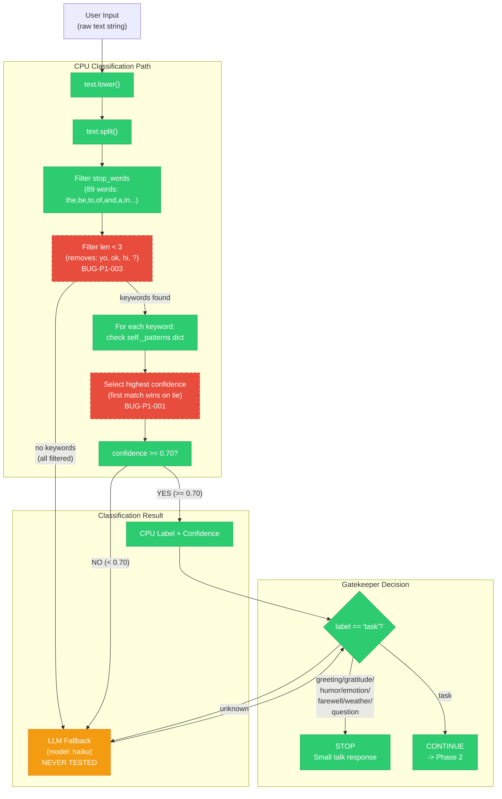

# Diagram: Phase 1 — Small Talk CPU Node Flow

## PM Status Summary

```
STATUS SUMMARY
=======================================
DONE/STABLE:    5 components (lowercasing, splitting, stop_word filter, keyword lookup, threshold check)
IN-PROGRESS:    1 component  (LLM fallback path)
PENDING/BUG:    2 components (tie-breaking logic, min-length filter)
=======================================
```

| Component | Status | Bug ID | Notes |
|-----------|--------|--------|-------|
| `text.lower()` | DONE | — | Works correctly for all inputs including ALL CAPS, mIxEd |
| `text.split()` | DONE | — | Whitespace splitting stable |
| Stop-word filter | DONE | — | 89 words filtered; "question" label dead is a seed gap, not a filter bug |
| Min-length filter | BUG | BUG-P1-003 | Drops valid short inputs like "hi", "yo", "ok" |
| Pattern lookup | BUG | BUG-P1-001 | First-match-wins tie-breaking kills tasks after greetings |
| Threshold check | DONE | — | >= 0.70 gate working correctly |
| LLM fallback | IN-PROGRESS | — | Path exists but never tested with real LLM call |
| Gatekeeper | DONE | — | label != "task" stops pipeline correctly |

## Data Flow



### Legend

```
DONE (green, solid):           Component works correctly, tests pass
IN-PROGRESS (yellow, solid):   Component exists but untested or partially implemented
BUG (red, dashed border):      Component has a known bug filed against it
```

## Key Decision Points

| # | Decision | Code Location | Behavior |
|---|----------|--------------|----------|
| 1 | Stop word filtering | `cpu_learner.py:extract_keywords()` | 89 words removed. Includes "what","how","why" — kills "question" label |
| 2 | Min length filter | `cpu_learner.py:extract_keywords()` | < 3 chars removed. Kills "yo","ok","hi" |
| 3 | Pattern lookup | `cpu_learner.py:predict()` | First keyword match wins on tie (position-dependent) |
| 4 | Threshold check | `cpu_learner.py:can_handle()` | >= 0.70 -> CPU classifies; < 0.70 -> LLM |
| 5 | Gatekeeper | `triple_twin.py:_run_phase()` | label != "task" -> pipeline stops |

## Bug Hotspots (identified by QA)

1. **Step 3**: First-match-wins tie-breaking. "Hello fix tests" -> "hello" matches first -> greeting -> STOPS pipeline
2. **Step 1**: "what","how","why" in stop_words -> "question" label can NEVER be triggered by CPU
3. **Step 2**: min 3-char filter -> ultra-short greetings ("hi","yo") go to LLM even though they're simple
4. **Step 4**: All shipped seeds have count=25 -> identical confidence 0.882 -> ties everywhere

## Test Coverage

| Component | Test File | Test Exists? | Status |
|-----------|-----------|:------------:|--------|
| `text.lower()` | `test_cpu_learner.py` | YES | PASS — lowercasing verified for ASCII, ALL CAPS, mIxEd |
| `text.split()` | `test_cpu_learner.py` | YES | PASS — whitespace splitting verified |
| Stop-word filter (89 words) | `test_cpu_learner.py` | YES | PASS — all 89 stop words confirmed removed |
| Min-length filter (< 3 chars) | `test_cpu_learner.py` | YES | PASS-BUG — filter works but drops valid inputs (BUG-P1-003) |
| Pattern lookup (keyword matching) | `test_cpu_learner.py` | YES | PASS — keyword-to-label matching works |
| Tie-breaking (first-match-wins) | `test_edge_cases.py` | YES | FAIL — BUG-P1-001 confirmed by prompts #3, #5, #11, #18, #19 |
| Threshold gate (>= 0.70) | `test_cpu_learner.py` | YES | PASS — threshold boundary verified |
| LLM fallback (haiku call) | — | PENDING | No test exists — LLM path never exercised with real model |
| Gatekeeper (task vs non-task) | `test_triple_twin.py` | YES | PASS — pipeline routing verified |
| Seed distribution balance | `test_edge_cases.py` | YES | PASS-EDGE — 87.8% task seeds documented (BUG-P1-005) |
