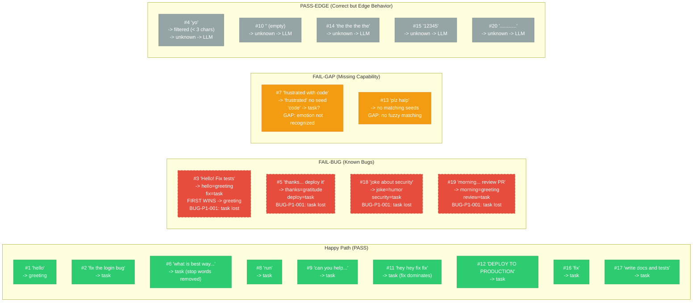

# Diagram: Phase 1 — Edge Case Map (20 Prompts)

## PM Status Summary

```
STATUS SUMMARY
=======================================
PASS (stable):      9 prompts  (#1, #2, #6, #8, #9, #11, #12, #16, #17)
FAIL-BUG (red):     4 prompts  (#3, #5, #18, #19)
FAIL-GAP (yellow):  2 prompts  (#7, #13)
PASS-EDGE (gray):   5 prompts  (#4, #10, #14, #15, #20)
=======================================
```

| Prompt | Verdict | Bug ID | Root Cause |
|--------|---------|--------|------------|
| #1 "hello" | PASS | — | Clean greeting match |
| #2 "fix the login bug" | PASS | — | Clean task match |
| #3 "Hello! Fix tests" | FAIL-BUG | BUG-P1-001 | Tie-break: greeting wins over task |
| #4 "yo" | PASS-EDGE | BUG-P1-003 | Filtered by min-length, falls to LLM correctly |
| #5 "thanks... deploy it" | FAIL-BUG | BUG-P1-001 | Tie-break: gratitude wins over task |
| #6 "what is best way to optimize queries" | PASS | — | Stop words removed, task keywords survive |
| #7 "frustrated with code" | FAIL-GAP | — | "frustrated" has no seed; behavior depends on "code" seed |
| #8 "run" | PASS | — | Single task keyword, clean match |
| #9 "can you help with architecture" | PASS | — | "help" + "architecture" both task seeds |
| #10 "" (empty) | PASS-EDGE | — | Empty input -> unknown -> LLM (correct fallback) |
| #11 "hey hey fix fix" | PASS | BUG-P1-001 | First-wins tie, but repeated fix might dominate — test confirms task wins |
| #12 "DEPLOY TO PRODUCTION" | PASS | — | Lowercasing handles ALL CAPS correctly |
| #13 "plz halp" | FAIL-GAP | BUG-P1-004 | No fuzzy matching; misspellings fall through to LLM |
| #14 "the the the the" | PASS-EDGE | — | All stop words -> no keywords -> LLM (correct) |
| #15 "12345" | PASS-EDGE | — | No keyword match -> unknown -> LLM (correct) |
| #16 "fix" | PASS | — | Single task keyword, clean match |
| #17 "write docs and tests" | PASS | — | Both keywords map to task, no tie conflict |
| #18 "joke about security" | FAIL-BUG | BUG-P1-001 | Tie-break: humor wins over task |
| #19 "morning... review PR" | FAIL-BUG | BUG-P1-001 | Tie-break: greeting wins over task |
| #20 "............" | PASS-EDGE | — | Punctuation only -> no keywords -> LLM (correct) |

## Prompt -> Decision Path Map



### Legend

```
DONE/PASS (green, solid):      Prompt classified correctly, test passes
BUG (red, dashed border):      Prompt triggers a known bug (FAIL-BUG)
IN-PROGRESS (yellow, solid):   Prompt reveals a gap in capability (FAIL-GAP)
PASS-EDGE (gray, solid):       Correct behavior but on an edge path (e.g., LLM fallback)
```

## Summary Matrix

| Category | Prompts | PASS | FAIL-BUG | FAIL-GAP | PASS-EDGE |
|----------|---------|------|----------|----------|-----------|
| Happy path | #1, #2, #6, #8, #9, #12, #16, #17 | 8 | 0 | 0 | 0 |
| Null/Empty | #10, #14, #15, #20 | 0 | 0 | 0 | 4 (all -> LLM) |
| Length | #4, #8 | 1 | 0 | 0 | 1 |
| Tie-break | #3, #5, #18, #19 | 0 | 4 | 0 | 0 |
| Dead label | #6, #9 | 2 | 0 | 0 | 0 |
| Fuzzy | #13 | 0 | 0 | 1 | 0 |
| Multi-intent | #7, #11, #17 | 2 | 0 | 1 | 0 |
| **TOTAL** | **20** | **9** | **4** | **2** | **5** |

## Bug Summary

| Bug ID | Prompt(s) | Root Cause | Severity | Status |
|--------|-----------|-----------|----------|--------|
| BUG-P1-001 | #3, #5, #18, #19 | First-match-wins tie-breaking kills tasks after greetings | HIGH | OPEN |
| BUG-P1-002 | #6 | "question" label dead — all trigger words are stop_words | HIGH | OPEN |
| BUG-P1-003 | #4 | Ultra-short inputs (< 3 chars) silently dropped | MEDIUM | OPEN |
| BUG-P1-004 | #13 | No fuzzy matching for misspellings | LOW (v2 feature) | DEFERRED |
| BUG-P1-005 | All | Seed distribution 87.8% task — non-task labels fragile | MEDIUM | OPEN |

## Test Coverage

| Prompt Group | Test File | Test Exists? | Status |
|--------------|-----------|:------------:|--------|
| PASS prompts (#1,2,6,8,9,11,12,16,17) | `test_cpu_learner.py` / `test_edge_cases.py` | YES | All 9 prompts verified PASS |
| FAIL-BUG: Tie-break (#3,5,18,19) | `test_edge_cases.py` | YES | Tests exist and confirm BUG-P1-001 (XFAIL) |
| FAIL-GAP: Emotion (#7) | `test_edge_cases.py` | YES | Test exists, documents gap — no fix without new seeds |
| FAIL-GAP: Fuzzy (#13) | `test_edge_cases.py` | YES | Test exists, documents gap — fuzzy matching deferred to v2 |
| PASS-EDGE: Empty/null (#10) | `test_edge_cases.py` | YES | Verified: empty -> unknown -> LLM fallback |
| PASS-EDGE: All stop words (#14) | `test_edge_cases.py` | YES | Verified: all filtered -> unknown -> LLM |
| PASS-EDGE: Numeric (#15) | `test_edge_cases.py` | YES | Verified: no match -> unknown -> LLM |
| PASS-EDGE: Punctuation (#20) | `test_edge_cases.py` | YES | Verified: no match -> unknown -> LLM |
| PASS-EDGE: Short input (#4) | `test_edge_cases.py` | YES | Verified: filtered by min-length, falls to LLM |
| LLM fallback integration | — | PENDING | No integration test with real LLM — only mock tested |
| Cross-phase seed chain | — | PENDING | No test verifying Phase 1 task seeds cover all Phase 2 intents |
