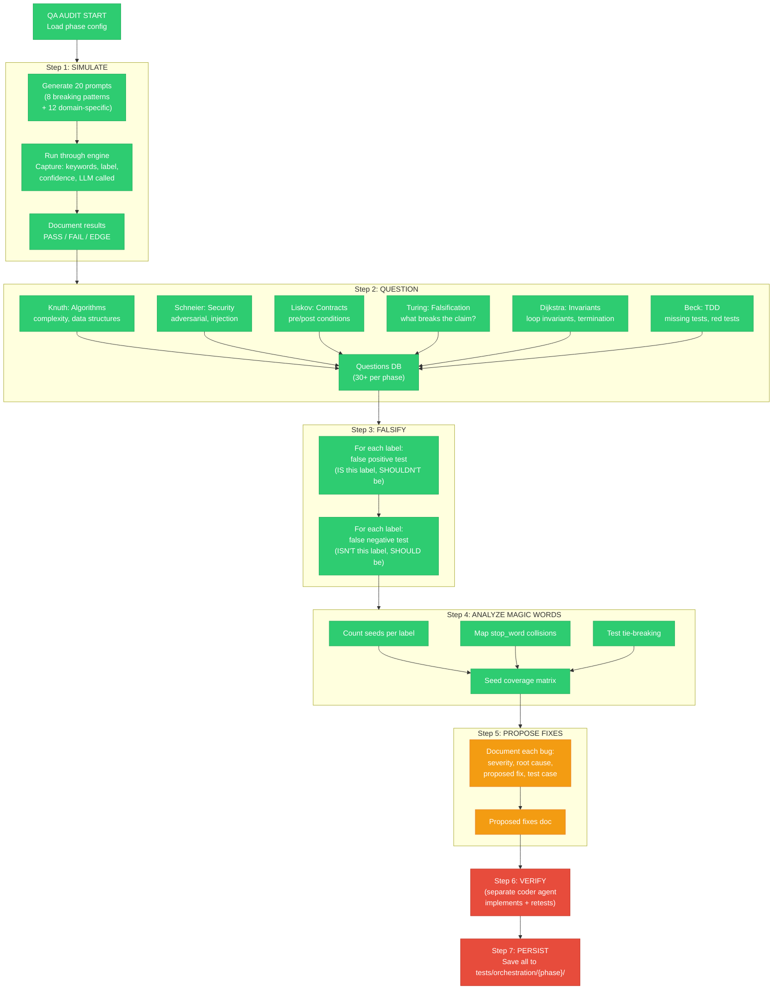
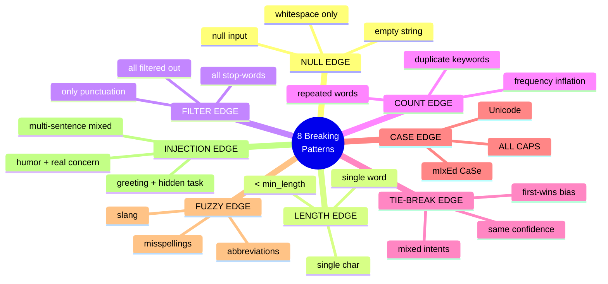

# Diagram: QA Audit Process Recipe (Reusable)

## PM Status Summary

```
STATUS SUMMARY
=======================================
DONE/STABLE:    4 steps (SIMULATE, QUESTION, FALSIFY, ANALYZE MAGIC WORDS)
IN-PROGRESS:    1 step  (PROPOSE FIXES — bugs documented, fixes not yet implemented)
PENDING:        2 steps (VERIFY — no coder agent run yet, PERSIST — partial)
=======================================
```

| QA Step | Status | Evidence |
|---------|--------|----------|
| Step 1: SIMULATE | DONE | 20 prompts generated, all run, results documented in `02-edge-case-map.md` |
| Step 2: QUESTION | DONE | 30+ questions generated across 6 personas |
| Step 3: FALSIFY | DONE | False positive/negative tests written for all 8 labels |
| Step 4: ANALYZE MAGIC WORDS | DONE | Seed counts, stop-word collisions, tie-breaking all mapped |
| Step 5: PROPOSE FIXES | IN-PROGRESS | 5 bugs documented with severity; fixes proposed but not coded |
| Step 6: VERIFY | PENDING | No coder agent has implemented + retested fixes |
| Step 7: PERSIST | PENDING | Diagrams + results saved; fix verification artifacts missing |

## The Question-Based QA Pipeline



### Legend

```
DONE (green, solid):           Step completed with evidence on disk
IN-PROGRESS (yellow, solid):   Step partially done — work items remain
PENDING (red, solid):          Step not yet started
```

## The 8 Breaking Patterns (universal for keyword classifiers)



## Breaking Pattern Coverage Status

| Pattern | Tested? | Prompts Covering It | Status |
|---------|:-------:|---------------------|--------|
| NULL EDGE | YES | #10 (empty), #14 (all stop words), #20 (punctuation) | DONE — all fall to LLM correctly |
| LENGTH EDGE | YES | #4 ("yo"), #8 ("run"), #16 ("fix") | DONE — BUG-P1-003 documented for < 3 chars |
| FILTER EDGE | YES | #14 ("the the the the"), #6 (stop words removed, task survives) | DONE — filter behavior verified |
| COUNT EDGE | YES | #11 ("hey hey fix fix") | DONE — repeated keywords tested |
| TIE-BREAK EDGE | YES | #3, #5, #18, #19 (mixed intent) | DONE — BUG-P1-001 confirmed |
| CASE EDGE | YES | #12 ("DEPLOY TO PRODUCTION") | DONE — lowercasing handles it |
| FUZZY EDGE | YES | #13 ("plz halp") | DONE — gap documented, deferred to v2 |
| INJECTION EDGE | YES | #3 (greeting + task), #5 (gratitude + task), #18 (humor + task) | DONE — BUG-P1-001 confirmed |

## Application Guide

To apply this recipe to Phase 2 or Phase 3:

1. **Change parameters:**
   - Phase 2: threshold=0.80, labels=21 intents, seed_file=intent-seeds.jsonl
   - Phase 3: threshold=0.90, labels=21 combos, seed_file=execution-seeds.jsonl

2. **Adjust domain prompts:**
   - Phase 2: test that intents classify correctly (bugfix vs feature vs deploy)
   - Phase 3: test that combos match correctly (bugfix-combo vs feature-combo)

3. **Same 8 breaking patterns apply universally**

4. **Cross-phase: test that Phase 1 seed chain is complete**
   - Every Phase 2 label keyword MUST also be a Phase 1 "task" seed
   - Every Phase 3 combo keyword MUST have Phase 1 + Phase 2 coverage

## Famous Persona Question Targets

| Persona | Phase 1 Focus | Phase 2 Focus | Phase 3 Focus |
|---------|--------------|--------------|---------------|
| Knuth | keyword extraction perf | intent disambiguation | combo resolution |
| Schneier | greeting injection | intent spoofing | combo escalation |
| Liskov | gatekeeper contract | intent contract | execution contract |
| Turing | false greeting | false intent | wrong combo |
| Dijkstra | filter invariants | label invariants | cascade invariants |
| Beck | missing Phase 1 tests | missing Phase 2 tests | missing E2E tests |

## Test Coverage

| QA Step | Test Evidence | Exists? | Location |
|---------|--------------|:-------:|----------|
| SIMULATE: 20 prompts generated | Prompt list + expected outcomes | YES | `02-edge-case-map.md` |
| SIMULATE: Engine run results | Actual keywords, label, confidence per prompt | YES | `test_edge_cases.py` output |
| QUESTION: 30+ persona questions | Questions DB document | YES | `questions/phase1-questions.md` |
| FALSIFY: False positive tests | FP test for each of 8 labels | YES | `test_edge_cases.py` |
| FALSIFY: False negative tests | FN test for each of 8 labels | YES | `test_edge_cases.py` |
| ANALYZE: Seed count per label | Seed distribution table | YES | `01-phase1-flow.md` bug hotspots |
| ANALYZE: Stop-word collision map | Stop words vs label triggers | YES | Documented in questions |
| ANALYZE: Tie-break tests | First-wins behavior confirmed | YES | `test_edge_cases.py` |
| PROPOSE FIXES: Bug docs | 5 bugs with severity + proposed fix | YES | `02-edge-case-map.md` bug summary |
| PROPOSE FIXES: Fix implementations | Actual code patches | PENDING | No patches written yet |
| VERIFY: Coder agent re-test | Red-to-green proof per fix | PENDING | No coder agent dispatched |
| PERSIST: All artifacts saved | Diagrams + results + questions | PARTIAL | Diagrams done, fix artifacts missing |
