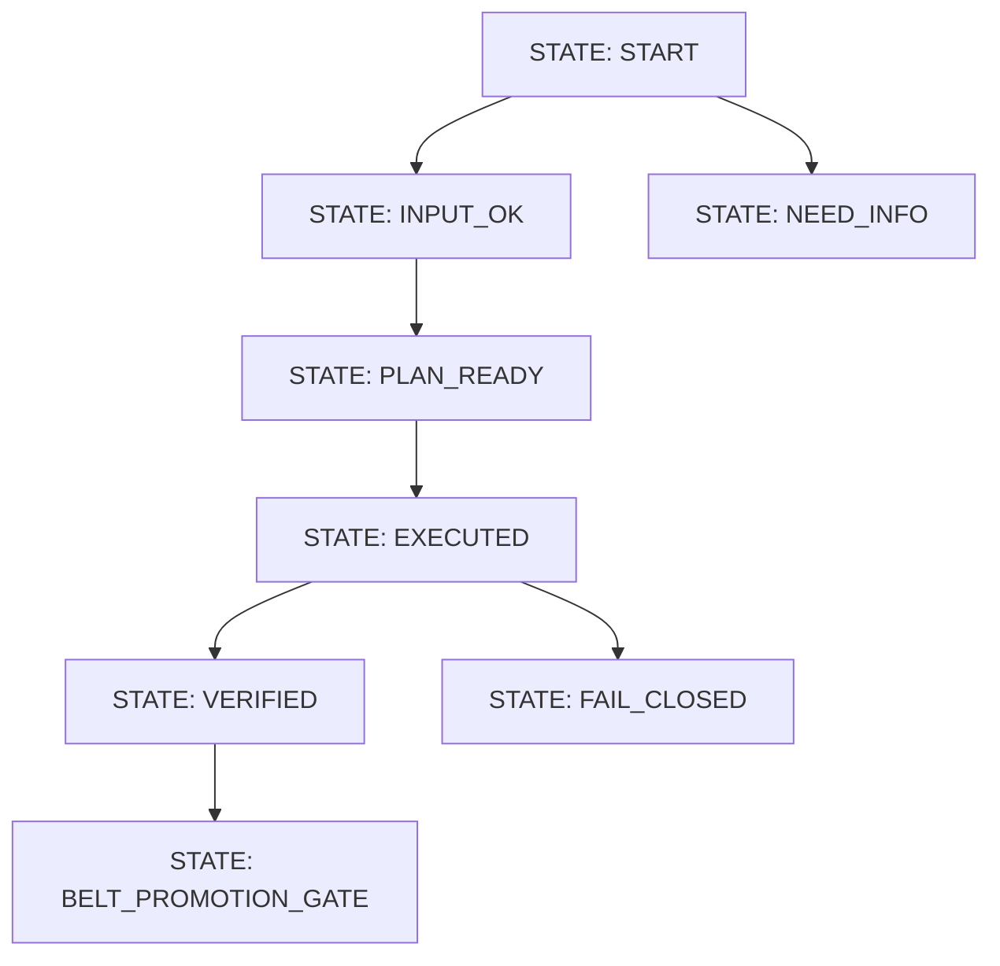

# Wish Prime Mermaid Template

## Notes

- Replace state names with concrete feature states.
- List forbidden states in notebook text and test for them.
- Export canonical body to `.mmd` and hash to `.sha256`.
- Include quest metadata and belt promotion criteria in companion markdown.
